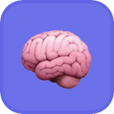

# The Curator

<p align="center">
  
</p>

<p align="center">
  <a href="https://opensource.org/licenses/MIT"></a>
  <a href="https://nodejs.org/"></a>
  <a href="https://www.apple.com/macos/"></a>
  <a href="https://github.com/talirezun/the-curator"></a>
  <br>
  <a href="https://github.com/talirezun/the-curator/blob/main/package.json"></a>
  <a href="https://github.com/talirezun/the-curator"></a>
</p>

A local, AI-powered knowledge curation system. Drop in a PDF, article, or note — The Curator automatically atomizes it into an interlinked wiki of entities, concepts, and summaries. Chat with your knowledge in a multi-turn AI conversation. Explore everything as a visual knowledge graph in Obsidian. Sync seamlessly across computers via a private GitHub repository.

Built on the [Karpathy llm-wiki](https://gist.github.com/karpathy/442a6bf555914893e9891c11519de94f) concept: instead of one giant notebook where everything gets lost, you maintain **dedicated, compounding wikis per domain** (e.g. AI/Tech, Business, Personal Growth). Each one gets smarter with every source you add.

> Your job is to curate sources, ask the right questions, and think about what it all means.
> The Curator's job is everything else — summarizing, cross-referencing, filing, and bookkeeping.

---

## Product Demo

<p align="center">
  
</p>

<p align="center">
  <em>See The Curator in action: drop a PDF, watch it atomize into an interlinked wiki, explore the knowledge graph, and chat with your knowledge.</em>
</p>

---

## How it works

```
1. Drop in a PDF, article, or note
         ↓
2. The Curator reads it and writes 5–15 interlinked wiki pages
   (summary + entity pages + concept pages, with YAML frontmatter)
         ↓
3. Chat with your knowledge — multi-turn AI conversation
   with full memory, cited answers, persistent history
         ↓
4. Open Obsidian → explore the auto-colored visual knowledge graph
         ↓
5. Sync Up → your knowledge is on GitHub, available everywhere
```

Everything is stored as plain markdown files on your computer. No subscriptions, no database,
no cloud accounts — except a free Gemini API key.

---

## Core Concept: Curation, Not Retrieval

Most AI integrations use RAG (Retrieval-Augmented Generation): the AI scans raw files,
retrieves chunks at query time, and forgets everything the moment the chat ends.
It rediscovers knowledge from scratch on every question. Nothing compounds.

The Curator works differently. When you ingest a source:

- The AI reads it, extracts key people/tools/ideas, and **writes persistent wiki pages**
- On every subsequent ingest, it updates existing pages rather than creating duplicates
- Cross-references are baked in — the contradictions are flagged, the synthesis is maintained
- The wiki compounds with every source you add

The knowledge is **compiled once and kept current** — not re-derived on every query.
This is the shift from a file cabinet to a neural network.

---

## Features

- Drop in a `.pdf`, `.txt`, or `.md` file — the AI does the rest
- **Atomic Decomposition** — automatic extraction of *Entities* (people, tools, companies),
  *Concepts* (ideas, techniques, frameworks), and *Summaries* (source narratives)
- Every page cross-references related pages with `[[wiki-links]]`
- **YAML frontmatter on every page** — structured metadata (`type`, `tags`, `created`)
  that powers Obsidian's Properties panel, Dataview queries, and automatic graph coloring
- **Auto-colored knowledge graph** — type tags (`type/entity`, `type/concept`, `type/summary`)
  let Obsidian color-code every node automatically; set it up once, every future ingest colors itself
- **Multi-turn AI chat** with persistent conversation history — ask follow-ups, connect the dots
  across sources, pick up where you left off
- Visual knowledge graph via [Obsidian](https://obsidian.md) (free app, reads the same files)
- **GitHub sync** — one-time 3-minute setup, then Sync Up / Sync Down across any number of computers
- **Domain management** — create, rename, and delete domains from the UI; four AI-tuned templates
  auto-generate the right schema
- **Settings tab** — manage API keys, view version info, and check for updates from within the app
- **Wiki Health tab** — one-click scan for broken links, orphans, duplicate entities, folder-prefix violations, and missing backlinks. Auto-fix categories rewrite in place; broken links with a suggested target get an **Apply** button (and a bulk **Apply all suggestions** action); genuine ambiguities stay review-only. Review-only rows now also get a ✨ **Ask AI** button that uses your configured LLM: for **broken links** it proposes a target; for **orphans** it proposes up to 5 existing pages that should link to the orphan — each with an AI-written bullet description. An opt-in **Scan for semantic duplicates** feature also finds pages that describe the same concept under different slugs (e.g. `[[email]]` + `[[e-mail]]`, `[[rag]]` + `[[retrieval-augmented-generation]]`) — with cost preview, user-configurable ceiling, and a mandatory Preview-diff safety gate before any merge. See [docs/ai-health.md](docs/ai-health.md).
- **First-run onboarding wizard** — guided 3-step setup (API keys, create a domain, sync) on first launch
- **Live UI updates** — domain stats, wiki pages, and page counts refresh automatically after ingest and sync — no manual browser reload needed
- **Auto-update** — check for updates in Settings; the app pulls the latest version, rebuilds the Dock app, and restarts automatically
- **One-command installer** — auto-detects and installs Node.js, builds the Dock app, opens on completion
- Supports **Google Gemini** (recommended, very cheap) and **Anthropic Claude**
- Three built-in domains: AI/Tech · Business/Finance · Personal Growth
- Add unlimited custom domains — no terminal or file editing required
- Mac Dock app — double-click to launch, no terminal needed

---

## Three ways to explore your knowledge

| Mode | Tool | Best for |
|------|------|----------|
| **Chat** | Built-in AI (Chat tab) | "How does X relate to Y?", synthesising across sources, multi-turn conversation |
| **Visual** | Obsidian graph view | Seeing the full knowledge map, spotting clusters, browsing pages |
| **Frontier LLM** | Claude Desktop via *My Curator* MCP bridge (v2.3+) | Deep research with Opus / Sonnet over the full graph — tags, links, backlinks, topology |

All three read the same markdown files — no sync or export needed between them. Set up *My Curator* from the Settings tab; see [`docs/mcp-user-guide.md`](docs/mcp-user-guide.md).

---

## Who This Is For: Use Cases

The Curator is domain-agnostic. It works for anyone who accumulates knowledge over time
and wants it organized, connected, and queryable rather than scattered.

### Content Creators (Writers, Podcasters, YouTubers)
Ingest all your reading material and research. When outlining a new video or article,
open the Obsidian graph and look at the largest Concept nodes to see which themes
you naturally gravitate toward. Click any Entity node to see every source you've read
about that person or tool — generating a rich, fully cited script in minutes.
Turns passive consumption into a content assembly line.

### Researchers & Academics
Batch-upload 20+ PDFs on a topic. The Curator extracts all distinct methodologies
(Concepts) and authors (Entities). Use the graph's "Idea Collisions" to identify gaps
in the literature — intersections between concepts that no existing paper has addressed.
Query the chat to synthesise findings across all papers simultaneously with source citations.

### Executives & Strategists
Upload quarterly reports, competitor analyses, and meeting transcripts.
Build an "Expertise Map" where the most-referenced nodes grow largest — giving you
a visual heat map of where your intelligence is concentrated and where the gaps are.
Query: *"Synthesise the main friction points from the last 20 customer interviews."*
The Curator connects dots across months of documents, bypassing recency bias entirely.

### Software Architects & Development Teams
Ingest architecture decision records (ADRs), API specs, post-mortems, and README files.
The app builds a dependency graph of your codebase's *decisions*, not just its code.
New team members can ask: *"Why did we choose Postgres over MongoDB for the auth service?"*
and get an answer cited directly from an ADR written years ago.

### Medical & Scientific Researchers
Drop in clinical trial PDFs and academic papers. The Curator extracts Entities
(genes, proteins, drugs, compounds) and Concepts (pathways, methodologies, biomarkers).
The graph reveals hidden intersections — a compound used in one domain showing efficacy
in a completely different study — by visually bridging nodes across your entire literature corpus.

### Entrepreneurs & Startup Founders
Feed the app customer interview transcripts, investor updates, and market research reports.
Build an external "Board of Advisors" from your own collected intelligence.
If considering a product pivot, see which Concept nodes are growing fastest.
Query the chat for synthesised strategic answers grounded entirely in your own research.

### Personal Growth & Self-Analysis
Ingest journal entries, book highlights, therapy notes, and podcast summaries.
The app extracts recurring Entities (people, situations, environments) and
Concepts (anxiety triggers, flow states, core values). Query: *"What themes recur
on high-stress days?"* The Curator connects dots across months of journaling
with the objectivity of a third party.

---

## Quick start

### Option A — One-command installer (Mac, recommended)

Paste this into Terminal and press Enter:

```bash
curl -fsSL https://raw.githubusercontent.com/talirezun/the-curator/main/install.sh | bash
```

The script auto-detects and installs Node.js if needed, clones the repo, installs dependencies, and builds **The Curator.app** — all in one step. When it finishes, the app opens automatically. An onboarding wizard walks you through API key setup on first launch.

> **Optional:** The repo includes a `research/` folder with articles and papers about second brain architecture. This is **not required to run the app**. If you want to save disk space after installation, you can safely delete `~/the-curator/research/` — the app will work perfectly without it. The research folder is available for interested users who want to explore the concepts behind The Curator.

---

### Option B — Manual setup

**Prerequisites**
- [Node.js 18+](https://nodejs.org) (free)
- A [Google Gemini API key](https://aistudio.google.com/app/apikey) (free)
- [Obsidian](https://obsidian.md) for the knowledge graph (free, optional)

```bash
# 1. Clone the project
git clone https://github.com/talirezun/the-curator.git
cd the-curator

# 2. Install dependencies
npm install

# 3. Start the server
node src/server.js
```

Open **http://localhost:3333** in your browser.

> **API keys:** The onboarding wizard appears on first launch and asks for your key. You can also add or change keys anytime in the **Settings** tab. Alternatively, developers can create a `.env` file manually (`cp .env.example .env`) and set `GEMINI_API_KEY` there.

> For the Mac Dock app (double-click to launch, no Terminal needed), see **[docs/mac-app.md](docs/mac-app.md)**.

> First time? Read the full **[User Guide](docs/user-guide.md)** — it covers every step in plain
> language, including how to get your API key, how to use the chat, and how to set up Obsidian.

---

## Chat with your knowledge

The **Chat tab** is a full multi-turn conversation interface. Ask anything about your wiki —
the AI answers from your own pages, cites its sources, and remembers the entire conversation
thread. Past conversations are saved and survive server restarts.

```
You:  What is RAG and why does it matter?
AI:   RAG combines retrieval with generation… [source: concepts/rag.md]

You:  How does it compare to fine-tuning?
AI:   As I mentioned, the key advantage is… [source: summaries/rag-paper.md]
```

Create multiple conversations per domain. Delete old ones. Pick up any thread later.

---

## Manage your domains

The **Domains tab** is a full GUI for creating, renaming, and deleting domains — no Finder or terminal needed.

**Create a domain** — type a display name, pick a template, and click Create. The folder and schema are generated automatically:

| Template | Best for |
|----------|----------|
| ⚙️ Tech / AI | Software, AI research, developer tools |
| 📈 Business / Finance | Startups, investing, strategy |
| 🌱 Personal Growth | Books, habits, mental models |
| 📁 Generic | Any other topic |

**Rename** — click the pencil icon. The folder is renamed on disk; all wiki pages, conversations, and Obsidian links update instantly.

**Delete** — click the trash icon. The confirmation panel shows exact page and conversation counts before you commit.

> If GitHub sync is configured, a rename or delete shows a reminder to Sync Up so all your computers stay consistent.

---

## Sync across computers

The **Sync tab** connects The Curator to a private GitHub repository so your wiki and chat history are available on every machine.

**One-time setup (~3 minutes):**
1. Create a free private repository on GitHub
2. Generate a Personal Access Token with `repo` scope
3. Open the Sync tab → follow the 3-step wizard

**Daily use:**
- Click **Sync Up** after working on any computer
- Click **Sync Down** before starting on a different computer

What syncs: wiki pages, chat history, domain schemas.
What stays local: source files, API keys, app code.

See [docs/sync.md](docs/sync.md) for the full guide.

---

## Using Obsidian for the knowledge graph

After ingesting your first document, open Obsidian → **Open folder as vault** → select your **Knowledge Base folder** (shown in the Domains tab → Knowledge Base Location). Click the graph icon to see all your knowledge as an interactive, zoomable network.

> **Tip:** The Domains tab shows your Knowledge Base Location path and has a **Copy** button — paste it directly into Obsidian's vault picker.

**Activate graph colors (one-time setup):** In Graph View → ⚙ → Groups, create three groups:

| Group | Query | Color |
|-------|-------|-------|
| Entities | `tag:#type/entity` | Blue |
| Concepts | `tag:#type/concept` | Green |
| Summaries | `tag:#type/summary` | Purple |

Every future ingest auto-colors new nodes — no manual work needed. See the [User Guide](docs/user-guide.md#12-see-your-knowledge-graph-in-obsidian) for full instructions.

---

## The Terminology

The Curator uses precise language for what it does. Understanding these terms helps you get the most out of it:

| Term | Definition |
|------|-----------|
| **Atomic Decomposition** | Breaking a large document into three discrete network components: Entities, Concepts, and Summaries |
| **Entities (The Nouns)** | Specific people, companies, tools, datasets — nodes with a proper name |
| **Concepts (The Verbs/Ideas)** | Broad theories, techniques, frameworks, principles — ideas without a single owner |
| **Summaries (The Glue)** | The narrative that connects specific entities to concepts for a given source |
| **Semantic Intelligence** | The system's ability to read raw text, comprehend context, and extract structured knowledge |
| **Hidden Relations** | Intersections between concepts that only become visible in the graph — what search bars can never show you |
| **Contextual Provenance** | The ability to trace any synthesised idea back to its exact source page |
| **Network Compounding** | Each new source updates existing pages rather than duplicating — knowledge builds on itself |

---

## Project structure

```
the-curator/
├── src/
│   ├── server.js           Express server (port 3333)
│   ├── routes/             API route handlers
│   ├── brain/
│   │   ├── llm.js          LLM abstraction (Gemini + Claude)
│   │   ├── ingest.js       Ingest pipeline (single-pass + multi-phase for large docs)
│   │   ├── chat.js         Multi-turn chat with persistent conversations
│   │   ├── sync.js         GitHub sync (git --git-dir / --work-tree)
│   │   └── files.js        Filesystem helpers
│   └── public/             Web UI (vanilla JS, no build step)
├── domains/
│   └── <domain>/
│       ├── CLAUDE.md       Domain schema (instructions for the AI)
│       ├── raw/            Your original uploaded files (local only)
│       ├── wiki/           Auto-generated knowledge pages
│       └── conversations/  Saved chat threads
├── scripts/                Maintenance utilities (dedup, repair, bulk-reingest)
├── images/                 App icon in multiple sizes
└── docs/                   Full documentation
```

---

## Documentation

| | |
|-|-|
| [User Guide](docs/user-guide.md) | Full setup + usage guide for all levels |
| [Use Cases](docs/use-cases.md) | Detailed workflows for every user profile |
| [Sync Guide](docs/sync.md) | GitHub sync — setup, daily workflow, troubleshooting |
| [Mac App Setup](docs/mac-app.md) | Double-click Dock launcher for Mac |
| [Adding Domains](docs/adding-domains.md) | Create domains via UI or manually |
| [Domain Schemas](docs/domain-schemas.md) | Customise how the AI structures knowledge |
| [API Reference](docs/api-reference.md) | REST API documentation |
| [Architecture](docs/architecture.md) | System design for developers |

---

## Security

- API keys can be stored via the **Settings** tab (saved in `.curator-config.json`) or in `.env` — both are gitignored, never committed
- Sync token lives in `.sync-config.json` — gitignored, never committed
- The app runs entirely on your local machine — the only outbound calls are to Gemini/Claude and (when syncing) to your own private GitHub repo
- Do not expose the server on a public network (it has no authentication)

---

## License

MIT — see [LICENSE](LICENSE).
