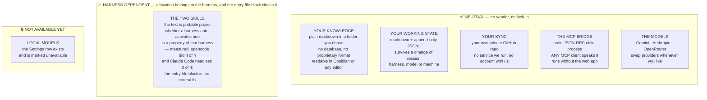

# The Curator

<p align="center">
  <picture>
    <source media="(prefers-color-scheme: dark)" srcset="images/mark-on-dark.svg" />
    
  </picture>
</p>

<p align="center">
  <a href="#licensing"></a>
  <a href="https://nodejs.org/"></a>
  <a href="https://github.com/talirezun/the-curator/releases"></a>
  <a href="#option-c--manual-setup-windows--linux--mac"></a>
  <a href="https://github.com/talirezun/the-curator"></a>
  <br>
  <a href="https://mycurator.xyz"></a>
  <a href="https://github.com/talirezun/the-curator/blob/main/package.json"></a>
  <a href="https://github.com/talirezun/the-curator/actions/workflows/test.yml"></a>
  <a href="https://github.com/talirezun/the-curator"></a>
</p>

<p align="center"><strong>Build a second brain from what you read, share it with a team, and give it to your agents.</strong></p>

<p align="center"><strong>Official website: <a href="https://mycurator.xyz">mycurator.xyz</a></strong> — ask its assistant anything about The Curator.</p>

## What it is, in plain words

One knowledge folder on your own computer, three things you can do with it — always in this
order, and each one optional past the first:

| | What it is | Where |
|---|---|---|
| ① **Second brain** | Your reading, turned into a wiki that compounds with every source | Domains, Chat |
| ② **Shared Brain** *(optional)* | The same wiki, written together with a team | a domain's Shared Brain section |
| ③ **Agent memory** *(optional)* | What your agents read at the start of a session, and save as they work | Context |

A local app that turns what you read into a compounding wiki, shares it with a cohort, and holds
your projects' context — Documents, Memory and Knowledge — so any agent, in any harness,
resumes where the last one stopped. Plain markdown, in your own repo.

**The Curator is the context engine.** It builds and keeps the context your work runs on — what you
have read, where the work stands, and the documents a project is built against — as plain markdown
files on your own computer, and carries all three across sessions, machines, AI tools and models.

The building half is what you touch first. You drop in the things you read — PDFs, Markdown and
text files: articles, notes, transcripts — and The Curator turns them into a connected personal
wiki: a page for every person, tool and idea worth one, all linked to each other. Every new source
**updates the pages that already exist** instead of adding another copy, so the wiki gets better
the more you feed it, and you can ask it questions in ordinary language and get answers that point
at the pages they came from. None of it needs an account, a database, or anything of yours on
anyone else's server.

### The three kinds of context it carries

| Kind | What it holds | How it changes | Example |
|---|---|---|---|
| **Compounded knowledge** — the wiki | Entities, concepts and summaries, cross-linked into a graph | **Accumulates** — a new source updates existing pages instead of duplicating them | A page per person, tool and idea across everything you have read |
| **Volatile state** — the standing brief, the handoff, the journal (on screen since v3.65.1: **Memory**) | Where a piece of work stands, per project | **Supersedes** — each save replaces the last, because a resolved blocker must not come back | Where you stopped, what you decided, what to do next |
| **Canonical documents** — foundations, new in v3.59.0 (on screen since v3.65.1: **Documents**) | Architecture, decisions, conventions, roadmap — verbatim | **Replaced whole** — always added through two doors, **Add from this computer** and **Add from GitHub**, both always enabled; since v3.69.0 one project can mix documents written here, copied in, and mirrored from up to 8 folders and GitHub repositories at once, each kept fresh by its own Refresh | The document an agent should not start work without |

Since v3.62.0 you also choose **which** foundations an agent is handed automatically: mark a
document **read first** and its text reaches every session, and everything else arrives as an index
an agent opens by name when the work calls for it. A project's standing brief carries a
*"Read before you…"* section for saying which document suits which kind of work. Since v3.67.0
each document has a third state too, **not at start**, and each project has its own reading
budget — since v3.70.0, seven presets named in tokens, Index only (0) through Max (200k) — under
the governing rule **"the right context, not all of it": an agent gets its foundations, the last
state and the standing brief at the start; everything else is on demand.** Step ④ draws that
bootstrap as a **context-window meter** — your window to scale, your harness estimate hatched, and
The Curator's own share broken out layer by layer — so "the right context" is something you can
actually see next to "all of it."

Knowledge accumulates, state supersedes, a canonical document is replaced whole and read verbatim.
Which of the three a thing belongs in is the most useful distinction in the product, and the one
that repays learning first — [the decision table](docs/working-state.md#1-the-problem-it-solves)
spells it out. All three live in one domain folder and sync together, and the two an agent needs
before it can start — the state and the canonical documents — arrive in a single MCP call.

### Two audiences

Most people arrive for one of these. Both write the same markdown, and neither is a mode you
switch into.

| If you | You want |
|---|---|
| read a lot and want to keep it | a **domain**: ingest → wiki → chat → Obsidian → sync → Shared Brain |
| work across sessions with agent harnesses | a **project**: foundations → working state → agents over MCP or the `my-curator` command |

These are not two products. A book, a thesis or a research programme outlives any one session —
which is the day the second becomes the first's future.

**On a Mac, [download the app](#option-a--download-the-mac-app-dmg) and you are running in a
couple of minutes.** On Windows and Linux it runs as a local server you open in your browser —
same code, same release, same features.

---

## Your brain → your team's brain → your agents' brain

The three kinds above are *what* is carried. This is *who reads it* — the arc the product name
has always pointed at. Any editor opens the files. Your own private GitHub repo syncs them. Any
local MCP client — an AI assistant allowed to launch a small helper program on your machine, like
Claude Desktop, Claude Code or Cursor — reads and writes them.

**That last part is the whole argument.** Claude Projects, ChatGPT Projects and Cursor rules each
hold your accumulated context inside one vendor's product, and you leave it behind on the day you
switch tools — or switch models, or switch machines. The Curator's answer is structural rather
than clever: **there is no proprietary store to leave behind.** Three layers, one format, one
owner — you.

| Layer | What it holds | How it behaves |
|---|---|---|
| **1. Your brain** — a personal wiki per domain | What you have read and understood: entities, concepts, summaries, all cross-linked | Knowledge **accumulates** — every source adds to existing pages instead of duplicating them |
| **2. Your team's brain** — [Shared Brain](docs/shared-brain-user-guide.md) *(opt-in)* | The same, built collectively by a cohort, team or research group; your other domains never leave your machine | Knowledge **accumulates**, collectively |
| **3. Your agents' brain** — [working state](docs/working-state.md), called **Memory** on screen since v3.65.1 | Where the work stands, per **project** — what is settled, what to do next, what was already tried and ruled out — plus that project's **foundations** (on screen: **Documents**), its canonical documents held verbatim. A domain holds as many projects as you build in it | State **supersedes** — each save replaces the previous handoff, because a resolved blocker must not come back. A foundation is **replaced whole** |

Layers 1 and 2 are built by *ingesting* sources — that is the means, not the point. Layer 3 is
written by your agent at the end of a session and read at the start of the next one, so
the work survives a change of session, agent, model, harness *(the app you run the agent in)*
*or* machine. Since v3.59.0 it also carries **foundations**: a project's architecture, decisions
and conventions, mirrored byte-for-byte from its repository or written by an agent you asked, so
they travel with the project instead of staying locked inside a code checkout that only one
machine has ([working-state.md](docs/working-state.md#the-foundations-tier--canonical-documents-that-travel)).

> Your job is to curate sources, ask the right questions, and think about what it all means.
> The Curator's job is everything else — summarizing, cross-referencing, filing, and bookkeeping.

Built on the [Karpathy llm-wiki](https://gist.github.com/karpathy/442a6bf555914893e9891c11519de94f)
concept: instead of one giant notebook where everything gets lost, you keep **dedicated,
compounding wikis per domain**. Each one gets smarter with every source you add.

**Does carrying state change the answers?** Our own measurement, not a benchmark, and small — one
seeded project, one open question, two providers, 8 runs, $0.074. *Without* the working state the
model proposed a command the project had already recorded as failed in **3 of 4** runs, and an
architecture the team had ruled out in **4 of 4**. With the handoff present: **0 of 4** for both.
Read that as the shape of the effect at N=4 per condition, not a constant —
[method and caveats](docs/use-cases.md#r-anyone-who-codes-with-agents-across-sessions-tools-and-machines).

> **Two honest boundaries.** The MCP bridge is a **stdio child process** — a small program your
> assistant starts on your own computer and talks to directly — so a client has to be
> able to spawn a local program to reach it; a browser-only assistant is out of scope by
> construction, not by choice. And capture is **advisory**: nothing forces an agent to save, and a
> missed save returns the *previous* state — stale, never corrupted.

### Making capture real (v3.63.0)

Advisory is honest, and on its own it was not enough: measured across 16 headless runs, an agent on
one popular harness saved **0 of 4** times from the skill alone, with no error to see. Three things
now sit around that gap.

**A command, `my-curator`.** The same store, from a shell, with the app closed, no network and no
credential: `context` prints a project's bootstrap, `save` writes a complete handoff from standard
input, `doctor` reports what is wired on this machine, `install-hooks` wires a harness. It is a
second **local client**, exactly as the bridge is — never a server, never reachable from a browser.
(The binary is namespaced: `curator` belongs to Elastic's widely-installed
`elasticsearch-curator`, and this package never links that name.)

**Hooks, where a harness has a usable one.** A hook may **ask**, **inject** or **record** — it may
never compose a handoff, because a fabricated one is worse than a missing one. Eleven of the
fourteen harnesses in the adapter table have some lifecycle hook, and they disagree about
everything: three accept a hook that **never fires**, and one caps a session-end hook at three
seconds, which is not long enough to finish a save. So reach is **measured per harness, and
unmeasured is labelled unmeasured** — in the product and in the docs, with the protocol that would
change a row written down. Nothing here is described as working before it has been run.

**The first row has now been run (v3.64.0).** Claude Code, 2026-09-20, four runs per arm: with the
hooks installed, the `SessionStart` hook injected the project's context in **4 of 4** sessions and
**4 of 4** saved a handoff before stopping. In the same mode the `Stop` hook **never fired** — not
once in six headless sessions — and without the hook, five of six save attempts ran a shell command
named after the tool instead of calling it. Thirteen of the fourteen rows still read *not
measured*, and say so.

**A meter, so you can tell.** Project context now opens its Working-state step with one line —
*"6 sessions in the last 30 days · 4 started with the context · 4 saved before stopping · 2 read and
did not save"* — computed from a local, content-free log of which tools were called. In words, never
a percentage. It reports and never blocks.

**And the format is public.** [`docs/spec/working-state-v1.md`](docs/spec/working-state-v1.md) is
the on-disk contract — layout, the machine-name rule and the merge hazard it prevents, the section
grammar, the budgets, the manifest schema — so a tool that is not The Curator can read and write
your working state without this codebase. A suite parses that document against the live constants on
every test run, so it cannot quietly drift from the code.

**One more thing for people with two computers:** a project's mirrored canonical documents can now
be refreshed from the **GitHub repository** itself, not only from a checkout on the one machine that
has it. Read-only by construction, with a separate read-only token recommended rather than reusing
your sync credential — set it once in **Settings → Knowledge base → GitHub read-only token** (v3.65.2),
which shows only its last four characters back and offers a one-click **Test** against a named
repository before you rely on it.

---

## A look inside

<p align="center">
  <picture>
    <source media="(prefers-color-scheme: dark)" srcset="docs/images/curator-chat-dark.png">
    
  </picture><br>
  <em>Ask across one domain's wiki: every answer cites the pages it was built from, as numbered markers plus one Sources list, and the domain, project, length and model are composer pills. Every screenshot on this page is taken on a synthetic demo workspace — <code>node scripts/screenshots.mjs</code> regenerates them.</em>
</p>

---

## How it works

```
1. Drop in a PDF, a Markdown file or a text file
         ↓
2. The Curator reads it and writes an interlinked set of wiki pages
   (one summary + entity pages + concept pages, with YAML frontmatter)
         ↓
3. Chat with your knowledge — multi-turn, cited answers, streamed as they
   are written, saved threads
         ↓
4. Open Obsidian → explore the auto-colored visual knowledge graph
         ↓
5. Sync → your knowledge backs up to your own private GitHub repo
         ↓
6. (optional) Join a Shared Brain → your opted-in domain contributes to a
   collective wiki; everyone's reading compounds together
         ↓
7. (optional) Point an agent at a domain over MCP → one call at the start of a
   session hands it the brief, the last handoff and the project's canonical
   documents; it saves where the work stands again at the end
         ↓
8. (optional, Mac app) Turn on the menu bar icon → glance at what your agents
   have just saved without opening the app
```

**The app is three places** (since v3.64.0), read as *ask · knowledge · context*:

| Place | What you do there |
|---|---|
| **Chat** | Ask across one domain's wiki — and, with a project pinned, its context as well. |
| **Domains** | One subject at a time: its overview, its sources, its pages, its projects, its Shared Brain connections and its wiki health. |
| **Context** | One project's canonical documents, the working state your agents read and write, and how often they actually did. |

Sync and Settings sit in the rail's footer. Ingest and Shared Brain are no longer rail entries —
they are sections of the domain page they describe, and each full-page view is still one press
away from its section.

Everything is a plain markdown file on your computer. No subscriptions, no database, no cloud
account — only an API key from Google Gemini, Anthropic or OpenRouter.

**How many pages you get is the model's call, not a constant.** The pinned default is measured
at 18–20 outline pages per source and the catalogue spans 5 to 27 on the same document; Settings
→ Providers & keys prints the figure for whichever model you pick, beside its price.

<p align="center">
  <picture>
    <source media="(prefers-color-scheme: dark)" srcset="docs/images/curator-domains-dark.png">
    
  </picture><br>
  <em>One domain is one compounding wiki: the counts, then Ingest, then the pages themselves — every page a file on disk you can open in any editor.</em>
</p>

→ The technical deep dive on step 2 — every safeguard, every failure mode, the quality contract —
is [docs/ingestion-pipeline.md](docs/ingestion-pipeline.md).

---

## Curation, not retrieval

Most AI integrations use RAG: the AI scans raw files, retrieves chunks at query time, and forgets
everything the moment the chat ends. It rediscovers your knowledge from scratch on every question.
Nothing compounds.

The Curator works differently. When you ingest a source, the AI reads it, extracts the key
people / tools / ideas, and **writes persistent wiki pages**. Every subsequent ingest updates
those pages instead of creating duplicates. Cross-references are baked in; contradictions get
flagged; the synthesis is maintained.

The knowledge is **compiled once and kept current**, not re-derived on every query. There is no
vector database, no embeddings and no index to rebuild — the `[[wikilink]]` graph *is* the
structure, and it is hand-curated by the thing that wrote it.

---

## Vendor-neutral by construction

Nobody should be locked into a harness that owns their accumulated context. That is not a slogan
bolted on afterwards — it is why the storage is plain files, why the bridge is a protocol rather
than an integration, and why there is no service of ours anywhere in the picture.


```mermaid
flowchart TD
    subgraph NEUTRAL["✅ NEUTRAL — no vendor, no lock-in"]
        direction TB
        S1[YOUR KNOWLEDGE<br/>plain markdown in a folder you chose<br/>no database, no proprietary format<br/>readable in Obsidian or any editor]
        S2[YOUR WORKING STATE<br/>markdown + append-only JSONL<br/>survives a change of session,<br/>harness, model or machine]
        S3[YOUR SYNC<br/>your own private GitHub repo<br/>no service we run, no account with us]
        S4[THE MCP BRIDGE<br/>stdio JSON-RPC child process<br/>ANY MCP client speaks it<br/>runs without the web app]
        S5[THE MODELS<br/>Gemini · Anthropic · OpenRouter<br/>swap providers whenever you like]
    end

    subgraph SHAPED["⚠️ HARNESS-DEPENDENT — activation belongs to the harness, and the entry-file block closes it"]
        direction TB
        K1[THE TWO SKILLS<br/>the text is portable prose;<br/>whether a harness auto-activates one<br/>is a property of that harness<br/>— measured, opencode did 4 of 4<br/>and Claude Code headless 0 of 4;<br/>the entry-file block is the neutral fix]
    end

    subgraph FUTURE["🔒 NOT AVAILABLE YET"]
        direction TB
        F1[LOCAL MODELS<br/>the Settings row exists<br/>and is marked unavailable]
    end
```

**What is *not* yet neutral — stated plainly, because overclaiming here would be worse than the gap:**

- **The two agent skills are portable prose; whether a harness *activates* one is the harness's
  behaviour, not the skill's and not Claude's.** Their bodies carry no vendor-specific logic, so
  they work anywhere you can paste them, and a harness-neutral form is **generated** from the same
  source rather than hand-copied — per-harness detail in [`skills/README.md`](skills/README.md).
  What varies is activation, and it varies by host rather than by vendor: measured, opencode loaded
  `curator-continuity` natively and ran it as its first action in 4 of 4 runs, while an agent on
  Claude Code saved in **0 of 4** headless runs with the skill alone. The harness-neutral mechanism
  is prose, not a file format — paste the block **Copy agent instructions** gives you into the file
  your harness already loads every session, which took Claude Code headless to 3 of 4. Four runs per
  arm, headless only, one task and one model: a shape, not a rate
  ([the measurement and its limits](docs/working-state.md#activation-put-the-discipline-where-the-harness-cannot-skip-it)).
- **Local models are not available.** The OpenRouter adapter speaks an OpenAI-*compatible*
  protocol — the name of a wire format, **not** OpenAI support — which is groundwork for local
  runtimes later, not a capability today.

→ Full detail, including what each guarantee concretely buys you:
[User Guide § 1c](docs/user-guide.md#1c-nothing-here-is-locked-to-one-ai-one-tool-or-one-company).

---

## Quick start

On a **Mac** you can download the app. On **Windows and Linux** — and on a Mac too, if you
prefer it — The Curator runs as a **local server you open in your browser**: one shell around
`src/`, not a fork, so the browser install is **not** a legacy path and is fully supported
everywhere.

### Option A — Download the Mac app (`.dmg`)

**[→ Download from the Releases page](https://github.com/talirezun/the-curator/releases)** — take
the newest release at the top. Two builds are attached to each one; you need exactly one:

| Your Mac | Download the `.dmg` with… |
|---|---|
| **Apple Silicon** (M1 and later) | **`arm64`** in the filename |
| **Intel** | **`x64`** in the filename |

Not sure which you have?  → **About This Mac**. *Chip: Apple M…* is Apple Silicon;
*Processor: Intel…* is Intel. It is a big download — about **140 MB** — because the app carries
its own runtime.

Then open the `.dmg` and **drag The Curator onto the Applications folder** in the window that
appears. Eject the disk image afterwards.

**Nothing below is hard — it is three clicks, once.** macOS asks you to confirm the very first
launch of any app it cannot yet identify, and The Curator is in that position until Apple
Developer enrolment completes. After that first confirmation you never see it again, not even
when the app updates itself. The honest detail:

> **⚠️ First launch — you have to allow it explicitly.**
>
> **The app is not yet signed with an Apple developer identity.** Apple Developer enrolment is
> in progress; until it completes, macOS cannot verify who built The Curator, so Gatekeeper
> refuses a plain double-click. That is a signing status, not a verdict on the app — everything
> that goes into it is in this repository.
>
> 1. Open **Applications** and double-click **The Curator**. macOS blocks it — dismiss the dialog.
> 2. Open **System Settings → Privacy & Security**, scroll down to **Security**, and click
>    **Open Anyway**. Confirm, and enter your password if asked.
> 3. Open the app again. The exception is remembered — you do this once, and **updates the
>    app installs for itself never ask again.**
>
> Don't leave a long gap between steps 1 and 2: the button appears only for a while after a
> blocked launch. If it isn't there, double-click the app again and go straight back.
>
> **Control-click → Open no longer works.** Apple removed that shortcut in macOS Sequoia (15);
> System Settings is the only route on Sequoia and later.
>
> These steps are what the app's signature state *should* produce — Apple's own
> `syspolicy_check` reports notarization as the only remaining problem — but nobody has yet
> launched a quarantined copy of a current build to watch which dialog appears. If you see
> something different, please [tell us](https://github.com/talirezun/the-curator/issues).
>
> **If macOS instead says the app *"is damaged and can't be opened"*** — and offers no Open
> Anyway button — **you have a build from `v3.30.0` or earlier.** Those shipped with a
> *broken* signature (a header declaring sealed contents the bundle did not have), which is a
> different and worse Gatekeeper class than "unidentified developer". **The fix is to download
> `v3.31.0` or later**, where that class is gone. If you must open an old build first:
>
> ```bash
> xattr -dr com.apple.quarantine "/Applications/The Curator.app"
> ```
>
> then open it normally. (Don't disable Gatekeeper system-wide to get around this.)

**One optional extra the browser install has no equivalent for:** a **menu bar icon** showing
what your agents have just saved, so you can check your state is written without leaving
what you are doing — a **save pulse** drawing the last seven days (with a "Saves by tool"
submenu, one strip per tool), then the last 24 hours' active work — one row per project and
tool, newest first, up to five rows with the rest behind a "+N more" — each with a coloured
freshness dot. Idle projects and your domains fold into one row each, and a single notice
appears when one tool's save replaced another's (since v3.74.0). It is **off by default** —
a fresh install has no agent memory, so an on-by-default icon would have nothing to show — and
lives in **Settings → General → Menu bar**.
See [docs/user-guide.md § 6b](docs/user-guide.md#6b-the-menu-bar-icon-mac-app).

**After that it updates itself.** **The Curator → Check for Updates…** (or Settings → General)
downloads the new version, verifies it against the sha256 GitHub publishes on the asset, and
swaps it in, showing progress as it goes. You do not come back to this page for updates — the
Releases page is for a first install. An update installed this way carries **no Gatekeeper prompt
at all**, because macOS flags a file your *browser* downloads but not one the app fetched itself
— measured, with the browser download kept as the control.

**One limit, stated rather than glossed:** no automated run has ever replaced a real installed
application. The swap is proven against a real signed bundle in a test folder, and the design
makes a half-replaced app impossible — either the old one is complete or the new one is — but
the first real update is the first real test.

Your knowledge is plain markdown in a folder you chose, so nothing above affects it. Coming
from the shell installer below? Your wiki comes across untouched; you re-paste your API key and
re-run the MCP wizard — and point the app at your existing folder, which is
[one button and one trap](docs/user-guide.md#pick-the-folder-that-contains-your-domains). The
decisions behind the packaging — and, for each, whether code exists yet — are in
[docs/desktop-app-decisions.md](docs/desktop-app-decisions.md).

### Option B — One-command installer (Mac, no download)

```bash
curl -fsSL https://raw.githubusercontent.com/talirezun/the-curator/main/install.sh | bash
```

The script auto-detects and installs Node.js if needed, clones the repo, installs dependencies and
builds **The Curator.app**. When it finishes the app opens automatically, and a first-run guide
points you to API key setup.

> **Pin it to your Dock** — and note that closing the browser tab does *not* stop the server; it
> keeps running on virtually no CPU, so the Dock icon reopens it instantly. That, quitting properly
> and rebuilding the app are all in [docs/mac-app.md](docs/mac-app.md). The repo also ships a
> `research/` folder of second-brain articles that the app does not need — delete it for the disk
> space if you like.

### Option C — Manual setup (Windows / Linux / Mac)

**There is no Windows or Linux app**, so this is the way in on those platforms — and it is a
first-class one: ingest, chat, wiki, MCP, sync and Health are all here. The Node server runs
anywhere Node 18+ runs; only the `.dmg`, the one-line installer and the auto-built `.app` Dock
launcher are macOS-specific.

**Prerequisites:** [Node.js 18+](https://nodejs.org) · an API key from
[Google Gemini](https://aistudio.google.com/app/apikey) (free tier available),
[Anthropic](https://console.anthropic.com/) (paid only) or
[OpenRouter](https://openrouter.ai/) (one key onto many vendors) ·
[Obsidian](https://obsidian.md) for the graph (free, optional).

```bash
git clone https://github.com/talirezun/the-curator.git
cd the-curator
npm install
node src/server.js          # macOS / Linux
# Windows PowerShell:  $env:CURATOR_NO_OPEN=1; node src\server.js
```

Then open **http://localhost:3333**.

> **Windows / Linux notes:** the auto-update, Dock-app and folder-picker buttons are macOS-only;
> ingest, chat, wiki, MCP, sync and Health work identically. Set `DOMAINS_PATH=…` to point at your
> knowledge folder, and `CURATOR_NO_OPEN=1` to skip the macOS browser launch on startup.

> **Install with a coding agent** — Claude Code, Cursor, Cline and friends can do the whole thing
> from one pasted prompt: [User Guide § 20](docs/user-guide.md#20-install-with-a-coding-agent).

> **First time?** The [User Guide](docs/user-guide.md) covers every step in plain language —
> getting a key, real cost estimates, using the chat, and setting up Obsidian. For the whole
> product in one document — every capability, the scenarios it serves, and what it deliberately
> does not do — read the [Product Overview](docs/product-overview.md).

---

## What it costs

The Curator is free, open-source software. The only paid component is the AI provider you connect,
and only for the features that actually call an LLM. **Ingest is where nearly all of it goes**;
chat and AI-assisted Health cleanup are cents. Reading pages, managing domains, syncing,
structural Health scans and the MCP bridge itself cost nothing at all.

| Provider | Free tier? | Paid price | Real-world |
|---|---|---|---|
| **Gemini 2.5 Flash Lite** *(default)* | Yes, but [rate-limited](https://ai.google.dev/gemini-api/docs/rate-limits) — enough to try, not to work | $0.10/M in · $0.40/M out | **~€5/month** at heavy solo use |
| **Anthropic Claude Haiku 4.5** | No | $1/M in · $5/M out | 10× the Gemini bill on input, 12.5× on output |

Those are the *defaults*, not the only options. A hand-measured catalogue spans Gemini, Anthropic
and OpenRouter — free routes exist for chat, and on a connected install the app names the cheapest
measured model for you on the same screen. OpenRouter's pinned default is priced close to the
Gemini default ($0.09 in · $0.36 out per 1M tokens, measured against a billed call on 16 September
2026). Across the measured Gemini and Anthropic models the span is roughly
**50× on input and 62× on output**, so changing model rescales the rows above. An admin running
cohort-scale Shared Brain synthesis weekly is more like €10–20/month.

**Since v3.67.0, one model runs every AI job** — ingest, compile, wiki health, Shared Brain and
reading plans — and every button that spends money says so first: *"Runs on Flash Lite 2.5 · ≈6k
tokens · ≈$0.0012 · Change model"*, then, once it has run, *"Ran on Flash Lite 2.5 · 5,812 in / 640
out · $0.0008."* With no key the same buttons stay visible but disabled. Chat keeps its own
per-message model picker, separate from the one model everything else runs on.

<p align="center">
  <picture>
    <source media="(prefers-color-scheme: dark)" srcset="docs/images/curator-providers-keys-dark.png">
    
  </picture><br>
  <em>Start here: one key per provider. Once a key is in, step 2 names the one model every AI job runs on, with its measured price and pages per source.</em>
</p>

→ Full breakdown, the per-feature token table and the pricing math:
[User Guide § 19](docs/user-guide.md#19-api-keys-cost--free-tier) ·
model-by-model measurements: [§ 16b](docs/user-guide.md#16b-choosing-your-ai-model)

---

## Three ways into the same files

| Mode | Tool | Best for |
|------|------|----------|
| **Chat** | Built into the app | "How does X relate to Y?", synthesising across sources, multi-turn conversation — answers stream in as they are written, and on OpenRouter you can watch the model reason first ([§9](docs/user-guide.md#watching-the-answer-arrive--streaming-and-the-thinking-region)) |
| **Visual** | [Obsidian](https://obsidian.md) graph view | Seeing the whole map, spotting clusters, browsing pages |
| **Frontier model** | Any local MCP client — Claude Desktop, Claude Code, Cursor | Deep research over the full graph, plus reading and writing working state and a project's canonical documents |

They don't compete and they need no sync or export between them — all three read the same markdown.
→ [User Guide § 13](docs/user-guide.md#13-three-ways-to-talk-to-your-knowledge-chat--obsidian--mcp)

Keeping that graph honest is **Wiki Health**: one scan for broken links, orphans, duplicate
entities and missing backlinks — deterministic repairs are free and applied in place, AI-assisted
ones are previewed as a whole plan first, and destructive merges need a diff you have actually
looked at. → [AI Wiki Health Guide](docs/ai-health.md)

### Querying it with a frontier model

Building a second brain is rewarding. Querying it with a frontier model is the moment it becomes
irreplaceable. The **My Curator** MCP bridge exposes **twenty-four tools** — fourteen that read
(search, nodes, tags, backlinks, multi-hop traversal, cross-domain search, topology overview, the
original source document behind a summary, your projects, prior working state, and the one-call
project bootstrap that opens a session) and ten health/authoring tools, of which seven actually
change anything on disk. By capability rather than grouping: **seventeen read, seven write.** That
lets a model ask things a search bar cannot:

> *"What ideas in my AI domain have I never explicitly connected to my business strategy domain?"*

> *"Compile everything we just figured out and save it as a research summary in my business domain."*

This is not another way to read your files: it is graph-native access — topology, tags, links and
backlinks as first-class structured data — with citations, nothing leaving your machine, and the
conclusions committed back into the wiki so the next session builds on them. Setup takes under two
minutes from inside the app. → [MCP User Guide](docs/mcp-user-guide.md)

**Two skills make it work well out of the box.** [`skills/my-curator`](skills/my-curator/SKILL.md)
carries the writing discipline — ground every wikilink, refuse speculative links on a fresh domain,
respect domain siloing. [`skills/curator-continuity`](skills/curator-continuity/SKILL.md) carries
the session-handoff discipline; **install that one if you want working state at all**, because
nothing forces an agent to save, and an agent that has not been told the discipline never writes.
And because a harness can decline to activate the skill at all — measured, an agent on Claude Code
saved in **0 of 4** headless runs with the skill alone and **3 of 4** with a six-line block pasted
into `CLAUDE.md` — **Domains → Projects → Copy agent instructions** hands you that block, filled in
for your project, to paste into `CLAUDE.md`, `AGENTS.md`, `GEMINI.md` or your Cursor rules
([the measurement and its limits](docs/working-state.md#activation-put-the-discipline-where-the-harness-cannot-skip-it)).

<p align="center">
  <picture>
    <source media="(prefers-color-scheme: dark)" srcset="docs/images/curator-agent-memory-dark.png">
    
  </picture><br>
  <em>Layer 3, on disk: which project, which handoff, which tool on which machine, and how long ago an agent last wrote it down — here two tools, Claude Code and Antigravity, working one project.</em>
</p>

### Shared Brain — collective wikis (opt-in)

A cohort, team or research group builds one wiki together without merging personal data. Each
contributor keeps a private Curator; only opted-in domains push LLM-synthesised summaries to a
shared private GitHub repo, and the synthesised collective comes back as a separate read-only
mirror domain on every machine. Two-primitive security model (invite token = metadata only,
Personal Access Token = per-contributor identity), GDPR Article 17 erasure built in, and two IP
modes for cohorts vs. enterprises. It can also be **sold** — experts, educators and consultancies
can charge for access today, with no code changes.

→ Start with the [Shared Brain User Guide](docs/shared-brain-user-guide.md); architecture, admin
operations, compliance and monetization each have their own doc in the tables below.

---

## Who it's for

Content creators turning years of reading into a cited script · researchers batch-loading 20+ PDFs
and hunting the gaps between methodologies · executives synthesising months of reports and
interviews past their own recency bias · architecture teams asking *why* a decision was made years
ago · anyone orchestrating agents across sessions, tools and machines — building code, most often,
or research, design, a product.

→ Worked-through scenarios for every profile, plus cohort, team and monetization patterns:
[docs/use-cases.md](docs/use-cases.md)

---

## Documentation

**For users**

| | |
|-|-|
| [Official website](https://mycurator.xyz) | mycurator.xyz — the one-page overview, downloads, and an AI assistant that answers questions from these docs |
| [Product Overview](docs/product-overview.md) | **Start here for the whole picture.** Every capability and what it is for, the memory layer, the menu bar icon, worked scenarios, where the project stands, and an explicit "what this is not". Capability-level rather than technical — also the file to hand an AI agent that needs to understand The Curator |
| [User Guide](docs/user-guide.md) | Full setup + usage — install, ingest, chat, costs, MCP, Health, sync, troubleshooting |
| [Knowledge Immortality (essay)](research/articles/knowledge-immortality-second-brain.md) | The why — what a second brain is, why markdown matters, what compounding looks like in practice |
| [My Curator MCP Guide](docs/mcp-user-guide.md) | Connect your wiki to any MCP client for frontier-model research over the graph |
| [Working state](docs/working-state.md) | Carry build context between sessions, agents, models and machines; projects inside a domain; the foundations tier — canonical documents that travel with a project; what belongs in state vs. on a wiki page; the optional Mac menu bar icon over it |
| [Working state — the on-disk format (spec v1)](docs/spec/working-state-v1.md) | The PUBLIC contract: the bytes on disk, so a tool that is not The Curator can read and write your working state without this codebase. Versioned `working-state/1`, and kept true by a suite that parses it against the live constants |
| [Standing brief template](docs/project-brief-template.md) | A copyable `state/project.md` — the brief you write by hand so every agent on a project starts from the same instructions |
| [AI Wiki Health](docs/ai-health.md) | AI-assisted broken-link / orphan / semantic-duplicate cleanup — what each phase does and its tradeoffs |
| [Domains](docs/domains.md) | Managing domains, the schema, how domains relate to each other, custom templates, terminology |
| [Sync Guide](docs/sync.md) | Personal Sync — GitHub backup across your own computers (wizard, token permissions, what syncs, troubleshooting) |
| [Sync with a coding agent](docs/sync-via-coding-agent.md) | Automated sync setup via Claude Code / Cursor / opencode / Aider — one copy-paste prompt |
| [Shared Brain — User Guide](docs/shared-brain-user-guide.md) | Step-by-step for contributors and admins, daily workflow, troubleshooting, terminology |
| [Shared Brain — Monetization](docs/shared-brain-monetization.md) | Charging for brain access today using no-code payment platforms |
| [Use Cases](docs/use-cases.md) | Detailed workflows for every profile, including cohort, team and monetization scenarios |
| [System Check](docs/system-check.md) | Confirm the app itself is set up correctly (key, folder, credentials, sync), plus an optional AI connection test |
| [Mac App Setup](docs/mac-app.md) | Both Mac shapes — the downloadable `.dmg` app (first install, Gatekeeper, how it updates itself, the optional menu bar icon) and the Dock launcher the shell installer builds |
| [Skills](skills/README.md) | The two agent skills, what they enforce, and how portable they actually are |

**For developers**

| | |
|-|-|
| [Contributing](CONTRIBUTING.md) | Developer setup, running the tests (`npm test` / `npm run test:live`), adding a test, cutting a release |
| [Ingestion Pipeline](docs/ingestion-pipeline.md) | **The deep dive on the most important code path in The Curator** — every safeguard, every failure mode, the quality contract |
| [Architecture](docs/architecture.md) | System design — directory structure, the model router, where user data lives |
| [Native Mac app — decision record](docs/desktop-app-decisions.md) | **Decisions, not features.** One codebase / two shells, packaging, the release gate, migration and the MCP launcher — each with its reasoning, its evidence, and whether code exists for it yet |
| [Chat Streaming](docs/chat-streaming.md) | How a chat turn streams end to end — the wire format, reasoning vs. answer, and why a streamed attempt is never retried |
| [API Reference](docs/api-reference.md) | REST API documentation |
| [Model Lifecycle](docs/model-lifecycle.md) | Provider/model fallback policy, retiring deprecated models |
| [Shared Brain — Architecture](docs/shared-brain.md) | What it is, how it works internally, the engineering decisions, the roadmap |
| [Shared Brain — Admin Operations](docs/shared-brain-admin.md) | Synthesis cadence, revocation, contributor management |
| [Shared Brain — Compliance](docs/shared-brain-compliance.md) | GDPR / IP / data residency for organisations evaluating deployment |

---

## Licensing

**The Curator is open source under the MIT License** — the app, the interface, the ingest and chat
pipeline, Wiki Health, Personal Sync, the My Curator MCP server, every test suite, and all
documentation.

**Ten files are not.** We would rather tell you here than have you discover it later. The Shared
Brain *backend* modules — listed by exact path in
[`LICENSES/ENTERPRISE-FILES.txt`](LICENSES/ENTERPRISE-FILES.txt) — are **source-available** under
the [Curator Enterprise License](LICENSES/LICENSE-ENTERPRISE.txt). They stay fully readable,
forkable, auditable and free for personal use; what the license reserves is paid organizational
production use with storage backends **other than** the free GitHub one.

| What | Terms |
|---|---|
| The whole app, minus those 10 files | MIT. Unchanged. |
| Personal, educational, academic, evaluation, development, testing, research use | Free, always. |
| **The GitHub-backed Shared Brain — the one that exists today** | **Free for everyone, forever**, organizations included. That is written into the license (§3.1), not merely promised on this page. |
| All other organizational production use | **Free for this release, permanently.** Curator Enterprise license keys do not exist and cannot be purchased, so the license grants organizational production use of this release at no charge — and that grant does not lapse when keys appear. Later releases may drop the clause (§3.3, the grace clause). |
| Two years after any release | That release's enterprise-licensed files convert to the MIT License automatically (§5). |
| Anything you already have | Keeps the terms it shipped under, permanently (§6). |

**What "GitHub-backed" means:** ordinary github.com. The shipped app has `api.github.com` written
into it with no configurable endpoint, so as distributed it cannot reach GitHub Enterprise Server
or EU-residency Enterprise Cloud — those sit outside the forever-free grant, though they are still
free on this release like everything else.

**Nothing is being taken away from anyone.** Every release already installed stays under the
license it was published under; this applies going forward only. It exists so that a future paid
enterprise tier — Shared Brain running on storage the organization controls itself, for data
sovereignty — can help sustain the project, without ever moving the free version behind a gate.
The test suites deliberately stay MIT: they document how Shared Brain actually behaves, and we
want them readable, runnable and contributable.

Neither licence grants rights in the name or the logo — see [TRADEMARK.md](TRADEMARK.md), which
also spells out the nominative uses ("based on The Curator", "compatible with The Curator") that
need no permission at all.

The license text has not been reviewed by a lawyer, and says so at the top. If a clause blocks
something reasonable, [open an issue](https://github.com/talirezun/the-curator/issues) — the
wording is what should change.

---

## Security

- The app runs entirely on your local machine. The only outbound calls are to the AI provider you
  configured (Gemini, Claude or OpenRouter) and to GitHub — your own private repo when you sync,
  and the project's Releases when you check for updates.
- The server binds to `127.0.0.1` (loopback) only, so it is **not reachable from your local
  network**, and a cross-origin guard rejects state-changing requests from other web origins
  (CSRF / DNS-rebinding defence). It still has no per-request authentication — it is a single-user
  local app and should not be reverse-proxied onto a public network.
- Credential files (`.curator-config.json`, `.sync-config.json`, `.sharedbrain-config.json`,
  `.env`, and the `.knowledge-git/config` that holds your sync token) are gitignored, never
  committed, and written with `0600` owner-only permissions.

---

## License

MIT — see [LICENSE](LICENSE) — with one documented exception: ten Shared Brain backend files are
source-available under the [Curator Enterprise License](LICENSES/LICENSE-ENTERPRISE.txt), listed
by exact path in [`LICENSES/ENTERPRISE-FILES.txt`](LICENSES/ENTERPRISE-FILES.txt). The
GitHub-backed Shared Brain is free for everyone, forever, and nothing is restricted retroactively.
See [Licensing](#licensing) above for the plain-English summary.
