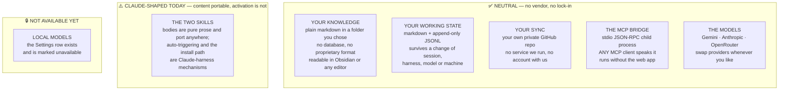

# The Curator

<p align="center">
  <picture>
    <source media="(prefers-color-scheme: dark)" srcset="images/mark-on-dark.svg" />
    
  </picture>
</p>

<p align="center">
  <a href="#licensing"></a>
  <a href="https://nodejs.org/"></a>
  <a href="https://www.apple.com/macos/"></a>
  <a href="#option-b--manual-setup-windows--linux--mac"></a>
  <a href="https://github.com/talirezun/the-curator"></a>
  <br>
  <a href="https://github.com/talirezun/the-curator/blob/main/package.json"></a>
  <a href="https://github.com/talirezun/the-curator/actions/workflows/test.yml"></a>
  <a href="https://github.com/talirezun/the-curator"></a>
</p>

## Your brain → your team's brain → your agents' brain

The Curator is where your **context** lives — both the knowledge you have accumulated and the
state of the work you are doing — as plain markdown files on your own machine. Any editor opens
them. Your own private GitHub repo syncs them. Any local MCP client reads and writes them.

**That last part is the whole argument.** Claude Projects, ChatGPT Projects and Cursor rules each
hold your accumulated context inside one vendor's product, and you leave it behind on the day you
switch tools — or switch models, or switch machines. The Curator's answer is structural rather
than clever: **there is no proprietary store to leave behind.** Three layers, one format, one
owner — you.

| Layer | What it holds | How it behaves |
|---|---|---|
| **1. Your brain** — a personal wiki per domain | What you have read and understood: entities, concepts, summaries, all cross-linked | Knowledge **accumulates** — every source adds to existing pages instead of duplicating them |
| **2. Your team's brain** — [Shared Brain](docs/shared-brain-user-guide.md) *(opt-in)* | The same, built collectively by a cohort, team or research group; your other domains never leave your machine | Knowledge **accumulates**, collectively |
| **3. Your agents' brain** — [working state](docs/working-state.md) | Where the work stands: what is settled, what to do next, what was already tried and ruled out | State **supersedes** — each save replaces the previous handoff, because a resolved blocker must not come back |

Layers 1 and 2 are built by *ingesting* sources — that is the means, not the point. Layer 3 is
written by your agent at the end of a session and read at the start of the next one, so
the work survives a change of session, agent, model, harness *or* machine.

> Your job is to curate sources, ask the right questions, and think about what it all means.
> The Curator's job is everything else — summarizing, cross-referencing, filing, and bookkeeping.

Built on the [Karpathy llm-wiki](https://gist.github.com/karpathy/442a6bf555914893e9891c11519de94f)
concept: instead of one giant notebook where everything gets lost, you keep **dedicated,
compounding wikis per domain**. Each one gets smarter with every source you add.

**Does carrying state change the answers?** Our own measurement, not a benchmark, and small — one
seeded project, one open question, two providers, 8 runs, $0.074. *Without* the working state the
model proposed a command the project had already recorded as failed in **3 of 4** runs, and an
architecture the team had ruled out in **4 of 4**. With the handoff present: **0 of 4** for both.
Read that as the shape of the effect at N=4 per condition, not a constant —
[method and caveats](docs/use-cases.md#r-anyone-who-codes-with-agents-across-sessions-tools-and-machines).

> **Two honest boundaries.** The MCP bridge is a **stdio child process**, so a client has to be
> able to spawn a local program to reach it — a browser-only assistant is out of scope by
> construction, not by choice. And capture is **advisory**: nothing forces an agent to save, and a
> missed save returns the *previous* state — stale, never corrupted.

---

## Demo

<p align="center">
  <br>
  <em>Drop in a PDF, watch it atomize into an interlinked wiki, explore the graph, chat with your knowledge.</em>
</p>

---

## How it works

```
1. Drop in a PDF, article, or note
         ↓
2. The Curator reads it and writes 5–15 interlinked wiki pages
   (one summary + entity pages + concept pages, with YAML frontmatter)
         ↓
3. Chat with your knowledge — multi-turn, cited answers, streamed as they
   are written, saved threads
         ↓
4. Open Obsidian → explore the auto-colored visual knowledge graph
         ↓
5. Sync → your knowledge backs up to your own private GitHub repo
         ↓
6. (optional) Join a Shared Brain → your opted-in domain contributes to a
   collective wiki; everyone's reading compounds together
         ↓
7. (optional) Point an agent at a domain over MCP → it saves where the
   work stands at the end of a session and reads it back at the start of the next
```

Everything is a plain markdown file on your computer. No subscriptions, no database, no cloud
account — only an API key from Google Gemini, Anthropic or OpenRouter.

→ The technical deep dive on step 2 — every safeguard, every failure mode, the quality contract —
is [docs/ingestion-pipeline.md](docs/ingestion-pipeline.md).

---

## Curation, not retrieval

Most AI integrations use RAG: the AI scans raw files, retrieves chunks at query time, and forgets
everything the moment the chat ends. It rediscovers your knowledge from scratch on every question.
Nothing compounds.

The Curator works differently. When you ingest a source, the AI reads it, extracts the key
people / tools / ideas, and **writes persistent wiki pages**. Every subsequent ingest updates
those pages instead of creating duplicates. Cross-references are baked in; contradictions get
flagged; the synthesis is maintained.

The knowledge is **compiled once and kept current**, not re-derived on every query. There is no
vector database, no embeddings and no index to rebuild — the `[[wikilink]]` graph *is* the
structure, and it is hand-curated by the thing that wrote it.

---

## Vendor-neutral by construction

Nobody should be locked into a harness that owns their accumulated context. That is not a slogan
bolted on afterwards — it is why the storage is plain files, why the bridge is a protocol rather
than an integration, and why there is no service of ours anywhere in the picture.


```mermaid
flowchart TD
    subgraph NEUTRAL["✅ NEUTRAL — no vendor, no lock-in"]
        direction TB
        S1[YOUR KNOWLEDGE<br/>plain markdown in a folder you chose<br/>no database, no proprietary format<br/>readable in Obsidian or any editor]
        S2[YOUR WORKING STATE<br/>markdown + append-only JSONL<br/>survives a change of session,<br/>harness, model or machine]
        S3[YOUR SYNC<br/>your own private GitHub repo<br/>no service we run, no account with us]
        S4[THE MCP BRIDGE<br/>stdio JSON-RPC child process<br/>ANY MCP client speaks it<br/>runs without the web app]
        S5[THE MODELS<br/>Gemini · Anthropic · OpenRouter<br/>swap providers whenever you like]
    end

    subgraph SHAPED["⚠️ CLAUDE-SHAPED TODAY — content portable, activation is not"]
        direction TB
        K1[THE TWO SKILLS<br/>bodies are pure prose and port anywhere;<br/>auto-triggering and the install path<br/>are Claude-harness mechanisms]
    end

    subgraph FUTURE["🔒 NOT AVAILABLE YET"]
        direction TB
        F1[LOCAL MODELS<br/>the Settings row exists<br/>and is marked unavailable]
    end
```

**What is *not* yet neutral — stated plainly, because overclaiming here would be worse than the gap:**

- **The two agent skills are portable in content but Claude-shaped in activation.** Their bodies
  are ordinary prose with no vendor-specific logic, so they work anywhere you can paste them; what
  is Claude-specific is how they *switch on*. A harness-neutral form is **generated** from the same
  source at build time rather than hand-copied — per-harness detail in
  [`skills/README.md`](skills/README.md). The consequence is worth naming: an agent in another
  harness can *read* working state over MCP fine — that half is pure protocol — but nothing tells
  it to **save**. The store is portable; the discipline that fills it is not yet.
- **Local models are not available.** The OpenRouter adapter speaks an OpenAI-*compatible*
  protocol — the name of a wire format, **not** OpenAI support — which is groundwork for local
  runtimes later, not a capability today.

→ Full detail, including what each guarantee concretely buys you:
[User Guide § 1c](docs/user-guide.md#1c-nothing-here-is-locked-to-one-ai-one-tool-or-one-company).

---

## Quick start

### Option A — One-command installer (Mac, recommended)

```bash
curl -fsSL https://raw.githubusercontent.com/talirezun/the-curator/main/install.sh | bash
```

The script auto-detects and installs Node.js if needed, clones the repo, installs dependencies and
builds **The Curator.app**. When it finishes the app opens automatically, and a first-run guide
points you to API key setup.

> **Pin it to your Dock** — and note that closing the browser tab does *not* stop the server; it
> keeps running on virtually no CPU, so the Dock icon reopens it instantly. That, quitting properly
> and rebuilding the app are all in [docs/mac-app.md](docs/mac-app.md). The repo also ships a
> `research/` folder of second-brain articles that the app does not need — delete it for the disk
> space if you like.

### Option B — Manual setup (Windows / Linux / Mac)

The Node server runs anywhere Node 18+ runs. Only the one-line installer and the auto-built `.app`
Dock launcher are macOS-specific.

**Prerequisites:** [Node.js 18+](https://nodejs.org) · an API key from
[Google Gemini](https://aistudio.google.com/app/apikey) (free tier available),
[Anthropic](https://console.anthropic.com/) (paid only) or
[OpenRouter](https://openrouter.ai/) (one key onto many vendors) ·
[Obsidian](https://obsidian.md) for the graph (free, optional).

```bash
git clone https://github.com/talirezun/the-curator.git
cd the-curator
npm install
node src/server.js          # macOS / Linux
# Windows PowerShell:  $env:CURATOR_NO_OPEN=1; node src\server.js
```

Then open **http://localhost:3333**.

> **Windows / Linux notes:** the auto-update, Dock-app and folder-picker buttons are macOS-only;
> ingest, chat, wiki, MCP, sync and Health work identically. Set `DOMAINS_PATH=…` to point at your
> knowledge folder, and `CURATOR_NO_OPEN=1` to skip the macOS browser launch on startup.

> **Install with a coding agent** — Claude Code, Cursor, Cline and friends can do the whole thing
> from one pasted prompt: [User Guide § 20](docs/user-guide.md#20-install-with-a-coding-agent).

> **First time?** The [User Guide](docs/user-guide.md) covers every step in plain language —
> getting a key, real cost estimates, using the chat, and setting up Obsidian.

---

## What it costs

The Curator is free, open-source software. The only paid component is the AI provider you connect,
and only for the features that actually call an LLM. **Ingest is where nearly all of it goes**;
chat and AI-assisted Health cleanup are cents. Reading pages, managing domains, syncing,
structural Health scans and the MCP bridge itself cost nothing at all.

| Provider | Free tier? | Paid price | Real-world |
|---|---|---|---|
| **Gemini 2.5 Flash Lite** *(default)* | Yes, but [rate-limited](https://ai.google.dev/gemini-api/docs/rate-limits) — enough to try, not to work | $0.10/M in · $0.40/M out | **~€5/month** at heavy solo use |
| **Anthropic Claude Haiku 4.5** | No | $1/M in · $5/M out | ~10× the Gemini bill for the same workload |

Those are the *defaults*, not the only options. A hand-measured catalogue spans Gemini, Anthropic
and OpenRouter — one route is free, and OpenRouter's pinned default is the cheapest way to build a
wiki. Across the measured Gemini and Anthropic models the span is roughly **50× on input and 62× on
output**, so changing model rescales the rows above. An admin running cohort-scale Shared Brain
synthesis weekly is more like €10–20/month.

→ Full breakdown, the per-feature token table and the pricing math:
[User Guide § 19](docs/user-guide.md#19-api-keys-cost--free-tier) ·
model-by-model measurements: [§ 16b](docs/user-guide.md#16b-choosing-your-ai-model)

---

## Three ways into the same files

| Mode | Tool | Best for |
|------|------|----------|
| **Chat** | Built into the app | "How does X relate to Y?", synthesising across sources, multi-turn conversation — answers stream in as they are written, and on OpenRouter you can watch the model reason first ([§9](docs/user-guide.md#watching-the-answer-arrive--streaming-and-the-thinking-region)) |
| **Visual** | [Obsidian](https://obsidian.md) graph view | Seeing the whole map, spotting clusters, browsing pages |
| **Frontier model** | Any local MCP client — Claude Desktop, Claude Code, Cursor | Deep research over the full graph, plus reading and writing working state |

They don't compete and they need no sync or export between them — all three read the same markdown.
→ [User Guide § 13](docs/user-guide.md#13-three-ways-to-talk-to-your-knowledge-chat--obsidian--mcp)

Keeping that graph honest is **Wiki Health**: one scan for broken links, orphans, duplicate
entities and missing backlinks — deterministic repairs are free and applied in place, AI-assisted
ones are previewed as a whole plan first, and destructive merges need a diff you have actually
looked at. → [AI Wiki Health Guide](docs/ai-health.md)

### Querying it with a frontier model

Building a second brain is rewarding. Querying it with a frontier model is the moment it becomes
irreplaceable. The **My Curator** MCP bridge exposes **twenty tools** — twelve that read (search,
nodes, tags, backlinks, multi-hop traversal, cross-domain search, topology overview, the original
source document behind a summary, and prior working state) and eight health/authoring tools, of
which five actually change anything on disk. That lets a model ask things a search bar cannot:

> *"What ideas in my AI domain have I never explicitly connected to my business strategy domain?"*

> *"Compile everything we just figured out and save it as a research summary in my business domain."*

This is not another way to read your files: it is graph-native access — topology, tags, links and
backlinks as first-class structured data — with citations, nothing leaving your machine, and the
conclusions committed back into the wiki so the next session builds on them. Setup takes under two
minutes from inside the app. → [MCP User Guide](docs/mcp-user-guide.md)

**Two skills make it work well out of the box.** [`skills/my-curator`](skills/my-curator/SKILL.md)
carries the writing discipline — ground every wikilink, refuse speculative links on a fresh domain,
respect domain siloing. [`skills/curator-continuity`](skills/curator-continuity/SKILL.md) carries
the session-handoff discipline; **install that one if you want working state at all**, because
nothing forces an agent to save, and an agent that has not been told the discipline never writes.

### Shared Brain — collective wikis (opt-in)

A cohort, team or research group builds one wiki together without merging personal data. Each
contributor keeps a private Curator; only opted-in domains push LLM-synthesised summaries to a
shared private GitHub repo, and the synthesised collective comes back as a separate read-only
mirror domain on every machine. Two-primitive security model (invite token = metadata only,
Personal Access Token = per-contributor identity), GDPR Article 17 erasure built in, and two IP
modes for cohorts vs. enterprises. It can also be **sold** — experts, educators and consultancies
can charge for access today, with no code changes.

→ [User Guide](docs/shared-brain-user-guide.md) ·
[Architecture & roadmap](docs/shared-brain.md) ·
[Admin operations](docs/shared-brain-admin.md) ·
[Compliance](docs/shared-brain-compliance.md) ·
[Monetization](docs/shared-brain-monetization.md)

---

## Who it's for

Content creators turning years of reading into a cited script · researchers batch-loading 20+ PDFs
and hunting the gaps between methodologies · executives synthesising months of reports and
interviews past their own recency bias · architecture teams asking *why* a decision was made years
ago · anyone coding with agents across sessions, tools and machines.

→ Worked-through scenarios for every profile, plus cohort, team and monetization patterns:
[docs/use-cases.md](docs/use-cases.md)

---

## Documentation

**For users**

| | |
|-|-|
| [User Guide](docs/user-guide.md) | Full setup + usage — install, ingest, chat, costs, MCP, Health, sync, troubleshooting |
| [Knowledge Immortality (essay)](research/articles/knowledge-immortality-second-brain.md) | The why — what a second brain is, why markdown matters, what compounding looks like in practice |
| [My Curator MCP Guide](docs/mcp-user-guide.md) | Connect your wiki to any MCP client for frontier-model research over the graph |
| [Working state](docs/working-state.md) | Carry build context between sessions, agents, models and machines; what belongs in state vs. on a wiki page |
| [AI Wiki Health](docs/ai-health.md) | AI-assisted broken-link / orphan / semantic-duplicate cleanup — what each phase does and its tradeoffs |
| [Domains](docs/domains.md) | Managing domains, the schema, how domains relate to each other, custom templates, terminology |
| [Sync Guide](docs/sync.md) | Personal Sync — GitHub backup across your own computers (wizard, token permissions, what syncs, troubleshooting) |
| [Sync with a coding agent](docs/sync-via-coding-agent.md) | Automated sync setup via Claude Code / Cursor / opencode / Aider — one copy-paste prompt |
| [Shared Brain — User Guide](docs/shared-brain-user-guide.md) | Step-by-step for contributors and admins, daily workflow, troubleshooting, terminology |
| [Shared Brain — Monetization](docs/shared-brain-monetization.md) | Charging for brain access today using no-code payment platforms |
| [Use Cases](docs/use-cases.md) | Detailed workflows for every profile, including cohort, team and monetization scenarios |
| [System Check](docs/system-check.md) | Confirm the app itself is set up correctly (key, folder, credentials, sync), plus an optional AI connection test |
| [Mac App Setup](docs/mac-app.md) | The Dock launcher — how it's built, how to use it, rebuilding, troubleshooting |
| [Skills](skills/README.md) | The two agent skills, what they enforce, and how portable they actually are |

**For developers**

| | |
|-|-|
| [Contributing](CONTRIBUTING.md) | Developer setup, running the tests (`npm test` / `npm run test:live`), adding a test, cutting a release |
| [Ingestion Pipeline](docs/ingestion-pipeline.md) | **The deep dive on the most important code path in The Curator** — every safeguard, every failure mode, the quality contract |
| [Architecture](docs/architecture.md) | System design — directory structure, the model router, where user data lives |
| [Chat Streaming](docs/chat-streaming.md) | How a chat turn streams end to end — the wire format, reasoning vs. answer, and why a streamed attempt is never retried |
| [API Reference](docs/api-reference.md) | REST API documentation |
| [Model Lifecycle](docs/model-lifecycle.md) | Provider/model fallback policy, retiring deprecated models |
| [Shared Brain — Architecture](docs/shared-brain.md) | What it is, how it works internally, the engineering decisions, the roadmap |
| [Shared Brain — Admin Operations](docs/shared-brain-admin.md) | Synthesis cadence, revocation, contributor management |
| [Shared Brain — Compliance](docs/shared-brain-compliance.md) | GDPR / IP / data residency for organisations evaluating deployment |

---

## Licensing

**The Curator is open source under the MIT License** — the app, the interface, the ingest and chat
pipeline, Wiki Health, Personal Sync, the My Curator MCP server, every test suite, and all
documentation.

**Ten files are not.** We would rather tell you here than have you discover it later. The Shared
Brain *backend* modules — listed by exact path in
[`LICENSES/ENTERPRISE-FILES.txt`](LICENSES/ENTERPRISE-FILES.txt) — are **source-available** under
the [Curator Enterprise License](LICENSES/LICENSE-ENTERPRISE.txt). They stay fully readable,
forkable, auditable and free for personal use; what the license reserves is paid organizational
production use with storage backends **other than** the free GitHub one.

| What | Terms |
|---|---|
| The whole app, minus those 10 files | MIT. Unchanged. |
| Personal, educational, academic, evaluation, development, testing, research use | Free, always. |
| **The GitHub-backed Shared Brain — the one that exists today** | **Free for everyone, forever**, organizations included. That is written into the license (§3.1), not merely promised on this page. |
| All other organizational production use | **Free for this release, permanently.** Curator Enterprise license keys do not exist and cannot be purchased, so the license grants organizational production use of this release at no charge — and that grant does not lapse when keys appear. Later releases may drop the clause (§3.3, the grace clause). |
| Two years after any release | That release's enterprise-licensed files convert to the MIT License automatically (§5). |
| Anything you already have | Keeps the terms it shipped under, permanently (§6). |

**What "GitHub-backed" means:** ordinary github.com. The shipped app has `api.github.com` written
into it with no configurable endpoint, so as distributed it cannot reach GitHub Enterprise Server
or EU-residency Enterprise Cloud — those sit outside the forever-free grant, though they are still
free on this release like everything else.

**Nothing is being taken away from anyone.** Every release already installed stays under the
license it was published under; this applies going forward only. It exists so that a future paid
enterprise tier — Shared Brain running on storage the organization controls itself, for data
sovereignty — can help sustain the project, without ever moving the free version behind a gate.
The test suites deliberately stay MIT: they document how Shared Brain actually behaves, and we
want them readable, runnable and contributable.

Neither licence grants rights in the name or the logo — see [TRADEMARK.md](TRADEMARK.md), which
also spells out the nominative uses ("based on The Curator", "compatible with The Curator") that
need no permission at all.

The license text has not been reviewed by a lawyer, and says so at the top. If a clause blocks
something reasonable, [open an issue](https://github.com/talirezun/the-curator/issues) — the
wording is what should change.

---

## Security

- The app runs entirely on your local machine. The only outbound calls are to the AI provider you
  configured (Gemini, Claude or OpenRouter) and, when syncing, to your own private GitHub repo.
- The server binds to `127.0.0.1` (loopback) only, so it is **not reachable from your local
  network**, and a cross-origin guard rejects state-changing requests from other web origins
  (CSRF / DNS-rebinding defence). It still has no per-request authentication — it is a single-user
  local app and should not be reverse-proxied onto a public network.
- Credential files (`.curator-config.json`, `.sync-config.json`, `.sharedbrain-config.json` and
  `.env`) are gitignored, never committed, and written with `0600` owner-only permissions.

---

## License

MIT — see [LICENSE](LICENSE) — with one documented exception: ten Shared Brain backend files are
source-available under the [Curator Enterprise License](LICENSES/LICENSE-ENTERPRISE.txt), listed
by exact path in [`LICENSES/ENTERPRISE-FILES.txt`](LICENSES/ENTERPRISE-FILES.txt). The
GitHub-backed Shared Brain is free for everyone, forever, and nothing is restricted retroactively.
See [Licensing](#licensing) above for the plain-English summary.
