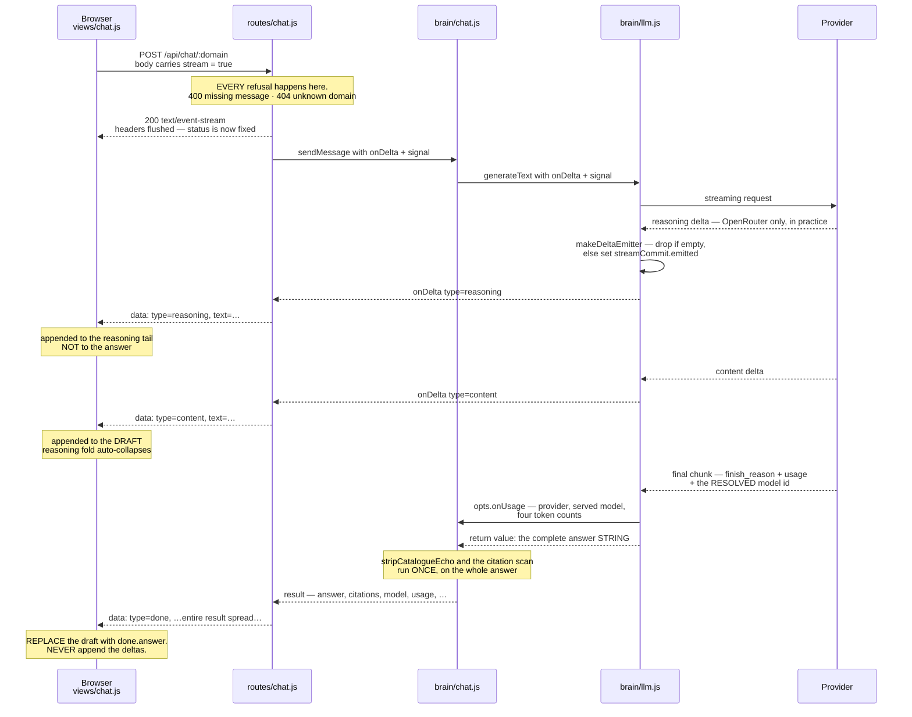
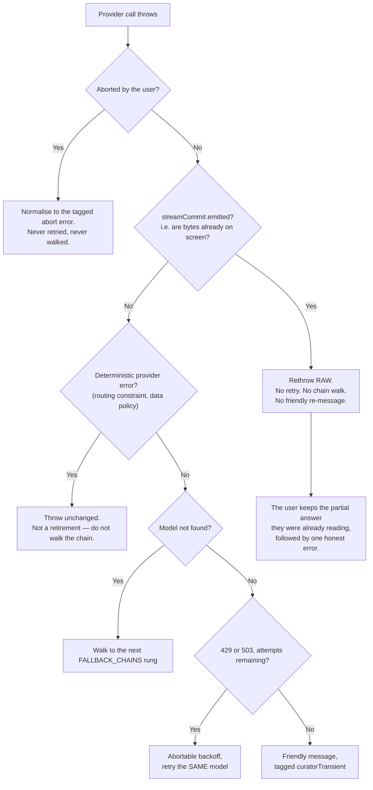

# Chat streaming (SSE)

A chat turn now streams. The answer — and, on one provider, the model's
reasoning — arrives incrementally instead of appearing all at once when the
whole turn finishes.

This is a **transport and presentation** change. Nothing about what a chat turn
retrieves, how it is prompted, what it costs, or what it persists moved. The
same `sendMessage` runs, returns the same object, and writes the same
conversation JSON.

**Read this before touching any of it.** Two rules below are load-bearing and
neither is enforced by code: the [authoritative-return rule](#5-the-authoritative-return-rule)
and [commit-at-first-delta](#6-commit-at-first-delta). Getting either wrong
produces a *silently wrong answer*, not a crash.

Related: [architecture.md → Data flow: Chat](architecture.md#data-flow-chat) ·
[api-reference.md → POST /api/chat/:domain](api-reference.md#post-apichatdomain) ·
[model-lifecycle.md → Reasoning models spend the output budget before the answer starts](model-lifecycle.md#reasoning-models-spend-the-output-budget-before-the-answer-starts)

---

## 1. Why

Before this, a chat turn was one non-streaming POST, so **time-to-first-byte
equalled total time**: the user watched an indicator for the entire turn with
nothing to read. On slower models that is minutes.

The shape of the wait was measured on `z-ai/glm-5.3-flash`, a reasoning model:

| Signal | When it starts | Share of the turn spent before it |
|---|---|---|
| Reasoning deltas | ~0.5–1.1 s | ~1–2 % |
| First **content** delta | 38–58 s of a 45–99 s turn | **86–91 %** |

So on a reasoning model the answer genuinely does not begin until the turn is
nearly over. The reasoning stream is what fills that gap — not decoration, but
the only real output that exists for most of the turn.

Streaming makes the wait **legible, not shorter.** The turn takes exactly as
long as it did.

---

## 2. What changed, file by file

| File | What it gained |
|---|---|
| `src/brain/openrouter-adapter.js` | `createChatCompletion` takes optional `stream` and `onDelta`. When streaming it reads the SSE body in `_consumeStream` and **reassembles it into a non-streaming-shaped body**, handed to the same `parseChatCompletion`. |
| `src/brain/llm.js` | `generateText` gained `opts.onDelta`. `makeDeltaEmitter` is the single funnel every provider's deltas pass through. `streamCommit` implements commit-at-first-delta. Gemini gains a `generateContentStream` arm; Anthropic attaches `text` / `thinking` listeners to the stream it already used. |
| `src/brain/chat.js` | `sendMessage` forwards `opts.onDelta` to `generateText`, unconditionally. Nothing after that call moved. |
| `src/routes/chat.js` | `POST /api/chat/:domain` is content-negotiated: `stream: true` in the body switches it to SSE. |
| `src/public/next/shared/sse.js` | New. `readSseFrames`, a shared async-generator frame reader — the one such loop in this frontend from here on. |
| `src/public/next/views/chat.js` | Consumes the stream, renders a reasoning tail and an answer draft, and **replaces** the draft with the returned answer. |

### The absent-callback guarantee

Every one of these is a two-arm branch on `onDelta` being present, matching the
shape this codebase already uses for `signal`. With no `onDelta`:

- the OpenRouter request body is **byte-identical** — `stream` is added to the
  body object only when streaming is asked for (`_buildBody`);
- Gemini takes `generateContent`, not `generateContentStream`;
- Anthropic attaches no listeners, so a test double returning a bare
  `{ finalMessage }` with no `.on` stays valid;
- `streamCommit` is `null`, so both of its readers are inert.

Ingest, compile, Health-AI, query, diagnostics and Shared Brain pass no
`onDelta` and are therefore on unchanged code paths.

---

## 3. The wire contract

### 3.1 The route is content-negotiated

`POST /api/chat/:domain` answers with **`res.json(result)`, exactly as before**,
unless the request body carries `stream: true`.

The test is `req.body.stream === true` and nothing looser. A string `"true"`, a
`1`, or a truthy object takes the **JSON** path. The strictness is the point:
JSON is the safe default, so anything ambiguous must land on it rather than on
the branch that changes the content type out from under a caller who did not
ask for it.

`scripts/test-chat-cancel.js` depends on that: it POSTs here and reads
`await res.json()`. (Through v3.40.0 the pre-redesign shell's `src/public/app.js`
was a second consumer of the same non-streaming path; that shell was deleted
in v3.41.0.)

### 3.2 Every refusal happens before the headers flush

`res.flushHeaders()` commits the response to `200 text/event-stream`
irrevocably. After it, `res.status(400)` is a no-op.

So the missing-`message` 400 and `assertKnownDomain`'s 404 both run **first**
and reach the client as real status codes with a JSON body, identically on both
paths. **The ordering is the guarantee** — there is no second, in-band way to
say "your domain does not exist".

A consequence worth stating: on the streaming path, an `error` frame is always
a genuinely unexpected failure or a user cancel, never a validation refusal.

### 3.3 Frame shapes

Bare `data:` lines. **No `event:` lines.** Frames are discriminated by a `type`
key inside the JSON payload.

```
data: {"type":"reasoning","text":"…"}

data: {"type":"content","text":"…"}

data: {"type":"done","conversationId":"…","answer":"…","citations":[…], …}

data: {"type":"error","message":"…"}
```

| `type` | Payload | Notes |
|---|---|---|
| `reasoning` | `{ text }` | The model's scratchpad. Never part of the answer. Non-empty by construction. |
| `content` | `{ text }` | A **preview** of the answer. Non-empty by construction. |
| `done` | The **entire** `sendMessage` result, spread alongside `type` | The same object `res.json` sends on the other path. |
| `error` | `{ message }` | Path-scrubbed. See §3.5. |

`reasoning` and `content` are constructed in the route as
`{ type: d.type, text: d.text }` rather than forwarded wholesale, so a future
field added to `llm.js`'s internal delta shape cannot leak onto the wire
unreviewed.

`done` is the opposite: the result is spread **un-enumerated**, so the two
surfaces cannot disagree about what a turn produced. Enumerating fields there is
how `usage` would have become the app's next dead-data field. A new field on the
result is therefore an additive change; a result field named `type` would clobber
the frame's own discriminator, which the suite pins against.

**A client must ignore an unknown `type`** rather than treat it as an error —
otherwise an additive server change becomes an outage. `consumeChatStream` does.

### 3.4 This codebase has TWO SSE dialects. Chat follows the bare one.

Do not assume one convention from having read one route.

| Convention | Routes | Frame on the wire |
|---|---|---|
| **Bare `data:`**, `type` key inside the payload | `chat`, `compile`, `ingest`, `ingest-queue`, `sharedbrain` | `data: {"type":"done",…}\n\n` |
| **`event:` line then `data:`** | `health`, `config` | `event: done\n` then `data: {"type":"done",…}\n\n` |

Chat's closest sibling in shape is compile — one long LLM call, progress frames,
then a terminal frame — so it follows compile.

Mixing the two is not cosmetic. A browser `EventSource` with only an `onmessage`
handler receives **nothing** from an `event:`-carrying stream, because named
events do not dispatch to `onmessage`.

In the routes that do write `event:` lines, the event name and the payload's own
`type` are built from the same object and are always identical — which is why a
reader that discriminates on the JSON payload's `type` (as every consumer here
does) never needs the `event:` line.

### 3.5 Errors on the streaming path are scrubbed

This is the one place chat **deliberately diverges** from the ingest/compile
idiom it otherwise copies: both of those emit a raw `err.message`. A chat turn
reaches the same conversation-file filesystem layer whose absolute paths the
JSON branch has always scrubbed, so the `error` frame goes through the same
`errorText` (`scrubPaths`) the JSON branch uses. One scrubber, two surfaces,
no chance of two disclosure policies drifting apart.

A cancel is reported as an `error` frame too, without a stack trace: the client
is still parsing and would otherwise wait forever for a `done` that never comes.

### 3.6 Reading frames

`src/public/next/shared/sse.js` exports `readSseFrames(stream)`, an async
generator yielding one parsed JSON payload per `data: ` line. It exists because
the same `reader.read()` loop was copy-pasted at five call sites; a sixth would
have been the shape that produced this project's v3.2.0 CRITICAL, at a larger
multiple.

It takes no imports and touches no `document`, so it is directly importable
under plain Node for testing.

**Not enforced, stated rather than implied away** (its own header carries the
full list):

- no multi-line `data:` continuation — safe here only because every producer in
  this codebase writes `JSON.stringify` output, which cannot contain a raw
  newline;
- no `event:` / `id:` / `retry:` support — those lines are silently skipped;
- a `data:` line whose payload fails `JSON.parse` is silently skipped, not
  fatal;
- no final no-argument `decoder.decode()` flush, reproducing a pre-existing gap
  in all five copies rather than silently fixing it as a side effect of the
  extraction.

The generator's `finally` calls `reader.cancel()` exactly once on every exit
path — stream end, an early `break`, or a `throw` from the consumer's loop body.

---

## 4. The path a turn takes



Two things to read off it:

- **Usage and the served model arrive at the end**, on the provider's final
  chunk, via `opts.onUsage` — not as deltas. That is why the cost line and the
  model label can only appear with the `done` frame.
- **`stripCatalogueEcho` and citation extraction cannot be incremental.** They
  run once, on the whole answer, after the call returns. That is precisely why
  the next rule exists.

---

## 5. THE AUTHORITATIVE-RETURN RULE

> **`generateText`'s return value is authoritative and complete. Deltas are a
> preview of it.**
>
> **A consumer REPLACES its rendered draft with the return value. It must never
> append the return value to the accumulated deltas.**

`generateText`'s return type is still a bare string, and must stay that way —
every call site across `src/` and `mcp/` depends on it (enumerate them rather
than trusting a count in prose; the function's own docblock puts the figure at
~18). Deltas are an out-of-band preview channel, exactly as `opts.onUsage` is an
out-of-band observability channel.

Appending instead of replacing has three distinct consequences, and only the
first is obvious:

1. **Every streamed answer doubles.** The deltas and the return value are the
   same text.
2. **The truncation note is lost.** On a `MAX_TOKENS` truncation in text mode,
   `handleOutputTokenLimit` **returns** the partial text plus a human-readable
   "this was cut off" note. That note **only ever exists in the return value —
   it is never emitted as a delta.** A buffer-first reader loses the one
   sentence explaining why the answer stops mid-thought.
3. **The draft is un-stripped and un-cited.** `stripCatalogueEcho` and the
   `[source: …]` scan run after the call returns, on the whole string. A
   catalogue-echo blob can therefore flash on screen during streaming and vanish
   when the return value replaces the draft. That is the correct direction: the
   safety net still governs everything persisted and everything finally shown.

The frontend obeys this at exactly one place — it pushes `data.answer` onto the
thread and **never reads `streamRec.content` again after the stream ends.** It
deliberately has no fallback to the buffer when `answer` is absent: the JSON
path has always rendered an empty bubble in that case, and giving the streaming
path its own recovery is how two paths start behaving differently for the same
server bug.

**NOT ENFORCED.** No code prevents a future consumer from appending. It is a
contract carried in `generateText`'s docblock, in `sendMessage`'s call site
comment, in `views/chat.js`'s push site, and here. `onDelta` has exactly one
production consumer today, which is what keeps the risk small — and is also
exactly why this is written down.

---

## 6. COMMIT-AT-FIRST-DELTA

Two ladders wrap every provider call: `generateText`'s retry loop
(`MAX_RETRIES` attempts, with abortable backoff between them) and `callLLM`'s
fallback walk down `FALLBACK_CHAINS[provider]`.

Both are correct **while nothing has been shown to the user**: a failed attempt
produced no output, so replacing it costs nothing.

Streaming breaks that premise. The moment one delta has left `llm.js`, text is
on the screen. Retrying then appends a **second model's** tokens to a **first
model's** half-sentence — two voices in one answer, silently, with a green
result and a cost line naming only one of them.

> **Once any delta has been emitted for a logical `generateText` call, that
> attempt is committed. A subsequent error is rethrown untouched: no retry, no
> fallback walk, no friendly re-messaging.**
>
> **A failure BEFORE the first delta keeps the pre-existing ladders exactly** —
> and that is the common case (auth, a 404, an immediate 429), which is what the
> ladders were built for.



### Why the marker is a mutable object, and why there are two readers

`streamCommit` is `{ emitted: boolean }`, created once per `generateText` call
and shared **by reference** down the whole stack. It is written deep inside
`callProvider` (through the emitter) and read at **two different levels**:

| Reader | Why it must be there |
|---|---|
| `generateText`'s retry loop | Stops a second attempt of the same model. |
| `callLLM`'s fallback walk | **The worse of the two to be missing.** The retry ladder *wraps* the fallback loop, so by the time the ladder's check runs, the chain has already been walked and a second model has already streamed its tokens on top of the first one's — and `_activeFallback` would then report the wrong model as the one that served. |

A local boolean would be visible to neither reader. `streamCommit` is `null`
when not streaming, which makes both reads inert.

### Ordering inside the catch

Position matters in both directions:

1. **After** the abort check, so a cancel mid-stream still normalises to the
   tagged abort error every caller keys on.
2. **Before** every classifier, so a 429 or 503 arriving mid-stream cannot buy a
   retry whose output would be appended to text the user is already reading.

The error is rethrown **raw**, not re-messaged. The friendly rate-limit and
service-unavailable wording describes a ladder that *has run* ("we retried and
it kept failing") and carries the `curatorTransient` tag the batch-ingest queue
uses to pause a whole batch — neither of which is true or wanted here, where we
deliberately declined to retry a single streamed answer.

### The marker is set BEFORE the callback runs

In `makeDeltaEmitter`, `commit.emitted = true` is set *before* `onDelta` is
invoked. Setting it after would mean a callback that throws leaves `emitted`
false, so the ladder would run a second model and concatenate its text onto
whatever the first one had already put on screen.

**Committing first costs, at worst, one retry we could have taken. Committing
last costs two models in one answer.**

---

## 7. Empty deltas are dropped, and that is load-bearing

`makeDeltaEmitter` drops any delta whose `text` is not a non-empty string,
**before** it sets the commit marker and before it calls the callback.

This looks defensive. It is not.

Measured live against `claude-sonnet-5` with an ingest-shaped prompt, 4 runs,
every one returning content blocks `["thinking", "text"]`:

```
start:thinking 1 · delta:thinking_delta 1 · delta:signature_delta 1
· start:text 1 · delta:text_delta 17
```

The thinking block is real and the SDK does fire its `thinking` event — but
`event.delta.thinking` is the **empty string**, and the assembled block carries
only a `signature`. **Anthropic returns the deliberation encrypted, not as
plaintext**, for the body this app sends. Result: **0 reasoning deltas across
all 4 runs**, with the ground-truth block types confirming a thinking block
existed each time.

Without the drop, **every Anthropic call carrying a thinking block would emit a
`{type:'reasoning', text:''}` delta** — which shows the user nothing and, far
worse, **commits the call**, silently disabling the retry ladder and the
fallback walk on the app's main Anthropic path, for zero benefit.

The same drop matters on the wire for OpenRouter, for a different reason.
Measured 2026-08-30 on `z-ai/glm-5.3-flash`: **110 of 130 frames carried the key
set `content, reasoning, reasoning_details, role`** — i.e. `content` was
**present and empty** throughout the whole reasoning phase. A parser keyed on
the key *existing* rather than on the string being *non-empty* would emit ~110
empty content deltas before the answer began.

> **Do not "fix" the empty-delta drop to make Anthropic reasoning appear.** The
> listener is correctly wired and currently delivers nothing because the
> provider sends nothing readable. It stays because it costs nothing and starts
> working the day Anthropic surfaces summarised thinking text.

Emitting a synthetic "the model is thinking" delta in its place was considered
and **rejected**: this project's rule is that an indicator must never be
advanced to look busy, and inventing a delta the provider did not send is
exactly that.

---

## 8. Reasoning is never spliced into the answer

The returned string is **content only**, on every provider, and this is
structural rather than merely intended:

- **OpenRouter** — `_consumeStream` accumulates `d.content` into the `content`
  string it hands to `parseChatCompletion`. `d.reasoning` is emitted through
  `onDelta` and **never added** to it.
- **Anthropic** — the return value comes from `extractAnthropicText`, which
  matches on `type === 'text'` and therefore cannot admit a thinking block.
- **Gemini** — there is nothing to splice; see below.

Splicing would write a model's private deliberation into a chat answer, into the
persisted conversation JSON, and — via Compile to Wiki — into a wiki page. No
test of the transport would notice.

### Which providers actually stream what

| Provider | Content deltas | Reasoning deltas | Transport |
|---|---|---|---|
| **OpenRouter** | Yes | **Yes — the only one, in practice** | The adapter's own SSE reader (`_consumeStream`) |
| **Anthropic** | Yes | Wired, but **zero in practice** — see §7 | `client.messages.stream()` `text` / `thinking` listeners |
| **Gemini** | Yes | **No — impossible with the current SDK** | `generateContentStream` |

**Gemini, stated plainly rather than implied away.** `@google/generative-ai`
0.24.1 has no notion of a thought part: the string `thought` appears **zero
times** in its distributed bundle, and its text accessor concatenates every part
carrying `.text` with no discriminator. There is nothing to label as reasoning,
and the app never requests thoughts, so none arrive to be mislabelled as
content. `@google/genai` is the successor SDK and is where Gemini's thought
parts are addressable; swapping it in is its own release with its own
verification, not a rider on this one.

So: **content streams on all three providers. Reasoning streaming is
OpenRouter-only in practice today** — which is also where it was measured to
matter most, because that is where the dead air is.

### How the OpenRouter adapter avoids drifting from itself

The streaming path does **not** build its own result. `_consumeStream`
reassembles the frames into a body of the shape the non-streaming endpoint
returns, and hands that to the **same `parseChatCompletion`**. There is
therefore exactly one function producing the result shape, so the two modes
cannot drift: a future field added to `parseChatCompletion` appears in both, and
the in-band error handling (a top-level `error`, `finish_reason: "error"`, a
`choices[0].error` riding a benign `"stop"`) is inherited rather than
re-implemented.

Two hand-maintained copies of a provider contract is this repo's named cause of
the v3.2.0 CRITICAL — and a second copy of *this* one would be worse: the
divergence would show up as a chat answer disagreeing with an ingest.

### What is actually on the OpenRouter wire

Measured 2026-08-30 across two live models, through this adapter's own request
shape:

- **Keepalives arrive as SSE comment lines** — literally `: OPENROUTER
  PROCESSING`, six of them on one call. A parser that treats every line as a
  frame reports six malformed frames per call. `_consumeStream` skips any line
  beginning with `:`.
- **The reasoning field is `delta.reasoning`**, a plain string.
  `delta.reasoning_content` was *not* observed on either model; it is read as a
  second alternative only because it is the OpenAI-compatible spelling several
  upstreams use and this adapter's base URL is documented as repointable at a
  local server. A `delta.reasoning_details` **array** rides alongside it — that
  is structured data, not text, and is deliberately ignored.
- **`usage` rides the final chunk**, the same one carrying `finish_reason` — not
  a separate usage-only frame. So usage is captured from any chunk that has it
  rather than from a known position. `stream_options: { include_usage: true }`
  is deliberately **not** sent: it is deprecated and a no-op, and usage arrives
  anyway with `cost` and `completion_tokens_details.reasoning_tokens` intact.
- **Every chunk carries a top-level `provider` string**, and it is deliberately
  **not read**. `parseChatCompletion` sources `providerName` from the
  `x-provider-name` header, which is absent in practice — so reading the chunk
  field would make streaming report a provider the non-streaming path reports as
  `null` for the very same model. That asymmetry is exactly what this design
  exists to prevent, so the better source is left unused and recorded instead.
- **A malformed frame is skipped, never fatal.** A stream is a partial result by
  nature; killing a 60-second answer because one frame was truncated would throw
  away everything already received. Malformed frames are counted and warned
  about once.

An HTTP error still arrives as an ordinary JSON body and is handled before any
streaming begins. What is *new* is a failure reported on a **200**: either as an
SSE frame carrying `error`, or as a whole non-SSE JSON document. `_consumeStream`
normalises both into the body shape `parseChatCompletion` already throws on, so
neither needs a second error path.

---

## 9. Cancellation and disconnect

Streaming did not change how a cancel is detected, and it must not.

The discriminator for "the client is gone" is the **response's own write state**
when `close` fires: `close` fired **and** `res.writableEnded` is false means the
connection died under us. Under SSE, `res.end()` runs in the handler's `finally`
— strictly after every frame — so at the moment a genuine disconnect fires
`close`, `writableEnded` is still false, exactly as measured.

> **`headersSent` is NOT a discriminator on the streaming path and this check
> must never be "simplified" to it.** Under SSE it is `true` from
> `flushHeaders()` onward for the entire turn, on a healthy request and an
> aborted one alike. Using it would read as "we have answered" from the first
> millisecond of every streaming turn, so a streaming turn could never be
> cancelled at all.

The frontend is the sole author of intent: only an explicit **Stop** aborts the
in-flight fetch. A view change or a conversation switch must not, because that
would turn *navigate away* into *silently cancel a paid, minutes-long turn*.

A commit-at-first-delta note: a cancel is checked **before** the commit marker,
so a mid-stream Stop still normalises to the tagged abort error every caller
keys on, and still spends nothing further.

---

## 10. The output budget, on a reasoning model

On a reasoning model, `max_tokens` is a **ceiling on reasoning plus answer** —
not an answer-length control. Reasoning tokens are billed as output and drawn
from the same budget.

Measured on `z-ai/glm-5.3-flash`, same prompt, budget varied:

| Output budget | Reasoning tokens | Outcome |
|---|---|---|
| 4,096 | ~3,400–3,600 (**~87 % of the budget**) | Answer **truncated** — `finish_reason: length` |
| 8,192 | ~3,400–3,600 | Completed naturally at ~4,790 tokens |

Reasoning is roughly **constant** across budgets on that model — it does not
scale down to leave room. So a budget sized for a non-reasoning model is spent
before the answer begins.

A non-reasoning model stops on its own and leaves the ceiling unused:
`moonshotai/kimi-k2-0905` used 913 of 4,096 on the same shape of prompt.

**The shipping budgets are the `maxTokens` values in `RESPONSE_STYLES`
(`src/brain/chat.js`) — read them there, not here.** Chat's per-turn budget is
chosen by the user's Length selector, and these figures are a *measurement of
the mechanism*, not a record of the current configuration.

A truncation is not a hard failure on this path: in text mode
`handleOutputTokenLimit` returns the partial answer plus its note. See the
[authoritative-return rule](#5-the-authoritative-return-rule) for why that note
only survives if a consumer replaces rather than appends.

### Rejected: capping reasoning through the provider's own knobs

Recorded so nobody reaches for these. **The adapter sends no `reasoning` key at
all** (`_buildBody`), and these are the reasons to keep it that way. Measured
during this release against `z-ai/glm-5.3-flash`:

| Knob | What it actually did |
|---|---|
| `reasoning.max_tokens` | Did **not** cap reasoning — **disabled it entirely** (0 reasoning tokens). |
| `reasoning.effort: 'low'` | Same: disabled it entirely, not reduced. |
| `reasoning.exclude: true` | **Strictly worse than doing nothing.** Still burns the full reasoning budget, still truncates the answer — and merely hides the stream, so the dead air comes back with the cost unchanged. |

The behaviour of these parameters is upstream and per-model; treat the table as
a measurement of two models on one date, not as a general law. If any of them is
ever adopted, it needs its own measurement, and the free/paid and model-family
distinctions matter.

---

## 11. What the frontend does with the two streams

`views/chat.js` keeps one per-turn record: `{ sse, seen, reasoning, content,
reasoningView }`, and paints from it.

- **Reasoning renders as a tail, not a firehose.** A turn on `z-ai/glm-5.3-flash`
  emits **6,687–8,385 characters of reasoning at 31–38 chunks/second** — faster
  than anyone reads. A few lines updated in place is the readable form of the
  same fact. The full text is never truncated on the way in and is one click
  away.
- **The reasoning fold auto-collapses on the first content delta.** The
  scratchpad has done its job — it filled the 86–91 % of the turn during which
  nothing else could be shown — and leaving it open would push the actual answer
  below a wall of the model's own notes. It becomes a summary line with a
  button, not a deletion.
- **The progress ring's role narrowed; its honesty rule did not.** It used to be
  the whole waiting state, on the premise that a chat turn is one non-streaming
  POST so time-to-first-byte equals total. That premise is now false. The ring is
  a **pre-roll** covering the gap before the first delta of any kind, after which
  the streamed text carries the liveness. It is still activity-only: no `stages`,
  `value: null`, `role="progressbar"` with **no `aria-valuenow`**. Streaming
  gives a token *count*, which is not progress — `max_tokens` is a cap, not a
  forecast, and there is no denominator anywhere.
- **The slow-turn notice is suppressed on a streaming turn**, deliberately. That
  notice quotes a model's measured *total call time*. Before the first delta the
  elapsed clock measures *time to first byte* — a different quantity, for which
  this project has no corpus at all. Putting a total-call figure beside it would
  invite exactly the arithmetic it cannot support. There is no honest
  replacement, so there is no replacement.

The client picks its path from the **response**, not from what it asked for:
`res.ok` **and** a `text/event-stream` content type **and** a readable body. A
4xx/5xx (always JSON) takes the error path with its message intact, and an
environment with no streaming body degrades to JSON rather than throwing. That
is what makes the JSON branch a real fallback rather than a version check.

---

## 12. Not enforced

Stated plainly rather than implied away.

| Rule | Status |
|---|---|
| **The authoritative-return rule** (§5) | **Enforced nowhere.** Documented in four places; one production consumer today. |
| Reasoning never reaching the answer | **Structural per provider** (accumulation and extraction both key on content/text), but there is no cross-provider assertion that a `reasoning` delta's text can never appear in a return value. |
| A consumer ignoring unknown frame types | Convention. `consumeChatStream` does it; nothing forces a future consumer to. |
| `readSseFrames`' unsupported SSE features | Multi-line `data:` continuation, `event:`/`id:`/`retry:`, and the trailing-decoder flush are all absent by design — safe **only** because every producer in this codebase writes single-line `JSON.stringify` payloads. |
| Gemini reasoning | Not a rule but a limit: impossible with the pinned SDK, and nothing detects if a future SDK bump makes thought parts arrive as unlabelled content. |
| Anthropic reasoning | The listener is wired and delivers nothing. Nothing alerts if that changes; it would simply start working. |

---

## 13. Where to look

| Question | Read |
|---|---|
| The wire contract, the negotiation, the ordering of refusals | `src/routes/chat.js` — the handler's own comments |
| The delta contract, commit-at-first-delta, the empty drop | `src/brain/llm.js` — `generateText`'s docblock and `makeDeltaEmitter` |
| Per-provider transports | `src/brain/llm.js` — `callProvider`, `callAnthropic`, `callOpenRouter` |
| SSE parsing and what is on the OpenRouter wire | `src/brain/openrouter-adapter.js` — `createChatCompletion`, `_consumeStream`, `_buildBody` |
| Frame reading in the browser | `src/public/next/shared/sse.js` |
| The streaming UI and the replace-not-append site | `src/public/next/views/chat.js` — `consumeChatStream` and the `state.thread.push` that follows it |
| Retrieval, prompting, budgets | [architecture.md → Data flow: Chat](architecture.md#data-flow-chat), [ingestion-pipeline.md §10b](ingestion-pipeline.md#10b-the-chat-read-side-v301-beta11-refined-in-v301-beta13) |
