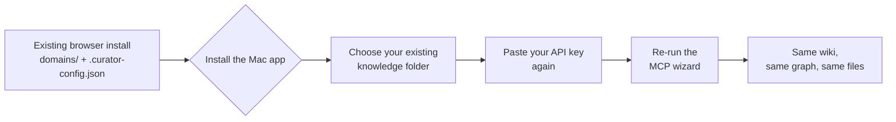

# The native Mac app — decision record

> **STATUS: THE MAC APP IS DOWNLOADABLE, INSTALLABLE, AND UPDATES ITSELF.**
>
> `.dmg` builds are published on the [Releases page](https://github.com/talirezun/the-curator/releases)
> for arm64 and x64. Since `v3.31.0` the bundle is **ad-hoc signed** and carries a
> correct version identity; since `v3.33.0` it **downloads, verifies and installs
> its own updates**. The maintainer installed `v3.31.0` from GitHub as an ordinary
> user would and reported the install itself as working.
>
> **What is still not true**, because the gap between "shipped" and "proven" is
> where this project's expensive failures live:
>
> - **Not notarized, and carrying no Apple developer identity.** Enrolment is in
>   progress. A first launch still needs the Privacy & Security exception, and
>   **nobody has launched a quarantined copy of a current build to see which
>   dialog macOS actually shows** — that is inferred from `syspolicy_check`.
> - **The x64 DMG has never been executed.** There is no Intel Mac.
> - **No automated run has ever replaced a real installed application.** The
>   macOS suite swaps a real ad-hoc-signed *fixture* bundle in a temp dir, with
>   the relaunch stubbed. The 140 MB GitHub round trip is unproven.
> - **Neither the update UI nor the v3.32.0 sync UI has ever been rendered in a
>   browser.** Agents were barred from launching anything after seven macOS crash
>   dialogs reached the maintainer's desktop in one session.
>
> Every decision below is recorded so it is not re-litigated or quietly reversed;
> the **Status** column on each says whether the code for it exists yet.
>
> For what the shell *is* and how it is built, see
> [architecture.md § The macOS desktop shell](architecture.md#the-macos-desktop-shell-desktop).
> For what a *user* does, see [mac-app.md](mac-app.md).
>
> The [browser install](../README.md#quick-start) is equally supported, is the only
> option on Windows and Linux, and is not going away — see
> [D3](#d3--the-browser-install-is-not-a-legacy-path).

This file exists because of one instruction from the project owner:

> *"Do not forget to update all the relevant documentation, especially now when
> we are building the app. **We need to record all the choices we make.**"*

A feature list ages into a lie. A decision record ages into an explanation. What
follows is the second kind: for each choice, **what was decided, why, what
evidence forced it, and whether it is built**.

---

## Table of contents

- [How to read this](#how-to-read-this)
- [Status at a glance](#status-at-a-glance)
- [1. Architecture](#1-architecture)
- [2. Packaging](#2-packaging)
- [3. Release process](#3-release-process)
- [4. Migration for existing users](#4-migration-for-existing-users)
- [5. The MCP bridge under the app](#5-the-mcp-bridge-under-the-app)
- [6. Open, and deliberately undecided](#6-open-and-deliberately-undecided)
- [7. Where each decision is enforced](#7-where-each-decision-is-enforced)

---

## How to read this

Each decision carries four things:

| Field | Meaning |
|---|---|
| **Decision** | What was chosen. Stated so the opposite is a recognisable proposal, not a vague direction. |
| **Why** | The argument. Where a measurement forced it, the measurement is here rather than the conclusion alone. |
| **Evidence** | The file, line or command that proves it. Re-runnable wherever possible. |
| **Status** | `SHIPPED` — the code exists and runs today. `DECIDED` — agreed, no code yet. `PARTIAL` — the seam exists, the consumer does not. |

**A `DECIDED` row is not a description of the app.** Nothing in this file
licenses a doc elsewhere to describe a planned thing in the present tense.

---

## Status at a glance

| # | Decision | Status |
|---|---|---|
| [D1](#d1--one-codebase-one-release-two-shells) | One codebase, one release, two shells — do not fork | `SHIPPED` |
| [D2](#d2--desktop-gets-its-own-packagejson) | `desktop/` gets its own `package.json` | `SHIPPED` |
| [D3](#d3--the-browser-install-is-not-a-legacy-path) | The browser install is not a legacy path | `SHIPPED` |
| [D4](#d4--branch-on-capability-never-on-install-form) | Branch on capability, never on install form | `SHIPPED` |
| [D5](#d5--asar-false-for-the-first-dmg) | `asar: false` for the first DMG | `SHIPPED` |
| [D6](#d6--the-dmg-goes-to-github-releases-never-into-the-repo) | The DMG goes to GitHub Releases, never into the repo | `PARTIAL` |
| [D7](#d7--the-dmg-workflow-gates-on-a-tag-push-never-on-main) | The DMG workflow gates on a tag push, never on `main` | `SHIPPED` |
| [D8](#d8--release-through-a-gate-branch--ci--fast-forward--tag) | Release through a gate: branch → CI → fast-forward → tag | `SHIPPED` |
| [D9](#d9--rollback-is-forward-only) | Rollback is forward-only | `SHIPPED` |
| [D10](#d10--releasechannel-ships-with-stable-as-its-only-valid-value) | `releaseChannel` ships with `stable` as its only valid value | `SHIPPED` |
| [D11](#d11--credentials-do-not-migrate) | Credentials do **not** migrate | `DECIDED` |
| [D12](#d12--the-one-must-have-is-that-existing-wikis-appear--and-it-needs-no-new-code) | Existing wikis must appear — and that needs no new code | `SHIPPED` |
| [D13](#d13--the-existing-users-path-is-three-steps-that-already-exist) | The existing user's path is three steps that already exist | `SHIPPED` |
| [D14](#d14--the-mcp-launcher-shim-is-generated-at-every-app-launch) | The MCP launcher shim is generated at every app launch | `PARTIAL` |
| [D15](#d15----domains-path-is-dropped-in-bundle-mode) | `--domains-path` is dropped in bundle mode | `SHIPPED` |
| [D16](#d16--the-app-updates-itself-and-electron-updater-cannot-be-the-mechanism) | The app updates itself — `electron-updater` cannot be the mechanism | `SHIPPED` |

---

## 1. Architecture

### D1 — One codebase, one release, two shells

**Decision.** The browser app and the Mac app are **the same release of the same
codebase**. They share `src/`, `mcp/`, the docs and the entire test suite. The
Mac app is a *shell* around the existing server, not a second product. **Do not
fork.**

Exactly four things genuinely differ between the two shells:

| | Browser install | Mac app shell |
|---|---|---|
| **Launch** | `node src/server.js`, or the AppleScript `.app` the installer builds | The desktop shell **imports** `src/server.js` into its own process — same Node realm, no child, no second runtime |
| **Update** | `git fetch` + `git reset --hard` + `npm install` (`POST /api/config/update`) | A signed bundle cannot rewrite its own source — the shell's own updater |
| **Data location** | `APP_ROOT` — the checkout itself | A user-data directory outside the read-only bundle |
| **MCP entry** | `<node> <APP_ROOT>/mcp/server.js` | A launcher script ([D14](#d14--the-mcp-launcher-shim-is-generated-at-every-app-launch)) |

Everything else — ingest, chat, wiki, Health, Sync, Shared Brain, working state,
the whole REST surface — is byte-identical code serving both.

**Why.** A fork doubles the surface where this project's expensive failures live.
The changelog is a catalogue of bugs that survived because a fix was applied to
one of two paths (`v3.0.17`: "apply a fix to the path that runs FIRST"), or
because two hand-maintained copies of one guard drifted (`v3.2.0`, `v3.24.0`).
A second copy of `src/` would reproduce that class at the scale of the whole app.
One test suite covering both is only possible if there is one codebase to cover.

**Status.** `SHIPPED`. The fork points were built first — `paths.js` for data
location, `install-mode.js` for the rest ([D4](#d4--branch-on-capability-never-on-install-form))
— and `desktop/` is now the shell that consumes them. There is no second copy of
`src/`, no forked route and no desktop-only business logic.

> **Honest consequence, unchanged in substance:** the bundle arms of the MCP
> entry, the updater and the install-mode fork have **never run end to end in a
> signed, notarized build**. They are covered by offline tests that materialise a
> fake `.app`-shaped tree (`scripts/test-install-mode.js`), which proves the
> branch is taken — not that the branch works in a real bundle. A git checkout is
> `repo` mode, so running the suite exercises the unchanged arm every time.

---

### D2 — `desktop/` gets its own `package.json`

**Decision.** When the desktop shell is built it lives in `desktop/` with a
**separate** `package.json`. Electron and its build tooling never enter the root
manifest.

**Why — this one is measurable, not stylistic.** The root manifest today has
**zero `devDependencies`**:

```bash
$ grep -c devDependencies package.json
0
```

That is not an accident. The auto-updater runs `npm install` **on every user's
machine** as step 4 of an update:

```js
// src/routes/config.js — POST /api/config/update, step 4
await execAsync('npm install --silent --no-audit --no-fund', execOpts({ timeout: 120000 }));
```

So anything in the root manifest — including a `devDependency` — is downloaded
by every browser-install user on every update. Electron is hundreds of megabytes.
Putting it in the root manifest would push that to every user of a feature they
do not use and cannot run.

**This project has already refused two tools on exactly this ground.** Playwright
was refused for the same reason (`v3.19.0` onward), and the browser-based visual
harness is driven over the Chrome DevTools Protocol against an already-installed
Chrome specifically so that `git diff package.json` is **0 lines** — a rule
`v3.23.0`, `v3.24.1` and `v3.25.0` each re-state and re-verify.

**Evidence.** `package.json` (8 runtime dependencies, no `devDependencies` key);
the `npm install` call in `POST /api/config/update`.

**Status.** `SHIPPED`. `desktop/package.json` is `private: true`, declares no `dependencies`, and carries `electron` and `electron-builder` as its own pinned devDependencies. `git diff package.json package-lock.json` at the repo root is 0 lines.

---

### D3 — The browser install is not a legacy path

**Decision.** The browser install stays **fully supported**. It is the **only**
option on Windows and Linux. On a Mac with the app installed, the app supersedes
it — but nothing deprecates it, and no feature is Mac-app-only.

**Why.** The Curator's core is Express and Node, which run anywhere Node 18+
runs. The macOS-specific parts today are the one-line installer, the
AppleScript `.app`, the native folder picker and the in-app updater; ingest,
chat, wiki, MCP, Sync and Health are identical everywhere. Treating the browser
install as legacy would strand every non-Mac user for a packaging convenience.

**Status.** `SHIPPED` — this is how the app works today. Recorded here because
the arrival of a Mac app is the moment somebody proposes reversing it.

---

### D4 — Branch on capability, never on install form

**Decision.** Code asks *"can I run git against my own source?"*, never *"am I a
checkout?"*. That question lives in `src/brain/install-mode.js` as a **named
capability**, and no route may branch on the install *mode*.

**Why.** The two questions coincide today and will not coincide forever. A
Homebrew cask is a git-less **non-bundle**; so is a `.pkg` in a read-only prefix.
Branching on the form puts both of those on the repo arm — the arm that runs
`git reset --hard` — where they fail with git's own text instead of a refusal
that says why. And because `isRepoInstall()` is literally `!isBundleInstall()`,
branching on it at several sites means the day a third mode exists, every one of
those sites silently inherits the destructive arm.

**Stated honestly:** all four booleans are currently perfectly correlated with
`mode === 'repo'`. They are not four independent measurements — they are four
distinct *questions* that happen to share an answer in the only two modes that
exist. The value is the naming and the single table.

**Evidence.** `src/brain/install-mode.js`; the capability table and the full
argument in [architecture.md § Install modes](architecture.md#install-modes-srcbraininstall-modejs);
`scripts/test-install-mode.js` enforces that no route branches on the mode.

**Status.** `SHIPPED`. Two routes fork on `canSelfUpdateViaGit` today
(`GET /api/config/update-check` and `POST /api/config/update`, both returning
`501` on the bundle arm). `mcpLaunchStyle` and `restartStyle` are `PARTIAL` —
surfaced and descriptive, with **no branch behind them**.

---

## 2. Packaging

### D5 — `asar: false` for the first DMG

**Decision.** The first DMG ships with Electron's `asar` archiving **off**.

**Why — and the usual mitigation does not work here.** The reflex answer is
`asarUnpack`. It does **not** fix this, and the reason is precise:
`asarUnpack` copies a file out to `app.asar.unpacked`, but the module is still
*resolved* through the `app.asar` path, so **`__dirname` is unchanged**. And
`__dirname` is what this app derives its root from:

```js
// src/brain/paths.js
export const APP_ROOT = path.resolve(__dirname, '../..');
```

Every git subprocess in the app then runs with that as its working directory:

```js
// src/brain/sync.js
const ROOT = APP_ROOT;
// ...
      cwd: ROOT,              // Explicit cwd prevents "getcwd: Operation not permitted" on macOS
```

```js
// src/routes/config.js
const PROJECT_ROOT = APP_ROOT;
// ...
const execOpts = (extra = {}) => ({ cwd: PROJECT_ROOT, env: SUBPROCESS_ENV, ...extra });
```

`cwd` must be a directory that actually exists on disk. A path inside
`app.asar` is not one. So under `asar: true` — with or without `asarUnpack` —
**every Personal Sync git call and every updater subprocess breaks**, and they
break with an OS-level `spawn` error that names none of this.

`asar` buys startup time and a tidier bundle. Neither is worth shipping a build
whose Sync tab cannot run. Turning it on later is a deliberate change with its
own verification, not a default to inherit.

**Evidence.** The three code excerpts above, all quoted verbatim from the
current tree. Verify with `grep -n "APP_ROOT" src/brain/paths.js src/brain/sync.js src/routes/config.js`.

**Status.** `SHIPPED`. `desktop/electron-builder.yml` sets `asar: false`, with the three hazards written out above the key so a future size optimisation has to read them first.

---

### D6 — The DMG goes to GitHub Releases, never into the repo

**Decision.** Built artifacts are published to **GitHub Releases**. A `.dmg` is
never committed. **Signing credentials never enter this public repository** — not
as a file, not as an example, not as a fixture.

**Why.** The repository is public and is cloned in full by the installer. A
binary in git is permanent: `git clone` pays for it forever, and it cannot be
removed without rewriting history — which is the one operation this project has
identified as **irrecoverable**, because the updater does `git reset --hard
origin/main` and rewritten history propagates to every machine on its next
update check.

On credentials: this repo runs a pre-commit secret guard under
`core.hooksPath = .githooks`, and even synthetic credential fixtures are handled
deliberately (see the `git-hygiene` skill and `CONTRIBUTING.md § Git hooks`).
A Developer ID certificate and its password belong in repository **Secrets**,
which are withheld from fork pull requests by GitHub itself.

**Status.** `PARTIAL`. Artifacts now exist and reach the Releases page; the
**upload is still a human step**, and that is the honest gap.

> **What is automated and what is not, stated separately, because they are
> routinely collapsed.** `.github/workflows/desktop-dmg.yml` triggers on a `v*`
> tag and **builds** both DMGs, then `actions/upload-artifact@v4` attaches them
> to the **workflow run**. Nothing in that workflow calls `gh release create` or
> `softprops/action-gh-release`; **no workflow creates or uploads to a Release.**
> The `.dmg` files on the Releases page were downloaded from the run and uploaded
> by hand — which is exactly how `v3.30.0`'s assets came to be named for a version
> the bundle inside them did not carry ([the version-identity fix](#d1--one-codebase-one-release-two-shells)).
>
> Tags are no longer the gap they were: `git tag` now returns **46**, and the
> newest four (`v3.30.0` … `v3.33.0`) were created by `scripts/release.js`. The
> historical hole between `v3.10.0` and `v3.29.0` remains and is why
> [D9](#d9--rollback-is-forward-only) still says a user cannot check out an
> arbitrary previous version.

> **Note on what "signing" means in the tree today, because there are now two
> different ad-hoc signatures and only one of them is deliberate.**
>
> - **The Electron bundle is ad-hoc signed on purpose**, by
>   `desktop/lib/adhoc-sign.mjs` running from the `afterPack` hook.
>   `mac.identity: null` makes electron-builder skip signing entirely — which by
>   itself leaves the *broken*-signature state, not an unsigned one — and the hook
>   then produces a real, verifying ad-hoc signature. It **refuses the build**
>   rather than proceeding if any real signing credential is present in the
>   environment, if `identity` is absent (electron-builder would auto-discover a
>   keychain identity), if the result is still Electron's `linker-signed` stub, if
>   `Sealed Resources` is missing, if a `TeamIdentifier` or `Authority` appears —
>   or if the `runtime` flag is set, because a hardened ad-hoc signature passes
>   every static check and then **fails to load its own framework at launch**.
> - **`scripts/build-app.sh` and `install.sh` also end in `codesign --force
>   --deep --sign -`**, on the AppleScript applet. That command would *destroy* a
>   real Developer ID signature, which is why `canRebuildAppleScriptApp` is
>   `false` on the bundle arm ([D4](#d4--branch-on-capability-never-on-install-form)).
>   It must be retired before any Developer ID build ships; nothing enforces that
>   in the script today.

---

### D7 — The DMG workflow gates on a tag push, never on `main`

**Decision.** The build-and-publish workflow triggers on a **tag push** (`v*`).
It does not trigger on `main`. `workflow_dispatch` was **deliberately dropped**.

**Why the tag.** [D8](#d8--release-through-a-gate-branch--ci--fast-forward--tag)
creates the tag *after* the fast-forward, on the commit `main` points at — so a
tag can never name a commit that failed CI. Gating the build on the tag inherits
that guarantee for free. Gating on `main` would not: `main` also receives the
merge commit before the tag exists, and a build triggered there races the tag.

**Why `workflow_dispatch` was dropped.** A manual dispatch runs against a
*branch*, not a tag. It can therefore produce a build whose SHA collides with the
run the release gate is watching — two runs on one commit, and the gate reading
whichever it finds. The gate's whole value is that "green" means a specific run
on a specific SHA. A convenience trigger that can make that ambiguous is worth
less than the ambiguity costs.

**Evidence.** `.github/workflows/` contains exactly **one** file, `test.yml`.
Its trigger is a bare `push:` with only `paths-ignore` — and **that absence is
load-bearing**: `scripts/release.js` refuses with `ci-not-reachable` if a
`branches:` or `branches-ignore:` key ever appears under `push:`, because a
release branch that gets no run turns the gate into something that only *looks*
like one.

**Status.** `SHIPPED`. `.github/workflows/desktop-dmg.yml` triggers on a tag
push only — no `branches:`, no bare `push:`, no `workflow_dispatch`, and its
token is read-only. It **publishes nothing**: the DMG is kept as a build artifact
(`actions/upload-artifact`), which is why [D6](#d6--the-dmg-goes-to-github-releases-never-into-the-repo)
is `PARTIAL` — attaching it to a Release is still a human step.

> **The tag history is not continuous, and a trigger would need to know that.**
> Measured on origin: **42 tags**, running from `v2.1.0` to `v3.24.2`, then a
> four-release gap, then `v3.29.0`. `v3.25.0` through `v3.28.0` have **no tag** —
> they were cut before the tag step existed, which is precisely the gap `v3.29.0`
> closed. Also missing: `v3.16.x` and `v3.17.x`. A `v*` trigger only ever fires
> on tags created from here on, so the gap costs nothing going forward.
>
> *(An earlier draft of this file said tags "run to `v3.9.2` and then stop" at
> three separate places. That was false — it was written from a worktree whose
> view was stale, and the orchestrator's first correction of it was wrong too,
> in the other direction. The number above is measured, not remembered. As of
> `v3.33.0` the count is **46**: the tag step now runs on every release.)*

---

### D16 — The app updates itself, and `electron-updater` cannot be the mechanism

**Decision.** The Mac app **downloads, verifies and installs its own updates**,
using code in `desktop/lib/` rather than `electron-updater`. It resolves the
newest release carrying an installer, downloads the `.dmg`, verifies it, stages
the new bundle beside the running one, and swaps them with two renames.

**Why not the standard updater.** `electron-updater`'s `MacUpdater` drives
**Squirrel.Mac**, which validates every download against the **running** app's
*designated requirement*. Measured on the installed app rather than reasoned from
config:

```
$ codesign -d -r- "/Applications/The Curator.app"
designated => cdhash H"ff0e7bb5…"
Signature=adhoc
TeamIdentifier=not set
```

An ad-hoc signature has no certificate and no team, so `codesign` builds that
requirement out of the only thing available: **the code-directory hash of that
exact build**. Every genuine update has a different cdhash by definition, so the
check fails **100% of the time, deterministically** — and it lives inside
Electron's own binary, so no `electron-builder` setting reaches it.

**This is structural, not a to-do item.** It is not "we have not configured it
yet"; it is "no configuration exists that would make it work while the app is
ad-hoc signed". Two further blockers each suffice on their own: Squirrel installs
from a **ZIP** while releases publish `.dmg`, and `electron-updater` reads
`latest-mac.yml`, which `electron-builder` emits only when `publish` is set and
ours is `publish: null`.

**When Apple enrolment lands, this reverses.** A Developer ID signature gives a
designated requirement based on the certificate and team rather than a build
hash, at which point Squirrel's check passes across versions and the standard
updater becomes the right answer. Treat `desktop/lib/update-*.js` as the thing
that exists *because* the app is ad-hoc signed.

**How the swap is safe.** Two renames of siblings on the same device — the device
is compared with `stat -f %d` **first**, so `mv` cannot silently degrade into a
400 MB copy. Power lost before the first leaves the old app complete; after the
second leaves the new app complete; and in the two-syscall window between them
both complete bundles sit beside each other under known names, **neither
half-written**, because both were verified before the app quit and `rename` moves
no bytes. That window is the price of the property that **a half-replaced bundle
is impossible**, which was the stated hard requirement.

**What is verified, and what honestly is not.** Byte length against the published
size; **sha256 against the `digest` GitHub publishes on the asset**; then the
staged bundle's `CFBundleShortVersionString` and `codesign --verify --deep
--strict`. What that cannot establish is that **Apple vouches for the bytes** —
`codesign --verify` on an ad-hoc bundle is an *integrity* check, not an
authenticity one. Authenticity rests entirely on the digest and on TLS to GitHub,
which is why the digest check is not optional, why the download host is
allow-listed to `github.com` / `objects.githubusercontent.com`, and why no UI copy
implies Apple checked anything.

**One measured benefit that is easy to miss.** A `.dmg` a browser downloads
carries `com.apple.quarantine`; the same `.dmg` fetched by the app's own `fetch()`
does not. So an in-app update removes both the Privacy & Security detour **and**
App Translocation. Both arms are in the macOS suite, the browser-download arm as
the control.

**Evidence.** `desktop/lib/update-plan.js` (pure decisions — and it deliberately
contains **no version comparator**, because two answers to *what is the newest
version* is how they drift; resolution is delegated to `src/routes/config.js`),
`desktop/lib/update-release.js`, `desktop/lib/update-engine.js`. Exposed to the
server as the `prepareUpdate` / `installUpdate` hooks in
`src/brain/desktop-host.js`. `installUpdate` takes an **opaque token and never a
path** — its caller is a renderer, and a hook accepting `{stagedPath, targetPath}`
would be a *replace-any-directory-with-any-other* primitive reachable from a page.

**Status.** `SHIPPED`, with the limits named rather than implied:

- **No automated run has ever replaced a real installed application.** The macOS
  suite swaps a real ad-hoc-signed *fixture* bundle in a temp dir with the
  relaunch stubbed — it does really replace it, and the result does really still
  pass `codesign`. What is unproven is the 140 MB GitHub round trip, the real
  width of the two-syscall window, and `main.js`'s wiring (Electron is not an
  offline dependency).
- **The update UI has never been rendered in a browser.**
- **`signal` is plumbed but never fired.** There is no cancel, documented as
  deliberately quiescent rather than shipped as a half-wired control.
- **Rosetta is not accommodated on purpose.** An arm64 install running under x64
  stays on x64; a silent architecture migration behind a progress bar is not
  something to do without an explicit offer.
- **`/old` has no in-app path at all** and still posts to the git updater.

---

## 3. Release process

Agreed 2026-08-31. The full operational procedure — the commands, the refusal
table, what happens to the release branch — lives in
[CONTRIBUTING.md § Cutting a release](../CONTRIBUTING.md#cutting-a-release).
What follows is the *reasoning*, so the two cannot drift apart silently.

### D8 — Release through a gate: branch → CI → fast-forward → tag

**Decision.**

```
release/vX.Y.Z  →  push  →  CI (~8 min)  →  green?  →  main fast-forwards to it  →  tag
```

Four properties are structural, not stylistic:

1. **`--ff-only`.** `main` must be byte-for-byte the SHA CI ran on. A non-ff
   merge creates a commit CI has never seen. `scripts/release.js` refuses any
   `git merge` lacking the flag, and then **re-reads `HEAD`** and refuses
   `ff-failed` if the merge reported success without landing on the verified SHA.
2. **The tag comes after the merge**, on the commit `main` points at. A tag can
   then never name a commit that failed CI.
3. **Red *or unknown* leaves `main` untouched.** An unobservable gate fails
   **closed** (exit code `3`, `CI_UNKNOWN`). The release branch is left in place
   so the fix is a commit on top of it.
4. **The gate is the `offline` job only.** `live` spends real money, can take 20
   minutes, and is deliberately flake-tolerant via `scripts/ci-flake.js` — a
   required check designed to tolerate its own transient failures is the wrong
   thing to block a green tree on. It still runs post-merge, and a **skipped**
   job is named in the output, so "green" never quietly means "green on the two
   checks that happened to run".

**Why a gate at all.** Before this, **pushing to `main` *was* the deploy**, and
CI was a report card that arrived afterwards. `main` has no branch protection and
no rulesets (verified: `gh api .../branches/main/protection` returns
`{"message":"Branch not protected","status":"404"}`, and `.../rulesets` returns
`[]`), while the updater does `git fetch origin main` + `git reset --hard
origin/main`. So whatever landed on `main` reached every user on their next
update check, green or red, and nothing could stop it.

**Why not a required status check instead.** A status check can only run after
the commit exists somewhere, so requiring one on `main` forces a PR for every
release — and the maintainer is the only reviewer. The gate already runs
*before* the push rather than after it.

**Its honest limit, stated rather than implied:** the gate lives in a script, so
a bare `git push` still bypasses it. This is a solo maintainer protecting
himself from his own hurry, not a repo defending against a hostile committer.

**Evidence.** `scripts/release.js`; `scripts/test-release-preconditions.js`;
[CONTRIBUTING.md § The gate](../CONTRIBUTING.md#the-gate). Run as
`node scripts/release.js <version>` — there is deliberately no `npm run release`
alias, so the command that deploys is never one keystroke from `npm test`.

**Status.** `SHIPPED`.

> **Recorded because it is the kind of thing that gets forgotten:** the gate was
> built by an agent forbidden from pushing or tagging, so its production path was
> exercised only as far as the `wrong-branch` refusal. `v3.29.0` was its first
> real use.

---

### D9 — Rollback is forward-only

**Decision.** There is **no downgrade path and no in-app "go back a version"**.
The answer to a bad release is always another release: `git revert` the bad
commit, write its changelog row, and cut the patch **through the same gate**.

**Why.** Clients pull `origin/main` and hard-reset to it. There is nothing for a
"downgrade" to mean that would not require either a second branch (see
[D10](#d10--releasechannel-ships-with-stable-as-its-only-valid-value), which
measures why that breaks) or a force-push (which is the one irrecoverable
operation, precisely *because* the updater hard-resets).

**What is honestly available instead** — verified before being written down,
because this project has a recorded history of false revert promises
(`v3.9.1` found *"anything can be reverted from the Sync tab"* at **eight
sites** for a feature that has never existed):

- **On a standard install, checking out a version tag fails.** `install.sh` clones
  with `--depth 1`, so the user's clone has **no tags at all**. What works is a
  shallow tag fetch, then a checkout, then the app's own update commands to
  return from detached `HEAD`.
- **And most versions have no tag to fetch.** Measured against origin:
  `git ls-remote --tags` returns **42** tags ending at `v3.29.0`, but with `v3.25.0`-`v3.28.0` missing — nothing between
  `v3.10.0` and `v3.29.0`. `scripts/release.js` does create *and push* an
  annotated tag, but the gate that does so is new — every release in that gap
  predates it. So "check out the previous version" is not a procedure a user can
  follow today, and **no user-facing copy names a version number**, precisely
  because it would be false.
- If the damage is in `domains/` rather than in code, the wiki is git-tracked, so
  a user with Personal Sync recovers with a git client. **There is no in-app
  revert and there never has been.**

**Status.** `SHIPPED` (as a documented procedure —
[CONTRIBUTING.md § When a release is bad](../CONTRIBUTING.md#when-a-release-is-bad)).

---

### D10 — `releaseChannel` ships with `stable` as its only valid value

**Decision.** The config key `releaseChannel` exists and resolves. `stable` is
the **only** value it accepts; anything absent or unrecognised resolves to
`stable`. There is **no second channel**, and no UI control writes it.

**Why not ship `beta` too — this is a measurement, not caution.** A real user's
install is created by `install.sh`:

```bash
git clone --depth 1 https://github.com/talirezun/the-curator.git "$INSTALL_DIR" --quiet
```

`--depth 1` **implies `--single-branch`**, so that clone's refspec is
`+refs/heads/main:refs/remotes/origin/main` and nothing else. Measured against a
throwaway origin that genuinely had a `beta` branch:

| Command | Result |
|---|---|
| `git fetch origin beta` | prints `* branch beta -> FETCH_HEAD` — **looks fine** |
| `git reset --hard origin/beta` | dies with `fatal: ambiguous argument` |

**The fetch succeeds and the reset kills the update.** So shipping a second
channel would break the updater for anyone who selected it, silently, at the
first step that looks like it worked. An explicit refspec was measured working
and deliberately **not** written, because nothing can reach it today; the
measurement lives beside the resolver and a guard fires the day someone adds a
second channel.

**Why ship the key at all, then.** So the resolved channel is **inspectable**.
Given a support report, the only way to tell *"resolved to stable because the key
is absent"* from *"resolved to stable because the key says something this build
has never heard of"* is to see the resolved value beside the raw file. It is
surfaced additively on `GET /api/config` as `releaseChannel`, and on
`GET /api/config/update-check` as `channel` and `branch`.

**Evidence.** `install.sh` (the clone line); `resolveReleaseChannel` /
`getReleaseRef` in `src/brain/config.js`; `scripts/test-release-channel.js`,
which pins the resulting command strings as literals against the pre-change
handler.

**Status.** `SHIPPED`.

---

## 4. Migration for existing users

This is the part users actually feel. The short version:



### D11 — Credentials do **not** migrate

**Decision.** The Mac app does **not** read, copy or import API keys, GitHub
sync tokens or Shared Brain admin tokens from an existing browser install. The
user pastes their key again.

**Why.** This was the project owner's call, and it **deleted the riskiest step
in the whole pivot**. An automatic credential import means a new, unaudited code
path that reads three `0600` secret files from one location and writes them to
another — in an app whose credential handling is currently narrow and
well-guarded (atomic writes at mode `0600`, a startup hardening sweep, and a
rule that any new secret-bearing file joins that sweep). Migration code is
written once, runs once per user, is nearly impossible to test in the shapes that
matter, and fails in the direction where a secret ends up somewhere nobody
intended.

Pasting a key is a **thirty-second** step the user has already done once and
which the Settings view is built for. That is a good trade.

**Consequence, stated plainly:** an existing user must re-enter their API key,
and — if they use them — re-run the Personal Sync and Shared Brain connection
flows. Their **wiki, domains, chat history and working state are untouched**;
only credentials do not come across.

**Status.** `DECIDED`.

---

### D12 — The one must-have is that existing wikis appear — and it needs no new code

**Decision.** The single hard requirement for migration is that an existing
user's **domains and wiki pages show up** in the Mac app. Nothing new has to be
built for that.

**Why it is already solved.** Three facts do all the work:

1. **The wiki is plain markdown on disk.** There is no database, no index to
   rebuild, no import. Pointing at the folder *is* the migration.
2. **`POST /api/config/domains-path`** takes a path, checks the folder exists,
   and persists it — behind `guardConcurrent`, so it cannot fire mid-ingest.
3. **`POST /api/config/pick-folder`** opens the native macOS folder picker and
   persists what the user chose, re-checking for in-flight writes *after* the
   dialog closes (the dialog can block for up to 60 seconds).

Both routes ship today and are used by the browser app's **Settings → Knowledge
base folder**. They are documented in
[api-reference.md](api-reference.md#post-apiconfigdomains-path).

**Status.** `SHIPPED`, and the affordance now exists as well as the mechanism.
v3.31.0 found the gap: a fresh bundle install correctly creates an *empty*
domains folder, so someone with years of wikis elsewhere opened a working app
and concluded they were gone — while Getting started step 2 told them to
*create* a domain. The backend needed **no new code**; the route was simply
unreachable from the screen they were standing on.

> **The sidebar entry is the load-bearing half and the empty card is not.** With
> the route only on the empty-state card, the likeliest wrong click — an existing
> user pressing **New domain** — creates one junk domain, makes the list
> non-empty, and **destroys the empty card along with the only path to their real
> wiki**, leaving them worse off with no error to search for. So **Use existing
> folder** is on the Domains sidebar in every state of that view, as well as on
> the card.
>
> **And the failure is honest rather than diagnostic, by necessity.** Measured: a
> non-Curator folder, a folder picked **one level too deep**, and an unmounted
> drive all return `[]` and are **indistinguishable**. So the UI names what it
> *looked for* and where it looked, rather than guessing which happened, and
> offers an undo. That undo restores `domainsPath` **only** — a `defaultDomain`
> set from the old folder is left pointing at a slug that may not exist.
>
> The switch takes effect **in the same process** — no restart, no reload —
> confirmed live by repopulating a six-domain folder with `pageReloaded: false`.

**Still open, one hop upstream:** four other views (`chat.js`, `memory.js` twice,
`ingest.js`, `sync.js`) still give **create-only** advice on their empty states.
They are not dead ends — they funnel to Domains, which now carries both routes —
but they are the same wrong advice one screen earlier.

---

### D13 — The existing user's path is three steps that already exist

**Decision.** Migration is documented and supported as exactly three steps, each
of which is an existing, shipping surface:

| Step | Where | Already exists? |
|---|---|---|
| 1. **Choose your knowledge folder** — pick the folder that **contains** your domains, not a domain | Domains → **Use existing folder** (sidebar or empty card), or Settings → Knowledge base | ✅ `POST /api/config/pick-folder` |
| 2. **Paste your API key** | Settings → API keys | ✅ `POST /api/config/api-keys` |
| 3. **Run the MCP wizard** | Settings → My Curator MCP | ✅ the three-step wizard |

**Why step 3 is not optional for MCP users.** The Claude Desktop entry embeds
absolute paths, so an entry written by a browser install names the checkout's
`mcp/server.js`. The wizard already detects a stale entry and shows a banner;
under the app it is the same wizard reaching a different launcher
([D14](#d14--the-mcp-launcher-shim-is-generated-at-every-app-launch)).

**Status.** `SHIPPED` (all three surfaces).

---

## 5. The MCP bridge under the app

### D14 — The MCP launcher shim is generated at every app launch

> **Status corrected after this record was written.** It was drafted in a
> worktree branched from `v3.29.0`, which predates the code below, so the first
> draft recorded this as `DECIDED` and stated that `POST /api/mcp/write-config`
> and the `mcp_launch_style` / `launcher_path` / `launcher_exists` fields did
> not exist. They do: `src/routes/mcp.js:328` and `:243-245`, shipped in
> v3.30.0, along with `src/brain/mcp-launcher.js` and `getMcpLauncherDir()`.
>
> The method was right and the baseline was stale — the third time in one
> session that a worktree's base produced a confident, wrong correction. When
> an agent reports that something does not exist, **check what its worktree was
> branched from before believing it.**
>
> What remains genuinely unbuilt here is the *button*: the endpoint exists and
> is proven, but the wizard control that calls it is not wired.

**Decision.** In bundle mode the Claude Desktop entry points at a **launcher
script that the app rewrites every time it starts**. It is neither shipped inside
the bundle nor written once by the wizard.

**Why not ship it in the bundle.** A signed `.app` is read-only, and a file the
app generates inside its own bundle **invalidates the code signature**. That is
the same fact behind `canWriteBesideCode: false`.

**Why not have the wizard write it once.** A wizard-written file is correct only
until something changes. It goes stale when the app moves, when Node's location
changes, or under **App Translocation**, which macOS applies to a quarantined app
— running it from a randomised read-only path, so `process.execPath` is not where
it was last time. A file rewritten on every launch is correct as of the last
launch, which is the strongest guarantee available without a background agent.

**The honest limit.** Between moving the app and next launching it, the shim is
**stale for one session**: Claude Desktop spawning the MCP child in that window
gets the old path. Launching The Curator once fixes it. This is recorded rather
than engineered around, because the alternative — a login item or a watcher —
is a much larger commitment than the failure justifies.

**Status.** `PARTIAL`. `mcpLaunchStyle` now has real branches: `src/routes/mcp.js`
reads it at three sites and `src/brain/mcp-launcher.js` writes the shim.
`scripts/test-mcp-launcher.js` owns the behavioural coverage. What is **not**
proven is the part that matters most — **the bundle arm has never run end to
end.** The shim is asserted as text and never executed, App Translocation is
simulated by a path string, and nothing demonstrates that Claude Desktop accepts
the generated entry.

---

### D15 — `--domains-path` is dropped in bundle mode

**Decision.** The bundle-mode MCP entry omits the `--domains-path` argument that
the repo-mode entry carries.

**Why.** The flag is a **snapshot** — the folder as it was when the config was
written — and it sits **above** the user's live Settings choice in the resolution
ladder. Here is the ladder, in the order `getDomainsDir()` actually evaluates it:

| Rung | Source | Notes |
|---|---|---|
| 1 | `__setDomainsDirOverride()` | test seam, in-process |
| 2 | `CURATOR_TEST_DOMAINS_DIR` | test seam, crosses a process boundary |
| 3 | **`--domains-path`** | the launch flag — **MCP only**, null in the app |
| 4 | **`cfg.domainsPath`** | the user's live Settings choice |
| 5 | `DOMAINS_PATH` | documented developer fallback |
| 6 | default | |

Rungs 1 and 2 are never set in production, so **in a real install the flag is
the first rung that can be set and the stored setting is the second**. That
ordering is correct for the repo install — the flag is written by the wizard from
the same stored setting, so the two agree, and the ordering exists so MCP reads
and writes cannot resolve different trees.

Under the app it stops being correct. The bundle's own resolution already finds
the user-data directory, and a stale flag would **outrank a folder the user
changed in Settings** — so the MCP child would silently read a different wiki
from the one the app is showing, with no error anywhere. Dropping the flag lets
both processes resolve through the same stored setting.

**Evidence.** `getDomainsDir()` in `src/brain/config.js` (the ladder above is
that function, in order); `buildCuratorEntry()` in `src/routes/mcp.js`, which
carries the fork. *(An earlier draft of this line said that function "today
**always** emits `args: [MCP_SERVER_PATH, '--domains-path', domainsDir]`". That
was written before the branch landed and has been false since; the Status below
is the accurate statement.)*

**Status.** `SHIPPED`. `buildCuratorEntry()` in `src/routes/mcp.js` branches on `getCapabilities().mcpLaunchStyle` and the `launcher-script` arm omits `--domains-path` entirely. The repo arm is unchanged, deliberately — changing it would mark every existing user's config stale overnight.

> **Correction on the record.** This decision has been summarised elsewhere as
> *"the flag sits at rung 2, above the user's live Settings choice at rung 3"*.
> The **ordering is right and is the load-bearing part**; the rung numbers are
> not. Counting every rung the function evaluates, the flag is rung 3 and the
> stored setting is rung 4. Counting production-reachable rungs only, they are 1
> and 2. The table above is the function, in order, so it cannot drift.

---

## 6. Open, and deliberately undecided

Recorded so nobody mistakes silence for a decision.

| Question | State |
|---|---|
| **How the app updates itself** | **Decided and built** ([D16](#d16--the-app-updates-itself-and-electron-updater-cannot-be-the-mechanism)). `electron-updater` was **ruled out on a structural ground, not a configuration one**, and the app now downloads, verifies against GitHub's published sha256, stages and swaps itself. Still open: nothing has ever replaced a real installed application in an automated run, and the update screens have never been rendered in a browser. |
| **What "restart" means in the app** | **Decided and built.** `src/brain/restart.js`'s `planRestart()` forks on `restartStyle`, and `desktop/main.js` registers a `relaunch` hook through `src/brain/desktop-host.js`. The bundle arm **refuses with a 501** when no hook is registered rather than falling back to the spawn, which under Electron would open a second window instead of a server. The earlier `webRequest` interception in `main.js` was **removed**, not kept as belt-and-braces: it cancelled the request before Express, so the workaround would always have beaten the fix. |
| **Quit-while-writing** | **Built.** `desktop/main.js`'s `before-quit` handler consumes `GET /api/write-status` via `lib/write-status.js` and `lib/quit-decision.js`; `safeToQuit: null` is kept as its own case and returns `ask`. Still open: **the `ask` branches have never run against a real write** — only the `quit` branch was exercised end to end, and the rest only as pure functions. Nothing in *repo* mode consumes the route, which is correct: a browser install has no quit to intercept. |
| **Windows and Linux shells** | Not planned. Those platforms use the browser install ([D3](#d3--the-browser-install-is-not-a-legacy-path)). |
| **Notarization** | Open. There is no Apple Developer enrolment, no certificate and no `afterSign` hook, so a downloaded DMG still needs the Privacy & Security exception. **Signing itself is no longer open** — the bundle is deliberately ad-hoc signed ([D6](#d6--the-dmg-goes-to-github-releases-never-into-the-repo)). `hardenedRuntime: true` and `build/entitlements.mac.plist` are present and **inert**, because electron-builder skips signing and the ad-hoc step omits `--options runtime` — the ad-hoc signer *refuses the build* if that flag ever appears, having measured that a hardened ad-hoc bundle passes `codesign --verify --deep --strict` and then still fails to load its own framework. Hardened runtime must return when Developer ID signing lands, because notarization requires it; this is a temporary inversion recorded as one. Whether `choose folder` needs the apple-events entitlement is **inferred, not measured**, and granted defensively. |
| **Which macOS dialog an unsigned-but-sealed build actually produces** | Open, and it is a real gap rather than a formality. `syspolicy_check` reports exactly one remaining fatal finding (notarization), so **Open Anyway should appear** — but nobody has launched a quarantined copy of a current build to watch. Everything user-facing about that first launch is inferred from the signature state. |
| **Where user data lives in the bundle** | **Decided, built and exercised.** `paths.js` resolves a user-data directory outside `APP_ROOT`, and the detection is a **positive test for "bundle"** so an unrecognised layout keeps data where it is. Verified on a real install at `/Applications`: the app launched, served on a dynamic port, and created its knowledge folder under `~/Library/Application Support/The Curator/` on first run. |
| **Whether two installs may share one domains folder** | **Answered in the sync layer, not here** (v3.32.0). A second install pointed at a folder another one already syncs **adopts** that sync repository rather than creating a second history, and refuses by name if the remotes differ. What is *not* coordinated is concurrent writing: two servers over one folder is possible and unguarded. See [sync.md](sync.md) and [user-guide.md § Two installs, one knowledge folder](user-guide.md#two-installs-one-knowledge-folder). |

---

## 7. Where each decision is enforced

A decision that lives only in prose gets reversed. These are the places where
the code itself refuses:

| Decision | Enforced by |
|---|---|
| [D4](#d4--branch-on-capability-never-on-install-form) | `scripts/test-install-mode.js` — no route may branch on the mode; `defineCapabilities()` throws at module load on an incomplete record |
| [D7](#d7--the-dmg-workflow-gates-on-a-tag-push-never-on-main) | `scripts/release.js` refuses `ci-not-reachable` if `.github/workflows/test.yml` gains a `branches:` filter; `scripts/test-release-preconditions.js` asserts it against the real file |
| [D8](#d8--release-through-a-gate-branch--ci--fast-forward--tag) | `scripts/release.js` — a `git merge` without `--ff-only` is refused as an unsafe command; the landed SHA is re-read and mismatch refuses `ff-failed` |
| [D10](#d10--releasechannel-ships-with-stable-as-its-only-valid-value) | `resolveReleaseChannel()` is total by construction; `scripts/test-release-channel.js` pins the resulting git commands as literals |
| [D2](#d2--desktop-gets-its-own-packagejson) | `scripts/test-desktop-packaging.js` §2 — enumerates dependency names out of **both** manifests and asserts the root gained nothing; §3 asserts `desktop/` is self-contained; §4 asserts nothing in `src/` or `mcp/` reaches into it |
| [D5](#d5--asar-false-for-the-first-dmg) / packaged layout | `scripts/test-desktop-packaging.js` §11 — refuses both the old `node_modules` glob and the absence of the `extraResources` mapping |
| [D7](#d7--the-dmg-workflow-gates-on-a-tag-push-never-on-main) | `scripts/test-desktop-packaging.js` §8 — the DMG workflow triggers on tags and cannot join the release gate |

**Not enforced, and worth knowing:**

- **Nothing in `desktop/` can be EXECUTED by `npm test`.** Electron is not an
  offline-suite dependency and never will be, so `main.js` and
  `electron-builder.yml` are **source-scanned**, not run;
  `scripts/test-desktop-packaging.js` says so in its own NOT ENFORCED block. Only
  the Electron-free `lib/` modules are genuinely executed — that is why they are
  written to import nothing from Electron and nothing from `src/`, which is a
  shape decision rather than an accident. Treat a green suite as proof about the
  **config**, never about the app.
- **`desktop/lib/` is no longer four files.** Count them on disk rather than from
  prose here: the v3.33.0 updater added `update-plan.js`, `update-release.js` and
  `update-engine.js` alongside the existing quit, window-state, port, menu,
  version and signing modules.
- **Nothing catches the `node_modules` class by launching the app.** A build
  missing its dependency tree launches perfectly while it sits inside the
  checkout, because Node walks *up* and finds the repo root's `node_modules`. The
  only test that catches it is launching a **copy** of the `.app` from a
  directory with no `node_modules` above it, and nothing automated does that.
- `scripts/release.js` declares **30** refusal ids. `CLAUDE.md`'s `v3.29.0` row
  says 25 and `CONTRIBUTING.md`'s table lists the notable ones; the only
  automated check is an anti-vacuity floor of `>= 20`. Derive the list from the
  `REFUSALS` object, never from prose.

---

## Further reading

- [architecture.md § Install modes](architecture.md#install-modes-srcbraininstall-modejs) — the capability table and its full argument
- [architecture.md § Where user data lives](architecture.md#where-user-data-lives-srcbrainpathsjs) — why bundle detection is a positive test
- [CONTRIBUTING.md § Cutting a release](../CONTRIBUTING.md#cutting-a-release) — the operational procedure
- [mac-app.md](mac-app.md) — the AppleScript Dock app that ships **today**
- [api-reference.md](api-reference.md) — `GET /api/version`, `GET /api/write-status`, and the config routes migration relies on
