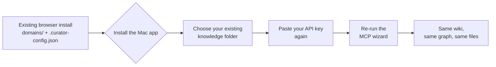

# The native Mac app — decision record

> **STATUS: THIS DESCRIBES DECISIONS, NOT A SHIPPED FEATURE.**
>
> There is **no downloadable Mac app**. As of `v3.29.0` the repository contains
> no `desktop/` directory, no Electron dependency, no DMG build, no notarization
> step and no release workflow — verified by search, not assumed. Every decision
> below is recorded so it is not re-litigated or quietly reversed; the **Status**
> column on each says whether the code for it exists yet.
>
> The way to install The Curator today is the [browser install](../README.md#quick-start).
> That is not a legacy path and it is not going away — see [D3](#d3--the-browser-install-is-not-a-legacy-path).

This file exists because of one instruction from the project owner:

> *"Do not forget to update all the relevant documentation, especially now when
> we are building the app. **We need to record all the choices we make.**"*

A feature list ages into a lie. A decision record ages into an explanation. What
follows is the second kind: for each choice, **what was decided, why, what
evidence forced it, and whether it is built**.

---

## Table of contents

- [How to read this](#how-to-read-this)
- [Status at a glance](#status-at-a-glance)
- [1. Architecture](#1-architecture)
- [2. Packaging](#2-packaging)
- [3. Release process](#3-release-process)
- [4. Migration for existing users](#4-migration-for-existing-users)
- [5. The MCP bridge under the app](#5-the-mcp-bridge-under-the-app)
- [6. Open, and deliberately undecided](#6-open-and-deliberately-undecided)
- [7. Where each decision is enforced](#7-where-each-decision-is-enforced)

---

## How to read this

Each decision carries four things:

| Field | Meaning |
|---|---|
| **Decision** | What was chosen. Stated so the opposite is a recognisable proposal, not a vague direction. |
| **Why** | The argument. Where a measurement forced it, the measurement is here rather than the conclusion alone. |
| **Evidence** | The file, line or command that proves it. Re-runnable wherever possible. |
| **Status** | `SHIPPED` — the code exists and runs today. `DECIDED` — agreed, no code yet. `PARTIAL` — the seam exists, the consumer does not. |

**A `DECIDED` row is not a description of the app.** Nothing in this file
licenses a doc elsewhere to describe a planned thing in the present tense.

---

## Status at a glance

| # | Decision | Status |
|---|---|---|
| [D1](#d1--one-codebase-one-release-two-shells) | One codebase, one release, two shells — do not fork | `PARTIAL` |
| [D2](#d2--desktop-gets-its-own-packagejson) | `desktop/` gets its own `package.json` | `DECIDED` |
| [D3](#d3--the-browser-install-is-not-a-legacy-path) | The browser install is not a legacy path | `SHIPPED` |
| [D4](#d4--branch-on-capability-never-on-install-form) | Branch on capability, never on install form | `SHIPPED` |
| [D5](#d5--asar-false-for-the-first-dmg) | `asar: false` for the first DMG | `DECIDED` |
| [D6](#d6--the-dmg-goes-to-github-releases-never-into-the-repo) | The DMG goes to GitHub Releases, never into the repo | `DECIDED` |
| [D7](#d7--the-dmg-workflow-gates-on-a-tag-push-never-on-main) | The DMG workflow gates on a tag push, never on `main` | `DECIDED` |
| [D8](#d8--release-through-a-gate-branch--ci--fast-forward--tag) | Release through a gate: branch → CI → fast-forward → tag | `SHIPPED` |
| [D9](#d9--rollback-is-forward-only) | Rollback is forward-only | `SHIPPED` |
| [D10](#d10--releasechannel-ships-with-stable-as-its-only-valid-value) | `releaseChannel` ships with `stable` as its only valid value | `SHIPPED` |
| [D11](#d11--credentials-do-not-migrate) | Credentials do **not** migrate | `DECIDED` |
| [D12](#d12--the-one-must-have-is-that-existing-wikis-appear--and-it-needs-no-new-code) | Existing wikis must appear — and that needs no new code | `SHIPPED` |
| [D13](#d13--the-existing-users-path-is-three-steps-that-already-exist) | The existing user's path is three steps that already exist | `SHIPPED` |
| [D14](#d14--the-mcp-launcher-shim-is-generated-at-every-app-launch) | The MCP launcher shim is generated at every app launch | `DECIDED` |
| [D15](#d15----domains-path-is-dropped-in-bundle-mode) | `--domains-path` is dropped in bundle mode | `DECIDED` |

---

## 1. Architecture

### D1 — One codebase, one release, two shells

**Decision.** The browser app and the Mac app are **the same release of the same
codebase**. They share `src/`, `mcp/`, the docs and the entire test suite. The
Mac app is a *shell* around the existing server, not a second product. **Do not
fork.**

Exactly four things genuinely differ between the two shells:

| | Browser install | Mac app shell |
|---|---|---|
| **Launch** | `node src/server.js`, or the AppleScript `.app` the installer builds | The desktop shell starts the same server as a child |
| **Update** | `git fetch` + `git reset --hard` + `npm install` (`POST /api/config/update`) | A signed bundle cannot rewrite its own source — the shell's own updater |
| **Data location** | `APP_ROOT` — the checkout itself | A user-data directory outside the read-only bundle |
| **MCP entry** | `<node> <APP_ROOT>/mcp/server.js` | A launcher script ([D14](#d14--the-mcp-launcher-shim-is-generated-at-every-app-launch)) |

Everything else — ingest, chat, wiki, Health, Sync, Shared Brain, working state,
the whole REST surface — is byte-identical code serving both.

**Why.** A fork doubles the surface where this project's expensive failures live.
The changelog is a catalogue of bugs that survived because a fix was applied to
one of two paths (`v3.0.17`: "apply a fix to the path that runs FIRST"), or
because two hand-maintained copies of one guard drifted (`v3.2.0`, `v3.24.0`).
A second copy of `src/` would reproduce that class at the scale of the whole app.
One test suite covering both is only possible if there is one codebase to cover.

**Status.** `PARTIAL`. The *fork points* are built and named — `paths.js` for
data location, `install-mode.js` for the rest ([D4](#d4--branch-on-capability-never-on-install-form)).
The *shell* is not. Every bundle arm in the code is currently unreachable,
because no bundle exists to reach it.

> **Honest consequence of that:** the bundle arms of the MCP entry, the updater
> and the install-mode fork have **never run end to end**. They are covered by
> offline tests that materialise a fake `.app`-shaped tree
> (`scripts/test-install-mode.js`), which proves the branch is taken — not that
> the branch works in a real signed bundle.

---

### D2 — `desktop/` gets its own `package.json`

**Decision.** When the desktop shell is built it lives in `desktop/` with a
**separate** `package.json`. Electron and its build tooling never enter the root
manifest.

**Why — this one is measurable, not stylistic.** The root manifest today has
**zero `devDependencies`**:

```bash
$ grep -c devDependencies package.json
0
```

That is not an accident. The auto-updater runs `npm install` **on every user's
machine** as step 4 of an update:

```js
// src/routes/config.js — POST /api/config/update, step 4
await execAsync('npm install --silent --no-audit --no-fund', execOpts({ timeout: 120000 }));
```

So anything in the root manifest — including a `devDependency` — is downloaded
by every browser-install user on every update. Electron is hundreds of megabytes.
Putting it in the root manifest would push that to every user of a feature they
do not use and cannot run.

**This project has already refused two tools on exactly this ground.** Playwright
was refused for the same reason (`v3.19.0` onward), and the browser-based visual
harness is driven over the Chrome DevTools Protocol against an already-installed
Chrome specifically so that `git diff package.json` is **0 lines** — a rule
`v3.23.0`, `v3.24.1` and `v3.25.0` each re-state and re-verify.

**Evidence.** `package.json` (8 runtime dependencies, no `devDependencies` key);
the `npm install` call in `POST /api/config/update`.

**Status.** `DECIDED`. `desktop/` does not exist in the repository.

---

### D3 — The browser install is not a legacy path

**Decision.** The browser install stays **fully supported**. It is the **only**
option on Windows and Linux. On a Mac with the app installed, the app supersedes
it — but nothing deprecates it, and no feature is Mac-app-only.

**Why.** The Curator's core is Express and Node, which run anywhere Node 18+
runs. The macOS-specific parts today are the one-line installer, the
AppleScript `.app`, the native folder picker and the in-app updater; ingest,
chat, wiki, MCP, Sync and Health are identical everywhere. Treating the browser
install as legacy would strand every non-Mac user for a packaging convenience.

**Status.** `SHIPPED` — this is how the app works today. Recorded here because
the arrival of a Mac app is the moment somebody proposes reversing it.

---

### D4 — Branch on capability, never on install form

**Decision.** Code asks *"can I run git against my own source?"*, never *"am I a
checkout?"*. That question lives in `src/brain/install-mode.js` as a **named
capability**, and no route may branch on the install *mode*.

**Why.** The two questions coincide today and will not coincide forever. A
Homebrew cask is a git-less **non-bundle**; so is a `.pkg` in a read-only prefix.
Branching on the form puts both of those on the repo arm — the arm that runs
`git reset --hard` — where they fail with git's own text instead of a refusal
that says why. And because `isRepoInstall()` is literally `!isBundleInstall()`,
branching on it at several sites means the day a third mode exists, every one of
those sites silently inherits the destructive arm.

**Stated honestly:** all four booleans are currently perfectly correlated with
`mode === 'repo'`. They are not four independent measurements — they are four
distinct *questions* that happen to share an answer in the only two modes that
exist. The value is the naming and the single table.

**Evidence.** `src/brain/install-mode.js`; the capability table and the full
argument in [architecture.md § Install modes](architecture.md#install-modes-srcbraininstall-modejs);
`scripts/test-install-mode.js` enforces that no route branches on the mode.

**Status.** `SHIPPED`. Two routes fork on `canSelfUpdateViaGit` today
(`GET /api/config/update-check` and `POST /api/config/update`, both returning
`501` on the bundle arm). `mcpLaunchStyle` and `restartStyle` are `PARTIAL` —
surfaced and descriptive, with **no branch behind them**.

---

## 2. Packaging

### D5 — `asar: false` for the first DMG

**Decision.** The first DMG ships with Electron's `asar` archiving **off**.

**Why — and the usual mitigation does not work here.** The reflex answer is
`asarUnpack`. It does **not** fix this, and the reason is precise:
`asarUnpack` copies a file out to `app.asar.unpacked`, but the module is still
*resolved* through the `app.asar` path, so **`__dirname` is unchanged**. And
`__dirname` is what this app derives its root from:

```js
// src/brain/paths.js
export const APP_ROOT = path.resolve(__dirname, '../..');
```

Every git subprocess in the app then runs with that as its working directory:

```js
// src/brain/sync.js
const ROOT = APP_ROOT;
// ...
      cwd: ROOT,              // Explicit cwd prevents "getcwd: Operation not permitted" on macOS
```

```js
// src/routes/config.js
const PROJECT_ROOT = APP_ROOT;
// ...
const execOpts = (extra = {}) => ({ cwd: PROJECT_ROOT, env: SUBPROCESS_ENV, ...extra });
```

`cwd` must be a directory that actually exists on disk. A path inside
`app.asar` is not one. So under `asar: true` — with or without `asarUnpack` —
**every Personal Sync git call and every updater subprocess breaks**, and they
break with an OS-level `spawn` error that names none of this.

`asar` buys startup time and a tidier bundle. Neither is worth shipping a build
whose Sync tab cannot run. Turning it on later is a deliberate change with its
own verification, not a default to inherit.

**Evidence.** The three code excerpts above, all quoted verbatim from the
current tree. Verify with `grep -n "APP_ROOT" src/brain/paths.js src/brain/sync.js src/routes/config.js`.

**Status.** `DECIDED`. No Electron build configuration exists.

---

### D6 — The DMG goes to GitHub Releases, never into the repo

**Decision.** Built artifacts are published to **GitHub Releases**. A `.dmg` is
never committed. **Signing credentials never enter this public repository** — not
as a file, not as an example, not as a fixture.

**Why.** The repository is public and is cloned in full by the installer. A
binary in git is permanent: `git clone` pays for it forever, and it cannot be
removed without rewriting history — which is the one operation this project has
identified as **irrecoverable**, because the updater does `git reset --hard
origin/main` and rewritten history propagates to every machine on its next
update check.

On credentials: this repo runs a pre-commit secret guard under
`core.hooksPath = .githooks`, and even synthetic credential fixtures are handled
deliberately (see the `git-hygiene` skill and `CONTRIBUTING.md § Git hooks`).
A Developer ID certificate and its password belong in repository **Secrets**,
which are withheld from fork pull requests by GitHub itself.

**Status.** `DECIDED`. No signing configuration exists, and nothing publishes an
artifact.

> **Measured, because the obvious summary of this is wrong.** GitHub Releases for
> this repository are **not** empty — `gh release list` returns four
> (`v2.1.0`, `v3.0.0-beta.1`, `v3.8.0`, `v3.9.0`), and `git ls-remote --tags`
> shows tags through `v3.9.2`. What is true is narrower and is the part that
> matters: those are **hand-made, source-only** releases carrying no binary, the
> newest is many versions behind the running one, and **no workflow creates or
> uploads to a Release.** So the mechanism is available and unused, not absent.

> **Note on what "signing" means in the tree today.** `scripts/build-app.sh` and
> `install.sh` both end in `codesign --force --deep --sign -` — the `-` is the
> **ad-hoc** identity, not a Developer ID. That command would *destroy* a real
> Developer ID signature, which is exactly why `canRebuildAppleScriptApp` is
> `false` on the bundle arm ([D4](#d4--branch-on-capability-never-on-install-form)).

---

### D7 — The DMG workflow gates on a tag push, never on `main`

**Decision.** The build-and-publish workflow triggers on a **tag push** (`v*`).
It does not trigger on `main`. `workflow_dispatch` was **deliberately dropped**.

**Why the tag.** [D8](#d8--release-through-a-gate-branch--ci--fast-forward--tag)
creates the tag *after* the fast-forward, on the commit `main` points at — so a
tag can never name a commit that failed CI. Gating the build on the tag inherits
that guarantee for free. Gating on `main` would not: `main` also receives the
merge commit before the tag exists, and a build triggered there races the tag.

**Why `workflow_dispatch` was dropped.** A manual dispatch runs against a
*branch*, not a tag. It can therefore produce a build whose SHA collides with the
run the release gate is watching — two runs on one commit, and the gate reading
whichever it finds. The gate's whole value is that "green" means a specific run
on a specific SHA. A convenience trigger that can make that ambiguous is worth
less than the ambiguity costs.

**Evidence.** `.github/workflows/` contains exactly **one** file, `test.yml`.
Its trigger is a bare `push:` with only `paths-ignore` — and **that absence is
load-bearing**: `scripts/release.js` refuses with `ci-not-reachable` if a
`branches:` or `branches-ignore:` key ever appears under `push:`, because a
release branch that gets no run turns the gate into something that only *looks*
like one.

**Status.** `DECIDED`. No tag-triggered workflow exists — `.github/workflows/`
holds exactly one file. `scripts/release.js` does create and push an annotated
tag, specifically so a future `electron-updater` has something to depend on,
while explicitly declining to wire a release workflow before anything consumes
it.

> **The tag history is not yet continuous, and a trigger would need to know
> that.** Measured on origin: tags run to `v3.9.2` and then stop — nothing
> between `v3.10.0` and `v3.29.0`, because the release gate that creates them is
> new and every release in that gap predates it. A `v*` trigger only ever fires
> on tags created from here on.

---

## 3. Release process

Agreed 2026-08-31. The full operational procedure — the commands, the refusal
table, what happens to the release branch — lives in
[CONTRIBUTING.md § Cutting a release](../CONTRIBUTING.md#cutting-a-release).
What follows is the *reasoning*, so the two cannot drift apart silently.

### D8 — Release through a gate: branch → CI → fast-forward → tag

**Decision.**

```
release/vX.Y.Z  →  push  →  CI (~8 min)  →  green?  →  main fast-forwards to it  →  tag
```

Four properties are structural, not stylistic:

1. **`--ff-only`.** `main` must be byte-for-byte the SHA CI ran on. A non-ff
   merge creates a commit CI has never seen. `scripts/release.js` refuses any
   `git merge` lacking the flag, and then **re-reads `HEAD`** and refuses
   `ff-failed` if the merge reported success without landing on the verified SHA.
2. **The tag comes after the merge**, on the commit `main` points at. A tag can
   then never name a commit that failed CI.
3. **Red *or unknown* leaves `main` untouched.** An unobservable gate fails
   **closed** (exit code `3`, `CI_UNKNOWN`). The release branch is left in place
   so the fix is a commit on top of it.
4. **The gate is the `offline` job only.** `live` spends real money, can take 20
   minutes, and is deliberately flake-tolerant via `scripts/ci-flake.js` — a
   required check designed to tolerate its own transient failures is the wrong
   thing to block a green tree on. It still runs post-merge, and a **skipped**
   job is named in the output, so "green" never quietly means "green on the two
   checks that happened to run".

**Why a gate at all.** Before this, **pushing to `main` *was* the deploy**, and
CI was a report card that arrived afterwards. `main` has no branch protection and
no rulesets (verified: `gh api .../branches/main/protection` returns
`{"message":"Branch not protected","status":"404"}`, and `.../rulesets` returns
`[]`), while the updater does `git fetch origin main` + `git reset --hard
origin/main`. So whatever landed on `main` reached every user on their next
update check, green or red, and nothing could stop it.

**Why not a required status check instead.** A status check can only run after
the commit exists somewhere, so requiring one on `main` forces a PR for every
release — and the maintainer is the only reviewer. The gate already runs
*before* the push rather than after it.

**Its honest limit, stated rather than implied:** the gate lives in a script, so
a bare `git push` still bypasses it. This is a solo maintainer protecting
himself from his own hurry, not a repo defending against a hostile committer.

**Evidence.** `scripts/release.js`; `scripts/test-release-preconditions.js`;
[CONTRIBUTING.md § The gate](../CONTRIBUTING.md#the-gate). Run as
`node scripts/release.js <version>` — there is deliberately no `npm run release`
alias, so the command that deploys is never one keystroke from `npm test`.

**Status.** `SHIPPED`.

> **Recorded because it is the kind of thing that gets forgotten:** the gate was
> built by an agent forbidden from pushing or tagging, so its production path was
> exercised only as far as the `wrong-branch` refusal. `v3.29.0` was its first
> real use.

---

### D9 — Rollback is forward-only

**Decision.** There is **no downgrade path and no in-app "go back a version"**.
The answer to a bad release is always another release: `git revert` the bad
commit, write its changelog row, and cut the patch **through the same gate**.

**Why.** Clients pull `origin/main` and hard-reset to it. There is nothing for a
"downgrade" to mean that would not require either a second branch (see
[D10](#d10--releasechannel-ships-with-stable-as-its-only-valid-value), which
measures why that breaks) or a force-push (which is the one irrecoverable
operation, precisely *because* the updater hard-resets).

**What is honestly available instead** — verified before being written down,
because this project has a recorded history of false revert promises
(`v3.9.1` found *"anything can be reverted from the Sync tab"* at **eight
sites** for a feature that has never existed):

- **On a standard install, checking out a version tag fails.** `install.sh` clones
  with `--depth 1`, so the user's clone has **no tags at all**. What works is a
  shallow tag fetch, then a checkout, then the app's own update commands to
  return from detached `HEAD`.
- **And most versions have no tag to fetch.** Measured against origin:
  `git ls-remote --tags` returns tags up to **`v3.9.2`**, and nothing between
  `v3.10.0` and `v3.29.0`. `scripts/release.js` does create *and push* an
  annotated tag, but the gate that does so is new — every release in that gap
  predates it. So "check out the previous version" is not a procedure a user can
  follow today, and **no user-facing copy names a version number**, precisely
  because it would be false.
- If the damage is in `domains/` rather than in code, the wiki is git-tracked, so
  a user with Personal Sync recovers with a git client. **There is no in-app
  revert and there never has been.**

**Status.** `SHIPPED` (as a documented procedure —
[CONTRIBUTING.md § When a release is bad](../CONTRIBUTING.md#when-a-release-is-bad)).

---

### D10 — `releaseChannel` ships with `stable` as its only valid value

**Decision.** The config key `releaseChannel` exists and resolves. `stable` is
the **only** value it accepts; anything absent or unrecognised resolves to
`stable`. There is **no second channel**, and no UI control writes it.

**Why not ship `beta` too — this is a measurement, not caution.** A real user's
install is created by `install.sh`:

```bash
git clone --depth 1 https://github.com/talirezun/the-curator.git "$INSTALL_DIR" --quiet
```

`--depth 1` **implies `--single-branch`**, so that clone's refspec is
`+refs/heads/main:refs/remotes/origin/main` and nothing else. Measured against a
throwaway origin that genuinely had a `beta` branch:

| Command | Result |
|---|---|
| `git fetch origin beta` | prints `* branch beta -> FETCH_HEAD` — **looks fine** |
| `git reset --hard origin/beta` | dies with `fatal: ambiguous argument` |

**The fetch succeeds and the reset kills the update.** So shipping a second
channel would break the updater for anyone who selected it, silently, at the
first step that looks like it worked. An explicit refspec was measured working
and deliberately **not** written, because nothing can reach it today; the
measurement lives beside the resolver and a guard fires the day someone adds a
second channel.

**Why ship the key at all, then.** So the resolved channel is **inspectable**.
Given a support report, the only way to tell *"resolved to stable because the key
is absent"* from *"resolved to stable because the key says something this build
has never heard of"* is to see the resolved value beside the raw file. It is
surfaced additively on `GET /api/config` as `releaseChannel`, and on
`GET /api/config/update-check` as `channel` and `branch`.

**Evidence.** `install.sh` (the clone line); `resolveReleaseChannel` /
`getReleaseRef` in `src/brain/config.js`; `scripts/test-release-channel.js`,
which pins the resulting command strings as literals against the pre-change
handler.

**Status.** `SHIPPED`.

---

## 4. Migration for existing users

This is the part users actually feel. The short version:



### D11 — Credentials do **not** migrate

**Decision.** The Mac app does **not** read, copy or import API keys, GitHub
sync tokens or Shared Brain admin tokens from an existing browser install. The
user pastes their key again.

**Why.** This was the project owner's call, and it **deleted the riskiest step
in the whole pivot**. An automatic credential import means a new, unaudited code
path that reads three `0600` secret files from one location and writes them to
another — in an app whose credential handling is currently narrow and
well-guarded (atomic writes at mode `0600`, a startup hardening sweep, and a
rule that any new secret-bearing file joins that sweep). Migration code is
written once, runs once per user, is nearly impossible to test in the shapes that
matter, and fails in the direction where a secret ends up somewhere nobody
intended.

Pasting a key is a **thirty-second** step the user has already done once and
which the Settings view is built for. That is a good trade.

**Consequence, stated plainly:** an existing user must re-enter their API key,
and — if they use them — re-run the Personal Sync and Shared Brain connection
flows. Their **wiki, domains, chat history and working state are untouched**;
only credentials do not come across.

**Status.** `DECIDED`.

---

### D12 — The one must-have is that existing wikis appear — and it needs no new code

**Decision.** The single hard requirement for migration is that an existing
user's **domains and wiki pages show up** in the Mac app. Nothing new has to be
built for that.

**Why it is already solved.** Three facts do all the work:

1. **The wiki is plain markdown on disk.** There is no database, no index to
   rebuild, no import. Pointing at the folder *is* the migration.
2. **`POST /api/config/domains-path`** takes a path, checks the folder exists,
   and persists it — behind `guardConcurrent`, so it cannot fire mid-ingest.
3. **`POST /api/config/pick-folder`** opens the native macOS folder picker and
   persists what the user chose, re-checking for in-flight writes *after* the
   dialog closes (the dialog can block for up to 60 seconds).

Both routes ship today and are used by the browser app's **Settings → Knowledge
base folder**. They are documented in
[api-reference.md](api-reference.md#post-apiconfigdomains-path).

**Status.** `SHIPPED` (the mechanism). What is `DECIDED` is only that the Mac
app will use it rather than inventing an importer.

---

### D13 — The existing user's path is three steps that already exist

**Decision.** Migration is documented and supported as exactly three steps, each
of which is an existing, shipping surface:

| Step | Where | Already exists? |
|---|---|---|
| 1. **Choose your knowledge folder** | Settings → Knowledge base folder | ✅ `POST /api/config/pick-folder` |
| 2. **Paste your API key** | Settings → API keys | ✅ `POST /api/config/api-keys` |
| 3. **Run the MCP wizard** | Settings → My Curator MCP | ✅ the three-step wizard |

**Why step 3 is not optional for MCP users.** The Claude Desktop entry embeds
absolute paths, so an entry written by a browser install names the checkout's
`mcp/server.js`. The wizard already detects a stale entry and shows a banner;
under the app it is the same wizard reaching a different launcher
([D14](#d14--the-mcp-launcher-shim-is-generated-at-every-app-launch)).

**Status.** `SHIPPED` (all three surfaces).

---

## 5. The MCP bridge under the app

### D14 — The MCP launcher shim is generated at every app launch

**Decision.** In bundle mode the Claude Desktop entry points at a **launcher
script that the app rewrites every time it starts**. It is neither shipped inside
the bundle nor written once by the wizard.

**Why not ship it in the bundle.** A signed `.app` is read-only, and a file the
app generates inside its own bundle **invalidates the code signature**. That is
the same fact behind `canWriteBesideCode: false`.

**Why not have the wizard write it once.** A wizard-written file is correct only
until something changes. It goes stale when the app moves, when Node's location
changes, or under **App Translocation**, which macOS applies to a quarantined app
— running it from a randomised read-only path, so `process.execPath` is not where
it was last time. A file rewritten on every launch is correct as of the last
launch, which is the strongest guarantee available without a background agent.

**The honest limit.** Between moving the app and next launching it, the shim is
**stale for one session**: Claude Desktop spawning the MCP child in that window
gets the old path. Launching The Curator once fixes it. This is recorded rather
than engineered around, because the alternative — a login item or a watcher —
is a much larger commitment than the failure justifies.

**Status.** `DECIDED`. Today `mcpLaunchStyle` is a **descriptive string only**:
`'node-script'` for repo, `'launcher-script'` for bundle. **Nothing branches on
it, and no launcher is generated anywhere.** `GET /api/mcp/config` reports the
current entry and has no launcher fields.

---

### D15 — `--domains-path` is dropped in bundle mode

**Decision.** The bundle-mode MCP entry omits the `--domains-path` argument that
the repo-mode entry carries.

**Why.** The flag is a **snapshot** — the folder as it was when the config was
written — and it sits **above** the user's live Settings choice in the resolution
ladder. Here is the ladder, in the order `getDomainsDir()` actually evaluates it:

| Rung | Source | Notes |
|---|---|---|
| 1 | `__setDomainsDirOverride()` | test seam, in-process |
| 2 | `CURATOR_TEST_DOMAINS_DIR` | test seam, crosses a process boundary |
| 3 | **`--domains-path`** | the launch flag — **MCP only**, null in the app |
| 4 | **`cfg.domainsPath`** | the user's live Settings choice |
| 5 | `DOMAINS_PATH` | documented developer fallback |
| 6 | default | |

Rungs 1 and 2 are never set in production, so **in a real install the flag is
the first rung that can be set and the stored setting is the second**. That
ordering is correct for the repo install — the flag is written by the wizard from
the same stored setting, so the two agree, and the ordering exists so MCP reads
and writes cannot resolve different trees.

Under the app it stops being correct. The bundle's own resolution already finds
the user-data directory, and a stale flag would **outrank a folder the user
changed in Settings** — so the MCP child would silently read a different wiki
from the one the app is showing, with no error anywhere. Dropping the flag lets
both processes resolve through the same stored setting.

**Evidence.** `getDomainsDir()` in `src/brain/config.js` (the ladder above is
that function, in order); `buildCuratorEntry()` in `src/routes/mcp.js`, which
today **always** emits `args: [MCP_SERVER_PATH, '--domains-path', domainsDir]`.

**Status.** `DECIDED`. `buildCuratorEntry` has no bundle arm.

> **Correction on the record.** This decision has been summarised elsewhere as
> *"the flag sits at rung 2, above the user's live Settings choice at rung 3"*.
> The **ordering is right and is the load-bearing part**; the rung numbers are
> not. Counting every rung the function evaluates, the flag is rung 3 and the
> stored setting is rung 4. Counting production-reachable rungs only, they are 1
> and 2. The table above is the function, in order, so it cannot drift.

---

## 6. Open, and deliberately undecided

Recorded so nobody mistakes silence for a decision.

| Question | State |
|---|---|
| **How the app updates itself** | Open. `canSelfUpdateViaGit: false` means the repo updater refuses on the bundle arm with a `501`. `scripts/release.js` creates tags now so `electron-updater` has something to depend on later, but **nothing consumes them** and no updater is chosen. |
| **What "restart" means in the app** | `restartStyle: 'app-relaunch'` is recorded as a string with **no branch behind it**. `POST /api/restart` still respawns `process.execPath`, which under a shell would leave a windowless app. |
| **Quit-while-writing** | `GET /api/write-status` ships and answers `{safeToQuit, activeWrites, operations[]}` — built for a `before-quit` handler that does not exist. **Nothing in repo mode consumes it.** |
| **Windows and Linux shells** | Not planned. Those platforms use the browser install ([D3](#d3--the-browser-install-is-not-a-legacy-path)). |
| **Notarization and Gatekeeper** | Open. No entitlements file, no hardened-runtime configuration, no notarization step exists. Without notarization a downloaded DMG shows Gatekeeper's "unidentified developer" dialog. |
| **Where user data lives in the bundle** | The *mechanism* is decided and built (`paths.js` resolves a user-data directory outside `APP_ROOT`, and the detection is a **positive test for "bundle"** so an unrecognised layout keeps data where it is). The exact directory the shell will present has not been exercised by a real bundle. |

---

## 7. Where each decision is enforced

A decision that lives only in prose gets reversed. These are the places where
the code itself refuses:

| Decision | Enforced by |
|---|---|
| [D4](#d4--branch-on-capability-never-on-install-form) | `scripts/test-install-mode.js` — no route may branch on the mode; `defineCapabilities()` throws at module load on an incomplete record |
| [D7](#d7--the-dmg-workflow-gates-on-a-tag-push-never-on-main) | `scripts/release.js` refuses `ci-not-reachable` if `.github/workflows/test.yml` gains a `branches:` filter; `scripts/test-release-preconditions.js` asserts it against the real file |
| [D8](#d8--release-through-a-gate-branch--ci--fast-forward--tag) | `scripts/release.js` — a `git merge` without `--ff-only` is refused as an unsafe command; the landed SHA is re-read and mismatch refuses `ff-failed` |
| [D10](#d10--releasechannel-ships-with-stable-as-its-only-valid-value) | `resolveReleaseChannel()` is total by construction; `scripts/test-release-channel.js` pins the resulting git commands as literals |
| [D2](#d2--desktop-gets-its-own-packagejson) | Nothing automated. **This is a gap** — see below. |

**Not enforced, and worth knowing:**

- **Nothing fails if a `devDependency` is added to the root manifest.** [D2](#d2--desktop-gets-its-own-packagejson)
  rests on discipline plus the repeated per-release check that `git diff package.json`
  is 0 lines for tooling work. A guard asserting the root manifest has no
  `devDependencies` would close it.
- `scripts/release.js` declares **30** refusal ids. `CLAUDE.md`'s `v3.29.0` row
  says 25 and `CONTRIBUTING.md`'s table lists the notable ones; the only
  automated check is an anti-vacuity floor of `>= 20`. Derive the list from the
  `REFUSALS` object, never from prose.

---

## Further reading

- [architecture.md § Install modes](architecture.md#install-modes-srcbraininstall-modejs) — the capability table and its full argument
- [architecture.md § Where user data lives](architecture.md#where-user-data-lives-srcbrainpathsjs) — why bundle detection is a positive test
- [CONTRIBUTING.md § Cutting a release](../CONTRIBUTING.md#cutting-a-release) — the operational procedure
- [mac-app.md](mac-app.md) — the AppleScript Dock app that ships **today**
- [api-reference.md](api-reference.md) — `GET /api/version`, `GET /api/write-status`, and the config routes migration relies on
