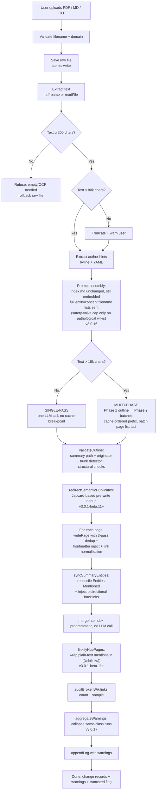
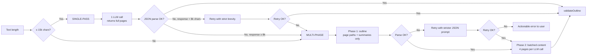
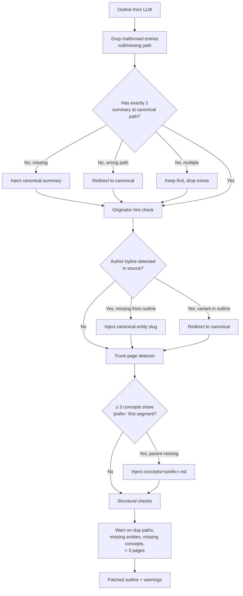
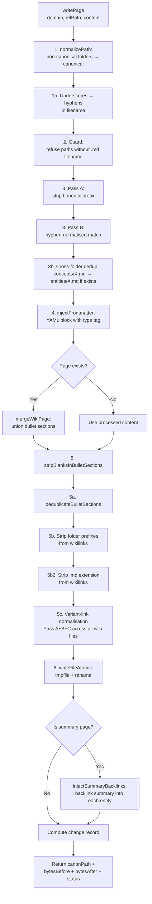
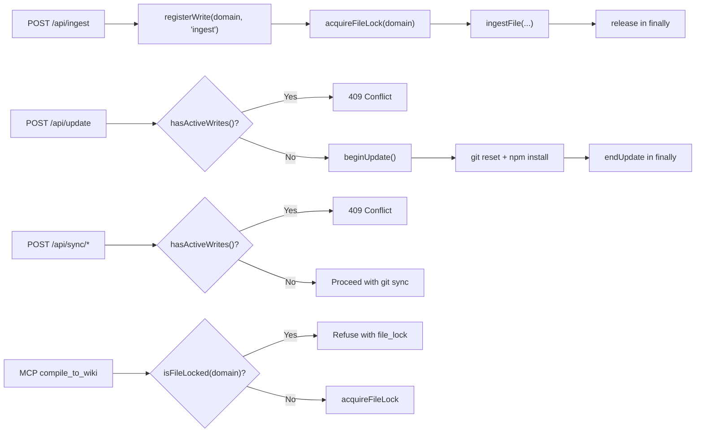
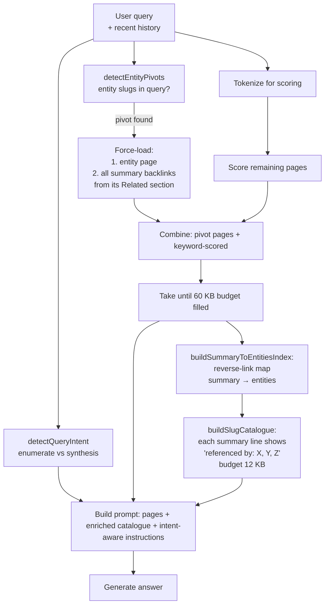

# The Ingestion Pipeline — Technical Deep Dive

This document is the definitive technical reference for The Curator's ingestion pipeline — how a raw source document becomes a structured wiki of interlinked entities, concepts, and a summary. It covers the architectural decisions, every safeguard in the pipeline, the LLM-failure modes the code defends against, and the quality contract guaranteed at write time.

If you're a user looking for how to drop a PDF in and what happens next, start with [the user guide](user-guide.md#8-ingest-a-source). If you're a developer wanting to understand the system at the level needed to debug or extend it, read on.

**Last updated**: v3.0.17

---

## 1. Why ingestion is the heart of The Curator

The Curator is built on a deliberate architectural choice: **compiled knowledge**, not retrieval. Where RAG-based systems answer questions by embedding-search at query time, The Curator pays the LLM cost ONCE at ingest time and builds a persistent, human-readable wiki on disk. Every subsequent question is answered against that wiki — instant, deterministic, and visible to the user.

This means the ingestion pipeline is the single most important code path in the application. Every wiki page you see, every `[[wikilink]]` between pages, every Obsidian graph edge — all of it was produced by one ingest, and the quality of the resulting wiki is the quality of the pipeline.

The pipeline has been refined over a year of real-world use. Most of its complexity is **safeguards** — code that catches the ways LLMs fail to follow instructions, recovers gracefully, and tells the user what happened.

---

## 2. High-level flow



Every step from C onwards uses **atomic writes** (write-to-tempfile + rename) so a process kill mid-ingest leaves either the old file or the new file intact — never a torn zero-byte file.

---

## 3. Stage-by-stage walkthrough

### Stage 0 — Upload and validation (`src/routes/ingest.js`)

The frontend sends a `multipart/form-data` POST. The route handler:

1. Validates `domain` is non-empty and exists in `listDomains()`.
2. Validates the uploaded `file` is `.txt`, `.md`, or `.pdf` (multer fileFilter).
3. Checks `<domain>/raw/<filename>` doesn't already exist (returns 409 with `duplicate: true` unless the client sends `overwrite=true`).
4. Checks the write registry (`hasActiveWrites()` / `isUpdateInProgress()`) — refuses with 409 if a conflicting operation is running.
5. Acquires the cross-process file lock at `<domain>/.write-lock`.
6. Switches the response to **Server-Sent Events** and starts streaming progress.

Everything from this point flows through `ingestFile()` in `src/brain/ingest.js`.

### Stage 1 — Raw save + text extraction (`ingestFile`)

The uploaded file is copied atomically to `<domain>/raw/<filename>`. PDFs go through `pdf-parse` (with a try/catch + raw-file rollback on failure); MD and TXT files are read directly.

**Empty-extraction guard** (v3.0.1-beta.8+): if the extracted text is less than 200 characters, the pipeline refuses with an actionable message ("Could not extract text — this is usually an encrypted PDF or a scanned PDF needing OCR") and deletes the raw file so retry isn't 409-blocked.

**Truncation cap**: text is capped at 80,000 characters. When truncation kicks in, a warning is added to `result.warnings` so the user sees it in the result panel.

**Author-hint extraction**: `extractAuthorHints(fullText)` scans the head and tail of the source for explicit author markers:
- YAML `author: "Name"` or `author: [[Wikilink]]`
- "By Dr. X" / "by First Last" bylines
- "Author:" / "Authors:" lines

The detected names are passed to `validateOutline` later, which will inject the originator entity if the LLM omits it.

### Stage 1b — Prompt caching + the existing-page safety valve (v3.0.16)

Before either LLM path runs, `ingestFile` assembles what actually gets sent to the model. **`index.md` is embedded in the outline and single-pass prompts exactly as it always was — this release does NOT change that.** An earlier iteration of this work also removed the index from those two prompts (mirroring the v3.0.1-beta.25 fix that did the same for the *compile* prompt), and that removal is what an earlier draft of this document described. It was reverted before shipping: live testing found the measured saving from removing the index alone (-16.2% for the canonical multi-batch case) was roughly half of what prompt caching delivers on its own (-30.3%, see below), while the index-removal path was the one carrying open questions about behaviour on Gemini. Caching does not change anything the model is given — same content, same order for the two prompts that matter — so it shipped alone. `buildOutlinePrompt` and `buildPrompt` are otherwise **byte-identical to v3.0.15**.

What this release actually ships is two things: a reorder of the Phase 2 batch prompt that enables caching, and a rarely-firing safety valve on the existing-page filename lists (unrelated to the index; covered second, below).

**Phase 2 batch prompts are reordered for caching — this is the headline of this release.** `buildBatchPromptParts` splits the batch prompt into a `{prefix, suffix}` pair instead of one string. Every field that is identical across every batch of one ingest — today's date, the source document, the existing-files inventory, the outline's full page list, and all instructional/formatting rules — lives in `prefix`; only the specific page paths this call must write live in `suffix`, at the very end. Concatenating `prefix + suffix` reproduces the exact same prompt content and size as before v3.0.16; **only the order of two blocks changed, nothing was removed.** That's exactly why this is low-risk: the model sees identical content on every batch, just re-sequenced so the front of the prompt is byte-stable call to call.

Measured on one Phase 2 batch, real `articles` domain (600 entity pages, 2,651 concept pages), 57,060-byte source: the batch prompt is **145,879 chars, unchanged in size** — of that, **145,352 chars are a stable prefix shared byte-for-byte across every batch of this ingest**, with only a **527-char tail** varying per call. That prefix is what the caching below exploits.

This reorder buys two different things per provider:

- **Anthropic** — the caller can mark `prefix` with an explicit `cache_control` breakpoint (see §7.2). Reads cost ~0.1× base input; writes cost 1.25×, so a breakpoint only pays for itself across ≥2 uses. Verified live across multiple real multi-batch ingests: effective input-token saving landed **roughly in the 50–70% range** on the ingest's cacheable calls (one run: 41,783 cache-write + 167,132 cache-read tokens ≈ 52%; another: 25,933 cache-write + 259,330 cache-read tokens ≈ 71% — the exact ratio depends on how many batches share the prefix, so treat this as a range, not a fixed number).
- **Gemini** — 2.5-family models cache a stable prefix **implicitly**, no API change required; a longer, byte-stable prefix is simply worth more automatically. Observed implicit-cache hit rate on two live runs: **84.6% and 91.9%** — a single-run observation, not a guarantee.

**Headline total-ingest saving: -30.3%** for the canonical multi-batch case (outline call + 3 batches, real `articles` domain, 57,060-byte source, Anthropic caching engaged) — this is caching's contribution alone, with the index unchanged in every prompt.

Single-pass ingest is unaffected by the reorder (it has no batch loop to share a prefix across) and deliberately gets no cache breakpoint at all — a one-shot prefix would pay the 1.25× cache-write premium for zero reads, making that single call more expensive, not less. See §7.2 for the full gating logic.

**On quality:** reordering the batch prompt does not change what the model is given, only the sequence it arrives in, so no quality effect is expected from this change and none was reliably measured. Do not read the broken-wikilink percentages anywhere in this document as evidence about the current shipping code's link quality — they were gathered under configurations (a capped inventory; a since-reverted index removal) that either no longer ship or, where they do ship (the safety valve, below), essentially never engage on a real domain.

**The existing entity/concept filename lists are a safety valve, not a cost cap.** `capExistingFilesForPrompt(existingFiles, sourceText)` runs once per ingest, before either path branches, and produces the `promptFiles` object every prompt builder actually receives — unrelated to the index/caching work above. Read the block comment on `SLUG_INVENTORY_BUDGET_CHARS` in `ingest.js` before touching this — it exists specifically to stop a future well-meaning "let's shrink this further" change from repeating the mistake below.

- **What happened:** the cap originally shipped at a 24,000-character-per-list budget as a cost measure. A controlled A/B test on the real `articles` domain (Anthropic `claude-haiku-4-5`, n=2 per arm, under a now-reverted build that also removed the index) measured its effect on the broken-wikilink rate of the resulting pages:

  | Arm | Broken-wikilink rate |
  |---|---|
  | Full inventory (no cap) | 4.3% (range 2.4%–6.1%) |
  | Capped at 24,000 chars/list | **9.2%** (range 5.4%–13.0%) — **2.2× worse** |

  Haiku leans on the full slug list to ground its `[[wikilinks]]`; trimming it to the most-relevant 562 of 2,651 concepts didn't make it link more carefully, it made it invent slugs it couldn't verify. Gemini's link quality was unharmed in that arm. **This specific comparison is old, small-sample (n=2), and superseded by a later, larger measurement that could not reliably resolve a quality effect at all (see above) — it is kept here only as the historical reason the budget was raised, not as a standing claim about current quality.**
- **What it is today:** the budget was raised to `SLUG_INVENTORY_BUDGET_CHARS = 160,000` characters per list — derived from the tightest context window this app ships against (`claude-haiku-4-5` at 200,000 tokens), not chosen for cost. At that size the valve **does not fire on any real domain measured so far** — the largest list on hand (the `articles` domain's 2,651 concepts) renders to ~112,200 chars, about 70% of the budget. It starts truncating only around ~3,780 pages in a single folder at today's average filename length — a genuinely pathological wiki size. **Do not lower this constant to save tokens** — it is an inert safety valve against a hard context-window failure on a pathological domain, not a cost lever; the actual cost saving in this release is the caching above.
- When it does fire, `capSlugInventory` scores every filename by **token-overlap coverage** with the source document (using the same `tokenize()` the Shared Brain delta/synthesis code uses) and keeps the most relevant entries until the budget is spent; the result is still fully **deterministic** and never silent — a warning naming how many of how many pages were left out is pushed into `result.warnings` (see the [ingest-report reference](user-guide.md#full-reference-of-ingest-report-entries)).
- **The dedup safety net keeps scanning the FULL list regardless.** `redirectSemanticDuplicates` — the Jaccard-based guard that catches slug drift (`expert-roundup-format` vs `experts-roundup-format`) — is called with the original, uncapped `existingFiles`, never `promptFiles`.
- Distinct from this valve: the multi-phase batch prompt's "PAGES BEING CREATED IN THIS SAME INGEST" block (above) lists `allOutlinePages` — the *plan for this one ingest* (typically 5–40 pages, per the outline budget rule) — which is a different, much smaller input and is **not** subject to `SLUG_INVENTORY_BUDGET_CHARS` at all.

### Stage 1c — Sizing the Phase 1 outline budget (v3.0.17)

`MULTI_PHASE_OUTLINE_TOKENS` (`24576`) caps how many output tokens Phase 1's single outline call may spend. A community report that ingest "hangs, then fails with an output-limit error" prompted an investigation into whether this budget was simply too small. It produced one finding that is now established from real data, and one that explicitly is **not** — both are recorded in the block comment directly above the constant in `src/brain/ingest.js`, because the gap between the two is exactly what stops a future well-meaning "let's lower this" change from repeating the same mistake.

**Established — the overflow is runaway generation, not legitimate volume.** Measured over 180 real ingest log entries across this repo's own domains, the outlines that actually overflowed the 24,576-token cap were **44 and 53 pages** (≈7,700–8,800 chars) — while outlines of **370, 328, 316, 304, 297, 283, 269 and 265 pages** all completed comfortably under the very same cap. A 44-page outline blew a cap that a 370-page outline cleared. Overflow correlates with page count not at all, with index size not at all, and with source length not at all — it correlates with source *character*: 6 of 7 overflow cases in one domain were highly repetitive "engagement session" logs, the classic LLM degeneration trigger (the same mechanism documented for `compile.js` in the v3.0.1-beta.25 release). Raising the budget would not help a runaway call — it would just let it burn longer before Anthropic's own output cap (`ANTHROPIC_MAX_OUTPUT_TOKENS`) clamps it anyway.

**Not established — exactly how big the largest *legitimate* outline is.** A first attempt at re-deriving this budget from proxies (page counts in `log.md`, description lengths in `index.md`) lowered it to `16384` — and that was wrong: the proxy parser had captured `index.md`'s **Type** column (`"summary": "entity"`) instead of its **Summary** column, sizing a real outline entry at ~73 chars. Corrected against the real Summary column (n = 2,047: mean 112.5 chars, median 113, p90 160, p99 191), an outline entry is closer to **~176 chars**. Re-derived against the largest real outline on hand — 370 pages, 65,001 chars — the token cost depends on a chars-per-token ratio that cannot be measured offline:

| Assumed ratio | Implied tokens |
|---|---|
| 2.5 chars/token | 26,000 |
| 3.0 chars/token | 21,667 |
| 3.5 chars/token | 18,572 |
| 4.0 chars/token | 16,250 |

Two bounds narrow this further. (a) That specific 370-page ingest is *known* to have succeeded under the 24,576-token cap, so its true size is ≤ 24,576, which forces the effective ratio to at least ≈2.64 chars/token for this payload. (b) 4.0 chars/token is an optimistic ceiling — it's the ratio for plain English, and an outline entry is roughly a third hyphenated slug, which BPE tokenizers fragment far more finely than prose. A component estimate — weighting JSON punctuation (~3.4 c/tok), slug paths (~2.5 c/tok), and prose summaries (~4.0 c/tok) by their real character shares — lands at ~3.53 chars/token, i.e. **≈18,400 tokens**, the single best estimate. So the largest real outline sits somewhere in **16,250–24,576 tokens**, best estimate ~18,400 — `16384` sits at the very bottom of that range and cannot be shown to clear it.

**Why `24576` stays.** It's the only value the data actually supports: the one budget the largest *observed* real outline is *known* to fit under. Lowering it to `16384` on the strength of an uncertain, bottom-of-range estimate would very likely convert the largest, most valuable ingests a user runs (hundreds of pages) into a forced, doubled-cost retry — to save a shorter stall on the small share of ingests that run away regardless of the cap. The other two multi-phase budgets, `MULTI_PHASE_BATCH_TOKENS = 16384` and `MULTI_PHASE_SINGLE_PAGE_TOKENS = 8192`, were left untouched by this investigation — over the 5,019 pages on disk at the time, a 4-page batch at the p99 page size runs at ≈2× headroom and a single page at p99 runs at ≈4× headroom, and unlike Phase 1's plan-shaped output, their output legitimately scales with the source.

**Measuring it properly, going forward.** `reportOutlineUsage(label, totals, pageCount)` logs Phase 1's *real*, per-call output-token spend to stderr on every ingest (this module reserves stdout for the MCP child process's JSON-RPC frames — see v2.5.2), e.g.:

```
[ingest] Phase 1 complete (accepted outline): 370 pages, 18,412 output tokens
of 24,576 (74.9% of budget), 9,204 input, 1 provider call(s).
```

It fires at up to three points per ingest — the first attempt (labelled `OVERFLOWED` if it failed on the token limit), the stricter retry if one ran, and the accepted outline actually used — so a runaway-vs-legitimate-volume question can be answered by comparing the first two lines directly (a ~100%-of-budget first attempt followed by a ~10%-of-budget recovery is generation running away, not an outline that legitimately needed more room). Collect this across a few large real ingests on both providers before this constant is touched again — do not lower it on a proxy measurement.

### Stage 2 — Choose single-pass or multi-phase



**Why the 15k threshold?** Anything beyond ~15k chars produces 10-20k chars of JSON in single-pass, which is enough for accumulated unescaped quotes to break parsing. Multi-phase keeps each batch's output to ~3k chars of JSON — far more reliable.

**Why the 8k retry limit?** If the single-pass response is already large AND parsing failed, retrying with "strict brevity" prompts the same LLM to produce a similarly large response. Skipping straight to multi-phase saves an LLM call.

### Stage 3 — `validateOutline` (the safety net)

After the LLM returns its plan, `validateOutline()` (in `src/brain/ingest.js`) applies a series of programmatic guarantees:



The validator is the single chokepoint where five distinct invariants are enforced:

1. **Exactly one summary at the canonical path** (computed from the source filename). Re-ingesting the same file lands on the same summary slug → merge, not duplicate.
2. **Originator entity present**. If the source has a clear byline ("By Dr. X") but the LLM omitted that entity from the outline, the validator injects `entities/<canonical-slug>.md`.
3. **Honorific normalisation**. `entities/dr-tali-rezun.md` and `entities/dr.-tali-rezun.md` both redirect to `entities/tali-rezun.md` BEFORE writing — so Phase 2 generates content for the canonical path.
4. **Trunk-page detector**. When ≥3 concepts share a common first segment (`taste-as-moat`, `taste-as-judgment`, `taste-formula`), the parent `concepts/taste.md` is injected if missing. Fired correctly on real Gemini output during the v3.0.1-beta.8 deep test.
5. **Structural warnings**. Surfaces issues the user might miss (duplicate paths in outline, zero entities, zero concepts, < 3 pages total).

### Stage 4 — `writePage` (the write chokepoint)

Every wiki write — from ingest, Compile to Wiki, Health auto-fix, MCP `compile_to_wiki` — goes through `writePage()` in `src/brain/files.js`. This is THE one chokepoint. There is no parallel write logic anywhere in the codebase.



Key invariants `writePage` guarantees:

- **One file per canonical slug** — same entity name written in three different ways across three ingests lands on one file.
- **Atomic writes** — process kill mid-write never leaves a zero-byte file (v3.0.1-beta.8+).
- **No folder-prefix or `.md` in wikilinks** — `[[concepts/rag]]` → `[[rag]]`, `[[foo.md]]` → `[[foo]]` (v3.0.1-beta.9+).
- **Type tag always present** — `type/entity`, `type/concept`, or `type/summary` enforced in frontmatter even when the LLM mirrors the source's own YAML (v3.0.1-beta.9+).
- **Variant slugs collapse to canonical** — `[[dr-tali-rezun]]` rewrites to `[[tali-rezun]]` at write time (Pass A); `[[talirezun]]` rewrites to `[[tali-rezun]]` (Pass B); `[[energy-and-water-footprint]]` rewrites to `[[summaries/the-energy-and-water-footprint-of-generative-ai]]` (Pass C, prefix-tolerant).
- **Bullet sections merge** — Key Facts, Related, Entities Mentioned grow with each ingest; prose sections (Summary, Definition) use the incoming LLM version.

### Stage 5 — `syncSummaryEntities` (the post-write reconciler)

After every page is written, `syncSummaryEntities()` runs to fix the most common LLM compliance failure: the summary's "Entities Mentioned" section lists 5-7 entities when 20-30 entity pages were actually written.

The reconciler:

1. Takes the ground-truth list of canonical paths actually written this ingest.
2. Injects every entity AND concept slug into the summary's "Entities Mentioned" section.
3. Deduplicates the bullets.
4. Re-fires `injectSummaryBacklinks()` so every entity/concept page gets a backlink to the summary in its Related section.

This is what gives The Curator's wiki its characteristic bidirectional density — every summary knows every entity it references, every entity knows every summary that referenced it, and Obsidian's Graph View shows them connected.

### Stage 6 — `mergeIntoIndex` (the programmatic index)

Pre-v3.0.1-beta.1, the index was regenerated by a third LLM call (Phase 3). On large domains the 20+ KB index saturated the output budget; pages would land on disk but vanish from the index.

Now the index is updated **programmatically**:

1. Read the existing `index.md`.
2. For each newly-CREATED page (status === 'created'), append a row keyed by canonical path.
3. Skip rows whose slug is already in the index (so re-ingest never duplicates).
4. Sanitise summaries against pipe/newline injection.

Same primitive is used by `compileConversation` and MCP `compile_to_wiki`.

### Stage 7 — `auditBrokenWikilinks` (the quality signal)

After all writes complete, the pipeline runs a final audit (v3.0.1-beta.9+):

1. Build a slug inventory from all three canonical folders.
2. Scan every page written this ingest for `[[wikilinks]]`.
3. Count how many don't resolve.
4. Emit a warning with the count + first 3 examples if any failed.

This is the user's first signal that the LLM produced "phantom" wikilinks — entities mentioned in Phase 2 batches that weren't on the page plan in Phase 1. The user can then run Wiki Health → Ask AI to triage them.

### Stage 7b — `aggregateWarnings` (v3.0.17)

By the time all the stages above finish, `warnings` can hold dozens of near-identical entries — a document with many long pages routinely produces a dozen ".md extension" fixes or several batch-overflow recoveries, each pushed individually at the point it happened. Left as-is, those repeats bury the handful of entries a user actually needs to read. A real ingest log this stage was built from went from **75 warnings to 11**.

`aggregateWarnings(warnings, threshold = WARNING_AGGREGATION_THRESHOLD)` runs once, immediately before the log entry is built, and is the single chokepoint for the report: `appendLog`'s log entry, the SSE `done` payload, and `result.warnings` (which becomes the result-panel banner) all read from its return value, so the permanent record and what the user sees always agree. It never mutates its input.

- **Threshold is `3`** (`WARNING_AGGREGATION_THRESHOLD`). A class with 1 or 2 occurrences is left completely alone — at that count the individual message, which names the specific page, is more useful than a summary. At 3 or more, every member of the class is replaced — at the position of the *first* member — by one rendered summary naming the count and up to `MAX_WARNING_EXAMPLES` (3) examples, with `, …and N more` for the rest.
- **Five classes aggregate**, matched by an exact regex (`AGGREGATABLE_WARNINGS`) against the warning text pushed elsewhere in the pipeline:

  | id | Where the individual warning comes from | Bucket in `classifyIngestEntry` |
  |---|---|---|
  | `missing-md` | `writePage` step 5b2, via `warn()` | ℹ Info |
  | `concise-rewrite` | The Phase 2 single-page brevity retry (`CONCISE_PAGE_DIRECTIVE`, §4 below) | ⚠ For review |
  | `stub-page` | The last-resort `stubPageContent` fallback | ⚠ For review |
  | `batch-overflow` | A Phase 2 batch call hitting its output-token limit | ℹ Info |
  | `no-path` | `reconcileGeneratedPages`, a page with no `path` field | ℹ Info |

- **Two classes never aggregate, on purpose**: semantic near-duplicate redirects (`redirectSemanticDuplicates`) and trunk-page injections (`validateOutline`'s trunk detector). Each names a specific pair or a specific injected parent page the user may want to sanity-check individually — folding "12 semantic duplicates were merged" into one line would hide exactly the auto-redirects worth double-checking.
- **Classification is preserved deliberately, not incidentally.** `classifyIngestEntry` in `src/public/app.js` buckets by substring match against the *rendered* string, so each `render()` function in `AGGREGATABLE_WARNINGS` is written to keep (or knowingly change) the bucket its un-aggregated counterpart already had. The `concise-rewrite` and `stub-page` renderers deliberately retain the load-bearing substrings `"briefer than the rest"` and `"stub page"` for exactly this reason — losing either would silently drop the aggregate from amber to the blue Info default. (v3.0.17 also gave `classifyIngestEntry` a dedicated, first-class `'briefer than the rest'` trigger — it previously landed in the amber bucket only by accident, via the `'stub page'` trigger matching inside the negation *"not a stub page"*, which was semantically backwards and one reword away from silently going blue.)
- A broken per-class `render()` can never eat a warning — `aggregateWarnings` wraps each call in a try/catch and falls back to passing the original, un-aggregated message through on any failure.

### Stage 8 — `appendLog`

A markdown log entry is appended to `<domain>/wiki/log.md` with the title, the canonical paths written, and all warnings collected. This is the audit trail — every ingest leaves a permanent record of what happened.

---

## 4. Failure-mode catalogue

The pipeline catches the following LLM-compliance failures programmatically (no manual intervention required):

| Failure | Frequency | Where it's caught |
|---|---|---|
| Summary path differs from canonical filename slug | Common | `validateOutline` redirects |
| Multiple summary entries in outline | Occasional | `validateOutline` keeps one |
| Author/originator entity omitted | Common | `extractAuthorHints` + `validateOutline` injects |
| Honorific variant slug (`dr-X`, `dr.-X`) | Common | `validateOutline` redirects + `writePage` Pass A |
| Diacritic in entity slug (`režun`) | Occasional | `slugifyName` NFKD normalises |
| Sub-concept clusters without parent (`taste-*` without `taste`) | Common on Haiku | `validateOutline` trunk detector injects |
| Folder prefix in wikilink (`[[concepts/rag]]`) | Common | `writePage` step 5b strips |
| `.md` extension in wikilink (`[[foo.md]]`) | Common | `writePage` step 5b2 strips (v3.0.1-beta.9+) |
| Variant slug in wikilink (`[[talirezun]]`) | Common | `writePage` step 5c normalises |
| Multi-phase batches missing the originator | Common | `validateOutline` originator hint inject |
| Phase 1 outline malformed JSON | Rare | Auto-retry with stricter JSON prompt |
| Single-pass response truncated | Rare | Switch to multi-phase |
| Phase 2 batch malformed JSON | Rare | Fall back to one page at a time |
| Page-content totally fails | Rare | Write a clearly-marked stub page |
| `max_tokens` on a Phase 1/2 multi-phase call (Haiku, dense batch) | Occasional on Haiku | **Recovers** (v3.0.1-beta.15): outline retries with a more-concise plan; a batch falls back page-by-page (smaller output per call). Before beta.15 this threw out of `ingestMultiPhase` and **killed the whole ingest** — losing the entire document. A genuine rate-limit / 503 / auth / network error is NOT treated as recoverable — it re-throws so the user sees the real error instead of a wiki of stubs (`isOutputTokenLimit` gate). |
| `max_tokens` on single-pass (small dense source on Haiku) | Occasional on Haiku | Falls through to multi-phase instead of failing (v3.0.1-beta.15) |
| Image-only / encrypted PDF | Occasional | < 200-char text guard refuses early + rolls back raw file |
| Source > 80,000 chars | Common on books | Truncate + warn user |
| LLM mentions entities in pages not on the plan | Common | `auditBrokenWikilinks` warns user (v3.0.1-beta.9+) |
| Hub page enumerates items as plain text instead of wikilinks | Common, esp. on Haiku | `linkifyHubPages` wraps mentions in `[[brackets]]` post-batch (v3.0.1-beta.11+) |
| Phase 2 batch unaware of other batches' slugs | Common, esp. on Haiku | Full outline slug list (this ingest's own plan — not the on-disk inventory, and not affected by the v3.0.16 cap) now threaded into every batch prompt (v3.0.1-beta.11+) |
| Phase 2 returns a stray/duplicate `summaries/*` path | Occasional | `reconcileGeneratedPages` redirects it to the canonical summary and merges the content in, instead of writing a second summary file (v3.0.16) |
| Phase 2 returns a page path with no `.md` extension (e.g. `concepts/concurrency-control`) | Occasional | `writePage` appends `.md` and surfaces a warning via `opts.onWarn`, instead of silently discarding the page (v3.0.16) |
| Phase 2 writes a page that wasn't on its own Phase 1 plan | Occasional | `reconcileGeneratedPages` keeps it (refusing would silently drop content the user paid for) and warns, naming the extra path(s), so it's visible for manual review (v3.0.16) |
| A Phase 2 **batch** response is `{"pages": []}` or a non-array `"pages"` (e.g. `{}`, `null`, a bare array, no `"pages"` key at all, or an array of non-objects) | Rare, but catastrophic when it happens | `extractPageArray`/`usablePageArray` reject the shape and route to the page-by-page fallback instead of (a) accepting the truthy-but-empty `{"pages": []}` as success — silently dropping every page the batch was planned to write, with no file, no stub, and no warning — or (b) `push(...batchResult.pages)` throwing `TypeError: … is not iterable` on a non-array `"pages"`, which used to escape `ingestMultiPhase` uncaught and kill the *entire* ingest (v3.0.17) |
| A Phase 1 outline response is lenient-parsed into a truthy non-plan — `parseJSON`'s `jsonrepair` fallback can turn bare garbage text (e.g. `not json at all`) into the truthy *string* `"not json at all"` | Rare | `usablePageArray` requires an actual `pages` array with at least one entry carrying a non-empty `path`; anything else is treated as a failed attempt and routes into the stricter-JSON retry, instead of silently degrading straight to a summary-only plan (previously an `if (!outline)` truthiness check accepted the garbage string as a "successful" outline and skipped the retry entirely — an 80,000-character source could produce a wiki containing exactly one page) (v3.0.17) |
| A single Phase 2 page's first attempt is unusable — output-token limit or a parse failure, either of which trips `extractPageArray` | Occasional | One additional retry with a brevity directive (`CONCISE_PAGE_DIRECTIVE`, same prefix so the cache breakpoint still hits) before falling back to a visible stub page. Cause-neutral by design — the retry fires on any of the four ways a response can be unusable, not just a token-limit hit, so the warning says "came back unusable" rather than naming a specific cause it can't always be sure of (v3.0.17) |
| Slug drift across re-ingest of related sources (`expert-roundup-format` vs `experts-roundup-format`) | Common | `redirectSemanticDuplicates` runs Jaccard at write time (v3.0.1-beta.11+) |
| Summary "Entities Mentioned" lists 5 entities when 30 written | Every ingest | `syncSummaryEntities` reconciles |
| Entity has no Related section | New entities | `injectBulletsIntoSection` creates the section |
| Type tag missing on pre-formatted source's frontmatter | Occasional | `injectFrontmatter` ensures type tag (v3.0.1-beta.9+) |
| Concurrent ingest + sync/update | When user clicks too fast | Write registry + 409 conflict response |
| Process kill mid-write | When user clicks Update during ingest | `writeFileAtomic` (atomic tempfile + rename) |
| Re-ingest creates duplicates | Pre-v3.0.1-beta.1 risk | Deterministic summary slug from filename + 3-pass entity dedup |

The single failure mode the pipeline does NOT catch programmatically is **semantic near-duplicates** — two entity pages that say almost the same thing but with different slugs (e.g. "25 years" vs "30 years"). These are caught by the opt-in **AI Wiki Health** semantic-duplicate scan (see [docs/ai-health.md](ai-health.md)) — a separate, cost-gated, preview-required workflow.

---

## 5. The quality contract — what every successful ingest guarantees

After a clean ingest, the following invariants hold over the written wiki:

1. **Atomic write contract** — no zero-byte `.md` files; no orphan `.tmp-*` files; rename was atomic on the target filesystem.
2. **Frontmatter contract** — every entity, concept, and summary page has a YAML frontmatter block starting on line 1, with `type: <type>` and `tags: [..., type/<type>]` set.
3. **Type-tag contract** — `type/entity`, `type/concept`, or `type/summary` matches the page's folder.
4. **Summary structure contract** — every summary has an "Entities Mentioned" section with at least one entity bullet.
5. **Bidirectional backlink contract** — every entity listed in a summary's Entities Mentioned section has `[[summaries/<slug>]]` in its Related section.
6. **Canonical-slug contract** — no honorific-prefixed entity filenames (`dr-X.md`); no hyphen-variant duplicates; no cross-folder duplicates.
7. **Index contract** — `index.md` has a row for every newly-created entity, concept, and summary page.
8. **Log contract** — `log.md` has an ingest entry with the title, page list, and all warnings.
9. **Wikilink-formatting contract** — no `[[concepts/X]]` or `[[entities/X]]` folder prefixes on entity/concept links; no `[[X.md]]` extension suffixes.
10. **Health-clean contract** — `scanWiki()` reports 0 folder-prefix violations, 0 cross-folder duplicates, 0 hyphen variants, 0 missing backlinks.

The only soft signal (warning, not invariant) is **wikilink resolution**: ~1-5% of wikilinks may point to slugs the LLM mentioned but didn't include in the page plan. The audit warns the user about these so they can run Wiki Health → Ask AI to fix.

---

## 6. Concurrency and crash safety

Two layers protect against the "files disappear when multiple things happen at once" failure mode (v3.0.1-beta.8+):

### 6.1 — Atomic writes (`src/brain/atomic-write.js`)

Every wiki write uses `writeFileAtomic()`:

```
1. Generate tempfile path: <dir>/.tmp-<base>-<pid>-<counter>
2. writeFile(tmpfile, content)  ← any error here just leaves tmpfile orphan
3. rename(tmpfile, target)      ← atomic per POSIX rename(2)
4. On error in step 2/3: best-effort cleanup of tmpfile
```

Process kill at step 1 or 2 leaves the OLD file intact. Process kill at step 3 is atomic — either the old file or the new file is on disk, never zero-byte.

Same-directory tempfile naming is critical: POSIX `rename(2)` is only atomic within a single filesystem. The user's domains folder can be on a USB drive, network mount, or external SSD, so `os.tmpdir()` would cause EXDEV errors. The tempfile must live in the same directory as the target.

### 6.2 — Write registry (`src/brain/write-registry.js`)



In-memory tracking handles the web-server process; the file-based lock at `<domain>/.write-lock` handles cross-process coordination with the MCP child process spawned by Claude Desktop.

When the registry refuses, the frontend shows a friendly toast and the buttons are already greyed out (the frontend tracks ingest state via `__curatorIngestStart` / `__curatorIngestEnd`).

---

## 7. Provider-specific behaviour

The LLM dispatch lives in `src/brain/llm.js`. Two providers are supported with subtle differences:

### 7.1 — Google Gemini (default)

- **Default model**: `gemini-2.5-flash-lite`
- **JSON mode**: native — `responseMimeType: 'application/json'` forces token-level JSON validity
- **Truncation detection** (v3.0.1-beta.8+): if `finishReason === 'MAX_TOKENS'`, throws an actionable error before the truncated text reaches `parseJSON`
- **Fallback chain** (re-verified live and reordered forward-in-time in v3.0.15 — the prior chain's `gemini-1.5-flash` / `gemini-1.5-flash-latest` rungs both 404'd): `gemini-3.1-flash-lite` → `gemini-3.5-flash-lite` → `gemini-2.5-flash`
- **Prompt caching**: implicit — 2.5-family models cache a stable prompt prefix automatically once the v3.0.16 reorder (§1b) makes that prefix byte-stable across a multi-phase ingest's batches. No API call or code change is needed to enable it. Observed live hit rate on the real `articles` domain: **84.6% and 91.9%** across two runs.

### 7.2 — Anthropic Claude

- **Default model**: `claude-haiku-4-5` (matches Gemini Flash-Lite cost tier)
- **JSON mode**: not native — relies on the prompt's "Return ONLY valid JSON" + the `jsonrepair` fallback in `parseJSON`
- **Truncation detection** (v3.0.1-beta.8+): if `stop_reason === 'max_tokens'`, throws the same actionable error as Gemini
- **Fallback chain**: Haiku family first, then Sonnet only as deep fallback
- **Known gap**: Anthropic users see slightly higher rates of trunk-page-detector and broken-link warnings because there's no JSON-mode token rail. The trunk-detector and Pass-A/B/C link normalisation are precisely the safeguards that compensate.
- **Why the v3.0.16 existing-page-inventory cap ships as a rarely-firing safety valve, not a routine cost saving.** An early, small-sample test found trimming the entity/concept filename list to 24,000 chars/list measurably increased Haiku's broken-wikilink rate; a later, larger measurement could not reliably resolve a link-quality effect either way on either provider (see §1b). The budget was set high enough (160,000 chars/list) that it does not fire on any real domain measured so far — the caution from the small-sample test is why it should not be tuned back down, not evidence about current quality.
- **Explicit prompt caching (v3.0.16).** Unlike Gemini, Anthropic caching is opt-in per call — the caller marks a `cache_control: { type: 'ephemeral' }` breakpoint on the prefix it wants cached. `buildAnthropicUserContent(userPrompt, cachePrefixChars)` in `llm.js` places that breakpoint at `cachePrefixChars`, but only when the caller (`ingestMultiPhase`) opts in, gated by two independent conditions:
  - **Reuse gate** — the breakpoint is only set when `totalBatches >= 2` for this ingest. A cache **write** costs 1.25× the base input rate; a cache **read** costs ~0.1×. A prefix used exactly once is therefore 25% MORE expensive, not less — break-even is two uses (1.25 + 0.1 = 1.35 vs. 2.0 uncached), so a single-batch ingest never sets a breakpoint.
  - **Size gate** — `ANTHROPIC_CACHE_MIN_PREFIX_CHARS = 16,000` characters (~4,000 tokens). This is the real cache-eligibility floor on `claude-haiku-4-5` (2,048 tokens on the `claude-3-5-haiku` fallback rungs); a prefix below the active model's minimum is silently NOT cached by the API (no error, no write charge), so being wrong in either direction is cheap — but a breakpoint on a too-short prefix is simply a no-op, so `llm.js` enforces the floor itself rather than relying on the API to no-op gracefully.
  - **Single-pass ingest never gets a breakpoint at all** — it is exactly one LLM call, so there is no second use to amortise a cache write against.
  - Verified live on the real `articles` domain across multiple multi-batch ingests: **roughly 50–70% input-token saving** across the ingest's cacheable batches (41,783 cache-write + 167,132 cache-read tokens ≈ 52% on one run; 25,933 cache-write + 259,330 cache-read tokens ≈ 71% on another). The ratio depends on how many batches share the cached prefix — present it as a range, not a single figure.

Both providers go through the same retry path for 429 (rate limit) and 503 (overloaded) — up to 4 attempts with exponential backoff. Users see "Service busy — retrying in 9s… (attempt 2/3)" during the backoff — this is the **retry surface, not a bug**, and ingests routinely succeed after the wait.

---

## 8. Performance characteristics

Measured on the deep-test harness against live Gemini 2.5 Flash Lite (Mac M2 Pro, US-East endpoint):

| Source size | Path | LLM calls | Wall time |
|---|---|---|---|
| ~1.5k chars (tiny) | single-pass | 1 | 4–8 seconds |
| ~12k chars (single-pass boundary) | single-pass | 1 | 6–12 seconds |
| ~20k chars (multi-phase) | multi-phase | 1 outline + 6 batches | 18–25 seconds |
| ~55k chars (long) | multi-phase | 1 outline + 14 batches | 35–55 seconds |
| 80k chars (cap) | multi-phase | 1 outline + 20 batches | 50–80 seconds |

Re-ingest of the same source is comparable in time — the LLM still produces fresh output, but `writePage` merges with existing content rather than recreating from scratch. Re-ingest is fully idempotent (deterministic summary slug; 3-pass entity dedup; index skips already-present rows).

Cost at Gemini 2.5 Flash Lite list price (~$0.10/M input, ~$0.40/M output, May 2026): a single typical multi-phase ingest costs roughly **$0.001 to $0.005** depending on document length. The deep-test harness's full 9-scenario run costs about **$0.03**.

The table above is a **call-count and wall-time** measurement — the v3.0.16 prompt-slimming work (§1b) is a **token-size** change, not a call-count change: the same LLM calls happen in the same order, they're just smaller. Wall time is dominated by model latency per call, not payload size, so the table above is unaffected.

### 8.1 — Prompt caching, the actual cost saving in this release (v3.0.16)

**Neither the outline nor the single-pass prompt changed size in this release.** `index.md` remains embedded in both, exactly as in v3.0.15 — see §1b for why an earlier draft of this work removed it and was reverted. The entity/concept filename-list cap contributes nothing to ordinary-domain cost either: it's an inert safety valve (§1b) that does not fire on any real domain measured so far.

**The saving that does ship comes entirely from the Phase 2 batch-prompt reorder enabling caching.** The batch prompt itself is unchanged in size — 145,879 chars, of which 145,352 are a stable, byte-for-byte-identical prefix across every batch of one ingest, and 527 chars vary per call (see §1b for the full breakdown). What changes is that Anthropic can now read that prefix from cache after the first batch (~0.1× the base input rate) instead of paying full price on every batch, and Gemini caches it implicitly with no code change. Measured on the canonical multi-batch case (outline call + 3 batches, real `articles` domain, 57,060-byte source): **-30.3% total ingest input from caching alone.**

Reproduce the prompt-shape measurements yourself with `node scripts/measure-ingest-prompt.js --domain=<yours> --raw=<file>` (read-only, free, writes nothing) — its own before/after delta math assumes the index-removal path that was reverted, so read its raw prompt lengths rather than its printed "delta" line if you run it against current code.

These figures will shift if `SLUG_INVENTORY_BUDGET_CHARS` or the caching gates are retuned in a future release — check `src/brain/ingest.js`'s block comment on the constant, or `CLAUDE.md`'s v3.0.16 entry, for the current values.

---

## 9. Testing the pipeline

Two test suites exercise the pipeline at different levels:

### 9.1 — Offline unit tests (`scripts/test-ingest-fixes.js`)

94 deterministic assertions covering `computeSummarySlugFromSource`, `validateOutline`, `extractAuthorHints`, `slugifyName`, the prompt builders, `mergeIntoIndex`, and the hyphen-variant Health scanner. No network calls. Run with: `node scripts/test-ingest-fixes.js`.

### 9.2 — Stress + safety tests (`scripts/test-beta8-stress.js`)

70 offline assertions covering atomic-write contract (including SIGKILL simulation), EXDEV defense, trunk-page detector, write registry, and file-based lock. Run with: `node scripts/test-beta8-stress.js`.

### 9.3 — Live LLM end-to-end (`scripts/test-ingest-real-llm.js`)

18 assertions against a real source via live Gemini Flash. Verifies the deterministic summary slug, author entity injection, and idempotent re-ingest. Run with: `GEMINI_API_KEY=... node scripts/test-ingest-real-llm.js`.

### 9.4 — Deep ingest stress test (`scripts/test-ingest-deep.js`, v3.0.1-beta.9+)

The most comprehensive — runs the FULL production pipeline (live Gemini) across 9 scenarios:

- **SYN-1** tiny baseline (single-pass path)
- **SYN-2** trunk-cluster trigger
- **SYN-3** JSON-stressor content (resilience under contention)
- **SYN-4** multi-phase trigger
- **SYN-5** honorific author + diacritic
- **SYN-6** empty file (refusal contract)
- **SYN-7** near-empty (< 200 chars) (refusal contract)
- **SYN-8** re-ingest SYN-1 (idempotency contract)
- **REAL-1** real-world re-ingest of an actual published article

Each scenario's output is checked against the full quality contract from §5 — zero-byte detection, frontmatter validation, wikilink resolution, backlink bidirectionality, index integrity, log entry, and Health-scan cleanliness. Run with: `node scripts/test-ingest-deep.js` (or `--quick` to skip REAL-1).

### 9.5 — Beta.11 fixes (`scripts/test-beta11-fixes.js`)

42 offline assertions specifically targeting the v3.0.1-beta.11 changes:
- Chat: `selectRelevantPages` prefers query-matching pages, excludes index/log, respects budget, falls back to top-linked
- Ingest: `redirectSemanticDuplicates` auto-redirects at ≥0.85 Jaccard, warns in 0.5–0.85, handles within-outline dupes, skips entities
- Ingest: `buildBatchPrompt` now includes full outline slug list and HUB-PAGE RULE guidance
- Hub linkification: nested-bracket regression guard (the bug found during the live deep test)

### 9.6 — Beta.13 chat refinements (`scripts/test-beta13-fixes.js` + `scripts/test-beta13-chat-live.js`)

62 offline assertions covering the three layered chat improvements:
- `detectEntityPivots` — multi-token and single-token entity matching, common-token blocklist
- `extractSummaryBacklinks` — parses `[[summaries/X]]` with and without alias syntax
- `buildSummaryToEntitiesIndex` — reverse-link map summary → entities
- `detectQueryIntent` — enumerate vs synthesis classification, defensive on null/undefined
- `selectRelevantPages` — pivot priority over keyword scoring, budget enforcement under pivot load
- `buildSlugCatalogue` — author/topic metadata on summaries, backlink count on pivot entities
- `buildPrompt` — intent-aware instruction block switch

PLUS 5 live-LLM scenarios in `scripts/test-beta13-chat-live.js` against the real `articles` wiki (3,250 pages), each scenario run TWICE for stability:
- L1 enumerate-by-author (≥15 unique summary citations)
- L2 synthesis on RAG (regression — synthesis path still works)
- L3 entity pivot on COTRUGLI Business School
- L4 count query (returns a specific number 30+)
- L5 niche detail (energy/water footprint article correctly cited)

### 9.7 — Prompt slimming + orchestration hardening (`scripts/test-ingest-prompt-slimming.js`, v3.0.16 + v3.0.17)

**488 offline assertions** (grown from 204 in v3.0.16). The v3.0.16 portion covers the §1b prompt-assembly changes end-to-end:

- `index.md` is **present** in both the outline and single-pass prompts — the "Current wiki index:" block appears in exactly the two prompts that had it in v3.0.15 (the index-removal path was implemented, then reverted before shipping; see §1b for why), with all other grounding (filename lists, forced summary path, "REQUIRED COVERAGE" text, `DO NOT touch index.md` instruction) intact
- Below the budget, the existing-file safety valve is a no-op — the prompt is byte-identical to the pre-v3.0.16 output (small/fresh-domain regression guard)
- A dedicated real-domain-scale check confirms the DEFAULT 160,000-char budget does NOT truncate the real `articles` domain's inventory (600 entities + 2,651 concepts) — the exact "never fires on real data today" property §1b documents
- Above the budget, the valve keeps source-relevant slugs and drops the zero-overlap tail; ranking is deterministic and reproducible
- Truncation surfaces a user-visible warning naming how many pages of how many were left out
- `buildBatchPromptParts` puts the stable content in `prefix` and only the per-batch page list in `suffix`; concatenating them reproduces the exact prior prompt
- `cache_control` is placed only when both the ≥2-batch reuse gate and the `ANTHROPIC_CACHE_MIN_PREFIX_CHARS` size gate are satisfied; single-pass never gets a breakpoint; the Gemini branch is untouched
- Token usage (`opts.onUsage`) is normalised identically across both providers and never affects the call's outcome, even when the callback throws
- `reconcileGeneratedPages` merges stray summary paths into the canonical one, keeps-and-warns on unplanned pages, and is wired into both single-pass and multi-phase
- `writePage` writes a page whose path is missing `.md` (appending it + warning) instead of silently discarding it

**The v3.0.17 growth (section 20 of the suite, +284 assertions) is qualitatively different: it drives the real orchestration, not source text.** Its own header comment states the rule it exists to enforce: *"Two of the defects this section covers were shipped with green source-level assertions next to them: a source guard can confirm a line exists, it cannot confirm the line runs."* `ingestMultiPhase` takes a trailing `llm` parameter (defaulted to the real `generateText`) — the same test-only-injection pattern `compile.js` established with `opts.generateText` — so a scripted fake LLM can drive Phase 1's retry ladder and Phase 2's fallback ladder entirely offline, for free, asserting on the actual returned pages/warnings/log lines rather than on whether a particular string appears in the source. It covers:

- **HIGH-1 regression guard** — the "complete (accepted outline)" sizing line (`reportOutlineUsage`, Stage 1c) must report the *retry's* spend when Phase 1 needed one, not the failed first attempt's ~100%-of-budget burn. A dead assignment bug — the reassignment sat inside the `if (!outline)` block, guarded by a check that was provably false at that point — meant the line was, in the one case it exists to measure, silently reporting the WRONG attempt: implying a per-page cost roughly 10× the truth and arguing for *raising* the budget, the one conclusion Stage 1c's analysis rules out. Fixed by moving the reassignment to fire only once the retry is confirmed to have produced a usable outline.
- **MEDIUM-1** — the Phase 1 recovery warning (Stage 1c) no longer claims the recovered plan is "complete"; it discloses the coarser-plan trade-off, the real measured call count, and that the source document was sent to the AI twice.
- **HIGH-2** — seven malformed Phase 2 **batch** response shapes (`{"pages": []}`, `{"pages": {}}`, `{"pages": null}`, a bare array with no `"pages"` wrapper, an object with no `"pages"` key, an array of non-objects, and an array whose entries carry no `path`) all fall through to the page-by-page fallback instead of silently dropping every planned page or crashing the whole ingest with `TypeError: … is not iterable` — every planned page still lands regardless of which malformed shape the batch call returned.
- **Control case** — a well-formed batch is still taken on the first attempt with zero fallback calls, confirming the new gate costs a healthy ingest nothing.
- The single-page concise retry, end to end, including its aggregate form once 3+ pages hit it.
- `aggregateWarnings` itself: below-threshold passthrough, at-threshold collapse with example capping (`, …and N more`) and the classification-preserving wording for `concise-rewrite`/`stub-page`, interleaved-group independence, non-mutation of the input array, and that a broken per-class renderer degrades to the original message rather than throwing.
- Degenerate inputs (`null`, `undefined`, a non-array, a number, `{}`) to `aggregateWarnings` all return an array and never throw.
- End-to-end wiring: `ingestFile` aggregates exactly once, at the single chokepoint described in Stage 7b, and both the domain `log.md` entry and the returned `result.warnings` (which becomes the SSE payload and the result panel) read the aggregated array, never the raw one.

Together the suites described in this section run **756 offline + 174 live-LLM = 930 assertions** that exercise the pipeline at every level (write + read) — 9.1 (94) + 9.2 (70) + 9.5 (42) + 9.6 offline (62) + 9.7 (488) offline; 9.3 (18) + 9.4 (146) + 9.6 live (10) live-LLM.

---

## 10. Known limitations and future work

The pipeline is mature but not perfect. Known limitations:

- **80k character cap** — sources longer than 80k chars are truncated. A future version may chunk-and-recombine; the engineering work is non-trivial because cross-chunk entity/concept identity has to be preserved.
- **No native JSON mode for Anthropic** — Claude users rely on `parseJSON` + `jsonrepair`. Anthropic's `tool_use` mechanism could be wired in for stricter compliance; left as future work. v3.0.1-beta.11 added several Anthropic-amplifying-bug fixes (hub linkification, full outline threading, Jaccard dedup) that significantly close the Haiku/Flash gap.
- **Single-domain ingest** — every ingest writes to exactly one domain. Cross-domain ingest would require parser/scanner work in `health.js`, `compile.js`, and the MCP tools (see [docs/domains.md § 4](domains.md#4-how-domains-relate-to-each-other)).
- **No streaming progress for the LLM call itself** — the user sees "AI is analyzing the document…" for tens of seconds at a time. Streaming the partial LLM output for user reassurance is still a polish item left for a future release. v3.0.17 mitigated the WORST symptom of this at the UI level — a per-step elapsed-time counter and an honest "large documents can take a minute or more per phase" note in the frontend ([src/public/app.js](../src/public/app.js)'s `showProgress`/`tickProgressElapsed`), so a stalled-looking Phase 1 reads as "still working" instead of "hung" — but the underlying call itself is still one opaque request with no sub-progress to report.
- **Heuristic, not LLM-driven, dedup** — `redirectSemanticDuplicates` uses Jaccard + lightweight stemming. Genuinely synonymous concepts with different vocabularies (e.g. "self-attention" vs "scaled-dot-product-attention") still slip through. The Wiki Health semantic-duplicate scan remains the LLM-judged backstop for that case.

---

## 10b. The chat read-side (v3.0.1-beta.11+, refined in v3.0.1-beta.13)

Most of this document describes the WRITE side of the pipeline — turning a source document into wiki pages. But the chat tab is the READ side, and a community-member field report revealed it had been quietly broken on large domains for a long time.

**The pre-v3.0.1-beta.11 bug**: `src/brain/chat.js` was using a single `wikiContext.slice(0, 90000)` over the concatenated body of every wiki page in arbitrary readdir order. On any domain larger than ~90 KB total, the LLM saw a truncated prefix of `index.md` plus `log.md`, and ZERO actual entity, concept, or summary pages. The chat was effectively non-functional on mature domains.

**v3.0.1-beta.11 fix**: query-driven page selection — score each page by keyword overlap, load top-scoring up to 60 KB.

**v3.0.1-beta.13 refinement**: that fixed "tell me about X" queries but had a blind spot for ENUMERATE-style queries ("list articles by Tali Rezun"): the chat would load the entity page (good) but synthesize from only the few summary pages it could keyword-match, ignoring the 50+ other summaries listed in the entity's Related section. The result was under-reporting (chat said "6 articles" when the user actually had 33+). beta.13 adds three layered improvements:



Key behaviours of the beta.13 chat:
- **Entity-pivot retrieval** — when the query mentions an entity slug that exists in the wiki (≥2 token overlap for multi-token slugs, or 1 token for single-token specific slugs not in the common-token blocklist), the chat **force-loads that entity page AND every summary it backlinks to**. So "list articles by Tali Rezun" loads `entities/tali-rezun.md` plus all 50+ summaries her entity references.
- **Author-aware catalogue** — for every summary in the domain, the chat scans all entity pages to find which entities backlink to it, and renders the catalogue line as `summaries/X.md — Title · referenced by: tali-rezun, cotrugli-business-school, ...`. The LLM can now enumerate "all articles by tali-rezun" from the catalogue alone, even without loading every summary in full.
- **Query-intent detection** — classifies the question and swaps the instruction block. This was substantially reworked in v3.0.7–v3.0.8; see **§10c** below for the current three-intent router (`decision` / `enumerate` / `synthesis`), the `extractAsk` focus step, and the answer-shape prompts. (Pre-v3.0.8 this was a two-way enumerate-vs-synthesis switch that emphasised "completeness over synthesis" — which is what produced full-domain dumps on decision questions.)
- **`index.md` and `log.md` are excluded** from full-content selection.
- **Fallback when no match** — most-linked pages (hub heuristic) when keyword + pivot both empty.
- **History-aware** — the last 2 user turns fold into the query context for retrieval (current message alone for intent detection).
- **Budget enforcement** — 60 KB content + 12 KB catalogue. Stays well within every supported model's context window.

The chat now reliably scales to arbitrarily large domains. On the dev machine's 3,250-page articles wiki, `selectRelevantPages` runs in ~80 ms; `buildSummaryToEntitiesIndex` adds another ~50 ms; total chat-prompt build time is sub-second even before the LLM call.

Test coverage: 62 offline assertions in `scripts/test-beta13-fixes.js` (entity-pivot detection, summary-backlink extraction, query-intent classification, catalogue enrichment, prompt-instruction switch). Plus 5 live-LLM scenarios in `scripts/test-beta13-chat-live.js` against the real articles domain, each run TWICE for stability — all 10 LLM responses passed the assertions on both attempts. The L4 count query went from returning "6 articles" on the old chat to "33–39 articles" consistently across the new pipeline.

## 10c. Answer-shape routing (v3.0.7–v3.0.8)

The beta.13 read-side (§10b) fixed *retrieval* — which pages the LLM sees. v3.0.7–v3.0.8 fixed *answer shape* — what the LLM does with them. Two community reports drove this:

1. **v3.0.7** — a long analytical chat question hit the output-token cap and surfaced an *ingest-specific* error ("split the source by chapter…"), and chat hard-failed instead of returning the partial answer.
2. **v3.0.8 (Tier 1)** — after v3.0.7 raised the cap, a *decision* question ("evaluate these three topics and recommend one") returned the ENTIRE domain — ~160 sources with duplicates plus a trailing raw blob of glued file paths — and never recommended anything. Raising the cap didn't cause this; it EXPOSED a latent problem (before, the same bloat hit the cap and errored).

### v3.0.7 — graceful truncation + a context-neutral limit message

The output-token-limit guard lives in `callProvider` in [`src/brain/llm.js`](../src/brain/llm.js) — the single chokepoint ALL LLM calls flow through (chat, query, health-AI, shared-brain, compile, ingest). Both provider branches used to throw hard-coded *ingest* advice, which leaked into chat. All MAX_TOKENS handling now routes through the exported `handleOutputTokenLimit(providerName, maxTokens, responseFormat, partialText)`:

- **JSON mode** (ingest/compile/health) still THROWS — the message stays context-neutral but deliberately keeps the phrase *"output token limit"* so `isOutputTokenLimit(err)` (which ingest/compile fallback ladders key on) keeps matching.
- **Text mode** (chat/query) RETURNS the partial answer with an appended note (*"⚠ This answer was cut off… ask a more specific question to see the rest."*) instead of throwing — a 95%-complete prose answer is still useful.
- Chat + query output caps were raised 4096 → **8192**, so most analytical questions fit outright and only genuinely over-long ones degrade to partial-with-note.

### v3.0.8 — three-intent router on the user's ASK

`detectQueryIntent(queryText)` in [`src/brain/chat.js`](../src/brain/chat.js) now returns one of **`decision` | `enumerate` | `synthesis`**, and — critically — it classifies the user's *actual ask*, not the whole pasted message.

```mermaid
flowchart TD
    MSG[User message<br/>possibly long / pasted] --> ASK[extractAsk:<br/>abbreviation-protect Dr./e.g.,<br/>split into sentences,<br/>take the LAST qualifying clause<br/>question OR command-opener]
    ASK --> AN{analytical?<br/>disagree/conflict/contradict<br/>+ whole-word 'differ'}
    ASK --> T1{strong enumerate anchor?<br/>list / how many / count /<br/>what|which &lt;plural-noun&gt; /<br/>all|every &lt;noun&gt;<br/>at a clause boundary}
    T1 -- yes --> AN
    T1 -- no --> T3{decision cue?<br/>recommend / should I /<br/>which of these / evaluate /<br/>which…best}
    T3 -- yes --> DEC[decision]
    T3 -- no --> T4{weak enumerate?<br/>'complete/full list', 'by Dr X'}
    T4 -- yes --> AN
    T4 -- no --> SYN[synthesis]
    AN -- yes --> SYN
    AN -- no --> ENU[enumerate]
```

**Why `extractAsk` (the load-bearing fix).** The reported bug was a *content* word hijacking routing: the word **"everything"** inside the user's pasted topic idea ("…everything that circles around content") tripped the list detector. `extractAsk` isolates the ask so buried words can't do that. Its precedence is deliberate and audit-hardened:

1. Protect common abbreviations (`Dr.`, `Prof.`, `e.g.`, `U.S.`…) so their period doesn't false-split a sentence.
2. Split into sentence-ish units on `.?!` + whitespace or newlines. A single-sentence message is returned whole (so short questions behave exactly as before).
3. Return the **LAST qualifying clause** — a trailing question, or a trailing imperative that opens with a command/interrogative verb. Scanning from the end resolves BOTH hijack shapes: a pasted `"List: A, B, C"` line loses to a final decision question, AND a real `"…List every source."` command wins over a quoted question in the preamble.

**Why the router order matters.** Strong list/count COMMAND anchors are checked *before* decision cues, so `"How many articles recommend RAG?"` is a count (not a recommendation) and `"list all papers evaluating RAG"` is a list. The anchors use a clause-boundary prefix `(?:^|[.?!]\s+|\n)\s*` so they also fire after a preamble. Decision cues come next; weak list phrases last. The bare word "everything" is **not** a trigger. A superlative/disagreement question shaped like a list ("which concepts have the most sources **disagreeing**?") is diverted to synthesis by the `analytical` flag — which is deliberately narrow (genuine disagreement words + whole-word `differ`; **never** bare "most"/"least", which appear in benign list phrasing like "list the *most* recent").

### Answer-shape prompts + the catalogue-echo net

`buildPrompt` selects one of three instruction blocks by intent:

| Intent | Prompt shape |
|---|---|
| **decision** | Lead with a direct recommendation in sentence 1; brief reasoning per option; cite only the 3–7 most relevant sources; no lists. |
| **enumerate** | Lead with a one-line summary + count; focused, **de-duplicated**, **capped at ~40** items ("…and N more"); each cited. |
| **synthesis** | Lead with the answer, then support it; synthesise across pages. |

All three now forbid reproducing the internal page catalogue (relabelled "FOR YOUR REFERENCE ONLY"). As a last-resort net, `stripCatalogueEcho(answer)` removes any residual run of **5+ bare `folder/slug.md` paths** separated only by spaces/tabs (or glued) — the exact shape of the reported trailing blob. It deliberately does NOT treat commas, semicolons, pipes, or newlines as separators, so a legitimate comma-separated source line, a code block listing paths, and a multi-path `[source: a.md, b.md, …]` citation all survive; it also avoids any global whitespace collapse so code indentation is preserved. Applied in `sendMessage` before citation extraction.

**Accepted trade-off (documented, not a bug):** a decision question that *opens* with a plural-noun enumerate anchor ("which papers should I read first?") routes to enumerate — a capped, de-duplicated list, which is a reasonable answer there. Forcing decision-wins would reopen the "count question misread as a recommendation" regression.

**Independent adversarial audit.** Before shipping, a second agent reviewed the diff over three passes and found real regressions in the drafts (decision words beating list anchors; an over-broad analytical override where `least`⊂"at least", `most`⊂"most recent", `differ`⊂"different"; a clause-boundary anchor letting a pasted "List:" line hijack a decision ask; a trailing-imperative-after-question case). Each was fixed and covered by a regression assertion before the final "safe to ship" verdict.

Test coverage: **77 offline assertions** in [`scripts/test-chat-intent.js`](../scripts/test-chat-intent.js) (the two reported questions, the full decision/enumerate/synthesis matrix, every audit regression class, `extractAsk` focus extraction, and the echo stripper incl. comma-list / code-block / multi-path-citation preservation) + **32 offline** in [`scripts/test-chat-truncation.js`](../scripts/test-chat-truncation.js). Live: **16 assertions on real Gemini AND Anthropic** in [`scripts/test-chat-intent-live.js`](../scripts/test-chat-intent-live.js) (decision + analytical answers on the large `articles` domain are focused <9k chars, no catalogue echo) + **28** in [`scripts/test-chat-truncation-live.js`](../scripts/test-chat-truncation-live.js).

## 10d. Response-style control — Tier 2 (Concise / Balanced / Detailed)

Where §10c controls the answer's **shape** (decision / enumerate / synthesis), the response style controls its **detail and length**. The two are **orthogonal** and composed: the style directive is appended AFTER the intent instruction block, and the intent classification never sees the style.

`RESPONSE_STYLES` in [`src/brain/chat.js`](../src/brain/chat.js) is a table of `{ maxTokens, directive }`:

| Style (UI label) | Cap | Directive |
|---|---|---|
| `concise` (Concise) | 4096 | Short and direct — 1–3 tight paragraphs, lead with the answer, 2–3 sources. |
| `balanced` (Balanced) | 8192 | *(empty)* — the intent instructions already produce a balanced answer, so `balanced` is byte-identical to the pre-Tier-2 prompt. |
| `comprehensive` (Detailed) | 12288 | Be thorough — more depth and more citations where they add value; **never** reproduce the catalogue ("depth means better reasoning, not a longer list"). |

**Flow.** `POST /api/chat/:domain` accepts an optional `responseStyle` in the body → `sendMessage(domain, id, message, { responseStyle })` → `normalizeResponseStyle()` maps any value to a known style (default `balanced`) → `buildPrompt(…, responseStyle)` appends the directive → `generateText(…, RESPONSE_STYLES[style].maxTokens)`. The Chat tab renders a segmented **Length** control persisted in `localStorage` and sent with each message; the choice is per-question, not per-conversation.

**Safety invariants (why this can't reopen the Tier 1 dump or crash):**

- `normalizeResponseStyle` uses an **own-property** check (`Object.hasOwn`), not truthiness — so inherited keys like `__proto__` / `constructor` (which are truthy on a plain object) fall back to `balanced` instead of yielding an `undefined` cap/directive downstream. Any non-string, unknown, or padded value → `balanced`.
- Comprehensive layers on TOP of the intent guardrails — the enumerate ~40-item cap, the "never reproduce the catalogue" rules, and `stripCatalogueEcho` all still apply. Verified live: a `comprehensive` + `enumerate` query on the 3,000-page `articles` domain stays focused with no catalogue echo.
- Every cap (4096 / 8192 / 12288) is within both providers' output limits (Gemini 65536; Anthropic Haiku clamped to 64000 in `llm.js`), and chat is **text mode** — on overflow the §10c/v3.0.7 path returns a partial answer with a note rather than failing, so a larger cap is always safe.

**Independent adversarial audit** (a fresh agent) confirmed the feature is orthogonal and non-regressing, and caught the `__proto__`/`constructor` own-property bug above (fixed + tested before shipping).

**Directive tuning (post-launch fix).** The first live test of a content-rich question showed an *unconstrained* `balanced` (empty directive) running LONGER than `comprehensive` — the tiers were non-monotonic. Fix: `balanced` gained a soft "cover the key points… NOT exhaustive" directive and `comprehensive` was strengthened to "this should be your LONGEST answer." The live suite now asserts the full **monotonic ordering `concise < balanced < comprehensive`** on both providers (verified stable across runs — e.g. Gemini 940<1376<4612, Claude 1629<2072<3822). `balanced` is no longer empty, but the 4-arg `buildPrompt` still equals the 5-arg `'balanced'` (default param), so callers/tests are unaffected.

**Rendering (nicer output).** Chat answers render Markdown → styled HTML via [`src/public/markdown.js`](../src/public/markdown.js) (`window.renderChatMarkdown`, called from `appendMessage` for assistant bubbles). It is **XSS-safe by construction**: it HTML-escapes the whole string FIRST, then inserts only a fixed allow-list of tags (`<strong>`, `<em>`, `<code>`, `<pre>`, `<ul>/<ol>/<li>`, `<p>`, `<div class="md-h">`, and styled `<span>`s for `[source:]` chips + `[[wikilinks]]`) — no user text is ever placed in an attribute or URL, and there is no `href`/`src` sink. Inline code is isolated by a **structural split** (not a text placeholder) so answer text can't forge a sentinel. An independent audit confirmed the XSS surface is closed.

Test coverage: **58 offline assertions** in [`scripts/test-chat-style.js`](../scripts/test-chat-style.js) (normalisation incl. prototype-key inputs, cap/directive table, 4-arg≡balanced no-regression, orthogonality to intent, comprehensive-keeps-anti-dump-rules, route + `sendMessage` wiring) + **30 offline** in [`scripts/test-chat-markdown.js`](../scripts/test-chat-markdown.js) (XSS vectors, block/inline formatting, citation chips + wikilinks, code-sentinel-forgery guard, defensive inputs) + **17 live on real Gemini AND Anthropic** in [`scripts/test-chat-style-live.js`](../scripts/test-chat-style-live.js) (the monotonic length ordering, all focused, no echo, garbage→balanced, and the comprehensive+enumerate no-dump guard).

## 10e. Per-chat model selector (provider override)

A user with BOTH provider keys can pick **Gemini** or **Claude** for a single chat, without changing the global Settings provider. The selector chooses the **provider**; the model id is always the current `DEFAULTS[provider]` from [`llm.js`](../src/brain/llm.js), so a user never picks a specific model version and the UI label auto-updates when we bump a default.

**Plumbing.** `getProviderInfo(preferProvider)` gained an optional override: if `preferProvider` is `'gemini'`/`'anthropic'` AND has a usable key (`getEffectiveKey`), it returns that provider + its default model; otherwise it falls through to the global active-provider logic. This threads down through `callLLM(..., providerOverride)` and `generateText(system, user, maxTokens, format, onWait, { provider })`. In chat, `sendMessage` runs the client value through `normalizeChatProvider` (only a keyed `'gemini'`/`'anthropic'` survives; anything else → `null` → global provider) and passes it on; the route reads `provider` from the body.

**Safety invariants:**
- The client NEVER supplies a model string — only a provider name, strictly `=== 'gemini' || === 'anthropic'`. A model id, object, `__proto__`, or a keyless provider all coerce to `null` → global provider. Validated three times (route→`normalizeChatProvider`, `generateText` guard, `getProviderInfo` re-check).
- `getDefaultModel` applies a `LLM_MODEL` dev-override ONLY for the currently-active provider, so an override to the *other* provider always resolves that provider's real default (never a cross-provider model mismatch).
- The fallback chain and the 429/503 error's provider name both reflect the overridden provider.

**Availability = saved Settings keys (config only).** `GET /api/config/api-keys` returns `hasGeminiKey`/`hasAnthropicKey` (config-only) + `models: { gemini, anthropic }`; the frontend shows the Model dropdown only when **≥2 config-saved providers** exist. This is deliberate — and was corrected after a bug: an earlier version keyed availability off `getEffectiveKey` (config OR `.env`), so a provider **Disconnected in Settings but still present in `.env`** stayed in the dropdown AND was still callable. Now BOTH the selector (`hasXKey`) and the backend gate (`normalizeChatProvider` → `getApiKeys`, config-only) mirror the exact saved-keys state: Disconnect a provider in Settings and it disappears from the chat selector and is refused as an override (a stale `localStorage` choice falls back to the global provider). The selector is idempotently re-initialised on Chat-tab entry AND at the end of `loadApiKeyStatus` (so a Settings Save/Disconnect/switch reflects immediately, no reload); its choice persists in `localStorage`. XSS-safe: the menu interpolates only the fixed provider labels + an `escHtml`'d model id, both in element-text context. (The `.env` fallback still drives the GLOBAL provider for the documented dev use; only the per-chat selector is config-scoped.)

Test coverage: **30 offline** in [`scripts/test-chat-model.js`](../scripts/test-chat-model.js) (`getDefaultModel`, `normalizeChatProvider` on every invalid input incl. prototype keys, key-backed honouring, and end-to-end source guards) + **5 live on real Gemini AND Anthropic** in [`scripts/test-chat-model-live.js`](../scripts/test-chat-model-live.js) (routing resolves to each provider, both answer through the override, garbage falls back). An independent audit confirmed the backend override and the menu XSS are airtight.


## 10f. Compile-to-Wiki result rendering (v3.0.14)

The compile **outcome** (the change-records card) renders as an inline item inside `#chat-thread`, not as a fixed panel.

**What it replaced.** Until v3.0.13 the outcome went into `#compile-result.result-panel`, a **sibling** of the thread sitting between `#chat-thread` and `.chat-composer`, styled `flex-shrink: 0; max-height: 38vh; overflow-y: auto`. Because `.chat-thread` is the `flex: 1` element in the `.chat-main` column, the panel took its height directly out of the message area and refused to give it back: measured on a 720px viewport, the thread collapsed **429px → 127px** the moment a compile finished, and the chat gained a second scrollbar. Worse, the panel was cleared only by `showChatEmpty()` / `renderThread()` — the send handler never touched it — so *every subsequent message in that conversation* stayed compressed until the user switched threads. A community user reported it as *"compiling opens a second window that compresses the chat"*.

**The shape now.** Every outcome goes through ONE guarded renderer, `renderCompileOutcome(fill)`, which appends a `div.chat-compile-card` to `chatThreadEl`, lets the caller fill it, and scrolls it into view. Three call sites:

| Path | Rendered into the card |
|---|---|
| success (≥1 change record) | `renderChangeRecords(card, { title, changes })` |
| success with **zero** change records | same call site, else-branch: an explicit `.change-empty` block — `renderChangeRecords` *hides* an empty container, which inline would mean silent no-feedback |
| refused (already compiled at this slug) | `.compile-refused` |
| error | `.compile-error` |

Degradation warnings (`result.warnings`, the v3.0.1-beta.27 concise / summary-only ladder) are still `prepend`ed above the change list, inside the card.

**Invariants:**
- **`.chat-compile-card` must never have its own `max-height`, `overflow`, or `flex-shrink`.** `max-height` re-creates the squeeze directly; `overflow` re-creates it indirectly, because a flex item whose overflow is not `visible` has its automatic `min-height` resolve to **0** — the thread would then be free to shrink the card back into a scroll box. Horizontal containment therefore lives on the inner `.change-summary` block (a normal-flow block, immune to the flex minimum rule): `.chat-compile-card .change-summary { overflow-x: auto; }`. Without it, a long `+7 bullets in Key Facts, Related, Entities Mentioned, Concepts Introduced or Referenced` detail (`white-space: nowrap; flex-shrink: 0`) pushes the overflow out to `.chat-thread` and scrolls every message bubble sideways — `#app` is capped at `max-width: 960px`, so the thread is ~667px on every machine and an 87-char detail is enough.
- **Scroll to the card's TOP, not the thread's bottom.** `scrollCardIntoView(card)` puts the card's top edge at the top of the thread viewport. The old panel had its own scroll box that always started at the top, so the title and the ✨/✏️ counts — the entire point of the panel — were always visible. Scrolling the thread to its bottom instead buries them for any card taller than the thread, which a 20–40-page compile always is (a 25-page card is ~750px against a ~480px thread).
- **A compile that finishes after the user navigated away must not be misfiled.** A compile runs 15–45s with the rest of the UI live. The handler captures `activeConvId` + `chatDomain` at click time; `renderCompileOutcome` refuses to append if either changed, because the card would otherwise land in an unrelated transcript (reading as if that conversation produced it) or — after New Chat — un-hide a headerless thread containing nothing but a floating card. The pages are still written and the wiki/domain refresh still runs; only the card is skipped (with a `console.warn`). For the same reason `appendCompileCard` deliberately does **not** touch `chatEmptyEl` / `chatThreadEl` visibility.
- The card lives in the thread, so it takes part in conversation order — it appears between the messages that preceded it and any messages sent after — and is cleared by the normal thread lifecycle (`renderThread()` / `showChatEmpty()` wipe `chatThreadEl.innerHTML`). It is *not* persisted in the conversation JSON, so reopening a thread does not show past compile cards. That matches the previous behaviour, where the panel was also cleared on conversation switch.
- Compiling repeatedly appends one card per attempt, in order — an honest event log rather than a silently-replaced panel. `renderChangeRecords` scopes its "Show unchanged" wiring with `container.querySelector`, so stacked cards each wire only their own toggle.
- The **ingest** tab still uses its own `#ingest-result.result` panel and the shared `renderChangeRecords(container, {title, changes})` contract is unchanged; only the chat consumer moved. The `.result .change-summary` transparent override (no double-framing inside the ingest card) is preserved.

**Known, unchanged:** `chatBusy` and `compileBusy` are independent, so a message sent *during* a compile can interleave (`user Q → compile card → assistant A`). Cosmetic; nothing breaks.

Test coverage: **36 offline** source guards in [`scripts/test-chat-compile-card.js`](../scripts/test-chat-compile-card.js) — the fixed panel is gone everywhere, the card is appended to the thread and never un-hides it, `renderCompileOutcome` is the single entry point (3 call sites, 1 append), the navigated-away guard is present, the empty-state title is `escHtml`-escaped, the card rule carries no `max-height`/`overflow`/`flex-shrink` while the summary contains `overflow-x`, the thread keeps `flex: 1` + `overflow-y: auto` and is still wiped by both lifecycle functions, the composer directly follows the thread, and the ingest path is untouched.

---

## 10g. Batch ingest queue (Track 3)

Everything above this section describes ingesting **one file per HTTP request**, browser-driven (`POST /api/ingest`, `src/routes/ingest.js`). A user with 30 files to ingest had to run that flow 30 times by hand, and a closed browser tab killed whatever was mid-flight. `src/brain/ingest-queue.js` (+ `src/routes/ingest-queue.js`, mounted at `/api/ingest-queue`) turns that into one durable, resumable, server-owned operation. It is a thin orchestration layer over the existing pipeline — it calls the same `ingestFile()` described in Stages 0–8, one file at a time, and adds nothing to what a single ingest itself does.

Four properties are treated as **correctness requirements**, not conveniences — the module's own docblock states this explicitly, and each is worth understanding on its own:

### 10g.1 — Strictly sequential execution, enforced by a synchronous claim, not a flag

`ingestFile()` snapshots the domain's existing entity/concept filenames **once**, at the start of a call, and hands that snapshot to the LLM so it knows what already exists (Stage 1). Two ingests running concurrently against the same domain would each take that snapshot before the other had written anything — both would see "`openai.md` doesn't exist" and both would create it. This isn't slower-but-safe parallelism; it manufactures duplicate pages.

**A CRITICAL bug shipped here once, found by an adversarial audit, and it is worth understanding exactly how it happened.** The original enforcement was "check a flag, then do some work, then set the flag": `startOrResumeJob` read a module-level `_runningJobId`, then performed three `await`s — a domain re-validation that lists every domain and reads each `CLAUDE.md`, plus two manifest writes — before actually setting it. Two `/start` requests landing inside that window (in practice: a double-clicked Resume button, or two open browser tabs on the same batch) both read `null` and both started a worker loop. Reproduced: **3 items ingesting concurrently, one document written to `log.md` three times**, and the job reporting `done` while two items were still `running`. The per-domain `.write-lock` file (§6.2) did not save it either — `acquireFileLock` is an `existsSync` check followed by `writeFileAtomic` with no `O_EXCL`, so two callers racing through that same window can both "acquire" it.

The fix is not "add more checks" — narrowing a window that isn't zero-width just moves the bug, it doesn't remove it. The rule now: **the claim is taken synchronously.** `claimSync(name, token)` reads and writes a `Map<string, token>` claim registry in ONE synchronous JavaScript turn, with no `await` between the read and the write. Node is single-threaded, so a synchronous check-and-set genuinely cannot be interleaved by a second caller — where the old code's three intervening `await`s each opened a real window, this closes all of them by construction. Two claims exist through the same `claimSync`/`releaseClaim` pair: `worker` (at most one worker loop, process-wide, keyed by job id — this is what makes concurrent `/start` calls on the same job idempotent rather than duplicative) and `create` (at most one `createJob` in flight at a time, since its own read-active-job → stage-files → write-manifest sequence has the identical multi-`await` shape and three concurrent creates previously produced three active jobs on disk simultaneously).

Underneath both sits `assertSoleIngest`'s enforcement point — `enterIngest()`/`exitIngest()` — which is the invariant **itself**, not a proxy for it: a synchronous in-flight counter incremented immediately before, and decremented immediately after, the single `ingestFileImpl()` call in the whole module. If the counter is ever found greater than 1, the call throws instead of running, regardless of which code path reached it — including a future one nobody has written yet. This is checked at the one place it can actually be checked, rather than trusted to follow from "only one worker loop is allowed."

One subtlety worth naming: taking the claim eagerly means a `paused` state can become visible on the manifest *before* the worker loop's `finally` has actually released the claim. A `/start` call landing in that gap used to see "claim held by this job" and, because it wasn't itself already inside the loop, return early having done nothing — HTTP 200, `status: "paused"`, no worker running. `startOrResumeJob` now tracks a `_workerSettled` promise and, when it observes the claim held by the SAME job whose manifest doesn't (yet) say `running`, awaits that promise before re-checking — so a Resume that arrives during wind-down waits for the loop to actually finish, rather than silently no-opping.

### 10g.1b — No item is ever lost: the stranded-item invariant

A second, independent invariant closes a different failure mode found in the same audit pass: **a job could report `done` while an item was still `running`**, with that item invisible to every place that could have caught it. `recoverOnBoot` only inspected jobs whose own `status` was `running`, so an item stranded under a job that had already been paused, cancelled, or (worse) marked `done` was skipped entirely; the worker loop's item-selector only ever looked for `pending`; and the code path that wrote `done` never checked that every item had actually reached a terminal state first. The observable symptom was a 3-file batch reporting "2 done, 0 failed, 0 skipped" — the third file in none of the three buckets, `ingestFile` never called for it, and a green summary sitting over a silently dropped document.

Rather than patch those three sites independently, there is now ONE invariant, enforced in ONE place: **no item may sit in `running` while no worker is executing it, and a job may not be `done` while any item is non-terminal.** `reclaimStrandedItems(job)` restores the first half (`running` → `pending`) and runs at the top of every worker-loop iteration, inside the single settle chokepoint (`settleJob` — see below), and during boot recovery. `settleJob` is now the ONLY place a job leaves `running`; every one of `settleAsPaused`/`settleAsCancelled`/`finishJobDone` routes through it, which is what makes the second half enforceable as a tripwire: asked to write `done` while an item is still non-terminal, it refuses and settles `paused` instead, with a message naming exactly which file(s) are unaccounted for. Because the reclaim runs first, the tripwire is expected to never actually fire — it exists so that if the invariant is ever violated by some future change, the failure mode is a visible pause with named work remaining, never a silent false report of success.

Boot recovery (`recoverOnBoot`) was widened to match: it now inspects **every** job on disk, not only ones whose own status is `running`. A stranded item under an already-terminal job (`done`/`cancelled`/`failed`) can never be picked up again by a worker, so recovery closes its accounting honestly — marking it `failed` with an explanatory message — rather than leaving it invisible in none of the done/failed/skipped buckets forever.

### 10g.1c — Real mid-item cancellation: Cancel aborts, Pause does not

A user reported, twice, that Cancel did not actually stop the file being ingested — it only stopped the *next* one, so a large multi-phase document kept making paid LLM calls for minutes after the click while the button read "Cancelling…". That was accurate to the code as it existed: cancellation was checked only at the worker loop's between-items boundary, so a cancel requested mid-item had nothing to interrupt and simply waited the item out.

**The fix threads a real `AbortSignal` through the whole call chain** — `ingest-queue.js`'s worker → `ingestFile()` → `generateText()` → both provider SDKs — so Cancel can interrupt an ingest that is actively in flight, not just one that hasn't started yet.

- **One `AbortController` per item**, created immediately before that item's `ingestFile()` call and published onto the job's control-flags object (`flags.abort`) for exactly the duration of that call, then cleared in a `finally`. `requestCancel()` sets `cancelRequested = true` (as before, for the between-items case) **and**, if an item is currently in flight, calls `flags.abort.abort()` directly — stopping the CURRENT file, not just the loop.
- **A pre-abort check closes the narrow race** where Cancel is clicked in the gap between the worker's between-items check and the new controller being published: the controller is checked against `cancelRequested` immediately after creation and aborted on the spot if a cancel is already pending, so that window can't let a whole file slip through uninterrupted.
- **`ingestFile(domain, filePath, originalName, isOverwrite, onProgress, { signal })`** takes the signal as an additive, optional fifth argument (`opts.signal`) — every existing caller that passes nothing behaves byte-identically to before. Inside, `throwIfCancelled(signal)` is checked at every phase boundary (before starting, before the multi-phase fallback, before each Phase 1 retry, before each Phase 2 batch and page-by-page fallback call) and throws a tagged abort error (`err.curatorAborted = true`, `err.name = 'AbortError'`, matched by the exported `isAbortError()`) the instant it sees the signal already fired.
- **`generateText()`'s own 429/503 retry ladder honours the same signal**, and this closes a real gap the naive version would have left: without it, a cancel arriving during a backoff wait (up to 27s per retry, up to ~40s across the ladder) would have to sit out the wait before the abort was even noticed — indistinguishable from the exact "Cancelling… for minutes" symptom being fixed. `sleep(ms, signal)` is itself abortable — it races the timer against the signal's `abort` event and rejects immediately if the signal fires first — so a cancel during a rate-limit backoff also returns promptly rather than waiting out the delay. Verified live against a real synthetic 429 responder: interrupted well under 3 seconds against a 60-second backoff, zero further HTTP requests reaching the provider after the abort.
- **Both provider SDKs accept the signal natively** — Gemini's call becomes `geminiModel.generateContent(geminiRequest, { signal })`, Anthropic's becomes `client.messages.stream(anthropicBody, { signal })` — so an abort can interrupt a request that is already in flight over the network, not only one still queued locally.
- **Abort wins over every recovery ladder, unconditionally, checked first.** Ingest has several "the AI response was bad, try again" ladders (Phase 1 outline retry, the concise-retry fallback, single-pass → multi-phase escalation, Phase 2's page-by-page fallback) — every one of them checks `isAbortError(err)` and re-throws immediately, before any recovery logic runs. Without this, a cancel landing mid-call could be misread as "the model returned nothing usable" and trigger an entirely new (paid) attempt — recovering from a cancellation would cost more than doing nothing at all, which is the opposite of what Cancel is for.

**Measured on a real, live ingest (Gemini, a 131 KB multi-phase source, cancelled during batch 3 of 8):** stop latency was **74 ms**, with **zero** further LLM calls issued after the cancel. Left to run to completion from that same point, the ingest would have taken a further **334 seconds** and made **17 more provider calls** — roughly 16–17 paid calls avoided by the fix, on one document.

**Cancel and Pause are deliberately NOT the same kind of stop, and the asymmetry is intentional, not an oversight.** Pause never touches the abort controller — it only ever takes effect between items, exactly as before, so a paused batch can never leave a file interrupted mid-flight. That is what makes Pause lossless: it costs time (waiting out the current file) in exchange for a guarantee that nothing is ever caught half-written. Cancel trades that guarantee for immediacy — it is the "I want to stop spending right now" control, and it accepts that the interrupted file may be left in a partial state as the cost of actually stopping quickly.

**The interrupted item's status is `cancelled` (added to `ITEM_TERMINAL`), rendered in the UI as "Stopped."** It is neither a `failed` item (nothing was wrong with the file or the response) nor a `skipped` one (it was genuinely in progress) — a third, distinct terminal state was needed, and it had to be added to `ITEM_TERMINAL` specifically: `settleJob`'s no-item-is-lost tripwire (§10g.1b) computes "unfinished" from that set, so an item status missing from it would make every cancel look like a phantom "1 file never finished" pause, and boot recovery (which reads the same set) would rewrite a legitimately cancelled item as `failed` on the next restart. The item carries a deliberately conservative message — *"Stopped partway through — some pages may already have been written. Re-ingest this file to complete it."* — rather than a stronger claim in either direction. **In practice, page writes happen only after Phase 2 completes** (the `writePage()` loop, `syncSummaryEntities`, the index merge, and the log entry are all downstream of every LLM call an ingest makes), so a mid-generation cancel — the common case, since generation is where almost all of an ingest's wall-clock time goes — writes nothing at all. But the message doesn't promise that for every timing, because it can't: nothing here inspects how far a given cancel landed relative to the write phase, and a wrong guarantee is worse than an honest "may." **Nothing is ever deleted or rolled back** — pages written before an abort may already have merged into pages that pre-dated this ingest, and unpicking that would be destructive in a way an abandoned page is not. Recovery is simply "ingest it again": re-ingest is idempotent by design (deterministic summary slug + the same union merge every ingest uses), so re-running completes the file cleanly. One practical wrinkle worth stating plainly: a cancelled item's source is already recorded in `raw/` (that write happens before any LLM call — see Stage 1), so re-ingesting it hits the ordinary pre-existing-file duplicate check and needs `overwrite: true` to proceed — the same rule that applies to any deliberate re-run, not something new this feature introduces.

**Why the post-LLM section is deliberately NOT cancellable.** Once Phase 2 (or the single-pass call) has actually returned, nothing between there and the end of `ingestFile()` checks the signal again — the `writePage()` loop, `syncSummaryEntities`, the programmatic index merge, and the log append are local disk operations only, with no further LLM call in the chain. This is a design decision, not an oversight: every one of those operations is fast (milliseconds) and free, and interrupting partway through it would trade a few milliseconds of savings for a genuinely worse outcome — some pages written to disk with no corresponding index rows or backlinks, which is a harder state to reason about than either "cancelled cleanly before any page existed" or "completed." The signal's job is to stop *paid, slow* work; once that work is done, letting the fast, free, local write finish is strictly better than half-doing it for no benefit.

Test coverage: **`scripts/test-ingest-abort.js`** (**84 offline assertions**, pure offline — no network, no LLM calls). Section 1 pins the cancellation primitives (a tagged abort can never be mistaken for a recoverable condition). Section 2 is the load-bearing regression test for the reported bug: a scripted multi-phase harness aborts mid-Phase-2 and asserts zero LLM calls after the abort, that the abort lands on the exact call index expected, and that a cancel observed *between* calls (not just inside one) also stops the loop. Section 3 is "THE TRAP" — every recovery ladder gets a paired control proving it still fires normally on a non-abort failure, and an abort case proving it does NOT fire when the failure is a cancellation. Section 4 proves byte-identical behaviour with no signal supplied. Section 5 drives `ingestFile` end-to-end against real fs operations (no provider call) through the single-pass ladder. Section 6 is the queue-level integration test — a fake `ingestFile` that behaves like the real one under cancellation (raw-write-first, signal-aware, throws the tagged error) proves the job settles as `cancelled`, the in-flight item is marked `cancelled` (not `failed`, not stuck `running`), and it carries the honest partial-state message. Sections 7 and 7b are the first offline suite in this codebase to bind an **ephemeral loopback HTTP server** and redirect a provider's base URL at it, so the REAL 429 retry ladder in `generateText()` runs against synthetic rate-limit responses with no paid call and no real API key required — proving a cancel during the backoff wait (§7) and a cancel while a request is actively in flight (§7b) both return promptly rather than waiting out the ladder. Section 8 is a runner-visibility self-check, verifying this suite's own output can't be misread by `scripts/run-tests.js` as self-skipped.

### 10g.2 — Durable staging, and why the queue directory is outside `getDomainsDir()`

`ingestFile(domain, filePath, ...)` reads `filePath` once, synchronously, near the start of its work. The browser's upload lands in multer's OS temp directory, which the OS is free to clean and which does not survive an app restart — so every uploaded file is copied into the queue's own staging directory (`filesDir(jobId)`, under `getIngestQueueDir()`) at **job-creation time**, before `createJob()` returns. Without this, "resume after a crash" would have no bytes left to resume from.

`getIngestQueueDir()` (`src/brain/paths.js`) resolves to `<user-data-dir>/.ingest-queue` — deliberately **not** inside `getDomainsDir()`. `getDomainsDir()` is Personal Sync's git work-tree (`sync.js` passes `--work-tree=getDomainsDir()`), so a queue living there would commit and push staged source files — PDFs, possibly mid-batch, possibly large — to the user's GitHub repo. This project has shipped that exact class of bug twice before (`.DS_Store` landing in the domains tree in v3.0.16, `.write-lock` in v3.0.15): machine-local operational state leaking into the synced tree. Belt-and-braces: `.ingest-queue/` is also listed in `.gitignore` and in `sync.js`'s `DOMAINS_GITIGNORE_RULES`, for the pathological case where a user points `domainsPath` at the same root as their user-data directory.

### 10g.3 — The manifest, and atomic writes

Each job is one directory, `<queueDir>/<jobId>/`, holding `manifest.json` (the full job state — see the wire shape in [docs/api-reference.md](api-reference.md#the-job-object)) and a `files/` subdirectory of staged uploads. Every manifest write goes through `writeFileAtomic()` (§6.1) — tempfile-in-the-same-directory + `rename(2)` — so a process kill mid-write leaves the manifest in its previous, still-parseable state rather than torn or truncated. `getJob()` never throws on a bad read; a corrupt or missing manifest is treated as "job not found," so one damaged job directory can't take down `listJobs()` or boot recovery for every other job.

Job directories are not kept forever. Every successful `createJob()` prunes terminal (`done`/`cancelled`/`failed`) job directories beyond `MAX_JOBS_RETAINED` (20), oldest `updatedAt` first, deleting the directory and any staged files it still held — without pruning, every finished job's directory (and every failed/skipped item's staged copy, up to 50 MB each) persisted forever, and `listJobs()`/`getActiveJob()` read every manifest on disk on every single poll of the Ingest tab. `MAX_JOB_DIRS_SCANNED` (200) is a separate, harder backstop on the directory-listing scan itself — pruning keeps the real count far below it in practice, but it bounds a queue directory that somehow accumulated far more (a pre-pruning install, or hand-copied directories) so a poll of `/active` can never turn into an unbounded disk walk.

### 10g.3b — Path-scrubbing: nothing that reaches HTTP may carry an absolute filesystem path

Raw `fs` errors embed absolute paths, and two of them were found leaking all the way to HTTP: `item.error` carried `ENOENT: ... open '/private/tmp/.../wiki/log.md'` into both `GET /:jobId` and every SSE `job` frame, and a create-time `ENAMETOOLONG` carried both the OS temp path and the staging path into an HTTP 500 body. On a real install those are the user's home directory and their cloud-storage folder layout. Stripping the `stagedPath` *field* (which `toWire` always did) does not help here — a field-level strip cannot see a path embedded in prose.

`scrubPaths(value)` is the fix, and its history is a small lesson in why the FIRST version of a scrubber is worth re-auditing rather than trusting on sight. That first implementation was one regex whose character class excluded whitespace, so a match stopped dead at the first space and echoed everything after it verbatim — not a corner case, but the COMMON case: `/Users/tali rezun/Google Drive/My Drive/wiki/log.md` scrubbed down to `.../tali rezun/Google Drive/My Drive.../log.md` — the user's own name and their entire cloud-storage layout survived a function whose docblock asserted "a false negative leaks the user's filesystem" while shipping exactly that. `Dropbox (Personal)`, `/Volumes/My Book`, `OneDrive - Company`, and Windows `C:\Users\Tali Rezun\...` all leaked the same way, and the original test suite only exercised space-free paths — green on precisely the inputs that already worked.

The real version runs two passes. **Pass 1 (quoted)** is exact and does the heavy lifting: Node's `fs` errors always quote the path (`open '<path>'`), so this pass sees the whole path as one delimited unit — spaces, dashes, parentheses, and drive letters are just interior characters — and reduces any quoted run that looks like an absolute path to its basename, quotes preserved. **Pass 2 (bare)** covers an absolute path that is *not* quoted (an unterminated quote, or a path composed into a message by this module itself); it walks path segments and only crosses a space when a path separator follows within a bounded lookahead (`BARE_PATH_SPACE_BRIDGE = 4`, chosen empirically against a fixture of five real leak shapes and four real messages that must survive byte-identical — 0 leaks and 0 damaged prose at that value; one token fewer still leaks two of five shapes, one token more starts eating real sentences). Both passes are deliberately biased toward over-scrubbing where the two failure directions conflict: a few words of lost readability costs far less than a leaked home directory.

`toWire()` (§10g.3's wire shape) was also rebuilt as an explicit **allow-list** rather than a `...rest` spread with `stagedPath` deleted. The spread form had two defects a field-name blocklist structurally cannot fix: it echoed every field it did *not* recognise, so any future internal field leaked by default and only stopped leaking if someone remembered to add it to a strip list — the inverse of the posture this data deserves — and it was unbounded, so a 48 MB manifest came back whole (a measured `GET /` response of exactly 50,002,001 bytes). The allow-list names every field explicitly, scrubs and length-caps every string, validates every number, and bounds the items array (`MAX_WIRE_ITEMS = 500` — never reached by a normal batch, which tops out at 100 files; it bounds a hand-planted or corrupted manifest instead).

Every non-HTTP error string this module produces is scrubbed the same way before it can reach a log line or a manifest field a route might later echo — `processItem`'s harness-error path and the create-route's per-file staging failures both call `scrubPaths` directly, so scrubbing isn't something only `toWire` provides at the boundary.

### 10g.4 — The duplicate decision is made exactly once, at creation — never at run time

`ingestFile` writes the source into `raw/<name>` as its **first** internal step (Stage 1), before any LLM work. This matters for resume: an item interrupted mid-ingest has *already* created `raw/<name>` by the time a crash recovers it back to `pending`. A duplicate check performed at *execution time* — "does `raw/<name>` already exist?" — would see that file, conclude the item is a pre-existing duplicate, mark it `skipped`, and silently discard the very content the crash interrupted, reporting success while the file is gone.

The fix is to decide duplicates **exactly once**, inside `createJob()`, against the domain's `raw/` state as it exists *before the batch starts*. An item found to already exist in `raw/` (and `overwrite` is false) is marked `skipped` on the manifest at creation time and is **never staged** — no bytes are copied, no LLM call is ever considered for it. The worker (`processItem`) performs **no duplicate check of its own** — its only question is "is this item's status `pending`?" This makes resume immune to the failure above by construction: an item that legitimately started ingesting is not a "duplicate" under any definition the worker uses, because the worker never asks that question again after creation.

**This check alone cannot catch two files in the same batch sharing a name** — neither exists in `raw/` yet, so both pass. Left alone, both would be staged and both ingested; because the summary slug is derived deterministically from the filename, both would union-merge into ONE summary page — two documents silently collapsing into one, with no warning. A separate, batch-scoped check (`seenInBatch`, a `Set` of lower-cased names built while iterating the upload list) catches this: the first occurrence of a name is staged normally, the second is marked `skipped` with an explanatory message, **regardless of `overwrite`** — `overwrite` means "replace what is already in the wiki," and it cannot turn two files with one name into two pages.

A related, narrower fix at the same call site: staging a file (copying it into `filesDir(jobId)`) can fail for reasons specific to that ONE file — an OS-rejected filename, a name that's still too long even after truncation (see `stagedFileName`'s extension-preserving truncation at `MAX_STAGED_BASENAME = 180`), a read error. That used to throw out of the whole creation loop, discarding every other file already processed — a 16-file batch with one bad name returned a 400 blaming disk space and dropped the other 15. Staging failures are now caught per-file: the one bad file is marked `failed` at creation time (scrubbed error message, no LLM ever considered), and the rest of the batch is created and queued normally.

### 10g.5 — Transient-vs-permanent error classification, and the circuit breaker

`classifyTransientError(err, opts)` decides whether a failed item's error means "the provider is telling everyone to stop" (pause the whole batch) or "this one file is bad" (fail just this item, keep going). It reads a structured `err.curatorTransient` tag set by `llm.js`'s `generateText` when it exhausts its own 429/503 retry-with-backoff (four attempts, up to ~40s — see §7); if that tag is lost because a caller re-wrapped the error, a message-text fallback catches it too.

**The fallback pattern table was itself audited and narrowed.** An earlier version carried six patterns — two anchored on the literal token `HTTP` followed by the status code, and four unanchored keyword matches (`Too Many Requests`, `RESOURCE_EXHAUSTED`, `temporarily overloaded`, `Service Unavailable`), even though the surrounding docblock advertised only the narrow anchoring. The gap is reachable and its consequence is not cosmetic: ingest.js's own genuine errors quote the **filename** back (`"<name>" yielded only N characters of text`), so a file literally named `Service Unavailable.pdf` that failed extraction for an ordinary reason would classify as transient, pause the whole batch, and pause again on every subsequent Resume — forever, because the same filename reappears in the same error every time. The four unanchored patterns were removed rather than re-anchored: `llm.js`'s own thrown errors are the only real source of a transient signal, and both of its throw sites set the structured `curatorTransient` tag **and** contain the literal `"(HTTP 429)"`/`"(HTTP 503)"` substring — the tag is the primary signal, and the text fallback exists only for a caller that re-wraps the error and loses the properties (a wrap like `` `Ingest failed: ${err.message}` `` preserves the `"(HTTP nnn)"` substring, which is what the fallback needs).

That narrowing does not fully close the filename vector on its own — a filename containing the literal text `"HTTP 429"` would still false-positive on the text fallback. `classifyTransientError` therefore takes an optional `{ignore: string}`, and the worker passes the item's own filename as `ignore`: it is stripped out of the error message before the fallback pattern runs, closing the filename vector specifically for the errors this module itself raises (the case the module can actually control).

When an item's error classifies as transient, the item is put back to `pending` (it's next in line on resume, not abandoned) and the **whole job** pauses with `pausedReason` `rate_limit` or `service_unavailable` — the provider has already said stop once; continuing would fail every remaining item identically within seconds. When it does *not* classify as transient, only that item is marked `failed` and the batch continues.

On top of classification sits a **consecutive-failure circuit breaker**, independent of whether any given error string was recognised: after `CONSECUTIVE_FAILURE_LIMIT` (3) items in a row fail for *any* reason, the job pauses with `pausedReason: 'consecutive_failures'`, and the counter resets on the next success. This is the real backstop — it bounds "burn through the rest of the batch in seconds" even when a provider changes its error wording in a way the classifier doesn't recognise.

### 10g.6 — Crash recovery never auto-starts spend

`recoverOnBoot()` runs once at server startup (`src/server.js`). Every job whose `status` is `running` was interrupted by a crash or restart — a live worker loop cannot have survived the process exiting — and is set to `paused` with `pausedReason: 'interrupted'`, with its `running` item reset to `pending` (safe — see below). It deliberately **never** calls `startOrResumeJob()` itself. Resuming spend after an unattended crash is a decision only the user gets to make — the module docblock states this as a hard invariant, not a convenience. `recoverOnBoot()` never throws; a corrupt manifest for one job is logged and that job is left as-is, because server startup must not depend on every historical job directory being clean. It also inspects *every* job on disk, not only ones whose own status is `running`, and closes out any item still stranded under an already-terminal job — see §10g.1b for why that widened scope was necessary.

Re-running the reset item is safe **because ingest is idempotent**: the summary lands on a deterministic filename-derived slug (so a second attempt merges rather than duplicates), and every entity/concept page goes through the same 3-pass dedup `writePage` always applies (§ ingest-report reference in `CLAUDE.md`). This is what makes "just click Resume" a correct instruction rather than a risk of double-writing.

### 10g.7 — Write-registry and file-lock participation: quiesce, don't block

Each item registers with the same coordination primitives a single-file ingest uses (§6.2) — `registerWrite(domain, 'batch-ingest')` and `acquireFileLock(domainPath(domain))` — but only for the duration of that **one item's** `ingestFile()` call, released in a `finally` immediately after. This is a deliberately narrow window: a 30-file batch does not hold the domain's write lock or the in-memory write-registry entry for the whole batch, only for the seconds each individual file is actually being written.

The consequence cuts both ways. If `POST /api/update`, `POST /api/sync/*`, or `DELETE /api/domains/:domain` arrive while an item is mid-write, they see `hasActiveWrites()`/`isDomainActive()` true and 409, exactly as they would during a single-file ingest — the batch is not special-cased there. But the **queue itself never fights to hold the lock across the whole batch**: between items, `runWorkerLoop`'s own between-items check calls `isUpdateInProgress()` and pauses the job (`pausedReason: 'interrupted'`) *before* starting the next item if an update has begun. The batch quiesces itself rather than contending for a lock an update needs — an Update is never blocked by a running batch for longer than the current item takes to finish. If a *different* process (the MCP child, most commonly) holds the file lock when an item is about to start, `acquireFileLock` returns falsy and the item is put back to `pending` and the job pauses with `pausedReason: 'locked'`, rather than the item being marked failed.

**The reverse direction — a single-file ingest starting while a batch is running against the SAME domain — is closed at the frontend, not the backend, and this is a deliberate, documented choice rather than an oversight.** `write-registry.js`'s `acquireFileLock` is a non-atomic `existsSync`-then-`writeFileAtomic` check with no `O_EXCL`; an audited repro double-granted it 5/5 under two genuinely concurrent in-process callers. And `routes/ingest.js` (the single-file route) never calls `isDomainActive()` at all — only `isUpdateInProgress()`. So nothing in the backend actually *excludes* a single-file ingest from starting on a domain a batch is mid-item on; only the batch's own per-item lock window offers any protection, and that window is real but narrow (§10g.1 covers a different concurrency bug this project already found and fixed the hard way — a caution against assuming any lock here is airtight without checking). `src/public/app.js`'s `isDomainWriteBusy(domain)` reads the SAME per-domain busy-gate map (`_activeIngests`) that a running batch, a single ingest already in flight, or a Shared Brain pull all register into via `window.__curatorIngestStart`/`__curatorIngestEnd`, and `refreshIngestBtnAvailability()` disables the single-file **Ingest** button (with an explanatory tooltip) whenever the domain currently selected in the dropdown is busy — recomputed on file selection, on domain-dropdown change, and every time the busy-gate map itself changes. It is scoped per-domain, not global: a batch running on `articles` never disables ingesting into `projects`. This is, by the code's own accounting, **the only thing standing between an unattended long-running batch and a "just one quick file" single ingest producing duplicate wiki pages on the same domain** — worth knowing if you are ever driving this API directly rather than through the shipped UI, since nothing server-side will stop you.

### 10g.8 — How the cost estimate is derived

`estimateIngestQueueCost()` (`GET`-free, called from `POST /api/ingest-queue/estimate`) does not guess a flat per-file rate. It reads the target domain's **real** current entity/concept filenames and **real** `index.md`, then feeds them into the same prompt-building functions `ingestFile` itself calls (`buildPrompt`/`buildOutlinePrompt`/`buildBatchPromptParts`, imported via `ingest.js`'s `__testing` surface) with a synthetic filler source text sized to the file being estimated. That yields an **exact character count** for what this domain's real prompts would look like for a document of that size — not a formula fitted to averages. This is what lets the estimate surface the pipeline's dominant, and least intuitive, cost driver: cost scales with **wiki size**, not document size, because every ingest call re-sends the existing page inventory so the model can link into it instead of duplicating it.

**There is no single multiplier for "how much more a mature wiki costs," and an earlier version of this document said there was.** The mature-vs-fresh ratio is dominated by a near-fixed per-call overhead (the index plus the slug inventory, re-sent on every call), so it collapses fast as the document itself grows — a short note pays that overhead almost undiluted; a long chapter barely notices it. Measured against the real ~3,336-page `articles` domain and an empty domain, same estimator, input tokens for one document:

| Document size | Mode | Fresh-domain tokens | Mature-domain tokens | Ratio |
|---|---|---|---|---|
| 2 KB (tiny note) | single-pass | 1,837 | 72,443 | 39.4x |
| 5 KB (short article) | single-pass | 2,707 | 73,313 | 27.1x |
| 13 KB (just under the single-pass/multi-phase line) | single-pass | 4,924 | 75,873 | 15.4x |
| 17 KB (just over the line) | multi-phase | 22,691 | 166,882 | 7.4x |
| 40 KB (chapter) | multi-phase | 149,156 | 487,932 | 3.3x |
| 80 KB (`TEXT_CAP`) | multi-phase | 493,115 | 1,051,302 | 2.1x |

**Note the deliberate gap at 13–17 KB: this table is not a smooth curve, and one point on it is not safe to quote.** `MULTI_PHASE_INPUT_THRESHOLD` (§2's high-level flow) sits at 15,000 characters — below it a source is a single LLM call; at or above it, `estimateCallCounts()` switches to the outline-plus-batches multi-phase path, which costs at minimum one extra outline call before a single page is written. That step alone very nearly *doubles* fresh-domain input tokens for two otherwise-similar documents straddling the line: measured at 15,000 chars (single-pass, 1 call) fresh-domain input is 5,491 tokens; at 15,100 chars — 100 characters more — it is 10,367 tokens (multi-phase, 2 calls). A row measured AT exactly 15,000 chars would read 13.9x, and a row measured just above it would read 10.2x; neither is wrong, but either one presented alone invites a reader to interpolate straight through a discontinuity that is actually there. The 13 KB / 17 KB rows above are deliberately measured off that boundary, one call-mode on each side, so the table shows the real trend without straddling the cliff.

**The ratio otherwise ranges from roughly 2x to roughly 40x depending on document size** — 80 KB (the single most *favourable* point on this curve) is the one place a "roughly twice" claim would even be true, and it is exactly the point an earlier version of this section generalised from: a batch of short notes into a mature wiki would have read "roughly twice" and paid closer to 40x. `estimateIngestQueueCost()` does not quote any point on this curve as a generic figure. Instead it runs the SAME files through the SAME estimator a second time against a simulated empty domain (pure string work, no extra I/O or file reads — on the real `articles` domain a 100-file estimate measures 33ms before this addition and 46ms after) and computes `sizeMultiplier` — the ratio *for the batch actually in front of the user* — which is what `estimate.basis`'s prose reports. That is correct at every point on the curve by construction, including right across the 15,000-character step, because it is not reading a table, it is measuring the specific files at their actual size and actual call mode.

**`estimate.usdHigh` is an estimate, not a spending ceiling — say so, and don't try to close the gap with a tuned constant.** Measured on a completed live run (real `gemini-2.5-flash-lite`, an isolated copy of the 3,336-page domain, 4 real documents plus one too short to ingest):

```
estimate usdLow–usdHigh : $0.014162 – $0.016703
ACTUAL spentUsd         : $0.017225   (real tokenUsage, not estimated)
actual / usdHigh         : 103.1%
```

Actual spend landed 3.1% *above* `usdHigh`, on a run where Gemini's implicit caching was active — so the gap is the underlying token model slightly under-predicting the base cost, not the caching assumption being wrong. 3% is well inside what is achievable for LLM cost estimation, and fitting an arithmetic constant to one measured sample is precisely the mistake the size-multiplier table above already made once. The correct response — and the one the code takes — is to stop the prose implying a bound that does not exist: `usdHigh` is the no-caching end of a range, not a cap, and `estimate.basis` (and [docs/api-reference.md](api-reference.md#post-apiingest-queueestimate)) say so explicitly.

**Live measured results, both providers, an isolated copy of the same 3,336-page domain, real API calls, 4 real documents each:**

| | Gemini 2.5 Flash-Lite | Claude Haiku 4.5 |
|---|---|---|
| Pages written | 49 pages | 26 pages |
| Wall time | 84s | 174s |
| Real spend | $0.017225 | $0.127088 |
| Actual ÷ `usdHigh` | 103.1% | 66.8% |
| End-of-batch Health scan (3,336 pages) | 6s | 3s |

Also verified live in the same pass: a file with too little extractable text fails as an isolated `failed` item and the rest of the batch continues (§10g.4's per-file isolation); a duplicate file is skipped at creation time with a clear message, and that decision survives both a server restart and a provider switch mid-batch.

No file content is read at estimate time (the HTTP contract for `/estimate` is metadata only — `{name, size}`), so file size is used as a proxy for extracted-text length: for `.txt`/`.md` this is close; for `.pdf`, real extracted text is usually *shorter* than the file's byte size, so using bytes directly is a deliberately conservative choice — likely to over-estimate rather than under-estimate cost, which is the safer direction for a pre-spend gate. A file whose declared size is missing, non-numeric, or negative is rejected outright (named, with a reason) rather than silently priced at $0 — the earlier behaviour under-counted exactly the files a cost gate most needs to catch.

Two further pieces, both interpolated from **cited** measurements rather than fitted curves (see the module's own doc comments for the exact anchor points): `estimateCallCounts()` maps character count to an expected number of LLM calls (single-pass vs. outline+batches, anchored to the real `articles`-domain figures in §8's performance table), and `cachingSavingsFraction()` estimates how much of the raw input-token cost prompt caching removes for a job with that many calls, anchored to the `-30.3%`/`-56%` figures measured in §8.1. Both are explicitly documented as *interpolations of measured facts*, with each knot point traced to where it came from — this project has shipped confidently-wrong derived cost figures before (see the "broken-wikilink rate is not a valid single-run gate" and "assert behaviour, not the presence of a line of source" lessons in `CLAUDE.md`'s v3.0.16/v3.0.17 entries, and the size-multiplier table two paragraphs above, which is a third instance of the same mistake caught before it shipped again), so every number in `estimateOneFile()`'s output either comes from a real prompt-assembly call or is traceable to a specific cited measurement, never invented.

**A `budgetUsd` that cannot be enforced is refused outright, not silently accepted.** `chargeForItem()` returns 0 from BOTH of its branches when the active model has no published price on file: the real-usage branch has no price to multiply token counts by, and the estimate-fallback branch divides `job.estimate.usdHigh`, which `estimateIngestQueueCost()` itself leaves `null` under that exact same condition. So an unpriced model made a budget cap **inert**, not merely loose — measured: a $0.01 cap ran a full 6-file batch to completion with `spentUsd` frozen at 0 while `spendIsEstimated: true` claimed the estimate was in use, which is precisely the "the guard silently stops reaching the thing it protects" failure shape this module is supposed to be immune to everywhere else. `createJob()` now refuses to accept a `budgetUsd` at all when `estimate.usdHigh` isn't a number (400 — see [docs/api-reference.md](api-reference.md#post-apiingest-queue)), which also guarantees the remaining fallback-charge path is always strictly positive whenever a cap does exist, so the cap always converges. With NO cap set, an unpriced model still accrues $0 and nothing depends on that number — inventing one to display would be worse than showing none. And even with a cap correctly accepted, the fallback charge itself is a *share* of `usdHigh`, and `usdHigh` is not a ceiling (above) — a batch running mostly on the fallback path can overshoot its cap somewhat before the cap engages. `spendIsEstimated` is the flag that tells a caller which of the two regimes — measured or approximated — it is looking at.

### 10g.9 — What the queue deliberately does *not* change

The queue calls `ingestFile()` unmodified — every safeguard described in Stages 0–8 (the trunk-page detector, `validateOutline`, `redirectSemanticDuplicates`, link normalisation, `syncSummaryEntities`, `mergeIntoIndex`, `auditBrokenWikilinks`, `aggregateWarnings`) applies identically to a batch item as to a single-file ingest, because it's the same function call. The only things the queue adds are: staging + resumability, sequencing, transient-error/circuit-breaker pausing, a spend cap, and — once every item in a job has settled (`done`/`cancelled`/`failed`) — one **free, local** `scanWiki()` Health pass over the whole domain (`finishJobDone()`), whose summary counts are attached to the job as `job.health` so the end-of-batch report can show the batch's aggregate effect on wiki health without an extra AI call.

Test coverage: **`scripts/test-ingest-queue.js`** (**317 offline assertions**) and **`scripts/test-ingest-queue-frontend.js`** (**225 offline assertions**) — both grew substantially across the two adversarial audit rounds that found and closed the concurrency bug (§10g.1), the stranded-item invariant (§10g.1b), and the path-scrubbing/allow-list rewrite (§10g.3b). Both are pure offline suites; no network, no LLM calls, no cost.

The backend suite drives the real worker end-to-end against a fake `ingestFile` via the module's documented `opts.ingestFile` test seam (the same pattern `compile.js` and `ingestMultiPhase` use), isolated via `__setUserDataDirOverride`/`__setDomainsDirOverride` so nothing touches a real install. Beyond the original coverage (sequential execution, largest-first ordering, crash resume incl. the duplicate-check regression case in §10g.4, transient-vs-permanent classification incl. the "429 characters of text" false-positive guard from §10g.5, the consecutive-failure circuit breaker and its reset-on-success behaviour, the budget cap with both real and estimate-fallback charging, the full pause/cancel/delete state machine, manifest atomicity + corrupt-manifest resilience, `toWire()`'s allow-list behaviour across every terminal state, the `.gitignore`/`DOMAINS_GITIGNORE_RULES`/directory-nesting invariants from §10g.2, and path-traversal defenses on job ids and staged filenames), it now specifically drives **genuine concurrent pressure**: four `startOrResumeJob` calls issued in the SAME synchronous JavaScript turn against one job (the exact double-click/two-tabs shape that produced the original bug), asserting peak concurrent `ingestFile` calls is exactly 1 via both the fake's own concurrency tracker and the module's internal `getMaxIngestInFlight()` counter, and that `raw/` on disk holds exactly one file per document — the durable evidence a second worker would have contradicted. A final section drives a **pseudo-random sequence** of start/pause/cancel/simulated-crash-recover against batches whose items randomly succeed, permanently fail, or rate-limit, across six rounds with a fixed, printed PRNG seed (reproducible from the seed alone if a run ever fails), asserting the one invariant that must always hold regardless of the exact sequence taken: every file ends up in exactly one of done/failed/skipped, and no `ingestFile` call ever overlapped another.

The frontend suite covers the original ground (the single-file path is provably unchanged when only one file is selected, cost/estimate formatting never fabricates a number, the shared ingest busy-gate refcount balances across every status transition sequence, no `alert()`/`confirm()` anywhere in the new UI, filenames are HTML-escaped in every rendered row) plus the audit findings: the H1 done-summary accounting (every item lands in a labelled bucket, including a status the server has never sent before, so nothing can silently vanish from the totals — with a specific carve-out verified for a *cancelled* batch's untouched items, which are expected to still read `pending` and must not render with the same alarm styling as a genuinely unaccounted item elsewhere), `job.failReason` actually rendering in the done summary, the H2 busy-gate domain-key pairing (the key recorded at ENTER time is what's used to release at EXIT, never a value re-read from the domain dropdown at some later moment, which is what let a resumed batch on a page reload silently leak the busy gate open forever), the M4 fix making the visible custom dropdown control actually honour a disabled underlying `<select>` (it previously stayed fully clickable while `renderQueuePanel` believed it had locked the domain picker mid-batch), bidi-control-character neutralisation in displayed filenames (a display-integrity fix, not an XSS one — every user string here already goes through `escHtml`), and the same-domain collision guard described in §10g.7's frontend paragraph, verified in both directions (refuses on the same domain the batch is running against; permits a different domain) with a RED-confirmed regression check that the guard being bypassed really does leave the Ingest button clickable.

### 10g.10 — Known, not fixed

Recorded here so nobody rediscovers either of these as a surprise. Both are stated rather than hidden in the module's own docblock.

1. **A filename containing a raw double-quote character is silently dropped.** It breaks the `Content-Disposition` header mid-parse in `busboy` (upstream of every line of this module's own code), so the request still returns `200`/`ok: true` with that file simply absent from `items` — no `rejected` entry, no warning. Reachability, both halves: a browser cannot trigger this — WHATWG form serialisation escapes `"` to `%22` before the request is built — but a scripted client constructing its own multipart body can, and loses the file silently. A NUL byte in a filename fails the parse outright (`Malformed part header`) and is reported as a plain 400 naming the likely cause; NUL is not a legal filename byte on any mainstream filesystem, so no ordinary file picker can produce it.
2. **`appendLog` (`src/brain/files.js`) has no existence check on `wiki/log.md`**, unlike `readIndex` two lines below it, which guards with `existsSync`. On a domain whose `log.md` is missing, a full ingest *completes* — real LLM spend, every page written correctly to disk — and only the final logging step throws `ENOENT`, so the queue marks the item `failed` with a cryptic error while its pages are already correct on disk. Recovery: create an empty `wiki/log.md` and re-run; nothing was lost. Deliberately not fixed as part of this feature: `files.js` is shared ingest code used identically by the single-file route, so this is not a queue-specific defect, and is not reachable through any documented path — `createDomain()` always writes `log.md`, and [docs/domains.md](domains.md) instructs manual-setup users to create it too — so it takes a hand-built domain folder to hit.

---

## 10h. Raw-source retrieval (Track 7 Part II)

A wiki summary is a lossy rendering of the document it was built from — the AI kept what it judged important at ingest time and discarded the rest. `src/brain/raw-store.js` is the single module that gets from a summary page back to that original document, for two consumers: the app's Wiki tab (`src/routes/wiki.js`) and Claude via a new MCP tool, `get_raw_source` (`mcp/tools/raw-source.js`, tool count 17 → 18). The link itself already existed — every summary's frontmatter has carried a `source:` field (the original filename, verbatim) since early in the project — this feature is what makes that field *usable and safe* to act on.

### 10h.1 — The threat model, and why the containment check is not written twice

`source:` is **untrusted input**, and the module's own docblock states exactly why, worth reproducing in full because it is the reasoning everything else follows from: the value is written by an LLM into a markdown file, sits in a file the user can hand-edit in Obsidian, and arrives in a folder that syncs over Personal Sync (git) and Shared Brain mirror pulls — i.e. from other machines and other people. And the whole job of this module is "open the file this string names," with one consumer handing the resolved path to `execFile('open', …)`. So the string is treated as hostile at every step, and `resolveRawSource()` is the single chokepoint — nothing else in the codebase is permitted to build a path into `raw/`.

**The containment check is physical (realpath-based), not lexical, and this module deliberately does not write its own copy of it.** v3.2.0 shipped a CRITICAL (see that release's CLAUDE.md entry) because `resolveInsideWiki` was `path.resolve` + `path.relative` with no `realpath`/`lstat` — it refused a path whose *string* escaped and said nothing about what the path *pointed at*, so a symlink at `wiki/entities/leak.md` pointing outside the wiki had a perfectly in-bounds string and sailed through. The lesson recorded from that release is that two hand-maintained copies of a containment guard is what produced it in the first place. So `raw-store.js` imports `resolveInsideWiki` from `wiki-read.js` — the single hardened implementation `health.js` also uses — rather than writing a second one. Despite its name, `resolveInsideWiki` is root-agnostic (it takes the root directory as its first argument and does nothing wiki-specific), so passing it `rawPath(domain)` is a reuse, not a stretch; if that function is ever hardened further, this module inherits the improvement for free.

**ENFORCED by `resolveRawSource()`, reproduced faithfully from its docblock:**
- Input must be a non-empty string ≤ 512 characters (`MAX_SOURCE_NAME_CHARS`).
- Control characters and NUL bytes are refused.
- Backslashes are refused (Windows-shaped traversal, and a legal-but-ambiguous POSIX filename character).
- The value is reduced to a basename (`path.basename`), so directory structure in the input is discarded outright — `../../.ssh/id_rsa` can only ever become `id_rsa`, which then has to actually exist in `raw/`.
- `.`, `..`, and dot-only names are refused after basename reduction.
- Lexical containment inside `rawPath(domain)` (inherited from `resolveInsideWiki`).
- Physical containment via `realpath` — a symlink, whether the leaf itself or an *ancestor directory*, that leaves the raw folder is refused; a dangling symlink is refused because containment cannot be proven (inherited).
- `lstat` must report a regular file. Directories, symlinks, FIFOs, sockets, and devices are all refused — notably, a symlink that resolves back *inside* `raw/` is still refused here, which is **stricter** than `resolveInsideWiki` alone: a raw source is a file that was ingested, and it is never legitimately a link.
- A missing file returns `{ ok: false, reason: 'missing' }`. Nothing in this module throws on hostile input.

**NOT ENFORCED, deliberately, stated rather than hidden:**
- File type/extension. Anything sitting in `raw/` can be resolved; the ingest route restricts uploads to pdf/md/txt, but a user can drop any file into their own raw folder by hand, and refusing it here would be pretending to a safety the module doesn't have. Consumers that turn bytes into text (`readRawSourceText`) do their own capping and binary-refusal.
- Content inspection — no magic-byte sniffing, no verifying a `.pdf` is really a PDF. Resolution answers "which file", never "is this file safe".
- The domain argument. The route/tool layer is expected to have already validated it against `listDomains()`; a hostile domain string would escape via the root rather than the leaf. Guarded here too (`isSafeDomain`) as a backstop against a future caller that forgets, but the route/tool layer remains responsible for "does this domain exist".
- Race conditions between the `lstat` and a caller's subsequent open — a local attacker who can swap a file in the user's own `raw/` folder between the stat and the read already has write access to that folder, so there is no privilege boundary being crossed.

**A deliberate, non-obvious permission: a symlinked `raw/` DIRECTORY itself is allowed.** The physical containment check `realpath`s the *root* it's given (`rootDir`, i.e. `rawPath(domain)` itself) before comparing anything against it — so if a user has symlinked their domain's `raw/` folder out to an external drive (a legitimate "keep my source library somewhere with more space" setup), containment is computed relative to wherever that symlink actually points, and files reached through it resolve normally. This is a call about what "escape" means (leaving the *intended* root, not merely following any symlink anywhere), not an oversight — it's the ancestor-*or*-leaf symlink *inside* the resolved path that's refused, never the root itself being a symlink.

### 10h.2 — A test-suite lesson worth recording: the physical check's first symlink section was green for the wrong reason

`scripts/test-raw-store.js`'s §2 exercises real symlinks on disk against `resolveRawSource` — a symlinked file, a symlinked *directory*, a dangling symlink, and an in-bounds symlink — and all of them were correctly refused. But the suite's own comments record that the FIRST version of the follow-up mutation section (§2b) claimed to prove §2 depends on the physical (`realpath`) containment check, and it did not: disabling the physical check left every §2 assertion green anyway, because the *earlier* layers fired first — the exact v3.2.0 failure mode (a check that looks like it's testing containment while actually passing for unrelated reasons), reproduced inside the test that was supposed to catch it.

§2b was rebuilt to mutate and probe each layer *independently*, and the honest picture that came out is more precise than "the physical check defends this": for this specific chokepoint, **layer 1** (the sanitiser's separator refusal) means `resolveRawSource` can only ever form `<rawDir>/<basename>` — the symlinked-directory vector is structurally unreachable through this chokepoint before containment is even checked. **Layer 2** (`lstat().isFile()`) is what actually refuses a symlinked *file* leaf, proven by showing that a mutation using `stat()` instead of `lstat()` would follow the link and report an ordinary regular file — the classic mistake `resolveRawSource`'s comments explicitly warn against. **Layer 3**, the physical `realpath` check, is genuinely *redundant* today at this specific call site, because layers 1 and 2 fire first — but it is kept because redundancy is the point: it's called directly (bypassing layers 1 and 2) in §2b to prove it still independently refuses a symlinked ancestor, a symlinked file, and a dangling symlink, so if layer 1 is ever loosened to allow separators, layer 3 is the backstop that closes the exact hole v3.2.0 shipped. Reproducing a lexical-only implementation (`path.resolve` + `path.relative`, no realpath) side by side confirms it allows all three real symlink escapes and genuinely reads the outside canary file — the leak is demonstrated live in the test, not asserted hypothetically.

### 10h.3 — `external-source`: classification, never fetching

A real page in the maintainer's own `articles` domain has `source: medium.com/@talirezun` — a web article, not a file. `looksLikeExternalSource()` recognises the shape (a URL scheme, a `www.` prefix, or a dotted host followed by a path segment) and reports it as its own case rather than falling through to "unsafe", because telling a user their wiki looks hostile when the truth is simply "this one came from the web" is exactly the kind of confidently-wrong answer this module exists to avoid.

**Nothing fetches it, anywhere, and this is deliberately load-bearing rather than an oversight to fix later.** `source:` is LLM-authored and arrives over Personal Sync and Shared Brain mirror pulls, so turning a wiki string into an outbound request would make it an SSRF primitive pointed at whatever host the string names — the exact vector this module's whole threat model exists to close everywhere else. Both `raw-store.js` and the frontend rendering path are asserted to import no HTTP client at all (`test-raw-store.js` source-greps for `fetch(`, `https?.request`, `axios`, `node-fetch`, `undici` and finds none in either `raw-store.js` or `raw-source.js`); the frontend (`src/public/app.js`) renders the URL as a plain, escaped `<span>`, never an `<a>` — deliberately not clickable, since even a click-through preview would be a fetch by another name.

### 10h.4 — The MCP tool never emits binary, and a byte-vs-character trap caught before shipping

Most raw sources are PDFs. `get_raw_source` must never let their bytes reach the JSON-RPC stream — the same class of failure as the v2.5.3 stdout-pollution bug, where non-protocol content on the wire broke Claude Desktop with `"Unexpected token … is not valid JSON"`. Two structural defenses: the tool never touches the MCP storage adapter's `readFile` for a raw source (that adapter forces `'utf8'`, which does not refuse a PDF — it silently mangles it into replacement characters and hands it over); and extraction goes through `readRawSourceText()`, which runs the real PDF extractor (`extractText`, now exported from `ingest.js` for exactly this reuse — "one implementation, so what Claude reads is what the wiki was built from") and *refuses* anything that doesn't decode as text, rather than emitting mojibake. Binary detection is two signals on an 8 KB sample: a literal NUL byte (never present in real text), or a high density (>5%) of the Unicode replacement character U+FFFD that Node's UTF-8 decoder silently substitutes for invalid bytes.

**A cap that nearly shipped wrong.** `MAX_EXTRACT_CHARS` (120 KB, ~30k tokens) leaves the MCP's 400 KB total response budget (`enforceSizeLimit`, `mcp/tools/index.js`) comfortably clear — *if* characters and bytes were the same thing. They aren't: the MCP budget is measured in bytes (`Buffer.byteLength`), but a JavaScript string's `.length` counts UTF-16 code units. A document in Chinese, Japanese, Greek, Cyrillic — or an English PDF whose extractor emits "smart quotes" and em-dashes — runs 2–3 bytes per character, so 120k characters can be 360 KB of UTF-8, most of a 400 KB budget shared with every other field in the response. `MAX_EXTRACT_BYTES` (200 KB) is therefore a second, independent hard ceiling enforced *in bytes*, with `sliceToByteBudget()` walking back from the byte cut point to the last complete UTF-8 character boundary (UTF-8 continuation bytes are `10xxxxxx`; the function backs up off the middle of one) rather than truncating mid-character into U+FFFD. Both caps apply — the character cap first, then the byte cap — because `enforceSizeLimit`'s own trimmer only halves *arrays*; it cannot shrink a long `text` string, and would fall through to a structured error, losing the answer entirely rather than degrading gracefully.

### 10h.5 — The manifest: a synced index over unsynced blobs

`<domain>/wiki/.raw-manifest.jsonl` is an append-only JSONL file recording `{filename, sha256, bytes, ingestedAt, summaryPath}` for every file ingested. It lives **inside** `wiki/`, following `.health-dismissed.jsonl`'s precedent exactly (same folder, same format, same merge rationale — one JSON object per line appends cleanly under git's 3-way merge) — deliberately, because that's what makes it git-tracked and synced while the blobs in `raw/` stay local and gitignored (`*/raw/` — unchanged). That split is the entire point: without the manifest, a second machine opening a summary whose file isn't there can only say "no idea"; with it, it can say "this came from `report.pdf`, 2.4 MB, ingested 12 March — not on this machine." It leaks nothing beyond what's already synced — the filename is already sitting in the summary's own `source:` frontmatter next to it.

**The append is best-effort by contract, and that contract is load-bearing** — the same rule as the MCP audit log and ingest's `onWarn` channel: an ingest whose pages are correctly on disk must never be reported as failed because a bookkeeping line didn't append. `appendManifestRecord()` catches its own errors and returns `false` rather than throwing. `ingest.js` calls it fire-and-forget (`hashRawSource(destPath).then(...).catch(() => {})`, no `await`) immediately after the atomic raw-file write, running concurrently with text extraction rather than delaying the user's ingest for a 126 MB PDF's hash. `readManifest()` is symmetrically tolerant on the read side: a malformed line (a half-written line from a killed process, or literal git conflict markers from a bad merge) is skipped, never thrown on, so one bad line degrades to "that record is unavailable" rather than breaking every other record in the file.

### 10h.6 — Honestly recorded, not yet fixed or not yet measured

- **`get_raw_source` has never been exercised by a real model.** Whether Claude reaches for it appropriately — versus over-using it when `get_summary` would do, or under-using it when a direct quote is actually needed — is unmeasured. The tool description leans on explaining the distinction ("Summaries are lossy by design; this is how you check them against the source"), but that's a hypothesis, not a result.
- **The manifest append has not run through a live ingest.** The call shape (`hashRawSource` → `appendManifestRecord`, fire-and-forget, immediately after the raw write) is verified end-to-end offline, but no API key was available in the environment this was built in, so a real ingest writing a real manifest line has not been observed.
- **Measured on the real `articles` domain (read-only, no mutation), 85 summaries total:** `sourceForSummary()` resolved **35 found, 45 missing, 4 no-source-recorded/not-a-summary, 0 unsafe** (the remaining page is accounted for by the `external-source` case — real in this same domain, see §10h.3). The near-even found/missing split is expected on a domain whose wiki has moved across machines — every `missing` is a page whose source lived on a machine other than the one this was run on, not a data-integrity problem.

Test coverage: **`scripts/test-raw-store.js`** (**191 offline assertions**) — the traversal corpus against `sanitiseSourceName` and `resolveRawSource`; §2/§2b's layered symlink defense described in §10h.2 above; benign real-world filenames (spaces, parentheses, multiple dots) still resolve, so the guard isn't so strict it breaks the real corpus; `sourceForSummary` across all reason shapes; the manifest's append/tolerant-read/best-effort-write contract; the MCP tool's binary refusal fed a real binary fixture; `hashRawSource` streaming rather than buffering a whole file; and route-layer guards (no path ever leaks, `reveal` refuses on unsafe input). **`scripts/test-raw-source-ui.js`** (**59 offline assertions**) covers the pure `describeRawSource()`/`renderWikiSourceHtml()` frontend functions extracted via `new Function` — every reason maps to the right UI state (or to nothing at all for `not-a-summary`/`no-source-recorded`/an unrecognised future reason), the `external-source` case renders as inert escaped text with no fetch ever issued and the request gated to `summaries/` paths only, and `app.js` never references `absPath` (the API never sends one to leak).

---

## 11. Where to look next

| You want to… | Read… |
|---|---|
| Understand the canonical write path | `src/brain/files.js` — `writePage()` (accepts `opts.onWarn` and `opts.replace`, v3.0.16) |
| Understand the LLM dispatch + retry/fallback | `src/brain/llm.js` — `generateText()`, `callLLM()` |
| Understand the outline validator | `src/brain/ingest.js` — `validateOutline()` |
| Understand the post-write reconciliation of what Phase 2 actually returned | `src/brain/ingest.js` — `reconcileGeneratedPages()` (v3.0.16) |
| Trace an ingest end-to-end | `src/brain/ingest.js` — `ingestFile()` |
| Understand atomic-write semantics | `src/brain/atomic-write.js` |
| Understand the concurrency model | `src/brain/write-registry.js` |
| See the prompts the LLM actually receives | `src/brain/ingest.js` — `buildOutlinePrompt()`, `buildBatchPromptParts()` / `buildBatchPrompt()`, `buildPrompt()` |
| Understand the prompt-size cap + relevance ranking | `src/brain/ingest.js` — `capSlugInventory()`, `capExistingFilesForPrompt()` (v3.0.16) |
| Track real token spend (input/output/cache) across an ingest | `src/brain/ingest.js` — `makeUsageAccumulator()`; `generateText(…, opts)`'s `opts.onUsage` callback (v3.0.16) |
| Understand how repeated warnings are collapsed into one report line | `src/brain/ingest.js` — `aggregateWarnings()`, `AGGREGATABLE_WARNINGS` (v3.0.17, Stage 7b) |
| Understand the Phase 1 outline budget sizing evidence | `src/brain/ingest.js` — the block comment on `MULTI_PHASE_OUTLINE_TOKENS`; `reportOutlineUsage()` (v3.0.17, Stage 1c) |
| See how the multi-phase orchestration is tested offline against a scripted fake LLM | `scripts/test-ingest-prompt-slimming.js` §20; `ingestMultiPhase`'s trailing `llm` parameter (v3.0.17) |
| Understand the batch-ingest queue (Track 3) | §10g above; `src/brain/ingest-queue.js` |
| Trace the batch queue's HTTP surface | `src/routes/ingest-queue.js`; endpoint reference in [docs/api-reference.md](api-reference.md#batch-ingest-queue-apiingest-queue-track-3) |
| Understand real mid-item cancellation (Cancel vs. Pause) | §10g.1c above; `src/brain/ingest-queue.js` — `requestCancel()`, `cancelledDuringItem()`; `src/brain/llm.js` — `sleep()`, `isAbortError()`, `makeAbortError()` |
| Understand raw-source retrieval (find the original file behind a summary) | §10h above; `src/brain/raw-store.js` — `resolveRawSource()`, `sourceForSummary()`, `readRawSourceText()` |
| Understand where batch-queue user data lives and why | `src/brain/paths.js` — `getIngestQueueDir()` |
| Read the architecture overview | [docs/architecture.md](architecture.md) |
| Understand domains | [docs/domains.md](domains.md) |
| Understand AI Wiki Health (the post-ingest cleanup layer) | [docs/ai-health.md](ai-health.md) |
| Understand model-lifecycle safety | [docs/model-lifecycle.md](model-lifecycle.md) |
| Read the version-by-version evolution | [CLAUDE.md](../CLAUDE.md) |
