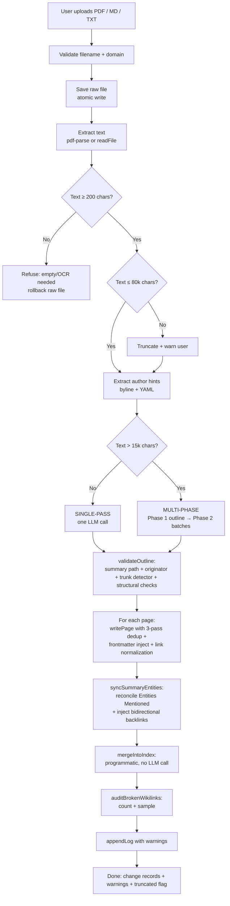
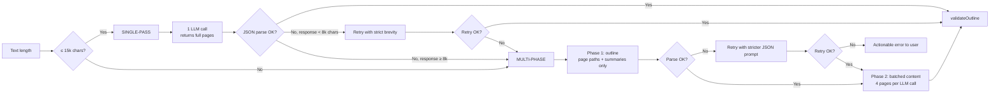
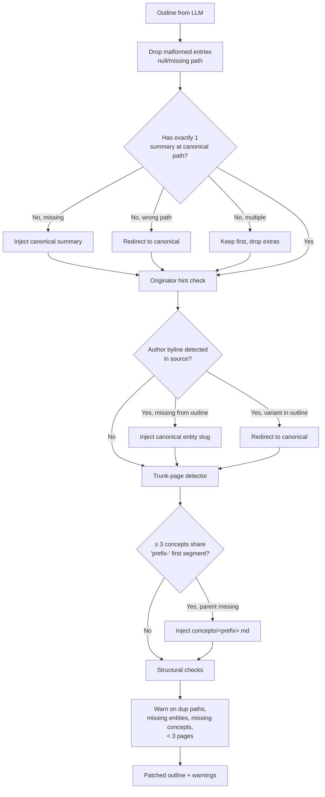
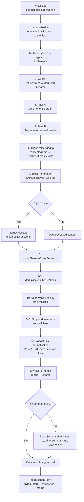
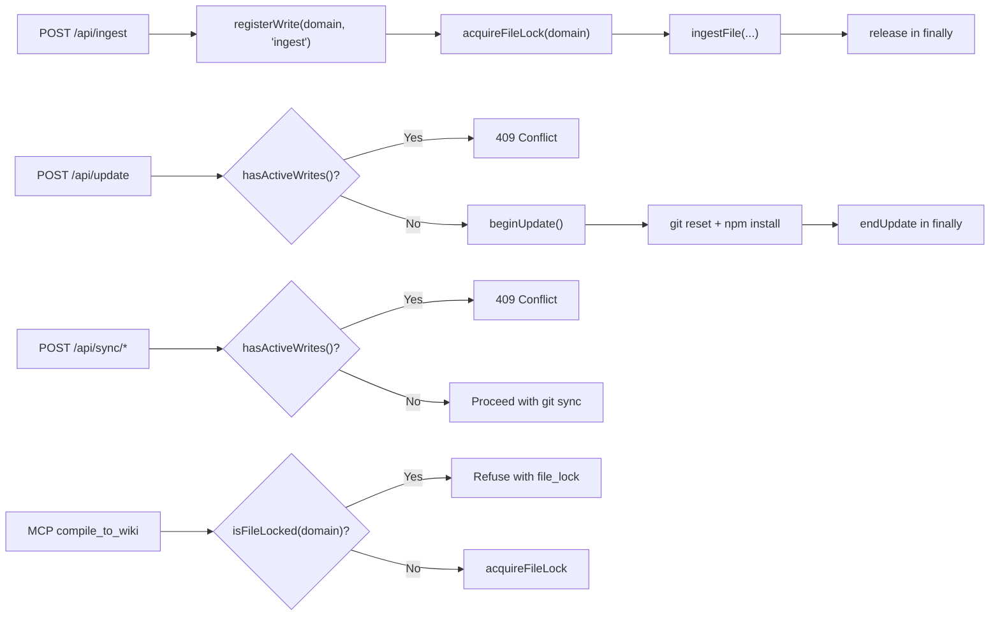

# The Ingestion Pipeline — Technical Deep Dive

This document is the definitive technical reference for The Curator's ingestion pipeline — how a raw source document becomes a structured wiki of interlinked entities, concepts, and a summary. It covers the architectural decisions, every safeguard in the pipeline, the LLM-failure modes the code defends against, and the quality contract guaranteed at write time.

If you're a user looking for how to drop a PDF in and what happens next, start with [the user guide](user-guide.md#8-ingest-a-source). If you're a developer wanting to understand the system at the level needed to debug or extend it, read on.

**Last updated**: v3.0.1-beta.9

---

## 1. Why ingestion is the heart of The Curator

The Curator is built on a deliberate architectural choice: **compiled knowledge**, not retrieval. Where RAG-based systems answer questions by embedding-search at query time, The Curator pays the LLM cost ONCE at ingest time and builds a persistent, human-readable wiki on disk. Every subsequent question is answered against that wiki — instant, deterministic, and visible to the user.

This means the ingestion pipeline is the single most important code path in the application. Every wiki page you see, every `[[wikilink]]` between pages, every Obsidian graph edge — all of it was produced by one ingest, and the quality of the resulting wiki is the quality of the pipeline.

The pipeline has been refined over a year of real-world use. Most of its complexity is **safeguards** — code that catches the ways LLMs fail to follow instructions, recovers gracefully, and tells the user what happened.

---

## 2. High-level flow



Every step from C onwards uses **atomic writes** (write-to-tempfile + rename) so a process kill mid-ingest leaves either the old file or the new file intact — never a torn zero-byte file.

---

## 3. Stage-by-stage walkthrough

### Stage 0 — Upload and validation (`src/routes/ingest.js`)

The frontend sends a `multipart/form-data` POST. The route handler:

1. Validates `domain` is non-empty and exists in `listDomains()`.
2. Validates the uploaded `file` is `.txt`, `.md`, or `.pdf` (multer fileFilter).
3. Checks `<domain>/raw/<filename>` doesn't already exist (returns 409 with `duplicate: true` unless the client sends `overwrite=true`).
4. Checks the write registry (`hasActiveWrites()` / `isUpdateInProgress()`) — refuses with 409 if a conflicting operation is running.
5. Acquires the cross-process file lock at `<domain>/.write-lock`.
6. Switches the response to **Server-Sent Events** and starts streaming progress.

Everything from this point flows through `ingestFile()` in `src/brain/ingest.js`.

### Stage 1 — Raw save + text extraction (`ingestFile` lines 824–874)

The uploaded file is copied atomically to `<domain>/raw/<filename>`. PDFs go through `pdf-parse` (with a try/catch + raw-file rollback on failure); MD and TXT files are read directly.

**Empty-extraction guard** (v3.0.1-beta.8+): if the extracted text is less than 200 characters, the pipeline refuses with an actionable message ("Could not extract text — this is usually an encrypted PDF or a scanned PDF needing OCR") and deletes the raw file so retry isn't 409-blocked.

**Truncation cap**: text is capped at 80,000 characters. When truncation kicks in, a warning is added to `result.warnings` so the user sees it in the result panel.

**Author-hint extraction**: `extractAuthorHints(fullText)` scans the head and tail of the source for explicit author markers:
- YAML `author: "Name"` or `author: [[Wikilink]]`
- "By Dr. X" / "by First Last" bylines
- "Author:" / "Authors:" lines

The detected names are passed to `validateOutline` later, which will inject the originator entity if the LLM omits it.

### Stage 2 — Choose single-pass or multi-phase



**Why the 15k threshold?** Anything beyond ~15k chars produces 10-20k chars of JSON in single-pass, which is enough for accumulated unescaped quotes to break parsing. Multi-phase keeps each batch's output to ~3k chars of JSON — far more reliable.

**Why the 8k retry limit?** If the single-pass response is already large AND parsing failed, retrying with "strict brevity" prompts the same LLM to produce a similarly large response. Skipping straight to multi-phase saves an LLM call.

### Stage 3 — `validateOutline` (the safety net)

After the LLM returns its plan, `validateOutline()` (in `src/brain/ingest.js`) applies a series of programmatic guarantees:



The validator is the single chokepoint where five distinct invariants are enforced:

1. **Exactly one summary at the canonical path** (computed from the source filename). Re-ingesting the same file lands on the same summary slug → merge, not duplicate.
2. **Originator entity present**. If the source has a clear byline ("By Dr. X") but the LLM omitted that entity from the outline, the validator injects `entities/<canonical-slug>.md`.
3. **Honorific normalisation**. `entities/dr-tali-rezun.md` and `entities/dr.-tali-rezun.md` both redirect to `entities/tali-rezun.md` BEFORE writing — so Phase 2 generates content for the canonical path.
4. **Trunk-page detector**. When ≥3 concepts share a common first segment (`taste-as-moat`, `taste-as-judgment`, `taste-formula`), the parent `concepts/taste.md` is injected if missing. Fired correctly on real Gemini output during the v3.0.1-beta.8 deep test.
5. **Structural warnings**. Surfaces issues the user might miss (duplicate paths in outline, zero entities, zero concepts, < 3 pages total).

### Stage 4 — `writePage` (the write chokepoint)

Every wiki write — from ingest, Compile to Wiki, Health auto-fix, MCP `compile_to_wiki` — goes through `writePage()` in `src/brain/files.js`. This is THE one chokepoint. There is no parallel write logic anywhere in the codebase.



Key invariants `writePage` guarantees:

- **One file per canonical slug** — same entity name written in three different ways across three ingests lands on one file.
- **Atomic writes** — process kill mid-write never leaves a zero-byte file (v3.0.1-beta.8+).
- **No folder-prefix or `.md` in wikilinks** — `[[concepts/rag]]` → `[[rag]]`, `[[foo.md]]` → `[[foo]]` (v3.0.1-beta.9+).
- **Type tag always present** — `type/entity`, `type/concept`, or `type/summary` enforced in frontmatter even when the LLM mirrors the source's own YAML (v3.0.1-beta.9+).
- **Variant slugs collapse to canonical** — `[[dr-tali-rezun]]` rewrites to `[[tali-rezun]]` at write time (Pass A); `[[talirezun]]` rewrites to `[[tali-rezun]]` (Pass B); `[[energy-and-water-footprint]]` rewrites to `[[summaries/the-energy-and-water-footprint-of-generative-ai]]` (Pass C, prefix-tolerant).
- **Bullet sections merge** — Key Facts, Related, Entities Mentioned grow with each ingest; prose sections (Summary, Definition) use the incoming LLM version.

### Stage 5 — `syncSummaryEntities` (the post-write reconciler)

After every page is written, `syncSummaryEntities()` runs to fix the most common LLM compliance failure: the summary's "Entities Mentioned" section lists 5-7 entities when 20-30 entity pages were actually written.

The reconciler:

1. Takes the ground-truth list of canonical paths actually written this ingest.
2. Injects every entity AND concept slug into the summary's "Entities Mentioned" section.
3. Deduplicates the bullets.
4. Re-fires `injectSummaryBacklinks()` so every entity/concept page gets a backlink to the summary in its Related section.

This is what gives The Curator's wiki its characteristic bidirectional density — every summary knows every entity it references, every entity knows every summary that referenced it, and Obsidian's Graph View shows them connected.

### Stage 6 — `mergeIntoIndex` (the programmatic index)

Pre-v3.0.1-beta.1, the index was regenerated by a third LLM call (Phase 3). On large domains the 20+ KB index saturated the output budget; pages would land on disk but vanish from the index.

Now the index is updated **programmatically**:

1. Read the existing `index.md`.
2. For each newly-CREATED page (status === 'created'), append a row keyed by canonical path.
3. Skip rows whose slug is already in the index (so re-ingest never duplicates).
4. Sanitise summaries against pipe/newline injection.

Same primitive is used by `compileConversation` and MCP `compile_to_wiki`.

### Stage 7 — `auditBrokenWikilinks` (the quality signal)

After all writes complete, the pipeline runs a final audit (v3.0.1-beta.9+):

1. Build a slug inventory from all three canonical folders.
2. Scan every page written this ingest for `[[wikilinks]]`.
3. Count how many don't resolve.
4. Emit a warning with the count + first 3 examples if any failed.

This is the user's first signal that the LLM produced "phantom" wikilinks — entities mentioned in Phase 2 batches that weren't on the page plan in Phase 1. The user can then run Wiki Health → Ask AI to triage them.

### Stage 8 — `appendLog`

A markdown log entry is appended to `<domain>/wiki/log.md` with the title, the canonical paths written, and all warnings collected. This is the audit trail — every ingest leaves a permanent record of what happened.

---

## 4. Failure-mode catalogue

The pipeline catches the following LLM-compliance failures programmatically (no manual intervention required):

| Failure | Frequency | Where it's caught |
|---|---|---|
| Summary path differs from canonical filename slug | Common | `validateOutline` redirects |
| Multiple summary entries in outline | Occasional | `validateOutline` keeps one |
| Author/originator entity omitted | Common | `extractAuthorHints` + `validateOutline` injects |
| Honorific variant slug (`dr-X`, `dr.-X`) | Common | `validateOutline` redirects + `writePage` Pass A |
| Diacritic in entity slug (`režun`) | Occasional | `slugifyName` NFKD normalises |
| Sub-concept clusters without parent (`taste-*` without `taste`) | Common on Haiku | `validateOutline` trunk detector injects |
| Folder prefix in wikilink (`[[concepts/rag]]`) | Common | `writePage` step 5b strips |
| `.md` extension in wikilink (`[[foo.md]]`) | Common | `writePage` step 5b2 strips (v3.0.1-beta.9+) |
| Variant slug in wikilink (`[[talirezun]]`) | Common | `writePage` step 5c normalises |
| Multi-phase batches missing the originator | Common | `validateOutline` originator hint inject |
| Phase 1 outline malformed JSON | Rare | Auto-retry with stricter JSON prompt |
| Single-pass response truncated | Rare | Switch to multi-phase |
| Phase 2 batch malformed JSON | Rare | Fall back to one page at a time |
| Page-content totally fails | Rare | Write a clearly-marked stub page |
| `max_tokens` truncation | Rare on Flash, more common on Haiku | `llm.js` throws an actionable "split source or switch model" error (v3.0.1-beta.8+) |
| Image-only / encrypted PDF | Occasional | < 200-char text guard refuses early + rolls back raw file |
| Source > 80,000 chars | Common on books | Truncate + warn user |
| LLM mentions entities in pages not on the plan | Common | `auditBrokenWikilinks` warns user (v3.0.1-beta.9+) |
| Summary "Entities Mentioned" lists 5 entities when 30 written | Every ingest | `syncSummaryEntities` reconciles |
| Entity has no Related section | New entities | `injectBulletsIntoSection` creates the section |
| Type tag missing on pre-formatted source's frontmatter | Occasional | `injectFrontmatter` ensures type tag (v3.0.1-beta.9+) |
| Concurrent ingest + sync/update | When user clicks too fast | Write registry + 409 conflict response |
| Process kill mid-write | When user clicks Update during ingest | `writeFileAtomic` (atomic tempfile + rename) |
| Re-ingest creates duplicates | Pre-v3.0.1-beta.1 risk | Deterministic summary slug from filename + 3-pass entity dedup |

The single failure mode the pipeline does NOT catch programmatically is **semantic near-duplicates** — two entity pages that say almost the same thing but with different slugs (e.g. "25 years" vs "30 years"). These are caught by the opt-in **AI Wiki Health** semantic-duplicate scan (see [docs/ai-health.md](ai-health.md)) — a separate, cost-gated, preview-required workflow.

---

## 5. The quality contract — what every successful ingest guarantees

After a clean ingest, the following invariants hold over the written wiki:

1. **Atomic write contract** — no zero-byte `.md` files; no orphan `.tmp-*` files; rename was atomic on the target filesystem.
2. **Frontmatter contract** — every entity, concept, and summary page has a YAML frontmatter block starting on line 1, with `type: <type>` and `tags: [..., type/<type>]` set.
3. **Type-tag contract** — `type/entity`, `type/concept`, or `type/summary` matches the page's folder.
4. **Summary structure contract** — every summary has an "Entities Mentioned" section with at least one entity bullet.
5. **Bidirectional backlink contract** — every entity listed in a summary's Entities Mentioned section has `[[summaries/<slug>]]` in its Related section.
6. **Canonical-slug contract** — no honorific-prefixed entity filenames (`dr-X.md`); no hyphen-variant duplicates; no cross-folder duplicates.
7. **Index contract** — `index.md` has a row for every newly-created entity, concept, and summary page.
8. **Log contract** — `log.md` has an ingest entry with the title, page list, and all warnings.
9. **Wikilink-formatting contract** — no `[[concepts/X]]` or `[[entities/X]]` folder prefixes on entity/concept links; no `[[X.md]]` extension suffixes.
10. **Health-clean contract** — `scanWiki()` reports 0 folder-prefix violations, 0 cross-folder duplicates, 0 hyphen variants, 0 missing backlinks.

The only soft signal (warning, not invariant) is **wikilink resolution**: ~1-5% of wikilinks may point to slugs the LLM mentioned but didn't include in the page plan. The audit warns the user about these so they can run Wiki Health → Ask AI to fix.

---

## 6. Concurrency and crash safety

Two layers protect against the "files disappear when multiple things happen at once" failure mode (v3.0.1-beta.8+):

### 6.1 — Atomic writes (`src/brain/atomic-write.js`)

Every wiki write uses `writeFileAtomic()`:

```
1. Generate tempfile path: <dir>/.tmp-<base>-<pid>-<counter>
2. writeFile(tmpfile, content)  ← any error here just leaves tmpfile orphan
3. rename(tmpfile, target)      ← atomic per POSIX rename(2)
4. On error in step 2/3: best-effort cleanup of tmpfile
```

Process kill at step 1 or 2 leaves the OLD file intact. Process kill at step 3 is atomic — either the old file or the new file is on disk, never zero-byte.

Same-directory tempfile naming is critical: POSIX `rename(2)` is only atomic within a single filesystem. The user's domains folder can be on a USB drive, network mount, or external SSD, so `os.tmpdir()` would cause EXDEV errors. The tempfile must live in the same directory as the target.

### 6.2 — Write registry (`src/brain/write-registry.js`)



In-memory tracking handles the web-server process; the file-based lock at `<domain>/.write-lock` handles cross-process coordination with the MCP child process spawned by Claude Desktop.

When the registry refuses, the frontend shows a friendly toast and the buttons are already greyed out (the frontend tracks ingest state via `__curatorIngestStart` / `__curatorIngestEnd`).

---

## 7. Provider-specific behaviour

The LLM dispatch lives in `src/brain/llm.js`. Two providers are supported with subtle differences:

### 7.1 — Google Gemini (default)

- **Default model**: `gemini-2.5-flash-lite`
- **JSON mode**: native — `responseMimeType: 'application/json'` forces token-level JSON validity
- **Truncation detection** (v3.0.1-beta.8+): if `finishReason === 'MAX_TOKENS'`, throws an actionable error before the truncated text reaches `parseJSON`
- **Fallback chain**: `gemini-2.5-flash` → `gemini-1.5-flash` → `gemini-1.5-flash-latest`

### 7.2 — Anthropic Claude

- **Default model**: `claude-haiku-4-5` (matches Gemini Flash-Lite cost tier)
- **JSON mode**: not native — relies on the prompt's "Return ONLY valid JSON" + the `jsonrepair` fallback in `parseJSON`
- **Truncation detection** (v3.0.1-beta.8+): if `stop_reason === 'max_tokens'`, throws the same actionable error as Gemini
- **Fallback chain**: Haiku family first, then Sonnet only as deep fallback
- **Known gap**: Anthropic users see slightly higher rates of trunk-page-detector and broken-link warnings because there's no JSON-mode token rail. The trunk-detector and Pass-A/B/C link normalisation are precisely the safeguards that compensate.

Both providers go through the same retry path for 429 (rate limit) and 503 (overloaded) — up to 4 attempts with exponential backoff. Users see "Service busy — retrying in 9s… (attempt 2/3)" during the backoff — this is the **retry surface, not a bug**, and ingests routinely succeed after the wait.

---

## 8. Performance characteristics

Measured on the deep-test harness against live Gemini 2.5 Flash Lite (Mac M2 Pro, US-East endpoint):

| Source size | Path | LLM calls | Wall time |
|---|---|---|---|
| ~1.5k chars (tiny) | single-pass | 1 | 4–8 seconds |
| ~12k chars (single-pass boundary) | single-pass | 1 | 6–12 seconds |
| ~20k chars (multi-phase) | multi-phase | 1 outline + 6 batches | 18–25 seconds |
| ~55k chars (long) | multi-phase | 1 outline + 14 batches | 35–55 seconds |
| 80k chars (cap) | multi-phase | 1 outline + 20 batches | 50–80 seconds |

Re-ingest of the same source is comparable in time — the LLM still produces fresh output, but `writePage` merges with existing content rather than recreating from scratch. Re-ingest is fully idempotent (deterministic summary slug; 3-pass entity dedup; index skips already-present rows).

Cost at Gemini 2.5 Flash Lite list price (~$0.10/M input, ~$0.40/M output, May 2026): a single typical multi-phase ingest costs roughly **$0.001 to $0.005** depending on document length. The deep-test harness's full 9-scenario run costs about **$0.03**.

---

## 9. Testing the pipeline

Two test suites exercise the pipeline at different levels:

### 9.1 — Offline unit tests (`scripts/test-ingest-fixes.js`)

94 deterministic assertions covering `computeSummarySlugFromSource`, `validateOutline`, `extractAuthorHints`, `slugifyName`, the prompt builders, `mergeIntoIndex`, and the hyphen-variant Health scanner. No network calls. Run with: `node scripts/test-ingest-fixes.js`.

### 9.2 — Stress + safety tests (`scripts/test-beta8-stress.js`)

70 offline assertions covering atomic-write contract (including SIGKILL simulation), EXDEV defense, trunk-page detector, write registry, and file-based lock. Run with: `node scripts/test-beta8-stress.js`.

### 9.3 — Live LLM end-to-end (`scripts/test-ingest-real-llm.js`)

18 assertions against a real source via live Gemini Flash. Verifies the deterministic summary slug, author entity injection, and idempotent re-ingest. Run with: `GEMINI_API_KEY=... node scripts/test-ingest-real-llm.js`.

### 9.4 — Deep ingest stress test (`scripts/test-ingest-deep.js`, v3.0.1-beta.9+)

The most comprehensive — runs the FULL production pipeline (live Gemini) across 9 scenarios:

- **SYN-1** tiny baseline (single-pass path)
- **SYN-2** trunk-cluster trigger
- **SYN-3** JSON-stressor content (resilience under contention)
- **SYN-4** multi-phase trigger
- **SYN-5** honorific author + diacritic
- **SYN-6** empty file (refusal contract)
- **SYN-7** near-empty (< 200 chars) (refusal contract)
- **SYN-8** re-ingest SYN-1 (idempotency contract)
- **REAL-1** real-world re-ingest of an actual published article

Each scenario's output is checked against the full quality contract from §5 — zero-byte detection, frontmatter validation, wikilink resolution, backlink bidirectionality, index integrity, log entry, and Health-scan cleanliness. Run with: `node scripts/test-ingest-deep.js` (or `--quick` to skip REAL-1).

Together these suites give **679 offline + 35 live-LLM + 106 deep-ingest = 820 assertions** that exercise the pipeline at every level.

---

## 10. Known limitations and future work

The pipeline is mature but not perfect. Known limitations:

- **80k character cap** — sources longer than 80k chars are truncated. A future version may chunk-and-recombine; the engineering work is non-trivial because cross-chunk entity/concept identity has to be preserved.
- **No mid-batch awareness** — Phase 2 batches generate independently. Batch 3 doesn't know what batch 1 produced, so cross-batch references can point at entities not on the page plan. The post-write broken-link audit (v3.0.1-beta.9+) measures this; a fix would require threading the running written-slug set into the Phase 2 prompt.
- **No native JSON mode for Anthropic** — Claude users rely on `parseJSON` + `jsonrepair`. Anthropic's `tool_use` mechanism could be wired in for stricter compliance; left as future work.
- **Single-domain ingest** — every ingest writes to exactly one domain. Cross-domain ingest would require parser/scanner work in `health.js`, `compile.js`, and the MCP tools (see [docs/domains.md § 4](domains.md#4-how-domains-relate-to-each-other)).
- **No streaming progress for the LLM call itself** — the user sees "AI is analyzing the document…" for tens of seconds at a time. Streaming the partial LLM output for user reassurance is a polish item left for a future release.

---

## 11. Where to look next

| You want to… | Read… |
|---|---|
| Understand the canonical write path | `src/brain/files.js` — `writePage()` |
| Understand the LLM dispatch + retry/fallback | `src/brain/llm.js` — `generateText()`, `callLLM()` |
| Understand the outline validator | `src/brain/ingest.js` — `validateOutline()` |
| Trace an ingest end-to-end | `src/brain/ingest.js` — `ingestFile()` |
| Understand atomic-write semantics | `src/brain/atomic-write.js` |
| Understand the concurrency model | `src/brain/write-registry.js` |
| See the prompts the LLM actually receives | `src/brain/ingest.js` — `buildOutlinePrompt`, `buildBatchPrompt`, `buildPrompt` |
| Read the architecture overview | [docs/architecture.md](architecture.md) |
| Understand domains | [docs/domains.md](domains.md) |
| Understand AI Wiki Health (the post-ingest cleanup layer) | [docs/ai-health.md](ai-health.md) |
| Understand model-lifecycle safety | [docs/model-lifecycle.md](model-lifecycle.md) |
| Read the version-by-version evolution | [CLAUDE.md](../CLAUDE.md) |
