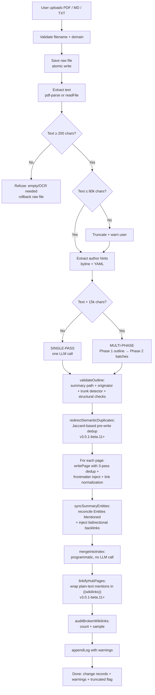
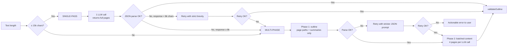
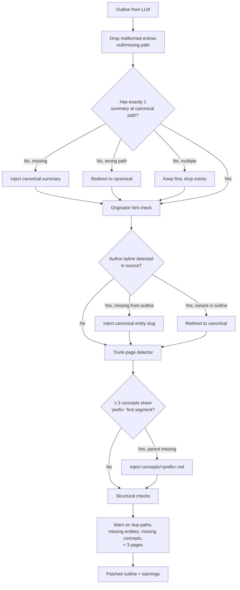
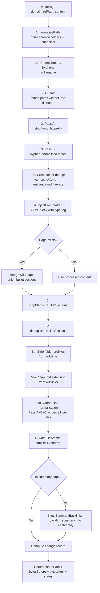
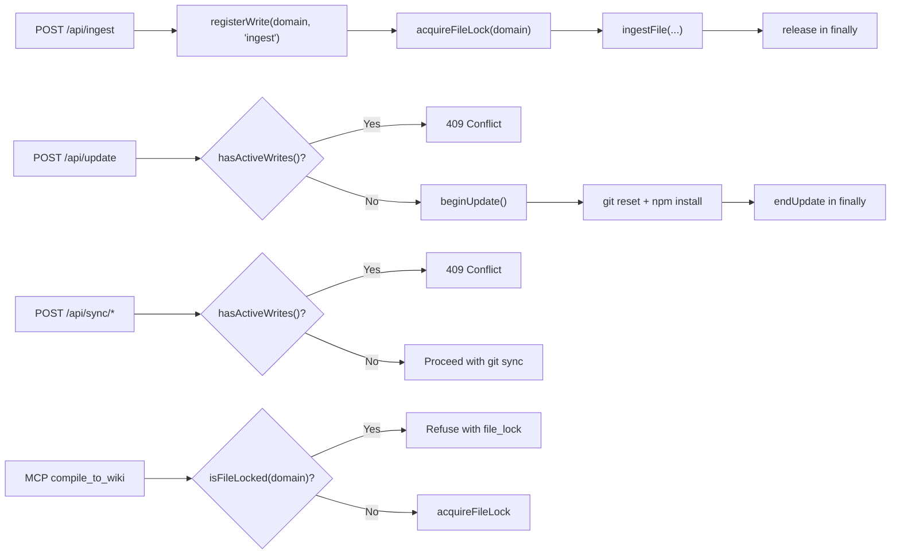
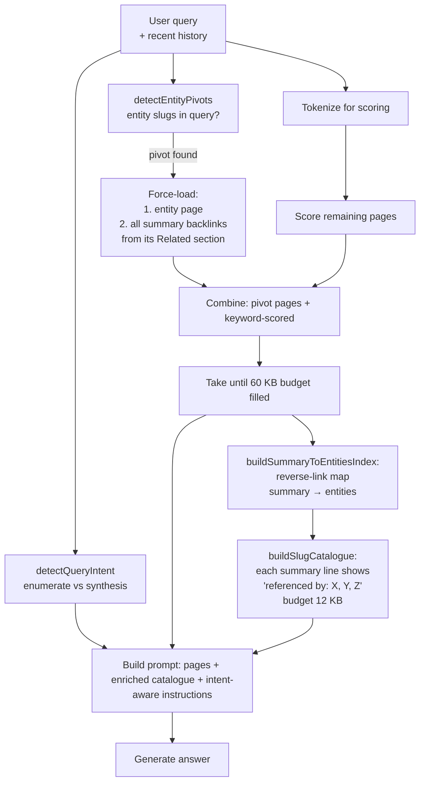

# The Ingestion Pipeline — Technical Deep Dive

This document is the definitive technical reference for The Curator's ingestion pipeline — how a raw source document becomes a structured wiki of interlinked entities, concepts, and a summary. It covers the architectural decisions, every safeguard in the pipeline, the LLM-failure modes the code defends against, and the quality contract guaranteed at write time.

If you're a user looking for how to drop a PDF in and what happens next, start with [the user guide](user-guide.md#8-ingest-a-source). If you're a developer wanting to understand the system at the level needed to debug or extend it, read on.

**Last updated**: v3.0.1-beta.13

---

## 1. Why ingestion is the heart of The Curator

The Curator is built on a deliberate architectural choice: **compiled knowledge**, not retrieval. Where RAG-based systems answer questions by embedding-search at query time, The Curator pays the LLM cost ONCE at ingest time and builds a persistent, human-readable wiki on disk. Every subsequent question is answered against that wiki — instant, deterministic, and visible to the user.

This means the ingestion pipeline is the single most important code path in the application. Every wiki page you see, every `[[wikilink]]` between pages, every Obsidian graph edge — all of it was produced by one ingest, and the quality of the resulting wiki is the quality of the pipeline.

The pipeline has been refined over a year of real-world use. Most of its complexity is **safeguards** — code that catches the ways LLMs fail to follow instructions, recovers gracefully, and tells the user what happened.

---

## 2. High-level flow



Every step from C onwards uses **atomic writes** (write-to-tempfile + rename) so a process kill mid-ingest leaves either the old file or the new file intact — never a torn zero-byte file.

---

## 3. Stage-by-stage walkthrough

### Stage 0 — Upload and validation (`src/routes/ingest.js`)

The frontend sends a `multipart/form-data` POST. The route handler:

1. Validates `domain` is non-empty and exists in `listDomains()`.
2. Validates the uploaded `file` is `.txt`, `.md`, or `.pdf` (multer fileFilter).
3. Checks `<domain>/raw/<filename>` doesn't already exist (returns 409 with `duplicate: true` unless the client sends `overwrite=true`).
4. Checks the write registry (`hasActiveWrites()` / `isUpdateInProgress()`) — refuses with 409 if a conflicting operation is running.
5. Acquires the cross-process file lock at `<domain>/.write-lock`.
6. Switches the response to **Server-Sent Events** and starts streaming progress.

Everything from this point flows through `ingestFile()` in `src/brain/ingest.js`.

### Stage 1 — Raw save + text extraction (`ingestFile` lines 824–874)

The uploaded file is copied atomically to `<domain>/raw/<filename>`. PDFs go through `pdf-parse` (with a try/catch + raw-file rollback on failure); MD and TXT files are read directly.

**Empty-extraction guard** (v3.0.1-beta.8+): if the extracted text is less than 200 characters, the pipeline refuses with an actionable message ("Could not extract text — this is usually an encrypted PDF or a scanned PDF needing OCR") and deletes the raw file so retry isn't 409-blocked.

**Truncation cap**: text is capped at 80,000 characters. When truncation kicks in, a warning is added to `result.warnings` so the user sees it in the result panel.

**Author-hint extraction**: `extractAuthorHints(fullText)` scans the head and tail of the source for explicit author markers:
- YAML `author: "Name"` or `author: [[Wikilink]]`
- "By Dr. X" / "by First Last" bylines
- "Author:" / "Authors:" lines

The detected names are passed to `validateOutline` later, which will inject the originator entity if the LLM omits it.

### Stage 2 — Choose single-pass or multi-phase



**Why the 15k threshold?** Anything beyond ~15k chars produces 10-20k chars of JSON in single-pass, which is enough for accumulated unescaped quotes to break parsing. Multi-phase keeps each batch's output to ~3k chars of JSON — far more reliable.

**Why the 8k retry limit?** If the single-pass response is already large AND parsing failed, retrying with "strict brevity" prompts the same LLM to produce a similarly large response. Skipping straight to multi-phase saves an LLM call.

### Stage 3 — `validateOutline` (the safety net)

After the LLM returns its plan, `validateOutline()` (in `src/brain/ingest.js`) applies a series of programmatic guarantees:



The validator is the single chokepoint where five distinct invariants are enforced:

1. **Exactly one summary at the canonical path** (computed from the source filename). Re-ingesting the same file lands on the same summary slug → merge, not duplicate.
2. **Originator entity present**. If the source has a clear byline ("By Dr. X") but the LLM omitted that entity from the outline, the validator injects `entities/<canonical-slug>.md`.
3. **Honorific normalisation**. `entities/dr-tali-rezun.md` and `entities/dr.-tali-rezun.md` both redirect to `entities/tali-rezun.md` BEFORE writing — so Phase 2 generates content for the canonical path.
4. **Trunk-page detector**. When ≥3 concepts share a common first segment (`taste-as-moat`, `taste-as-judgment`, `taste-formula`), the parent `concepts/taste.md` is injected if missing. Fired correctly on real Gemini output during the v3.0.1-beta.8 deep test.
5. **Structural warnings**. Surfaces issues the user might miss (duplicate paths in outline, zero entities, zero concepts, < 3 pages total).

### Stage 4 — `writePage` (the write chokepoint)

Every wiki write — from ingest, Compile to Wiki, Health auto-fix, MCP `compile_to_wiki` — goes through `writePage()` in `src/brain/files.js`. This is THE one chokepoint. There is no parallel write logic anywhere in the codebase.



Key invariants `writePage` guarantees:

- **One file per canonical slug** — same entity name written in three different ways across three ingests lands on one file.
- **Atomic writes** — process kill mid-write never leaves a zero-byte file (v3.0.1-beta.8+).
- **No folder-prefix or `.md` in wikilinks** — `[[concepts/rag]]` → `[[rag]]`, `[[foo.md]]` → `[[foo]]` (v3.0.1-beta.9+).
- **Type tag always present** — `type/entity`, `type/concept`, or `type/summary` enforced in frontmatter even when the LLM mirrors the source's own YAML (v3.0.1-beta.9+).
- **Variant slugs collapse to canonical** — `[[dr-tali-rezun]]` rewrites to `[[tali-rezun]]` at write time (Pass A); `[[talirezun]]` rewrites to `[[tali-rezun]]` (Pass B); `[[energy-and-water-footprint]]` rewrites to `[[summaries/the-energy-and-water-footprint-of-generative-ai]]` (Pass C, prefix-tolerant).
- **Bullet sections merge** — Key Facts, Related, Entities Mentioned grow with each ingest; prose sections (Summary, Definition) use the incoming LLM version.

### Stage 5 — `syncSummaryEntities` (the post-write reconciler)

After every page is written, `syncSummaryEntities()` runs to fix the most common LLM compliance failure: the summary's "Entities Mentioned" section lists 5-7 entities when 20-30 entity pages were actually written.

The reconciler:

1. Takes the ground-truth list of canonical paths actually written this ingest.
2. Injects every entity AND concept slug into the summary's "Entities Mentioned" section.
3. Deduplicates the bullets.
4. Re-fires `injectSummaryBacklinks()` so every entity/concept page gets a backlink to the summary in its Related section.

This is what gives The Curator's wiki its characteristic bidirectional density — every summary knows every entity it references, every entity knows every summary that referenced it, and Obsidian's Graph View shows them connected.

### Stage 6 — `mergeIntoIndex` (the programmatic index)

Pre-v3.0.1-beta.1, the index was regenerated by a third LLM call (Phase 3). On large domains the 20+ KB index saturated the output budget; pages would land on disk but vanish from the index.

Now the index is updated **programmatically**:

1. Read the existing `index.md`.
2. For each newly-CREATED page (status === 'created'), append a row keyed by canonical path.
3. Skip rows whose slug is already in the index (so re-ingest never duplicates).
4. Sanitise summaries against pipe/newline injection.

Same primitive is used by `compileConversation` and MCP `compile_to_wiki`.

### Stage 7 — `auditBrokenWikilinks` (the quality signal)

After all writes complete, the pipeline runs a final audit (v3.0.1-beta.9+):

1. Build a slug inventory from all three canonical folders.
2. Scan every page written this ingest for `[[wikilinks]]`.
3. Count how many don't resolve.
4. Emit a warning with the count + first 3 examples if any failed.

This is the user's first signal that the LLM produced "phantom" wikilinks — entities mentioned in Phase 2 batches that weren't on the page plan in Phase 1. The user can then run Wiki Health → Ask AI to triage them.

### Stage 8 — `appendLog`

A markdown log entry is appended to `<domain>/wiki/log.md` with the title, the canonical paths written, and all warnings collected. This is the audit trail — every ingest leaves a permanent record of what happened.

---

## 4. Failure-mode catalogue

The pipeline catches the following LLM-compliance failures programmatically (no manual intervention required):

| Failure | Frequency | Where it's caught |
|---|---|---|
| Summary path differs from canonical filename slug | Common | `validateOutline` redirects |
| Multiple summary entries in outline | Occasional | `validateOutline` keeps one |
| Author/originator entity omitted | Common | `extractAuthorHints` + `validateOutline` injects |
| Honorific variant slug (`dr-X`, `dr.-X`) | Common | `validateOutline` redirects + `writePage` Pass A |
| Diacritic in entity slug (`režun`) | Occasional | `slugifyName` NFKD normalises |
| Sub-concept clusters without parent (`taste-*` without `taste`) | Common on Haiku | `validateOutline` trunk detector injects |
| Folder prefix in wikilink (`[[concepts/rag]]`) | Common | `writePage` step 5b strips |
| `.md` extension in wikilink (`[[foo.md]]`) | Common | `writePage` step 5b2 strips (v3.0.1-beta.9+) |
| Variant slug in wikilink (`[[talirezun]]`) | Common | `writePage` step 5c normalises |
| Multi-phase batches missing the originator | Common | `validateOutline` originator hint inject |
| Phase 1 outline malformed JSON | Rare | Auto-retry with stricter JSON prompt |
| Single-pass response truncated | Rare | Switch to multi-phase |
| Phase 2 batch malformed JSON | Rare | Fall back to one page at a time |
| Page-content totally fails | Rare | Write a clearly-marked stub page |
| `max_tokens` on a Phase 1/2 multi-phase call (Haiku, dense batch) | Occasional on Haiku | **Recovers** (v3.0.1-beta.15): outline retries with a more-concise plan; a batch falls back page-by-page (smaller output per call). Before beta.15 this threw out of `ingestMultiPhase` and **killed the whole ingest** — losing the entire document. A genuine rate-limit / 503 / auth / network error is NOT treated as recoverable — it re-throws so the user sees the real error instead of a wiki of stubs (`isOutputTokenLimit` gate). |
| `max_tokens` on single-pass (small dense source on Haiku) | Occasional on Haiku | Falls through to multi-phase instead of failing (v3.0.1-beta.15) |
| Image-only / encrypted PDF | Occasional | < 200-char text guard refuses early + rolls back raw file |
| Source > 80,000 chars | Common on books | Truncate + warn user |
| LLM mentions entities in pages not on the plan | Common | `auditBrokenWikilinks` warns user (v3.0.1-beta.9+) |
| Hub page enumerates items as plain text instead of wikilinks | Common, esp. on Haiku | `linkifyHubPages` wraps mentions in `[[brackets]]` post-batch (v3.0.1-beta.11+) |
| Phase 2 batch unaware of other batches' slugs | Common, esp. on Haiku | Full outline slug list now threaded into every batch prompt (v3.0.1-beta.11+) |
| Slug drift across re-ingest of related sources (`expert-roundup-format` vs `experts-roundup-format`) | Common | `redirectSemanticDuplicates` runs Jaccard at write time (v3.0.1-beta.11+) |
| Summary "Entities Mentioned" lists 5 entities when 30 written | Every ingest | `syncSummaryEntities` reconciles |
| Entity has no Related section | New entities | `injectBulletsIntoSection` creates the section |
| Type tag missing on pre-formatted source's frontmatter | Occasional | `injectFrontmatter` ensures type tag (v3.0.1-beta.9+) |
| Concurrent ingest + sync/update | When user clicks too fast | Write registry + 409 conflict response |
| Process kill mid-write | When user clicks Update during ingest | `writeFileAtomic` (atomic tempfile + rename) |
| Re-ingest creates duplicates | Pre-v3.0.1-beta.1 risk | Deterministic summary slug from filename + 3-pass entity dedup |

The single failure mode the pipeline does NOT catch programmatically is **semantic near-duplicates** — two entity pages that say almost the same thing but with different slugs (e.g. "25 years" vs "30 years"). These are caught by the opt-in **AI Wiki Health** semantic-duplicate scan (see [docs/ai-health.md](ai-health.md)) — a separate, cost-gated, preview-required workflow.

---

## 5. The quality contract — what every successful ingest guarantees

After a clean ingest, the following invariants hold over the written wiki:

1. **Atomic write contract** — no zero-byte `.md` files; no orphan `.tmp-*` files; rename was atomic on the target filesystem.
2. **Frontmatter contract** — every entity, concept, and summary page has a YAML frontmatter block starting on line 1, with `type: <type>` and `tags: [..., type/<type>]` set.
3. **Type-tag contract** — `type/entity`, `type/concept`, or `type/summary` matches the page's folder.
4. **Summary structure contract** — every summary has an "Entities Mentioned" section with at least one entity bullet.
5. **Bidirectional backlink contract** — every entity listed in a summary's Entities Mentioned section has `[[summaries/<slug>]]` in its Related section.
6. **Canonical-slug contract** — no honorific-prefixed entity filenames (`dr-X.md`); no hyphen-variant duplicates; no cross-folder duplicates.
7. **Index contract** — `index.md` has a row for every newly-created entity, concept, and summary page.
8. **Log contract** — `log.md` has an ingest entry with the title, page list, and all warnings.
9. **Wikilink-formatting contract** — no `[[concepts/X]]` or `[[entities/X]]` folder prefixes on entity/concept links; no `[[X.md]]` extension suffixes.
10. **Health-clean contract** — `scanWiki()` reports 0 folder-prefix violations, 0 cross-folder duplicates, 0 hyphen variants, 0 missing backlinks.

The only soft signal (warning, not invariant) is **wikilink resolution**: ~1-5% of wikilinks may point to slugs the LLM mentioned but didn't include in the page plan. The audit warns the user about these so they can run Wiki Health → Ask AI to fix.

---

## 6. Concurrency and crash safety

Two layers protect against the "files disappear when multiple things happen at once" failure mode (v3.0.1-beta.8+):

### 6.1 — Atomic writes (`src/brain/atomic-write.js`)

Every wiki write uses `writeFileAtomic()`:

```
1. Generate tempfile path: <dir>/.tmp-<base>-<pid>-<counter>
2. writeFile(tmpfile, content)  ← any error here just leaves tmpfile orphan
3. rename(tmpfile, target)      ← atomic per POSIX rename(2)
4. On error in step 2/3: best-effort cleanup of tmpfile
```

Process kill at step 1 or 2 leaves the OLD file intact. Process kill at step 3 is atomic — either the old file or the new file is on disk, never zero-byte.

Same-directory tempfile naming is critical: POSIX `rename(2)` is only atomic within a single filesystem. The user's domains folder can be on a USB drive, network mount, or external SSD, so `os.tmpdir()` would cause EXDEV errors. The tempfile must live in the same directory as the target.

### 6.2 — Write registry (`src/brain/write-registry.js`)



In-memory tracking handles the web-server process; the file-based lock at `<domain>/.write-lock` handles cross-process coordination with the MCP child process spawned by Claude Desktop.

When the registry refuses, the frontend shows a friendly toast and the buttons are already greyed out (the frontend tracks ingest state via `__curatorIngestStart` / `__curatorIngestEnd`).

---

## 7. Provider-specific behaviour

The LLM dispatch lives in `src/brain/llm.js`. Two providers are supported with subtle differences:

### 7.1 — Google Gemini (default)

- **Default model**: `gemini-2.5-flash-lite`
- **JSON mode**: native — `responseMimeType: 'application/json'` forces token-level JSON validity
- **Truncation detection** (v3.0.1-beta.8+): if `finishReason === 'MAX_TOKENS'`, throws an actionable error before the truncated text reaches `parseJSON`
- **Fallback chain**: `gemini-2.5-flash` → `gemini-1.5-flash` → `gemini-1.5-flash-latest`

### 7.2 — Anthropic Claude

- **Default model**: `claude-haiku-4-5` (matches Gemini Flash-Lite cost tier)
- **JSON mode**: not native — relies on the prompt's "Return ONLY valid JSON" + the `jsonrepair` fallback in `parseJSON`
- **Truncation detection** (v3.0.1-beta.8+): if `stop_reason === 'max_tokens'`, throws the same actionable error as Gemini
- **Fallback chain**: Haiku family first, then Sonnet only as deep fallback
- **Known gap**: Anthropic users see slightly higher rates of trunk-page-detector and broken-link warnings because there's no JSON-mode token rail. The trunk-detector and Pass-A/B/C link normalisation are precisely the safeguards that compensate.

Both providers go through the same retry path for 429 (rate limit) and 503 (overloaded) — up to 4 attempts with exponential backoff. Users see "Service busy — retrying in 9s… (attempt 2/3)" during the backoff — this is the **retry surface, not a bug**, and ingests routinely succeed after the wait.

---

## 8. Performance characteristics

Measured on the deep-test harness against live Gemini 2.5 Flash Lite (Mac M2 Pro, US-East endpoint):

| Source size | Path | LLM calls | Wall time |
|---|---|---|---|
| ~1.5k chars (tiny) | single-pass | 1 | 4–8 seconds |
| ~12k chars (single-pass boundary) | single-pass | 1 | 6–12 seconds |
| ~20k chars (multi-phase) | multi-phase | 1 outline + 6 batches | 18–25 seconds |
| ~55k chars (long) | multi-phase | 1 outline + 14 batches | 35–55 seconds |
| 80k chars (cap) | multi-phase | 1 outline + 20 batches | 50–80 seconds |

Re-ingest of the same source is comparable in time — the LLM still produces fresh output, but `writePage` merges with existing content rather than recreating from scratch. Re-ingest is fully idempotent (deterministic summary slug; 3-pass entity dedup; index skips already-present rows).

Cost at Gemini 2.5 Flash Lite list price (~$0.10/M input, ~$0.40/M output, May 2026): a single typical multi-phase ingest costs roughly **$0.001 to $0.005** depending on document length. The deep-test harness's full 9-scenario run costs about **$0.03**.

---

## 9. Testing the pipeline

Two test suites exercise the pipeline at different levels:

### 9.1 — Offline unit tests (`scripts/test-ingest-fixes.js`)

94 deterministic assertions covering `computeSummarySlugFromSource`, `validateOutline`, `extractAuthorHints`, `slugifyName`, the prompt builders, `mergeIntoIndex`, and the hyphen-variant Health scanner. No network calls. Run with: `node scripts/test-ingest-fixes.js`.

### 9.2 — Stress + safety tests (`scripts/test-beta8-stress.js`)

70 offline assertions covering atomic-write contract (including SIGKILL simulation), EXDEV defense, trunk-page detector, write registry, and file-based lock. Run with: `node scripts/test-beta8-stress.js`.

### 9.3 — Live LLM end-to-end (`scripts/test-ingest-real-llm.js`)

18 assertions against a real source via live Gemini Flash. Verifies the deterministic summary slug, author entity injection, and idempotent re-ingest. Run with: `GEMINI_API_KEY=... node scripts/test-ingest-real-llm.js`.

### 9.4 — Deep ingest stress test (`scripts/test-ingest-deep.js`, v3.0.1-beta.9+)

The most comprehensive — runs the FULL production pipeline (live Gemini) across 9 scenarios:

- **SYN-1** tiny baseline (single-pass path)
- **SYN-2** trunk-cluster trigger
- **SYN-3** JSON-stressor content (resilience under contention)
- **SYN-4** multi-phase trigger
- **SYN-5** honorific author + diacritic
- **SYN-6** empty file (refusal contract)
- **SYN-7** near-empty (< 200 chars) (refusal contract)
- **SYN-8** re-ingest SYN-1 (idempotency contract)
- **REAL-1** real-world re-ingest of an actual published article

Each scenario's output is checked against the full quality contract from §5 — zero-byte detection, frontmatter validation, wikilink resolution, backlink bidirectionality, index integrity, log entry, and Health-scan cleanliness. Run with: `node scripts/test-ingest-deep.js` (or `--quick` to skip REAL-1).

### 9.5 — Beta.11 fixes (`scripts/test-beta11-fixes.js`)

42 offline assertions specifically targeting the v3.0.1-beta.11 changes:
- Chat: `selectRelevantPages` prefers query-matching pages, excludes index/log, respects budget, falls back to top-linked
- Ingest: `redirectSemanticDuplicates` auto-redirects at ≥0.85 Jaccard, warns in 0.5–0.85, handles within-outline dupes, skips entities
- Ingest: `buildBatchPrompt` now includes full outline slug list and HUB-PAGE RULE guidance
- Hub linkification: nested-bracket regression guard (the bug found during the live deep test)

### 9.6 — Beta.13 chat refinements (`scripts/test-beta13-fixes.js` + `scripts/test-beta13-chat-live.js`)

62 offline assertions covering the three layered chat improvements:
- `detectEntityPivots` — multi-token and single-token entity matching, common-token blocklist
- `extractSummaryBacklinks` — parses `[[summaries/X]]` with and without alias syntax
- `buildSummaryToEntitiesIndex` — reverse-link map summary → entities
- `detectQueryIntent` — enumerate vs synthesis classification, defensive on null/undefined
- `selectRelevantPages` — pivot priority over keyword scoring, budget enforcement under pivot load
- `buildSlugCatalogue` — author/topic metadata on summaries, backlink count on pivot entities
- `buildPrompt` — intent-aware instruction block switch

PLUS 5 live-LLM scenarios in `scripts/test-beta13-chat-live.js` against the real `articles` wiki (3,250 pages), each scenario run TWICE for stability:
- L1 enumerate-by-author (≥15 unique summary citations)
- L2 synthesis on RAG (regression — synthesis path still works)
- L3 entity pivot on COTRUGLI Business School
- L4 count query (returns a specific number 30+)
- L5 niche detail (energy/water footprint article correctly cited)

Together these suites give **635 offline + 146 deep-ingest + 10 live chat = 791 assertions** that exercise the pipeline at every level (write + read).

---

## 10. Known limitations and future work

The pipeline is mature but not perfect. Known limitations:

- **80k character cap** — sources longer than 80k chars are truncated. A future version may chunk-and-recombine; the engineering work is non-trivial because cross-chunk entity/concept identity has to be preserved.
- **No native JSON mode for Anthropic** — Claude users rely on `parseJSON` + `jsonrepair`. Anthropic's `tool_use` mechanism could be wired in for stricter compliance; left as future work. v3.0.1-beta.11 added several Anthropic-amplifying-bug fixes (hub linkification, full outline threading, Jaccard dedup) that significantly close the Haiku/Flash gap.
- **Single-domain ingest** — every ingest writes to exactly one domain. Cross-domain ingest would require parser/scanner work in `health.js`, `compile.js`, and the MCP tools (see [docs/domains.md § 4](domains.md#4-how-domains-relate-to-each-other)).
- **No streaming progress for the LLM call itself** — the user sees "AI is analyzing the document…" for tens of seconds at a time. Streaming the partial LLM output for user reassurance is a polish item left for a future release.
- **Heuristic, not LLM-driven, dedup** — `redirectSemanticDuplicates` uses Jaccard + lightweight stemming. Genuinely synonymous concepts with different vocabularies (e.g. "self-attention" vs "scaled-dot-product-attention") still slip through. The Wiki Health semantic-duplicate scan remains the LLM-judged backstop for that case.

---

## 10b. The chat read-side (v3.0.1-beta.11+, refined in v3.0.1-beta.13)

Most of this document describes the WRITE side of the pipeline — turning a source document into wiki pages. But the chat tab is the READ side, and a community-member field report revealed it had been quietly broken on large domains for a long time.

**The pre-v3.0.1-beta.11 bug**: `src/brain/chat.js` was using a single `wikiContext.slice(0, 90000)` over the concatenated body of every wiki page in arbitrary readdir order. On any domain larger than ~90 KB total, the LLM saw a truncated prefix of `index.md` plus `log.md`, and ZERO actual entity, concept, or summary pages. The chat was effectively non-functional on mature domains.

**v3.0.1-beta.11 fix**: query-driven page selection — score each page by keyword overlap, load top-scoring up to 60 KB.

**v3.0.1-beta.13 refinement**: that fixed "tell me about X" queries but had a blind spot for ENUMERATE-style queries ("list articles by Tali Rezun"): the chat would load the entity page (good) but synthesize from only the few summary pages it could keyword-match, ignoring the 50+ other summaries listed in the entity's Related section. The result was under-reporting (chat said "6 articles" when the user actually had 33+). beta.13 adds three layered improvements:



Key behaviours of the beta.13 chat:
- **Entity-pivot retrieval** — when the query mentions an entity slug that exists in the wiki (≥2 token overlap for multi-token slugs, or 1 token for single-token specific slugs not in the common-token blocklist), the chat **force-loads that entity page AND every summary it backlinks to**. So "list articles by Tali Rezun" loads `entities/tali-rezun.md` plus all 50+ summaries her entity references.
- **Author-aware catalogue** — for every summary in the domain, the chat scans all entity pages to find which entities backlink to it, and renders the catalogue line as `summaries/X.md — Title · referenced by: tali-rezun, cotrugli-business-school, ...`. The LLM can now enumerate "all articles by tali-rezun" from the catalogue alone, even without loading every summary in full.
- **Query-intent detection** — classifies the question and swaps the instruction block. This was substantially reworked in v3.0.7–v3.0.8; see **§10c** below for the current three-intent router (`decision` / `enumerate` / `synthesis`), the `extractAsk` focus step, and the answer-shape prompts. (Pre-v3.0.8 this was a two-way enumerate-vs-synthesis switch that emphasised "completeness over synthesis" — which is what produced full-domain dumps on decision questions.)
- **`index.md` and `log.md` are excluded** from full-content selection.
- **Fallback when no match** — most-linked pages (hub heuristic) when keyword + pivot both empty.
- **History-aware** — the last 2 user turns fold into the query context for retrieval (current message alone for intent detection).
- **Budget enforcement** — 60 KB content + 12 KB catalogue. Stays well within every supported model's context window.

The chat now reliably scales to arbitrarily large domains. On the dev machine's 3,250-page articles wiki, `selectRelevantPages` runs in ~80 ms; `buildSummaryToEntitiesIndex` adds another ~50 ms; total chat-prompt build time is sub-second even before the LLM call.

Test coverage: 62 offline assertions in `scripts/test-beta13-fixes.js` (entity-pivot detection, summary-backlink extraction, query-intent classification, catalogue enrichment, prompt-instruction switch). Plus 5 live-LLM scenarios in `scripts/test-beta13-chat-live.js` against the real articles domain, each run TWICE for stability — all 10 LLM responses passed the assertions on both attempts. The L4 count query went from returning "6 articles" on the old chat to "33–39 articles" consistently across the new pipeline.

## 10c. Answer-shape routing (v3.0.7–v3.0.8)

The beta.13 read-side (§10b) fixed *retrieval* — which pages the LLM sees. v3.0.7–v3.0.8 fixed *answer shape* — what the LLM does with them. Two community reports drove this:

1. **v3.0.7** — a long analytical chat question hit the output-token cap and surfaced an *ingest-specific* error ("split the source by chapter…"), and chat hard-failed instead of returning the partial answer.
2. **v3.0.8 (Tier 1)** — after v3.0.7 raised the cap, a *decision* question ("evaluate these three topics and recommend one") returned the ENTIRE domain — ~160 sources with duplicates plus a trailing raw blob of glued file paths — and never recommended anything. Raising the cap didn't cause this; it EXPOSED a latent problem (before, the same bloat hit the cap and errored).

### v3.0.7 — graceful truncation + a context-neutral limit message

The output-token-limit guard lives in `callProvider` in [`src/brain/llm.js`](../src/brain/llm.js) — the single chokepoint ALL LLM calls flow through (chat, query, health-AI, shared-brain, compile, ingest). Both provider branches used to throw hard-coded *ingest* advice, which leaked into chat. All MAX_TOKENS handling now routes through the exported `handleOutputTokenLimit(providerName, maxTokens, responseFormat, partialText)`:

- **JSON mode** (ingest/compile/health) still THROWS — the message stays context-neutral but deliberately keeps the phrase *"output token limit"* so `isOutputTokenLimit(err)` (which ingest/compile fallback ladders key on) keeps matching.
- **Text mode** (chat/query) RETURNS the partial answer with an appended note (*"⚠ This answer was cut off… ask a more specific question to see the rest."*) instead of throwing — a 95%-complete prose answer is still useful.
- Chat + query output caps were raised 4096 → **8192**, so most analytical questions fit outright and only genuinely over-long ones degrade to partial-with-note.

### v3.0.8 — three-intent router on the user's ASK

`detectQueryIntent(queryText)` in [`src/brain/chat.js`](../src/brain/chat.js) now returns one of **`decision` | `enumerate` | `synthesis`**, and — critically — it classifies the user's *actual ask*, not the whole pasted message.

```mermaid
flowchart TD
    MSG[User message<br/>possibly long / pasted] --> ASK[extractAsk:<br/>abbreviation-protect Dr./e.g.,<br/>split into sentences,<br/>take the LAST qualifying clause<br/>question OR command-opener]
    ASK --> AN{analytical?<br/>disagree/conflict/contradict<br/>+ whole-word 'differ'}
    ASK --> T1{strong enumerate anchor?<br/>list / how many / count /<br/>what|which &lt;plural-noun&gt; /<br/>all|every &lt;noun&gt;<br/>at a clause boundary}
    T1 -- yes --> AN
    T1 -- no --> T3{decision cue?<br/>recommend / should I /<br/>which of these / evaluate /<br/>which…best}
    T3 -- yes --> DEC[decision]
    T3 -- no --> T4{weak enumerate?<br/>'complete/full list', 'by Dr X'}
    T4 -- yes --> AN
    T4 -- no --> SYN[synthesis]
    AN -- yes --> SYN
    AN -- no --> ENU[enumerate]
```

**Why `extractAsk` (the load-bearing fix).** The reported bug was a *content* word hijacking routing: the word **"everything"** inside the user's pasted topic idea ("…everything that circles around content") tripped the list detector. `extractAsk` isolates the ask so buried words can't do that. Its precedence is deliberate and audit-hardened:

1. Protect common abbreviations (`Dr.`, `Prof.`, `e.g.`, `U.S.`…) so their period doesn't false-split a sentence.
2. Split into sentence-ish units on `.?!` + whitespace or newlines. A single-sentence message is returned whole (so short questions behave exactly as before).
3. Return the **LAST qualifying clause** — a trailing question, or a trailing imperative that opens with a command/interrogative verb. Scanning from the end resolves BOTH hijack shapes: a pasted `"List: A, B, C"` line loses to a final decision question, AND a real `"…List every source."` command wins over a quoted question in the preamble.

**Why the router order matters.** Strong list/count COMMAND anchors are checked *before* decision cues, so `"How many articles recommend RAG?"` is a count (not a recommendation) and `"list all papers evaluating RAG"` is a list. The anchors use a clause-boundary prefix `(?:^|[.?!]\s+|\n)\s*` so they also fire after a preamble. Decision cues come next; weak list phrases last. The bare word "everything" is **not** a trigger. A superlative/disagreement question shaped like a list ("which concepts have the most sources **disagreeing**?") is diverted to synthesis by the `analytical` flag — which is deliberately narrow (genuine disagreement words + whole-word `differ`; **never** bare "most"/"least", which appear in benign list phrasing like "list the *most* recent").

### Answer-shape prompts + the catalogue-echo net

`buildPrompt` selects one of three instruction blocks by intent:

| Intent | Prompt shape |
|---|---|
| **decision** | Lead with a direct recommendation in sentence 1; brief reasoning per option; cite only the 3–7 most relevant sources; no lists. |
| **enumerate** | Lead with a one-line summary + count; focused, **de-duplicated**, **capped at ~40** items ("…and N more"); each cited. |
| **synthesis** | Lead with the answer, then support it; synthesise across pages. |

All three now forbid reproducing the internal page catalogue (relabelled "FOR YOUR REFERENCE ONLY"). As a last-resort net, `stripCatalogueEcho(answer)` removes any residual run of **5+ bare `folder/slug.md` paths** separated only by spaces/tabs (or glued) — the exact shape of the reported trailing blob. It deliberately does NOT treat commas, semicolons, pipes, or newlines as separators, so a legitimate comma-separated source line, a code block listing paths, and a multi-path `[source: a.md, b.md, …]` citation all survive; it also avoids any global whitespace collapse so code indentation is preserved. Applied in `sendMessage` before citation extraction.

**Accepted trade-off (documented, not a bug):** a decision question that *opens* with a plural-noun enumerate anchor ("which papers should I read first?") routes to enumerate — a capped, de-duplicated list, which is a reasonable answer there. Forcing decision-wins would reopen the "count question misread as a recommendation" regression.

**Independent adversarial audit.** Before shipping, a second agent reviewed the diff over three passes and found real regressions in the drafts (decision words beating list anchors; an over-broad analytical override where `least`⊂"at least", `most`⊂"most recent", `differ`⊂"different"; a clause-boundary anchor letting a pasted "List:" line hijack a decision ask; a trailing-imperative-after-question case). Each was fixed and covered by a regression assertion before the final "safe to ship" verdict.

Test coverage: **77 offline assertions** in [`scripts/test-chat-intent.js`](../scripts/test-chat-intent.js) (the two reported questions, the full decision/enumerate/synthesis matrix, every audit regression class, `extractAsk` focus extraction, and the echo stripper incl. comma-list / code-block / multi-path-citation preservation) + **32 offline** in [`scripts/test-chat-truncation.js`](../scripts/test-chat-truncation.js). Live: **16 assertions on real Gemini AND Anthropic** in [`scripts/test-chat-intent-live.js`](../scripts/test-chat-intent-live.js) (decision + analytical answers on the large `articles` domain are focused <9k chars, no catalogue echo) + **28** in [`scripts/test-chat-truncation-live.js`](../scripts/test-chat-truncation-live.js).

## 10d. Response-style control — Tier 2 (Concise / Balanced / Detailed)

Where §10c controls the answer's **shape** (decision / enumerate / synthesis), the response style controls its **detail and length**. The two are **orthogonal** and composed: the style directive is appended AFTER the intent instruction block, and the intent classification never sees the style.

`RESPONSE_STYLES` in [`src/brain/chat.js`](../src/brain/chat.js) is a table of `{ maxTokens, directive }`:

| Style (UI label) | Cap | Directive |
|---|---|---|
| `concise` (Concise) | 4096 | Short and direct — 1–3 tight paragraphs, lead with the answer, 2–3 sources. |
| `balanced` (Balanced) | 8192 | *(empty)* — the intent instructions already produce a balanced answer, so `balanced` is byte-identical to the pre-Tier-2 prompt. |
| `comprehensive` (Detailed) | 12288 | Be thorough — more depth and more citations where they add value; **never** reproduce the catalogue ("depth means better reasoning, not a longer list"). |

**Flow.** `POST /api/chat/:domain` accepts an optional `responseStyle` in the body → `sendMessage(domain, id, message, { responseStyle })` → `normalizeResponseStyle()` maps any value to a known style (default `balanced`) → `buildPrompt(…, responseStyle)` appends the directive → `generateText(…, RESPONSE_STYLES[style].maxTokens)`. The Chat tab renders a segmented **Length** control persisted in `localStorage` and sent with each message; the choice is per-question, not per-conversation.

**Safety invariants (why this can't reopen the Tier 1 dump or crash):**

- `normalizeResponseStyle` uses an **own-property** check (`Object.hasOwn`), not truthiness — so inherited keys like `__proto__` / `constructor` (which are truthy on a plain object) fall back to `balanced` instead of yielding an `undefined` cap/directive downstream. Any non-string, unknown, or padded value → `balanced`.
- Comprehensive layers on TOP of the intent guardrails — the enumerate ~40-item cap, the "never reproduce the catalogue" rules, and `stripCatalogueEcho` all still apply. Verified live: a `comprehensive` + `enumerate` query on the 3,000-page `articles` domain stays focused with no catalogue echo.
- Every cap (4096 / 8192 / 12288) is within both providers' output limits (Gemini 65536; Anthropic Haiku clamped to 64000 in `llm.js`), and chat is **text mode** — on overflow the §10c/v3.0.7 path returns a partial answer with a note rather than failing, so a larger cap is always safe.

**Independent adversarial audit** (a fresh agent) confirmed the feature is orthogonal and non-regressing, and caught the `__proto__`/`constructor` own-property bug above (fixed + tested before shipping).

**Directive tuning (post-launch fix).** The first live test of a content-rich question showed an *unconstrained* `balanced` (empty directive) running LONGER than `comprehensive` — the tiers were non-monotonic. Fix: `balanced` gained a soft "cover the key points… NOT exhaustive" directive and `comprehensive` was strengthened to "this should be your LONGEST answer." The live suite now asserts the full **monotonic ordering `concise < balanced < comprehensive`** on both providers (verified stable across runs — e.g. Gemini 940<1376<4612, Claude 1629<2072<3822). `balanced` is no longer empty, but the 4-arg `buildPrompt` still equals the 5-arg `'balanced'` (default param), so callers/tests are unaffected.

**Rendering (nicer output).** Chat answers render Markdown → styled HTML via [`src/public/markdown.js`](../src/public/markdown.js) (`window.renderChatMarkdown`, called from `appendMessage` for assistant bubbles). It is **XSS-safe by construction**: it HTML-escapes the whole string FIRST, then inserts only a fixed allow-list of tags (`<strong>`, `<em>`, `<code>`, `<pre>`, `<ul>/<ol>/<li>`, `<p>`, `<div class="md-h">`, and styled `<span>`s for `[source:]` chips + `[[wikilinks]]`) — no user text is ever placed in an attribute or URL, and there is no `href`/`src` sink. Inline code is isolated by a **structural split** (not a text placeholder) so answer text can't forge a sentinel. An independent audit confirmed the XSS surface is closed.

Test coverage: **58 offline assertions** in [`scripts/test-chat-style.js`](../scripts/test-chat-style.js) (normalisation incl. prototype-key inputs, cap/directive table, 4-arg≡balanced no-regression, orthogonality to intent, comprehensive-keeps-anti-dump-rules, route + `sendMessage` wiring) + **30 offline** in [`scripts/test-chat-markdown.js`](../scripts/test-chat-markdown.js) (XSS vectors, block/inline formatting, citation chips + wikilinks, code-sentinel-forgery guard, defensive inputs) + **17 live on real Gemini AND Anthropic** in [`scripts/test-chat-style-live.js`](../scripts/test-chat-style-live.js) (the monotonic length ordering, all focused, no echo, garbage→balanced, and the comprehensive+enumerate no-dump guard).

## 10e. Per-chat model selector (provider override)

A user with BOTH provider keys can pick **Gemini** or **Claude** for a single chat, without changing the global Settings provider. The selector chooses the **provider**; the model id is always the current `DEFAULTS[provider]` from [`llm.js`](../src/brain/llm.js), so a user never picks a specific model version and the UI label auto-updates when we bump a default.

**Plumbing.** `getProviderInfo(preferProvider)` gained an optional override: if `preferProvider` is `'gemini'`/`'anthropic'` AND has a usable key (`getEffectiveKey`), it returns that provider + its default model; otherwise it falls through to the global active-provider logic. This threads down through `callLLM(..., providerOverride)` and `generateText(system, user, maxTokens, format, onWait, { provider })`. In chat, `sendMessage` runs the client value through `normalizeChatProvider` (only a keyed `'gemini'`/`'anthropic'` survives; anything else → `null` → global provider) and passes it on; the route reads `provider` from the body.

**Safety invariants:**
- The client NEVER supplies a model string — only a provider name, strictly `=== 'gemini' || === 'anthropic'`. A model id, object, `__proto__`, or a keyless provider all coerce to `null` → global provider. Validated three times (route→`normalizeChatProvider`, `generateText` guard, `getProviderInfo` re-check).
- `getDefaultModel` applies a `LLM_MODEL` dev-override ONLY for the currently-active provider, so an override to the *other* provider always resolves that provider's real default (never a cross-provider model mismatch).
- The fallback chain and the 429/503 error's provider name both reflect the overridden provider.

**Availability = saved Settings keys (config only).** `GET /api/config/api-keys` returns `hasGeminiKey`/`hasAnthropicKey` (config-only) + `models: { gemini, anthropic }`; the frontend shows the Model dropdown only when **≥2 config-saved providers** exist. This is deliberate — and was corrected after a bug: an earlier version keyed availability off `getEffectiveKey` (config OR `.env`), so a provider **Disconnected in Settings but still present in `.env`** stayed in the dropdown AND was still callable. Now BOTH the selector (`hasXKey`) and the backend gate (`normalizeChatProvider` → `getApiKeys`, config-only) mirror the exact saved-keys state: Disconnect a provider in Settings and it disappears from the chat selector and is refused as an override (a stale `localStorage` choice falls back to the global provider). The selector is idempotently re-initialised on Chat-tab entry AND at the end of `loadApiKeyStatus` (so a Settings Save/Disconnect/switch reflects immediately, no reload); its choice persists in `localStorage`. XSS-safe: the menu interpolates only the fixed provider labels + an `escHtml`'d model id, both in element-text context. (The `.env` fallback still drives the GLOBAL provider for the documented dev use; only the per-chat selector is config-scoped.)

Test coverage: **30 offline** in [`scripts/test-chat-model.js`](../scripts/test-chat-model.js) (`getDefaultModel`, `normalizeChatProvider` on every invalid input incl. prototype keys, key-backed honouring, and end-to-end source guards) + **5 live on real Gemini AND Anthropic** in [`scripts/test-chat-model-live.js`](../scripts/test-chat-model-live.js) (routing resolves to each provider, both answer through the override, garbage falls back). An independent audit confirmed the backend override and the menu XSS are airtight.

---

## 11. Where to look next

| You want to… | Read… |
|---|---|
| Understand the canonical write path | `src/brain/files.js` — `writePage()` |
| Understand the LLM dispatch + retry/fallback | `src/brain/llm.js` — `generateText()`, `callLLM()` |
| Understand the outline validator | `src/brain/ingest.js` — `validateOutline()` |
| Trace an ingest end-to-end | `src/brain/ingest.js` — `ingestFile()` |
| Understand atomic-write semantics | `src/brain/atomic-write.js` |
| Understand the concurrency model | `src/brain/write-registry.js` |
| See the prompts the LLM actually receives | `src/brain/ingest.js` — `buildOutlinePrompt`, `buildBatchPrompt`, `buildPrompt` |
| Read the architecture overview | [docs/architecture.md](architecture.md) |
| Understand domains | [docs/domains.md](domains.md) |
| Understand AI Wiki Health (the post-ingest cleanup layer) | [docs/ai-health.md](ai-health.md) |
| Understand model-lifecycle safety | [docs/model-lifecycle.md](model-lifecycle.md) |
| Read the version-by-version evolution | [CLAUDE.md](../CLAUDE.md) |
