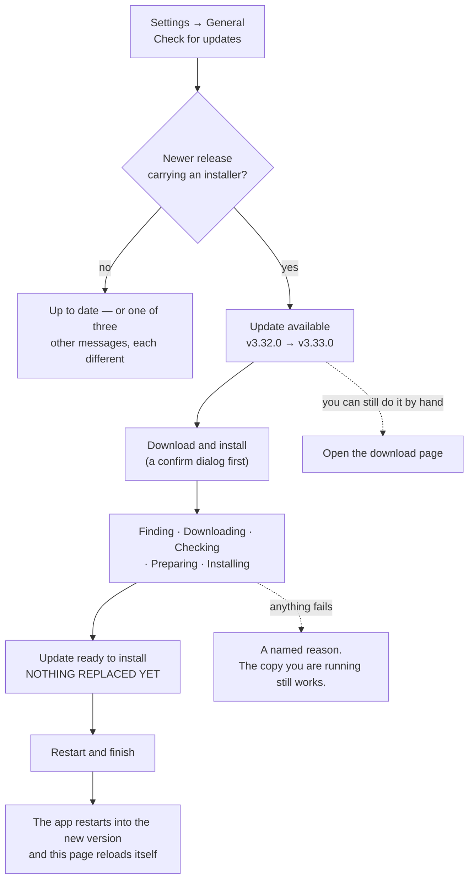

# Mac App — The Curator

There are **two** Mac shapes, both current, and this page covers both.

| | **The packaged app** (`.dmg`) | **The Dock launcher** (built by `install.sh`) |
|---|---|---|
| What you get | A real macOS application you download and drag to Applications | A compiled AppleScript applet in `~/the-curator/` that starts a Node server and opens your browser |
| Needs Node.js? | **No** — it carries its own runtime | Yes; the installer puts it there for you |
| Where the interface appears | Its own window | A browser tab at `http://localhost:3333` |
| Menu bar icon | **Optional** — off by default, switched on in Settings ([§ The menu bar icon](#the-menu-bar-icon-packaged-app-only)) | None. A browser install has no menu bar presence |
| How it updates | **In the app** — Settings → General → *Check for updates* → **Download and install** ([§ Updating](#updating-the-packaged-app)) | Settings → General → *Check for updates*, which runs `git` against the checkout |
| Install mode reported by System Check | *Packaged app* | *Source install (git checkout)* |

Which one you have is not a guess: **Settings → General → Run system check**, the
**Install mode** row.

**In one line, and it is the same line for both:** what you launch is a *shell*
around the same server, and neither shell owns your knowledge. That lives in a
`domains/` folder as plain markdown, which is why swapping one shell for the
other — or replacing, reinstalling or deleting either — costs you nothing.

The difference between the two is only where the server runs. The Dock launcher
starts `node src/server.js` as a detached background process and opens your
browser at a fixed `localhost:3333`. The packaged app *imports* the same
`src/server.js` into its own process — one program, no child process, and a fresh
free port chosen each launch, so it can never collide with a checkout you are
already running on 3333.

> The decisions behind the packaged app — with the reasoning, the evidence, and
> whether code exists for each — are in
> [desktop-app-decisions.md](desktop-app-decisions.md). What the shell *is*
> internally is [architecture.md § The macOS desktop shell](architecture.md#the-macos-desktop-shell-desktop).

---

## Getting the packaged app

Download the `.dmg` from the
[**Releases page**](https://github.com/talirezun/the-curator/releases) — the newest
release at the top, and the build whose filename carries **`arm64`** (Apple Silicon)
or **`x64`** (Intel). About 140 MB, because the app carries its own runtime. Open it
and drag **The Curator** onto **Applications**.

**This is a first install only.** Once the app is on your machine it updates
itself — you should not need the Releases page again. See
[§ Updating](#updating-the-packaged-app).

> **First launch is blocked by Gatekeeper, and you allow it once.** The app is
> **ad-hoc signed**: the bundle's contents are sealed so macOS can tell the app has
> not been tampered with, but there is no Apple developer identity behind that seal
> and it is not notarized, so macOS cannot tell you *who* built it. Apple Developer
> enrolment is in progress.
>
> 1. Open **Applications** and double-click **The Curator**. macOS blocks it —
>    dismiss the dialog.
> 2. **System Settings → Privacy & Security**, scroll to **Security**, click
>    **Open Anyway**. Confirm, and enter your password if asked.
> 3. Open the app again. The exception is remembered.
>
> Don't leave a long gap between steps 1 and 2 — the button only appears for a
> while after a blocked launch. Control-click → **Open** no longer works on macOS
> Sequoia (15) and later; System Settings is the route.
>
> **Honest limit:** nobody has yet launched a quarantined copy of a current build
> to see which dialog macOS shows. The steps above are what the app's signature
> state *should* produce, inferred from `syspolicy_check` rather than observed.
>
> **If macOS says the app *"is damaged and can't be opened"*** and offers **no**
> Open Anyway button, you have an old build. Releases up to and including
> `v3.30.0` shipped with a **broken** signature — a header declaring sealed
> resources the bundle did not actually have — which is a different and worse
> Gatekeeper class than "unidentified developer", and the only escape is
> `xattr -dr com.apple.quarantine "/Applications/The Curator.app"` in Terminal.
> The fix is to download a build from `v3.31.0` or later; that class is gone.

---

## The menu bar icon (packaged app only)

The app can put a small icon in the macOS menu bar that answers one question without you
opening anything: **has my agent actually saved, and how long ago?** Click it and you get the
last save, up to eight recent work-streams newest first, and *Open Agent Memory · Open The
Curator · Settings · Quit*.

**It is off by default, and that is not caution.** A fresh install has no agent memory, so an
on-by-default icon's only possible content is *"No agent memory yet"* — the worst first
impression the feature can make. Turn it on in **Settings → General → Menu bar**.

| Setting | What you get |
|---|---|
| **Off** | No menu bar icon. The Dock icon and the window behave exactly as they always have. **Default.** |
| **On** | A menu bar icon alongside the Dock icon |
| **On, hide the Dock icon** | Accepted and remembered — but **the Dock icon is not actually hidden yet.** It behaves as **On**. See the limit below |

The change takes effect immediately; there is nothing to restart. It applies to the packaged
app only — the browser install has no menu bar presence, and the setting is still shown there
rather than hidden, so it says so instead of leaving you hunting for it.

**What the icon itself shows** is presence plus one bit: a hollow ring means The Curator is
running, and a filled centre means an agent has written **on this machine** in the last two
minutes. There is no count, no animation, and deliberately no text beside it — a relative age
in the menu bar is either stale or it needs waking every minute forever, and extra width is
what makes an icon vanish behind the notch on a narrow screen.

Everything the widget does is described from the user's side, with the scenarios it was built
for, in **[user-guide.md § 6b](user-guide.md#6b-the-menu-bar-icon-mac-app)**. The engineering
is in [architecture.md § The menu bar widget](architecture.md#the-menu-bar-widget-desktoplibtray-js--srcbraintray-summaryjs).

> **If the icon does not appear.** There are three separate ways a new menu bar icon silently
> fails to show up on a modern Mac, and **macOS gives an app no way to find out which
> happened** — so the app cannot tell you, and neither can this page. Check all three: it can
> be pushed off the edge behind the notch on a narrow screen; a menu bar organiser such as
> Bartender or Ice can file it into a hidden section; and macOS has a menu bar items
> permission in **System Settings → Privacy & Security**.

> **Two limits, stated rather than glossed.**
>
> **No tray icon has ever been rendered on any machine.** The rows, the menu, the mode
> switching and the icon's own pixels are all produced and checked by the test suite, but
> nothing has yet put one in a real menu bar — so how macOS tints the icon, whether the second
> line of each row draws, and whether hovering updates the ages are all unproven. Treat the
> first real launch with it switched on as the first real test.
>
> **"On, hide the Dock icon" does not hide the Dock icon.** The macOS call that hides it has a
> return transition — coming *back* when you open the window from the menu bar — that is
> reported broken in exactly the way this would depend on, and it could not be tested here.
> The app therefore recognises the setting, keeps it, and does the safe half: menu bar icon on,
> Dock icon left alone. Shipping the other half untested risks no Dock icon, no menu bar icon
> and no window at once.

---

## The Dock launcher (`install.sh`)

Everything from here to [§ Updating](#updating-the-packaged-app) describes the
**AppleScript Dock launcher** the one-command installer builds. It is not
deprecated and it is not going away — it is the same server, and on Windows and
Linux the browser install is the only option.

---

## How it gets built

The **installer** (`install.sh`) builds The Curator.app automatically as part of installation. You do not need to create it manually. The app is a compiled AppleScript applet that manages the Node.js server behind the scenes.

If you used the one-command installer, the app is already at `~/the-curator/The Curator.app`.

---

## How it works

The app is a "stay-open" AppleScript applet. It handles three scenarios:

### Scenario 1 — Fresh start (app is not running)

You double-click **The Curator** in your Dock or Finder.

1. The `on run` handler checks if the server is already running (via `curl`)
2. If not running, it calls `doStart()`:
   - Kills any stale process on port 3333
   - Launches Node.js using its **absolute path** (resolved at build time)
   - Polls `http://localhost:3333` every second (up to 20 attempts)
   - Once the server responds, opens your browser
3. If already running, it simply opens the browser

### Scenario 2 — Reopen (browser tab was closed)

You closed the browser tab but the server is still running in the background. You click the Dock icon.

1. The `on reopen` handler checks if the server is responding
2. If yes, opens the browser — that's it
3. If the server has stopped for any reason, it calls `doStart()` to restart it

### Scenario 3 — Update and restart

You click **Check for updates** in the **Settings** view (reached from the left rail's footer) and apply an update.

1. The frontend calls `/api/config/update` which runs `git fetch origin main` + `git reset --hard origin/main`, then `npm install`, then `bash scripts/build-app.sh` (rebuilds the .app with the current node path). It hard-resets rather than pulling because `npm install` regenerates `package-lock.json` with machine-specific diffs, which makes a plain `git pull` abort — the reasoning is in the `POST /api/config/update` docblock in `src/routes/config.js`
2. The frontend then calls `/api/restart`
3. The server spawns a new process using `process.execPath` (the absolute path to the running Node binary) and exits
4. The frontend polls for the new server and reloads automatically

---

## Updating the packaged app

**The app updates itself.** You do not go back to the Releases page — that is a
first install only.

A checkout replaces its own files (`git fetch` + `git reset --hard` + `npm install`
+ a restart). **A packaged app cannot**, and does not pretend to: it is read-only,
has no `.git` and no `node_modules` to install into, and re-running
`scripts/build-app.sh` would destroy a code signature. The capability record in
`src/brain/install-mode.js` says so by name — `canSelfUpdateViaGit: false` — and the
git route refuses with a `501`. So the app takes the other route: it downloads a
new copy of itself, checks it, and swaps it in.

### What the flow looks like



1. **Check for updates** reads GitHub's public release list — one unauthenticated
   `GET`, no credentials, no personal data, an 8-second timeout. It selects **the
   newest release that actually carries an installer** and compares that version
   with the one you are running.
2. If yours is older you get **Update available** with both version numbers and
   the release name, a **Download and install** button, and — still — a link to
   open the download page if you would rather do it by hand.
3. **Download and install** asks you to confirm first. It deliberately does **not**
   quote a download size: nobody knows it until the server has asked, and the real
   figure appears on the progress line the moment it is measured.
4. Five named steps run, on a progress ring: **Finding · Downloading · Checking ·
   Preparing · Installing**. While downloading you see real byte counts
   (`58.2 MB of 137 MB · 43%`). If the total size is not known the app says so
   rather than showing a bar sitting at 0%.
5. **The download does not stop if you navigate away.** Switch to Chat, or reload
   the page entirely, and the update keeps going — the stream is a view of the job,
   not the job. It also means **there is no cancel**.
6. At **Update ready to install** the new version has been downloaded and checked
   and **nothing has been replaced**. One button, **Restart and finish**, does the
   swap. It takes a few seconds.
7. The app restarts into the new version and the page reloads itself. **There is
   no Gatekeeper warning to click through** — see below.

**Starting a new ingest while the update runs is refused** with a clear message
rather than being allowed to race the restart — both the single ingest and the
batch queue check the update flag. In the other direction, if a write is already
in flight when you press **Restart and finish**, the app keeps the update parked
at *ready to install* instead of truncating your work; finish it when the write is
done.

*(Sync is deliberately not gated on the download — it is short and is not a paid
write. The gate that matters is on the swap, and that one covers everything.)*

### No security warning on an update, and why

A `.dmg` your **browser** downloads is stamped with `com.apple.quarantine`, which
is what produces the Privacy & Security detour on a first install. A `.dmg` **the
app itself** fetched is not — measured, with the browser download kept as the
control. So an in-app update opens straight into the new version with no dialog and
no App Translocation.

### What is checked, and what cannot be

| Checked | How |
|---|---|
| The file arrived complete | Byte length against the size GitHub publishes for the asset |
| The file is the file GitHub published | **sha256 against the `digest` GitHub publishes on the asset** |
| The app inside it is the version claimed | `CFBundleShortVersionString` read out of the staged bundle |
| The bundle is internally intact | `codesign --verify --deep --strict` |

**What none of that proves is that Apple vouches for the bytes.** `codesign
--verify` on an ad-hoc-signed bundle is an *integrity* check, not an authenticity
one. Authenticity rests entirely on the published digest and on TLS to GitHub,
which is why the digest check is not optional and why the download host is
restricted to `github.com` and `objects.githubusercontent.com`. Nothing in the app
claims Apple checked anything.

### If it fails

Every failure names a reason in plain language and says what was **not** changed;
the copy you are running keeps working. The swap itself is two renames of
neighbouring folders on the same disk, so a half-replaced application is not a
state that can exist: either the old app is complete or the new one is. Lose power
in the two-syscall window between them and both complete copies are sitting side by
side under known names, with the recovery written into
`~/Library/Logs/The Curator/update-install.log`.

> **What has not been proven.** No automated run has ever replaced a real
> installed application. The test suite swaps a real ad-hoc-signed *fixture*
> bundle in a temporary folder — it genuinely replaces it, and the result genuinely
> still passes `codesign` — but the 140 MB round trip to GitHub against a live
> release has not been exercised end to end, and **the update screens have never
> been rendered in a browser**. Treat the first real update as the first real test.

> **Rosetta:** an arm64 build installed under x64 emulation stays on x64. The app
> updates like for like and will not silently migrate you to another architecture
> behind a progress bar.

**`/old` has no in-app update path.** The frozen previous interface still posts to
the git updater, which a packaged app refuses. Use the current interface.

### Why a pre-release can be offered

GitHub's `/releases/latest` means *newest release that is neither a draft nor a
pre-release*. Measured against this repository on 2026-08-31, when the flow was
built:

| Query | Answer | Carries an installer? |
|---|---|---|
| `/releases/latest` | `v3.9.0` | **No** — zero assets |
| `/releases` | 5 releases; exactly one had a `.dmg` | `v3.30.0`, flagged **pre-release** |

Excluding pre-releases would therefore have told every packaged user they were
*ahead of the published version*, permanently, and — if it had ever offered
anything — pointed them at a page with nothing to download. The rule is instead
**newest release with an installer**, chosen by version number rather than by
publication order, and the pre-release status is shown in the status box rather
than hidden. Today the only way to have the Mac app at all is an ad-hoc-signed
preview build, so hiding that would be the dishonest half of the trade. When
signed stable builds start shipping they become the newest installable release
with no code change.

*(The counts in that table are a snapshot of the day, not a live figure. The rule
is what matters and the rule has not changed.)*

### Going back to an earlier version

**Updating is in-app; going back is not.** There is no in-app rollback, and the
panel behind the ⓘ next to *Software update* does not claim one. Going back means
installing an older build the way you installed the first one — and **only
releases that carry a download can be reinstalled**. Check
[the releases page](https://github.com/talirezun/the-curator/releases) to see which
ones do before relying on it. Your knowledge base, API keys and sync settings are
stored outside the app and are untouched by installing, reinstalling or deleting
it.

---

## Adding to Dock

After installation:

1. Open **Finder**
2. Press `Cmd + Shift + G` and type: `~/the-curator`
3. Drag **The Curator** to your Dock

---

## How to use it

| Action | How |
|--------|-----|
| Start the app | Click the Dock icon |
| Reopen after closing the tab | Click the Dock icon again |
| Fully quit | Right-click the Dock icon → **Quit** |
| View logs (if something goes wrong) | `cat "$HOME/Library/Logs/The Curator/curator.log"` |

> **Closing the browser tab does not stop the server.** The server continues running in the background using virtually no CPU. This is normal and intentional — click the Dock icon to reopen.

---

## Rebuilding the app

If the app gets corrupted, or you moved the project folder, rebuild it from Terminal:

```bash
cd ~/the-curator
bash scripts/build-app.sh
```

This regenerates the AppleScript with the correct project path and node path, compiles it, applies the icon, and signs the bundle **ad-hoc** (`codesign --sign -`, an identity-less signature that satisfies macOS locally). It is **not** a Developer ID signature, which is why a rebuild is safe here and would be destructive in a properly signed app.

The build script also runs automatically during updates (via the **Settings** view).

---

## Moving from the Dock launcher to the packaged app

Both are supported and you can keep both. If you want to move, this is what it
costs. The reasoning behind each row is in
[desktop-app-decisions.md](desktop-app-decisions.md).

| | The Dock launcher | The packaged app |
|---|---|---|
| **What you install** | The installer clones the repo and builds a `.app` **on your machine** | An application you download and drag to Applications |
| **Where your knowledge lives by default** | Inside the checkout, at `~/the-curator/domains/` | `~/Library/Application Support/The Curator/domains` — but you point it wherever you like |
| **Updates** | Settings → Check for updates runs `git` against the checkout | Either entry point — the menu bar's **Check for Updates…** or Settings → General — downloads, verifies and installs a new copy of the app — see [§ Updating](#updating-the-packaged-app). The git route refuses with a `501` |
| **Rebuilding the `.app`** | `bash scripts/build-app.sh`, as below | Never — that ad-hoc `codesign` would destroy the bundle's own signature |
| **Your files** | Plain markdown in `domains/` | **Identical.** Same files, same folder, same Obsidian vault |

**What you would have to redo, and what you would not:**

| ✅ Comes across untouched | ⚠️ You redo it once |
|---|---|
| Every wiki page, domain and summary | Paste your API key again |
| Chat history and working state | Reconnect Personal Sync, if you use it |
| Your Obsidian vault and graph settings | Re-run the MCP wizard, if you use it |

The one thing that must work is that **your existing wiki appears**. There is no
importer and no conversion: the wiki is plain markdown, and pointing the app at
the folder *is* the migration. The Domains view's sidebar carries a **Use existing
folder** button for exactly this, on every state of that screen.

> ⚠️ **Pick the folder that CONTAINS your domains, not a domain itself.** If your
> wiki is at `~/the-curator/domains/articles/`, the folder to pick is
> `…/domains` — the one holding a subfolder per domain. Pick `articles` and you
> get an empty list, because there are no domains *inside* it. The full trap, and
> why the app cannot tell you which mistake you made, is in
> [user-guide.md § Knowledge base folder](user-guide.md#knowledge-base-folder).

**Credentials are deliberately not migrated**; that decision, and why re-typing a
key beats writing a one-shot importer for three secret files, is
[D11](desktop-app-decisions.md#d11--credentials-do-not-migrate).

> **Running both at once over one folder** is possible and is not guarded
> against. See [§ Two installs, one knowledge folder](user-guide.md#two-installs-one-knowledge-folder)
> — including the part people get caught by, which is that **closing the browser
> tab does not stop the browser install's server**.

---

## Troubleshooting

> **Most of this section is about the Dock launcher**, because that is the shape with
> a `node` path and a fixed port to go wrong. The packaged app's own troubleshooting
> is in [user-guide.md § 18 → Mac app](user-guide.md#mac-app). It writes to the same
> `curator.log`, plus one file of its own:
> `~/Library/Logs/The Curator/update-install.log`, which records what the update
> helper did during a bundle swap. There is no `/tmp/the-curator.log` there —
> that file is the AppleScript launcher's stdout capture and nothing else writes it.

**"The Curator could not start" dialog appears**

Check the log first:
```bash
cat "$HOME/Library/Logs/The Curator/curator.log"
```

The most common causes:

| Log message | Cause | Fix |
|-------------|-------|-----|
| `nohup: node: No such file or directory` | Node.js path changed (e.g. after an upgrade or nvm switch) | Rebuild the app: `bash scripts/build-app.sh` |
| `Error: No LLM API key found` | No API key configured | Open `http://localhost:3333` manually and paste a key into **Settings → API Keys**. The first-run panel points you there; it is dismissible and never blocks the app |
| `EADDRINUSE: address already in use :::3333` | Another process is using port 3333 | Run `lsof -ti :3333 \| xargs kill -9` then try again |

**The Dock icon bounces but nothing happens**

The app is waiting for the server to start (up to 20 seconds). If the server can't start, a dialog appears after the timeout.

**Two logs exist and they answer different questions.** The app writes its own log at
`~/Library/Logs/The Curator/curator.log` — startup facts, provider and model, update outcomes,
and errors it could catch. But a failure that happens *before* the server is running
never reaches it, because nothing is there to write it yet. For that case check
`/tmp/the-curator.log`, which is the launcher's raw stdout capture.

**I moved the project folder**

The app has the old path embedded. Rebuild it from the new location:
```bash
cd /new/path/to/the-curator
bash scripts/build-app.sh
```

**I upgraded Node.js (or switched versions with nvm/fnm)**

The app has the old Node.js path embedded. Rebuild it:
```bash
cd ~/the-curator
bash scripts/build-app.sh
```

The build script resolves the current `node` path and embeds it in the app.

**The icon doesn't appear in the Dock**

macOS caches icons. Force a refresh:
```bash
killall Dock
```
