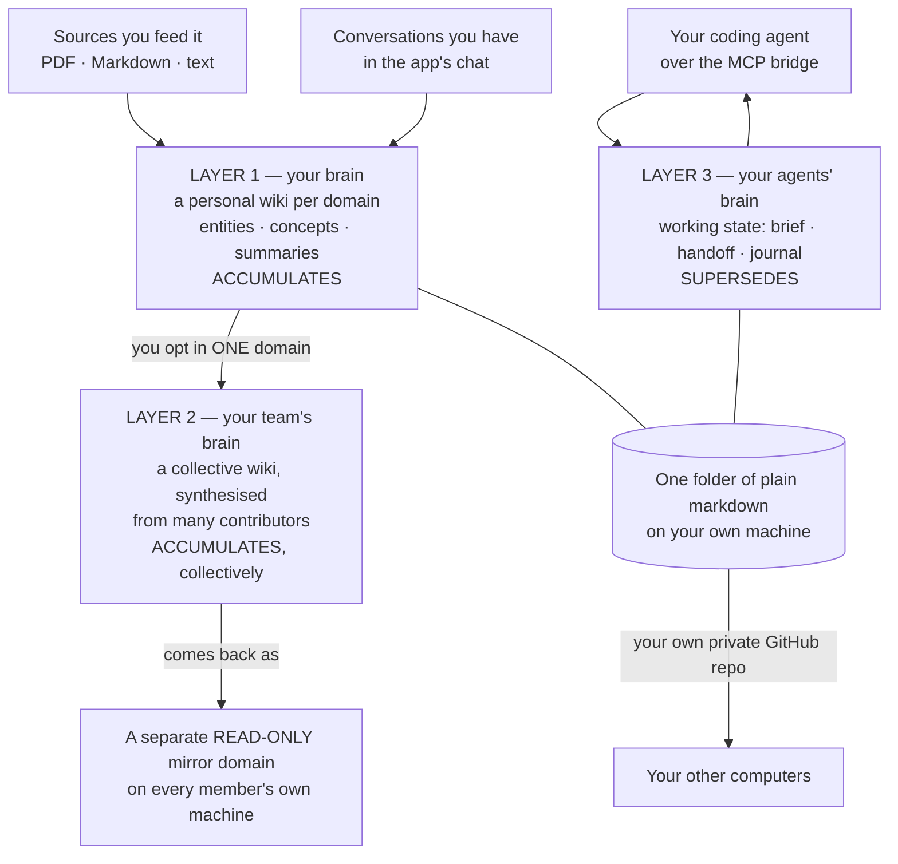

# The Curator — Product Overview

**What it is, what it does, and where it stands — the whole product in one document.**

This is the foundational brief. It is written to be handed to a person or to a model as the
single source of context on The Curator: every capability, what each one is *for*, the
scenarios it was built to serve, the honest history, and an explicit account of what it does
**not** do. It describes capability, not implementation — there is no code in it.

*Current as of **v3.45.0**. Where a number moves between releases — model prices, model
catalogues, tool counts — it is marked as a reading taken at a moment rather than a constant.*

---

## If you read only one section

The Curator is a **local application you run yourself**. It turns sources you feed it —
PDFs, articles, notes — into an interlinked wiki of **plain markdown files in a folder you
chose**, readable in Obsidian or any text editor. Nothing is hosted by anyone else; you bring
your own model API key.

It holds **three layers of the same idea**, in one format, with one owner:

> **Your brain → your team's brain → your agents' brain.**

| Layer | What it holds | How it behaves |
|---|---|---|
| **1. Your brain** | A personal wiki per domain: entities, concepts and summaries, cross-linked into a graph | Knowledge **accumulates** — a new source updates existing pages instead of duplicating them |
| **2. Your team's brain** | The same, built collectively by a cohort, team or research group. Opt-in, one domain at a time | Knowledge **accumulates**, collectively |
| **3. Your agents' brain** | Where the *work* stands: what is settled, what to do next, what was tried and ruled out | State **supersedes** — each save replaces the previous handoff, so a resolved blocker cannot come back |

Layers 1 and 2 are built by ingesting sources. Layer 3 is written by a coding agent over a
local MCP bridge at the end of a session and read back at the start of the next one — on a
different tool, a different model, or a different computer.

**The commitment underneath all three is portability.** Claude Projects, ChatGPT Projects and
Cursor rules each hold your accumulated context inside one vendor's product, and you leave it
behind the day you switch. The Curator's answer is structural rather than clever: there is no
proprietary store to leave behind. The files *are* the product, and the app is a convenience
over them.

---

## 1. The spine: three layers, one idea

The three layers are not three products that happen to ship together. They are the same
commitment — *your context, in your files, in your possession* — applied to three different
kinds of context.

**Why they belong together.** All three live inside the same container — a *domain* — and
therefore share one folder, one sync mechanism, one backup, one editor and one bridge to your
agents. A knowledge base that could not carry the state of the work would leave your agents
starting cold; a state store that could not reach durable knowledge would keep re-learning the
same subsystem. Splitting them into separate products would mean two folders, two syncs, two
sets of credentials, and a boundary the user has to manage by hand.

**The boundary between layers 1–2 and layer 3 is the one thing to learn before using it.**
Knowledge accumulates; state supersedes. Put something durable into state and the next save
overwrites it, and nothing warns you — from the store's point of view, overwriting is correct.
[§5](#5-the-memory-layer--your-agents-brain) sets out the rule for deciding which side a fact
belongs on.

---

## 2. What it actually is

| | |
|---|---|
| **Shape** | A local web application. It runs a small server on your own machine and you open it in a browser at `localhost`. On a Mac there is also a downloadable desktop application that carries its own runtime, needs no Terminal, and installs its own updates — since `v3.42.0` behind a **Software Update** window that shows the same five named steps and the same byte counts the Settings panel shows, with a progress bar on the Dock icon while it downloads and one notification at the moment it restarts. |
| **Where your knowledge lives** | Plain markdown files, in a folder you chose, on your disk. There is no database, no proprietary format, and no export step — the files are already the deliverable. |
| **How you read it outside the app** | Any text editor. Obsidian in particular renders the `[[wikilink]]` graph visually, with entities, concepts and summaries auto-coloured. |
| **What powers the AI** | Your own API key with **Google Gemini**, **Anthropic** or **OpenRouter**. Any one of the three is enough. |
| **What it costs to run** | The software is free and open source. You pay only your model provider, and only for the features that actually call a model. |
| **Where your data goes** | Outbound calls go to the AI provider you configured, and — when you sync or check for updates — to GitHub. There is no service of the project's anywhere in the picture and no account to create with it. |
| **Platforms** | Mac (downloadable app, or a one-command installer that builds a Dock launcher), and Windows / Linux / Mac via a manual setup that runs the same server in your browser. The browser install is a first-class path, not a legacy one. |
| **Licence** | MIT, with a documented exception: ten Shared Brain backend files are source-available under a separate enterprise licence. The GitHub-backed Shared Brain that exists today is free for everyone, organisations included. |

### Portability as the product

This is the core commitment, and it is worth stating as a set of concrete guarantees rather
than as a slogan.

| If you… | You are not blocked, because… |
|---|---|
| Switch from one AI assistant to another | The bridge to your knowledge is a **protocol** (MCP over a local child process), not an integration with one vendor. |
| Stop using The Curator entirely | Your knowledge is markdown in your own folder. There is nothing to export; it is already readable. |
| Change AI provider | Three providers ship today and swapping is a setting. Your wiki does not care which model wrote it. |
| Work across several computers | Sync is **your own private GitHub repository**. Nothing of yours passes through the project. |
| Move a coding session to a different tool | Working state is plain markdown and an append-only log, designed for exactly that move. |

**And what is not yet neutral, stated plainly, because an overclaim here would be worse than
the gap:**

- **The two agent skills are portable in content but Claude-shaped in activation.** Their text
  is ordinary prose that works anywhere you can paste it; what is Claude-specific is how they
  *switch on* — the tool-permission header, automatic triggering from a description, and the
  documented install path. A harness-neutral form is **generated** from the same single source
  rather than hand-copied, so there is no second copy to drift.
  The practical consequence: an agent in another harness can **read** working state over MCP
  perfectly well, but nothing tells it to **save**. The store is portable; the discipline that
  fills it is not yet.
- **Local models are not available.** The provider row exists in Settings and is marked
  unavailable. The OpenRouter connection speaks an OpenAI-*compatible* protocol — the name of a
  wire format, not OpenAI support — which is groundwork for local runtimes later, not a
  capability today.
- **The MCP bridge is a local child process.** Any client that can spawn a local program
  reaches it — Claude Code, Claude Desktop, Cursor, and other MCP-capable agents. A
  browser-only assistant cannot. The limit is the transport, not the vendor.

---

## 3. Compiled knowledge, not retrieval

Most AI-over-your-documents products use retrieval (RAG): the model scans raw files, pulls
back chunks at query time, answers, and forgets. It rediscovers your material from scratch on
every question. Nothing compounds.

The Curator does the opposite. When you ingest a source, a model **reads it once and writes
persistent pages**: one summary page for the source, plus entity pages (people, tools,
companies, datasets) and concept pages (ideas, techniques, principles). Every later ingest
**updates those same pages** rather than creating duplicates, and inserts cross-links in both
directions. The knowledge is compiled once and kept current, not re-derived per query.

| | **Retrieval (RAG)** | **The Curator (compiled)** |
|---|---|---|
| What is stored | Raw chunks plus an index | Written pages, cross-linked |
| When work happens | At query time, every time | At ingest time, once |
| What accumulates | Nothing — the index grows, the understanding does not | The pages themselves: a second source about the same person deepens that person's page |
| The structure | Similarity in a vector space, rebuilt as the corpus changes | A `[[wikilink]]` graph, written by the thing that read the sources |
| What you can open | An opaque index | A markdown file you can read, edit and keep |

There is no vector database, no embeddings and no index to rebuild. The link graph *is* the
structure, and it stays human-readable.

### The tradeoff is real, and it is this

- **The writing pass costs money and time up front.** A retrieval system indexes cheaply and
  pays per query; The Curator pays once per source, more heavily. Ingest is where nearly all
  of a Curator bill goes.
- **A model can be wrong at write time, and the wrong thing persists.** Retrieval always
  re-reads the source; a compiled page is the model's earlier reading of it. This is why the
  product ships a whole maintenance surface (Wiki Health, §4.5) and why the original source
  file is kept and reachable from its summary.
- **Quality depends on the model that wrote the page**, not on the model asking the question
  later. Improving the model does not retroactively improve pages already written.
- **The corpus does not fit in a context window and never did.** A mature wiki is measured in
  megabytes. Chat therefore selects pages per question rather than sending everything; it is
  query-driven selection over a hand-curated graph, not a vector search.

The project chose compilation because the `[[wikilink]]` graph is already a curated relevance
signal, because markdown stays readable and Obsidian-native, and because the whole point is
that the second brain gets **better** with use rather than merely bigger.

---

## 4. Every capability, and when you would reach for it

| Capability | What it is for | Reach for it when… |
|---|---|---|
| **Ingest** | Turning a document into wiki pages | You have read something worth keeping |
| **The wiki and its graph** | Seeing and browsing what you know | You want the map, not an answer |
| **Chat** | Asking your own knowledge a question | You want a cited answer that spans sources |
| **Compile to Wiki** | Turning a conversation into permanent pages | The thinking you just did is worth keeping |
| **Wiki Health** | Keeping the graph honest | Links look broken, pages look duplicated |
| **Domains** | Keeping subjects separate and specialist | Your knowledge spans unrelated fields |
| **Personal Sync** | Backing up and moving between your own computers | You use more than one machine, or want a backup |
| **Shared Brain** | Pooling knowledge with a cohort or team | Several people are reading in the same area |
| **Provider and model choice** | Controlling capability and spend | Cost matters, or a model gets retired |
| **The MCP bridge** | Letting a coding agent read and write it all directly | You want a frontier model working over the whole graph |
| **The desktop application** | Running it without a terminal | You are on a Mac and want an app |
| **Working state — the memory layer** | Carrying the state of *work* across sessions, tools, models and machines | You code with agents. It has [its own section](#5-the-memory-layer--your-agents-brain) |

### 4.1 Ingesting sources

**What it is.** Drop in a `.pdf`, `.md` or `.txt` file — those three and nothing else. A model
reads it and writes an interlinked set of pages: typically one summary plus entity and concept
pages. Short sources go through in a single pass; longer ones are outlined first and then
written in batches, so a large document does not have to fit in one response.

**What it is for.** This is how layers 1 and 2 get built. It is the means, not the point — the
point is the compounding graph it produces.

**Limits worth knowing up front:**

- **There is a per-source input cap** (80,000 characters at the time of writing). Content past
  it is not seen by the model, and the ingest report says so in red rather than quietly
  dropping it.
- **There is no OCR.** A scanned or image-only PDF is refused, not silently half-read.
- **Very large books work but are not stress-tested at that scale.** A 25-page article is a
  minute; a 100-page document is minutes; a full book is expected to take much longer and is
  documented as untested territory.

**What you get around it:**

- **Batch ingest.** Drop two or more files and it becomes a durable, resumable queue that
  survives closing the tab or restarting the app. It runs files **strictly one at a time** —
  a correctness guarantee, not a speed choice, so two files cannot both create the same page —
  largest first, so later files link into a richer wiki. It quotes an estimated cost range for
  the whole batch **before** it starts and accepts an optional budget cap. Files already
  ingested are marked skipped before anything is uploaded or spent.
- **It pauses rather than failing.** A provider rate limit, a temporary outage, the budget cap,
  three failures in a row, or an app restart all park the batch. A recovered job comes back
  **paused, never running** — nothing may auto-start spend while you are not watching.
- **A budget cap it cannot enforce is refused**, not accepted: if the chosen model has no
  published price, the app declines the cap rather than pretending to honour it.
- **Re-ingesting is safe and idempotent.** The same source merges into the existing pages
  rather than duplicating them.
- **The original is kept.** The source file is stored locally beside the wiki, and a summary
  page can hand you back the text it came from. Original sources are deliberately **not**
  synced — they are yours and local, so "the original is not on this machine" is a normal
  answer on a second computer rather than a fault.
- **An honest report.** After every ingest you see a specific outcome — pages created, updated,
  unchanged, bytes added — plus warnings sorted into auto-fixed / for review / attention /
  info, and the real token and cost figures for the run. Anything the pipeline dropped,
  redirected, renamed or trimmed is surfaced as a user-visible warning rather than logged and
  forgotten. Repeated warnings are grouped, except the two kinds that name a decision only you
  can make.

**The counter-intuitive cost driver:** what an ingest costs depends mostly on **how big your
wiki already is**, not on the document — because the prompt carries the existing page names so
the model can link into them. The same short note measured tens of times more expensive against
a mature wiki than an empty one.

### 4.2 The wiki and its graph

**What it is.** Three kinds of page, in three folders, per domain:

| Kind | Holds | Colour in Obsidian |
|---|---|---|
| **Entities** | Specific people, tools, companies, frameworks, datasets | Blue |
| **Concepts** | Ideas, techniques, methodologies, principles | Green |
| **Summaries** | One page per ingested source | Purple |

Pages carry YAML frontmatter (type, tags, source, date) and link to one another with
`[[wikilinks]]`. Links are made bidirectional: a summary lists the entities it mentions, and
each of those entity pages links back to the summary.

**What it is for.** Two things a chat answer cannot give you: *the shape of what you know*, and
*a page you can read and edit yourself*. Point Obsidian at the folder and the graph view shows
clusters, hubs and — usefully — the gaps between them.

**Reach for it when** you are looking for the themes you keep circling, the entity that
everything connects to, or the two concepts that have never been joined.

### 4.3 Chat over your own knowledge

**What it is.** A multi-turn conversation against **one domain's** wiki. Answers cite the
specific pages they came from, and a citation chip opens that page in a reader overlay. Threads
are saved, survive restarts, and travel with sync.

| Control | What it does |
|---|---|
| **Answer length** | Concise · Balanced · Detailed. Controls detail, not shape. |
| **Model** | A per-message provider/model choice, separate from the model that builds your wiki. Every answer names the model that actually produced it, read back from the provider's own billing data — so a fallback is visible. |
| **Re-ask on another model** | Any answer can be re-asked on a different model; both stay in the thread, each labelled with its model and cost. |
| **Streaming** | The answer arrives as it is written, with a live wait state rather than a spinner. |
| **Thinking region** | On a reasoning model you can watch the deliberation before the answer, then fold it away. |
| **Stop** | A running answer can be stopped at any point. |

The chat does not dump the whole wiki into a prompt. It works out what kind of ask you made — a
decision question, an enumerate/count question, or a synthesis question — and selects pages
against a fixed budget.

**The limits, stated because an earlier version of the docs overclaimed them:** only the
**current thread** is in scope — other conversations are never read; only the most recent
stretch of that thread is sent; and the wiki side is budgeted to a bounded number of pages in
full, plus a compact catalogue of every page's name. In practice the **thinking region is an
OpenRouter feature**: one provider returns its deliberation encrypted and another's pinned
interface has no notion of it at all. Both still stream the answer, and the app never invents a
thinking animation it cannot substantiate.

**Reach for it when** the answer needs several sources at once: *"how does X relate to Y?"*,
*"what do I already know about Z?"*, *"which of these sources disagree?"*

### 4.4 Compiling a conversation into the wiki

**What it is.** A button on any chat thread that turns what you worked out into permanent
pages — a summary plus any new entities and concepts that emerged — through the same write
pipeline ingest uses, so existing pages are updated rather than duplicated.

**What it is for.** Knowledge is also created in the act of thinking. Without this, the useful
half of a brainstorm stays in a chat log.

**Notable behaviours:** it quotes a cost estimate before it spends anything; it refuses to
compile a conversation that has not changed since its last compile (which prevents the same
material inflating a page twice); and the thread is not consumed — carry on talking and compile
again later, and the new material lands as a fresh page beside the first.

**Reach for it when** a decision was made, a meeting was processed, or a synthesis was reached
that you do not want to re-derive next month.

### 4.5 Wiki Health and repair

**What it is.** One scan over a domain that finds six classes of problem, plus a separate,
opt-in scan for near-duplicate pages.

| Issue | What it means |
|---|---|
| **Broken links** | A `[[link]]` points at a page that does not exist |
| **Orphan pages** | A page nothing links to — often temporary, not necessarily an error |
| **Folder-prefix links** | A link written with a folder in it, which Obsidian treats as a separate page |
| **Cross-folder duplicates** | The same subject filed as both an entity and a concept |
| **Hyphen variants** | Several pages for one person or thing, differing only by hyphenation or an honorific |
| **Missing backlinks** | A summary names an entity, but the entity does not link back |
| **Semantic near-duplicates** *(separate, opt-in)* | Two pages that are about the same thing in different words |

**Free versus paid.** The structural scan and every deterministic repair cost nothing — no
model call, no network. The AI-assisted paths (proposing a target for a broken link, finding a
home for an orphan, detecting semantic duplicates) call a model and are marked as doing so.
The semantic-duplicate scan is opt-in, cost-gated, estimates before it runs, and refuses
domains beyond a hard size cap.

**The destructive gate.** Three fix types delete a page: merging **hyphen variants**, merging
**cross-folder duplicates**, and merging a **semantic duplicate**. Every inbound link is
repointed before anything is deleted, the confirmation names the exact number of pages that
will go, and the button reads *Merge and delete* rather than *Fix*. For semantic duplicates the
merge button stays disabled until you have opened a **preview** for that specific pair, showing
which files change, how many links get rewritten and what the merged page will look like — and
that gate resets on rescan, on switching domain, and on flipping which page survives. Batch
merging is offered for high-confidence pairs only; medium and low stay one at a time.

**There is no in-app undo, and the app says so on the panel that launches the deletion.** The
recovery route is a git client, via Personal Sync — and only if you use it.

**Dismissals are persistent and synced.** An issue you decide not to act on stays dismissed
across machines, with a restore list, and stale dismissals clean themselves up. On a read-only
Shared Brain mirror the scan runs but no fix buttons appear.

**Reach for it when** the Obsidian graph looks wrong, after a big batch of ingests, or when
you notice the same person appearing twice.

### 4.6 Domains

**What it is.** A domain is a self-contained knowledge base with its own wiki, its own chat
history, its own working state and — most importantly — **its own schema**. You might keep one
for AI/tech, one for business, one for a specific project. Three come built in; you can create
as many more as you like, from one of four starting templates (generic, tech, business,
personal), and the docs supply worked schema seeds for others such as history, health and law.

**Why not one big brain.** The project's stated premise, from Andrej Karpathy's wiki concept
and its own experience: one general-purpose second brain that covers everything ends up good at
nothing. The schema is the mechanism — a plain markdown file at the domain's root that acts as
the model's instructions for *this* subject: what is in scope, what is explicitly out of scope,
how pages should be structured and named, and how cross-references are written. It is meant to
be edited, and changes take effect on the next ingest. Each domain is a specialist.

**Siloing, in four levels.** Inside a domain you get the full graph. Across domains, the tools
never create a link: ingest only sees the current domain's pages, and a compile writes to one
domain per call. Across domains at *read* time you do get synthesis — a cross-domain search
lets an agent reason over several at once, without writing anything permanent between them. And
if your Obsidian vault root spans several domains, Obsidian's own resolver may draw an
*accidental* edge between identically named pages in different domains; that edge is not
architectural, and the per-domain Health scan correctly flags the same link as broken.
Intentional cross-domain linking is **not supported**.

**Marking a domain read-only** is a one-line change to its schema file, and it blocks ingest,
compile, every mutating Health action and every MCP write tool while leaving reads working.

**Reach for a new domain when** the subject would not sensibly share a page with what you
already have. A project is a domain; a work-stream within it is a *scope* — three unrelated
products are three domains, three features of one product are three scopes in one.

### 4.7 Personal Sync

**What it is.** A one-time setup (a few minutes) that connects your knowledge folder to **your
own private GitHub repository**. After that, daily use is one **Sync now** button, with
**Push only** and **Pull only** available alongside it.

| Syncs | Does not sync |
|---|---|
| Your wiki pages | The original source files you ingested (local, and deliberately so) |
| Your saved chat conversations | Machine-local operational state and editor scratch files |
| Your working state — the standing brief, the handoffs and the journals | |

**What it is for.** Backup, and continuity between your own computers. A handoff written on the
laptop reaches the desktop this way.

**Things it is explicit about:**

- **Every sync is a human click.** There is no timer, no background push, no background pull.
- **The risky moment is connecting sync on a machine that already has work on it**, not the
  daily pull — that is the one operation whose natural ending is a checkout over your folder.
  The app now measures what a checkout would overwrite, shows you the count, refuses to
  proceed without an explicit confirmation, and offers a non-destructive **merge** instead. A
  second install pointed at a folder the first already syncs now **joins** that history rather
  than creating a second repository over the same files.
- **On a genuine conflict the steady-state pull prefers the remote.** Working state is laid out
  per machine so that two computers never write the same file and no conflict arises — with one
  named exception, the standing brief, which has one file per project by design. Sync soon
  after editing it by hand.

### 4.8 Shared Brain — a collective wiki (opt-in, beta)

**What it is.** A cohort, team or research group builds one wiki together without merging
personal data. Each contributor keeps a private Curator and opts **one domain** into the
shared brain. Contributions are synthesised by a model into a collective wiki in a shared
private GitHub repository, and that collective comes back to every member as a **separate,
read-only mirror domain** on their own machine.

| Property | How it works |
|---|---|
| **What leaves your machine** | Only pages from the domains you explicitly ticked — and not as raw files. They leave as **change summaries produced by a model running locally on your own machine**, on the key you already had. |
| **What never leaves** | Every domain you did not opt in; your chat history; your access token; and, by default, your name. |
| **What comes back** | A read-only mirror domain, readable from the app, from chat, from Obsidian and over MCP. Members cannot edit the collective directly — a direct write would neither reach anyone else nor survive the next pull. Changes always originate in your own opted-in domain. |
| **Roles** | Exactly one **admin** per brain (who is also a contributor) and N **contributors**. The contributor path is the one almost everyone takes. |
| **Identity and access** | Two primitives, and confusing them is the commonest setup mistake. An **invite token** carries metadata only — it is a label, safe to send over any channel, and grants nothing. Each contributor's **own GitHub access token** is their identity and the actual authentication. Access is gated by repository collaborator status, which is also what makes paid access workable with no code. A third credential, shown once, authorises revocation. |
| **Making that token, which is the step that stops cohorts** | It must be a **fine-grained** GitHub token, and the setup step now names the two fields people get wrong. The **resource owner** must be the account or organisation that owns the cohort's repository — the wizard prints that owner's name, taken from the invite, because GitHub defaults the field to your personal account and the repository then simply does not appear in the next picker, with no error, looking exactly like a collaborator invitation that never arrived. And **expiry** is stated in plain words: GitHub's default is 30 days, on that day pushes stop with no notice from GitHub and none inside the app, so pick the longest expiry allowed and put the date in a calendar. A **Check token** button beside the field asks for the verdict on demand, and a connection card carries **Check now** for the same question later — the card never holds the token itself. |
| **Rotating the revocation credential** | Requires the current one. There is no route that will issue you a fresh admin credential because you lost it: nothing on a member's machine distinguishes an admin from a contributor, so a route that provisioned one on request would hand any contributor the power to erase the cohort. An admin without it re-runs the brain-setup wizard. |
| **Why per-person tokens** | One shared token would make every contribution look like the admin's, would make revoking one person mean revoking everyone, and would put the whole brain behind a single leak. |
| **Synthesis** | Not a file merge. A model resolves conflicting formulations between contributors, drops broken cross-person links, enriches sparse pages, attributes provenance and rebuilds the collective index. The admin runs it periodically. |
| **Attribution** | Collective pages **always** show a shortened pseudonymous identifier and **never a name**, with no setting involved. Putting your display name on your *contribution records* is a separate checkbox that is **off by default** — and it is forward-looking in both directions, so ticking it later does not retroactively name old pushes and unticking it does not remove names already published. |
| **Erasure** | GDPR Article 17 revocation is built in and admin-only: it deletes a person's submissions, deletes collective pages whose provenance references them, rebuilds the collective from what remains, and writes an audit entry carrying no personal data. It is irreversible, and it is the only route to removing an already-published name. |
| **IP modes** | Two, chosen at setup and encoded into the invite token so each contributor's consent screen matches: contributors retain their rights (the default, for cohorts and research groups), or the organisation takes assignment (for employment contexts). Locked once invites go out, because people consented to the mode at join time. |

**Reach for it when** several people are reading in the same area and the reading is currently
scattered across their laptops.

**It has now been driven end to end, once, and that run is worth reading.** At `v3.43.0` two
isolated installs — an admin and a member, each with its own folder and its own key — ran the
whole flow against a throwaway private repository: the setup wizard, an invite, joining with a
personal access token, pushes with cost confirms, a synthesis that turned **2 contributions into
16 collective pages in 61 seconds**, read-only mirrors pulled on both sides carrying a short
pseudonymous identifier and no name, and a typed erasure that removed every page and fact the
member had contributed, visible on the member's next pull. Seventeen steps passed for under five
cents. The eighteenth was a deliberate escalation attempt and **it succeeded**: the contributor
minted a revocation credential and deleted the collective. That is the defect the rotation rule
above closes, and it is recorded here rather than summarised away, because it is the strongest
evidence there is for the difference between *tested* and *driven by a person*.

**Status and stated limits.** It is an **opt-in beta**, off until you enable it, and the
remaining gate to general availability — a structured pilot with a real cohort — has not
started. Named limits: **there is no EU-resident deployment** — the shipped storage backend can
reach only one API host, so every working shared brain stores its data in the United States,
and the intended answer is a second backend that has not shipped. Deleting a page in your own
domain does **not** remove it from the collective. Contributions accumulate; pruning is
deferred. And **the "read-only member" tier is a flag the member's own copy of the app declares
about itself**, not a permission GitHub enforces — it is what makes a free or lower tier easy to
run, and it is an honour system, so it must never be described as an access control.

### 4.9 Provider and model choice, with cost shown as fact

**What it is.** Three providers ship: **Google Gemini**, **Anthropic** and **OpenRouter**. You
supply a key for whichever you want. A hand-measured catalogue of models is offered, each row
showing its price, its output ceiling and its measured behaviour.

**Saving a key no longer moves your bill, and that is a change (`v3.45.0`).** From `v2.4.2` to
`v3.44.0` the last key you saved became the provider that built your wiki — so
pasting a key to try one model in chat silently moved every future ingest onto a different
vendor at a different price, chosen by nobody. The docs already called it the likeliest surprise
in the whole screen. Now:

- **The first key you connect takes the build lane**, because there is nothing to displace.
- **Every later key save leaves the lane where it is**, and the app says so rather than doing it
  quietly.
- **Choosing which model builds your wiki is the only thing that moves it afterwards** — one
  gesture, on the screen whose whole subject is that question, and it sets the provider and the
  model together so a choice cannot land somewhere it does not govern.
- **Disconnecting the provider that was building** hands the lane to the **cheapest measured**
  provider you still have connected, and the response names which and why.

The cost of that is one extra click for someone who pasted a key *in order to* switch — taken
knowingly, because the silent version moved the bill without asking.

**The provider screen reads as four numbered steps**, and no step is ever hidden: **1 · Connect a
provider** (one row each, status in plain words — *Connected* or *Not connected*, never a jargon
word in a code face); **2 · What builds your wiki** (one model, named, with three facts beside
it — what it costs, what the measurement found, and who measured it — a sentence saying *why*
this one is running, and a **cheapest measured** line with a one-click way to take it);
**3 · Chat** (a statement and a readout, not a second control, because chat is chosen per message
in the composer); **4 · All models** (collapsed: the whole catalogue with live filter counts,
price bands, search, and a *worth testing for this job* shortlist that is a filter with a
sentence attached and never a ranking). With no key connected, blocks 2, 3 and 4 say what they
are waiting for rather than disappearing — a numbered flow that silently loses steps stops
reading as a sequence.

**Two jobs, not one setting.** This is the organising idea.

| | **The build job** — ingest, Health AI, compile | **The chat job** |
|---|---|---|
| Chosen in | Settings, once, app-wide | The chat composer, per message |
| Eligible models | **Only models the project has measured**, enforced on the server rather than by greying a button | Anything your saved key can reach |
| Risk if wrong | Pages written badly, permanently | One answer, re-askable on another model |

The two lanes cannot leak into each other: picking an expensive model for a chat does not
change what your next ingest costs.

**How the catalogue is built.** Around nineteen models are hand-measured against the app's own
real ingest prompt, nine runs each, on five criteria — price, maximum output tokens, hidden
reasoning tokens, structured-output reliability, and how much of a document the model's outline
actually covers. An OpenRouter key additionally reaches a much larger list for **chat**, offered
but marked **not measured** — explicitly *not* "bad". You can also run the nine-run measurement
yourself against your own wiki; the confirmation leads with **time**, not money, because that is
the binding cost.

**How big a model has to be is now derived from what the app actually needs, per lane
(`v3.45.0`).** There used to be one context-window threshold for everything, set by parity with a
model the project happened to ship. It was simultaneously too high for chat and wrong for
building, and it ejected the app's own OpenRouter safety-net model. The two lanes now carry
their own numbers, and both are arithmetic over the app's own budgets rather than a preference:
**chat admits anything from 32,768 tokens up**, because a chat turn's page budget, catalogue and
answer come to roughly 26,000; **building wants 131,072**, because one outline call holds an
80,000-character source plus the index and slug inventory — about 85,000 tokens — plus 24,576 of
output, and 131,072 is that plus headroom. Only the chat number is a **gate**. The build number
is a **facet**: it labels a row rather than rejecting it, because a floor for one job must never
hide models from the other. Measured over the same pinned catalogue snapshot of **421 records**,
the old single threshold admitted **162**; the per-lane rule admits **218** for chat, of which
**201** can build.

**A quarter of the old picker was dead rows, and they are gone.** OpenRouter publishes `:batch`
variants of its models — identical records differing in id, name and a price about half their
usable twin's — that answer **404 on every call this app makes**. Priced low and sorted
cheapest-first, they had reached the top of the list. **57 of the 421** were of that kind; they
are now refused as a class, and the count line says how many ids are hidden and why rather than
letting the list be quietly shorter than the vendor's.

**The hand-typed tables are now held to the same rules.** The models the app ships by name, and
the fallback rungs behind them, used to bypass the filter entirely — which is how a safety-net
model came to fail the app's own threshold with nobody noticing. Every one is now checked, and
anything short must carry an **explicit, named exemption with its reason**. There is exactly one:
a fallback model whose published window is **72 tokens** under the build number while clearing
the *measured* requirement by more than twenty thousand. The disagreement is written down rather
than resolved by lowering a derived number to fit one favourite.

**And the app can now check its own catalogue against reality, for free.** A *what is new since
we last looked* check asks each connected provider for its own list, compares it against what the
app has a record of, and **reports — it never offers**, because adding a model requires a
measurement, which is a human act. It counts what it suppresses rather than dropping it silently:
on its first live run one provider listed 38 ids, of which 25 were genuinely unrecorded and 6
were suppressed as moving aliases or speech models far under the chat floor. It also confirmed a
real gap it was built to find — one model that is invisible through its own vendor's key while
being reachable through OpenRouter.

**What it refuses to do here** is as informative as what it does:

- It **refuses to promote an unmeasured model into the build lane**, in code rather than by
  label.
- It **refuses to offer** models with no structured-output mode, routers priced only after the
  call, moving aliases, endpoints that answer 404 on every call it makes, output ceilings or
  context windows below its derived floors, and models retiring within a month.
- It **refuses to change the build model mid-ingest** — a half-and-half document and wrong cost
  arithmetic are worse than waiting.
- It **refuses to rank a "best" model**, because measurement did not support one: one model
  passed every structural check, was fast, and returned nothing usable in nine runs.
- It **never uses the word "verified"** about a model, because nine clean runs are still
  consistent with a meaningful failure rate.

**Readings taken at v3.45.0** — these are the defaults, and they move:

| Provider | Default model | Free tier | Price (per 1M tokens) |
|---|---|---|---|
| Google Gemini | Gemini 2.5 Flash Lite | Yes, rate-limited | $0.10 in · $0.40 out |
| Anthropic | Claude Haiku 4.5 | No | $1.00 in · $5.00 out |
| OpenRouter | one pinned low-cost default | Some routes are free, with a daily request cap | Cheaper than either default on both axes |

**Cost is shown as a fact, not a warning.** Which features spend money is stated plainly:

| Spends tokens | Free and local |
|---|---|
| Ingest — by far the largest line item | Reading and browsing wiki pages |
| Chat — every message and reply | Creating, renaming and deleting domains |
| AI-assisted Health suggestions | Sync (push, pull, both) |
| The semantic-duplicate scan | The structural Health scan and every deterministic repair |
| Compile to Wiki | Settings, key management, updates |
| | Every cost estimate — all are computed locally with no model call |
| | The MCP bridge itself, Agent memory, and the menu bar icon |

Three paid actions quote a cost and ask before spending: batch ingest, the semantic-duplicate
scan, and Compile to Wiki. Single-file ingest and chat do not — they are the two you invoke
deliberately and repeatedly, and a dialog on every message would be noise.

**Cost is only shown when it can be stated as a fact.** An unpriced model shows no figure —
not `$0.00`, not a dash, not an invented estimate — and the dialog says plainly that your
provider will still bill you. A genuinely free route shows *free*, never a zero price. Where
prices are promotional and due to rise, that is stated, and the app switches over on the date
by itself.

**Two things the headline price does not show**, and the docs surface both: a model marked as
*thinking* bills its invisible reasoning at the output rate, and some newer models count
noticeably more input tokens for the same text.

**A model being retired does not strand you.** Each provider has an ordered fallback list; if
the pinned model disappears, the next one is used and the app tells you which one answered.

### 4.10 The MCP bridge — a coding agent reading and writing your wiki

**What it is.** A local bridge that exposes your wiki *and* your working state to any MCP
client that can spawn a local program — Claude Code, Claude Desktop, Cursor and others. It
reads your markdown directly and **does not need the web app to be running**.

**Twenty tools ship** (a reading taken at v3.45.0; the authoritative list is the server's own
tool registration). Twelve read; eight sit in the write block, of which **five actually change
anything on disk**:

| Reading | Writing |
|---|---|
| List domains · fetch the index · graph topology overview · tag inventory · search one domain · search across domains · fetch a page · traverse connected pages · backlinks · fetch a summary · fetch the original source document behind a summary · read working state | Compile pages into the wiki · apply a Health fix · dismiss and un-dismiss a Health issue · save working state |
| | *(three more in that block only inspect: scan Health, scan for semantic duplicates, list dismissals)* |

**What it is for.** Graph-native access. This is the difference between another way to read
your files and a model reasoning about your knowledge's *topology* — asking things a search
box cannot:

> *"What ideas in my AI domain have I never explicitly connected to my business strategy
> domain?"*

> *"Compile everything we just figured out and save it as a research summary in my business
> domain."*

**Fifteen of the twenty never change anything on disk.**

**Guarantees around it.** Every response is size-capped (a few hundred kilobytes, roughly a
hundred thousand tokens) so one tool call cannot saturate a model's context window — the
topology overview returns a compact summary at any wiki size, and a model that wants the full
picture asks for it in pieces. Every path is validated so a model cannot reach outside your
knowledge folder. Read-only Shared Brain mirrors refuse every mutating tool, while the
scan-only ones still work. Mutating tools stand down while the app has an ingest or compile in
flight. Every write is recorded in a local, machine-private audit log that is never synced.

**And a save now tells the agent the truth about itself.** The answer to *did that save keep
everything?* has five distinct verdicts, each with its own sentence, and the one that matters is
the difference between *part of your handoff was not stored* and *your handoff was stored in full
and only its one-line headline was shortened*. Until `v3.40.0` the bridge raised the same alarm
for both — on real sessions most saves clip the headline, so most saves were telling the agent to
throw away its context and write everything again.

**One deliberate design choice worth knowing.** Retrieving the original source document behind
a summary is framed as an *escalation*, not a first move — composing every answer from raw text
would quietly turn the product back into the retrieval-at-query-time pattern it exists to
avoid. It returns extracted text, never raw file bytes, and a source recorded as a web address
is reported as text and never fetched.

**Two agent skills make it behave well** out of the box: one carries the *writing* discipline
(ground every link in a page that exists, refuse speculative links on a fresh domain, respect
domain siloing), the other carries the *session-handoff* discipline. Install the second one if
you want working state at all — nothing forces an agent to save, and an agent that has never
been told the discipline never writes.

### 4.11 The desktop application (Mac)

**What it is.** A downloadable Mac application that carries its own runtime, needs no Terminal
and installs its own updates. Two builds per release — Apple Silicon and Intel — around 140 MB
each because of the bundled runtime, built and published by the same automated job so a release
either carries the pair or does not exist. Alongside it, a one-command installer builds a Dock
launcher around a checkout. **Neither shape is deprecated**, and neither owns your knowledge:
what you launch is a shell around the same server, and your wiki is markdown in a folder, which
is why swapping shells costs nothing.

**What the app adds over the browser install:**

| | |
|---|---|
| **No Terminal** | Download, drag to Applications, open. |
| **Self-update** | Five named steps, with real byte counts and an honest *size unknown* rather than a bar sitting at zero. It picks the newest release that actually carries an installer, chosen by version number; verifies the download's length against the published size and its checksum against the digest GitHub publishes on the asset; then stages, and only a further click swaps. Navigating away does not cancel it — but there is also no cancel. An ingest started mid-download parks the update at *ready* rather than being truncated. **Both doors now show the same thing.** Starting an update from the menu bar used to put its only progress in a menu item's own label — and the menu closes the moment the dialog opens, so from the user's side nothing at all happened until the app restarted. Since `v3.42.0` a **Software Update** window opens instead, reading the same job record the Settings panel reads, with a Dock progress bar and one notification at the restart. It has no buttons: it shows what is happening and starts, finishes and cancels nothing. |
| **A native folder picker** | For pointing it at a knowledge folder you already have. |
| **The menu bar icon** | See §6. |

**Stated honestly:**

- The app is **ad-hoc signed but not notarised with an Apple developer identity** (enrolment is
  in progress), so a first manual install needs a one-time *Open Anyway* in System Settings.
  Those steps are inferred from Apple's own policy-check output rather than observed.
- **An update the app installs for itself carries no such prompt** — a measured difference,
  because macOS flags what a *browser* downloads, not what the app fetched.
- What the verification proves is that the bytes arrived complete and unaltered. **It does not
  prove Apple vouches for them** — on an ad-hoc bundle, signature verification is an integrity
  check, not an authenticity one — which is why the published digest and transport security are
  load-bearing and why the app never claims Apple checked anything.
- **The whole path has now run for real, twice.** At `v3.41.0` the maintainer chose *Check for
  Updates* on a real machine and the dialog, download, digest verification, staging, swap and
  restart all completed, with no Gatekeeper prompt — and again on the release after it. What that
  run also showed is the defect above: the menu-bar door was silent from the click to the
  restart. The swap itself remains two renames of neighbouring folders on one disk, so a
  **half-replaced application is not a state that can exist** — either the old one is complete or
  the new one is.
- **The Software Update window itself has still not been seen on a real machine.** The updates
  that ran were performed by the code of the release *before* it shipped, so its first showing is
  a future update. Nothing in it has ever run under the desktop runtime.
- **Updating is in-app; going back is not.** There is no in-app rollback, and only releases
  that carry a download can be reinstalled by hand.

**There is no Windows or Linux application.** On those platforms the browser install is the
way in, and it is a first-class one — ingest, chat, wiki, Health, MCP and sync all work
identically. What is Mac-only is the packaging: the app bundle, the Dock launcher, the folder
picker and the menu bar icon.

---

## 5. The memory layer — your agents' brain

This is the part the project considers most important, and the one that most needs
understanding before it is trusted.

### The problem

A coding session ends. The next one starts with nothing: not the decisions you already settled,
not the approaches you already ruled out, not the number the test suite was sitting at before
you touched it. So the next session re-derives what it can, re-opens closed questions, and
walks back into a dead end you already mapped.

That gap is not specific to one tool. It reappears every time you change **session, agent,
model, harness or machine**. And the usual fixes are vendor-shaped — Claude Projects, ChatGPT
Projects and Cursor rules each hold that context inside one product, so switching tools means
starting over *by design*.

### What it is

A small, deliberate store inside a domain, written by an agent over the MCP bridge and read
back by any later agent. Three tiers:

| Tier | What it is | Who writes it | How it behaves |
|---|---|---|---|
| **1. The standing brief** | What this project is, the firm decisions that hold across every session, the working model, and where the depth lives | **You, by hand.** No tool writes it | Changes rarely and deliberately. Returned on **every** read |
| **2. The handoff** | Where things stand right now, what to do next, what is settled, what was observed and when, what to avoid, what is still open | An agent, near the end of a session | **Overwritten in full** on every save |
| **3. The journal** | One line per save: when, which work-stream, which machine, which tool, which model, and the agent's own one-line headline | An agent, automatically | **Append-only.** The history of headlines survives even though the handoff does not |

A **scope** is a work-stream inside a project — `main`, `auth-refactor`, `v4-migration`. Scopes
are independent, each with its own handoff and journal. The standing brief is **not** per
scope: there is one per project and every scope shares it.

The handoff has named sections, and their order is deliberate — negative constraints come
before the action list, because a model that starts executing the to-do list on sight would
otherwise meet the dead end before the warning about it:

| Section | What belongs in it |
|---|---|
| **Now state** | Where things actually stand |
| **Decisions** | Settled — do not re-litigate |
| **Traps** | Approaches tried and ruled out |
| **Next steps** | What to do next |
| **Observations** | Point-in-time facts, timestamped, with the command that re-derives them |
| **Open questions** | Still genuinely open |

### The design rules that make it trustworthy

**1. State supersedes; knowledge accumulates — and that is why there are two stores.**
A wiki page unions bullets: every ingest adds and nothing is dropped. That is exactly right for
knowledge and exactly wrong for state, because a union merge has no way to say *this is no
longer true* — a blocker you resolved on Tuesday would be resurrected by Wednesday's write. So
working state overwrites instead. The practical rule:

| The thing you want to record | Where it goes |
|---|---|
| A failure you hit once, in this work-stream, this week | Working state — *traps* |
| A failure whose value is the **pattern across incidents** | A wiki page |
| *"The suite was at 84 green before my change"* | Working state — *observations* |
| *"How this subsystem actually works"* | A wiki page |
| *"We settled on X; do not re-litigate"* | Working state — *decisions*, or the standing brief |

Get this wrong in the direction of putting durable material into state and the next save takes
it, with no warning, because overwriting is correct behaviour.

**2. Saving overwrites, so it is safe to save often.** A save is idempotent — it replaces, it
does not append. That removes the single point of failure in *"write the handoff at the end"*,
which asks a degraded model near its context limit to remember. The instruction is: save early
and save often.

**3. Every save must be complete, not a delta.** Because a save overwrites, a second save
carrying only what changed would silently drop the firm decisions recorded in the first.

**4. Capture is advisory, and a missed save fails safe.** Nothing forces an agent to save.
There are no hooks; the discipline is carried by an installable skill. The consequence is
stated rather than hidden: **a session that ends without saving means the next read returns the
previous state — stale, never corrupted**, and nothing already saved is lost. That is the
fail-safe direction, which is why no enforcement was added.

**5. An over-budget save is trimmed and disclosed, never refused.** An agent near the end of
its context that had its handoff rejected would lose the handoff entirely. So the least is
trimmed instead: trailing items are dropped from whichever list is largest, and the drop is
recorded **in the document itself**, in the result returned to the agent, and in the journal.
Truncating silently is the one thing that does not happen.

There is one shape of save the store does refuse, and it is the useful one: **a near-empty save
aimed at a work-stream that already holds a substantial handoff.** That is the signature of a
context-starved agent about to erase good state by accident. The refusal names the existing size
and the missing sections, and an agent that genuinely means to replace it says so explicitly and
the save goes through. Other refusals are structural — a project that is not a real domain, a
read-only shared mirror, a save with no one-line headline, an unusable name — and every refusal
comes back as a result the agent can read, never as a crash.

**6. Stored state is data, not orders — with one exception.** The handoff and the journal are
written by agents, arrive from other machines over sync, and inside a shared mirror can have
been written by another person. They are treated as notes a peer left: verify a claim before
acting on it. Text that impersonates a higher-authority channel — a system prompt, a chat role
marker, a tool call — is neutralised on the way in *and* on the way out, and URLs and shell
pipes are defanged so a handoff cannot be relayed to you as a runnable command.
The exception is the **standing brief**: because you wrote it by hand and no tool writes it, an
agent treats its standing instructions as *your own instructions given in advance*, not as an
earlier session's notes. And where such an instruction clashes with the agent's own harness
rules, the agent is told to **say so and ask you** rather than resolve it silently in either
direction — which is what keeps this from being a way to plant orders.

**7. There is exactly one writer, and the app is deliberately read-only over state.** You can
browse every project's brief, handoff and journal in the app's **Agent memory** view without an
MCP client at all — but you cannot write there. A browser write path would make the app a
second writer to the same files, which would break the layout guarantee that keeps two
computers from destroying each other's handoffs, and a human edit would arrive wearing the last
agent's provenance. To edit the brief by hand, open the file in Obsidian or any editor.

### What it measurably does, and what it does not

The project's own measurement — not a benchmark, and small — seeded one realistic software
project and asked one open architecture question under each condition, twice, on two providers:
8 runs, $0.074 of spend. **Without** the working state the model proposed a command the project
had already recorded as failed in **3 of 4** runs, and an architecture the team had explicitly
ruled out in **4 of 4**. **With** the handoff present: **0 of 4** for both. Read that as the
shape of the effect at N=4 per condition, not as a constant.

A second measurement, against the project's own real handoff, is the more sobering half:

| | no state | with state |
|---|---|---|
| Named the correct top priority | 0 of 4 | 8 of 8 |
| Proposed something the handoff explicitly rules out | 3 of 4 | **3 of 8** |

**A handoff cures ignorance, not disagreement.** It reliably tells the next session what it
does not know. It does not bind it — twice a model quoted a decision and overrode it in the
same sentence. What moved the number was *placement*: constraints filed as **decisions**, as
negative statements carrying their reason, were respected in every run; the one ruled-out
constraint that lived only inside a *traps* narrative was re-litigated until it was moved.
Written as a story about what happened, a constraint reads as history; written as a decision,
it reads as a boundary.

### The boundaries worth knowing before you rely on it

- **The bridge is a local child process.** A browser-only assistant cannot reach it.
- **Two agent tools on one computer share a state path.** There is no slot for the *tool* in
  the layout, so opencode and Claude Code working the same work-stream will overwrite each
  other. The remedy is one scope per tool, and the app detects and names the collision when it
  sees the alternating pattern.
- **An age can come from two different clocks.** A handoff pulled from another machine carries
  the moment of the *pull* as its file timestamp, because git rewrites file times on checkout.
  The store returns the agent's own recorded time alongside the file's, and surfaces label
  which one they are showing.
- **Nothing rolls up.** There is no Done/Decided/Blocked view across scopes or projects.
- **The store does not check that a claim is true.** That is what the *recheck* command on an
  observation is for.

---

## 6. The menu bar icon (Mac app)

**The one question it answers:** you are deep in a coding session, your context window is
filling up, and you want to know — in about a second, without leaving what you are doing —
**whether your agent has actually written the handoff, and how long ago.**

It is **off by default**, and that is not caution: a brand-new install has no agent memory, so
an on-by-default icon's only possible content is *"No agent memory yet"* — the worst first
impression the feature can make. You turn it on in **Settings → General → Menu bar**, and it
takes effect immediately.

It is a **reader**. It never writes, and it never renders the handoff document itself — the
document is rendered in one place only.

### What the menu shows, in order

| | |
|---|---|
| **1. The headline answer** | *"Last save · 44 min ago"* — first, at full contrast, because it is the question the whole feature exists for |
| **2. Which tool and which model** wrote it | `claude-code · opus-4`. It used to repeat the project and work-stream, which the first row already shows a few pixels below; *which agent, and which model* is a question nothing else in the menu answers. The project and work-stream are still there on hover |
| ***Save pulse*** | a section header |
| **2b. The save pulse** | a small drawn timeline of the last seven days, plus a sentence saying what it adds up to |
| ***Recent scopes*** | a section header |
| **3. Up to five rows** | newest first, flat rather than grouped, each with a recency mark and a submenu |
| **3b. An overflow line** | *"More in Agent Memory… (6)"*, naming the true total, and clickable — it is the only route to the rows the cap hid |
| **4. Notices, only when true** | handoffs waiting on GitHub from another computer; **another computer having saved after this one**; two agent tools colliding on one work-stream |
| **5. Actions** | Open Agent memory · Open The Curator · Settings |
| **6. A freshness stamp** | *"Updated 14:32"* — when the reading itself was last drawn |
| **7. Quit** | |

### How to read a row — and why it was rebuilt

Every row is two lines. **Line one is `work-stream · when`, and nothing else is ever allowed onto
it.** Line two carries who wrote it, then the agent's own one-line summary of what it did.

**That ordering is a fix, and the fix came from a photograph.** The maintainer sent a screenshot
of the shipped widget in which rows read `project… — alices-macbook-pro·9f3c · 18 hr ago`: the
work-stream name — the one informative word, the thing you opened the menu to read — had been cut
to eight characters, while a twenty-two-character computer name survived whole. Everything after
the identity had been composed at full length first and the identity got the remainder. Measured
over the same rows, the widest line came down from **46 characters to 35**, and no work-stream
name is cut at all.

Line two can carry up to six things and each appears **only while it distinguishes something** —
the tool unless every visible row shows the same one, the computer only on a row from elsewhere,
the project only when more than one project has state, the model unless they all used the same
one, plus two that are never dropped because both are warnings about whether context survived:
*handoff trimmed*, and the handover mark showing the baton passing from one tool to another. When
even line two will not hold everything, tokens are dropped **whole, lowest priority first**,
because `son…` is not a shorter `sonnet-4`, it is a different word. **Nothing a cut removed
becomes unreachable:** hover the row and you get all of it.

*Handoff trimmed* appears for exactly one of the five save verdicts — the one where part of the
handoff was genuinely not stored. A save whose one-line summary was shortened while the handoff
itself was written in full is **silent here**, because reporting those two with one alarm is the
defect the memory layer spent a release removing.

The `when` column says which clock it came from: a plain *"4 min ago"* is the agent's own
recorded time; *"changed 4 min ago"* is the file's timestamp on this disk (which, for a handoff
that arrived over sync, is when it landed rather than when it was written); *"time unknown"* is
its own answer, is never shown as *"just now"*, and sorts to the bottom rather than the top.

**One laptop counts as one computer even when your Mac has renamed itself.** macOS re-derives a
hostname from the network, so a machine that has moved between Wi-Fi networks can leave two
folders on disk that are the same computer. Rows are matched on the **installation** identity as
well as the name, so those collapse into one instead of inventing hardware you do not own — and
when two rows would otherwise read identically, their ages are shown more finely (*34 hr* and
*36 hr* rather than two rows both saying *1 day*) instead of falling back to raw folder names.

### What a row can do

Each row has a **submenu** with four items — **Open in The Curator**, **Copy resume prompt**,
**Copy handoff as Markdown**, and **Reveal current.md in Finder**.

The two Copy items exist because a menu cannot open a work-stream: clicking a row lands on the
*project*, and the work-stream picker inside the app has no address a menu can dial. The
clipboard is the route the menu does have, and it is usually the more useful one, because what
you want at that moment is to hand the work-stream to an agent rather than to look at it. They
serve two different agents: the **resume prompt** is a short instruction for an agent that can
reach your knowledge itself, naming the project, the work-stream, the bridge tool to call and the
file path to fall back on; the **handoff as Markdown** is the documents themselves, for an
assistant that can reach neither. It is deliberately not capped a second time — the store already
bounds what it holds, and a smaller cap here would quietly cut a document you asked for in full.
Both say, in the same words, which half you are meant to obey: the handoff is recorded data to
verify, the standing brief is your own instruction and is followed. And the handoff is read
through the store rather than off the disk, so the same escaping that protects a handoff arriving
over sync also protects a paste.

### The colours encode recency — not quality

**This is the important reading instruction. An old work-stream is not a problem. It is just
old.** Nothing in the widget ranks a green row above a grey one, and nothing treats a quiet
week as a bad week.

**It is a clock draining**, and each mark sits inside a faint ring — the clock's face, the whole
that the filled part is a fraction *of*.

| Mark | Colour | It means |
|---|---|---|
| ● a full disc | teal | Being written right now — within the last 2 minutes |
| ◕ three quarters filled | teal | Saved within the last half hour |
| ◑ half filled | amber | Saved earlier today — half an hour to 12 hours ago |
| ◔ a quarter filled | grey | Saved in the last week |
| ◉ empty, with a small centre dot | grey | Older than a week |
| *(nothing)* | — | No save time is known for this work-stream |

**The draining clock replaced a disc and three rings** that differed by half a point of radius —
**one screen pixel** between three of the five states, a ladder that existed in the arithmetic
and not on the screen. A quarter of a circle is a difference you can see in a thumbnail. The ring
around each mark came straight out of the first photograph of the menu, in which a quarter with
nothing around it did not read as a quarter of anything; it read as a sliver.

**Five marks, three colours, on purpose.** The strongest colour covers both *right now* and *the
last half hour*, because a menu opened by hand essentially never lands inside the two-minute live
window — a colour reserved for that alone would spend the strongest ink in the set on the state
you never see. Half an hour is the point at which a handoff stops being in your head, which is
what the colour is actually being asked about. At the other end, three days ago and three weeks
ago call for the same thing from you, so a third shade between them would be a distinction with
no consequence.

**Colour is never the only signal.** Teal and amber are the classic hard pair for the commonest
kinds of colour vision deficiency, so the five marks are also a strictly decreasing ladder of
*how much ink is on the screen* — **78, 61, 44, 27 and 22 square points** — and the one state
that changes what you do next, something is being written **right now**, is the only complete
disc. The whole ladder reads with the colour removed, which is exactly how the automated checks
read it, and the exact age is printed in words on the same row. Every colour that ships is
checked against a contrast floor for non-text indicators rather than being eyeballed.

**A row with no known save time gets no mark at all.** *We do not know when this was saved* and
*this was saved a long time ago* are different claims, and drawing the second when only the
first is true would be inventing a fact.

### The save pulse — and what it is not

One drawn strip covering **the last seven days at twelve hours per cell**, oldest on the left,
with a sentence beside it. It is a **timeline**, not a row of blobs, and that is what makes it
readable.

| Mark | What it means |
|---|---|
| A **solid baseline** running the width | Your store **existed** for that stretch |
| A **dotted baseline** | Your store **did not exist yet** — not "quiet", *unknown* |
| A **violet bar** standing on the baseline | Saves landed in that twelve hours. **The taller the bar, the more saves** — the ladder is 1, 2–3, 4–6, 7–12, 13 or more |
| An **amber cap** on a bar | **A different agent tool took over** inside that twelve hours — the one mark that answers *did the baton get passed cleanly* |

Below the baseline there is one tick per day, with today's drawn double width so the last day is
findable without counting. And the sentence gains **`· N tools`** only when more than one agent
tool wrote inside the week — one tool is silent because it distinguishes nothing, and *zero* is
silent because it is an absence rather than a measurement of none.

**Putting the count in the height is a reversal, and it is worth saying why.** The previous strip
refused to, on the ground that a rising and falling column reads as a productivity graph. That
ground is real and it still holds — but the version that shipped put the identical number into a
five-step **colour ramp** instead, which at three points wide is illegible, and which saturated
at five saves while real twelve-hour cells hold three to eighteen. The result was a solid green
fence in the maintainer's photograph: every active cell the same. The count is now drawn where it
can be read, and the productivity misreading is defeated by **structure** rather than by refusal
— the baseline and the day ticks make the picture a timeline, and the label says *saves* and
never *activity* or *progress*.

*Nothing happened* and *we have no idea* are opposite claims, and drawing them the same way
would be lying about half the strip — which is not an edge case, since a store three days old
spends half its width on "did not exist yet". The difference is **solid versus dotted**, a
texture rather than a shade, drawn in the same ink so it survives being read with no colour at
all. The sentence beside it never claims more than the picture supports: *"7 days · 41 saves"*
means a full week was covered; *"4 days known · 41 saves"* means your store is younger than the
window; *"at least 41 saves"* means one journal held more history than could be read and the
number is a floor; *"nothing recorded yet"* is deliberately not worded as an empty week.

> **What the height is NOT.** It measures **how often your agents check in**. It is not a
> measure of how much they got done and must never be read as one. An agent told to save early
> and often — which is exactly what The Curator's own continuity instructions ask for —
> produces far more marks than one told to save twice at the end. A tall bar means a different
> **capture habit**, not a better day's work. That is why the label says *saves* and never
> *activity* or *progress*.

Only the agent's own recorded save time is ever counted, never the file's timestamp — otherwise
a second computer would draw a colleague machine's entire history as one giant spike at the
moment you pulled.

### The icon itself, and what it costs

The icon in the bar carries exactly one bit beyond *"The Curator is running"*: a hollow ring
means running, and a filled centre means an agent wrote **on this computer** within the last two
minutes. Deliberately no number badge, no animation and no text beside it — a relative age
there is either stale or needs waking every minute forever, and extra width is what makes an
icon vanish behind the notch. A handoff pulled from another machine never lights it; it is a
local instrument. Hovering gives the headline plus the standing brief's age, stated as an age
and never as a judgement, because *your brief is stale* would be the widget passing an opinion
on a document you wrote by hand.

Leaving it on costs about **0.025% of one core**. It watches the state folder and does nothing
until something changes; the polling alternative measured around seventy times the cost and was
rejected.

### What is not proven about it

The project is explicit here rather than quiet. The row model, the menu template, the mode
transitions, the strip's artwork and the marks' geometry are all produced and checked by
executing the real code — and **the menu has now been photographed once**, in light appearance,
on 2026-09-02, by putting the real thing in a real menu bar. That settled a great deal: the
section headers draw, the small second line under each row draws, the submenu arrow draws, the
colour images are drawn as authored, and the menu measures **363.5 points wide**.

It also found three defects that nothing but looking could have found — a pulse reading cut short
by a width budget that had never subtracted the menu's own fixed chrome, a quarter mark that read
as a sliver, and a width model wrong by 78 points. All three are fixed, and **the corrected menu
has not been photographed again**: three later attempts returned black frames with no error. So
the fixes are proven by decoded pixels and arithmetic rather than by a second picture.

Still unseen: the **dark** palette, the empty-store menu, the truncation states, how the menu bar
icon is tinted, whether the hover tooltip fires, whether the section headers degrade gracefully
on macOS 13, and whether **Copy** actually lands on the clipboard while the menu is dismissing —
the row submenus have never been opened by a person. Treat your first launch with it enabled as a
real test.

Also: **"On, hide the Dock icon" does not currently hide the Dock icon.** The setting is
accepted and remembered and behaves as plain *on*, because the system call that hides it has a
return path reported broken in exactly the way this would depend on, and shipping the untested
half risks no Dock icon, no menu bar icon and no window at once. And if the icon does not
appear at all, **the app cannot tell you why** — there are several ways a new menu bar icon
silently fails on a modern Mac and macOS gives an application no way to find out which
happened.

---

## 7. Scenarios

Each of these is a situation, a goal, and the path the product actually takes.

### S1 — The researcher building a personal knowledge base

*A researcher has forty PDFs on one topic, spread across three folders and two years, and needs
to know what they collectively say.*

They create a domain for the topic, queue the PDFs as a **batch ingest**, and accept the cost
estimate it quotes before it starts. Over the next while the queue works through them one at a
time. What comes out is not forty summaries: it is a graph. Every methodology has become a
concept page that accumulates each paper's take on it; every author and institution has an
entity page listing the papers they appear in; every source has a summary page linked in both
directions.

They open Obsidian at the folder and look at the graph — which shows the clusters, and more
usefully the *gaps between* clusters, the pairs of concepts nothing has yet joined. Then they
ask the chat: *"which methodologies are linked to this concept but have never been applied to
that domain?"* and get a cited answer. Next month they add five more papers; those five deepen
the pages that already exist rather than starting a forty-first pile.

**What the product gave them:** compounding rather than accumulation, and a map rather than a
search box.

### S2 — A coding agent picking up a project it has never seen

*A developer opens a new session in a coding agent. The agent has no memory of the previous
three days of work.*

The MCP bridge is already installed, so the agent's first action is to read working state. It
gets the **standing brief** — what this project is, the firm decisions, the working model —
because the brief is returned on every read. It asks without naming a work-stream and gets an
index of the scopes that have state, newest first, each with its last headline; told *"carry on
with the auth work"*, it can resolve that to a scope slug it has never seen. Then it reads that
scope's handoff: where things stand, what is settled, what was ruled out, what to do next, and
the observations with the commands that re-derive them.

It does not re-open the closed questions, and it does not walk back into the dead end recorded
in *traps*. Near the end of the session — and, if the discipline is followed, several times
before that — it saves a complete replacement handoff and appends one journal line.

**What the product gave them:** the difference between an agent that starts from your summary
of the project and one that starts from the project.

### S3 — The same work continuing on a second computer

*Work started on the laptop; the developer moves to the desktop.*

On the laptop, **Sync now** pushes the wiki, the conversations and the working state to their
own private GitHub repository. On the desktop, **Sync now** pulls. The agent there reads the
same scope; a read that names a scope but no machine returns the **most recently written**
machine's state, so the handoff written on the laptop is what comes back.

Two things are handled that would otherwise go wrong quietly. First, each machine writes its
own path, so the two never write the same file and a merge never has a conflict to resolve away
— the layout is what makes that true, and collapsing it would break the guarantee. Second, git
rewrites file timestamps on checkout, so a naive reading would show every pulled handoff as
*just now*; the store keeps the agent's own recorded time and the surfaces say which clock they
are quoting.

If the desktop is being connected to sync for the **first time** and already has work on it,
that is the risky moment — and the app measures what a checkout would overwrite, shows the
count, and offers a merge that keeps both rather than a checkout that does not.

**What the product gave them:** continuity across machines, plus a named guard at the one
operation that historically destroyed data.

### S4 — Two different agent tools working the same project

*A developer runs both a terminal coding agent and a desktop assistant against the same
project, on one computer.*

This is a real collision and the product says so rather than hiding it. State is filed per
project, per work-stream, per **machine** — there is no slot for the *tool*. So two tools that
both save into the same work-stream on the same computer overwrite each other, and both saves
are substantial enough that no guard refuses either.

The remedy is structural and it is one line: **give each tool its own scope.** The continuity
skill says so; the menu bar icon detects the collision — by the *alternating* pattern of two
tools interleaving, which is different from the single transition a person migrating between
tools produces — and names the work-stream affected. The `who` column on each row shows which
tool wrote it, which is exactly the fact that matters when two are running side by side.

**What the product gave them:** a detection and a remedy, rather than a silent overwrite.

### S5 — A cohort pooling knowledge without pooling private notes

*A professor leads a twenty-student reading group across a semester. Each student reads five to
ten papers a week. Nobody wants to hand over their private notes.*

Each student keeps their own Curator. Each opts **one domain** — the course one — into the
cohort's Shared Brain. Their other domains never leave their machine. Through the week each
student ingests what they read into that one domain and pushes. The professor, as admin, runs
synthesis periodically: a model merges the contributions into a collective wiki, resolving
contradictions between students' readings, unifying vocabulary and attributing provenance.
Every student pulls, and the collective arrives on their machine as a **separate read-only
mirror domain** — which they can browse in Obsidian, chat with in the app, or query with a
frontier model over MCP.

By the end of the semester the cohort has a wiki no single student could have built. A student
who leaves the course can have their contributions erased and the collective rebuilt without
them.

**What the product gave them:** collective compounding with an explicit, per-domain privacy
boundary — and an erasure path that actually erases.

### S6 — Someone moving between model providers

*A user has been building their wiki on one provider and wants to move to another — for cost,
for capability, or because a model was retired underneath them.*

They paste the new provider's key in Settings, and then — this is the second step, and since
`v3.45.0` it is a step rather than a side effect — they pick that provider's model under *What
builds your wiki*. Saving the key alone connects it and leaves the build lane, and the bill,
where they were; on a fresh install with no provider yet, the first key takes the lane by itself.
The wiki does not care which model wrote which page — the pages are markdown, and the next ingest
merges into them exactly as before. Chat is a separate lane with its own per-message model
choice, so switching the wiki-building provider does not change what answers a chat message,
and every answer names the model that produced it.

If the move is not voluntary — a provider retires the pinned model — the app walks an ordered
fallback list rather than failing, and tells the user which model actually answered.

**What the product gave them:** provider changes as a setting rather than a migration.

---

## 8. Where it stands, and where it is going

### How it got here

Written as milestones, with the release each one landed in, because the versions are the
durable reference.

| Phase | Landed around | What it was |
|---|---|---|
| **The wiki** | the first release | A local browser app that ingests sources and builds a cross-linked markdown wiki, on one provider, then two. The whole write pipeline and the entity/concept/summary model date from here. |
| **Sync** | days later | Personal Sync connected the knowledge folder to the user's own private GitHub repository, making it a multi-machine product. |
| **The bridge, reading** | `v2.3.0` | The My Curator MCP server exposed the wiki to any local MCP client. |
| **Compiling a conversation** | `v2.5.0` | The thinking done in chat could become permanent wiki pages. |
| **The bridge, writing** | `v2.5.2` | Write tools, so a frontier model could compile and repair from inside its own conversation. |
| **Maintenance** | `v2.4.3`–`v2.4.5` | AI-assisted Wiki Health in three phases: broken-link rescue, orphan rescue, then opt-in semantic-duplicate detection behind a preview gate. |
| **The shared layer** | `v3.0.0-beta` | Shared Brain, then several releases of hardening — data integrity, admin operations, compliance. Still an opt-in beta. |
| **The redesign** | `v3.9.0` | A rebuilt interface became the default, with the previous one kept reachable as an escape hatch. |
| **Provider and model choice** | `v3.13.0`–`v3.16.0` | A third provider, a hand-measured model catalogue, and per-feature cost shown before it is spent. |
| **The memory layer** | `v3.17.0` | Working state: the three tiers, scopes, the per-machine layout, and the continuity skill that fills it — then a run of hardening releases, most of them caused by real incidents on real machines. |
| **The Mac application** | `v3.30.0`–`v3.31.0` | A packaged desktop app: a real signature class, a correct version identity, and a route for an existing user to reach their existing wiki. |
| **Self-update** | `v3.33.0` | The app downloads, verifies and installs its own updates. |
| **The menu bar icon** | `v3.35.0`–`v3.38.0` | A reader over the memory layer in the menu bar, then the redesign that turned it from a list into a widget. |
| **A review, and its correctness half** | `v3.40.0` | Seven read-only audits folded into one report, then the defects that could lose or mislead: a cross-process lock that never excluded anything, a bridge cache that could not invalidate, and a save response that raised a false alarm about lost content. |
| **The old interface retired** | `v3.41.0` | The pre-redesign shell was deleted thirty releases after "two to three", and taking it out found that 29 test guards had been certifying a page nobody was served. |
| **The widget redesigned from a photograph** | `v3.42.0` | Rows led by the work-stream, a drained-clock recency mark, a timeline pulse, a submenu per row — plus a face for the updater, and the discovery that a quarter of the model picker was ids that answer 404. |
| **Shared Brain driven end to end** | `v3.43.0` | The first human-shaped run of the collective layer, in which a contributor erased the admin in two clicks — and the data-loss paths no fixture could see. |
| **The Mac look** | `v3.44.0` | Phase 1 of the native design pass: gloss, materials, a real switch, and four contrast defects that only rendering the thing could find. |
| **The provider page as a page** | `v3.45.0` | Four numbered steps a first-time user can read top to bottom, context floors derived from what the app actually needs rather than from parity, and the end of a key save silently moving your bill. |

Two things are worth saying about *how* it got here, because they explain the product's
character. First, **most of the recent work came from the maintainer using it for real and
reporting what broke** — including one incident where connecting sync destroyed four hours of
working state, which is why the sync connect flow now measures and refuses rather than
proceeds. Second, the project keeps a long, unedited changelog as its memory, and treats a
false claim in a document as a first-class defect, because several of its documents are read by
models and a wrong sentence changes what an agent tells a user.

### Designed, and deliberately not built

| Thing | Status |
|---|---|
| **Chat modes *Dictate* and *Curate*** | Designed in full, **never built**. The chat ships *Discover* (ask) and *Compile* (write) only. |
| **Automatic sync** | Researched, **not built**. Every sync operation happens because a human clicked something. The research concluded that automatic *push* is structurally incapable of destroying a local file while automatic *pull* is not, so the recommendation is opt-in push with pull left as a decision. |
| **The menu bar popover panel** | The menu bar icon's Phase 1 — the icon and its native menu — shipped. The richer rendered panel is designed and **not built**. |
| **A save-pulse lane per agent tool** | Designed and **not built** — it would answer *are these two tools taking turns?*, and a menu has nowhere to draw five legible lanes. |
| **Hiding the Dock icon** | The setting is recognised and remembered, but currently behaves the same as plain *on*. |
| **Local models** | The provider row exists in Settings and is marked unavailable. |
| **Cross-domain wikilinks** | Not supported. Domains are siloed on disk; cross-domain reasoning happens at read time. |
| **Sync history and revert inside the app** | Not built. The history exists on disk; browsing or reverting it is a job for a git client. |
| **Shared Brain general availability** | Gated on a structured pilot with a real cohort, which has not started. |
| **A Shared Brain backend outside GitHub** | Designed as the answer to EU data residency; has not shipped. |
| **Apple notarisation** | Developer enrolment in progress. Until it completes, a first manual install needs a one-time *Open Anyway*. |

---

## 9. What this is not

This section exists so the document can be trusted rather than believed. Everything here is a
deliberate limit, a refusal, or a known gap.

**It is not a hosted service.**
There is no account with the project, no server of the project's, and nothing of yours passes
through it. That also means there is no cloud backup you did not set up yourself, no
web-accessible version of your wiki, and no support tier.

**It is not private from your AI provider.**
"Local" means the application and your files are local. What you ingest, what you ask in chat,
and the wiki pages selected to answer a question are all sent to whichever provider you
configured, on that provider's own terms. Choosing the provider is how you choose those terms.

**It is not a search engine or a RAG system.**
There is no vector database, no embeddings and no index. Knowledge is compiled at ingest time,
which means a model's mistake at write time persists until something corrects it, and improving
your model does not retroactively improve pages already written.

**It does not read everything you point at it.**
Three file types only — PDF, Markdown and plain text. **No OCR**, so a scanned or image-only PDF
is refused. **No web fetching**: a source recorded as a URL is stored as text and never
retrieved. And there is a per-source input cap, so a very long document is truncated with a
visible warning rather than silently half-read. There is also no list anywhere in the app of
files you previously ingested.

**It does not rank models, and it will not tell you which is best.**
Rows carry price, output ceiling, context window and what the measurement found; the one
comparative label anywhere is *cheapest measured*, which is a fact. There is no *best*, no
*recommended* and no star rating, because the measurement did not support one — a model that
passed every structural check and was fast returned nothing usable in nine runs. Even the
shortlist of models *worth testing for this job* is a filter with a sentence attached, composed
only from facts already on the row. And the word *verified* is never used about a model, because
nine clean runs are still consistent with a meaningful failure rate.

**A chat inside a read-only Shared Brain mirror is not saved.**
You can ask a collective mirror questions — that is much of what a mirror is for — but the thread
lives only in memory for as long as the app is running, and the answer says so. Persisting it
would write into a folder the next pull overwrites, and refusing to answer at all would remove
the capability the mirror exists for.

**It has no undo.**
Not for a Health merge, not for deleting a domain, not for anything else. The recovery route is
git, through Personal Sync, and only if you set that up. Browsing or reverting history from
inside the app is not built.

**It is not multi-user, and it is not a server.**
It binds to loopback only, so it is not reachable from your local network, and a guard rejects
state-changing requests from other web origins. It has **no per-request authentication** — it
is a single-user local app and should not be put behind a reverse proxy onto a public network.
Shared Brain is not real-time collaboration: it is push, admin-run synthesis, and pull.

**It does not sync by itself.**
No timer, no background push, no background pull. Every sync is a click. If you forget, the
other machine has yesterday's state.

**It does not force your agent to save.**
Capture is advisory. There are no hooks. A session that ends without saving leaves the previous
state — stale, never corrupted. This is the fail-safe direction and it is why no enforcement
was added, but it does mean **the memory layer is inert until the continuity discipline is
installed** in whatever agent you use.

**The app cannot write your working state.**
The Agent memory view is read-only by design, so that there is exactly one writer. The standing
brief is hand-authored — no tool writes it, and there is deliberately no brief-writing tool.
You edit it in a text editor or Obsidian.

**Two agent tools on one computer will overwrite each other** in a shared work-stream. The
layout has no slot for the tool. Give each one its own scope.

**A handoff does not bind the next session.** It reliably tells it what it does not know;
measurably, it does not stop a model deciding it knows better. Constraints filed as *decisions*
fared much better than the same constraints told as a story.

**Chat is single-domain and bounded.**
It talks to one domain at a time, never reads your other conversations, sends only the recent
part of the current thread, and loads a bounded slice of the wiki per question. It cannot ingest
a file you drop into it.

**Shared Brain has no EU-resident deployment, and deleting does not propagate upward.**
Every working shared brain today stores its data in the United States, because the shipped
backend can reach only one API host; the intended answer is a second backend that has not
shipped. And deleting a page in your own domain does not remove it from the collective — that
is what the erasure operation is for.

**It does not run local models, and it does not support every provider.**
Three providers ship. A local-model row and one other provider row exist in Settings and are
marked unavailable. The OpenRouter connection speaks an OpenAI-compatible wire format, which is
not the same thing as OpenAI support.

**There is no Windows or Linux application.**
The browser install is the way in on those platforms and is fully supported. What is Mac-only
is the packaging: the app bundle, the Dock launcher, the native folder picker, and the menu bar
icon.

**A browser-only assistant cannot use the MCP bridge.**
It is a local child process; the client must be able to spawn a local program.

**Free is not unlimited.**
The free provider tier is rate-limited — enough to try the product, not enough to work in it
all day. Ingest is where nearly all of the cost goes.

**Some things have shipped without a human ever looking at them.**
The project records this rather than hiding it. Several recent surfaces — including parts of
the desktop shell — were verified by executing their logic in tests rather than by being
rendered and photographed, and the changelog says so per release. Treat "tested" and "has been
seen working end to end" as different claims wherever the docs distinguish them.

---

## 10. Where to read more

| If you want… | Read |
|---|---|
| Setup and everything in plain language | [user-guide.md](user-guide.md) |
| Worked scenarios per profile, including cohort and monetization patterns | [use-cases.md](use-cases.md) |
| The memory layer in full | [working-state.md](working-state.md) · [project-brief-template.md](project-brief-template.md) |
| Connecting a coding agent | [mcp-user-guide.md](mcp-user-guide.md) |
| Domains, the schema and the siloing model | [domains.md](domains.md) |
| Sync setup and troubleshooting | [sync.md](sync.md) · [sync-via-coding-agent.md](sync-via-coding-agent.md) |
| The collective layer | [shared-brain-user-guide.md](shared-brain-user-guide.md) · [shared-brain.md](shared-brain.md) · [shared-brain-admin.md](shared-brain-admin.md) · [shared-brain-compliance.md](shared-brain-compliance.md) · [shared-brain-monetization.md](shared-brain-monetization.md) |
| Wiki maintenance | [ai-health.md](ai-health.md) |
| The Mac app and the menu bar icon | [mac-app.md](mac-app.md) · [user-guide.md § 6b](user-guide.md#6b-the-menu-bar-icon-mac-app) |
| Provider and model policy | [model-lifecycle.md](model-lifecycle.md) |
| How ingest works, stage by stage | [ingestion-pipeline.md](ingestion-pipeline.md) |
| System design | [architecture.md](architecture.md) · [api-reference.md](api-reference.md) |
| What is designed but not built | [roadmap-chat-modes.md](roadmap-chat-modes.md) · [roadmap-automatic-sync.md](roadmap-automatic-sync.md) · [roadmap-menubar-widget.md](roadmap-menubar-widget.md) |
| An outside reading of the whole project, with its defects named | [audits/2026-09-02-six-area-review.md](audits/2026-09-02-six-area-review.md) — the current audit of record: framework, features, native Mac interface, skills, documentation and README, plus the plan taken from it |
| Why the code is shaped the way it is | [../CHANGELOG-ARCHIVE.md](../CHANGELOG-ARCHIVE.md) |
