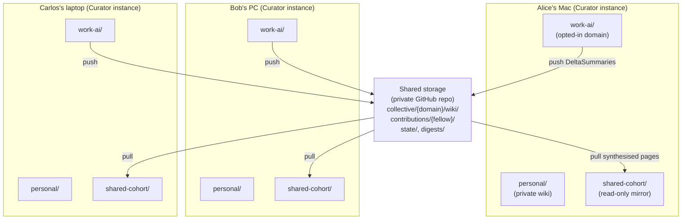
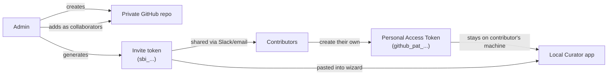
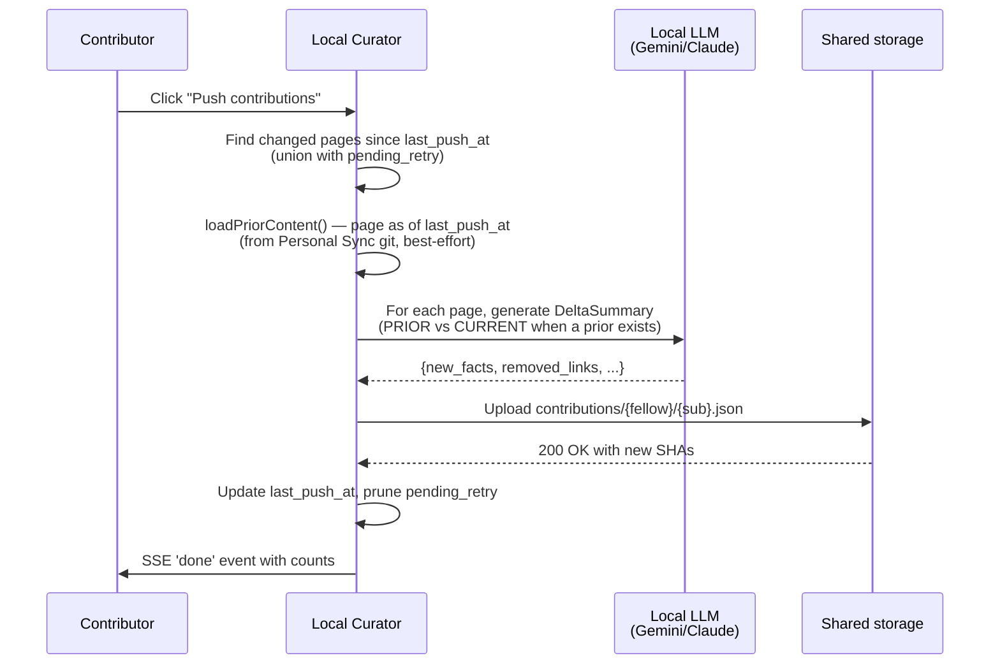
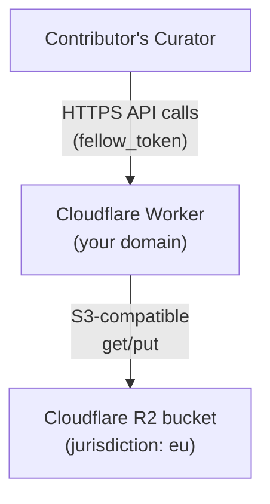

# Shared Brain — Concept & Architecture

**For**: anyone evaluating, deploying, or contributing to a Shared Brain. Explains what it is, how it works internally, the security model, the design decisions, and the v3.x+ roadmap.
**You probably want**: [User Guide](shared-brain-user-guide.md) for step-by-step instructions · [Admin Operations](shared-brain-admin.md) for advanced admin ops · [Compliance Reference](shared-brain-compliance.md) for GDPR / IP / EU residency.

---

## 1 — What it is

A **Shared Brain** is a **collective Curator wiki** that several people contribute to together — a cohort of students, a research team, a small company department. Each person keeps their own private Curator with their own private wiki. They additionally **opt one or more of their personal domains into the Shared Brain**. Those opted-in pages get pushed to a shared GitHub repository; the Curator pulls the synthesised collective wiki back to every contributor's machine as a read-only mirror domain.

You keep your private brain private. You only share what you choose. The collective wiki compounds with every contribution, and every contributor sees the same final pages.

**Why an LLM is required, and where it runs.** Mechanical file merge produces a bigger wiki. LLM synthesis produces a *better* wiki — resolving conflicting formulations, eliminating broken cross-fellow wikilinks, enriching sparse pages, attributing provenance. The LLM runs **locally on each contributor's machine** (using the Gemini Flash Lite key they already have configured for ingest), pre-processing their changed pages into compact `DeltaSummary` objects before pushing. The collective brain receives structured knowledge summaries — not raw wiki files.

**Status**: opt-in beta — introduced in v3.0.0-beta.1 and **still beta as of v3.17.2**. The wizard, the invite-token flow and every documented path are GitHub-only; a Cloudflare R2 backend is planned for a future release (see [Roadmap](#7--roadmap)). A `local` filesystem backend also exists and is reachable by hand-writing a connection — see [§3 Architecture](#3--architecture) for the licensing consequence. Since v3.6.1 invite tokens are GitHub-only at both ends: `/generate-invite` refuses to mint a non-GitHub token and `/parse-invite` refuses to accept one, so the `local` backend cannot be reached through an invite. Note: v3.1.0 — once pencilled in for Shared Brain GA — shipped as unrelated infrastructure work, and the releases since have gone to other subsystems, so the Shared Brain milestones below have shifted to later, not-yet-numbered releases (see [Roadmap](#7--roadmap)).

---

## 2 — How it relates to Personal Sync

Personal Sync (the existing feature in v2.x) and Shared Brain (new in v3.0.0-beta) solve different problems. You can use either, both, or neither.

| | Personal Sync (v2.x) | Shared Brain (v3.0.0-beta+) |
|---|---|---|
| Number of people | 1 — just you | Many — a cohort or team |
| What gets synced | Your **entire** wiki + chat history | Only **opted-in domains**; LLM-synthesised summaries, not raw drafts |
| Where it lives | Your **own** private GitHub repo | The cohort's **shared** private GitHub repo |
| Who can write | Just you | Every contributor pushes; synthesis merges |
| Direction | Bidirectional sync | Push (contribute) + Pull (mirror) — never both in one operation |
| Visible in Curator | Pages are part of your personal wiki | Pages appear as a separate `shared-<slug>/` domain in your local app |
| Required infrastructure | A private GitHub repo + your own PAT | A private GitHub repo + per-contributor PATs + an admin's PAT |

The two features are separate rail items: **Sync** covers Personal Sync only, and **Shared Brain** has its own view. (They shared one "Sync tab" in the old shell, which was deleted in v3.41.0.)

> **The `shared-` domain-name prefix is reserved (v3.43.0).** It always belonged to Shared Brain
> mirrors, and three places already refused to *contribute from* one — but domain CREATION did not
> refuse the name, so a user could own `shared-articles` outright. A pull computes its mirror slug
> as `shared-<shared_brain_slug>` from an **unsigned** invite token and then prunes every page the
> collective does not have, so a crafted invite could aim that prune at somebody's own wiki. Both
> halves are now closed: creating or renaming a domain into `shared-…` is refused with a clear
> message, and a pull REFUSES any existing domain whose `CLAUDE.md` does not carry the mirror
> marker it writes itself (`readonly: true` **and** `source: shared-brain`) rather than adopting it.

> **A read-only mirror never receives a chat transcript (v3.43.0).** You can chat with a mirror —
> that is most of what a mirror is for — but the conversation is held in the server's memory for
> the life of the process rather than written into a domain the app declares read-only. The reply
> carries `persisted: false`. Multi-turn context is preserved within a session; the thread does not
> survive a restart. Before v3.43.0 the first message wrote a real
> `shared-<slug>/conversations/<uuid>.json`.

---

## 3 — Architecture

### The three layers



**Layer 1 — Individual Curator instances** (local, sovereign). Each contributor's `personal/` and other private domains stay on their own machine. Only opted-in domains push to shared storage. The synthesised collective wiki comes back as a separate read-only mirror domain.

**Layer 2 — Shared Brain Storage** (pluggable adapter). An abstract `SharedBrainStorageAdapter` interface with concrete implementations. v3.0 ships `GitHubStorageAdapter`; a future release adds `CloudflareR2Adapter`. Layer 3 modules (push, pull, synthesize, revoke) talk only to the abstract interface — backend-agnostic.

**Layer 3 — Storage backends** (the actual durable storage).

### Storage layout (identical across all adapters)

```
collective/<domain>/wiki/entities/*.md
collective/<domain>/wiki/concepts/*.md
collective/<domain>/wiki/summaries/*.md
collective/<domain>/wiki/index.md, log.md
contributions/<fellow_id>/<submission_id>.json    ← raw contribution payloads
digests/<fellow_id>/latest.json                    ← per-fellow synthesis cache
meta/state/last-synthesis.json                     ← coordination state
state/revocations.jsonl                            ← audit log for revocations
```

### Module map (where to read the code)

| Module | Purpose |
|---|---|
| `src/brain/sharedbrain-storage.js` | Abstract `SharedBrainStorageAdapter` interface (15 methods) |
| `src/brain/sharedbrain-local-adapter.js` | `LocalFolderStorageAdapter` — a filesystem-backed brain. Primarily a battle-testing backend, but **it is reachable in production**: `storage_type: "local"` passes `validateConnection` and the factory instantiates it. The wizard never offers it, so reaching it means hand-writing a connection and POSTing it to `/save`. Note the licensing consequence: pointing `local_storage_path` at an NFS/SMB share is an on-premise deployment, which is **not** covered by the permanent GitHub-only grant in [`LICENSES/LICENSE-ENTERPRISE.txt`](../LICENSES/LICENSE-ENTERPRISE.txt) §3.1. |
| `src/brain/sharedbrain-github-adapter.js` | `GitHubStorageAdapter` (v3.0 production backend) |
| `src/brain/sharedbrain-storage-factory.js` | `createStorageAdapter(connection)` — dispatch by `storage_type` |
| `src/brain/sharedbrain-config.js` | `.sharedbrain-config.json` read/write with token masking |
| `src/brain/sharedbrain-delta.js` | Local-LLM `DeltaSummary` generation + Jaccard helper |
| `src/brain/sharedbrain.js` | `pushDomain` + `pullCollective` + `ensureSharedDomainExists` orchestration |
| `src/brain/sharedbrain-synthesis.js` | `runLocalSynthesis` — applies merge rules 1-5 |
| `src/brain/sharedbrain-revoke.js` | Article 17 revocation orchestration |
| `src/routes/sharedbrain.js` | HTTP endpoints under `/api/sharedbrain/*` (15 as of v3.6.x — the authoritative list is the `router.*` calls in that file; see [`api-reference.md`](api-reference.md)) |
| `mcp/util.js` → `refuseIfReadonly()` | Decision 7 readonly-mirror guard for MCP write tools |

---

## 4 — The two primitives — invite token vs PAT

This is the **single most important concept** to understand. Confusing these two is the source of most setup mistakes.

| | Invite token (`sbi_…`) | Personal Access Token (`github_pat_…`) |
|---|---|---|
| Created by | The admin, once at brain setup | **Each contributor, on their own** |
| What it contains | Metadata only: repo name, brain name, branch, folder slug, data-handling-terms | A GitHub credential — the contributor's identity for write access |
| Shared with | The whole cohort (Slack, email — it's public-ish) | NOBODY. Stays only on the contributor's machine. |
| Grants access? | **No.** The token is just a label that helps the wizard fill in the repo URL. | Yes — this IS the actual GitHub authentication |
| Number per cohort | 1 (the admin generates one and shares it) | N (one per contributor) |

### The trust model visualised



### Why each contributor needs their own PAT — not one shared token

If the admin shared one PAT with everyone:

| Bad outcome | Why |
|---|---|
| All contributions look like the admin wrote them | Provenance broken — Decision 6a defeated |
| Revoking one student means revoking ALL students | One PAT → one revoke button |
| One leaked PAT compromises the whole brain | All write access tied to one credential |
| Loses per-fellow-revocation, the core security guarantee | Decision 1 explicitly forbids this |

**Decision 1 (binding): per-fellow fine-grained PAT.** Each person, their own token. See [§5 Decision 1](#decision-1--pat-security-model) for the full reasoning.

### Invite token format

`sbi_<base64url-encoded JSON>` with `v: 1` versioning:

```json
{
  "v": 1,
  "storage_type": "github",
  "repo": "your-org/cohort-brain",
  "name": "Spring 2026 ML Cohort",
  "shared_domain": "work-ai",
  "branch": "main",
  "data_handling_terms": "contributor_retains"
}
```

- **`sbi_` prefix**: same shape as GitHub's `github_pat_` — signals "this is a Shared Brain Invite". Easy to grep for accidentally-pasted tokens in logs.
- **`base64url` not standard base64**: URL-safe so the token can be shared in a link without encoding issues.
- **`v: 1` first field**: future-proofing. v2+ might add new fields; older clients gracefully degrade.
- **No credentials inside**: passes any secret-scanning tool.

---

## 5 — Engineering decisions (binding)

These decisions were settled in Phase 1 of the Shared Brain rollout (2026-05-14) before any code was written. They remain binding on the implementation. Future changes require an explicit "Decision Revisions" section.

### Decision 1 — PAT security model

**Decision: Per-fellow fine-grained PAT with repo-level write access. No path-level scoping in v1.**

**Why:** Fine-grained PATs as of early 2026 scope to a repository and a permission category — they do NOT scope to a path within a repo. Per-fellow path scoping via PAT is therefore not implementable with PAT mechanics alone; it requires branch protection (paid plan) plus a synthesis bot, or a GitHub App with installation tokens. Both add infrastructure that's wrong for v1.

Per-fellow fine-grained PATs give the one critical security property — *per-fellow revocation* — without any new infrastructure. Compromise of one PAT lets that attacker corrupt the collective repo, but: (a) the org can revoke that single PAT independently, (b) git history is fully preserved for rollback, (c) this matches the realistic non-adversarial threat model (carelessness, not targeted attack).

**Branch protection mode + GitHub App mode are explicitly deferred** to future releases — high-security mode first, enterprise mode after.

**Read-only membership (v3.0.4):** a PAT created with **Contents: Read** only is a first-class tier. The wizard's yellow verdict allows Continue; the saved connection carries `read_only: true` (validated boolean), may have zero `local_domains`, renders with a "read-only member" pill and no Push button, and the push + synthesize routes refuse it with 400. Useful as the free/sample tier in monetised brains — see [`shared-brain-monetization.md`](shared-brain-monetization.md).

### Decision 2 — Cross-domain link contamination

**Decision: Strict domain-link filtering at delta-generation time.**

**Why:** Deterministic, requires no coordination, no central state. Cross-domain references survive in prose (as `new_facts` bullet text); only the *graph edge* is dropped. Synthesis can later re-link if the same entity becomes a collective page.

Implemented in `filterToDomainLinks(links, domainPageSlugs)` in `src/brain/sharedbrain-delta.js`. Builds a Set from `getAllPagePaths(wikiDir)` and intersects `new_links` and `removed_links` against it.

### Decision 3 — LLM pre-processing failure handling

**Decision: Partial push, with explicit `pending_retry` state.**

**Why:** A student hitting a Gemini quota mid-week should not block their whole cohort contribution. Partial push delivers what worked; failed pages retry next cycle.

Implementation:
- `.sharedbrain-config.json` connection gains `last_push_at` (set BEFORE push starts) + `pending_retry: { [queueKey]: attemptCount }`.
- **The queue key is `<domain>/<folder>/<file>.md` (v3.43.0), not the bare page path.** A connection may contribute from several domains, and two of them holding a page of the same name shared one strike counter and one skip entry. Worse, `pushDomain` wrote both fields as complete REPLACEMENTS while the push route loaded the connection once, so in a multi-domain push domain B's write erased domain A's queue — and because `last_push_at` had already advanced, those pages were treated as previously-contributed on the next push and DIFFED, so their whole body arrived as `stable_facts`, which nothing reads. Legacy unqualified keys are migrated on read, claimed only by a domain that actually holds that page. The push route now re-reads the connection per domain, pins the pre-run `last_push_at` as the scan baseline for every domain, and uses one clock for the run.
- `findChangedPages(wikiDir, sinceDate, pendingRetry)` returns the union of (mtime > sinceDate) ∪ (paths in `pending_retry`).
- A page that fails 3 consecutive times moves to `permanent_skip` and is surfaced in the UI. Recovery paths: edit-the-page (mtime > last_push_at un-skips automatically, v3.0.2) or the card's **Retry these pages** action → `POST /api/sharedbrain/:id/unskip` (v3.0.4), which clears entries + resets strike counters. Transient provider errors (503/429/network) never advance the strike counter.
- User-visible push result: `"Pushed 7 of 10 pages. 3 will retry next time."` Since v3.0.4 the card also shows the resting-state pieces: a `pending_pages` count (from `GET /list`, computed by `computePendingPages()` — same detection as push, read-only), the skipped-pages block, and `last_synthesis_at` (patched locally by the admin's synthesis run and learned from `state.last-synthesis` on every contributor Pull).

### Decision 4 — Conflict resolution

**Decision: Union merge by default; targeted LLM call only for heuristic-flagged contradictions. Unresolved contradictions marked with a Health-scannable marker.**

**Why:** Most contributions don't conflict. Same fact stated differently is the main "conflict" case — that's resolved by exact-string dedup or near-duplicate dedup. Genuine value-conflicts ("coined in 2024" vs "coined in 2023") are rare. Invoking the LLM only when needed keeps synthesis cost proportional to disagreement, not corpus size.

**Heuristic for contradiction candidates (no LLM call):**

```
For each pair (a, b) of incoming new_facts on the same page:
  - Normalise: lowercase, strip punctuation, drop stop-words
  - Tokenise into word sets
  - similarity = |A ∩ B| / |A ∪ B|   (Jaccard)
  - similarity == 1.0          → exact duplicate, drop one
  - 0.5 ≤ similarity < 1.0     → flag as candidate contradiction (goes to LLM)
  - similarity < 0.5           → independent facts, keep both
```

**Markup for unresolved contradictions** (when LLM picks `both`) — a **bullet inside `## Key Facts`**, not a section of its own:

```markdown
- ⚠️ CONFLICTING SOURCES — review needed:
  - Context Engineering coined in 2024 *(per a3f91234)*
  - Context Engineering coined in 2023 *(per b7c1abcd)*
```

The parenthesised id is the shortened fellow UUID (`defaultShortenId` — leading hex characters, per `PROVENANCE_UUID_DISPLAY_LEN`), with no prefix and never a name — including for contributors who opted into name attribution, which affects contribution payloads only (Decision 6a).

Implementation: pure-JS `jaccardSimilarity(textA, textB)` helper, no NLP libraries. **The Health scanner does NOT detect the marker** — `src/brain/health.js` has no conflict handling at all, and the constant's own comment ("Health-scannable in Phase 4+") is aspirational rather than a description of shipped behaviour. Discovery is therefore via the synthesis result, which since v3.0.4 carries an additive `conflict_pages: string[]` and names the affected pages in the summary, or by grepping the mirror for `CONFLICTING SOURCES`. The user resolves interactively by editing the upstream personal opted-in domain and re-pushing.

### Decision 5 — Domain isolation

**Decision: Strict siloing. No symlinks. Pulled collective brain appears as its own sibling domain `domains/shared-<slug>/`.**

**Why:** Symlinks introduce two unknowns: (1) Obsidian's symlink graph traversal behaviour varies, (2) `resolveInsideBase()` in `mcp/storage/local.js` follows symlinks — would need a careful audit to confirm no path-traversal escape. Strict siloing has none of these unknowns.

The user-visible cost is real but bounded: Obsidian shows two disconnected sub-graphs (personal vs. collective). The MCP `search_cross_domain` tool already provides the cross-graph reasoning surface from Claude — this *is* the right answer for cross-domain questions.

Cross-domain link syntax (`[[shared:work-ai:openai]]`) is a future roadmap item if user demand emerges.

### Decision 6 — GDPR / Data handling

**Decision: Privacy-first defaults with a contributor-controlled opt-in for name attribution; mandatory admin-only revoke endpoint; configurable IP modes; EU residency documented as a deployment caveat.**

Full detail in [`docs/shared-brain-compliance.md`](shared-brain-compliance.md). Summary:

#### 6a. Attribution — UUIDs on collective pages always; the real name only if you opt in

There are two different surfaces here and they have always behaved differently. Read both.

**Collective wiki pages: shortened UUID, always, no flag involved.** The `## Provenance` section
uses the shortened `fellow_id` — the leading hex characters of the UUID
(`PROVENANCE_UUID_DISPLAY_LEN` in `src/brain/sharedbrain-synthesis.js`). Conflict markers use the
same shortened id. **No code path has ever put a real name on a collective page**, and none does
now. Nothing in this section changes that.

**Contribution payloads: gated on `attribute_by_name` since v3.6.2.** Every push writes a payload to
`contributions/<fellow_id>/<submission>.json` in shared storage, readable by every collaborator on
the repo. That payload used to carry `fellow_display_name` — and each delta inside it a duplicate
`contributor_name` — **unconditionally, on every push, regardless of the wizard checkbox**, because
`attribute_by_name` had writers and no readers. Both routes are now gated by
`contributorNameForStorage()` in `src/brain/sharedbrain.js`:

| `attribute_by_name` | Contribution payload (`fellow_display_name`) | Each delta (`contributor_name`) |
|---|---|---|
| boolean `true` (you ticked the box) | carries your name | carries your name |
| boolean `false` (the default) | **key omitted entirely** | **key present, value `""`** |
| absent, `null`, or any non-boolean | **key omitted entirely** — fails closed | **key present, value `""`** — fails closed |

The two routes suppress the name equally; they differ in *how*, and the
difference is load-bearing rather than cosmetic. The contribution payload
**omits** the key (`sharedbrain.js` — `...(attributedName === null ? {} : {...})`),
because a stored `null` would still assert "there is a name field for this
contributor", and omission is what makes a byte-level search of the written file
provably clean. The per-page delta writes an **empty string** (`sharedbrain.js`
passes `attributedName === null ? '' : attributedName` and
`sharedbrain-delta.js` copies it into `delta.contributor_name` unconditionally),
because `generateDeltaSummary` hard-requires a string and would fail *every*
page on a non-string — turning a privacy default into a total push outage. So
the provably-clean-file property holds for the contribution payload only; the
delta carries an empty key. No name is written on either route.

The predicate is strict `=== true`, so a malformed value cannot attribute you by accident. In
particular the *string* `"false"` is truthy in JavaScript and would have leaked under a naive
truthiness test; it suppresses.

**Older connections do carry the key**, and the consequence runs the other way. `POST
/api/sharedbrain/save` has defaulted `attribute_by_name` to `false` when absent since the flag
was introduced (v3.0.0-beta.1), and both wizards have always sent it — so a connection saved
before v3.6.2 already holds a real boolean. A contributor who *left the box unticked* is
therefore suppressed the moment they update, with no migration and no re-save. But a contributor
who **ticked it** holds `true` on disk and keeps being attributed by name after upgrading, with
no re-consent prompt. That matches the box they ticked, which is why it is left alone — but it
means the upgrade is not a reset: anyone who wants to change the answer must leave the brain on that
machine and re-join (there is still no in-place toggle; see the compliance doc §1a).

Your `fellow_id` (UUID) and each delta's `contributor_id` are unaffected either way — this makes
contributions **pseudonymous, not unattributable**. The admin member directory falls back to the
short-ID label for anyone whose stored payloads carry **no** name — which is not the same set as
"anyone who has not opted in", because `groupMembers` reads every payload ever stored and
pre-v3.6.2 pushes wrote the name unconditionally. On a cohort that predates this release the
directory is unchanged by upgrading; see the paragraph below and the compliance doc §1.

**This is forward-looking only. There is no retroactive scrub.** Names written by pushes made
*before* v3.6.2 — or before you unticked the box — are still in shared storage, in every
contribution payload already committed there, and in that repository's git history. Updating the
app removes nothing that is already published. A contributor who wants past names removed must use
the revoke path (§6b), which erases their contributions entirely; there is no operation that
strips the name while keeping the contribution.

**`allow_name_attribution` is not implemented and is not planned.** The original design described a
second, admin-side cohort flag, so that name attribution required *both* the contributor's opt-in
and the admin's consent. It appears nowhere in the codebase. It has been dropped rather than built,
because in this architecture it could never be a real gate: contribution payloads are composed and
written by the **contributor's own client**, so an admin-side flag can only ever be advisory —
presenting it as a second gate would promise an enforcement that does not exist. The contributor's
own opt-in is the gate, and it is now real.

#### 6b. Right to erasure (Article 17)

Mandatory v1 mechanism: `POST /api/sharedbrain/:id/revoke` with admin token + literal confirmation string. Operations: delete contributions → delete digest → scan + delete provenance-tainted collective pages → re-synthesize from remaining contributions → append `state/revocations.jsonl` audit entry. **Irreversible.** See [`docs/shared-brain-admin.md` §3](shared-brain-admin.md#3--revoking-a-contributor-article-17) and [`docs/shared-brain-compliance.md` §2](shared-brain-compliance.md#2--right-to-erasure-gdpr-article-17).

#### 6c. Enterprise IP modes

`data_handling_terms` field on the shared brain's admin config (encoded in the invite token so contributors' wizards see the matching consent):
- `"contributor_retains"` (default) — for educational cohorts; contributors keep copyright, organisation owns synthesised output.
- `"organisational"` — for enterprise with employment IP-transfer; contributors assign copyright at contribution time.

The wizard's consent checkbox text is rewritten accordingly. Locked once the admin shares the invite token.

#### 6d. EU data residency

**There is no EU-resident deployment today.** The shipped adapter hardcodes `const GITHUB_API = 'https://api.github.com'` with no configurable endpoint, so it cannot reach GitHub Enterprise Cloud with data residency, nor GitHub Enterprise Server. Buying the EU residency add-on does not make Shared Brain work with it.

- **GitHub** (shipped): every working Shared Brain stores its data in the United States, on every account plan, because `api.github.com` is the only host the adapter can talk to.
- **Cloudflare R2** (future release): supports per-bucket jurisdiction tagging — `jurisdiction = "eu"` in Wrangler config. This is the intended EU answer and it has not shipped.

Full detail and the disclosure obligation in [`docs/shared-brain-compliance.md` §4](shared-brain-compliance.md#4--eu-data-residency).

### Decision 7 — MCP write-tool guard on shared-* domains

**Decision: MCP write tools (`compile_to_wiki`, `fix_wiki_issue`, etc.) refuse to write to domains where the `CLAUDE.md` frontmatter declares `readonly: true`. Contributions to a Shared Brain flow through the user's personal opted-in domain, not direct writes to the mirror.**

**Why:** Without this guard, Claude (via MCP) could compile findings directly into `domains/shared-X/`. Those writes would (a) not propagate to other contributors (no push path from a mirror domain) and (b) be silently overwritten on next pull. The contribution model only works if writes originate from the personal opted-in domain.

Implementation: `ensureSharedDomainExists()` writes `domains/shared-<slug>/CLAUDE.md` with `readonly: true` frontmatter. New helper `isDomainReadonly(domain)` in `src/brain/files.js`. The MCP `refuseIfReadonly()` chokepoint in `mcp/util.js` is called from every mutating tool — it refuses with a structured error pointing the user back to their personal opted-in domain. **That call *is* the definition of a mutator here, so enumerate the `refuseIfReadonly` call sites across `mcp/tools/**` rather than trusting a count written down anywhere** — the set has grown (most recently when `save_working_state` joined it) and a stale number in prose is what stops the next reviewer looking. Any new tool that writes user data MUST add the call.

**Extended in v3.0.2:** the same contract is now enforced by the app's own write surfaces, not just the MCP — the ingest route, the compile route, and six mutating Health endpoints (`/fix`, `/fix-all`, `/fix-all-safe`, `/broken-links/apply`, `/orphans/apply`, `/semantic-dupes/merge-batch` — everything that edits wiki *pages*) refuse read-only mirrors with the same steer message; the Ingest tab's domain dropdown excludes mirrors; and `validateConnection` + `pushDomain` reserve the `shared-*` namespace so a mirror can never be registered as a *contributing* domain (which would create a pull→push feedback loop).

**Gap closed:** `POST /api/health/:domain/dismiss` and `/undismiss` were once ungated while their MCP equivalents were guarded, so the two surfaces disagreed and a mirror was not strictly read-only on disk (they write `.health-dismissed.jsonl` inside the mirror's own `wiki/` directory). Both routes now call `assertWritableDomain` in `src/routes/health.js`, matching `dismiss_wiki_issue` / `undismiss_wiki_issue` in `mcp/tools/dismissed.js`. The app and the MCP now refuse a mirror identically for dismissals as well as for page edits.

The Claude skill (`skills/my-curator/SKILL.md` §3.1) documents this read/write contract from Claude's perspective so it knows where to compile when the user says "save this to the shared brain".

### Deferred (no decision needed for v1)

| Topic | Resolution |
|---|---|
| Deletion propagation | **Resolved for mirrors in v3.0.3** — Pull is now replace-semantics + prunes pages deleted from the collective, so revocations and conflict resolutions propagate to every contributor's mirror on their next pull. Deletion propagation for *contributions* (a fellow deleting a page in their personal domain removing it from the collective) remains deferred to a future release. |
| Corpus scale ceiling | **Partially addressed in v3.0.3.** GitHub tree-truncation (~100k files) is now REFUSED loudly instead of silently missing files; synthesis warns when a page exceeds 500 accumulated facts (approaching the 1 MB file cap). Contribution pruning/archival (the long-term fix — contributions accumulate forever because revoke rebuilds from them) is deferred until digests are wired as the per-fellow rebuild source. |
| Worker vs Node code sharing | **Deferred.** When the Cloudflare R2 adapter ships, synthesis pipeline will be written in dependency-free JS that bundles cleanly for both targets. |
| Digests (`digests/<fellow>/latest.json`) | **Deferred, documented (v3.0.3 evaluation):** the digest adapter methods exist but nothing writes or reads digests today — revoke's digest-delete step is a no-op on every real deployment. Wiring them up (per-fellow accumulated state) is the prerequisite for contribution pruning and cheaper revoke rebuilds. |

---

## 6 — Data flow

### Push (every contributor)



Per Decision 3, partial pushes succeed: failed pages enter `pending_retry` and retry next cycle.

#### Deltas are true diffs when a prior version is available

`loadPriorContent(domainsDir, domain, pagePath, sinceDate)` reads the page as it
stood at `last_push_at` out of the **Personal Sync** git repo (`.knowledge-git`).
When it finds one, `buildDeltaPrompt` switches from the "brand new page" framing
to a `PRIOR VERSION` / `CURRENT VERSION` diff, and the model extracts only what
actually changed. This matters because synthesis consumes `new_facts` and
nothing else — `stable_facts` is generated and stored but never read — so
without a prior version every push re-submits the whole page as new facts, which
the collective then has to dedup on every synthesis cycle.

Four things worth knowing about the behaviour:

- **Personal Sync is optional, and so is this.** A contributor who has never set
  up Personal Sync has no `.knowledge-git`, so there is no prior version to read
  and every page is contributed in full. That is correct, just more verbose.
- **The watermark is approximate, in the safe direction.** `last_push_at` is the
  *Shared Brain* watermark; git only knows *Personal Sync* commit times. If a
  contributor has not synced in a week, the prior version is a week old and the
  delta is correspondingly larger. It can never be *newer* than the watermark,
  so the diff can overlap but never leave a gap, and the collective's
  exact-string dedup absorbs any overlap.
- **Retried pages are never diffed.** A page in `pending_retry` or
  `permanent_skip` failed its previous push, so none of its body ever reached the
  collective. Diffing it would contribute only the change since that failed push
  and silently drop everything else. Those pages are deliberately treated as new.
- **It costs more input tokens per push.** The prompt grows by exactly the byte
  length of the prior version — measured at **+69.5%** across a 25-page sample of
  real changed pages (+29% to +92% per page). The return is a smaller, less
  redundant contribution and less downstream synthesis work, not a cheaper push.

> **Implementation note.** The git pathspec is **work-tree-relative** —
> `<domain>/wiki/<folder>/<page>.md`, with **no** `domains/` prefix — because
> Personal Sync runs git with `--work-tree=<domains dir>`. This function shipped
> with a `domains/` prefix from v2.7.0 and therefore returned `null` on every
> call, so every delta up to that point was generated as if the page were brand
> new. The regression guard is in `scripts/test-sharedbrain-push.js` §11.

### Pull (every contributor)

`pullCollective(connection)` lists every page in `collective/<domain>/wiki/` via the adapter's `listPages()`, then for each: `resolveInsideBase()` security check, then writes via existing `writePage(shared-<X>, path, content, { replace: true })` — re-uses the ingest write pipeline (dedup, frontmatter, backlinks, all automatic via v2.5.5+ machinery).

**Pull is a REPLACE, not a merge (v3.0.3+).** The `{ replace: true }` flag skips the union merge; every other stage of `writePage` is unchanged. This is what makes the mirror a true mirror: a fact removed upstream by conflict resolution or GDPR revocation actually disappears locally instead of being resurrected on every pull. It also means local hand-edits to a mirror page are overwritten — which is the point, and why mirrors are marked `readonly: true`.

Pull additionally **prunes** local `.md` files in the three canonical folders that the collective no longer has, so deleted pages propagate. That prune is **gated on the pull having processed every remote page** — if any page was skipped (read error, unwritable path), the cleanup is deliberately skipped and the pull warns *"N page(s) could not be processed this pull — skipping stale-page cleanup to be safe."* Erasure propagation therefore depends on a clean pull; a contributor who sees that warning still holds the deleted pages. `index.md`, `log.md` and dot-files (e.g. `.health-dismissed.jsonl`) are never pruned, and the empty-collective early return means a transient empty listing cannot wipe a mirror.

### Synthesize (admin)

Triggered weekly or on admin demand. Per Decision 4, applies rules 1-5:

- **Rule 1** — Union new_facts; exact-string dedup
- **Rule 2** — Union/subtract links per spec (Decision 2 filter enforces same-domain only)
- **Rule 3** — Jaccard heuristic flags near-duplicate facts; targeted LLM resolves each
- **Rule 4** — Provenance section auto-appended with shortened contributor UUIDs (always, on every collective page, with no flag involved — the `attribute_by_name` opt-in gates the *contribution payload*, never a wiki page; see Decision 6a)
- **Rule 5** — Collective `index.md` rebuilt

Runs locally on admin's machine. Collective storage just receives the written pages — no cloud compute.

**Processed-submission tracking (v3.0.3).** `meta/state/last-synthesis.json` carries a `watermark` (the max `contributed_at` across fully-processed submissions — derived from the contributions' own stamps, never the admin's clock) plus a window-bounded `processed_ids` list. Contributions are listed from `watermark − 24h` and deduplicated by ID, so clock skew between machines and pushes landing mid-synthesis can no longer silently skip anyone. A submission is marked processed **only when every page it touches wrote successfully** — failed pages leave their submissions queued for the next run instead of being consumed.

**Trust boundary (v3.0.3).** Synthesis treats stored contribution payloads as hostile input: non-string facts are dropped, newlines in facts/titles are flattened (blocks forged `## Provenance` sections and section-truncation attacks), link slugs are shape-validated, contributor identity comes from the storage path (not the payload's `fellow_id` field), and contributions targeting a different shared domain are skipped. One malformed contribution degrades to a per-page warning — it can no longer abort (or permanently brick) synthesis.

### Revoke (admin, GDPR Article 17)

Per Decision 6b:
1. Delete all `contributions/<fellow_id>/*.json`
2. Delete `digests/<fellow_id>/latest.json`
3. Scan all collective pages; delete any whose Provenance section references the revoked fellow
4. Reset `meta/state/last-synthesis.json` to the full v3.0.3 zero-state (`watermark: null`, `processed_ids: []`)
5. Re-run synthesis from scratch (rebuilds remaining pages, leaves zero-contributor pages deleted). v3.0.6: the rebuild receives the reset state **directly** (`stateOverride`) instead of re-reading the meta it just wrote — the Phase-5 live revoke E2E caught GitHub's read-after-write lag serving the STALE pre-reset state, which made the rebuild dedup every surviving contribution and "successfully" rebuild nothing.
6. Append entry to `state/revocations.jsonl` (UUID + timestamp + sha256-hashed admin token + counts; NO PII)

Irreversible. Documented prominently in admin guide and compliance reference.

**Write-concurrency note (v3.0.6):** the GitHub adapter's SHA-conflict retry defaults to **3 attempts with a growing backoff** (was 1 immediate retry). The Phase-5 live concurrency test showed that two writers CREATING the same new file race GitHub's eventual consistency: the loser's refetch can miss the winner's just-committed blob, so a single immediate retry re-sent the same sha-less PUT and threw. Concurrent same-page/meta writes are last-writer-wins by design (Decision: L19), but they must never throw or corrupt — verified live in `test-sharedbrain-github-live.js` §6b.

---

## 7 — Roadmap

### v3.0.0-beta.1 — GitHub-backed Shared Brains

- One storage backend: GitHub via REST API with fine-grained PATs
- Contributor + admin wizard with invite-token UX
- Push / Pull / Synthesize / Revoke (API-only revoke)
- MCP guard refuses direct writes to `shared-*` mirrors
- Compliance documentation

### v3.0.2 – v3.0.5 — production hardening (shipped)

- v3.0.2/v3.0.3: data-integrity + trust-boundary hardening (processed-submission tracking, fellow-payload sanitization, true-mirror pulls, truncation refusal, revocation marker — see the CLAUDE.md release history for the full lists)
- v3.0.4: UI/UX upgrade — wizard fixes, per-connection in-flight registry, invisible state surfaced (pending pages, last synthesis, skipped-pages retry, conflict pages, rate-limit warnings), first-class **read-only membership**, wizard accessibility
- v3.0.5: admin features — **admin-token provisioning** (shown once at brain setup; rotate from the card), **member directory** (`GET /:id/members`), **Revoke UI** on the connection card (member picker + typed confirmation + SSE progress), invite-token re-display, synthesis confirm step

### Shared Brain GA (planned; version number TBD)

> **Note:** this milestone was originally planned for v3.1.0. That version number has since shipped as unrelated infrastructure work (Track 1 Foundation — see the CLAUDE.md changelog), so Shared Brain GA and everything below it will land in a later, not-yet-numbered release.

- Production test program complete. Most of it shipped in v3.0.6 and is wired into the test runner — revoke E2E against a real GitHub repo, real-LLM delta and conflict-resolution prompts on every configured provider, concurrent-writer races, the offline scenario suite, and CI wiring (see the `test-sharedbrain-*` suites and their offline/live classification in `scripts/run-tests.js`). Outstanding: the Playwright wizard pass, which is run per release rather than committed, since a Playwright devDependency would be installed on every **source-install** machine by the auto-updater, which runs `npm install`. (A packaged-app user would never receive it — that build has `canRunNpmInstall: false` and updates by replacing the application — but the source install is the one that has to be protected, and it is the majority.)
- Structured beta pilot with a real cohort — **the remaining GA gate**, and the one that has not started
- More worked examples in the user guide

### Cloudflare R2-backed Shared Brains (planned, after GA)

Adds a second storage backend designed for organisations that want EU data residency, custom domain endpoints, or zero-egress-cost reads.



Compared with GitHub mode:

| | GitHub (v3.0) | Cloudflare R2 (future release) |
|---|---|---|
| Storage backend | GitHub repo | R2 bucket |
| Authentication | Fine-grained PAT per contributor | Per-fellow token issued by the Worker |
| EU residency | Requires Enterprise Cloud | Single config flag (`jurisdiction = "eu"`) |
| Custom domain | github.com/owner/repo | brain.your-org.com |
| Self-hosting effort | Zero (use GitHub directly) | Modest (deploy Worker + bucket) |
| Best for | Cohorts, research groups, small orgs | Organisations with privacy/residency requirements |

The Cloudflare R2 path requires deploying a small Cloudflare Worker (we'll ship the Wrangler config and Worker source code). Once deployed, contributors paste the Worker's URL + their fellow_token instead of a GitHub repo + PAT. Otherwise the wizard is identical.

Also planned for a future release: deletion propagation (currently a known limitation) and `[[shared:work-ai:openai]]` cross-domain link syntax if user demand emerges.

### Enterprise mode (further out; version number TBD)

- GitHub App installations instead of per-fellow PATs (eliminates per-user PAT creation)
- Path-level permissions (contributors can only write to their assigned sub-folders)
- SSO integration (SAML/SCIM)
- Audit log export to external SIEM (Splunk, Datadog, etc.)

This requires either a hosted GitHub App or organisation-managed installations. Best fit for compliance-heavy enterprise deployments.

### Beyond that

- **Branch-per-cohort mode** — single repo serving multiple parallel cohorts (course sections, research subgroups) with branch-protected writes.
- **Diff history UI** — visualise what changed in the collective wiki between synthesis runs.
- **Roll-up dashboards** — admin sees contribution velocity, conflict-marker counts, orphan rates per cohort.
- **Synthesis automation** — scheduled / triggered automatic synthesis without manual admin click.

None of these are committed; they're items in the backlog we'd evaluate after v3.x has real cohort deployments to learn from.

---

## 8 — Source-of-truth map

| Document | Purpose | Mutability |
|---|---|---|
| `docs/shared-brain.md` (this doc) | Concept + architecture + decisions | Append-only between releases; decisions revisable only with explicit user agreement in a "Decision Revisions" section |
| [`docs/shared-brain-user-guide.md`](shared-brain-user-guide.md) | Step-by-step user guide for contributors + admins (setup, daily workflow, troubleshooting) | Lives forever, updated each release |
| [`docs/shared-brain-admin.md`](shared-brain-admin.md) | Advanced admin operations (synthesis cadence, revocation, contributor management, admin-token security) | Lives forever |
| [`docs/shared-brain-compliance.md`](shared-brain-compliance.md) | GDPR / IP / EU residency reference for organisations evaluating deployment | Lives forever, updated when compliance posture changes |
| `CLAUDE.md` | Per-version history entries — engineering notes per release | Append-only |

---

## 9 — Quick links to operational guides

- **I want to join a Shared Brain** → [`docs/shared-brain-user-guide.md` §2](shared-brain-user-guide.md#2--contributor-setup-join-an-existing-shared-brain)
- **I want to start a Shared Brain** → [`docs/shared-brain-user-guide.md` §3](shared-brain-user-guide.md#3--admin-setup-start-a-new-shared-brain)
- **Daily workflow** → [`docs/shared-brain-user-guide.md` §4](shared-brain-user-guide.md#4--daily-workflow)
- **Something broke** → [`docs/shared-brain-user-guide.md` §5](shared-brain-user-guide.md#5--troubleshooting)
- **I'm an admin and need to run synthesis / revoke someone** → [`docs/shared-brain-admin.md`](shared-brain-admin.md)
- **My org is evaluating compliance** → [`docs/shared-brain-compliance.md`](shared-brain-compliance.md)
