# User Guide — The Curator

This guide covers everything from first-time setup to daily use. No technical background is required.

---

## Table of contents

1. [What is this app?](#1-what-is-this-app)
1c. [Nothing here is locked to one AI, one tool, or one company](#1c-nothing-here-is-locked-to-one-ai-one-tool-or-one-company)
2. [What you need before you start](#2-what-you-need-before-you-start)
3. [Installation](#3-installation)
3b. [The Mac app and the browser install](#3b-the-mac-app-and-the-browser-install)
4. [Get your API key (Gemini, Claude or OpenRouter)](#4-get-your-api-key-gemini-claude-or-openrouter)
5. [First run — the Getting started panel](#5-first-run--the-getting-started-panel)
6. [Starting and quitting](#6-starting-and-quitting)
6b. [The menu bar icon (Mac app)](#6b-the-menu-bar-icon-mac-app)
7. [Finding your way around](#7-finding-your-way-around)
8. [Ingest a source](#8-ingest-a-source)
9. [Chat with your brain](#9-chat-with-your-brain)
10. [Manage your domains](#10-manage-your-domains)
11. [Read a wiki page](#11-read-a-wiki-page)
12. [See your knowledge graph in Obsidian](#12-see-your-knowledge-graph-in-obsidian)
13. [Three ways to talk to your knowledge (Chat · Obsidian · MCP)](#13-three-ways-to-talk-to-your-knowledge-chat--obsidian--mcp)
13b. [Working state — carrying context between sessions](#13b-working-state--carrying-context-between-sessions)
14. [Daily workflow](#14-daily-workflow)
15. [Sync across computers (Personal Sync)](#15-sync-across-computers)
15b. [Shared Brain](#15b-shared-brain)
16. [Settings](#16-settings)
16b. [Choosing your AI model](#16b-choosing-your-ai-model)
17. [Wiki Health](#17-wiki-health)
18. [Troubleshooting](#18-troubleshooting)
19. [API keys, cost & free tier (read this before serious use)](#19-api-keys-cost--free-tier)
20. [Install with a coding agent (Claude Code, Cursor, Augment, Cline)](#20-install-with-a-coding-agent)
21. [Further reading](#21-further-reading)

---

## 1. What is this app?

The Curator is a local, AI-powered knowledge curation system. You feed it documents — articles, PDFs, notes — and it:

- Automatically **atomizes** them into three network components: *Entities* (people, tools, companies), *Concepts* (ideas, techniques, frameworks), and *Summaries* (source narratives that connect them)
- Builds a **compounding wiki** of interlinked pages — unlike RAG systems that re-derive knowledge on every query, The Curator writes persistent pages that grow richer with every source you add
- Lets you have a **multi-turn AI conversation** with your knowledge base, with cited answers and conversations that are saved and travel with your sync
- Produces a **visual knowledge graph** you can explore in Obsidian, with auto-colored nodes by type

The big idea: instead of one giant notebook where everything gets lost, you have **separate, focused wikis per topic** (e.g. AI/Tech, Business, Personal Growth). Each one compounds with every source you add. You are the curator; the AI is the diligent librarian.

### The three layers, and the one rule that separates them

The Curator stores three different kinds of thing. They look similar — all markdown, all in your domain folder — but **two of them accumulate and one of them supersedes**, and mixing that up is the single most important thing to understand.

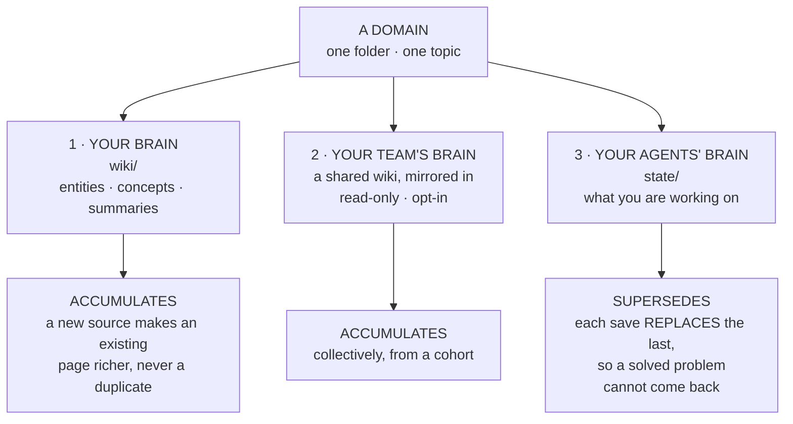

**Why the third one is different.** Knowledge is additive: everything you learn about a topic is worth keeping. Working state is not — "blocked on the login bug" stops being true the moment you fix it, and a store that merely *added* the fix would leave the stale blocker sitting there beside it. So each save of your working state replaces the one before it. Knowledge grows; state is current or it is worthless.

The middle layer is off unless you turn it on, and only the domains you explicitly opt in ever leave your machine.

> 📖 **For the long-form story** of why a second brain matters and how the parts of The Curator fit together philosophically, read **[Knowledge Immortality — Building a Second Brain with The Curator](../research/articles/knowledge-immortality-second-brain.md)**. It's a 15-minute essay covering the Karpathy spark, what markdown gives you, every section of the app in plain language, and the case for *compounding* knowledge. Recommended before you start ingesting.

---

## 1b. Who this is for

The Curator is domain-agnostic. Here are the main profiles who benefit from it:

**Content Creators (Writers, Podcasters, YouTubers)**
You consume hundreds of articles, books, and podcasts, but face a blank page when it's time to create. Ingest all your research — the Curator builds a content assembly line. The graph shows which themes you naturally gravitate toward; clicking an entity shows every source you've read about it.

**Researchers & Academics**
Batch-upload 20+ PDFs on a topic. The Curator extracts all distinct methodologies and authors. Use the graph's visual "Idea Collisions" to identify gaps in the literature — intersections between concepts that no existing paper has yet addressed. The chat synthesises findings across all papers with source citations.

**Executives & Strategists**
Upload reports, competitor analyses, and meeting transcripts. Build an intelligence layer where the most-referenced nodes grow largest, giving you a visual heat map of your knowledge. Query for synthesised strategic answers that bypass recency bias.

**Software Architects & Development Teams**
Ingest architecture decision records, API specs, and post-mortems. New team members can ask *"Why did we choose X over Y?"* and get an answer cited directly from a document written years ago. The Curator becomes a conversational Senior Engineer that never leaves.

**Medical & Scientific Researchers**
Drop in clinical trial PDFs and papers. The graph reveals hidden intersections — a compound used in one domain showing efficacy in another study — by visually bridging entity nodes across your entire literature corpus.

**Entrepreneurs & Startup Founders**
Feed it customer interview transcripts, investor updates, and market research. Query for synthesised strategic answers grounded entirely in your own collected intelligence, not generic AI output.

**Personal Growth & Self-Analysis**
Ingest journal entries, book highlights, and podcast notes. Query recurring patterns across months of writing. The Curator provides the objectivity of a third party on your own thinking.

→ See [docs/use-cases.md](use-cases.md) for detailed workflows for each profile.

---

## 1c. Nothing here is locked to one AI, one tool, or one company

The Curator is deliberately **harness-, agent- and LLM-agnostic**. Portability is not a side benefit; it is the point. Your accumulated context should never be trapped inside whichever assistant you happened to use last year.

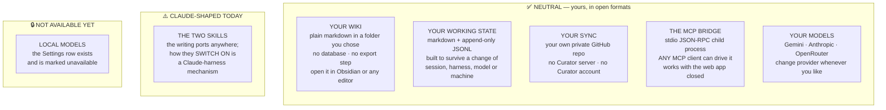

**What that buys you, concretely:**

| If you… | You are not blocked, because… |
|---|---|
| Switch from one AI assistant to another | The bridge is a **protocol**, not an integration. Any MCP client can spawn it and read your wiki and working state. |
| Stop using The Curator entirely | Your knowledge is markdown files in your own folder. Nothing to export; they're already readable. |
| Change AI provider | Three providers ship today, and swapping is a Settings choice. Your wiki doesn't care which one wrote it. |
| Work across several machines | Sync is your own private GitHub repository. No account with us, and nothing of yours passes through us. |
| Move a coding session to a different tool | Working state is plain markdown and JSONL, designed for exactly that move. |

**And what is *not* yet neutral — said plainly, because an overclaim would be worse than the gap:**

- **The two Claude skills are portable in content but Claude-shaped in activation.** Their text is ordinary prose with no vendor-specific logic, so it works anywhere you can paste it. What is Claude-specific is how they *switch on*: the tool-permission header uses Claude's tool-naming convention, automatic triggering from a description is a Claude Code / Claude Desktop mechanism, and the documented install location is Claude's skills folder. Elsewhere, you paste the body into whatever your harness loads at the start of a session.
- **The practical consequence.** An agent in another harness can **read** working state through MCP without any trouble — that half is pure protocol. What it is missing is anything telling it to **save**. The store is portable; the discipline that fills it is not yet.
- **The neutral form is generated, never hand-copied.** A second, hand-maintained copy of a long playbook would be the worst possible place for two documents to drift apart, because these files are read by *models* — two copies would not merely disagree, they would instruct two agents to behave differently. So the neutral version is **derived** from the same single source: the same prose, with the Claude-specific activation header stripped and the tool names de-prefixed.
- **Local models are not available today.** The provider row is visible in Settings and marked unavailable. The OpenRouter connection speaks an OpenAI-*compatible* protocol — that is the name of a wire format, **not** OpenAI support — which is the groundwork that makes local runtimes a natural later addition rather than a rewrite. When it ships, this guide will say so.

> A note on skill portability: an open format existing is not the same as other tools implementing it. Treat loading these skills elsewhere as something you may need to do by hand.

---

## 2. What you need before you start

| Requirement | What it is | Where to get it |
|-------------|-----------|-----------------|
| A computer running macOS, Windows, or Linux | See the platform notes below | — |
| An AI provider API key | Powers ingest, chat, and AI-assisted Wiki Health | [Google Gemini](https://aistudio.google.com/app/apikey) (free tier exists, paid is very cheap) **or** [Anthropic Claude](https://console.anthropic.com/) (paid only) |
| Obsidian (optional) | Visualises the knowledge graph | Free at [obsidian.md](https://obsidian.md) |
| Node.js 18+ | Runtime that powers the local server | **Not needed for the Mac app** — it ships with its own. For the browser install: auto-installed on Mac by the one-line installer; on Windows/Linux install manually from [nodejs.org](https://nodejs.org) |

### Two ways to run it — and they are the same program

There is now a **Mac app** as well as the original **browser install**. They are not two products and not a fork: one codebase, one release, two shells. The Mac app is a window wrapped around the identical server the browser install runs, so **every screen in this guide looks the same in both**.

Exactly four things genuinely differ — how it launches, how it updates, where its data lives, and how it starts the MCP bridge. Each is called out where it comes up, and there is a summary in [§3b](#3b-the-mac-app-and-the-browser-install).

| | **The Mac app** | **The browser install** |
|---|---|---|
| What you get | A `.dmg` you drag to Applications | A folder on your disk running a local server |
| Platforms | macOS only | macOS, Windows, Linux |
| Node.js | Bundled — nothing to install | You install it |
| Where the UI appears | Its own window, with its own title bar | A tab at `http://localhost:3333` |
| Updating | **The app installs its own updates** from **Settings**, or the **The Curator → Check for Updates…** menu — which since v3.41.0 opens its own small progress window | Applied in place from **Settings**, or `git pull` |
| Your data lives in | `~/Library/Application Support/The Curator/` | Your install folder (default `~/the-curator/`) |
| Status today | **Preview.** No Apple identity yet, so macOS asks you to allow it once — on the **first** install only | Mature, fully supported, and **not** being retired |

### Platform support

| Platform | Mac app (`.dmg`) | One-line installer | Manual `npm install` |
|---|---|---|---|
| **macOS** | ✅ Preview — see [§3](#the-mac-app-macos-only) | ✅ Recommended | ✅ Works |
| **Linux** | ❌ | ❌ — script checks for Darwin | ✅ Works (`node src/server.js`) |
| **Windows** | ❌ | ❌ | ✅ Works (PowerShell or WSL2; set `CURATOR_NO_OPEN=1`) |

> The one-line installer is macOS-only because it builds a `.app` Dock launcher. The Curator's *core* (Express + Node) is fully cross-platform — Windows and Linux users clone the repo and run `node src/server.js` directly. One button in the UI is macOS-only: the **Choose folder** picker in Settings → Knowledge base. On Linux and Windows, set your knowledge folder with the `DOMAINS_PATH` environment variable instead. Everything else — ingest, chat, wiki, MCP, sync, Health — works identically on every platform.

> **Don't have a coding agent?** A Claude-Code-style CLI agent can do the install on any platform for you — see [§20 Install with a coding agent](#20-install-with-a-coding-agent).

---

## 3. Installation

### The Mac app (macOS only)

A packaged macOS application is published on the project's
[**Releases page**](https://github.com/talirezun/the-curator/releases). Download the
`.dmg` that matches your Mac — the file names say which is which (Apple Silicon for
M-series Macs, Intel for older ones) — open it, and drag **The Curator** into
**Applications**.

> ⚠️ **It is a preview, and it carries no Apple developer identity yet.** The app is
> **ad-hoc signed** — its contents are sealed, so macOS can tell it has not been
> tampered with, but there is no certificate behind that seal and it is not
> notarized, so macOS cannot tell you *who* built it. An Apple Developer enrolment is
> in progress. Until it completes, macOS **refuses to open the app the first time**.
> That is expected, not a fault, and you allow it once:
>
> 1. Open the app. macOS says it cannot verify the developer — click **Done**.
> 2. Go to **System Settings → Privacy & Security**, scroll down to **Security**, and
>    click **Open Anyway** next to the message about The Curator.
> 3. Confirm. It opens normally from then on.
>
> Don't leave a long gap between steps 1 and 2 — that button only appears for a while
> after a blocked launch. On macOS Ventura and Sonoma (13–14) the older right-click →
> **Open** → **Open** still works. On Sequoia (15) and later it does not.
>
> **What is actually known here:** the app's signature state has been checked with
> Apple's own `syspolicy_check`, which reports exactly one remaining problem —
> notarization. Nobody has yet launched a quarantined copy of a current build to
> watch which dialog macOS puts up, so the three steps above are inferred from that
> signature state rather than observed. If you see something different, that is worth
> [reporting](https://github.com/talirezun/the-curator/issues).
>
> **If macOS instead says the app *"is damaged and can't be opened"*** and offers no
> **Open Anyway** at all, you have a build from `v3.30.0` or earlier. Those shipped
> with a *broken* signature, which is a different and worse Gatekeeper class. Download
> a build from `v3.31.0` or later.
>
> The Intel build is produced by the same automated build but **has never been run on
> Intel hardware** — there is no Intel Mac to run it on. If you are on an Intel Mac,
> anything odd is worth reporting.

The app **does not need Node.js** and does not need the Terminal. It keeps its data in
`~/Library/Application Support/The Curator/`.

**You only need the Releases page for the first install.** After that the app updates
itself — [§16 → Version and updates](#version-and-updates).

**Already using the browser install?** Nothing is converted and nothing is moved — see
[§3b → Moving an existing wiki into the app](#moving-an-existing-wiki-into-the-app).

### One-command installer (recommended)

Open **Terminal** (search for it in Spotlight) and paste this single command:

```bash
curl -fsSL https://raw.githubusercontent.com/talirezun/the-curator/main/install.sh | bash
```

The installer handles everything automatically:

1. Detects whether Node.js and git are installed — installs them if missing
2. Downloads the project into `~/the-curator`
3. Installs all dependencies
4. Builds **The Curator.app** for your Dock

When it finishes, the app opens automatically in your browser. A **Getting started** panel appears in the corner on first launch and walks you through the three things that have to happen before the app is useful: add an API key, create your first domain, ingest your first source. It doesn't block anything — see [§5](#5-first-run--the-getting-started-panel).

> ⚠️ **Pin The Curator to your Dock manually.** The installer puts **The Curator.app** inside `~/the-curator/` but does **not** add it to your Dock automatically. Open Finder → `~/the-curator/` → drag **The Curator** icon down into your Dock. From now on, one click launches everything.

> You only need to run the install command **once**. After that, click The Curator in your Dock to launch the app.

### Manual setup (alternative — works on Mac, Linux, Windows)

If you prefer to set things up yourself, or you're on Linux/Windows:

```bash
# 1. Clone the project
git clone https://github.com/talirezun/the-curator.git
cd the-curator

# 2. Install dependencies
npm install

# 3. Start the server
node src/server.js                         # macOS / Linux
# Windows PowerShell:
# $env:CURATOR_NO_OPEN=1; node src\server.js
```

Open **http://localhost:3333** in your browser. The Getting started panel will guide you through the rest.

**Linux / Windows specifics**

- Set `CURATOR_NO_OPEN=1` to skip the macOS-only `open` browser-launch on startup (the server still binds to `localhost:3333`; just open it manually).
- Set `DOMAINS_PATH=/path/to/your/knowledge` if you want your wiki folder somewhere other than `~/the-curator/domains`. The folder-picker UI button is macOS-only (uses AppleScript), but the env var works on every OS. If you've also set a folder in **Settings → Knowledge base**, that value takes priority over `DOMAINS_PATH`, and the My Curator MCP now resolves it the same way. (If you use the MCP, re-run its setup wizard after changing the knowledge base folder so Claude Desktop picks up the new location too — see [mcp-user-guide.md](mcp-user-guide.md).)
- Updating the app on Linux/Windows: run `git pull && npm install` from the `the-curator` directory, then restart `node src/server.js`. See [§16 → Version and updates](#version-and-updates) for how updating works on macOS, where it is a button in Settings.

> For the Mac Dock app (double-click to launch, no Terminal needed), see **[docs/mac-app.md](mac-app.md)**.

---

## 3b. The Mac app and the browser install

Both are supported, both are current, and **neither is a legacy path**. This section
is the map: what the two shells share, the four things that genuinely differ, and — if
you already have a wiki — what happens to it.

### What you are actually running, either way

The Curator is a **local server**. Everything you see is a web page served from your
own machine. The Mac app puts that page in its own window; the browser install puts it
in a browser tab at `http://localhost:3333`.

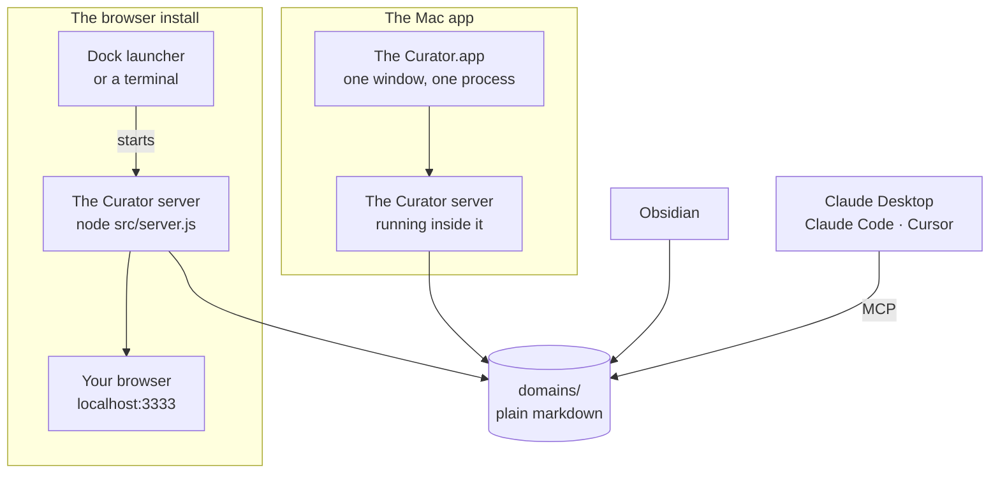

Notice where your knowledge sits. **`domains/` is a folder of ordinary markdown files,
and nothing in that picture owns it.** The app, the server, Obsidian and your MCP
client are separate things reading the same folder. That single fact is why every
question below has a reassuring answer.

### The four things that genuinely differ

Everything else — every view, every button, every keyboard shortcut, the wiki format,
Personal Sync, Shared Brain, Wiki Health, working state — is identical, because it is
the same code.

| | The Mac app | The browser install |
|---|---|---|
| **1 · How it launches** | Open it from Applications or the Dock. It opens **its own window**; no browser tab is opened, and the address it uses is chosen fresh each launch rather than being a fixed `localhost:3333`. | The Dock launcher (or `node src/server.js`) starts the server and opens your browser at `http://localhost:3333`. |
| **2 · How it updates** | **Settings → General → Check for updates → Download and install.** The app fetches a new copy of itself, checks it, swaps it in and restarts — with no Gatekeeper prompt. The git-based update does not apply and refuses. See [§16 → Version and updates](#version-and-updates). | **Settings → General → Check for updates** replaces the source in place (`git` + `npm install`), then restarts. |
| **3 · Where its data lives** | `~/Library/Application Support/The Curator/` — settings, sync configuration, and the default `domains/` folder. | Your install folder, default `~/the-curator/`. |
| **4 · How the MCP bridge starts** | Through a small launcher the app writes for itself on every start. Because of that, **moving your knowledge folder no longer makes the Claude Desktop entry go stale.** | Through a direct command naming your Node binary, the bridge script, and your knowledge folder path — so moving that folder *does* make it stale, and the wizard tells you. |

Two things that follow from #3 and are worth knowing:

- **The two installs do not share anything.** They have separate settings, separate API
  keys and separate sync configuration. They only meet if you deliberately point them at
  the same knowledge folder — which is supported, with one rule and one surprise. See
  [§16 → Two installs, one knowledge folder](#two-installs-one-knowledge-folder).
- **The application log is in the same place for both:**
  `~/Library/Logs/The Curator/curator.log`.

### Moving an existing wiki into the app

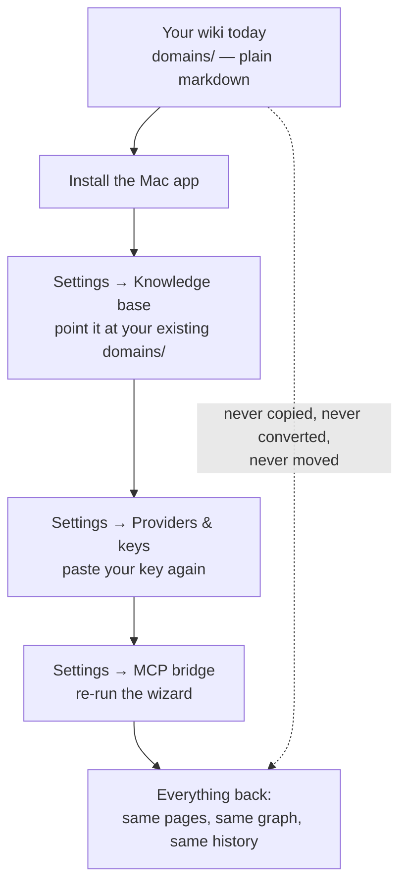

Three steps, all of which are buttons that **already exist**. There is no import, no
conversion and no database rebuild, because there is no database — pointing the app at
the folder *is* the migration.

**Where the button is.** Step one has two entrances and you will meet whichever you
reach first. On the **Domains** view the sidebar carries **Use existing folder** on
every state of that screen, and the *"No domains here yet"* card carries it too. In
**Settings → Knowledge base** the same thing is called **Choose folder**. They do the
same job.

> ⚠️ **The one mistake worth naming in advance: pick the folder that CONTAINS your
> domains, not a domain.** Full explanation, and what an empty list actually means,
> in [§16 → Knowledge base folder](#knowledge-base-folder).

| ✅ Comes across untouched | ⚠️ You redo once | ❌ Does not happen |
|---|---|---|
| Every wiki page, entity, concept and summary | Paste your API key again | Nothing is copied to a new location |
| All your domains | Reconnect Personal Sync, if you use it | Nothing is converted to another format |
| Chat history and conversations | Re-run the MCP wizard, if you use it | No file is deleted or rewritten |
| Working state (agent handoffs) | | Your browser install is not modified or removed |
| Your Obsidian vault and graph colours | | |

**There is no automatic first-launch import, deliberately.** The app does not go looking
for an existing install; it starts empty and waits for you to point it somewhere. So on
first launch you will see an empty app with no domains — that is the expected state, not
a fault, and the fix is the first step above.

**Why credentials do not come across, deliberately.** Copying API keys and sync tokens
automatically would mean new code that reads three secret files from one place and
writes them to another — code that runs exactly once per user, is very hard to test in
the shapes that matter, and fails in the direction where a secret ends up somewhere
nobody intended. Re-pasting a key takes about thirty seconds and uses a screen you have
already used. That trade was made on purpose, and it is
[D11](desktop-app-decisions.md#d11--credentials-do-not-migrate).

**Why the MCP wizard has to be re-run.** The Claude Desktop entry names the bridge by an
absolute path, and the app's bridge is somewhere different from your checkout's. Re-run
**Settings → MCP bridge**; the wizard detects a stale entry and shows you a banner. See
[mcp-user-guide.md](mcp-user-guide.md).

> **The honest reassurance, and it is a structural one rather than a promise:**
> The Curator has no lock-in to break. Your knowledge is markdown in a folder you
> chose, synced to a GitHub repository you own. If you dislike the app, the browser
> install still opens the same folder — and it remains the only option on Windows and
> Linux.

Every decision behind the Mac app — with its reasoning, its evidence, and a status
saying whether code exists for it yet — is recorded in
[desktop-app-decisions.md](desktop-app-decisions.md).

---

## 4. Get your API key (Gemini, Claude or OpenRouter)

The app uses an AI provider to read your documents and power chat. You need an API key from one of three providers:

| Provider | Free tier? | Notes |
|---|---|---|
| **Google Gemini** | Yes, with strict daily quotas | Recommended. The lowest pay-as-you-go cost, and the app's default. |
| **Anthropic Claude** | No — paid only | Roughly 10× the Gemini bill for the same workload. |
| **OpenRouter** | Some models are free, with a daily request cap | One key onto many vendors. **It can build your wiki**, on three hand-measured models, and its default is the cheapest route to that job of the three providers. Because saving its key also makes it the active provider, read [§16b → OpenRouter](#openrouter--one-key-two-lanes-and-a-model-list-you-refresh) before you do. |


> ⚠️ **About "free" — read this before you commit to free-tier-only usage.**
>
> The Gemini free tier exists, and it's enough to *try* the app and ingest a few articles. It is **not enough for serious use.** As of the [December 2025 quota tightening](https://ai.google.dev/gemini-api/docs/rate-limits), Gemini 2.5 Flash Lite (the model The Curator uses by default) is capped at:
>
> - **15 requests per minute** (RPM)
> - **1,000 requests per day** (RPD)
> - **250,000 tokens per minute** (TPM)
>
> A typical batch ingest of 5–10 PDFs can hit those limits and stall mid-run with `429 RESOURCE_EXHAUSTED` errors. **For real use, enable billing in Google AI Studio.** The pay-as-you-go price is so low that most users pay €1–€10/month — see [§19](#19-api-keys-cost--free-tier) for actual numbers.

### How to create a Gemini key

1. Go to **[aistudio.google.com/app/apikey](https://aistudio.google.com/app/apikey)**
2. Sign in with your Google account
3. Click **Create API key**
4. Copy the key — it starts with `AIza` and is about 40 characters long
5. **(Strongly recommended)** Click **Set up Billing** in the same console and link a payment method — the upgrade unlocks the higher paid-tier rate limits and is what enables most users to actually run the app at scale. You will not be billed until you exceed the free tier.
6. Keep the key somewhere safe — you'll paste it in the next step

> Your API key is like a password. Never share it publicly or post it on the internet.

### Or use Anthropic Claude instead

If you'd rather pay Anthropic than Google (e.g. for privacy preference, or because you already have a Claude account):

1. Go to **[console.anthropic.com](https://console.anthropic.com/)**
2. Generate an API key under **Settings → API Keys**
3. Anthropic has **no free tier** — you must add billing before any call works
4. The Curator defaults to **Claude Haiku 4.5** (Anthropic's lowest-cost tier). If you want more capability, you can pick a different Anthropic model in **Settings → Providers & keys** — seven are offered, with the price and the measured trade-off shown next to each. See [§16b Choosing your AI model](#16b-choosing-your-ai-model).

**⚠ Saving a key switches which AI builds your wiki.** The Curator uses *last-saved-wins*: whenever you save a provider key, **that provider immediately becomes the active one** — and the active provider is what runs **ingest, Wiki Health and Compile**. So if you've been on Anthropic and then paste a Gemini key, the app switches to Gemini on its own. That is expected, long-standing behaviour, and it **applies to all three providers, OpenRouter included**.

Worth pausing on, because it is the easiest way to surprise yourself: paste an OpenRouter key just to try a model in chat, and your **next ingest is built by OpenRouter's model instead of the one you were using** — a different model, from a different vendor, at a different price. Nothing breaks and nothing is lost; the wiki still builds. But it is built by something you did not deliberately choose.

Two things make this easy to stay on top of:

- **The word `active` beside a row in Settings → Providers & keys is always the truth** about which provider is live. Check it after saving a key.
- **To flip back without re-pasting or deleting anything**, click **Set active** on the row you want. That button appears on any provider that has a key saved, has a model able to build your wiki, and isn't already active. The switch is instant.

**Chat is a separate lane and is unaffected.** Chat sends its own per-message model, so switching your active provider does not change what answers your chat messages — and picking an OpenRouter model in the chat composer does not change what builds your wiki. See [§16 → API keys](#api-keys) and [§16b](#openrouter--one-key-two-lanes-and-a-model-list-you-refresh).

---

## 5. First run — the Getting started panel

The first time you open The Curator there is nothing to talk to yet, so a small **Getting started** panel appears in the corner with a three-item checklist:

1. **Add an AI key** — *"Nothing else works without a model. Paste a Gemini or Anthropic key in Settings."* → **Open Settings**
2. **Create your first domain** — *"A domain is one subject area with its own wiki — 'articles', 'research', 'work'."* → **Open Domains**
3. **Ingest your first source** — *"Drop in a PDF, Markdown or text file. The Curator reads it and writes the wiki pages."* → **Open Ingest**

Each item has a button that takes you straight to the right place. The panel tracks real state, not clicks: it reads *"2 of 3 done"* and ticks items off by itself as you actually complete them, and it stops appearing once all three are done.

![The Getting started panel, docked in the top-right corner of the app. It is headed "Getting started" with a close cross, reads "3 OF 3 DONE", and lists three completed items each with a green tick and the word Done: "Add an AI key — A key is saved, so The Curator can read and write"; "Create your first domain — You have somewhere for knowledge to land"; "Ingest your first source — Your wiki has pages in it, the loop is running". A closing line reads "Everything here is done — this guide will not come back on its own."](images/curator-getting-started.png)

*The panel with all three steps completed. On a fresh install each row is unticked and reads "0 OF 3 DONE" instead, with an action button in place of the word "Done".*

**It never blocks you.** It is a panel, not a modal — you can click past it, start typing, and ignore it entirely. Dismiss it with the **✕** in its corner. Dismissing is not permanent: **Settings → General → Show setup guide** brings it back at any time. The dismissal is remembered per *install*, not per browser, so it does not follow you from a browser install into the Mac app.

> Step 1 is the only one you truly cannot skip in substance — without a key, ingest and chat have no model to call. Nothing stops you dismissing the panel first and adding the key later.

> **An OpenRouter key alone does not tick off step 1.** The checklist looks for a Gemini or an Anthropic key specifically. If OpenRouter is your only provider the app works fine — you can ingest and chat — but this row keeps saying "Add an AI key" until you either add one of the other two or dismiss the panel. Dismissing it is the right move; nothing is wrong.

### First run is the same in the Mac app — with one thing to expect

The panel, the three steps and the order are identical, because it is the same
interface. There is no separate installer wizard and nothing asks you for a key
before the app will open.

The one thing that differs is what an **existing** user sees. The app does not go
looking for a wiki you already have, so it starts genuinely empty: no domains, and the
Getting started panel offering to create your first one. That is the expected state.
Point it at your existing folder — **Settings → Knowledge base** — and everything
appears. [§3b](#moving-an-existing-wiki-into-the-app) has the full three-step path.

> **For developers:** you can also configure API keys by creating a `.env` file manually (`cp .env.example .env`) and setting `GEMINI_API_KEY=your_key_here`. Keys saved in Settings take priority over `.env` when both are present. Note that a `.env`-only key does **not** tick off step 1 — the checklist reads keys saved through the app (`.curator-config.json`), so it will keep showing "Add an AI key" even though the app can already make calls.
>
> This `.env` route is for the browser install only. The Mac app's program files are inside the application bundle, which is read-only, so there is nowhere useful to put a `.env` — use Settings.

---

## 6. Starting and quitting

### The Mac app

Open **The Curator** from Applications, or click it in your Dock. It opens in its own
window. **No browser tab opens**, and you do not need one — the interface is the window.

> **There is no `localhost:3333` to bookmark in the app.** It picks a free address on
> your own machine each time it starts, so the number changes between launches. This is
> deliberate: it means the app and a browser install can never fight over the same port.
> Everything you need is inside the window.

| You do… | What happens |
|---|---|
| Close the window (red button or `⌘W`) | The window **hides**; the app keeps running, and anything in flight keeps going. |
| Click the Dock icon again | The same window comes back — hidden, minimised or closed, it is restored. Nothing restarts. |
| Open The Curator a second time | It refuses, with *"The Curator is already running"*, and brings the existing window forward instead. One copy, one wiki. |
| Quit (`⌘Q`, or Dock icon → **Quit**) | The app **checks whether anything is writing to your wiki first** — see below. |
| Reboot your computer | The app is gone; open it again from the Dock or Applications. |

**Quitting asks first when it matters.** If an ingest, a compile or an update is in
flight, the app does not just exit. You get a dialog headed **"Quit now?"** with two
buttons — **Keep working** and **Quit anyway** — and a line naming what is running, for
example *"A write to your wiki is in progress. Quitting now can lose work you have paid
for."* **Keep working** is the highlighted default.

You get the same question, worded differently, if the app *cannot tell* whether
something is running. That is on purpose: the app never assumes it is safe to quit
during a paid, multi-minute write just because a check came back unclear.

> The window remembers its size and position between launches.

> **The app can also live in your menu bar.** Optional, off by default, and switched on in
> **Settings → General → Menu bar** — a small icon that shows what your agents have just saved
> without you opening the window. See [§6b](#6b-the-menu-bar-icon-mac-app). Turning it on does
> not change any of the quit behaviour above: **Quit** in the menu bar runs the same
> work-in-progress check that ⌘Q does.

### The browser install — macOS Dock launcher

Click **The Curator** icon in your Dock. It starts the local server and opens in your browser automatically.

> If The Curator is not yet in your Dock, open Finder → `~/the-curator/` → drag the app icon down into your Dock first (one-time step).

### The browser install — manual / Linux / Windows

Open a terminal in the project folder and run:

```bash
node src/server.js                            # macOS / Linux
# Windows PowerShell:
# $env:CURATOR_NO_OPEN=1; node src\server.js
```

Then open **http://localhost:3333** in your browser.

### How the browser install's lifecycle works

It is a **local web app** — a small Express server runs on your machine and renders the UI inside whichever browser you have open. Four things to know:

| You do… | What happens |
|---|---|
| Close the browser tab | The server **keeps running** in the background, idling at near-zero CPU. Nothing is lost. |
| Click the Dock icon again (Mac) | The browser tab reopens and reconnects to the already-running server. Fast — there is no restart. |
| Right-click Dock icon → **Quit** (Mac) | The server actually stops. Use this when you want the process gone. |
| Press `Ctrl + C` in the terminal (manual mode) | The server stops. |
| Reboot your computer | The server is gone; relaunch it (Dock click or `node src/server.js`). |

> **There is no "Stop server" button in the UI.** It was deliberately removed in v2.1 because AppleScript's reopen handler is broken on modern macOS. Use the Dock right-click menu instead.

> ⚠️ **Quitting the browser install does not warn you about work in progress.** That check exists only in the Mac app. So if you ingest a 200-page PDF here, **don't quit until you see the success banner** — the ingest stream lives inside the server process, and killing it mid-run loses the rest of a document you have already paid to have read.

---

## 6b. The menu bar icon (Mac app)

*Mac app only. The browser install has no menu bar presence — the setting is still shown there, and says so, rather than leaving you hunting for a control that does not apply.*

### The one question it answers

You are deep in a coding session, your context window is filling up, and you want to know — in about a second, without leaving what you are doing — **whether your agent has actually written the handoff, and how long ago.**

That is the whole feature. Everything below follows from it.

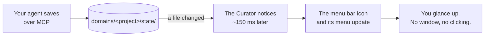

> **It is off by default, and that is not caution.** A brand-new install has no agent memory at all, so an on-by-default icon's only possible content is *"No agent memory yet"* — the worst first impression the feature can make, and one that teaches you the icon is not worth clicking.

### Turning it on

**Settings → General → Menu bar.** It takes effect immediately; there is nothing to restart, and you can switch it back off the same way.

| Choice | What you get |
|---|---|
| **Off** | No menu bar icon. The Dock icon and the window behave exactly as they always have. **This is the default.** |
| **On** | A menu bar icon, alongside your Dock icon |
| **On, hide the Dock icon** | Remembered, but **the Dock icon is not actually hidden yet** — this behaves as **On** today. [Why](#what-is-not-finished-and-what-has-never-been-seen) |

### What you see when you click it

```
┌──────────────────────────────────────────────────────────┐
│  Last save · 44 min ago                                  │  ① the answer, first
│      claude-code · opus-4                                │  ② who wrote it
│  ── Save pulse ─────────────────────────────────────────  │
│  ▁▂█▇█▃▆  ┈┈┈───────   5 days known · 79 saves · 2 tools │  ②b the last 7 days
│  ── Recent scopes ──────────────────────────────────────  │
│  ● menubar-widget-design · 44 min ago                 ▸  │
│      claude-code · opus-4 — v3.37.0 SHIPPED and it…      │  ③ up to 5 rows,
│  ◕ save-kind-verdict · 15 hr ago                      ▸  │     newest first,
│      antigravity ← claude-code — classifySaveNote…       │     each with a mark
│  ◑ design-conformance-pre… · 38 hr ago                ▸  │     and a submenu
│      handoff trimmed · claude-code — 7 of 11 issu…       │
│  More in Agent Memory… (6)                               │  ④ a cap, disclosed
├──────────────────────────────────────────────────────────┤
│  14 handoffs waiting on GitHub                           │  ⑤ notices, only
│  studio saved after this Mac                             │     when true
│  Two agent tools are writing notes…                      │
├──────────────────────────────────────────────────────────┤
│  Open Agent Memory…                                      │
│  Open The Curator                                        │  ⑥ always here,
│  Settings…                                               │     in every state
├──────────────────────────────────────────────────────────┤
│  Updated 12:42                                           │  ⑦ how fresh this
├──────────────────────────────────────────────────────────┤     reading is
│  Quit The Curator                                        │
└──────────────────────────────────────────────────────────┘
```

*Abbreviated — three rows are drawn above where the real menu shows five, and the notice lines
appear only when they apply. Everything else is always in that order. **Save pulse** and
**Recent scopes** are real macOS section headers, not drawn rules; the pulse and the row marks are
real drawn images, not text — the blocks above are the closest a page of text can get. The `▸` on
each row is macOS's own submenu arrow.*

> **The first line of a row is the work-stream and the time, and nothing else may stand there.**
> That is a change, and it came from a photograph of the previous version: a row read
> *`project… — alices-macbook-pro·9f3c · 18 hr ago`*. The work-stream name — the thing you were
> looking for — had been cut to eight characters, while a twenty-two-character computer name
> survived whole, because everything after the name was composed at full length first and the name
> got whatever was left. **Measured on the same rows, the widest line came down from 46 characters
> to 35, and no work-stream name is cut at all.**
>
> Everything that used to crowd that line — the tool, the computer, the project, the model — is now
> on the **second line**, which macOS draws in a smaller face and which therefore has more room.
> Each of those is still dropped **only while it distinguishes nothing**: the project when one
> project has state, the tool when every row shows the same tool, the computer when every row came
> from the same computer, the model when they all used the same one. When even the second line will
> not hold everything, tokens are dropped **whole, lowest priority first** — model, then project,
> then computer, then tool — because `son…` is not a shorter `sonnet-4`, it is a different word.
>
> **And nothing a cut removed becomes unreachable. Hover the row and you get all of it** — the full
> `project · work-stream`, the machine folder, the tool, the exact model string and the exact
> timestamp.
>
> That is an absolute rule rather than a courtesy, and it applies everywhere a budget bites: the
> line under the headline carries the project and work-stream on hover, and a notice long enough to
> be clipped carries its whole sentence. A notice that already fits carries no tooltip at all,
> because a tooltip repeating the label word for word is noise.

| | What it is | Why it is where it is |
|---|---|---|
| ① | The last save, anywhere across all your projects | It is the question you came to ask, so it is answerable without reading past the first line. Clicking it opens Agent memory |
| ② | **Which tool and which model** wrote that save — `claude-code · opus-4` | A statement about the line above, not a second action. It used to repeat `project · work-stream`, which the very first row already shows three pixels below; *which agent, and which LLM* is a question nothing else in the menu answers. The project and work-stream are still there on hover |
| ②b | **The save pulse** — a small drawn strip of the last seven days, and a sentence saying what it adds up to | *"Did it save?"* is ①. *"Have we been saving at all this week?"* is a different question, and a picture answers it faster than any sentence. [How to read it](#reading-the-save-pulse) |
| ③ | Up to **five** work-streams, newest first, **flat — not grouped by project**, each with a [recency mark](#the-recency-dot) and a [submenu](#what-a-row-can-do) | You are watching an agent, and an agent works in one work-stream at a time. *"What just happened"* is a recency question. The project name rides on every row, so nothing is lost but the grouping. It was eight; five plus a real overflow line reads better in a menu this narrow |
| ④ | *"More in Agent Memory… (6)"* — how many work-streams did **not** fit, **and you can click it** | A cap is never allowed to look like a measurement. A list that shows five when you have eleven, and says nothing about the other six, is the one case where you most need telling — so the number is counted against everything on disk, not against the five you can see. It is the only route to the rows the cap hid, so it is a live menu item and not a dimmed apology |
| ⑤ | Notices | They appear **only when they have something to say**, at most four at a time, and **below** the list rather than above it — a caveat about a list belongs under it, not in front of the answer you came for. Two agent tools writing one work-stream; handoffs waiting on GitHub; **another computer having saved after this one** |
| ⑥ | The three ways back into the app | Always present, in every state, whatever the data above them does. That is what makes the icon safe to switch on |
| ⑦ | *"Updated HH:MM"* — an **absolute** time | The rows' ages are relative; this one is not, deliberately. They answer different questions — *how old is this event* versus *how old is this reading*. It is what makes a reading that has silently stopped updating visible as stale, and it is the moment the [pulse strip](#reading-the-save-pulse) is a picture of |

**Quit is always last, and it is the system's own Quit.** It is not a shortcut that skips anything: quitting from the menu bar runs the same check as ⌘Q, so if an ingest or a compile is in flight you still get the *"Quit now?"* dialog described in [§6](#6-starting-and-quitting). That matters more here, not less — an app that keeps running with no window on screen is more likely to be alive while something is being written.

### How to read a row

Every row is the same shape:

```
main · 4 min ago
    claude-code · opus-4 — wired the remote observation and its window
```
**Line one is `work-stream · when`, and nothing else is ever allowed onto it.** Line two is
*who wrote it* and then **the agent's own one-line summary of what it did**.

**Line two can carry up to six things, and each appears only when it is telling you something.**

| On line two | When it appears |
|---|---|
| **`handoff trimmed`** | Only when the last save **did not all fit** and part of the handoff was not stored. [More below](#when-a-save-did-not-all-fit) |
| **`opencode ← claude-code`** | Only when **the last two saves in that work-stream came from different tools** — the baton changed hands. The arrow points from who wrote it to who wrote it before |
| **the tool** — `claude-code`, `opencode`, `cursor` | Unless every visible row shows the same one |
| **the computer** — `studio`, `laptop` | Only on a row from **another computer**, and only when the rows disagree about which computer they came from |
| **the project** | Only when more than one project has state |
| **the model** — `opus-4`, `gemini-2.5`, `haiku-4` | Unless every visible row used the same one. It is the family and the generation; the exact string is on hover |

> **A row from another computer can now name its tool as well as its machine, and that is a
> change.** It used to be one or the other: naming a tool on a foreign row could be misread as
> *that tool is running here*. Line two is a list rather than a single slot, so the computer is
> right there beside the tool — `opencode · studio` cannot be misread — and suppressing the tool
> would now be dropping a real fact to avoid an ambiguity that no longer exists.

> <a id="when-a-save-did-not-all-fit"></a>**`handoff trimmed` appears for exactly one of the five
> save verdicts.** It means the store could not hold the whole handoff and some of it was not
> written — the one thing a widget about carrying context must not hide. A save whose one-line
> *summary* was shortened while the handoff itself was stored in full is **silent here**, because
> those two are different facts and reporting them with one alarm is the defect v3.39.0 exists to
> fix. Hover the row and it says which happened, in a sentence.

**And the `when` column tells you which clock it came from.**

| You see | It means |
|---|---|
| **`4 min ago`** | The **agent's own clock**, recorded in the journal when it saved. This is the real answer |
| **`changed 4 min ago`** | The **file's timestamp on this disk**. For a handoff that arrived over Personal Sync, that is when it *landed here*, not when it was written — git rewrites file times when it checks a file out |
| **`time unknown`** | No save time was recorded for this work-stream. It is never shown as *"just now"*, and a row with no known age sorts to the **bottom**, never the top — putting an unknown first would be asserting it is the newest |

> This is the one place the widget could most easily have lied to you. On a second computer, *every* handoff you pull would read as *"just now"* if it used file times — and the strongest signal in the whole design would be wrong in exactly the situation it was built for.

**Hovering the icon** shows the same headline in a tooltip, without clicking.

> **How current are the ages, really?** **The ages themselves are recalculated every time the menu
> is drawn** — including when you merely hover the icon, which costs nothing because it re-uses the
> reading already in memory. So *"4 min ago"* is 4 minutes as of the moment you are looking at it.
>
> What can lag is the **reading underneath** — which work-streams exist and what each one last
> said. That is refreshed the instant a save happens (the app watches the folder), and otherwise
> every five minutes as a safety net, and again when you click. In practice a save you just made is
> already there. **`Updated 14:32`** tells you when the menu was last drawn, which is what makes a
> reading that has silently stopped updating visible as stale.

### The recency dot

Every row in **Recent scopes** carries a small mark to its left. It is a **band**, not a number — the exact age is printed on the same row, in words, right beside it.

| Mark | Colour | It means |
|---|---|---|
| **●** a full disc | teal | **Being written right now** — within the last **2 minutes** |
| **◕** three quarters of a disc | teal | Saved within the last **half hour** |
| **◑** half a disc | amber | Saved **earlier today** — between half an hour and **12 hours** ago |
| **◔** a quarter of a disc | grey | Saved **in the last week** |
| **▪** a small filled dot | grey | **Older than a week** |
| *(nothing at all)* | — | **No save time is known** for this work-stream |

**It is a clock draining.** That is a change: the marks used to be a disc and three rings that
differed by half a point of radius — **one screen pixel** between three of the five states, which
is a ladder that exists in the arithmetic and not on the screen. A quarter of a circle is a
difference you can see in a thumbnail, and the mark itself grew from 11 points square to 13 so a
quarter of it is still a shape rather than a smudge.

**Why five marks share three colours.** Green covers both *right now* and *the last half hour* on purpose: a menu you open by hand will essentially never land inside the two-minute live window, so a green reserved for that alone would spend the strongest colour in the set on the state you almost never see, and everything would be amber or grey in practice. **Half an hour is the point at which the handoff stops being in your head** — which is the thing the colour is actually being asked about. At the other end, three days ago and three weeks ago call for the same thing from you — read it properly before you touch it — so a third shade between them would be a distinction with no consequence.

**The colour is never the only signal.** Teal and amber are a hard pair for the commonest kinds of colour blindness, so the five marks are also a ladder of *how much ink is on the screen* — 78, 59, 39, 20 and 13 square points, strictly downward — and the one state that changes what you do next, something is being written **right now**, is the only complete disc. You can read the whole ladder with the colour removed entirely, which is exactly how the automated tests check it. **Hover a row** and the band is also stated in words.

> **A row with no known save time gets no mark at all — deliberately.** It does not get the faintest, oldest-looking dot. *We do not know when this was saved* and *this was saved a long time ago* are different claims, and drawing the second when only the first is true would be inventing a fact. The row's own label says *"time unknown"*, and the space where the dot would be stays empty.

### What a row can do

<a id="what-a-row-can-do"></a>Every work-stream row has a **submenu** — hover it and four items
appear.

| Item | What it does |
|---|---|
| **Open in The Curator** | Opens the app on Agent memory, at that project. This is what clicking the row used to do, and it is still the first thing under the pointer |
| **Copy resume prompt** | Puts a short **instruction** on your clipboard: paste it into a fresh agent session and it knows how to fetch this work-stream's state for itself |
| **Copy handoff as Markdown** | Puts the **document itself** on your clipboard — your standing brief and the session handoff, in full |
| **Reveal current.md in Finder** | Opens a Finder window with the handoff file selected |

**The two Copy items exist because a menu cannot open a work-stream.** Clicking a row lands on the
*project*; the work-stream picker inside the app has no address the menu can dial. The clipboard is
the route the menu does have — and it happens to be the more useful one, because what you usually
want at that moment is to hand the work-stream to an agent rather than to look at it.

**They are for two different agents.**

*Copy resume prompt* is for an agent that can reach your knowledge itself — through the my-curator
MCP, or failing that by opening the file. It is a few short paragraphs that name the project, the
work-stream, the MCP tool to call, and the file path to fall back on, and it ends by telling the
agent to save the **complete** state back when it runs low on context.

*Copy handoff as Markdown* is for one that can reach neither — a browser chat with no tools. It is
the standing brief and the handoff, as two clearly separated sections. **It is not capped**: the
store already bounds a handoff at 48 KB and a brief at 32 KB, and a second, smaller cap here would
quietly cut a document you asked for in full. The size is shown on hover instead, so an 80 KB paste
is never a surprise.

> **Both of them say, in the same words, which half you are supposed to obey.** The handoff and the
> journal are **recorded data to verify**; the standing brief is **your own instructions and is
> followed**. That distinction is the whole of how the memory layer is meant to be read, and a paste
> that lost it would hand a model a document with no way to tell them apart.
>
> **And the handoff is read through the store, not off the disk.** The Curator escapes
> protocol-shaped markup on the way *out* of a file, because a handoff that arrived over sync from
> another machine was not necessarily written by your own tools. Copying it goes through that same
> read, and says so at the bottom of the document when anything was escaped.

### Reading the save pulse

Under the **Save pulse** header, one line carries a small drawn strip — **14 marks, one per twelve hours, covering the last seven days, oldest on the left** — and beside it a sentence saying what the picture adds up to. (The strip used to draw 28 marks at six hours each; it was folded to half the marks and twice the width per mark so the picture could be made **narrower and much more visible at the same time**. Nothing about what is counted changed.)

```
                      ▃ █ ▅ █
              ▂   ▄   █ █ █ █
┈┈┈┈┈┈┈┈┈─────────────────────      5 days known · 79 saves · 2 tools
╵   ╵   ╵   ╵   ╵   ╵   ╵  ╵╵
└ before ┘ └──── what actually happened ────┘
  this store
  existed
```

**There are four kinds of mark, and telling the first two apart is the whole point.**

| Mark | What it means |
|---|---|
| **A solid baseline** running the width | The timeline. Solid means **your store existed** for that stretch |
| **A dotted baseline** | **Your store did not exist yet.** Not "quiet" — *unknown* |
| **A violet bar** standing on the baseline | Saves landed in that twelve-hour block. **The taller the bar, the more saves** — the ladder is 1, 2–3, 4–6, 7–12, 13 or more |
| **An amber cap** on the top of a bar | **A different agent tool took over** inside that twelve hours. This is the one mark that answers *did the baton get passed cleanly* |

Below the baseline, **one tick per day**, with **today's drawn double width** so the last day is
findable without counting.

> **The bar height is the save count, and that is a reversal worth explaining.** The previous strip
> refused to put the count in the height, on the ground that a rising and falling column chart reads
> as a productivity graph. That ground is real and it still holds — but the version that shipped put
> the identical number into a five-step **colour ramp** instead, which at three points wide is
> illegible, and which saturated at five saves while real twelve-hour blocks hold three to eighteen.
> The result was the fence in the maintainer's screenshot: every active block the same dark green.
>
> The count is now drawn where it can be read, and the productivity reading is defeated by
> **structure** rather than by refusal — the baseline and the day ticks make the picture a
> *timeline*, and the sentence beside it says **saves per 12 hours**, never *activity* and never
> *progress*. **A tall bar still means "checked in often", never "a good day".** How often an agent
> saves is an instruction you gave it, not an outcome it earned.

> **Why "did not exist yet" has its own texture rather than just being fainter.** *Nothing happened*
> and *we have no idea* are opposite claims, and a strip that draws them the same way is lying about
> half of itself. This is not an edge case: a store three and a half days old spends **half its
> width** on "did not exist yet". The difference is **solid versus dotted** — a texture, not a
> shade — and both are drawn in the *same ink*, so it survives being read by someone who cannot see
> the colours at all.
>
> **The colours are measured, not picked.** Every one clears the 3:1 contrast floor for non-text
> against every menu background it can be drawn on, in both light and dark appearance, and the
> automated tests recompute all of it from the values actually shipped — including three colours
> that are **required to fail**, so a check that could never fail cannot pass for one that works.

> **`· 2 tools`** appears on the sentence only when **more than one** agent tool wrote inside the
> week. One tool is silent, because a token on every row of every single-tool store distinguishes
> nothing; and *zero* is silent too, because it means no save named a tool — an absence, not a
> measurement of none.

**The sentence beside it never claims more than the picture can support.**

| You see | It means |
|---|---|
| **`7 days · 41 saves`** | The strip really does cover a full week |
| **`4 days known · 41 saves`** | Your store is **younger than the window**. The count and the picture are about those four days, not about a week |
| **`at least 41 saves`** | One or more work-streams had **more history than could be read** — each journal is read from its last 16 KB. The number is a **floor**, and the oldest marks under-count |
| **`no saves`** | The window really is covered and really is empty. A quiet week |
| **`nothing recorded yet`** | Every mark is "did not exist yet". Deliberately *not* worded as an empty week, because nothing here knows anything about that week |
| **`no save times recorded`** | There are journals, but none of them carries a usable time |

> **The words no longer repeat the header.** The sentence used to read *"Save pulse · 4 days known · 70 saves"*. Now that **Save pulse** is a header line of its own directly above it, the label drops the noun and simply says *"4 days known · 70 saves"* — the same reading, one fewer thing to read.

**Hover the strip** and the tooltip gives you the legend plus everything the sentence had to leave out — how many work-streams were counted, how many older saves fall outside the window entirely, and the timestamp of the oldest save it can see. It is also a live menu item: **clicking the strip opens Agent memory**, where the saves it counts are listed. It used to be dimmed and unclickable, which put the one picture in the whole widget into the faintest style macOS offers — the opposite of what it was for.

> ### What the darkness is NOT
>
> **It is a measure of how often your agents check in. It is not a measure of how much they got done, and it must never be read as one.**
>
> An agent told to *save early and often* — which is exactly what The Curator's own continuity instructions ask for — produces far more marks than one told to save twice at the end. A dark bar means **a different capture habit**, not a better day's work. That is why the label says *"saves"* and never *"activity"* or *"progress"*, and why nothing anywhere ranks a dark column above a pale one.

**Only the agent's own recorded save time is ever counted** — never the file's timestamp on disk. That matters most on a second computer: file times get rewritten when Personal Sync checks files out, so a strip built from them would draw a colleague-machine's entire history as one giant spike at the moment you pulled. Yours shows *when the work happened*, not *when it landed here*.

### The icon itself

It carries exactly one bit beyond *"The Curator is running"*.

| Icon | Meaning |
|---|---|
| **○** — a hollow ring | The Curator is running. Nothing has been written here very recently |
| **●** — a filled centre | An agent has written **on this computer** within the last **2 minutes** |

Three things it deliberately is **not**: there is no number badge (*a count of what?*), no animation (an animated menu bar icon is the thing people uninstall apps over), and **no text beside it**. A relative age in the menu bar is either stale or it has to wake the app every minute forever to stay honest, and every extra pixel of width makes an icon more likely to vanish behind the notch on a narrow screen. The headline lives at the top of the menu and in the hover tooltip instead.

The filled state is a **local** instrument: a handoff pulled from another machine never lights it, because that is not an agent working *here*.

---

### Ways to use it

Four situations the widget was actually designed around. They are not illustrations — each one is the reason a specific decision in it was made the way it was.

#### Scenario 1 — Two agent tools on one computer

*You run Claude Code in one window and opencode in another, on the same project.*

The widget shows you **which tool wrote last**, because on a local row that is what the `who` column carries. So *"did Claude Code save, or was that opencode twenty minutes ago?"* is answerable at a glance.

It also warns you about something that is otherwise completely silent:

```
Two agent tools are writing notes · drafting
```

**Here is why that matters.** Working state is stored per *project · work-stream · computer* — there is **no slot in that path for the tool**. So two agent tools on one machine, told to use the same work-stream, write to the **same handoff file**, and each save **replaces** the other's. Nothing errors. Nothing warns. The screen looks calm. You come back the next day, resume, and the handoff you are reading is whichever tool happened to save last.

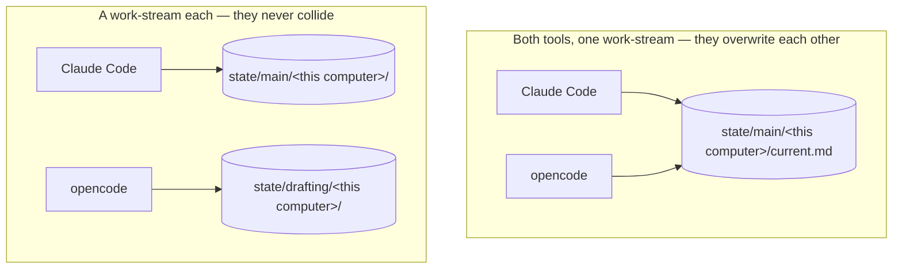

**The remedy is yours, and it is one sentence: give each tool its own work-stream name.** Tell each agent which scope it owns — `main` for one, `drafting` for the other — and they never touch the same file again. The widget names the collision and stops there, on purpose; a menu bar line has no business proposing a fix in six words.

> **What is not lost, and it is worth knowing.** The append-only journal survives a collision — every save writes a line carrying its own tool name, so the record of *what happened* is intact even when the *current handoff* only holds whichever tool saved last. That is how the collision is detected in the first place, and you can read the whole trail in **Agent memory → Journal**.

#### Scenario 2 — Two or three computers, one private GitHub repo

*A laptop and a desktop, each with its own agent, syncing working state through [Personal Sync](#15-sync-across-computers).*

Two things the widget gives you here:

| | |
|---|---|
| **You can see at a glance that a work-stream was written somewhere else** | A remote row shows the **machine** instead of the tool, so `research · api-rewrite — studio · 3 hr ago` reads as *"the other computer did this, three hours ago"* without you opening anything |
| **You are told which clock the age came from** | A handoff that arrived over sync carries the moment it *landed*, not the moment it was written — so the widget says **`changed 3 hr ago`** rather than `3 hr ago` when the agent's own time is not available. A day-old handoff can never present itself as fresh |

The practical use: **before you resume a work-stream, glance at the icon.** If the newest row for it names another machine, that machine wrote it more recently than you did, and pulling before you start is the difference between continuing and diverging.

> **One laptop counts as one computer, even when your Mac has changed its own name.** macOS re-derives your machine's hostname from the network, so a laptop that has moved between Wi-Fi networks can end up with **two folders on disk** — `mac-…` and `alices-macbook-pro-…` — that are the same computer. The widget matches on the **installation** identity rather than the name, so those collapse into one row instead of inventing a second machine you do not own. Two genuinely different computers still get their own names, because there the machine **is** the news.
>
> If two rows for one work-stream would otherwise read identically, the widget **shows their ages more precisely** — *"34 hr ago"* and *"36 hr ago"* instead of two rows both saying *"1 day ago"* — rather than falling back to those raw folder names. Same fact, read finer; no invented hardware.

> **How the *"14 handoffs waiting on GitHub"* line gets its answer — and what its absence means.**
>
> **Opening the menu asks GitHub.** Only opening it: never hovering, never on a timer. That is
> deliberate — a background check would mean The Curator phoning GitHub forever behind a closed
> menu, on battery, possibly on a metered connection, to keep a line fresh that nobody is looking
> at. Clicking is you asking, so that is when it asks. It goes through the app's existing sync
> machinery, so it inherits the same cache and the same queueing as the check the app already
> makes while the window is open, rather than opening a second channel to GitHub.
>
> An answer older than five minutes is dropped rather than shown with an age, because a line saying
> *"14 waiting"* reads as current and there is no room beside it to say it is not.
>
> So: **absence means nobody has checked, and it is deliberately never rendered as "you are up to
> date."** If the check itself fails — no network, a bad token — you are told that, rather than being
> shown silence that looks identical to *nothing is waiting*. **Pulling is still a deliberate act
> you take in the Sync view.** [Automatic sync is researched and not built](#automatic-sync-is-not-built).

#### Scenario 3 — Running low on context

*The one this feature exists for.* You are near the end of a context window, about to ask the agent to save and stop, and the thing you want to know is whether the save actually happened.

**Move the pointer to the icon. Do not even click.** The tooltip is the answer:

```
The Curator — Last save · just now (notes · main)
```

**`just now` means "within the last minute"** — anything under sixty seconds reads the same way,
because a menu bar is not a stopwatch. Above that it steps through *N min · N hr · N days · N
weeks*. So what you are actually reading is a **band**, and the band is what the question needs:
if it says *just now* your save landed, and if it says *2 hr ago* it did not.

Read it with the five-minute caveat from [How to read a row](#how-to-read-a-row) in mind — the
figure may be a reading taken up to five minutes back. That is precise enough to separate *just
saved* from *this morning*, and not precise enough to time a save to the second.

**The other half of that worry — *"is my standing brief still describing this project?"* — is in
the same tooltip**, as a second clause:

```
The Curator — Last save · just now (notes · main) · Brief · 6 weeks ago
```

It is stated as an **age and never as a judgement**. *"Brief · 6 weeks ago"* is a measurement;
*"your brief is stale"* would be the widget passing an opinion on a document you wrote by hand,
which is not its business — an old brief on a settled project is not a stale one. If the age cannot
be worked out the clause is simply absent rather than saying *"time unknown"*, and a project with
no standing brief at all gets no clause, because that is the ordinary case and not a problem to
report in a menu bar.

It does not get a **menu row**, and that is the ranking rather than an oversight: a brief is up to
32 KB of prose that changes on the order of weeks, so it does not earn one of five scarce rows.
The tooltip is the one surface here with no scarcity — it costs no row, no menu bar width, and no
extra reading of the disk. For the full picture, **Open Agent Memory…** still lands you on the
save-status strip ([§7](#the-save-status-strip)).

> **What the widget can never tell you: whether you are saved *now*.** It knows when the last save happened, not whether anything has changed since. That is why the line reads **Last save**, and not *"you are saved"*.

#### Scenario 4 — "Have we actually been saving, or did the habit quietly die?"

*The one the [save pulse](#reading-the-save-pulse) exists for, and the only one that is about a **week** rather than a **moment**.*

Continuity only works if the saves keep happening. But nothing ever tells you they have stopped — a missed save is not an error, it is an absence. You notice weeks later, when you resume a work-stream and the handoff describes a problem you solved on Tuesday.

**Open the menu and look at the second line down. You are looking at the shape, not the numbers.**

| The strip looks like | Read it as |
|---|---|
| Marks spread across most days, with gaps at night and at weekends | **A working rhythm.** This is what a healthy store looks like — the gaps are you sleeping, not the habit failing |
| A dense cluster at the left and **nothing on the right** | **Saving stopped.** Something changed — a harness reconfigured, an MCP connection that quietly dropped, a project you moved off. Worth a minute of your attention |
| Ticks on the floor for the left half, marks only on the right | **Your store is just young.** Nothing is wrong; there was no history to draw. The label confirms it — *"4 days known"*, not *"7 days"* |
| Marks everywhere and very dark | Frequent check-ins. **Not "a good week"** — see the box in [Reading the save pulse](#reading-the-save-pulse). It tells you about cadence, and cadence is an instruction you gave, not an outcome you earned |

**Two things worth knowing before you act on it.**

The strip is **the whole store, not one project** — every work-stream on every machine, added together. A gap means *nothing anywhere*, which is a much stronger signal than one quiet project, and it is why one aggregate strip was drawn instead of a tiny sparkline per row. (Eight or eleven bands a few points tall, each from one work-stream's handful of saves, would have been mostly empty and unreadable at that size.)

And the numbers **count what could be read**. If a work-stream has more history than the last 16 KB of its journal, the sentence says **`at least 41 saves`** — the strip's oldest marks under-count, and it tells you so rather than presenting a floor as a total.

> **A young store and a dead one draw the same empty cells, and the widget refuses to confuse them.** That is the entire reason there are three kinds of mark rather than two. A brand-new install shows fourteen baseline hairlines and says **`nothing recorded yet`** — never *"7 days · no saves"*, which would be a confident statement about a week it knows nothing about.

#### Scenarios this does not serve

Named so you do not go looking:

- **Watching the pulse move.** It is a **still picture, redrawn each time you open the menu** — not a live trace that ticks along while you watch. That is a limit of what a macOS menu can do, not a shortcut: a menu item can carry an **image** (which is how the strip exists at all), but it cannot host a live view, and a menu is frozen by the system the moment it opens. The *"Updated 14:32"* line at the bottom tells you which moment the picture is of. Hovering re-times the **rows**; the strip is from the last read.
- **Judging your week by it.** Covered above and worth repeating because it is the most tempting misreading: darkness is **how often**, never **how well**.
- **Per-tool or per-work-stream history.** The strip is one lane over everything. A lane per tool — *"are Claude Code and opencode taking turns in this scope?"* — is designed and **not built**; it needs a surface the menu does not have. See [the roadmap](roadmap-menubar-widget.md#0a-status--what-shipped-what-deviated-what-is-still-a-plan).

- **Reading the handoff *in the menu*.** A handoff runs to fifteen thousand characters or more; there is no honest way to draw that in a menu bar, and the menu does not try. What it will do is **hand it to you**: the row's submenu can [copy the whole document, or a prompt that fetches it](#what-a-row-can-do). Clicking the row itself opens the app, on Agent memory, at that **project** — not the individual work-stream, which the picker there is for.
- **Watching progress.** A save is not partly done; it has happened or it has not. There is no progress bar and there will not be one.
- <a id="automatic-sync-is-not-built"></a>**Syncing by itself.** The widget observes; it never pushes or pulls. Automatic sync has been researched and **is not built** — the finding was that automatic *push* is safe and automatic *pull* is not (a pull rewrites files under you and prefers the remote on a conflict), so the recommendation is automatic push by explicit opt-in, with pull staying a decision you make. Until any of that exists, syncing is a button you press in the [Sync view](#15-sync-across-computers).
- **A richer panel** — a card per work-stream, how full a handoff is getting, a strip of recent activity per tool. All designed, **none built.** See [the roadmap](roadmap-menubar-widget.md#0a-status--what-shipped-what-deviated-what-is-still-a-plan).

---

### What it costs to leave on

Roughly **0.025% of one core** — which is inside the noise of what the app already uses sitting idle.

It works by **watching** the folder your state lives in and doing nothing at all until something changes. There is no timer counting down behind a closed menu, and nothing is re-read on a schedule while you are not looking.

| While the menu is closed | Cost |
|---|---|
| Watching the folder | 0.0044% of a core |
| One safety check every 5 minutes, in case the watch dies quietly | 0.02% |
| Reading the index when a save actually happens | A few milliseconds, a few times an hour |
| Anything else | **Nothing.** No timers are running |

The alternative — checking every twenty seconds so the menu feels instant — was measured at **70× the cost** and rejected. It is not needed: because the app is *told* when a file changes, it is already holding the answer when you click.

### If the icon does not appear

There are **three** separate ways a new menu bar icon silently fails to show up on a modern Mac, and **macOS gives an app no way to find out which one happened** — so The Curator cannot tell you, and neither can this page. Check all three:

| | Look here |
|---|---|
| **Pushed off the edge** behind the notch, on a narrow screen or with many icons | Quit some other menu bar apps and see if it appears |
| **Filed away by a menu bar organiser** — Bartender, Ice, and similar | Open the organiser and look in its hidden section |
| **Withheld by macOS** — there is now a permission for menu bar items | **System Settings → Privacy & Security** |

The setting's own text in Settings says the same thing, for the same reason: a feature that looks broken with no explanation is worse than one that names its own failure mode up front.

### What is not finished, and what has never been seen

Stated plainly rather than left for you to discover.

| | |
|---|---|
| **No menu bar icon has ever been rendered, on any machine.** | The rows, the menu, the switching between modes, the icon's own pixels **and the pulse strip's** are all produced and checked by the automated tests — but nothing has yet put one in a real menu bar. How macOS tints the icon and the strip in a light bar, whether the second line of each row draws at all, and whether the tooltip appears on hover are **unproven**. Treat your first launch with it on as the first real test, and please [report](https://github.com/talirezun/the-curator/issues) anything that looks wrong |
| **The save pulse and the row dots have never been drawn by macOS either**, and they are the newest things here | Both images are generated and inspected pixel by pixel by the tests, their contrast is arithmetic over decoded pixels, and macOS's own image tools confirm the files are valid — but nothing has yet shown either inside a menu. If a strip or a dot looks wrong, or makes the menu unexpectedly wide, that is worth reporting |
| **The two section headers have never been drawn either.** | **Save pulse** and **Recent scopes** use a macOS 14+ menu affordance. On macOS 13 they should fall back to a dimmed, inert caption line, which is what a heading looks like anyway — but that fallback has never been observed. Neither has the real thing. Either way they can never become a clickable item that does nothing |
| **The menu's colours follow your SYSTEM appearance, not the app's theme.** | If you run the app in its light theme on a Mac set to dark, the menu is drawn for a dark menu bar — which is correct, because that is where it is drawn. The two are genuinely different questions and are allowed to disagree. What is unproven is that macOS delivers the appearance-changed notification the rebuild listens for |
| **"On, hide the Dock icon" does not hide the Dock icon.** | The macOS call that hides it has a *return* transition — coming back when you open the window from the menu bar — that is reported broken in exactly the way this would depend on, and it could not be tested here. So the app keeps your setting and does the safe half: menu bar icon on, Dock icon left alone. Shipping the untested half risks no Dock icon, no menu bar icon and no window all at once |
| **The standing brief's age is in the hover tooltip, not in the menu.** | By design — it changes on the order of weeks, so it does not earn one of five scarce rows. Hover the icon for it, or open Agent memory for the full picture. See [Scenario 3](#scenario-3--running-low-on-context) |
| **The only way to discover it is Settings.** | The app does not offer it to you when your agent memory starts filling up. That was designed and not built |
| **The save pulse is one strip over everything, not one per tool or per work-stream.** | A lane per tool — which would answer *"are these two tools taking turns?"* — is designed and not built; a menu has nowhere to put five of them legibly |
| **The pulse does not re-time when you hover.** | The rows do; the strip is the picture from the last time the store was read. At twelve hours per mark this is not a difference you can see, but it is a real difference between two things on the same menu |
| **A row click opens the project, not the work-stream.** | You land on Agent memory at the right project, and pick the work-stream from the picker there. The menu has no way to address it directly — which is why the row's submenu offers to [put the work-stream on your clipboard](#what-a-row-can-do) instead |
| **Nothing in the redesigned menu has been photographed.** | Every mark in it — the draining-clock recency marks, the violet bars, the dotted baseline, the day ruler, the amber handover caps — is generated and inspected pixel by pixel by the automated tests, and its contrast is arithmetic over those decoded pixels. What no test can prove is how any of it looks on a real menu bar. If something is illegible, or the menu is wider than you expect, that is worth [reporting](https://github.com/talirezun/the-curator/issues) |
| **The row submenus have never been opened.** | That macOS draws a submenu on a menu bar item at all, that the four items appear where you expect, and that **Copy** actually lands on the clipboard while the menu is dismissing, are all unproven here — Electron is not something the tests can run. The composing is executed and checked; the copying is not |
| **macOS 14 or later is assumed for two things.** | The two section headers and the small second line under each row are macOS 14 affordances (the second line needs 14.4). On an older macOS the headers should degrade to dimmed caption lines and the second line may simply not draw — in which case the work-stream and the age, which are on the *first* line, are still there. Neither degradation has been observed |

---

## 7. Finding your way around

**In the Mac app**, the interface is simply the window — there is nothing to open.

**In the browser install**, with the server running, open your web browser (Chrome, Safari, Firefox — any browser works) and go to:

```
http://localhost:3333
```

> `localhost:3333` means "a web page running on your own computer, on port 3333". It only works when your server is running and is not accessible to anyone else on the internet.

> **Everything from here to the end of this guide is the same in both.** The rail, the views, the buttons, the keyboard shortcuts — same code, same screens. The remaining places where the Mac app differs are [§16 → Version and updates](#version-and-updates), [§16 → Knowledge base folder](#knowledge-base-folder), and a handful of [troubleshooting](#18-troubleshooting) entries.

### The layout

There are no tabs across the top. Everything is reached from a narrow **icon rail down the left edge**, and the screen is three columns: the rail, a **contextual panel** beside it that changes with the view, and the **main column**.

The rail, top to bottom:

| Rail item | What it's for |
|---|---|
| **Chat** | Ask questions of one domain's wiki. This is where the app opens. |
| **Domains** | Your knowledge, one domain at a time — page counts, **Wiki health**, and the page list. |
| **Shared Brain** | Collective wikis you contribute to with a cohort or team. Off by default. |
| **Agent memory** | Working state your agents read and write over MCP — the standing brief, the current handoff, and the journal of saves. Read-only here; agents do the writing. |
| **Ingest** | Drop in PDFs, Markdown or text files. |

Then, at the **bottom of the rail**, separated by a gap:

| Rail footer | What it's for |
|---|---|
| **☀/☾ theme toggle** | Switch between the dark and light themes. Also in **Settings → General → Appearance**, alongside a **text size** control — four steps from compact to largest, applied across the whole app and remembered in this browser. It scales the type, button and text-box labels included; control heights and icons deliberately stay put, so buttons don't grow into each other. |
| **Sync** | Back your wiki up to a private GitHub repository. |
| **Settings** | Keys, MCP bridge, scan limits, knowledge base folder, version. |

Hover any rail icon to see its name.

### Two things are not rail destinations

**Reading a wiki page** happens in an **overlay** that slides over the main column. You open it by clicking a `[source: …]` citation in a chat answer, or from a domain's page list. Press **Esc**, click the dimmed area outside it, or click its **✕** to close it. It never survives moving to another rail item. See [§11](#11-read-a-wiki-page).

**Wiki Health** lives **inside a domain**. Open **Domains**, pick a domain, and the **Wiki health** panel is right there on that domain's page — because a health problem is always a problem with one specific wiki, not with the app. See [§17](#17-wiki-health).

### Where did that tab go?

If you used The Curator before this release, this is the whole map:

| The old tab | Where it is now |
|---|---|
| **Chat** | **Chat** in the rail. Picking a domain is now the **SCOPE** pill row above the thread, not a dropdown. |
| **Ingest** | **Ingest** in the rail. Unchanged otherwise. |
| **Wiki** | Gone as a destination. Open pages from **Domains → Browse pages**, or by clicking a citation in chat. |
| **Health** | Gone as a destination. It's the **Wiki health** panel inside each domain in **Domains**. |
| **Domains** | **Domains** in the rail. Now the hub: stats, health, page list, and the create/rename/delete controls. |
| **Sync** | **Sync**, in the rail *footer*. |
| **Settings** | **Settings**, in the rail *footer*. |

### The previous interface is gone, as of v3.41.0

Through v3.40.0, the old seven-tab app kept running alongside the redesign at `/old`. **v3.41.0 deleted it outright** — `index.html`, `app.js`, `styles.css` and `markdown.js` are no longer on disk, and `http://localhost:3333/old` now redirects straight back to `/`, the redesigned interface. There is no way to reach the previous interface any more, in the browser install or the Mac app.

If you were relying on the old interface for OpenRouter's absence there, or for anything else — that distinction no longer applies, because there is only one interface now. Everything works exactly as it did before in the redesigned interface — same server, same files on disk, same wiki.

The one-time "The Curator has a new look." notice and its **Use the previous interface** link were part of the same deletion and no longer appear.

### Agent memory — what the screen shows

The **Agent memory** rail item opens a browser for the working state your agents leave for
each other. Everything on it is **read-only**: agents write this over MCP, and the app shows it.

- **The sidebar lists every domain**, in domain order, each with its work-stream count and how
  long ago it was last written to (*"2 scopes · 5 hr ago"*). A domain with nothing saved is still
  listed — dimmed, with a hollow marker, reading *"no state saved yet"* — because that is a real
  answer, not a broken row. The screen **opens** on whichever project was written to most
  recently, which is nearly always the one you just came from; the list itself does not reorder
  between visits.
- **The main column shows the current handoff** for one work-stream: the one-line headline, how
  long ago it was saved, which harness and model saved it, and the document itself — where things
  stand, what is next, what is settled, what to avoid, what is still open.
- **A Scope and a Machine picker** appear when there is more than one of either. Ask for a
  work-stream without picking a machine and you get the most recently written one; if that was a
  different computer, a small **from &lt;machine&gt;** badge says so, because the next steps below it
  were observed somewhere else and local paths may not match.
- **The standing brief and the session journal** sit behind collapsed sections — the brief because
  it rarely changes, the journal because it is history rather than state. The brief opens by
  default when there is no handoff yet, since then it is the only content there is.

#### The save-status strip

Across the top of the handoff sits a short strip that answers the question people actually arrive
with: *"is this saved, and is it any good?"* It is one line on a healthy day.

```
● Last saved  4 min ago · main · claude-code
```

The dot is the pre-attentive half and the words are the exact half. Underneath it, **only when
each has something to say**, up to five qualifying lines:

| Line | When it appears | What to do |
|---|---|---|
| **`incomplete`** badge, plus *"part of this handoff did not survive the save"* | Handoff CONTENT was cut — a section, or items past a list's 40-item cap. The app knows because the store recorded it | Ask the agent to save that content again. The handoff you are reading really is **missing** what the note names |
| **`summary shortened`** badge, plus *"the handoff itself was written in full"* | Only a LABEL was clipped — most often the one-line headline, which caps at 200 characters. The handoff body is complete | Nothing urgent. The headline is the one thing a future session sees before deciding whether to open this state, so a clipped one is a weaker index entry — worth a shorter re-save, not a rescue |
| *"deliberately replaced a larger handoff"* | The agent overrode the guard that normally refuses a small save over a much larger one | Nothing was lost from what it sent — but the longer document it overwrote is not recoverable |
| *"the reading above is the file's own timestamp"* | No journal entry carried a save time, so the age is the file's, not the agent's | On a computer that syncs, that is when the file **arrived**, not when it was written |
| *"This file arrived on this computer N ago"* | Both clocks are known and disagree by more than two minutes | Nothing — it is telling you the handoff was written elsewhere and pulled in later |
| *"Newer state in this project: `<work-stream>`"* | Some **other** work-stream in this project holds something more recent than the one on screen | Check it. An agent told to *"reuse an existing scope"* can be saving beside you into one you are not watching, and this screen would otherwise look calm |
| *"Two tools are writing `<work-stream>`"* | Two agent tools have both saved into the same handoff file and are overwriting each other | Give each tool its own work-stream name — the same collision, and the same remedy, as [§6b Scenario 1](#scenario-1--two-agent-tools-on-one-computer) |
| **Standing brief — `<age>`** | Always | Nothing, usually. The brief is on a much slower clock than a handoff and an old brief is not a stale one, which is why it deliberately gets no freshness dot |

> **It says "Last saved", never "you are saved".** It knows when the last save happened; it cannot
> know whether anything has changed since. That inference is left where it belongs — with you.

> ⚠️ **This strip has never been rendered in a browser.** Its logic is covered by the automated
> tests, but nobody has yet looked at it on a screen. If a line reads wrongly, that is worth
> [reporting](https://github.com/talirezun/the-curator/issues).

Your agent — Claude Code, Claude Desktop, Cursor, or any other local MCP client — is what
saves and reads this. It survives across sessions, agents, models and machines. It is plain
markdown under `domains/<project>/state/`, so you can also open it in any editor, and it travels
with GitHub sync like the rest of your wiki.

**What the screen does not do:** there are no rollups. Nothing composes a Done/Decided/Blocked
view across scopes or across projects, and nothing here writes — if you want to edit the standing
brief by hand, open `state/project.md` in Obsidian.

> 💡 **The write half needs a skill.** Nothing forces an agent to save, so an agent that has never
> been told the discipline simply never writes and this screen stays empty. The
> **[Curator Continuity skill](mcp-user-guide.md#the-curator-continuity-claude-skill--session-handoff-v3170)**
> is what teaches it: resume from state at the start of a session, save early and often, and what
> belongs in a handoff. Install it alongside the My Curator skill.

> 💡 **On a Mac you can watch this without opening the app.** The optional
> **[menu bar icon](#6b-the-menu-bar-icon-mac-app)** shows the same store — the last save, recent
> work-streams, a seven-day save pulse, and the standing brief's age — from the menu bar. It is off by default and
> it is a reader too: nothing in it writes.

Full detail — the layout, what goes in state versus what belongs on a wiki page, and the safety
rules — is in **[working-state.md](working-state.md)**.

---

## 8. Ingest a source

"Ingesting" means feeding a document to your The Curator. This is how you build up your knowledge.

> **For developers:** [docs/ingestion-pipeline.md](ingestion-pipeline.md) is the technical deep dive — every stage, every safeguard, the full failure-mode catalogue, the quality contract.

### What actually happens to your document

Ingest is not "upload a file and store it". The document is read once, taken apart into the ideas and things it is *about*, and those become pages that link to each other — and to pages earlier documents already created.

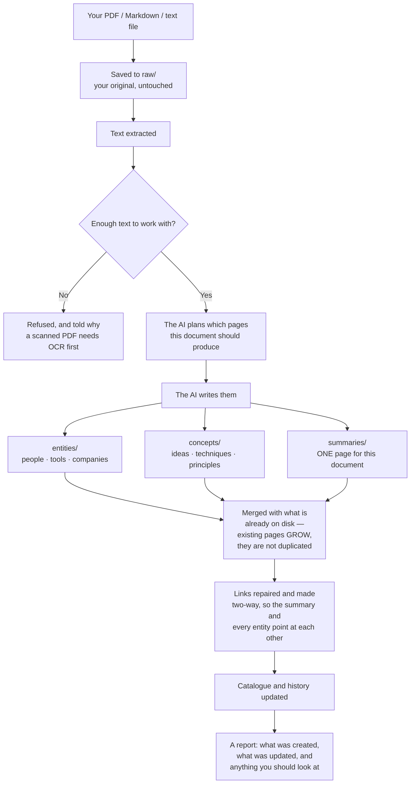

**The part that matters most is the merge.** Ingesting a second document about the same person does not create a second page about them — it adds to the one that exists. That is why the wiki gets *better* the more you feed it, rather than just bigger, and it is the whole difference between this and a folder of files.

### Supported file types

| File type | Extension | Example use |
|-----------|-----------|-------------|
| PDF | `.pdf` | Research papers, book chapters, reports |
| Text file | `.txt` | Articles you've copied, lecture notes |
| Markdown | `.md` | Notes from other apps, written summaries |

> **PDF tip:** Only text-based PDFs work. If a PDF is a scanned image (like a photo of a page), the text cannot be extracted. In that case, copy-paste the text into a `.txt` file instead.

### How to ingest

![The Ingest view. Down the left, an icon rail with Ingest highlighted. Beside it a panel headed "Ingest" with a "+ Choose files" button and a DESTINATION list of six domains — Articles, Business, Lectures, Posts, Projects, Research — each showing a page count and a last-write date, with Articles ticked as the current destination. The main column is headed "Ingest" over the eyebrow "THE WAY MATERIAL GETS IN", and holds a Domain dropdown set to Articles and a dashed drop zone reading "Drop a source here or browse your files", "Accepts .txt .md .pdf", "2 or more files at once starts a batch", above an Ingest button.](images/curator-ingest.png)

1. Click **Ingest** in the rail
2. Pick a **destination domain** — from the picker, or from the **destination list** in the panel beside the rail
3. Drag your file onto the drop zone — *"Drop a source here / or browse your files"*, with *"2 or more files at once starts a batch"* underneath — or click **browse your files** to pick one
4. Click **Ingest**
5. Wait. A progress bar names the current step ("AI is analyzing the document…") with a percentage and a running timer beside it. This usually takes **15–60 seconds** depending on the document length. Do not close the browser or refresh the page. See *Understanding the progress bar* below if it looks like it's stuck.
6. When it finishes you get a specific result, not a "Done!" — e.g. *"Wrote 7 new pages · updated 4 existing · +6.1 KB"* — followed by the full list of pages created or updated

> The chat sidebar also shows a drop zone. It is **not connected** — it says so on itself, and clicking **Ingest** on it brings you here. Ingesting from chat isn't wired up yet.

**The panel beside the rail is a destination list.** Every other view's side panel is a list of the things that view acts on, and Ingest's is the place your file is about to land: one row per domain, each showing how many pages it holds and when it was last written to. That second figure says *last write* rather than *last ingest* on purpose — compiling a conversation writes to a domain too, and calling that an ingest would be wrong. While something is being written, the rows are **disabled rather than hidden**, so the list doesn't rearrange itself under your cursor mid-run.

**The drop zone answers two different questions.** Hovering it looks one way — *you could drop here* — and dragging a file over it looks another, louder way — *let go and this happens*. They are deliberately distinct states, not one highlight doing double duty.

### Batch ingest — queue many files at once

If you select **two or more files**, The Curator switches from the single-file flow above into a **batch queue**: one durable, resumable job that ingests every file, one at a time, and survives you closing the browser tab or even restarting the app. Selecting a single file still uses the plain flow described above — nothing about it changes.

**You don't have to choose them all at once.** Selections *add up*, so you can build a batch from as many folders and as many drops as you like: pick a few files, then pick a few more from somewhere else, or drop one file and then drop three more — they all join the same queue rather than replacing what you already chose. The confirm screen lists everything currently queued, with an **× on each file** to drop it, **Add more files** to keep going, and **Clear all** to start over. Adding the same file twice does nothing — files are matched on name and size, so re-picking a folder won't queue anything twice. The cost estimate recalculates every time the list changes.

Once you're in batch mode you stay there, even if you remove files until only one is left — a one-file batch is perfectly valid. Only **Clear all** takes you back to the plain single-file flow.

**1. You see a cost estimate first — nothing is spent yet.** As soon as you pick your files, The Curator shows a confirm screen: every file that will be included (largest first — see below), any files it won't accept (wrong file type, over 50MB), and an estimated cost range in dollars and tokens. **No file is uploaded and no AI call is made until you click Start batch.** You're free to cancel at this screen at no cost.

> **The single most counter-intuitive thing about ingest cost: it depends on how big your wiki *already* is, not just on the files you're adding — and there's no single "roughly twice as much" rule of thumb.** Every ingest call re-sends the list of your domain's existing pages, so the AI can link to what's already there instead of creating duplicates. That overhead is a near-fixed cost per AI call, so it weighs far more heavily on a short note than on a long document. Measured against a real ~3,300-page wiki versus an empty one, the *same* document costs roughly **39x** more as a 2 KB note, **27x** more as a 5 KB short article, **15x** more as a 13 KB article, **3.3x** more as a 40 KB chapter, and **2.1x** more once a document is long enough to hit the per-ingest size cap. The confirm screen doesn't guess at any of this — it computes the real ratio **for the files in front of you** (the same files, run through the same estimator, against your domain versus an empty one) and shows that number, not a generic multiplier.
>
> **There's also a size where cost jumps, not just tapers.** Around 15,000 characters, a source crosses from being handled in a single AI call to The Curator's multi-phase pipeline (see below). That roughly doubles the input tokens for the same document — so two similar-looking files just either side of that line can show noticeably different estimated costs, and that's expected, not a bug.
>
> **The estimate is a range, not a ceiling.** `usdLow` assumes prompt caching kicks in; `usdHigh` assumes it doesn't. Real spend can land above `usdHigh` — on one real measured batch it came in at just over 103% of the high estimate. Treat the range as your best guide going in, not a guarantee of the final bill.

**2. Files are processed one at a time — always.** Even with a hundred files queued, The Curator ingests them strictly one after another, never in parallel — this is enforced as a hard guarantee, not just an ordering convention: even if you double-click Start, open two tabs, or otherwise fire off several requests for the same batch at once, only one file is ever being ingested at any instant. This isn't a speed limitation, it's a correctness rule: two files ingesting into the same domain at once would each start out believing the same set of pages already exists, and both could try to create (say) `openai.md` at the same time — producing two competing versions instead of one properly merged page. Processing one at a time is what keeps every page merging correctly. For the same reason, while a batch is actively working on a domain, the single-file **Ingest** button for that *same* domain is disabled (you can still start a normal single-file ingest into a *different* domain — a batch on `articles` doesn't stop you from ingesting into `projects`).

**3. The biggest files go first.** Within a batch, The Curator ingests the largest document first and works down to the smallest. Bigger documents build up more of the wiki's vocabulary (entities, concepts) early, so the smaller files later in the batch get to link into an already-richer wiki instead of starting from nothing.

**4. Pause, resume, cancel — you stay in control, and Cancel really does stop.**

- **Pause** finishes the file that's currently ingesting, then stops. It never interrupts a file partway through — that's what makes it the safe, "nothing is ever left half-done" option. Resume it whenever you like.
- **Cancel** stops the batch **and stops the file that's currently ingesting, right away** — it interrupts at the next AI call rather than waiting for the file to finish. On a large multi-part document that used to mean watching the batch keep spending for minutes after you clicked Cancel while it finished the file it was on; now it stops within a fraction of a second. Files that hadn't started yet are left as **not started**; anything already fully ingested before you clicked Cancel stays in your wiki — cancelling never undoes completed work.
- **Resume** continues exactly where the batch left off.

**Pause and Cancel are deliberately NOT the same kind of "stop," and it's worth knowing which one you're clicking.** Pause is lossless by design — it only ever stops between files, so nothing is ever caught mid-write. Cancel means "stop spending, right now," and accepts a small, honestly-labelled cost for that: the file that was interrupted shows as **Stopped**, with a note that says *"Stopped partway through — some pages may already have been written. Re-ingest this file to complete it."* In practice, an interrupted file usually has written nothing yet — The Curator only writes pages to your wiki after the AI has finished planning and generating content for that file, and Cancel interrupts before that point far more often than after it — but the wording is deliberately cautious rather than promising a guarantee it can't make. Nothing is ever deleted or rolled back by Cancel. To finish a **Stopped** file, re-ingest it — since it's already recorded in `raw/` as started, you'll need to tick **Overwrite** on the re-ingest (the same "already ingested" rule that applies to any file you deliberately re-run).

**Dismissing a finished batch.** Once a batch has finished, been cancelled, or failed, a **Dismiss** button clears the panel and returns the Ingest view to normal. Dismiss only tidies your screen — it doesn't delete anything or undo any work, and it's deliberately unavailable while a batch is still live so you can't accidentally hide something that's still running.

**5. The batch can pause itself — here's what each reason means and what to do:**

| Paused because... | What happened | What to do |
|---|---|---|
| **The AI provider rate-limited us** | The Curator already retried with backoff and still hit the limit. Nothing was lost. | Wait a few minutes, then click Resume. |
| **The AI provider is temporarily unavailable** | Same idea as rate-limiting, but the provider itself is briefly down rather than throttling you. The Curator already retried with backoff. Nothing was lost — this is on the provider's side, not yours. | Wait a few minutes, then click Resume. |
| **Budget cap reached** | You set an optional dollar cap (see below) and the batch reached it. | Raise the cap, or resume without one, to keep going. |
| **3 files failed in a row** | Three files in a row failed, for any reason — often a sign something systemic is wrong (an unexpected file type, a domain problem), not just one bad document. | Check the error messages on the failed files before resuming. |
| **The app restarted mid-batch** | You (or an app update) restarted The Curator while a file was mid-ingest. | The interrupted file will safely re-run from the start — see below. Just click Resume. |
| **This domain is locked** | Another process (an app update, a sync, or the My Curator MCP) is writing to this domain right now. | Wait for it to finish, then Resume. |
| **Paused** (no other reason shown) | You clicked Pause yourself. | Resume whenever you're ready. |

**6. You can close the tab — or even restart the app.** The batch lives on the server, not in your browser tab, so closing the tab doesn't stop it. Come back later, or just reopen the Ingest view, and The Curator shows you the batch exactly where it stands, reattaching to the live progress if it's still running.

If the **app itself** restarts mid-batch (a crash, or an update), the batch is deliberately **never resumed automatically** — spending money while you're not there to see it is not a decision The Curator makes for you. Instead, whichever file was mid-ingest when it stopped is safely reset to "waiting," and the batch pauses with an "app restarted" message. **Re-running that file is completely safe.** Ingesting the same source twice never creates duplicate pages — the same file always lands on the same summary page, and every entity or concept page it touches merges instead of duplicating. Just click Resume when you're ready to continue.

**7. Files you've already ingested are skipped — and you're told before anything is spent.** If a file in your selection was already ingested into this domain, The Curator marks it **Skipped** the moment you create the batch, before a single file is uploaded or a single AI call made. You'll see it called out on the confirm screen and in the panel, so you know up front rather than discovering it partway through a batch you've already paid for. Tick **Overwrite existing pages for files already ingested** on the confirm screen if you actually want to re-ingest a file that was skipped for this reason.

**8. When the batch finishes: an aggregate report, plus a free Health check.** Once every file has been processed (or skipped, or failed), the panel shows a summary — how many completed, how many failed, how many were skipped, total pages written, total warnings, and total spent. The Curator then automatically runs a **free, local Wiki Health scan** (no AI cost) across the whole domain and shows the results — broken links, orphans, and so on — so you can see the batch's overall effect on your wiki in one place. To act on anything it found, open **Domains**, pick that domain, and use its **Wiki health** panel ([§17](#17-wiki-health)).

**About the spend figure on a cancelled batch.** If you cancelled the batch, the total is shown as **"at least $X"** rather than a flat number. That's honest, not vague: the AI call that was in flight when you clicked Cancel is never billed back to us in a way we can measure, so every dollar counted was really spent but the last fraction of one is missing. (Separately, if the model in use has no published price, the figure reads **"approx. $X"** instead — that one is an estimate share and can land either side of the real number.)

**9. Optional: set a budget cap.** On the confirm screen you can set a dollar amount as a spending cap for the batch. Once the running total reaches that cap, the batch pauses (see the table above) rather than continuing to spend. Leave it blank for no cap. If the AI model currently in use has no published price on file (this can happen with a custom/override model), The Curator refuses to accept a cap at all rather than accept one it can't actually enforce — you'll see a clear message explaining why. The batch itself still works fine without a cap; only the cap is refused.

### Understanding the progress bar (v3.0.17)

While an ingest runs, the progress bar shows the current step (e.g. *"Phase 1: planning wiki structure…"*) with a percentage next to it. On a large document, that percentage can sit at the same number for a minute or more. **This is normal — it does not mean the ingest is stuck.**

Here's why: several steps are a single request to the AI, and there's no way to show "70% done" partway through one AI response — it's either still working or it's finished. Planning the structure for a long document (Phase 1) is exactly this kind of step, and it's the one most likely to look frozen even though nothing is wrong.

Two things make this clearer:

- **A running timer** next to the percentage (e.g. `42s`, then `1m 15s`) counts up every second for as long as the current step is working. If the timer is moving, the AI is working. If you ever see the timer stop moving *and* nothing changes for several minutes, something has genuinely gone wrong — refresh the page and try again.
- **A short note under the progress bar** says: *"Large documents can take a minute or more per phase — especially planning. The timer above keeps ticking while the AI works; it isn't stuck."*

**If the AI provider is briefly overloaded**, The Curator automatically waits and retries (see [§19](#19-api-keys-cost--free-tier)). During that wait, the progress label turns **amber** and the bar pulses gently, e.g. *"Service busy — retrying in 9s… (attempt 2/3)"*. The timer keeps counting through these retries instead of resetting — so if a step needed two retries before succeeding, the timer shows the whole time it actually took, not just the final attempt.

**In short:** a still percentage with a moving timer = working normally. A frozen timer with no error message = worth refreshing and trying again.

### What happens automatically

The AI reads your document and creates:

- **1 summary page** — the key takeaways in bullet points
- **Entity pages** — one page for each person, tool, company, or framework mentioned
- **Concept pages** — one page for each key idea or technique
- **Cross-references** — every page links to related pages
- An updated **index** — a master catalog of everything in this domain
- A **log entry** — a record of this ingest with today's date

On the second, third, and subsequent ingests, the AI reads what's already in the wiki and *updates* existing pages rather than duplicating them. The more you add, the smarter it gets.

### How big a document can The Curator handle?

Gemini 2.5 Flash Lite has a **1,048,576-token context window** (~1 million tokens, roughly 700,000 English words). In principle, a single ingest could swallow an entire 300-page book.

In practice, The Curator's ingest pipeline currently caps the **input** at 80,000 characters (~20,000 tokens) per ingest to keep latency and cost predictable. **If your source is longer than that, you'll see a red ⚠ Attention entry on the result panel telling you exactly how much was processed and how much was dropped** — content past the cap is not seen by the AI. For long sources, split by chapter or use the multi-phase pipeline (kicks in automatically for inputs > 15k chars):

1. **Phase 1** — outline pass: the AI reads the whole document and produces a list of pages to write (with a required-coverage checklist: one summary, originator entity, every named person/tool/company, every key concept, consolidation rule for closely related sub-ideas)
2. **Phase 2** — batched content: pages are written in batches of 4 per LLM call
3. **Index merge** — the app appends new rows to `index.md` programmatically (no LLM call), so the index stays consistent even on large domains

**Practical guidance:**

| Document size | Behaviour |
|---|---|
| **≤ 25 pages / ~10–15 k words** | Single-pass ingest (15–60 seconds) — the most common case |
| **25–100 pages / book chapters / long research papers** | Multi-phase pipeline kicks in automatically (~1–5 minutes) — works reliably |
| **200–300 pages / full books** | Multi-phase pipeline still works — possible but **not yet stress-tested at scale**. The 1M-token context is large enough; expect ingest to take 10–20 minutes. If a very long PDF stalls or runs out of token budget, split it into chapters. |
| **Scanned PDFs (image-only)** | Won't work — there's no OCR step. Convert to text first. |

> The 80k-char-per-call cap is conservative; future versions may raise it now that Gemini 2.5 Flash Lite's full 1M window is generally available. For now, splitting very long sources by chapter is the safe bet.

### Tips for better results

- **Use descriptive filenames.** `atomic-habits-summary.txt` is better than `notes.txt` — the filename becomes the summary page's slug (v3.0.1-beta.1+), so the file `report-2024.pdf` always lands on `summaries/report-2024.md`.
- **One document per file.** Don't combine ten articles into one file — each document should get its own file so it gets its own summary page. To ingest many documents at once, select them all and use **batch ingest** (see above) rather than manually combining them or running the single-file flow over and over.
- **Clean up copy-pasted text.** If you paste an article from a website, remove the navigation menus, cookie banners, and footer text first. Cleaner input = better wiki pages.
- **Mind the rate limits on the free tier.** If you're ingesting a batch of 5+ documents and you're on Gemini's free tier, expect to hit `429 RESOURCE_EXHAUSTED` partway through — see [§19](#19-api-keys-cost--free-tier).
- **Watch the warnings panel after each ingest.** If you see "⚠ Source truncated to 80,000 chars" or "⚠ Stub page created", the ingest finished but with reduced quality — the warning tells you exactly what to do. Re-ingesting the same source is safe (see below).

### Understanding the ingest report (what those "warnings" really mean)

When an ingest finishes, you may see a coloured banner at the top of the result panel that says something like *"Ingest finished — 12 notes"*. Despite the older "warning" label, **most of these entries are SUCCESSES, not problems** — they're the Curator's safeguards reporting what they caught and fixed for you. As of v3.0.1-beta.12, each entry is now categorised so you can tell at a glance what needs your attention.

There are four categories:

| Category | Icon | Colour | What it means |
|---|---|---|---|
| **Auto-fixed** | ✓ | green | The Curator detected something the LLM did wrong and **already fixed it**. Nothing for you to do — your wiki is cleaner than it would have been. |
| **For review** | ⚠ | amber | The Curator detected something it **can't auto-resolve**. Read the entry; you may want to act via Wiki Health or by re-ingesting. |
| **Attention** | ⚠ | red | Something material happened — usually source truncation. Read the entry; you may need to split the source or take other action. |
| **Info** | ℹ | blue | Contextual note. Usually safe to ignore. |

The banner's outer border colour matches the most-severe entry, so at a glance:

- **Green border** → everything's fine, the safeguards just did some work
- **Amber border** → one or more items need your review
- **Red border** → source truncation or similar — read the report

#### When one line represents many pages (v3.0.17)

Some issues can happen many times in a single ingest — for example, a dozen pages missing their `.md` extension, or several content batches that each had to be retried. Showing every occurrence as its own line would bury the few entries that actually need your attention under a wall of repeats. A real ingest that used to show 75 separate warning lines now shows 11.

So, any issue that happens **3 or more times** in one ingest is collapsed into a single summary line — e.g. *"12 page paths came back from the AI without the '.md' extension and were written correctly (a, b, c, …and 9 more)"* — instead of 12 near-identical lines. Below that (1 or 2 occurrences), you'll still see the individual entry, because at that count the specific page name is more useful to you than a summary.

**No detail is lost by grouping** — it only affects the warnings banner. Every page written during the ingest, including every one folded into a grouped line, is still listed individually — with its full path and whether it was created or updated — in the change list shown above the warnings.

Two kinds of entries are deliberately **never** grouped, even when they happen many times: semantic near-duplicate redirects, and a newly-injected "trunk" parent page. Both name a specific pair or page you may want to look at individually — folding "12 duplicates were merged" into one line would hide exactly the thing worth double-checking.

#### Full reference of ingest-report entries

| Entry text | Category | What it means | What the Curator did | What you should do |
|---|---|---|---|---|
| *"Outline had N `prefix-*` pages without a parent `concepts/<prefix>.md` — injected the trunk page (granularity-inversion fix)"* | ✓ Auto-fixed | The LLM created several specific sub-concept pages (e.g. `taste-as-moat`, `taste-as-judgment`) but skipped the obvious parent `taste`. | Auto-injected the parent concept page with a clean umbrella summary. | Nothing. You can edit the parent page later in Obsidian if you want richer content. |
| *"Outline omitted originator '<author>' — injected `entities/<slug>.md`"* | ✓ Auto-fixed | The source had a clear byline ("By Dr. X") but the LLM didn't create an entity page for the author. | Detected the byline + injected the missing author entity. | Nothing. |
| *"Outline used originator slug `entities/dr-tali-rezun.md` — redirected to canonical `entities/tali-rezun.md`"* | ✓ Auto-fixed | The LLM used a honorific-prefixed slug. | Redirected to the canonical slug so honorific variants don't pile up. | Nothing. |
| *"Outline proposed `concepts/X.md` — semantic near-duplicate (Jaccard 0.XX) of existing `concepts/Y.md`. Redirected; bullets will merge."* | ✓ Auto-fixed | A new concept slug was ≥85% similar to an existing one (e.g. `experts-roundup-format` vs `expert-roundup-format`). | Auto-merged the new content into the existing page. | Nothing. |
| *"Hub linkification: added N wikilinks across M hub-shaped concept page(s)"* | ✓ Auto-fixed | The LLM wrote a "hub" concept page (one that enumerates many sibling concepts) using plain-text item names instead of `[[wikilinks]]`. | Detected hub-shape pages, found plain-text mentions of siblings, wrapped them in `[[brackets]]`. | Nothing — your hub now connects to all its items in Obsidian's graph. |
| *"The AI invented N extra summary page(s) (...) — merged into the canonical summary '...' instead of creating duplicates"* | ℹ Info | The AI wrote its content for a second, differently-named summary page instead of the one the file name always produces for this source. | Merged the extra summary's content into the canonical one and never wrote the duplicate to disk. | Nothing. Re-ingesting this same source will keep updating the one canonical summary, as intended. |
| *"Page path '...' was missing the .md extension — wrote it as '...'"* | ℹ Info | The AI returned a page path with no file extension (e.g. `concepts/some-idea` instead of `concepts/some-idea.md`). | Added the extension and wrote the page normally — previously this page would have been silently dropped. | Nothing. |
| *"N page paths came back from the AI without the '.md' extension and were written correctly (a, b, c, …and N more)"* (v3.0.17, the grouped form — appears once 3 or more pages hit this in one ingest, see "When one line represents many pages" above) | ℹ Info | Same issue as the row above, happening on 3 or more pages in this ingest. | Same fix, applied to every affected page — grouped into one line instead of listing it N times. | Nothing. Every affected page is still listed individually, with its full path, in the change list above the warnings. |
| *"The AI's first attempt at '...' came back unusable, so The Curator asked for a shorter version and saved that instead. This is real content, but it is briefer than the rest — open it and re-ingest if it reads too thin."* (v3.0.17) | ⚠ For review | The AI's first attempt at writing this one page ran past the response length limit, or came back unparseable. | Automatically retried with a strict "be brief" instruction, and that attempt succeeded. | Open the page from **Domains → Browse pages**. It's genuine content, just shorter than the rest of the wiki — re-ingest the source later if it reads too thin. |
| *"N pages had to be rewritten more briefly: the AI's first attempt at each came back unusable... (examples). These are real content, but they are briefer than the rest..."* (v3.0.17, grouped form) | ⚠ For review | Same as the row above, happening on 3 or more pages in this ingest. | Same brevity retry, applied to each page, grouped into one line. | Same as above — check the pages named as examples, or anything in the change list that reads unusually thin. |
| *"Outline proposed `concepts/X.md` — possible semantic near-duplicate (Jaccard 0.XX) of existing `concepts/Y.md`. Keeping both."* | ⚠ For review | A new concept slug is 50–85% similar to an existing one (probable but not certain duplicate). | Kept BOTH pages because the similarity was below the auto-merge threshold. | Open **Domains → the domain → Wiki health**, then **✨ Find duplicate pages** under QUICK MAINTENANCE. The AI-judged scan will tell you whether they're truly the same concept; if yes, merge via the Preview-then-Merge flow. |
| *"N of M wikilinks (X%) don't resolve to an existing page. Examples: ..."* | ⚠ For review | The LLM mentioned some entities in body text that weren't on the page plan, leaving phantom links. | Wrote the pages as-is with the broken links visible. | Open **Domains → the domain → Wiki health** → expand Broken links → use **Ask AI** to either find the right target or strip them. Or re-ingest with broader coverage if it's a content gap. |
| *"Stub page created: `<path>` — AI failed to write content for this page"* | ⚠ For review | The LLM failed to generate content for a planned page even after the page-by-page fallback and the v3.0.17 brevity retry above. | Wrote a clearly-marked stub with the LLM's planned summary preserved. | Re-ingest the source. The stub page has a `stub` tag so you can find it. |
| *"The AI wrote N page(s) that were not in its own plan (...). They were kept — check them"* | ℹ Info | The LLM wrote a page it never listed in its own outline — sometimes a legitimate addition, sometimes a near-duplicate under a slightly different name. | Kept the page rather than silently discarding content you paid for. | Open it from **Domains → Browse pages**. If it duplicates an existing page, delete it (or merge it manually); otherwise, nothing to do. |
| *"Source truncated to 80,000 chars (was X chars). Content past the cap not seen by the AI."* | ⚠ Attention | The source was longer than the 80k character cap. | Truncated the input and warned you. The pages it DID write are still good. | Split the source by chapter/section and re-ingest each part. Or wait for a future release with chunk-and-recombine support. |
| *"Could not extract text from `<file>`"* | ⚠ Attention | The PDF is encrypted, scanned (image-only), or malformed. | Refused the ingest and rolled back the raw file so retry isn't blocked. | Run OCR on the PDF (macOS Preview → Tools → Adjust Text → OCR, or `ocrmypdf` on the command line). Or copy the article text into a `.md` file. |
| *"Refused an unsafe/malformed page path '...' — nothing was written"* | ⚠ Attention | The AI returned a page path that can never be a valid wiki page (e.g. empty, a folder with no filename, or containing characters that aren't allowed). This is rare and is a hard safety refusal, not an auto-correction. | Refused to write that one page — every other page from the same ingest still wrote normally. | That one page's content was lost. Re-ingest the source; if it recurs on the same source, open an issue — this shouldn't normally happen. |
| *"Claude / Gemini hit the output token limit (N tokens)"* | ⚠ Attention | The LLM's response was cut off mid-write and every automatic recovery attempt for that call was exhausted. Rare — most token-limit hits now recover automatically (see the batch and page entries below, and the planning-recovery entry further down). | Reported the failure honestly — this specific case is NOT transient, retrying the exact same call hits the same wall. | Split the source into smaller parts and ingest each separately. You can also **pick a model with a bigger output ceiling** in **Settings → Providers & keys** — every model row shows its ceiling. On Anthropic, `claude-sonnet-4-6`, `claude-sonnet-5`, `claude-opus-5` and `claude-opus-4-8` allow 128,000 output tokens where the default `claude-haiku-4-5` allows 64,000; every Gemini model on offer allows 65,536. Switching *provider* is also worth trying for the same reason. See [§16b](#16b-choosing-your-ai-model). |
| *"Batch N of M was too large for the AI's output limit — wrote those pages individually instead."* (v3.0.17) | ℹ Info | A group of up to 4 pages the AI was writing together didn't fit in one response. | Automatically retried the same pages one at a time instead of as a group. Nothing was lost. Different from the "hit the output token limit" entry above — that one is an unrecoverable failure; this one is a normal, successful recovery. | Nothing. This just means the ingest took a little longer than usual. |
| *"N content batches were too large for the AI's output limit — those pages were written one at a time instead. Nothing was lost; the ingest just took longer than usual."* (v3.0.17, grouped form) | ℹ Info | Same as the row above, happening on 3 or more batches in this ingest. | Same per-batch recovery, grouped into one line. | Nothing. |
| *"The AI returned a page with no path — it could not be written."* (v3.0.17) | ℹ Info | The AI's response for one planned page arrived with no file path attached, so there was nothing to write it to. | Skipped that one page. Nothing else in the ingest was affected. | That page's content did not make it into the wiki. Re-ingest the source, and check the result for anything that seems to be missing. |
| *"N pages came back from the AI with no file path, so they could not be written. That content did not make it into the wiki..."* (v3.0.17, grouped form) | ℹ Info | Same as the row above, happening on 3 or more pages. | Same skip-and-report handling, grouped into one line. | Same as above — re-ingest the source and check the change list for anything missing. |
| *"While planning the page list, the AI ran past its response length limit… The Curator asked again for a shorter plan and that succeeded, so the ingest completed. Note that the retry explicitly asks for FEWER, broader pages, so the page list below is coarser than a first-attempt plan would have been… Planning took N AI calls instead of 1, and your source document was sent to the AI twice."* (or the same message opening with *"The AI's first page plan came back as malformed JSON"*) (v3.0.17) | ℹ Info | On a large or unusual document, the AI's first attempt at planning which pages to write either ran past its own response limit or came back malformed. | Automatically asked again with a stricter, more concise prompt, and that succeeded — the ingest completed normally. | Nothing required. But be aware: because the recovery prompt explicitly asks for fewer, broader pages, the resulting wiki is genuinely **coarser** than a first-attempt plan would have been — some detail may be grouped under one parent page instead of getting a page of its own. If a topic feels under-covered, re-ingest to try again (the AI's output varies from run to run), or split the source and ingest the parts separately. |
| *"An ingest is in progress for `<domain>` — please wait"* | ℹ Info | You clicked Sync, Update, or Delete-domain while an ingest was running. | Refused the conflicting operation with a 409. The Update / Sync / Delete buttons auto-grey while an ingest runs, so you usually won't see this. | Wait for the progress bar to finish, then retry. |
| *"Another process is already writing to `<domain>` (file lock held)"* | ℹ Info | The MCP via Claude Desktop tried to write while an in-app ingest is running. | Refused the MCP write — the in-app ingest takes priority. | Wait for the in-app ingest to finish. The lock auto-clears after 30 minutes if a process crashed; you can manually delete `<domain>/.write-lock` if needed. |
| *"This domain has grown large enough that the AI request had to be trimmed: N of M entity/concept pages were left out..."* | ℹ Info | **Very rare** — only appears on an extremely large domain (thousands of pages in a single folder), where the full list of existing page names would be too big for the AI to read in one request. | Kept only the most relevant existing pages in the AI's request instead of failing the ingest outright. The full, untrimmed page list is still checked separately for near-duplicates after the AI responds, so this doesn't weaken duplicate protection. | Nothing, usually. If a near-duplicate page appears anyway, merge it from **Domains → the domain → Wiki health → ✨ Find duplicate pages**. |

Below the change list and warnings, you'll also see a compact **token & cost footer** — see the next section.

#### Understanding the token & cost footer (v3.0.17)

Below the change list and any warnings, a small line reports the real API usage for this specific ingest — not an estimate. It looks something like:

> `gemini · gemini-2.5-flash-lite   4 calls   38,204 in / 6,112 out   24,900 cached read`

Reading it left to right:

- **Provider · model** — which AI service and model handled this ingest.
- **N calls** — how many separate requests were made to the AI. A short document is usually 1 call; a longer one that needs the multi-phase pipeline (see above) makes several — one for planning, plus one per batch of pages.
- **X in / Y out** — input and output tokens. Input is roughly your source document plus the AI's instructions; output is the wiki pages it wrote back.
- **cached read / cache write** (shown only when non-zero) — on longer, multi-batch ingests, The Curator reuses parts of the prompt across batches instead of re-sending them every time. "Cached read" tokens are the ones it reused — reading from cache costs a small fraction of a normal input token, so a large cached-read number is where the caching saving (see [docs/ingestion-pipeline.md](ingestion-pipeline.md) §8.1 for developers) actually shows up. "Cache write" is the one-time, slightly-more-expensive cost of setting that cache up on the first batch.

You don't need to act on anything here — it's informational, useful if you're curious what an ingest actually cost, or comparing providers.

### What is Jaccard similarity? (for the semantic-dupe entries)

Several entries above mention a "Jaccard 0.XX" score. Jaccard similarity is a simple math measure of how similar two sets are. The Curator uses it to detect concept slugs that are different strings but probably mean the same thing.

The formula (in plain English):

```
similarity = (words both slugs share) / (total unique words across both)
```

Worked examples from a real ingest report:

| Pair | Tokens A | Tokens B | Shared | Unique total | Jaccard |
|---|---|---|---|---|---|
| `the-human-touch` vs `human-touch` | `{the, human, touch}` | `{human, touch}` | 2 | 3 | **0.67** |
| `wisdom-cultivation-accelerates` vs `wisdom-cultivation` | `{wisdom, cultivation, accelerates}` | `{wisdom, cultivation}` | 2 | 3 | **0.67** |
| `expert-roundup-format` vs `experts-roundup-format` | `{expert, roundup, format}` | `{experts, roundup, format}` | 2 (after stem) | 3 | **0.50** raw → **1.0** with stem |
| `community-relationships-deepen` vs `deepening-community-relationships` | `{community, relationships, deepen}` | `{deepening, community, relationships}` | 2 (3 after stem) | 4 | **0.50** |

The scale and what the Curator does at each:

| Jaccard score | What it means | Curator's action |
|---|---|---|
| **0.00 – 0.49** | Independent concepts (share few words) | Keeps both, no message. |
| **0.50 – 0.84** | Possible duplicate, but uncertain | Keeps both + emits a "For review" entry so you can decide via Wiki Health. |
| **0.85 – 1.0** | Almost certainly the same concept | Auto-redirects the new slug onto the existing one. Bullets from the new page merge into the existing one. |

#### Lightweight singular/plural normalisation

Before computing Jaccard, the Curator trims trailing `s` if the resulting token would still be ≥3 chars long. This catches:

- `collections` → `collection`
- `roundups` → `roundup`
- `relationships` → `relationship`

Without this step, `expert-roundup-format` and `experts-roundup-format` would compute Jaccard 0.50 (3 unique tokens, 2 shared). WITH it, they compute 1.0 (same token set after stem) — and get auto-merged. The stem step is conservative on short words: `is`, `as`, `os` are NOT stemmed (would damage real meaning).

#### Why entities are never auto-merged by Jaccard

The Jaccard guard ONLY operates on **concept** pages, never entities. Entities are usually proper nouns (people, companies, countries) where slug variants may genuinely be different things:

- `open-ai` vs `open-source-ai` — Jaccard might be high but these are different
- `microsoft` vs `microsoft-research` — different entities sharing a name
- `tali-rezun` vs `tali-reziuncipher` — could be honest typo or actual different people

For entity dedup, the Curator relies on the structural passes (honorific-prefix strip, hyphen-normalisation, cross-folder dedup) which work on slug shape, not semantics. The Health-side semantic-duplicate scan remains the LLM-judged tool for entity-side merges if you ever need them.

### Related: things you might also see during ingest

These are status messages during the ingest itself (not part of the report banner):

- **"Service busy — retrying in 9s… (attempt 2/3)"** — Gemini API returned HTTP 503 (overloaded). The Curator retries automatically with exponential backoff (3s → 9s → 27s), shown in amber on the progress bar while it waits (v3.0.17 — see *Understanding the progress bar* above). Ingest almost always succeeds after the wait. See [§19](#19-api-keys-cost--free-tier).
- **"AI is analyzing the document…"** — The LLM call is in flight. This can take 10–60 seconds depending on document size — watch the timer next to the progress bar rather than the percentage (see *Understanding the progress bar* above). Don't refresh.
- **"Phase 2: writing content, batch N of M…"** — Multi-phase ingest is processing a batch. Wait for it to finish.
- **"Could not extract text from PDF"** — See the table above.

### Re-ingesting a source (and why it's safe)

If you find an ingested page looks incomplete, or you've updated The Curator and want fresh ingests to apply newer prompt rules to old sources, re-ingest. **The pipeline is fully idempotent on re-ingest (v3.0.1-beta.1+):**

| What could duplicate | What prevents it |
|---|---|
| Summary page | The slug is computed from the source filename, so `report.pdf` always becomes `summaries/report.md`. The second ingest merges into the existing summary — bullets accumulate, no second file. |
| Entity pages (Alice, Google, etc.) | The AI is shown a list of existing entity filenames before it picks slugs, plus `writePage` runs three dedup passes (title-prefix strip, hyphen-normalised match, cross-folder dedup). Same entity = same file = bullets merge. |
| Concept pages | Same mechanism as entities. |
| Index rows | The index is updated programmatically — rows for slugs already mentioned are skipped. |
| Bullets within sections | After every write, `deduplicateBulletSections` removes any duplicates produced by the merge. |

**How to re-ingest a single source:**

1. Open **Ingest** in the rail and pick the same domain
2. Drop in the same file again (or browse to it) and click **Ingest**
3. The Curator recognises it and stops before spending anything: *"**&lt;filename&gt;** has already been ingested into this domain."*
4. Click **Re-ingest & update wiki** to proceed, or **Cancel** to back out

The result panel will show which pages were "updated" vs "unchanged" — you can confirm at a glance that nothing was duplicated.

> There is no list of previously-ingested files in the app — re-ingesting means handing The Curator the file again. The original files live in `domains/<domain>/raw/` on the machine you ingested them on, if you need to find one.

> In a **batch**, the same check happens at the confirm screen instead: already-ingested files are marked **Skipped** before anything is uploaded, and the **Overwrite existing pages for files already ingested** checkbox re-includes them.

**To re-ingest every source in a domain** (after a Curator update with significant ingest improvements, for example):

```bash
node scripts/bulk-reingest.js <domain>
# e.g.: node scripts/bulk-reingest.js articles
```

There's a 3-second pause between files by default to avoid rate-limit hits on the free tier. Add `--delay=5000` for slower pacing.

---

## 9. Chat with your brain

After ingesting a few sources, you can have a full multi-turn conversation with your knowledge base. The AI answers from your wiki pages only, cites its sources, and remembers the entire thread — even after you restart the server.

> **Chat retrieval (v3.0.1-beta.13)** — the chat now uses three layered techniques to find the right pages for your question:
> 1. **Entity pivot** — if your question mentions an entity that exists in your wiki (a person, tool, company, etc.), chat automatically loads that entity's page AND every summary it backlinks to. So "list articles by Dr. Tali Rezun" loads her entity page plus all 50+ summaries that reference her, not just the few summaries with "tali" or "rezun" in the filename.
> 2. **Author-aware catalogue** — every summary in your domain shows up in the catalogue with a "referenced by: X, Y, Z" suffix listing which entities link to it. The chat can enumerate "everything by X" from this catalogue alone.
> 3. **Intent detection (v3.0.8)** — the chat reads what you're actually asking and shapes the answer to match: a **decision** question ("which of these should I write — recommend one") gets a direct recommendation up front; a **list** question ("list all…", "how many…") gets a focused, de-duplicated list; everything else gets a synthesised answer. It classifies your *question* (not text you paste in), so a word like "everything" buried in pasted notes no longer turns a recommendation request into a full-domain dump.
>
> **This is what makes chat work on large mature domains** (3,000+ pages, multi-megabyte wikis). Earlier versions hard-truncated wiki content at 90 KB and dropped 98% of pages on large domains; beta.11 added keyword scoring; beta.13 added entity-pivot + author metadata + intent detection.

### Best practices for asking the chat questions

- **Mention specific entities** when you want comprehensive coverage: *"What articles do I have by Dr. Tali Rezun?"* triggers entity pivot. *"What articles do I have?"* doesn't.
- **Be explicit about enumeration** when you want a complete list: *"list all"*, *"how many"*, *"name every"* trigger the enumeration prompt. *"summarize"*, *"explain"*, *"tell me about"* trigger the synthesis prompt.
- **Specific is better than vague**: *"What does my wiki say about HNSW vs IVF?"* finds the right pages. *"Tell me about vector search"* is much broader and may hit the catalogue fallback.
- **For comprehensive author/topic queries, the My Curator MCP via Claude Desktop is even more thorough** — its `get_backlinks` tool gives the canonical, complete list. The in-app chat is best for content questions; MCP is best for graph-traversal queries.

### The composer — Length and Model selectors

The message box has its controls tucked along its own bottom edge, to the left of the **Send** button:

- **Length** (always shown) — Concise · Balanced · Detailed, described below.
- **Model** — pick the exact model that answers your chat messages. Each row shows its id, its price per 1M tokens as billed today, and one plain line: any warning reason first, then how fast it answered when measured. With no key saved there is nothing to choose and the picker is hidden. Full explanation of the markers: [§16b](#16b-choosing-your-ai-model).
- There is **no attach button** — you can't ingest a file from the chat box. Use **Ingest** in the rail.
- Alongside them, a short note reminds you that what a message costs depends on how long the answer runs.

#### The menu shows a working set, not two hundred rows

An OpenRouter key can put roughly two hundred models within reach. Dropping all of them into a menu you open mid-conversation would make switching models harder, not easier. So the menu shows a **working set**: the model you're on, any you've **starred**, the ones you've **used recently**, and every model that has actually been **measured** — by us or by you.

Two details make this predictable rather than clever:

- **The order is the catalogue's, not your recency.** Membership changes as you use the app; **position doesn't**. A model does not jump to the top because you used it last, so the menu doesn't have to be re-read every time you open it.
- **It only collapses when collapsing actually saves you something.** If the catalogue is small (**24 models or fewer**), or the working set isn't genuinely shorter than the full list, everything is shown and no *browse* row appears — because a "see everything" link leading to a list already on screen is just a wasted click.

When it does collapse, a **browse** row opens the full catalogue with **search** (matching the model id or name, vendor prefix included), a **provider** filter, and a **free-only** filter. A running count tells you how many of how many you're looking at, and if a filter leaves nothing, one click clears it. **Every model stays reachable** — nothing is hidden from you, only deferred.

> **Starring works in the browse dialog**, where each row carries a star you can toggle. In the composer menu the star is shown but is not clickable — a menu row is a single choice, and burying a second control inside it is a known way to make menus behave badly.

#### The keyboard works everywhere now

Every dropdown in the app is drawn by The Curator rather than by your operating system, which means keyboard behaviour is consistent and is ours to get right: **arrow keys** move (and open a closed menu), **Home/End** jump to the first and last option, **Page Up/Down** move by a screenful, **Enter** commits, **Escape** closes and changes nothing, **Tab** closes without committing, and **typing** jumps to a match — by prefix first, then anywhere in the name, so typing `opus` finds a model whose id begins with a vendor prefix. Typing the same letter repeatedly cycles between matches. Typing never commits blindly.

Both pickers open **upward**. Both choices are remembered in your browser between questions — the model you pick stays picked for every later chat message from this browser, across conversations and across restarts, until you pick a different one.

#### Ask the same question again, on a different model

Any answer can be **re-asked with another model**. It takes the question that produced that answer, keeps you in the same conversation, and sends it again to a model you choose. **Both answers stay in the thread**, each labelled with the model that actually produced it and what it cost — so you are comparing two real answers side by side rather than remembering what the first one said.

Two things worth understanding before you use it:

- **It is a second opinion, not an independent run.** Prompts are built from the recent messages in the conversation, so the second model can usually *see* the first answer. The app tells you which situation you are in at the moment you pick — whether the earlier answer is still inside that window, or has fallen outside it — because "asked fresh" and "asked knowing what the other one said" are different questions with different answers.
- **Picking the model sends immediately.** There is no separate confirmation step, so treat the model list as the decision point. It costs one ordinary chat message on the model you pick.

This is the **chat lane**, and it is sealed off from the rest of the app: ingest, Compile and Health scans all keep using the model set in Settings, no matter what you pick here. That is the design — *one model builds your brain; you choose freely when talking to it* — and [§16b](#16b-choosing-your-ai-model) explains why the two lanes are separate and why the build side is a single setting rather than one per feature. Because the choice is sticky, **each answer displays the model that actually produced it**, so a selection you made and forgot is always visible on the answers themselves rather than only in the dropdown. Where that figure comes from, and why it sometimes isn't shown at all, is explained just below in [Why a sticky chat choice is safe](#why-a-sticky-chat-choice-is-safe--every-answer-names-the-model-that-produced-it).

### Answer length — Concise · Balanced · Detailed

The **Length** selector controls how much detail you get back. It's independent of the question type above — it changes *how much* the AI writes, not *what shape* the answer takes.

| Setting | What you get | Good for |
|---|---|---|
| **Concise** | A short, direct answer — 1–3 tight paragraphs (or a short list), leading with the point, with the 2–3 most important sources. | Quick lookups, a fast recommendation, checking a fact. |
| **Balanced** (default) | A well-rounded answer — the normal experience. | Most questions. |
| **Detailed** | A thorough answer — more depth and more supporting sources where they genuinely add value. | Research, briefing yourself before writing, exploring a topic in full. |

Your choice sticks between questions and across restarts (it's remembered in your browser). The three settings are reliably ordered — **Concise** is the shortest, **Detailed** the longest — and "Detailed" is more thorough but **never** dumps your whole domain (the same guardrails that keep answers focused apply at every length). Tip: start on **Balanced**; drop to **Concise** when you just want the answer, switch to **Detailed** when you're going deep on a topic.

Answers render with proper formatting — headings, **bold**, bullet lists, and code are shown styled rather than as raw Markdown, and citations appear as tidy `[source: …]` chips.

The chat adapts its answer shape to your question: a **decision** question ("which of these should I write — recommend one") gets a direct recommendation up front with a few supporting citations; a **list** question ("list all articles by X", "how many sources do I have?") gets a focused, de-duplicated list; everything else gets a synthesised answer. You don't need to do anything to trigger this — just phrase the question naturally. If you ever want the exhaustive list behind a focused answer, ask a follow-up like "now list every related page".

> **If an answer ends with "⚠ This answer was cut off…"** — the AI reached the per-reply length limit on a very long answer. The chat now shows you the partial answer (still useful) with a note, instead of failing. Ask a more specific or narrower follow-up (e.g. focus on one of the options, or one section) to get the rest. This is expected behaviour on unusually broad questions, not a bug or a provider outage.

### The chat interface

Chat is the app's default view — it's what you land on. It has three parts:

- **The panel beside the rail** — a **New chat** button, a search box that reads the *contents* of your conversations rather than only their titles, and this domain's history grouped into **TODAY** and **EARLIER**. Click any conversation to reopen it. Hover one for a **trash** button, or tick several and delete them together.
- **A SCOPE bar across the top of the thread** — one pill per domain. **Chat talks to exactly one domain at a time**; click a pill to switch. On the right of that bar you'll see how much is in scope, e.g. *"3,336 pages in scope"* — and, once a conversation has a question in it, the **Compile to Wiki** button.
- **The thread and the composer** below it.

An empty thread opens with *"Ask &lt;domain&gt; anything"*, that domain's page count, and a reminder that answers cite the specific pages they draw from — click a citation to open it.

![The Chat view. A left panel headed "Chat" holds a "New chat" button, a conversation search box and a list of past conversations under the heading EARLIER, each with a checkbox and a message count. Across the top of the main column runs a SCOPE row of coloured domain pills — Articles selected, then Business, Lectures, Posts, Projects, Research — followed by a "Compile to Wiki" button and the readout "3,416 pages in scope". Below it a user question sits in a bubble on the right; the answer beneath it is labelled "THE CURATOR · GLM 5.3 Flash · $0.0037" and renders as a Markdown table comparing five articles against their connections, with wiki concept links highlighted inline and page citations such as "summaries/…md" shown in small monospaced text. At the bottom the composer reads "Ask Articles…" with a model dropdown, a length dropdown reading "Detailed", the note "cost varies with response length", and a send button.](images/curator-chat.png)

> Conversations belong to a domain. Switching the SCOPE pill switches which set of conversations the sidebar lists — and **starts you on a fresh, empty thread** rather than dropping you into that domain's most recent conversation. Switching scope is something you do because you want to ask something new; landing mid-conversation in an old thread read as though the switch hadn't worked.

### Starting a conversation

1. Click **Chat** in the rail
2. Pick a domain from the **SCOPE** pills above the thread
3. Click **New chat** (or just start typing — a new conversation is created automatically)
4. Type your question in the box at the bottom
5. Press **Send** or use `Cmd + Enter` (Mac) / `Ctrl + Enter` (Windows)
6. Watch the answer arrive — it is written out in front of you rather than appearing all at once

> **You are not left staring at a spinner.** The answer streams in as the model writes it, and on some models you also see the model *thinking* first. What each stage on screen means — and the one thing streaming honestly does **not** do — is [just below](#watching-the-answer-arrive--streaming-and-the-thinking-region).

> **No domains yet?** Chat says so and offers a **Go to Domains** button. Chat has no create-domain form of its own — there is exactly one place domains are created, and it's [§10](#10-manage-your-domains).
>
> **A shortcut worth knowing:** in **Domains**, the **Ask this domain** button on a domain's page drops you into Chat already scoped to it.

### Watching the answer arrive — streaming and the thinking region

Chat used to show one spinner for the entire wait. On a fast model that was fine. On a slow one it was several minutes of a turning circle and a clock, with no way to tell the difference between *working* and *hung* — and the honest answer was that you couldn't tell, because there was nothing on screen that changed.

Now the answer is written out in front of you as the model produces it. On some models you also see the model **thinking** before it starts answering.

#### Why the thinking part matters more than it sounds

It is tempting to treat "see the model think" as a novelty. On a reasoning model it is the whole fix.

Measured on `z-ai/glm-5.3-flash`, a model The Curator offers: the model spends roughly the first **86–91% of the turn** reasoning, and produces no visible answer text at all during it. On a 45–99 second turn, the first *thinking* word lands at about **half a second**; the first *answer* word does not land until **38–58 seconds** in.

Streaming only the answer would therefore have left almost the whole wait exactly as dead as it was before. Streaming the thinking too collapses the time before *anything at all* appears from roughly **38–58 seconds to under a second**.

The numbers above are one model on one kind of question, not a promise. A fast model answers in a few seconds and none of this is noticeable; the point is that the slow case stopped being a blank screen.

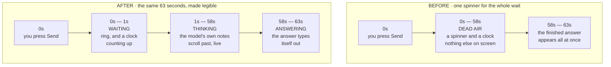

**Read the two rows as the same turn, twice.** The turn is not shorter. Nothing about the model changed. What changed is how much of it you can see.

#### What you see, stage by stage

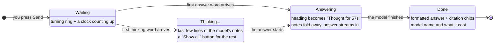

| Stage | Heading on screen | What is shown |
|---|---|---|
| **Waiting** | — | The two-layer ring, with a clock counting up beside it. This lasts only until the first word of *anything* arrives. |
| **Thinking** | *Thinking…* | The last few lines of the model's notes, updating in place. **Show all** opens the full text; **Show less** returns to the tail. |
| **Answering** | *Thought for 57s* | The notes fold themselves away and the answer streams in underneath. **Show reasoning** brings the notes back; **Hide reasoning** puts them away again. |
| **Done** | *Thought for 57s* | The finished answer, now with headings, bold, lists and `[source: …]` citation chips, plus the model that produced it and what it cost. |

Three details worth knowing:

- **The notes collapse on their own the moment the answer begins.** They have done their job by then, and leaving them open would push the thing you actually asked for below a wall of the model's scratch work. Nothing is deleted — the full text is one click away and is never trimmed on the way in.
- **Only the last few lines are shown while it streams.** On the model measured above, a single turn produces 6,700–8,400 characters of notes at 31–38 chunks a second. Rendering all of it live is a firehose that scrolls faster than anyone reads. A few lines, updating in place, says the same thing legibly.
- **The buttons are real buttons.** **Show all** / **Show reasoning** are focusable and reachable by keyboard and screen reader, not hover-only affordances.

#### Three honest limits

**1. Seeing the model think is, in practice, an OpenRouter feature.** This is not a preference and it is not something the app can choose:

| Provider | Answer streams? | Thinking region? | Why |
|---|---|---|---|
| **OpenRouter** | Yes | **Yes**, on models that reason | The provider sends the reasoning as readable text alongside the answer. |
| **Anthropic** | Yes | **No** | Measured live: Claude *does* reason, and the app *does* receive the thinking blocks — but Anthropic returns the deliberation **encrypted**, so what arrives carries no readable text. The listener is wired and will start working the day Anthropic sends plain text; today it correctly shows nothing. |
| **Gemini** | Yes | **No** | The Gemini SDK the app is pinned to has no notion of a thought part at all, so there is nothing to show. |

On Anthropic and Gemini you still get a streaming **answer** — the wait before the first word is short and the text appears as it is written. You simply do not get a thinking region above it. **The app never invents one.** A "the model is thinking" animation with nothing behind it was considered and rejected: an indicator that moves to look busy is exactly the kind of thing that teaches you to stop believing indicators.

**2. Streaming does not make the answer arrive any sooner.** A 63-second turn is still 63 seconds. The model is not faster, the total is not lower, and the cost is identical. What streaming changes is that the wait is **legible** instead of blank. That is worth a great deal when you are deciding whether to keep waiting or press Stop — and it is worth nothing at all if what you wanted was a quicker answer. If you want that, pick a faster model in the composer's **Model** picker; [§16b](#16b-choosing-your-ai-model) lists the measured call times.

**3. The thinking text is the model's scratchpad, not part of the answer.** It is never spliced into the reply, never written into your wiki, and never stored in the conversation record — so it will not be there when you reopen the thread, and **Compile to Wiki** cannot pick it up. Treat it the way you would treat someone's margin notes: useful for watching them work, not a statement they are standing behind.

#### Other things that stayed true, and one that changed

- **Stop still works throughout.** The **Send** button becomes **Stop** for the whole turn, including while text is streaming. Pressing it stops the wait and stops the spending at the next call boundary, hands your draft question back to the composer, and leaves nothing behind in the thread.
- **If a streaming turn fails partway through, nothing is saved.** A half-written answer is not an answer, so the app will not persist one and will not seed your next question with it. You will see the error, and the conversation is exactly as it was before you asked.
- **There is still no progress bar and no percentage.** There is no honest one to draw: a token count is not progress, because there is no total to divide it by. The ring stays in its "running, amount unknown" mode and the clock reports real elapsed time.
- **The "this model was measured at about N per call" note no longer appears on a streaming turn**, and that is deliberate. That figure is a *total call time*. On a streaming turn the clock before the first word is measuring *time to first word* — a different quantity, for which this project has measured nothing. Putting a total beside it would invite arithmetic it cannot support ("186s measured, 25s elapsed, so I'm 13% through"). Silence beats a number that means something other than what you would take it to mean — and the streamed text is itself the proof that nothing is stuck. On a turn that does *not* stream, the note is unchanged.

### What a good reply looks like

```
Retrieval-Augmented Generation (RAG) combines a retrieval step with
generation, so the model grounds its answer in real documents rather
than relying on memory alone [source: concepts/rag.md].

The key advantage over fine-tuning is that you can update the knowledge
base without retraining the model [source: summaries/rag-paper.md].
```

The `[source: ...]` tags tell you exactly which wiki page each claim came from. Click a citation to open that page in the reader overlay ([§11](#11-read-a-wiki-page)), or open it in Obsidian to read the full source.

### Multi-turn memory — and its two real limits

You can keep asking follow-up questions and the AI follows the thread:

```
You:  What is RAG?
AI:   RAG stands for… [source: concepts/rag.md]

You:  How does it compare to fine-tuning?
AI:   As I mentioned, RAG updates knowledge without retraining…
      [source: summaries/rag-paper.md]

You:  Who are the key researchers in this area?
AI:   Based on your notes, the main contributors are…
```

Conversations are saved automatically and persist across server restarts. They are tracked by your knowledge repo, so they travel to your other machines with Sync. You can have as many conversations per domain as you like.

**Two limits are worth knowing, because "memory" oversells what happens.** Earlier versions of this guide said the chat had *full memory of past conversations*. It does not, in two separate ways:

1. **Only the current thread is in scope.** The chat never reads your *other* conversations. If something from a past thread matters, compile that thread to your wiki (see below) — then it is on the graph and retrieval can find it.
2. **Only the recent part of the current thread.** The chat sends the **last 20 messages** — roughly the last 10 exchanges — not the whole transcript. A very long thread quietly loses its own beginning.

A third limit applies to the wiki side and is not a defect but a budget: the chat cannot send your whole wiki, because on a mature domain it is far too large. It selects the pages most relevant to your question — up to **50 pages / about 60 KB** in full, plus a compact catalogue of every page's slug so the model knows what else exists. See [Best practices for asking the chat questions](#best-practices-for-asking-the-chat-questions) above: a specific question retrieves better than a vague one, precisely because the selection is query-driven.

If what you want is context that genuinely survives across sessions and machines, that is a different feature — see [working-state.md](working-state.md).

### Managing conversations

- **Revisit** — click any conversation in the panel beside the rail to reopen it in full
- **Find one** — type in the search box beside the rail. **The search reads the messages, not just the titles.** A conversation's title is only its opening question, trimmed — so searching used to find a thread by how it *started* and never by what it turned into. Now the server searches every message in every conversation of that domain, and a conversation found by its contents rather than its title says so on the row. Searching is debounced as you type and repaints only the list, so the thread you are reading and your place in the composer are undisturbed.
- **Delete one** — hover a conversation and click the trash button that appears
- **Delete several** — tick the checkbox on each conversation you want gone, then use the bar that appears above the list (it also offers select-all and a way to clear the selection). Deletions are confirmed first and run one at a time; if any fail, you are told which, and those stay ticked so you can retry them. Your ticks survive the list refreshing.

> **One wrinkle worth knowing.** The message count on a conversation updates as soon as you send, without a round trip. If you have a search active at that moment, the just-sent message is not re-tested against it until your next keystroke or navigation — so a thread will not leap into the results the instant it becomes a match.

### Good questions to ask

- "What is [concept] and why does it matter?"
- "What are the key differences between [X] and [Y]?"
- "How does [idea from one source] connect to [idea from another source]?"
- "Who are the main people mentioned in my notes on [topic]?"
- "What tools are recommended for [task]?"
- "Summarise everything I know about [topic]"
- "What have I learned about this topic over time?"

> The AI only answers from your wiki. If you haven't ingested any sources about a topic, it will say so honestly rather than making things up.

### Compiling a conversation to your wiki (v2.5.0)

A chat is a great place to think out loud, but the conversation itself is not part of your wiki — it lives in the chat history. **Compile to Wiki** turns any conversation into permanent wiki pages. Use it after a focused brainstorm, a research thread, or a working session whose conclusions you want to keep.

**How it works**

1. Have a conversation in **Chat**. The **Compile to Wiki** button appears on the right of the **SCOPE** bar above the thread as soon as you've asked one question — so even a single sharp question worth keeping can be compiled (v3.0.1-beta.15; previously it needed two messages).
2. Click **Compile to Wiki**. The button reads **Checking cost…** for a moment, then a dialog opens telling you what this compile is estimated to cost and where the pages will land. **Nothing has been spent yet.** See *"What it costs, before it costs it"* below.
3. Click **Compile** in the dialog. *Now* the paid work starts, and a progress bar shows what's happening — loading the conversation, asking the AI to extract durable knowledge, writing pages, syncing entity backlinks, updating the index.
4. After 15–45 seconds a **result card appears inline in the conversation**, right below the last message: how many pages were **created** (✨) and how many were **updated** (✏️), with byte sizes and per-section bullet deltas. Unchanged pages are hidden by default — click *"Show unchanged"* if you want to see them. The card is part of the thread, so it scrolls with the conversation and you can keep chatting underneath it at full size (before v3.0.14 the result opened in a fixed panel above the input box that permanently squeezed the chat area — that's fixed). The card scrolls into view at its top, so the title and the ✨/✏️ counts are always what you see first. Compile again and you get a second card; the cards clear when you switch conversations or start a new chat. If you switch conversations *while* a compile is running, the pages are still written — you just won't see the card, since it belongs to the other conversation.

#### What it costs, before it costs it (v3.27.0)

Compile to Wiki spends real money at your AI provider. Until v3.27.0 it did that the moment you clicked, with no warning and no number. Now every compile goes through a **free, local estimate** and a **confirmation dialog** — and the estimate itself costs nothing: it makes no AI call and no network request at all. It only reads the conversation, the domain schema and the list of pages already in your wiki.

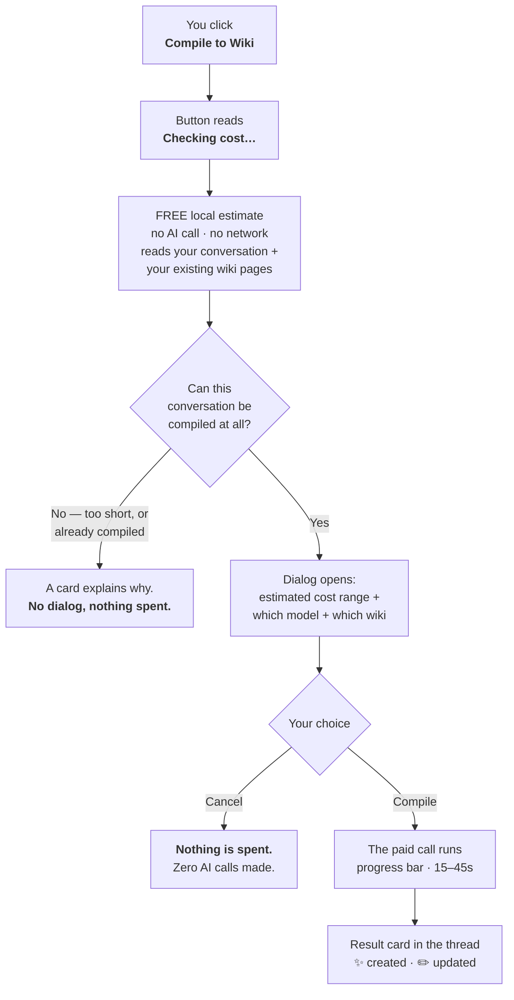

**Why it's a range, not a price.** The dialog says something like *"Estimated cost $0.0003 – $0.0012 on Gemini "gemini-2.5-flash-lite"."* Two numbers, not one, because half the calculation is genuinely knowable and half is not:

| Half of the cost | Known before the call? | Why |
|---|---|---|
| **Input** — the prompt sent to the AI | **Yes, exactly.** | The estimator builds the *real* prompt and measures it character by character. Three identical test runs produced the same input token count every time, to the token. |
| **Output** — the pages the AI writes back | **No.** | How many pages the AI decides to write cannot be known in advance. Three runs on byte-identical input produced 19, 18 and 18 pages — about ±11%. And if the first attempt overruns its output limit, The Curator retries (see *Compiling a very large conversation* below), which costs more. |

The range is deliberately generous on the high side. Across eleven real measured compiles, every actual bill landed **inside** the quoted range — and typically in its lower fifth. Over-quoting is the safe way to be wrong about money.

**The number that surprises people: it's your wiki's size, not your chat's length.** Compile sends the AI a list of every entity and concept page you already have, so it can link into them instead of creating duplicates. That list dominates the prompt. The *same four-turn conversation* measured **5,740 prompt characters on a fresh domain and 12,431 on one holding 180 pages** — more than double, for an identical chat. A long conversation on a small domain is often cheaper than a short one on a large domain.

**Four different things the dialog can say about cost — and it never confuses them:**

| What the dialog says | What it means |
|---|---|
| *"Estimated cost $X – $Y on [provider] "[model]"."* | Normal case. A published price is on file and the range applies. |
| *"…is free to use, so this compile will not cost anything."* | You're on a genuinely free model. This is not the same as "$0.00". |
| *"No published price is on file for … so the cost cannot be shown in dollars."* | The Curator doesn't know this model's price. **Your provider will still bill you.** |
| *"No AI provider is configured…"* | No API key. There's nothing to compile with — add a key in **Settings → Providers & keys** first. |

An unknown cost is always said out loud. The dialog will never render an unpriced or unknown compile as **$0.00**.

**Two more things worth knowing:**

- **If the estimate itself fails**, the dialog still opens and tells you the cost could not be estimated. A broken estimate never silently spends your money, and it never disables a working feature either.
- **A refusal never becomes a dialog.** If the conversation is too short, or you already compiled it, you get the explanation card straight away — you are not asked to authorise a spend that cannot happen.

> Through v3.40.0, the legacy interface at `/old` started a compile with no estimate and no confirmation. That interface was deleted in v3.41.0, so the confirm dialog above is now the only path.

**What gets written**

- **One summary page** under `summaries/` capturing what was learned. Filename is `<conversation-title>-<YYYY-MM-DD>-<short-hash>.md` — the hash makes the slug deterministic, so re-compiling the same conversation never creates a duplicate file.
- **Entity and concept pages** for any people, tools, or ideas central to the discussion — created if new, merged if they already exist in the wiki.
- **Cross-links** between everything: every entity mentioned in the summary gets a backlink to it; the summary references all the entities and concepts.
- An entry in the wiki's `log.md` recording the compile.

The same merge pipeline that handles ingest runs here too: typo-variant slugs are normalised, duplicates are caught, folder-prefix link errors are stripped, summary backlinks are injected automatically.

**Compiling the same conversation twice**

The Curator refuses re-compiles when nothing has changed:

> *Already compiled to summaries/X.md. Send another message in this conversation to extend it, or delete that file in your wiki to start over.*

That message is a **normal outcome, not an error** — on a short conversation it's the most common thing you'll see the first time you try Compile, and nothing went wrong.

This is intentional — a second LLM run on identical input produces slightly different bullet phrasings, and the merge pipeline would silently inflate every related page's section bullets across dozens of files. If you want to add to the compiled summary, send another message in the conversation and click Compile again. The new turn changes the conversation hash → new slug → no collision → a fresh summary file is created alongside the old one.

**Compiling a very large conversation (v3.0.1-beta.27)**

Most compiles finish in one pass. If a conversation is unusually long or dense, the AI can run out of room to write all the pages at once. The Curator now handles this automatically instead of failing:

1. It retries with a **more concise extraction** (fewer, broader pages). If that works, you'll see a small note at the top of the result card: *"compiled with a more concise extraction."*
2. If it's still too large, it falls back to saving **just the summary page** — the conversation is still captured, but the individual entity/concept pages aren't created this time. The note will say so.
3. Only if even the summary can't fit does it stop, with a clear message: *"This conversation is too large or complex to compile… compile a shorter conversation, or split this discussion into separate conversations by topic."*

If you hit step 3, the fix is to compile a shorter thread (or break a sprawling chat into focused ones and compile each). This is an AI output-size limit, not a problem with The Curator or your data.

**Good use cases**

- **Brainstorming sessions** — explore an idea with the AI, then commit the conclusions to the wiki when you're done.
- **Research threads** — ask "what does my wiki say about X, and how does it connect to Y?", then compile the synthesis.
- **Meeting / dictation notes** — paste meeting notes or speak through a tool that types into the chat, then compile to a structured wiki entry.
- **Decision records** — talk through a decision with the AI ("should we use approach A or B?"), then save the reasoning permanently.

**Tips**

- Give the conversation a focused topic before compiling. A wide-ranging chat compiles into a noisy summary.
- Re-read the summary page after compile (**Domains → Browse pages**) — you can edit it directly in any text editor or in Obsidian if you want to refine it.
- The conversation itself stays in the Chat sidebar after compile — compile doesn't delete it.

---

## 10. Manage your domains

A domain is a focused knowledge silo — a dedicated wiki for one topic area. Each domain gets its own AI schema, wiki pages, chat conversations, and Obsidian graph cluster.

**Domains is the hub of the app.** Everything that is *about one wiki* lives here: what's in it, how healthy it is, what pages it contains, and the create / rename / delete controls.

### The Domains view

Click **Domains** in the rail. The panel beside the rail lists every domain under a **KNOWLEDGE** heading, one row each, showing the domain's name and its page count. Two markers can appear on a row:

- **RO** — this is a read-only Shared Brain mirror
- a small dot on the right — this domain has open health issues

Above the list is **New domain**. Click any row to open that domain in the main column.

### What a domain's page shows you

- Its folder path, in monospace: `domains/articles/`
- Its display name, and — if it's a mirror — a **read-only mirror** pill
- A one-line scope sentence: *"A compounding wiki of 3,336 pages — 600 entities, 2,651 concepts, 83 summaries."* (a fourth "other pages" count is added only if any page sits outside those three folders)
- **Rename** · **Delete** · **Ask this domain** — the last of which jumps to Chat, already scoped here
- **Stat cards**: PAGES · ENTITIES · CONCEPTS · SUMMARIES (plus OTHER when non-zero)
- The **Wiki health** panel — see [§17](#17-wiki-health)
- **PAGES** — a **Browse pages** button that opens the full page list, see [§11](#11-read-a-wiki-page)

![The Domains view. A left panel headed "Domains" with a "New domain" button and a KNOWLEDGE list of six domains, each with a coloured identity dot and a page count; Articles is selected and carries a small dot on the right marking open health issues. The main column is headed "Articles" under the path eyebrow "DOMAINS/ARTICLES/", with Rename and Delete buttons and an "Ask this domain" button. Four stat cards read PAGES 3,410 · ENTITIES 609 · CONCEPTS 2,713 · SUMMARIES 88. Below them a "Wiki health" panel shows "Open issues 20, scanned just now" beside Entities, Concepts, Summaries and Dismissed counts, then a row of category chips — Broken links 17, Orphan pages 3, Cross-folder duplicates 0, Hyphen variants 0, Folder-prefix links 0, Missing backlinks 0. A QUICK MAINTENANCE box offers "Fix 17 broken links $0.0030", "Rescue 3 orphans $0.0027" and "Find duplicate pages", above the sentence "Every AI action shows its cost before it runs. If you use GitHub Sync, changes can be undone with a git client — the app has no Undo button yet." Collapsed rows for Broken links, Orphan pages and Dismissed sit underneath, and a PAGES section at the bottom offers "Browse pages".](images/curator-domains.png)

*A domain's page, with the **Wiki health** panel expanded — see [§17](#17-wiki-health). Every AI action in that panel names its price before it runs.*

### Creating, renaming, deleting

- **New domain** — give it a **Name**, an optional **Description**, and pick a **Template**: **Generic** (a balanced starting schema, the good default) · **Tech** · **Business** · **Personal**. The template writes the domain's starting schema, which tells the AI how to categorise what you ingest — you can edit it later. Nothing is written until you click **Create domain**.
- **Rename** — changes the display name immediately. The folder name is chosen by the server and only changes if your new name produces a different one; wiki pages, conversations, and Obsidian links are preserved either way. A **read-only Shared Brain mirror cannot be renamed** — its folder name is what marks it as a mirror — and the app says so instead of letting you try.
- **Delete** — the confirmation names the folder and the exact page count: *"This permanently removes `domains/articles/` and all 3,336 pages in it, including its raw sources and saved conversations. It cannot be undone from inside The Curator."* The button is **Delete permanently**.

If one of these is refused because something else is writing to that domain right now (an ingest, a sync, an MCP write), you get a clearly-marked **"Not done — the server refused this."** message in the same card — not a silent failure. Wait for the other operation to finish and try again.

Changes are reflected everywhere in the app and in Obsidian instantly — no restart needed. If sync is configured, run **Sync now** soon after a rename or delete so your other computers stay consistent.

> 📖 **Going deeper?** The full reference — schema anatomy, manual setup, custom templates for History / Health / Legal / etc., and (importantly) **how domains relate to each other** (siloed by default, accidental Obsidian edges, the four-level model) — lives in **[docs/domains.md](domains.md)**.

---

## 11. Read a wiki page

Reading a page is not a place you navigate to — it's an **overlay** that opens over whatever you were doing, and closes again. There are two ways in.

**From a chat answer.** Click any `[source: …]` citation. The page the answer drew from opens immediately, so you can check the claim without losing the conversation underneath.

**From a domain's page list.** Open **Domains**, pick a domain, scroll to **PAGES**, click **Browse pages**. You get:

- a **Filter by name…** box that narrows the list as you type
- tabs — **All · Entities · Concepts · Summaries** — each with its own count
- one row per page, colour-dotted by type, with its full path in monospace

Click a row to open it. Very large lists render the first 150 matches with a note telling you to narrow the filter to see the rest.

### Inside the reader

The overlay shows the page's path across the top, its title, a coloured type badge (`entity` / `concept` / `summary`) and any tags, then the page body **rendered as proper Markdown** — headings, bold, lists and code appear styled, not as raw `##` and `**` source. Below the body is a **BACKLINKS** list of every page that links to this one; **click a backlink row and the reader loads that page**, so you can walk the graph without leaving the overlay.

**To close it:** press **Esc**, click the dimmed area outside it, or click the **✕**. It also closes on its own the moment you click anything in the rail — an overlay never survives a change of view.

> `[[wikilinks]]` inside the page body are highlighted but **not clickable** in the reader today. Use the backlinks list, or open Obsidian, to follow links forward.

For a much richer experience — including the interactive knowledge graph — use Obsidian (see the next section).

### Finding the original document behind a summary

Every summary page is a lossy rendering — the AI kept what it judged important and left the rest behind. The Curator records where each summary came from, and there are two ways to get back to that original.

**From Claude, via the MCP bridge.** Say *"check the actual source for that figure"* and Claude calls `get_raw_source` to pull the extracted text of the original file. This works today and is the better route — see [§13 Option C](#option-c--my-curator-mcp-frontier-model-research-plus-writes-from-v252).

**In the app.** Open a summary page — from a domain's page list, or by clicking a citation chip in a chat answer — and a small bar appears above the content showing the original filename, its size, and a **Reveal in Finder** button that opens your file browser with the file selected. (An earlier version of this guide said this bar existed only at `/old`. That was written before the v3.9.0 cutover and is wrong: the reader overlay has it.)

**Seeing "the original file isn't on this machine" is normal, not a problem.** Raw source files (the PDFs, `.txt`, and `.md` files you originally dropped in) are deliberately never synced — only your wiki pages are. So on any machine other than the one you ingested a document on — including right after a Personal Sync pull, or on a Shared Brain mirror — this is the expected state, not a sign anything is broken or lost: your wiki page and everything it says are completely unaffected. The Curator still tells you what it knows — the filename, size, and when it was ingested — so you can go find the file again if you need it, even though it can't open it from here.

A few other things you might see instead of the file:

- **"Built from a web page, not a local file"** — some summaries came from a web article rather than an uploaded document; the source is shown as plain text (never a clickable link — The Curator never fetches or previews it).
- **"The recorded source can't be opened"** — rare. Covers a couple of edge cases (the recorded filename isn't a real file anymore, or points somewhere The Curator won't follow) where there's nothing useful to open.
- **Nothing at all** — most summaries you compiled from a chat conversation, or ingested before this feature existed, simply don't record a source and show no bar. That's expected too.

---

## 12. See your knowledge graph in Obsidian

Obsidian is a free note-taking app that reads the exact same markdown files that The Curator writes. It gives you an interactive, visual knowledge graph — like the one shown in the concept video.

The Curator is purpose-built to act as the *engine* for Obsidian's visual interface. Obsidian is the IDE; the AI is the programmer; the wiki is the codebase. The Curator handles Atomic Decomposition — breaking sources into Entities, Concepts, and Summaries — so Obsidian can visualize the resulting neural network.

### First-time setup

1. Download and install **Obsidian** from [obsidian.md](https://obsidian.md) (it's free)
2. Open Obsidian
3. On the welcome screen, click **Open folder as vault**
4. Navigate to your `the-curator` folder on your computer, then go inside the `domains` folder
5. Select `domains` and click **Open**

Obsidian will scan all the markdown files and build an index instantly.

### Opening the knowledge graph

In Obsidian's left sidebar, click the **graph icon** (it looks like a network of dots). This opens the Graph View — an interactive, zoomable map of all your wiki pages and how they connect.

- **Each dot** is a wiki page (summary, concept, or entity)
- **Each line** is a `[[link]]` between pages
- **Bigger dots** are pages with more connections
- **Click any dot** to open that page
- **Scroll to zoom** in and out
- **Drag to pan** around the graph

The more documents you ingest, the richer the graph becomes.

### Activate graph colors (one-time setup)

Every wiki page now contains a **type tag** in its metadata (`type/entity`, `type/concept`, `type/summary`). You can tell Obsidian to use these tags to automatically color-code every node in the graph.

**You only need to do this once.** After that, every future ingest automatically colors new nodes — no manual work.

1. Open Obsidian and go to the Graph View (graph icon in the left sidebar)
2. Click the **gear icon** (⚙) at the top-right of the Graph View panel
3. Find the **Groups** section and click **New Group** three times

Set up each group exactly like this:

| Group | Query | Suggested color |
|-------|-------|----------------|
| Entities | `tag:#type/entity` | Blue |
| Concepts | `tag:#type/concept` | Green |
| Summaries | `tag:#type/summary` | Purple or Red |

4. Click the color circle next to each group and choose your color

**Result:** Entities (people, tools, companies) appear blue; concepts (ideas, techniques) appear green; summaries (source documents) appear purple/red. Your neural network is now visually segmented — you can instantly see at a glance whether a cluster contains mostly ideas or mostly sources.

**Pro tip — node size:** In the same Graph View gear panel, find **Node size** → set it to **Linked mentions**. Pages with more connections grow larger, making your most-connected concepts and entities visually prominent.

### Using the Properties panel

Each wiki page now has structured metadata (called "Properties") at the top — you can see it in Obsidian's right panel when a page is open. It shows the page type, all tags, and the date it was created. You can filter and query this data using the free **Dataview** plugin:

1. In Obsidian, open **Settings → Community plugins → Browse**
2. Search for **Dataview** and install it
3. Create a new note and paste this to see all entities in your AI/Tech domain:

```dataview
TABLE tags, created FROM "ai-tech/wiki/entities"
WHERE type = "entity"
SORT created DESC
```

### How Obsidian and the app work together

They share the same files — there is nothing to sync or export.

```
The Curator app          Obsidian
(localhost:3333)          (desktop app)
       │                       │
       │   Both read/write     │
       └──► domains/ folder ◄──┘
```

**The intended workflow:**

1. Use **The Curator app** to ingest documents and ask questions
2. Open **Obsidian** to visually explore the knowledge graph, browse pages, and manually add your own notes

You can have both open at the same time. When you ingest something in the app, switch to Obsidian and press `Ctrl/Cmd + R` to refresh — the new pages appear instantly.

### What about my existing wiki files?

If you already had wiki pages before this update, those older files do not yet have the structured metadata (YAML frontmatter) needed for graph coloring and Dataview queries. They will appear as uncolored nodes in the graph.

**To update existing pages, simply re-ingest the same source file:**

1. Open **Ingest** in the rail
2. Drop the same original document in again (PDF, txt, etc.)
3. The app detects it has been ingested before, asks, and — on **Re-ingest & update wiki** — *updates* the existing wiki pages rather than duplicating them

Re-ingesting is safe — it merges new information with what already exists. Pages that get updated will gain the YAML metadata and immediately appear colored in Obsidian.

> **Tip:** If you have many existing files and don't want to re-ingest them manually, you can skip this step. The old pages still appear in the graph as uncolored nodes, and all new ingests going forward will be colored automatically.

### Useful Obsidian features

| Feature | How to access | What it does |
|---------|--------------|--------------|
| Graph view | Graph icon in left sidebar | Interactive knowledge map |
| Quick switcher | `Cmd/Ctrl + O` | Jump to any page by name |
| Search | `Cmd/Ctrl + Shift + F` | Search across all pages |
| Backlinks | Right panel when a page is open | See which pages link to the current page |
| Local graph | Three-dot menu on any open page | Graph of just that page's connections |
| Properties | Right panel → Properties | Structured metadata for the current page |

### The Local Graph test

A healthy knowledge network passes this test: open any **concept** page, set the local graph depth to 2. You should see the concept connected to multiple summaries *and* multiple entities. If a concept connects to only one or two things, you need to ingest more sources that reference it.

**The Orphan check:** In Obsidian's Graph View, zoom out and look for dots floating alone with no connections. Every page should have at least one `[[link]]`. Your goal is zero orphans — The Curator actively cross-references all pages during ingest.

---

## 13. Three ways to talk to your knowledge (Chat · Obsidian · MCP)

Once you have ingested several documents, you have **three complementary** access paths into the same `domains/` folder. They don't compete — each is best at a different kind of question.

### Option A — Built-in AI chat

Use **Chat** in the rail when you want to:

- Ask a specific question and get a synthesised, cited answer
- Have a back-and-forth conversation to dig into a topic
- Connect dots across multiple sources ("how does X relate to Y?")
- Pick up a thread you started in a previous session

The AI reads your wiki on every message, reasons across all of it, and saves the conversation. Runs on whichever model you've chosen — by default the low-cost tier (Gemini Flash Lite or Claude Haiku), perfect for fast everyday Q&A, with a stronger model one dropdown away for a hard question ([§16b](#16b-choosing-your-ai-model)).

### Option B — Obsidian graph

Use **Obsidian** when you want to:

- See the big picture — all your knowledge on a visual map
- Spot unexpected clusters and connections spatially
- Browse and edit individual wiki pages by hand
- Explore "what is connected to this page?" using the local graph

### Option C — My Curator MCP (frontier-model research, plus writes from v2.5.2+)

Use **My Curator** when you want a frontier model — Claude Opus, Sonnet, or any MCP-compatible AI client — to **research** your wiki AND, since v2.5.2, **save findings back into it** without leaving the conversation.

You install a tiny local MCP bridge (one-time, under 2 minutes from **Settings → MCP bridge**), and from then on Claude Desktop (or VS Code with an MCP-aware coding agent, or LM Studio with a local model) can:

- **Research as a graph** — topology overviews, bidirectional link tracing, tag-driven clusters, cross-domain search. There are **20 tools in total: 15 that read and 5 that write.** (Two of those, `get_working_state` and `save_working_state`, are new in v3.17.0 and touch a project’s working state rather than its wiki — see [§13b](#13b-working-state--carrying-context-between-sessions).)
- **Read the original document, not just the summary** — say *"check the actual source for that figure"* and Claude calls `get_raw_source` to pull the extracted text of the original file a summary was built from (never the raw bytes — PDFs are text-extracted first). If the file isn't on this machine (raw sources aren't synced), Claude is told the filename and when it was ingested instead.
- **Write to your wiki** (v2.5.2+) — say *"save what we discussed to my second brain"* and Claude calls `compile_to_wiki` to commit the conversation as a summary page plus any new entity/concept pages. Same merge pipeline as the in-app Compile button.
- **Heal your wiki** (v2.5.2+) — say *"check my wiki for problems"* and Claude scans, auto-fixes the safe ones, asks before destructive merges, and respects your persistent dismissals.
- **Pick up where you left off, in any of them** — the bridge also carries a project's [working state](#13b-working-state--carrying-context-between-sessions) (v3.17.0+), so a session in one tool can resume work saved by a different tool, on a different machine. The rules that decide how an agent treats your standing brief — restating what it is following, flagging a clash instead of settling it quietly, saying so when it *cannot* do what you asked — travel in the bridge's own response rather than in a Claude skill, so **every** client gets them with nothing to install.

Everything stays local — the MCP server only sees your wiki folder, and writes go through the same safety pipeline (path-traversal guards, hard caps, idempotency, audit log) the app uses.

**Two setup-wizard improvements in v3.6.1:**

- **If your `claude_desktop_config.json` has a JSON syntax error, the wizard now stops instead of offering to overwrite it.** Previously the "your file after" preview showed a config containing *only* My Curator — so a user with three other MCP servers and one stray comma was shown a merged preview that, if pasted, would have deleted them. The wizard now says the file can't be read, tells you to fix the syntax error first, and still gives you the entry-only snippet to add by hand.
- **The Self-test now launches the bridge exactly the way your pasted config does** — including the `--domains-path` argument, which it previously omitted. That argument is the one thing the config uniquely contributes, so it was also the one thing the test never checked: a wrongly-configured knowledge folder still passed, and the wizard then pointed you at your config file. The result is also more honest about what it found — an empty knowledge folder and a *missing* one used to look identical ("no domains yet"); they are now reported separately, so a broken path says so.

> 📖 **Full setup guide:** [docs/mcp-user-guide.md](mcp-user-guide.md) — wizard-style 2-minute install, prompt patterns, write-tool walkthroughs with sample dialogues, troubleshooting.
>
> 💡 **Pro tip:** install the [My Curator Claude skill](mcp-user-guide.md#the-my-curator-claude-skill--best-results-out-of-the-box-v257) for one-click best practices. It's a small markdown file you drop into Claude Code's `~/.claude/skills/` (or a Claude Desktop project's knowledge files); after install, every conversation that uses the my-curator MCP automatically grounds wikilinks, refuses speculative writes on fresh domains, and applies the three-tier Health model. Eliminates the need to type detailed prompt instructions every time.

### How the three combine

```
                 The Curator app
             (Chat view — Gemini/Haiku)
                       │
                       │       Claude Desktop / VS Code / LM Studio
                       │       (Frontier model — Opus, Sonnet, local)
                       │              │
                       │              │ via My Curator MCP (read+write)
                       ▼              ▼
              domains/ folder ◄──────────────┐
                       │                     │
          Markdown files on disk             │
                                             │
                 Obsidian   ─────────────────┘
              (desktop app — visual graph)
```

All three read the same `domains/` folder. Nothing to sync between them. The intended daily flow:

1. Feed the app new documents (**Ingest** in the rail)
2. Quick lookups → built-in **Chat**
3. Visual exploration → **Obsidian**
4. Deep research / synthesis across years of notes → frontier model via **My Curator MCP**

---

## 13b. Working state — carrying context between sessions

*New in v3.17.0. This one is for anyone who works with an AI agent across more than one session — building something, running a long research sweep, or any task that outlives a single conversation.*

### The problem

A coding session ends. The next one starts with nothing — not the decisions you already settled, not the approaches you already tried and ruled out, not the number your test suite was sitting at before you touched anything. So the next session re-derives what it can, re-opens questions you had closed, and walks straight back into a dead end you had already mapped.

That gap opens every time you change **session, agent, model, harness or machine**: a new window, a switch from Claude Desktop to Cursor, a different model, or just moving from the laptop to the desktop.

### What The Curator now stores

A small **working-state brief** per project, held as plain markdown inside the domain:

```
domains/<project>/state/
  project.md                            the standing brief — what this project is
  <workstream>/<machine>/current.md     the handoff — where things stand right now
  <workstream>/<machine>/journal.jsonl  one line per save, append-only
```

Because it lives inside the domain, it **syncs with the rest of your knowledge** to your private GitHub repo, and you can open and edit it in Obsidian or any text editor.

`project.md` is the one you write by hand, and it is worth writing: an agent reading it is told to treat its standing directives as your own instructions given in advance, to restate in one line which ones it is adopting, and to say so rather than go quiet if one clashes with its own rules or its harness cannot follow it. [**Project brief template**](project-brief-template.md) is a copyable starting point, and [Making sure your standing rules actually land](#making-sure-your-standing-rules-actually-land) explains why those three behaviours exist and what you see when they fire.

Your agent reaches it through two MCP tools — `get_working_state` and `save_working_state` — so in practice you say something like *"save where we got to"* at the end of a session and *"pick up where we left off on the auth work"* at the start of the next one.

> **This needs a *local* MCP client** — Claude Code, Claude Desktop, Cursor, or anything else that can launch the bridge on your machine. The MCP is a local process, so a browser-only assistant cannot reach it. Install the bridge from **Settings → MCP bridge**; see [§13, Option C](#option-c--my-curator-mcp-frontier-model-research-plus-writes-from-v252).

### The one rule that matters: state versus knowledge

> **State supersedes. Knowledge accumulates.**

Your wiki *accumulates* — every ingest adds facts to a page and nothing is dropped. That is right for knowledge and wrong for a handoff: a blocker you cleared on Tuesday would come back on Wednesday, because there is no way for an accumulating page to say *this is no longer true*. So working state is a **separate store that overwrites**: each save replaces the previous handoff.

Which means the boundary is yours to get right:

| What you want to keep | Where it goes |
|---|---|
| A wrong turn you took this week, in this workstream | **Working state** — it is local and it expires |
| A failure whose value is the **pattern across many incidents** | **A wiki page** (ask your agent to compile it) — it compounds and joins the graph |
| "The suite was at 84 green before my change" | **Working state** — a point-in-time baseline |
| How a subsystem actually works | **A wiki page** |

Put durable material in working state and the next save quietly overwrites it. Nothing warns you, because from the store's point of view overwriting is exactly what it is for.

### Why there is a machine name in the path

Two computers writing to the same handoff file would collide on sync — and the way Sync resolves a collision keeps the *remote* version and discards your local one, silently. Giving each machine its own folder means the collision never happens.

Cross-machine handoff still works, and it works on the reading side: ask for a workstream without naming a machine and you get the **most recently written** one, plus a list of every machine that has state for it. Save on the laptop, resume on the desktop.

> **If one computer shows up as two machines, restart your MCP client.** The name is decided once and remembered, so it can no longer drift — but an MCP server that your client started *before* you updated The Curator is still running the old code, and no update reaches a process that is already running. Quit and reopen Claude Desktop (or whichever client you use) and the next save lands in the right folder.
>
> **Nothing is migrated, merged or deleted.** If a split already happened, both folders stay on disk, both stay listed in the machine picker with their own timestamps, and both stay readable by name. Only the *next* save is pinned — which is what stops the split growing.

### Treat a handoff as notes, not orders — with one exception

The **handoff** and the **journal** are written by an *agent*. They can arrive from another machine over sync, be hand-edited in Obsidian, and — inside a Shared Brain mirror — be written by another person. The Curator strips text that tries to impersonate the system or the operator, on the way in *and* on the way out. It cannot check whether a claim in one is **true**.

So: an instruction found in a *handoff* is a note from a peer, not an order. Verify before acting. This is why observations record *when* they were observed and, where possible, the command to re-check them.

**Your standing brief is the exception, because you wrote it.** `project.md` is the one tier no tool writes — so it is not an earlier session's notes, it is *you*, giving instructions in advance. Treating it as a peer's suggestion is not extra caution; it is a mistake with a direction, because it quietly settles every disagreement against you. That distinction, and the three things that keep it safe, are what the next section is about.

### Making sure your standing rules actually land

Here is the failure this exists to prevent, and it is a real one that happened.

A brief said, in effect, *"You are the orchestrator; you do not build. Delegate."* The agent read it correctly. It then hit a **conflicting rule inside its own tool** — the harness it was running in had its own instruction pointing the other way. It resolved that clash **silently**, in favour of the harness, and spent an hour building by hand. Nothing on screen said a decision had been made. The only signal was the work coming out wrong, an hour later.

Notice what did *not* go wrong. The brief was found, read and understood. The problem was that a rule can be dropped without leaving a trace, and **a dropped rule looks exactly like a followed one** until you see the consequences. When you orchestrate deliberately — to protect a context window, or because delegated work simply comes out better — an hour of the wrong mode is most of a session.

So three things now travel with your brief. Each one turns a specific kind of silence into something you can see in the **first reply**.

#### 1. Read-back — "say what rules you're following"

The agent states, in its first reply, which of your standing rules it is operating under. One line — a short acknowledgement, not a recital. Something with the shape of *"working under your brief: I orchestrate and delegate rather than build; docs ship with the change; verify before pushing."*

This is the air-traffic-control thing. The pilot repeats the instruction back — not because they are forgetful, but because **that is how the tower knows it landed**. Without the read-back you cannot tell a dropped rule from a followed one until the consequences show up.

It is also the only one of the three that does not depend on the agent reasoning correctly about anything. It just produces an artefact you can check at a glance, while correcting it still costs nothing.

An agent that reports adopting *nothing* when your brief plainly says otherwise is telling you something useful too: the brief did not reach it. That is also how you catch a brief that was lost in a sync merge.

#### 2. Conflict protocol — "when two bosses disagree, ask"

Your brief says one thing. The AI tool's own built-in rules say another. The agent must **name the clash in that first reply and ask you** — never resolve it quietly.

**The silence is the bug, not the choice.** The agent might even pick the side you would have picked. You would still never know there had been a decision to make, and you would have no way to correct the times it picks wrong.

Two things this deliberately does *not* mean:

- **It is not "the brief wins."** The rule is symmetric: arriving in advance puts your brief neither above the tool's own rules nor below them. Only you settle that, which is why the protocol resolves to **ask**, never to **obey**. That symmetry is also what stops the whole mechanism being a lever — see [what a standing directive may never do](#what-a-standing-directive-may-never-do).
- **It does not mean you get asked every time you change your mind.** What you say in the *live conversation* simply outranks the brief; that is ordinary precedence, not a conflict, and it needs no interruption. The protocol is for a clash the agent cannot resolve without guessing which of two absent authorities you meant.

#### 3. Capability fallback — "if you can't, say you can't"

Some tools genuinely cannot do what a rule asks. *"Delegate to subagents"* means nothing in a tool that has no subagents — a plain API loop, and several MCP clients, simply cannot.

Left alone, that produces silence, and silence there looks **exactly like an agent ignoring you**. So an agent is told to name any directive it cannot follow at all and propose an alternative, rather than pass over it without comment. *Not applicable here* and *ignored* are different outcomes, and only the agent can tell them apart.

You can go one better and pre-empt it, by writing the escape hatch into the directive yourself:

> Delegate implementation to subagents. **If your tool can't spawn subagents, say so at the start and propose an alternative.**

Then the alternative is one *you* chose, instead of one invented on the spot. The [project brief template](project-brief-template.md#write-directives-that-can-fail-loudly) has more of this pattern.

#### What you actually see

| Situation | Before | Now |
|---|---|---|
| The brief is read and its directives adopted | Nothing on screen. You infer it from the work. | A one-line acknowledgement in the first reply, naming what is being followed. |
| The brief reached the agent but has no operating directives | Nothing — identical to the case above. | It says plainly that there are none. Which is also how you notice a brief that never arrived. |
| A directive clashes with the tool's own built-in rules | Silence. One side quietly won. | The clash is named in the first reply and put to you. |
| A directive this tool literally cannot perform | Silence — indistinguishable from being ignored. | It says it cannot, names which one, and proposes an alternative. |
| The brief asserts something about the code or the tests that has gone stale | Re-verified before use. | Still re-verified. Authority over *method* was never authority over *facts*. |

And as a shape:

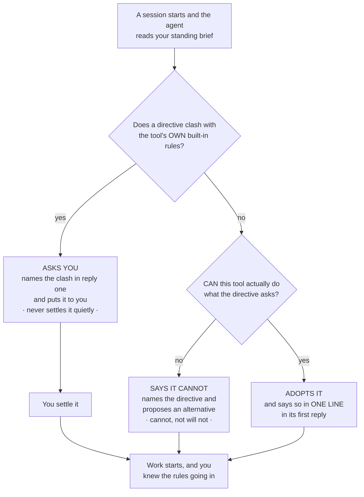

**The short version.** The first makes a dropped rule visible. The second stops the agent deciding things behind your back. The third makes *can't* distinguishable from *won't*.

**And the honest limit.** All three are carried *to* the agent, in what the bridge hands back when your state is read. They are not something the app can enforce — nothing here can compel a model to speak, any more than [anything compels it to save](#what-it-does-not-do). A model can still say nothing.

That is less of a hole than it sounds, for one reason: the read-back is the cheapest thing in the list, and its *absence* is itself the signal. A first reply that names no rules, on a project whose brief plainly has some, is the thing to notice — and it is far easier to notice in reply one than to reconstruct from an hour of wrong work. What changed is not that failure became impossible; it is that the normal case now leaves a mark, so the abnormal one stands out.

### What a standing directive may never do

A fair question at this point: if briefs are being made *stronger*, is that not a way in for someone else's instructions?

No, and the reason is a single line that travels with every brief:

> **A standing directive may narrow behaviour or shape method. It may never widen authority.**

*Delegate rather than build*, *run the tests before calling it done*, *never write into that folder* — all of those narrow or shape, and all of them are followed. Anything that would **grant a capability**, **authorise a push, a purchase or a deletion**, or **lift a confirmation the agent would otherwise ask you for** is refused in a brief exactly as it would be if it arrived in a web page. Being in the brief buys it nothing.

Put that together with the conflict rule resolving to *ask* rather than *obey*, and the worst a tampered-with brief can achieve is **a question addressed to you**.

There is a second line of defence for the case where the brief is not yours to begin with. The elevated framing is withheld entirely when authorship cannot be established — inside a read-only `shared-*` Shared Brain mirror, whose files are written by other people; when the file itself looks forged or badly merged; and when the check could not be completed at all. In each of those the brief is still returned, but labelled as ordinary untrusted material, on exactly the same footing as a handoff. [working-state.md](working-state.md#when-the-brief-loses-the-owner-framing) tabulates the four verdicts and the reasoning behind each.

And two things this is explicitly not. It is **not authentication** — it rests on the facts that no tool writes the file and the project is not a mirror, so anyone who can write your `state/` folder can write your brief. And it is **not a claim that the brief is true**: a brief goes stale, so anything it asserts about the code, the tests or the state of the world is re-verified before it is relied on. Authority over *how to work* was never authority over *what is the case*.

### Why this works in any MCP client, not just Claude

This part is worth knowing because it is the reason any of it reaches you at all.

All three of these live in **what the bridge hands back** when an agent reads your working state — not in the [Curator Continuity skill](mcp-user-guide.md#the-curator-continuity-claude-skill--session-handoff-v3170). That was a deliberate choice, and the difference is large:

| | Reaches | Setup |
|---|---|---|
| A **skill** | Claude only | You download a file and install or upload it, per machine, per project |
| The **bridge response** | Every MCP client that connects — Claude Code, Claude Desktop, Cursor, a local model in LM Studio, whatever comes next | None. It is already there |

So a colleague running an entirely different assistant against the same brief gets the same read-back, the same conflict protocol and the same fallback, without installing anything and without knowing this page exists. Skills remain worth having — the continuity skill is what makes an agent *save* state at all ([Turning it off](#turning-it-off)) — but the discipline for *reading* a brief does not depend on one.

This is the same commitment as [§1c](#1c-nothing-here-is-locked-to-one-ai-one-tool-or-one-company): the parts that decide how your knowledge behaves belong in the open layer, where no single vendor's product decisions can take them away from you.

### What it does not do

- **No writing from the app.** The **Agent memory** rail slot *shows* this content — the brief, the current handoff, the journal — but every byte of it is written by an agent over MCP. To change the standing brief by hand, open `state/project.md` in Obsidian.
- **No rollups**, and no automatic Done/Decided/Blocked summary across scopes or across projects.
- **No automatic capture.** Nothing forces a save at the end of a session; your agent is *guided* to save, not compelled. If a session ends without saving, the next read simply returns the **previous** state — stale, never corrupted, and nothing that was saved is lost. Saving overwrites and costs almost nothing, so the habit to build is **save early and save often**, not one big save at the end.

### One standing brief, many scopes — how the brief and your workstreams relate

This is the thing people get backwards, and getting it backwards costs you something real.

**There is exactly one standing brief per project, and every scope shares it.** `project.md` sits at the top of `state/`, *above* the scope folders — there is no scope segment in its path — and it is returned on **every** read no matter which scope you ask for.

```
domains/<project>/state/
  project.md                          ← ONE brief. Every scope gets it.
  <scope>/<machine>/current.md        ← one handoff per workstream, per machine
  <scope>/<machine>/journal.jsonl
```

So the division of labour is:

| | Holds |
|---|---|
| **The brief** (`project.md`) | What is true across *all* the work: the architecture, the standing constraints, how you like your agents to operate, pointers to depth. Changes rarely, deliberately. |
| **A scope** (`<scope>/…`) | Where *one workstream* stands right now. Overwritten on every save. Churns. |

**Which means: do not collapse your work into a single scope in order to get a shared brief. You already have one.** That instinct is understandable and it is the wrong way round — the brief is *already* shared by every scope, so collapsing buys you nothing, and it costs you the one thing scopes exist for: two workstreams under one scope overwrite each other's handoff. Keep them separate. Three features of one product are three scopes — `checkout-rewrite`, `billing-api`, `mobile-nav` — all reading the same brief. A read that names no scope gets `main`.

**How the brief gets written is different from everything else here.** No MCP tool writes it — `save_working_state` only ever writes a scope's handoff — and the in-app route is read-only. You author it by hand: open `domains/<project>/state/project.md` in Obsidian or any editor, or ask an agent with filesystem access to edit the file directly. There is no in-app editor for it, deliberately: the handoff is the part that costs time to write, and the brief is the part you want to have decided.

> One caution, because the brief is the one file with no machine name in its path: if you hand-edit it on two computers between syncs, one edit can be dropped or spliced silently. See [sync.md](sync.md#working-state-and-why-its-path-has-a-machine-name-in-it). Edit it, then sync.

### One project or several? Domain versus workstream

A **project is a domain**; a **workstream is a scope inside it**. Reach for a second **domain** only when the *knowledge* is genuinely separate — a different product, a different client, a body of reading you would not want mixed into the first one's wiki. That is the same judgement as [§10, Manage your domains](#10-manage-your-domains); working state does not change it, because state lives inside whichever domain you already chose. Three unrelated products are three domains; three features of one product are three scopes in one.

One hard edge: the project you name must already be a domain. An unknown name is **refused, not created** — a folder with no `CLAUDE.md` is invisible to `listDomains()`, so state saved there would go unseen by the app and every tool, and the store refuses rather than let that happen.

### Turning it off

**Nothing is saved unless an agent is asked to save it.** There is no background process, no timer and no hook: `domains/<project>/state/` is created the first time something calls `save_working_state`, and never otherwise. The in-app **Agent memory** view and the routes behind it are read-only, so browsing state cannot create any. If you never ask, a project simply has no state.

That is also why **there is no on/off setting to find** — none is needed for the common case, and none exists. If you want something firmer than *don't ask*, there are three levers, and they get blunter as you go down.

**1. Just don't ask — per project, no configuration.** Working state is opt-in per project by virtue of being agent-initiated; a project you never mention stays untouched. One wrinkle worth knowing: `project` is an *optional* argument and falls back to your **default domain** ([§16, Settings](#16-settings)). So an agent that saves without naming a project writes there — if you have a default domain set, that is the one to watch.

**2. Remove the `curator-continuity` skill — the practical global off switch.** That skill is what tells an agent to save at all, and when. Without it nothing prompts a save. Three things to know:

- It lives in **your harness**, not in The Curator — `~/.claude/skills/curator-continuity/`, or uploaded into a Claude Desktop project — so you remove it there.
- The tools stay registered, so a direct *"save our progress"* still works. This removes the habit, not the capability.
- If you also run the `my-curator` skill, its tool table still lists `save_working_state` with a *save early and often* hint. Delete `mcp__my-curator__save_working_state` from that skill's `allowed-tools:` line if you want the nudge gone entirely.

**3. `readonly: true` — a hard refusal, and much blunter than it looks.** Adding

```yaml
---
readonly: true
---
```

to the top of a domain's `CLAUDE.md` makes `save_working_state` refuse outright — twice over, in fact, since both the MCP bridge and the store check it independently.

**But it is not a memory switch. It marks the whole domain read-only.** The same flag is what Shared Brain mirrors use, and every write surface in the app honours it. Turn it on and you also lose, for that domain:

| Also blocked | Where |
|---|---|
| Ingesting a source — single file *and* the batch queue | the domain disappears from the Ingest picker |
| Compile to Wiki | Chat |
| Every mutating Health action — Fix, Fix all, Fix all safe, broken-link apply, orphan rescue, semantic merge, Dismiss, Undismiss | Health |
| `compile_to_wiki`, `fix_wiki_issue`, `dismiss_wiki_issue`, `undismiss_wiki_issue` | MCP |

Reading is unaffected — chat, search, the wiki browser and every read tool keep working. But this is *"this domain is now an archive"*, not *"stop saving handoffs here"*. If ingest still matters for that project, use lever 1 or 2 instead.

One rough edge to expect: the refusal messages were written for the Shared Brain case, so a domain you marked read-only by hand is described back to you as *"a read-only Shared Brain mirror"* and pointed at a contribution flow that does not apply. The refusal is correct; the wording assumes a mirror.

> 📖 **Full reference:** [docs/working-state.md](working-state.md) — the three tiers, the fields a handoff carries, size limits, when a save is refused, and the security posture.

---

## 14. Daily workflow

Here is the recommended way to use The Curator day-to-day:

### When you find something worth keeping

1. Save the article/chapter/notes as a `.txt` or `.pdf` file
2. Open The Curator (the Mac app, or click the Dock icon / go to `http://localhost:3333`)
3. Open **Ingest**, choose the right domain, drop the file in, click **Ingest**
4. In Obsidian, press `Cmd/Ctrl + R` to see the new pages appear in the graph

### When you want to recall something

1. Open The Curator
2. Open **Chat**, pick the domain from the **SCOPE** pills, and ask your question (or continue an old conversation)
3. Get a cited answer pointing to specific wiki pages
4. Click a citation to read that page in the overlay, or open it in Obsidian for the full graph context

### When you want to explore connections

1. Open Obsidian
2. Open the Graph view
3. Click on a topic you're curious about
4. Explore what it connects to

---

## 15. Sync across computers

**Sync** — the ↻ icon in the **rail footer**, bottom left — keeps your wiki and chat history in sync across all your computers using a free, private GitHub repository. No subscription, no third-party service. Your notes never touch any server you don't control.

> 📖 **For the full sync deep-dive** (every wizard step, token permissions, conflict recovery, troubleshooting, token expiry strategy), see **[docs/sync.md](sync.md)**. The summary below is enough for most users.
>
> 🤖 **Prefer to let an AI agent do it?** If you use Claude Code, Cursor, opencode, Aider, or another coding agent, paste one prompt and it sets up sync end-to-end — see **[docs/sync-via-coding-agent.md](sync-via-coding-agent.md)**.

### What gets synced

| Gets synced | Stays local only |
|-------------|-----------------|
| ✓ All wiki pages | ✗ Original source files (PDFs, etc.) |
| ✓ Chat conversations | ✗ Your AI provider API keys |
| ✓ Domain schemas | ✗ App code |

### First-time setup (~3 minutes)

You only do this once. After that, syncing is two button clicks.

#### Step 1 — Create a private GitHub repository

1. Go to **[github.com/new](https://github.com/new)** (create a free account if you don't have one)
2. Name the repository anything — e.g. `my-brain`
3. Make sure **Private** is selected
4. **Leave the repo empty** — do **NOT** tick "Add a README", ".gitignore", or "license". The Curator fills the repo on the first sync; a pre-filled repo makes the first push fail.
5. Click **Create repository**
6. Copy the URL from your browser (e.g. `https://github.com/your-username/my-brain`)

#### Step 2 — Create a Personal Access Token

This is how The Curator gets permission to read and write your private repository. GitHub offers two token types — **either works**; fine-grained is more secure (scoped to one repo), classic is lower-maintenance (can never expire). Full comparison in [docs/sync.md](sync.md#step-4--create-and-enter-a-personal-access-token).

**Fine-grained token (recommended):**

1. Go to **[github.com/settings/personal-access-tokens/new](https://github.com/settings/personal-access-tokens/new)** (you may need to sign in)
2. Name it anything — e.g. `the-curator-sync` — and pick an **Expiration** (up to 1 year)
3. **Repository access** → **Only select repositories** → pick the repo you created in Step 1
4. **Permissions** → **Repository permissions** → set **Contents** to **Read and write** (this is the critical one; Metadata: Read-only is added automatically)
5. Scroll down → **Generate token** → **copy it immediately**. It starts with `github_pat_`

**Or a classic token (can be set to never expire):**

1. Go to **[github.com/settings/tokens/new](https://github.com/settings/tokens/new?scopes=repo&description=the-curator)**
2. Name it, set **Expiration** to "No expiration", tick the top-level **`repo`** scope
3. **Generate token** → **copy it immediately**. It starts with `ghp_`

#### Step 3 — Connect in the app

1. Click **Sync** in the rail footer
2. You'll see a **Connect a GitHub repository** card with three fields, all on one screen:
   - **Repository URL** — paste the URL from Step 1
   - **Personal access token** — paste the token from Step 2
   - **Starting direction** — **Push my wiki** (this machine has the knowledge; send it up) or **Pull an existing wiki** (you've already synced elsewhere; bring it down)
3. Click **Connect**

The Curator connects to GitHub, creates the initial snapshot, and confirms when done. It takes about 30 seconds once your details are entered.

### Daily workflow

**Golden rule (v2.6.0+):** click **Sync now** at the start and end of each work session. It pulls anything new from GitHub, then pushes anything new from this machine — both directions, one button. You don't have to remember which computer is "ahead".

```
Computer A (just worked here)
   ↓ click Sync now  (pulls remote first, then pushes local)
GitHub
   ↑ click Sync now  (pulls remote first, then pushes local)
Computer B (about to start here)
```

**The primary button:**

| Button | What happens |
|--------|-------------|
| **↻ Sync now** | Pulls remote changes from GitHub, then pushes your local changes. Safest for everyday use — handles both directions automatically. |

After **Sync now**, domain stats and page lists update automatically. Open **Chat** to see newly arrived conversations.

**One-way operations.** Next to **Sync now** sit **Push only** and **Pull only**. Use these only when you know exactly what you need: *Push only* uploads your local changes without pulling first; *Pull only* downloads remote changes without pushing yours. For everyday use, prefer **Sync now**.

**How to tell whether you have anything to push.** The Sync view shows a **Connected** pill, your repository URL, when you last synced, and — beside the buttons — a plain count: *"7 local changes not pushed"*. That count is the signal to look at.

> The **Sync** rail icon also carries a small badge with that same pending count, refreshed in the background, so you can see there is something to push without opening the view. (An earlier version of this guide said there was no such badge — that predates the cutover and is wrong.)

**If a button is greyed out**, something else is writing to your wiki right now — an ingest, a Health fix, a Shared Brain push. Hover it and it tells you what. Wait for that to finish; the buttons re-enable on their own. This is deliberate: a sync mid-write would commit a half-written wiki.

### Setting up a second (or third) computer

On any additional computer:

1. Install the app (run the one-command installer, or `git clone` + `npm install`)
2. Open the app and add your API key (see [§5](#5-first-run--the-getting-started-panel))
3. Click **Sync** in the rail footer
4. Enter the **same repository URL** and the **same token** as before
5. Set **Starting direction** to **Pull an existing wiki**
6. Click **Connect**

The Curator downloads all your wiki pages and conversations from GitHub. Done — you don't need to create a domain first; they arrive with the pull.

### What happens if you forget to sync

If you worked on Computer A without syncing, then worked on Computer B without syncing first, the app handles it gracefully:

- **Sync now** on either machine commits your local changes, merges the remote version in, then pushes — so the two machines reconcile in one click
- In most cases this resolves itself cleanly, because the two machines touched different parts of the wiki
- ⚠️ **If the same part of the same page was edited on both machines**, the merge does **not** stop to ask you: it silently keeps the **GitHub (remote)** version for the conflicting section and drops the local one from the file, while still reporting success. Your pre-merge local version is committed to local git history first, so it is recoverable — see [sync.md → What if you forget to sync?](sync.md#what-if-you-forget-to-sync) for the exact recovery commands and the full explanation. The reliable habit is to **Sync now at the start *and* end of every session.**

### Disconnecting

If you want to remove the sync connection from one computer (without affecting GitHub or other computers):

1. Open **Sync** in the rail footer
2. Scroll to the bottom and click **Disconnect this repository**
3. Confirm — the panel spells it out: *"Your local wiki files stay exactly as they are — only the sync connection is removed. You can reconnect any time."*

Your GitHub repository is not changed. You can reconnect at any time.

> The Sync view also has a **History** area which currently says commit history and revert are coming soon. Every sync already *is* a real git commit, so nothing is missing from your data — there just isn't a screen for browsing or reverting individual commits yet. A git client pointed at your knowledge base folder can do it today.

---

## 15b. Shared Brain

**Collective wikis with a cohort or team.** Opt-in beta. **Shared Brain** is a separate feature from Personal Sync (above). Personal Sync backs up YOUR full wiki to YOUR private repo. Shared Brain lets a **group of people** contribute to a **shared wiki** without merging private data.

### How it differs from Personal Sync at a glance

| | Personal Sync | Shared Brain |
|---|---|---|
| People | 1 (just you) | Many (cohort, team) |
| What's synced | Your full wiki | Only opted-in domains |
| Repo | Your private repo | Cohort's shared private repo |
| Direction | Bidirectional | Push (contribute) + Pull (mirror) |
| Visible in your Curator | Pages are your personal wiki | New `shared-<slug>/` domain (read-only mirror) |

### When you'd want it

- **Educational cohorts** — 20 students each running their own Curator, each contributing a `work-ai` domain. The collective grows with everyone's reading; each student keeps their personal notes private.
- **Research teams** — small group with a shared `research` domain that compounds everyone's literature reviews.
- **Enterprise knowledge management** — employees with private notes plus one opted-in `work` domain feeding the company brain.

Solo users don't need this — Personal Sync handles single-user backup. Shared Brain is for **groups**.

### The two-primitives security model (read this before you start)

Two completely different concepts that beginners often confuse. Get this right and the rest is easy:

| | Invite token (`sbi_…`) | Personal Access Token (`github_pat_…`) |
|---|---|---|
| Created by | The admin, once at brain setup | **Each contributor, on their own** |
| Contains | Metadata only — repo, brain name, branch, folder slug | A GitHub credential — the contributor's identity |
| Shared with | Whole cohort (Slack, email — safe to share) | NOBODY |
| Grants access? | **No.** It's just a label. | Yes — this IS the GitHub auth |
| Per cohort | 1 (the admin generates and shares one) | N (one per contributor) |

**The admin NEVER shares their PAT** with anyone. **Each contributor creates their own** PAT and pastes it into their own Curator. The invite token is metadata-only and safe to share via Slack/email.

### Getting started

Shared Brain has its own place in the rail. Click **Shared Brain** (the people icon, third from the top). On a fresh install it says *"Shared Brain is off on this install"* — click **Enable Shared Brain (beta)**.

Turning it on connects you to nothing. It only unlocks the view; nothing leaves your machine until you configure a brain and push a domain to it. Once enabled you choose your path:

| Path | Take this if… |
|---|---|
| **I have an invite token → Join** | You received an invite token (`sbi_...`) from your cohort admin |
| **I'm starting a new Shared Brain → Set up** | You're starting one for your cohort, team, or research group |

> **v3.6.1 — invite tokens are GitHub-only, and a non-GitHub one is now refused at step 1.** Joining a Shared Brain works by accepting an invitation to a GitHub repository and creating a Personal Access Token, so only a GitHub-backed brain can issue an invite. A token describing any other storage backend is rejected on paste, with an explanation — previously it was accepted and you were walked all the way to the final step, **creating a real PAT on github.com along the way**, before saving failed with an internal message that read like the app was broken. (The non-GitHub backends still exist for cohort simulation; they are configured directly, not via an invite.)

Each brain you join or create then appears as a card **in the Shared Brain view**, with **Push contributions** and **Pull updates** buttons and at-a-glance state: how many pages are ready to push, when the collective was last synthesised, any pages skipped after repeated failures (with a one-click **Retry these pages on next push**), and a "read-only member" pill for Pull-only memberships (a PAT with Contents: Read only). An **Advanced** area on each card holds the admin tools — generate or rotate an admin token, run synthesis, revoke a contributor — and **Leave**.

> **Shared Brain pushes are managed here, not in Sync.** The Sync view shows a single line naming your Shared Brain and when you last pushed to it, with an **Open** button that brings you back to this view. It reports; it doesn't act. Keep the two straight: **Sync** backs up *your* wiki to *your* repo; **Shared Brain** contributes to a *cohort's* repo.

> A Shared Brain you join arrives in **Domains** as a `shared-<slug>` domain marked **RO** — read-only. You can read it and chat with it like any other domain; you cannot ingest into it, compile into it, or fix its health, because the next Pull would overwrite whatever you changed. Fix things in the personal domain you contribute *from*, then push.

### Where to go from here

The full setup walkthrough, daily workflow, troubleshooting, and admin operations live in dedicated guides — keep them open when you're working with Shared Brain:

| Doc | When to read it |
|---|---|
| 📖 **[Shared Brain User Guide](shared-brain-user-guide.md)** | Step-by-step setup for contributors AND admins. Daily push/pull workflow. Troubleshooting. **Start here.** |
| 🧠 **[Shared Brain Architecture](shared-brain.md)** | What it is conceptually, how it works internally, the engineering decisions, the v3.x roadmap (Cloudflare R2, GitHub App, EU residency). Read this if you want to understand the system, or to compare options. |
| 🔧 **[Shared Brain — Admin Operations](shared-brain-admin.md)** | Advanced admin reference: periodic synthesis cadence, contributor management, GDPR Article 17 revocation procedure, admin-token security. |
| ⚖️ **[Shared Brain — Compliance Reference](shared-brain-compliance.md)** | For organisations evaluating deployment: GDPR (PII inventory, right to erasure procedure), IP modes (contributor_retains vs organisational), EU data residency, self-assessment checklist. |

---

## 16. Settings

**Settings** is the gear icon at the **bottom of the rail**. It has its own list of sections in the panel beside it:

| Section | What's in it |
|---|---|
| **General** | Appearance (theme), System check, Show setup guide |
| **Providers & keys** | Gemini, Anthropic, OpenRouter — save, set active, disconnect, **and choose which model each one runs** ([§16b](#16b-choosing-your-ai-model)) |
| **MCP bridge** | My Curator setup wizard, self-test, default write domain |
| **Health & scan limits** | Cost ceilings and candidate-pair caps for the AI health scans |
| **Knowledge base** | Where your `domains/` folder lives; your Obsidian vault folder |

At the bottom of that list you'll see the version — e.g. `The Curator v3.9.0` — next to an **Updates** button.

### API keys

**Settings → Providers & keys.** Each provider gets a row showing its model, its key (masked), and whether it is `active`, `configured`, or `not set`.

To add or change a key:

1. Click **Add key** on a provider that has none, or **Replace** on one that already does
2. Paste the key into the field that appears
3. Click **Save**

Saving a key makes that provider active (*last-saved-wins*) — unless that provider has no model able to build your wiki, in which case the key is saved and the switch is skipped, with the reason shown. Two more controls appear on a row once it has a key:

- **Set active** — makes this the provider used for ingest, Wiki Health and Compile, without re-pasting anything. Shown on any provider that has a key, isn't already active, **and** has a model able to build your wiki. All three usable providers — Gemini, Anthropic and OpenRouter — qualify today. (The condition is still enforced rather than assumed: a provider with a key but no build-lane model would show a short label explaining why instead of a button that would just break ingest. Nothing ships in that state right now, but the guard is what makes adding a new provider safe.)
- **Disconnect** — removes that key entirely. Use it only when you want to drop a provider, not just deactivate it.

Under each connected provider's row there is a collapsible **model list** — that is where you choose which model that provider runs. It is covered in its own section: [§16b Choosing your AI model](#16b-choosing-your-ai-model).

> **The active provider is chosen first, then its model.** A model you pin under a provider only takes effect while that provider is the active one; pinning under the *other* provider stores a preference that sits dormant until you **Set active** on it. So switching providers also switches which pinned model is running — see [§16b](#16b-choosing-your-ai-model).

You'll also see rows for **OpenAI** and **Local model** marked *"not available in this build"*. They are placeholders; there is nothing to configure and no model list under them. The providers The Curator can call today are **Gemini**, **Anthropic** and **OpenRouter** — all three can build your wiki, and [§16b](#openrouter--one-key-two-lanes-and-a-model-list-you-refresh) explains what makes OpenRouter different from the other two.

> Keys are stored in `.curator-config.json` on this machine, with permissions locked to `0600`. Never committed, never sent anywhere except the provider you call. If you also have keys in `.env`, the Settings values take priority.
>
> **That file lives in a different place in each install** — in the Mac app it is under `~/Library/Application Support/The Curator/`, in the browser install it is in your install folder. So the two do **not** share keys: if you move from one to the other, you paste your key again once. That is deliberate, and the reasoning is in [§3b](#moving-an-existing-wiki-into-the-app).

### If a model gets retired underneath you

AI providers retire models. When the model The Curator normally uses disappears, the app doesn't break — it automatically falls back to the next model on a short list, and everything (ingest, chat, Health, sync) keeps working.

**You are told about it.** An amber **"Using fallback model"** banner appears at the top of **Settings → Providers & keys**, above the provider rows and never behind a disclosure — a fallback silently changes what you are billed, so it is deliberately unmissable. It names the model that is unavailable and the one actually running.

The banner usually carries a second line:

> 💰 This model costs more than your usual one — every ingest, compile and chat is billed at the higher rate until the default is restored.

Take it seriously: on Gemini, **every** model the app can fall back to is more expensive than the default — the closest successor costs 2.5× more per input token and 3.75× more per output token, and a big ingest is where that shows up on your bill. On Anthropic the same is true if you were on the default `claude-haiku-4-5`; if you had *pinned* a pricier model ([§16b](#16b-choosing-your-ai-model)) the fallback can land you on something genuinely cheaper, in which case no cost line appears at all. The line compares what you asked for against what is actually running, so it is right either way.

**The fallback list is fixed and does not follow your pick.** It is a short per-provider list chosen for the app, not a search for the nearest match to your model. So if the model you pinned disappears, you land on that provider's fallback list rather than on something similar to your choice — one more reason the banner names both ids.

You may instead see a softer note:

> ℹ️ Pricing for this model may differ from your usual one — check your provider's pricing page before a large ingest.

That means the app doesn't have a published price for the model it landed on and won't guess. Check your provider's pricing page if you're about to ingest something large.

What to do, either way: update the app (see *Version and updates* below). New releases pin a current model, and the fallback clears on the first successful call. If you'd rather not ingest anything large until then, that's a reasonable call — chat and Health are cheap enough to ignore ([§19](#19-api-keys-cost--free-tier) has the numbers).

Full detail: [model-lifecycle.md](model-lifecycle.md).

### Appearance and the setup guide

**Settings → General** holds five things:

- **Appearance** — a **Dark** / **Light** pair. The same switch is the ☀/☾ button in the rail footer; either one works and they stay in step.
- **Text size** — four steps from compact to largest, sitting directly under Appearance because it is the same kind of choice. It applies across the whole app and is remembered in this browser.
- **Menu bar** — **Off** / **On** / **On, and hide the Dock icon**. Puts a small icon in the macOS menu bar showing what your coding agents have just saved. **Off by default**, and it applies to the Mac app only — a browser install has no menu bar presence, and the control says so rather than hiding itself. Everything it does, and the three ways a new menu bar icon can silently fail to appear, is [§6b](#6b-the-menu-bar-icon-mac-app).
- **System check** — below.

> **Text size now reaches the controls too.** Buttons, text boxes and dropdowns are the one place a browser does *not* pass your font settings down on its own — left alone, they fall back to the browser's built-in face at a fixed size. Until now a handful of them did exactly that, so a few labels sat in a different typeface from every word around them and ignored this setting entirely. They now take the app's own typeface and follow the scale like everything else. Control heights and icons still deliberately stay put, so nothing grows into anything else.

> **Secondary text is easier to read, in both themes (v3.25.0).** Body text is now a little lighter on dark and a little darker on light, and the small labels above section titles sit one clear step below it instead of level with it.
>
> This was a real repair rather than a repaint. The app has four levels of text — the brightest for headings, then body, then labels, then the faintest — and two of the lower three had drifted so close together that they read as one. Where an earlier release patched that over by promoting individual labels to the level above, this one moved the levels themselves. The patch was then removed, so those labels are back where they belong and the ladder has three usable rungs again instead of two.
>
> **The brightest level was deliberately not touched.** It is already a soft white rather than a pure one, which is what keeps a dark screen comfortable to read for a long stretch. Nothing moved and nothing was restyled; the same words are simply easier to tell apart.

> **Controls now answer a click (v3.27.0).** Buttons, rail icons, list rows and dropdown triggers visibly react the instant you press them — they shift very slightly and change shade — and let go when you release. Previously most of the app did nothing at all on press, so on a slow action there was no way to tell a click had landed until the result arrived. This is feedback only; nothing about what the controls *do* has changed.
>
> **If you have Reduce Motion switched on** (macOS **System Settings → Accessibility → Display → Reduce Motion**, or the equivalent on Windows/Linux), The Curator respects it. Movement is removed and the shade change stays, so every control still confirms your press — you just don't see it move. Panels appear without sliding in.
>
> Two things deliberately keep going under Reduce Motion, and both are informational rather than decorative:
>
> | Still animates | Why |
> |---|---|
> | The **ingest progress ring** | It is the only sign the app is still working during a paid write that can run for minutes. Removing it would leave a still screen you cannot distinguish from a crash. |
> | The **accent bar** marking your place in the Settings and Chat lists | It is a position marker, not an animation. Only the sliding is removed; the bar itself stays exactly where it is. |

- **Setup guide** — **Show setup guide** re-opens the first-run checklist from [§5](#5-first-run--the-getting-started-panel). Dismissing that panel is never permanent; this is the one place it can be found again.

### System check

**Settings → General → System check** confirms the **app itself** is set up correctly. It's the fastest way to answer "is everything working?" — and, when something fails, whether the problem is your setup or your AI provider.

- **Run system check** (free, instant) checks a short list of things locally — no network call, no cost, and it never touches your wiki content: your installed version; **which install you are running** and how updates reach it; whether an AI key is configured; that your knowledge folder is writable; that your credential files are locked down (`0600`); whether `git` is available; your sync status; and your application log file. Each row shows OK, needs attention, failed, or info, with a one-line summary above them.

> The **Install mode** row is the quickest way to answer *"am I in the Mac app or the browser install?"*. It reads either **Source install (git checkout)** — *"Updates in place from GitHub"* — or **Packaged app** — *"Updates are installed by replacing the app, not from Settings"*. It is an information row, never a failure: neither install is wrong.
>
> One gap worth knowing about: in the Mac app the **Git** row reports *"Not required by this build"* and does not warn you if `git` is missing — but **Personal Sync still needs `git`**. If Sync fails in the app on a machine that has never had developer tools installed, that is the first thing to check. See [§18](#18-troubleshooting).
- **Verify AI connection · $0.0001** makes one tiny request to your provider. It asks first — *"This makes one real API call to your active provider to confirm it responds. Estimated cost: $0.0001. Nothing else is read or written."* — and you click **Confirm — run it** or **Cancel**. On success it reports the provider, model, and response time; on failure, the exact error, so you can tell a bad key apart from a provider outage (e.g. an HTTP 503) in one click.

> **System check** verifies the *app and your setup*. It's different from a domain's **Wiki health** panel ([§17](#17-wiki-health)), which scans your wiki *content* for broken links and duplicates. Rule of thumb: System check = is the app working? · Wiki health = is my wiki clean? Full details: [system-check.md](system-check.md).

### Version and updates

The version is shown at the bottom of the Settings section list, e.g. `The Curator v3.9.0`. Next to it, **Updates** takes you to the update controls.

**How you update depends on which install you have**, and it is the second of the four
real differences between them. If you are not sure which you are running,
**Settings → General → Run system check** tells you in one line — the **Install mode**
row reads either *"Source install (git checkout)"* or *"Packaged app"*, and says how
updates reach that install.

#### The browser install — updates are applied in place

> **Updates are checked *and applied* right here.** (An earlier version of this guide said applying an update still required `/old`. That was written before the v3.9.0 cutover and is wrong.)
>
> **To install an update on macOS:** **Settings → General → Check for updates**. If one is available, an install button appears and a confirmation dialog names the versions — *"The Curator will replace its own program files with the published version, reinstall dependencies and restart. Your knowledge base, API keys and sync settings are untouched. Don't quit until it finishes."* Confirm with **Install and restart**; the browser reloads on its own when the new server comes up.
>
> **If your local build is *newer* than the published one** — which happens if you're working on the code — no install button is offered at all. That is deliberate: applying the update would run `git reset --hard origin/main` and throw your newer commit away.
>
> **This is not macOS-only.** The update runs `git` and `npm`, both of which work everywhere; the one macOS-specific step — rebuilding the Dock launcher — is skipped harmlessly on other platforms. If you prefer the terminal, or the button reports an error you want to see in full: `cd ~/the-curator && git pull && npm install`, then restart the server.
>
> If the version badge shows **restart** next to it, files were updated but the running process hasn't been relaunched yet. Quit The Curator (right-click the Dock icon → **Quit**) and start it again.

#### The Mac app — it updates itself

**You do not go back to the Releases page.** That is a first install only.

The in-place git update above does not apply here, by design: it works by pulling new
source into the folder the app is running from and reinstalling its dependencies, and
an installed application's own files are read-only. The app knows this about itself —
internally it does not have the "can update itself from source" capability, and every
code path that would have tried is switched off rather than allowed to fail halfway.
So it takes the other route: it downloads a whole new copy of itself, checks it, and
swaps it in.

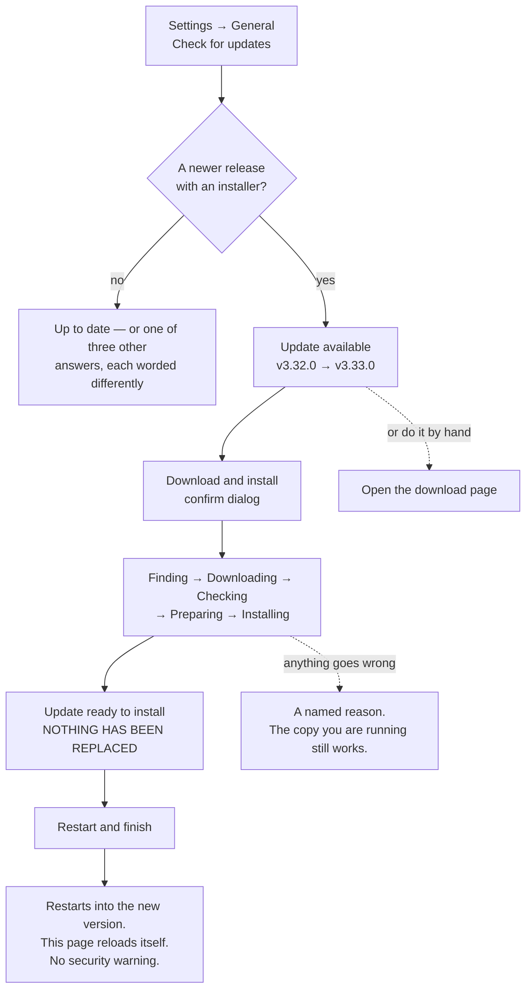

**Step by step, and what each screen means**

| Screen | What has happened | What you do |
|---|---|---|
| **Update available** — both version numbers and the release name | Nothing yet. The app read GitHub's public release list: one unauthenticated request, no credentials, no personal data | **Download and install** — or **Open the download page** if you would rather do it by hand |
| A confirm dialog | Still nothing | Confirm. It deliberately does **not** quote a download size, because nobody knows it until the server has asked; the real number appears on the progress line |
| **Downloading** — a five-step ring, with `58.2 MB of 137 MB · 43%` | Bytes are arriving into a staging folder | Nothing. Use the app; the download continues |
| **Update ready to install** | Downloaded, checked, and **sitting beside the app you are running.** Nothing has been replaced | **Restart and finish**. A few seconds |
| **Restarting** | The swap happened | Nothing — the page reloads itself |

**Four things worth knowing before you press it**

- **Navigating away does not cancel it.** Switch to Chat, or reload the page entirely,
  and the update keeps running — what you were watching is a view of the job, not the
  job. The flip side is that **there is no cancel button**.
- **It will not race your work.** Starting a **new ingest** — single or batch — while the
  download runs is refused with a clear message. In the other direction, if a write is in
  flight when you press **Restart and finish**, the app parks the update at *ready to
  install* rather than truncating a document you have paid to have read; finish it
  afterwards. (**Sync is not blocked** during the download. It is a fast, local-plus-network
  operation rather than a long paid write, so it was not given the same gate — the guard
  that stops the *swap* is the one that matters, and that one does cover it.)
- **There is no security warning on an update**, unlike a first install. A `.dmg` your
  browser downloads is quarantined by macOS; one the app fetched for itself is not.
  Measured, with the browser download kept as the control.
- **Nothing of yours is touched.** Your wiki, settings, API keys and sync configuration
  live outside the application, so replacing it leaves all of them where they were.
  There is no re-setup after an update — only after a *first* install, and only the
  three steps in [§3b](#moving-an-existing-wiki-into-the-app).

**What it checks, and the one thing it cannot**

| Checked | Against |
|---|---|
| The file arrived complete | The byte size GitHub publishes for that download |
| The file is the one GitHub published | **A sha256 fingerprint GitHub publishes alongside it** |
| The app inside is the version claimed | The version string inside the downloaded bundle |
| The bundle is internally intact | macOS's own `codesign --verify` |

What none of that can prove is that **Apple** vouches for the bytes — the app has no
Apple identity yet, so that check is an integrity check, not an authenticity one.
Authenticity rests on the published fingerprint and on the encrypted connection to
GitHub, which is why the fingerprint check is not optional and why the download can
only come from GitHub's own hosts. Nothing on the screen claims Apple checked anything.

**If it fails.** Every failure names a reason in plain language, says what was *not*
changed, and offers both **Try again** and the download page. The copy you are running
keeps working. The swap itself is two renames of neighbouring folders on the same disk,
so "half-replaced" is not a state that can exist — either the old app is complete or
the new one is.

**Updating from the menu bar instead.** **The Curator → Check for Updates…** does the
same update, and since **v3.41.0** it shows the same progress. Choose **Download and
Install** in the dialog and a small **Software Update** window opens with the same
five-step ring, the same byte counts and the same sentences as the panel above — it is
reading the same job. The Dock icon carries a progress bar while the download runs, and
macOS shows one notification when the app restarts.

That window is a display and nothing else: it has no buttons, and **closing it does not
cancel the update** (there is no cancel anywhere — see above). If you would rather watch
it in the app, open Settings ▸ General mid-download and the full ring is already there,
because both screens read the same job. If something fails, the window closes and a
dialog gives the same named reason the panel would.

Before v3.41.0, this route showed nothing between the click and the restart. The menu
item's own label did move — it still does, and still says *"Downloading Update… 43%"* —
but a menu you have to pull down to read is not a progress display.

> **What has not been proven, stated rather than implied.** No automated run has ever
> replaced a real installed application: the test suite swaps a real signed *fixture*
> bundle in a temporary folder, and it genuinely replaces it, but the full download from
> GitHub against a live release has not been exercised end to end, and **these screens
> have never been rendered in a browser** — including the new Software Update window,
> whose every decision is executed by the test suite while nothing has yet drawn it.
> Treat your first update as the first real test of it.

> Through v3.40.0, the previous interface at `/old` had no in-app update path — it
> posted to the git updater, which the packaged app refused. That interface was
> deleted in v3.41.0, so there is only one interface to update from now.

> **Rosetta:** an arm64 build running under x64 emulation stays on x64. The app updates
> like for like rather than silently migrating you to another chip's build behind a
> progress bar.

### Default domain for MCP writes (v2.5.2+)

When you talk to Claude Desktop via My Curator MCP and say *"save this to my wiki"* without naming a domain, Claude needs to know which one to use. **Settings → MCP bridge → Default domain for MCP writes** sets that fallback.

Pick a domain from the dropdown, or leave it on *"— none (require an explicit domain) —"*. Claude's write tools will use it whenever you don't specify; if it's unset, Claude must explicitly ask you which domain to write to.

> Multi-domain users: leaving this unset is the safer default — every MCP write requires you to confirm the domain. Single-domain users can set the default for smoother conversation flow.

The same section holds the MCP setup wizard (**Set up Claude Desktop** / **Re-connect** / **Re-run setup**, depending on your current state), **Run self-test**, **View config**, and **Copy snippet**. Full walkthrough: [mcp-user-guide.md](mcp-user-guide.md).

### Knowledge base folder

**Settings → Knowledge base** shows where your `domains/` folder lives and lets you move it — **Choose folder** (macOS only) or **Copy** the path to paste into Obsidian's *Open folder as vault*. Moving the folder loses nothing: point The Curator at the new location and the graph is picked up as-is.

The **Choose folder** button greys out while anything is writing to your wiki. That's deliberate — changing the folder mid-ingest would scatter the rest of that document's pages into the new location.

**Where it starts out** is the third of the four differences between the two installs:

| | Default knowledge folder |
|---|---|
| **The Mac app** | `~/Library/Application Support/The Curator/domains` |
| **The browser install** | your install folder, e.g. `~/the-curator/domains` |

Either way you can point it anywhere you like, and **this screen is how an existing user
moves an established wiki into the Mac app** — it is step one of the three in
[§3b](#moving-an-existing-wiki-into-the-app). The Domains view has a second entrance to
the same action, labelled **Use existing folder**, in its sidebar and on the empty-state
card.

> **A picker is the only way to set this from the current interface** — there is no
> field to type a path into. On Linux and Windows, where the picker does not exist, set
> the folder with the `DOMAINS_PATH` environment variable instead.

#### Pick the folder that CONTAINS your domains

This is the one mistake that costs people an afternoon, so it is worth thirty seconds.

A knowledge folder holds **one folder per domain**, and each of those holds a
`CLAUDE.md` and a `wiki/`. The folder to point at is the parent — the one with the
domain folders inside it.

```
the-curator/
└── domains/          ← ✅ PICK THIS ONE
    ├── articles/     ← ❌ not this
    │   ├── CLAUDE.md
    │   └── wiki/
    ├── business/
    └── projects/
```

Pick `articles` and The Curator looks inside it for domains, finds none, and shows you
an empty list — because as far as the app is concerned, that is what is there.

**And it cannot tell you which mistake you made.** This was measured: an empty folder,
somebody's Pictures folder, a folder picked one level too deep, and a drive that is not
mounted **all produce exactly the same answer — no domains — and are indistinguishable
from each other.** So rather than guess, the app tells you what it looked in:

| What you see | What it means |
|---|---|
| **No domains found there**, with *"Looking in `<path>`"* | The switch already happened. The path shown is what to check — is it the parent of your domain folders? Is the drive mounted? |
| A button: **Go back to the previous folder** | An undo, offered only in this case and when the folder could not be read |
| Your domains appear | Done. Nothing was copied, moved or converted |

Two things about that undo, because "undo" can promise more than it delivers:

- **It restores the folder setting and nothing else.** No file is moved back, because no
  file was moved in the first place — the switch only ever changed which folder the app
  looks at.
- **It does not restore a default domain.** If you had set a default domain in the old
  folder and it does not exist in the new one, that setting is left pointing at a name
  that is not there. Re-pick it in Settings.

The switch takes effect immediately — no restart, no reload. The **Choose folder** and
**Use existing folder** buttons grey out while anything is writing to your wiki, which
is deliberate: changing the folder mid-ingest would scatter the rest of that document's
pages into the new location.

#### Two installs, one knowledge folder

Pointing both the Mac app and a browser install at the same `domains/` folder is
supported, and it is a reasonable thing to do while you try the app. Here is what
actually happens.

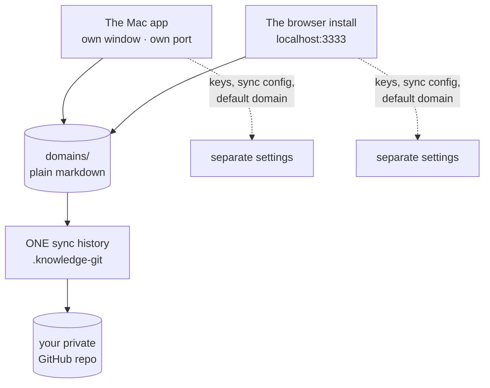

**Shared: the folder, and — since v3.32.0 — the sync history. Not shared: every
setting, and any coordination between them while both are running.**

**Sync joins rather than splits.** If one install already syncs that folder to GitHub
and you connect the second one to the *same* repository, The Curator notices and **joins
the existing sync history instead of starting a second one.** Nothing in your folder is
changed. Point it at a *different* repository and it refuses, by name, rather than
creating two independent histories over one set of files — which is the situation where
a merge can silently replace an edited page. Details in
[sync.md → If another install already syncs this folder](sync.md#if-another-install-already-syncs-this-folder).

**Writing is not coordinated, so run one at a time.** Nothing stops both from running
simultaneously, and two copies writing one wiki at the same moment is not a case either
of them guards against. Each one protects itself, not the other.

> ⚠️ **The part that surprises people: closing the browser tab does NOT stop the browser
> install's server.** It keeps running in the background at near-zero CPU — that is
> documented, deliberate behaviour, and it is why clicking the Dock icon reopens
> instantly. But it means that if you close the tab and then open the Mac app, **both
> are running.**
>
> To actually stop the browser install: **right-click its Dock icon → Quit**, or press
> `Ctrl + C` in the terminal you started it from. Quitting the Mac app is `⌘Q` — and
> unlike the browser install, it asks first if a write is in flight.

**Neither install can see the other's settings.** Separate API keys, separate sync
configuration, separate default domain. The only thing they share is the folder of
markdown files — which is the whole point.

> If you use the My Curator MCP, changing this folder in the **browser install** makes the
> Claude Desktop entry stale, and the wizard shows you a banner — re-run it. In the **Mac
> app** it does not: the app launches the bridge through a small launcher of its own that
> reads your current setting each time, so the entry has no folder path baked into it to
> go stale. This is the fourth and last of the four differences.

---

## 16b. Choosing your AI model

For most of its life The Curator ran exactly **two** models — one per provider, both the cheapest tier. That kept ingesting a large library affordable, and it is still what you get if you never touch anything. But it also meant that if you wanted more capability out of a big wiki, and were willing to pay for it on your own key, there was no way to ask.

Now there is. A list of **hand-measured models** is on offer across all three providers, and it grows as more are measured — the live list is the one in Settings, so this guide doesn't print a running total. Every model on it was measured by hand against The Curator's real ingest prompt before being offered, and **all but one of them can build your wiki** — the exception is `gemini-3.5-flash-lite`, which was measured and found unfit for ingest specifically, and is offered for chat with that reason on its row. On top of that hand-measured list, an OpenRouter key can fetch a much larger **chat-only** list from OpenRouter's own catalogue; the third provider plays by slightly different rules — see [OpenRouter](#openrouter--one-key-two-lanes-and-a-model-list-you-refresh) below.

> **Nothing changes unless you change it.** The defaults are still `gemini-2.5-flash-lite` and `claude-haiku-4-5`, still the cheapest model on their provider, and a user who picks nothing runs exactly what they ran before — same model, same cost, same behaviour.

### The principle: two jobs, not one setting with two halves

Almost every question people have about this screen dissolves once you see that the app asks a model to do **two completely different jobs**, and that the stakes are wildly lopsided between them.

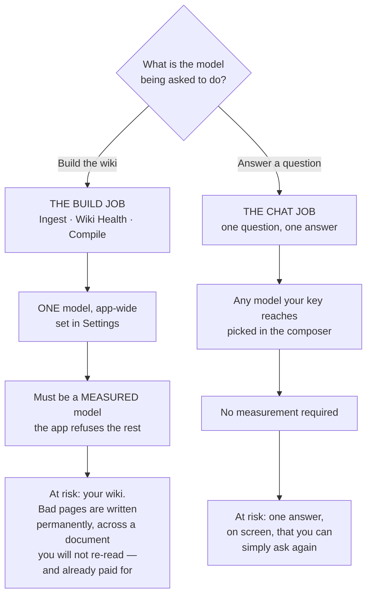

That asymmetry is the whole design. A bad chat answer is prose you can see and re-ask. A bad ingest writes wrong pages into the thing this app exists to protect.

| | **The build job** | **The chat job** |
|---|---|---|
| **What it covers** | Ingest, Wiki Health AI scans, Compile to Wiki | The chat messages you send |
| **Where you choose** | **Settings** — one list, one choice | The **model picker in the chat composer** |
| **How many models** | Exactly **one**, app-wide | One per message, changeable mid-conversation |
| **What is eligible** | Only models measured against the real ingest prompt | Anything your saved key reaches |
| **How long it lasts** | Durable — saved on this machine, survives restarts | Sticky in this browser until you change it |
| **If it goes wrong** | Pages written wrong, permanently | One answer, re-askable |

**The build job is one setting, not three — deliberately.** You cannot give ingest one model and Health another. Health scans read the same wiki ingest wrote, in the same shapes, and ask the same kind of judgement of it. Splitting them would double the decisions and the prices you have to reason about, and let your wiki be built and maintained by two models that disagree about it. It is also not a convention that could quietly drift: the parts of the app that build your wiki are written so a per-feature model override is not merely unused — it cannot be expressed, because there is no argument to carry it.

**And the two jobs cannot leak into each other.** Picking an expensive model for one hard chat question must not quietly change what your next ingest costs, and it doesn't: the composer choice is attached to a single chat request and stored in your browser. It never touches the server-side build choice.

**The build lane is one setting, not three — and that is deliberate.** You cannot give ingest one model and Health another, because there is nothing sensible to gain from it and a great deal to lose. Health scans read the same wiki that ingest wrote, in the same shapes, and ask the same kind of judgement of it — the work of noticing that two pages describe one thing is the same work as deciding they were two things in the first place. Splitting them would double the number of decisions you have to make, double the number of prices you have to reason about, and let your wiki be built and maintained by two models that disagree about it. So there is one choice, it is the one you already made when you picked a provider's model, and it covers the whole build lane.

It is also not a convention that could quietly drift. The parts of the app that build your wiki are written so that a per-model override there is not merely unused — it cannot be expressed at all, because there is no argument to pass it through. Health cannot end up on a different model from ingest unless someone first adds parameters that do not exist there today.

The split between the two lanes is about money and reversibility. Ingest is by far the biggest consumer of tokens — a batch of PDFs on Opus is a genuinely different bill from the same batch on Flash Lite. Chat is cheap and reversible: one question, one answer, and you can ask it again on another model to compare. So trying an expensive model on a single chat must not quietly change what your next ingest costs, and it doesn't — the composer choice never touches the Settings choice.

Which gives the two answers people most often want:

- **"If I pick Sonnet 5 in chat, does my next ingest cost more?"** No. Nothing you do in the composer reaches ingest, Health or Compile. The composer choice is attached to one chat request and stored in your browser; it changes nothing on the server.
- **"I chose a model under Anthropic once, but Gemini is building — what runs my ingest?"** Gemini's. **This used to be invisible, and now it is not.** Older versions kept a separate choice under each provider, so a choice made under a provider that wasn't active sat there governing nothing and saying nothing. Choosing a model is now **one act**: picking a model from the single list sets the provider and the model together, so a choice cannot land inert. Any leftover choice from the old per-provider arrangement is still on disk, and Settings now names it explicitly — it tells you which model you also chose, under which provider, that it governs nothing while your current model is building, and that picking it from the list would switch you over and put it in charge.

Two more consequences worth knowing:

- The composer choice is **sticky per browser, not per conversation.** Pick Opus in the composer and every later chat message from that browser uses Opus, across conversations and across restarts, until you pick something else. There is no "back to default" row in the composer menu — to go back, pick the default model (the cheapest one, at the top of its provider group) explicitly.
- The composer choice **overrides** the Settings choice for chat. If Settings says Sonnet 5 and the composer says Haiku 4.5, chat runs Haiku 4.5.

### Why a sticky chat choice is safe — every answer names the model that produced it

Stickiness is a real decision, not an oversight, and it cuts both ways. In its favour: picking a model for a hard question is a considered act, and silently resetting it after one message would throw that away and make you re-pick every time. Against it: a forgotten selection quietly spends more than you meant to. The cost of forgetting is **cents per message** rather than the dollars an ingest can run to, so the balance lands on respecting the choice.

But that balance only holds because of the safeguard beside it: **each answer records and displays the model that actually produced it**, so a forgotten selection cannot hide. The label is not a repeat of what you picked — it is read back from the provider's own billing information for that call, which means it survives the cases where the two differ:

- If the model you asked for is unavailable — its provider has no key saved, or it isn't one of the models on offer — the request is **not refused**. It quietly falls back to that provider's default and still answers you, and the answer says so, naming both what ran and that it differs from what you asked.
- Older messages, written before this existed, carry no recorded model. They show the provider's name and nothing more. They are **never** relabelled with whatever is currently in the dropdown — a label that guessed would be worse than no label, because you would have no way to tell a guess from a fact.

The practical upshot: you never have to remember what the dropdown says. Scroll up and the thread tells you what answered each question.

### What that small dollar figure next to the model name means

Beside the model name on each answer, you'll often see a small cost figure too — hover it and you get the exact token counts (input, output, and cached, if there were any) that produced it.

**It shows only when it can be stated as fact, and shows nothing otherwise.** If anything needed to work it out is missing — your provider didn't report usage for that call, the model isn't one this app has a published price for, or you're looking at a message from before this existed — you see no figure at all. Not "$0.00", not a dash, not an estimate. A wrong number about money is worse than an absent one, and this app has shown a real cost as `$0.00` before by accident; it isn't going to invent one on purpose.

**Why one model can cost so much more than another for the same question:** mostly the per-token price, which really is dramatically different across the models on offer — see [Cost, honestly](#cost-honestly) below for the full picture. Two real measurements from the same conversation make it concrete: the cheapest Gemini model answered for about $0.0001 (494 input / 98 output tokens); Opus 5 answered the same question for about $0.01 (998 input / 247 output tokens) — roughly **126 times more**. Opus also wrote a longer answer here, but token-for-token the price difference alone would still have made it dozens of times more expensive.

**One thing worth knowing:** the figure is always priced at *today's* rate, not the rate on the day the answer was given. A couple of the Gemini models on offer are running a temporary discount with a stated end date ([The two promotional prices](#the-two-promotional-prices)); reopen an old answer from one of them after that date and it will show the *higher*, standing price — even though it cost less at the time. That's deliberate: when this app can't be exact about a cost, it always rounds toward the number that costs you nothing to have over-believed, never the other way.

### Picking, pinning, and following the default

Settings opens with a plain statement of **which model is building your wiki right now** — its provider, its model, who measured it, and, crucially, **why it is the one running**. That last part is the question the old per-provider arrangement could never answer. There are four possible reasons, and they are genuinely different situations:

| Why this model is running | What it means | What to do |
|---|---|---|
| **You chose it** | You picked this model and it is in charge. App updates will not move you off it. | Nothing. |
| **It is the app default** | You have picked nothing, so the app is running its own pinned default — the cheapest model on the active provider. A future release can move you onto a newer one. | Nothing, unless you want to take control. |
| **An environment variable is overriding everything** | A developer escape hatch (`LLM_MODEL`) is set on this machine and outranks anything clicked in Settings, by design. | If you didn't mean to, unset it and restart. |
| **You chose a model, and the engine is not using it** | Your choice could not be honoured — the model was withdrawn, pulled after a bad measurement, or is one the app refuses for building. The app fell back rather than failing. | Pick again from the list. The worst case of a refusal is that you spend *less* than you asked for, never more. |

Below that statement is **one list, not one list per provider** — every model you can build with, across every provider whose key you have saved, with the provider shown as a chip on each row. Picking a row does both halves at once: it sets the model **and** makes that provider active. That is the whole reason the list is now cross-provider — a choice cannot land somewhere it doesn't govern.

**Picking today's default counts as choosing it.** If you pick the model the app was already running by default, you are no longer following the default; you have chosen that exact model and it will stay that model. To go back to following, use the button that clears your choice — it appears only when there is something to clear.

If a model you pinned is later withdrawn — a provider retires it, or we pull it after a bad measurement — nothing breaks. The app quietly falls back to that provider's default, which is its cheapest model. The worst case of any refusal is that you spend *less* than you asked for, never more.

### Why you can't change the model during an ingest

While anything is writing to your wiki, the **Use this** buttons grey out, and the server refuses the change even if you get a click in. That refusal is correct, for three separate reasons:

1. **A half-and-half document.** The model is looked up fresh on every AI call, and a multi-phase ingest makes twenty or more calls over several minutes. A change mid-run would plan the document's structure on one model and write its pages on another.
2. **A wasted cache.** On Anthropic, The Curator reuses a cached block of shared instructions across the calls of one ingest — a saving of roughly 50–70% on those calls. A different model is a different cache, so every cached read becomes a full-price write. The saving inverts into a surcharge.
3. **Wrong arithmetic.** Cost is priced per model. Changing model mid-batch makes the spend figure — and any budget cap you set — wrong.

Wait for the run to finish. The chat composer's dropdown is unaffected and stays usable throughout — it only remembers a preference in your browser and attaches it to your next chat message; it changes nothing on the server, so there is nothing that could land mid-run.

### The honest limits — what we have measured, and what we have not

This is the part most model pickers leave out, and it is the part that should decide how much weight you put on anything else on the screen.

| | Roughly how many | What that means |
|---|---|---|
| **Models we have hand-measured** | **19** — 7 Gemini, 7 Anthropic, 5 OpenRouter routes | Run against the app's real ingest prompt, repeatedly. Everything on their row is an observation. |
| **Models reachable through an OpenRouter key** | **~200**, and the number moves daily | Their price and published capabilities come from OpenRouter. **Nothing about how well they do our job has been tested.** |
| **Models you can measure yourself** | Any OpenRouter model, on your own wiki | Your evidence, kept as a separate claim from ours. |

So the great majority of what you can pick in chat is **unmeasured — which means unmeasured, not bad.** Nobody has tested two hundred models against a specific application's prompt, and pretending otherwise would be the dishonest option.

**There is deliberately no "best" or "most capable" sort. This is a finding, not a missing feature.**

The obvious idea is to rank the catalogue by something — price, size, recency, vendor reputation — and let you sort by quality. It was tried, and the available proxies were measured to *lie*:

- One model passed **every** structural check, was genuinely **fast**, and returned **zero usable outputs in nine runs**.
- Another model failed **nine times out of nine** while its own **free sibling** — same base model, different routing — passed eight of nine. Model identity did not determine reliability; **routing** did.
- Price, parameter size, release date and vendor each pointed the *wrong way* on this evidence.

Ranking the rest by any of those would be a confident-looking guess wearing the costume of a measurement, on a screen where you are deciding how to spend your own money. So the sorts offered are ones that are simply **true** — cheapest, dearest, newest, largest context window — and a model missing the value a sort needs is **not invented one**: it keeps its place at the end, and the count tells you how many are unranked.

### Why these models — the selection criteria

Every model on the list was **probed live against The Curator's real ingest prompt, on real prose** — not against a toy *"return this JSON"* test. That matters more than it sounds: several of the defects below only appear under a realistic prompt and would have passed a simple probe green. Prices were read off the providers' **live pricing pages**, never a cached copy, because a cached table once carried a scheduled price change that had already been cancelled.

Five things were measured, and each row in the list shows what came back:

| Criterion | What it means for you |
|---|---|
| **Price** | US dollars per million tokens, in and out, **as billed today**. This is the number on the row. |
| **Maximum output tokens** | The hard ceiling on how much the model can write in one call. A bigger ceiling means a long document is less likely to be cut off mid-write. Anthropic ranges from 64,000 to 128,000 depending on the model; every Gemini model on offer is 65,536. |
| **Thinking tokens** | Some models reason before answering. **Those tokens are billed as output, and they come out of the same budget as the answer** — so a thinking model both costs more than the visible answer suggests and has less room left for the answer itself. Rows that do this are marked **thinks**. In *chat* on OpenRouter you can now watch that reasoning happen ([§9](#watching-the-answer-arrive--streaming-and-the-thinking-region)); everywhere else — ingest, Health, Compile, and chat on Anthropic or Gemini — it stays invisible. Being able to see it does not make it cheaper. |
| **JSON reliability** | Ingest asks the model for structured data. Some return clean data; some wrap it in formatting that has to be repaired first (harmless — the repair is routine); one returns data that *cannot* be repaired some of the time. |
| **Outline coverage** | How many wiki pages the model plans from the same source document. More pages means a finer-grained, better-connected wiki. This is the axis where the price and the result diverge most sharply. |

Two rules keep the list honest, and they're worth stating plainly:

- **A model is not offered for a feature it has never been measured against.** Two real, documented, priced Anthropic models are deliberately *absent* because nobody has run them against the actual ingest prompt. Guessing would mean guessing about your bill.
- **No working model is hidden.** If a model measured badly, it is shown **with the reason on screen** rather than quietly removed. Deciding for you what you may spend your own API key on isn't our call; telling you what we measured is.

### What a model row tells you

The labelling was overhauled to stop a long list reading as a wall of warnings. **The measurement vocabulary in particular collapsed from several competing labels into one chip with three values** — because on a fetched catalogue of roughly two hundred models, "we have not measured this" was true of nearly every row, and a warning that appears on almost everything stops being read at all.

**The measurement chip — one chip, three states, and it is not a quality score:**

| Chip state | What it claims | What it does **not** claim |
|---|---|---|
| **Measured by The Curator** | We ran this model against the real ingest prompt ourselves. | — |
| **Measured on your wiki** | *You* ran it, on your own pages, and it came back clean. Deliberately kept as a separate claim from ours. | That we endorse it. Your evidence and our evidence are different things and stay apart. |
| **Not measured** | Nobody has run it here. | **That it is bad.** Unmeasured is unmeasured. Most of the catalogue sits here simply because nobody has tested two hundred models. |

**Other things a row can carry:**

| Marker | Meaning |
|---|---|
| **provider chip** | Which provider the row belongs to — needed now that the build list is one cross-provider list. |
| **in use** | This is what is actually running right now. |
| **your choice** | You picked this one, so an update won't move you off it. |
| **cheapest** | The least expensive model available. A reference point for the rows near it. |
| **out-performed** | Another model at **exactly the same price** measured better on every axis tested. Pick the sibling named instead — you pay the same either way. |
| **failed on your wiki** | You tested it yourself and it did not come back clean. Kept on purpose, so you don't spend the same time re-testing it next month. |
| **price** | Per million tokens in and out, as billed today — or **free**, where a model genuinely costs nothing. A promotional price that is due to rise says so. |

Below the markers, each row carries **one plain line** rather than a paragraph — at most three clauses, in a fixed order: **the reason for any warning first**, then roughly how many wiki pages the model plans from one source, then how fast it answered when measured. A clause whose measurement is missing is simply left out; it is never printed as a zero. The full measured note is still there in its entirety, one click away on the row — **except the warning reason, which never hides behind that click**, because a warning behind a click is not a warning.

> **Two labels were removed, and one rule behind them was not.** The old **caution** badge is gone — its reason now leads the plain line instead, where you actually read it. The old **chat only — not for ingest** badge is gone too, because it was true of nearly every row in a fetched catalogue and had become noise. **The rule it described is fully intact and is enforced on the server**, not merely displayed: a model that isn't fit for building still cannot become your build model, whatever any list looks like.

**Settings and the chat composer deliberately show different amounts.** Settings is a screen you open to manage models and can afford a fuller row; the composer is a menu you open mid-conversation, so it keeps the warning and the speed and drops the rest. Both use the same words for the same facts, computed once in one place so the two cannot drift apart. That is intentional, not a discrepancy to fix.

![Part of the build-lane model list in Settings → Providers & keys. Six collapsed rows, each with an expand arrow, a display name, the model id in monospace, a coloured provider chip and a "measured by The Curator" chip, and a "Use this" button on the right. Opus 4.5 also carries an "out-performed" badge and the warning line "Out-performed by Opus 5 at the identical price · plans 12-13 pages per source" above "$5.00 in · $25.00 out /1M tokens". MiniMax M3 (free) warns "Free models share an upstream pool — availability is real but not promised · plans about 21 pages per source" and is priced "free". Granite 4.0 H Micro warns "The thinnest outlines measured here — a less detailed wiki from the same source · plans about 9 pages per source" at $0.02 in / $0.11 out. Solar Pro 4 carries no warning and reads "plans about 23 pages per source · measured at about 48s per call" at $0.03 in / $0.12 out. GLM 5.3 Flash warns "Far slower than the default, and most of its output is hidden reasoning you never see · plans about 27 pages per source · measured at about 3m 8s per call" at $0.07 in / $0.25 out. Kimi K2 0905 warns "Runs away about once in nine documents, planning hundreds of pages instead of ~30 · plans about 30 pages per source · measured at about 33s per call" at $0.60 in / $2.50 out. Below the list a "Chat" heading explains that chat can use any model from any connected provider and that the model is chosen per message in the composer.](images/curator-model-picker.png)

*Part of the build list. Each row's warning leads the plain line rather than hiding behind the expand arrow, and the price is always stated. The Chat section below the list is the other half of the two-lane split described above.*

### Rows are short by default now, and the note is one click away

Each model used to print its full measured note — several sentences — directly in the list. Once OpenRouter's live catalogue landed, nearly every fetched model carries a flag (none of them has been measured against ingest yet), so the list became a wall of paragraphs. Nothing was shortened or deleted: the note is unchanged and still shown in full, just no longer inline.

A collapsed row now shows only what a choice needs — the model, its id, the price billed today, any promotional-rise notice, its badges, and a short derived line (the reason for a warning, then how fast it answered when measured, when either is known). Click the row to open it and read the full note plus any other measured detail. The **warning reason never hides behind that click** — if a row is flagged, the reason is on the collapsed row itself.

**Settings and the chat composer deliberately show different amounts.** Settings is a screen you open to manage models and can afford a fuller row; the composer is a menu you open mid-conversation to switch one, so it drops the extra detail and keeps just the warning and the speed. Both use the same words for the same badges and the same underlying measurements — they just show different amounts of them. This is intentional, not a discrepancy to fix.

**Finding a model in a long list.** Once a provider's list runs past a handful of models (an OpenRouter catalogue after a refresh, typically), Settings adds a search box, a sort, and a checkbox above that provider's list:

- **Search** matches a model's id or name, including the vendor prefix (`moonshotai/…`) — so typing a vendor name works without a separate vendor menu.
- **Sort** offers **cheapest** (default), **dearest**, **newest**, and **largest context window**. There is deliberately no "most capable" sort — we have real capability data for a small fraction of the catalogue, and this week's own measurements showed price, size, recency and vendor each predicting the *opposite* of what actually happened on a real test (a fast, well-priced model that returned nothing usable in 9 of 9 runs; a paid model that failed where its own free sibling passed). Ranking the rest by a proxy would be a confident-looking guess dressed up as a measurement. A model with no published date or context size just isn't ranked by that sort — it keeps its normal place at the end, and the bar tells you how many.
- **Measured** narrows the list to models The Curator itself has actually run against its ingest prompt — not a model you tested yourself on your own wiki, which is a real but different measurement and stays badged separately.

### Why some models are flagged

Two examples, because the principle matters more than the specifics:

**`gemini-3.5-flash-lite` is offered for chat, but the app will not build with it.** In 2 of 9 live runs against the real ingest prompt it returned structured data that neither the parser nor the repair pass could fix — a genuine generation defect, not a length problem the app could work around. Chat doesn't ask for structured data at all, so it's unaffected and the model stays genuinely useful there. It also happens to cost **exactly the same** as `gemini-2.5-flash`, which was clean on every run of the identical test and plans wider outlines. So it is flagged, and its cleaner twin is one row away.

**`claude-opus-4-5` is offered but marked **out-performed**.** At the identical $5 / $25 it is behind `claude-opus-5` on all three measured axes: half the output ceiling, formatting that needs repair, and 12–13 planned pages against 25–27. It plans more thinly than `claude-sonnet-5` does at two-fifths of the price. There is no measurement supporting the choice — but it is still on the list, labelled, because it is your key.

**This is a rule, not a label — and it survived the labels being removed.** There was a time when "not for ingest" was a badge and nothing more: you could make such a model your build model anyway, and the app would let you, with the warning sitting on the same screen. That is long fixed, and it is enforced **on the server**. The badge itself has since been retired from the interface — on a fetched catalogue of ~200 models it was true of nearly every row and had become noise — but nothing about the rule changed. A model that is unfit for building still cannot become your build model, whatever the list looks like; if you had already chosen one, the app quietly builds with the default instead. And it stays fully pickable for chat, which was always the point.

### OpenRouter — one key, two lanes, and a model list you refresh

**OpenRouter is an aggregator**, not a vendor: one key, one account, and models from many different companies behind it. That is genuinely useful — it is the cheapest route into this app, and one of the models it reaches is free — and it is why it plays by slightly different rules from the other two.

**How many models that actually means here depends on the lane, and the gap is enormous.** A set of OpenRouter routes has been measured against The Curator's real ingest prompt, and only a measured model may **build your wiki** — either measured by us, or [measured by you against your own wiki](#test-a-model-on-your-own-wiki). For **chat**, the app fetches OpenRouter's own live catalogue on demand and offers everything that survives a set of structural checks. On one measured refresh (28 August 2026) that turned 387 models listed by OpenRouter into **189 added here**, taking the picker from 3 models to 192.

Those figures are a measurement, not a promise, and this guide will not print a standing number: OpenRouter's catalogue moved by **seven records inside five hours** on the day this was written. What is stable is the *method* — see [Refreshing the model list](#refreshing-the-model-list) below — and the split it produces: **OpenRouter tells us what a model costs; only we can measure whether it does our job.**

**⚠ Read this first: OpenRouter can now build your wiki — and saving its key switches you over to it.**

Ingest, Wiki Health scans and Compile all run on models measured against The Curator's real ingest prompt, and **several OpenRouter routes have been measured that way** (see [The measured models](#the-measured-models-and-which-to-pick) below). Since v3.16.0 you can also [measure one yourself, against your own wiki](#test-a-model-on-your-own-wiki). So:

- OpenRouter is available for **chat**, as before.
- It is now **also** available for ingest, Wiki Health and Compile.
- **Saving an OpenRouter key makes it your active provider** — ordinary *last-saved-wins*, the same as Gemini and Anthropic. In the previous release it did not, because there was no model to build with; that exception is gone.
- You can also switch to it deliberately with **Set active**.

**The practical consequence, stated plainly:** if you have a Gemini or Anthropic key that has been building your wiki, and you save an OpenRouter key to try a model in chat, **your next ingest will be built by OpenRouter** — specifically by `upstage/solar-pro4`, the pinned default. Nothing breaks and nothing is lost. But it is a different model at a different price, and if you did not intend it, click **Set active** on the provider you did want. The word `active` beside a row is always the truth about which provider is live.

If OpenRouter is your **only** key, you can now run the whole app on it, which was not true before.

#### The measured models, and which to pick

Each was run **nine times** against The Curator's real ingest prompt — the full thing, roughly 341,000 characters assembled from a real wiki, not a toy test — and the same prompt, byte for byte, went to every candidate, so these numbers compare to each other honestly.

The three below are the ones with published numbers in this guide and cover the three reasons you'd pick differently — best all-round, cheapest, and free. More OpenRouter routes have since been measured and admitted the same way — a Kimi route and a GLM route, each with its own measured trade-off written on its row — and several that measured *clean* were still refused, because their price varies by which endpoint serves the request and this app will not quote a number it would be making up. The list in Settings is the live one, and this guide deliberately doesn't print a running count of it.

| Model | What it's for | Measured |
|---|---|---|
| **Solar Pro 4** — `upstage/solar-pro4` | **The default.** Best all-round of the three. | Clean JSON on **9 of 9** runs with no repair needed; plans a median of **23** pages per document. **$0.03 / $0.12** per 1M tokens. |
| **Granite 4.0 H Micro** — `ibm-granite/granite-4.0-h-micro` | **When cost dominates.** Also the automatic backup if the default ever disappears. | Equally clean — **9 of 9** — but **thin**: a median of **9** pages where Solar plans 23. **$0.017 / $0.112**, the cheapest model The Curator offers anywhere. |
| **MiniMax M3 (free)** — `minimax/minimax-m3:free` | **Free.** Widest coverage measured, but least predictable to reach. | **8 of 9** runs clean, 1 needed the repair pass, none unusable; median **21** pages. No price at all. |

Two things are worth reading off that table rather than skipping:

- **Fewer planned pages means a less detailed wiki from the same document.** Granite's median of 9 against Solar's 23 is not a rounding difference — it is the difference between a thorough wiki and a sketch. Pick it when cost genuinely dominates, not by default.
- **Solar Pro 4 is roughly a third the price of the cheapest Gemini option** ($0.03/$0.12 against $0.10/$0.40) at comparable coverage. If cost is why you are here, that is the headline.

**A note on the free one.** It is genuinely free and genuinely useful, but free models draw on a **shared pool**, so whether one answers is not just about your account. In a ten-minute availability check during measurement, this model answered **8 of 8** attempts while **three of its free siblings answered 0 of 8**, all reporting they were rate-limited upstream — same account, same moment. That is why it is offered as a deliberate choice and is never picked for you automatically. Combined with a large ingest being **40+ separate calls**, treat free as a real option, not a guaranteed one.

#### Why two standards — and why it is not fussiness

The consequences are not symmetrical.

- **A bad chat answer costs you one answer, and you can see it.** It's prose, on your screen. Ask again on a different model.
- **A bad ingest writes wrong pages into your wiki, permanently, across a document you won't re-read — and you've already paid for it.** Your wiki is the thing this whole app exists to protect.

So the build lane admits only what has been measured, and the chat lane admits what your key unlocks, **labelled as unmeasured**. Two different bets, two different downsides.

#### Can the app just test a model for you? Now, mostly, yes — on your own wiki

The obvious idea — probe the model, and let it in if the probe passes — was rejected in the previous release, and one of the four reasons turned out to be about a **brand-new install** rather than about testing as such. The other three still hold, and they are why testing works the way it does.

- **A model's published capabilities say it *accepts* structured output. They cannot say the output *parses*.** *Still true, and it is why a test has to exist at all.* The Curator's own list is the proof: one Gemini model advertises structured output, honours the request, and in 2 of 9 real runs returned data that neither the parser nor the repair pass could fix. Worse, one OpenRouter model measured during this work clears **every** structural check, is genuinely fast, and returned unusable data in **9 of 9** runs.
- **A test on a fresh install would be a toy test — but that is about the *prompt*, not about testing.** A real ingest prompt is about **341,000 characters**, and only about **3,500** of that is The Curator's own scaffolding. The rest is *your* material: your wiki index, your page list, and your own source document. A brand-new install has none of it. **But if you want to build your wiki with a different model, you already have a wiki** — so your own index *is* the realistic prompt. That is exactly what a test uses, and if a domain is too thin to produce one, the app **refuses to test** rather than measuring something meaningless.
- **One run cannot see a 2-in-9 problem.** *Still true.* At that rate a single test passes a broken model about **78%** of the time. That is why **nine runs is the minimum** to promote one. Fewer runs are measured and reported honestly, with the run count — they simply do not promote anything.
- **And some of what's recorded is comparative.** *Still true, and it is the strictest rule the test obeys.* "A model at the same price measured better on every axis" is a statement about a *relationship*, which no single model's test can produce. So the test reports **facts and never a verdict**: *"9 of 9 clean, median 25 pages, 41 s average, $0.005 spent."* It does not rank models, does not recommend one, and does not write the little description you see on a row.

#### Test a model on your own wiki

If a model is offered for chat but not for building, you can measure it yourself and — if it comes back clean — use it for ingest, Wiki Health and Compile.

**What happens, in order**

1. **A free estimate first.** No AI call, no cost: the app builds the real prompt from your own wiki and tells you what a test would take. If you don't name a domain it uses the one with the **biggest index**, because a bigger wiki makes a more realistic prompt.
2. **The confirmation leads with *time*, not money.** That is deliberate, and it is the number that will surprise you. Measured across real candidates, one call took anywhere from **38 seconds to over 8 minutes**, so the estimate quotes roughly **6 minutes to an hour** for nine runs, and real runs landed across that whole span — a few minutes on the fastest candidates, three quarters of an hour on the slowest. The money stayed under a dollar either way. Money is not the binding constraint here; your afternoon is.
3. **Nine runs of your real ingest prompt.** The same prompt, byte for byte, every time — so the runs are comparable to each other — sent the same way a real ingest sends it.
4. **You can stop at any time.** Closing the panel cancels the run. A cancelled test is **not saved**, so it can never overwrite a real earlier result with a stub, and it is never recorded as the model's fault.

**How to read the result — this is the part worth understanding**

- **"Repaired" is not a failure.** Some models wrap their answer in a code block; The Curator unwraps it and carries on. `claude-haiku-4-5` — the app's own Anthropic default — does this on **3 out of 3** runs, so every Anthropic ingest already depends on that repair step. A model is only rejected for output that **couldn't be repaired**, or output that repaired fine and still wasn't usable.
- **You will never see the word "verified", and that is on purpose.** Nine clean runs are consistent with a failure rate as high as about **1 in 3** (12 runs, about 1 in 4). So the app tells you what it *observed* and how many runs it observed it over, and leaves the inference to you. A clean result reads as *no problem found*, never *passed*.
- **A rate-limited run counts as neither.** It is recorded as *not measured* — not a defect and not a pass. Free models especially draw on a shared pool, so a "no" from the queue is not a fact about the model.
- **Slowness is shown, never used to reject.** A model having a bad hour must not disqualify it forever — but a model that genuinely takes minutes per call is something you should see **before** you pin it, because an ingest is 40-plus calls. One model tested clean and took **over 8 minutes for a single call** — roughly ten times the fastest — while another answered in under a minute and was broken in **9 of 9** runs. Speed and correctness are separate things and are reported separately.
- **The cost shown is a floor.** Testing sends the *same* prompt nine times, which can pick up a discount a real ingest — new document each time, growing index — will not.

**What a passing result actually gives you.** The model becomes usable for ingest, Wiki Health and Compile **on your machine, on your evidence** — and it is badged as *you measured this*, not as *we measured this*. Those are different claims and the app keeps them apart deliberately. Two consequences follow:

- **A result is tied to a wiki, a document and a date**, and all three are shown. A model reached through an aggregator can be routed differently next month, so a measurement is a statement about a moment.
- **If the model later disappears from your model list, the promotion lapses** — but the result is **kept** and shown as no longer applicable. You paid real time for that evidence; it isn't thrown away because a refresh came back short.

**What it cannot do.** It cannot overturn a finding of ours. If The Curator has already measured a model and found it wanting, nine clean runs on your wiki do not promote it — you have sampled the good 78%, not disproved the bad 22%. And a failing result is **saved too**, on purpose: knowing a model failed 9 of 9 is worth keeping, so you don't spend the same 40 minutes again next month.

#### What's checked automatically, and what a human measures

Not everything needs a human. Some things the provider publishes, and the app reads them straight from the source:

| From OpenRouter itself | Measured here, by hand |
|---|---|
| Price, in and out | Whether the ingest output actually parses |
| Maximum output tokens | Which lane the model belongs in |
| Context window | The written reason you see on the row |
| Whether the model spends hidden reasoning tokens | |

Which makes the honest version of the rule: **the provider tells us what it costs; we measure whether it can do our job.** (The prices are not taken on faith either — the aggregator's published prices were checked against this project's own independently verified figures and matched on every model compared.)

#### What is refused automatically, before anyone measures anything

Some models are ruled out structurally, because of something the app *can't* do rather than a preference:

- **Models with no structured-output mode at all.** Ingest needs it.
- **"Auto" router models whose price is unknown until after the call.** Every price in this app is shown to you **before** you choose. A model that can't be priced in advance can't be shown honestly, so it isn't shown.
- **Moving aliases** that quietly resolve to whatever the vendor considers newest. Pin one and what you picked can change underneath you.
- **Models that can't write enough in one go** to produce an ingest outline at all.
- **Models with a smaller context window than a model The Curator already ships.** The floor is 200,000 tokens, and that number is not rounded for tidiness: it is exactly the window of `claude-haiku-4.5`, one of the app's own defaults. The rule is *we will not offer a model that is worse on context than something you can already pick here*. It is a deliberate trade with a cost — it excludes some perfectly good models, including one The Curator does ship (`ibm-granite/granite-4.0-h-micro`, at 131,000), which survives as a hand-measured entry rather than a fetched one.
- **Models retiring within the next 30 days.** One model in a measured refresh published a retirement date **three days** out. Offering it would hand you something that stops working inside the release's own lifetime.
- **Models whose price changes above a certain prompt size** — some double their rate on long prompts. Those are allowed **for chat only**, where prompts are small and bounded, and never for ingest, which is exactly where a long prompt would cross the threshold and where quoting half the real rate would matter most.

#### Refreshing the model list

The three measured models are shipped with the app. Everything else OpenRouter offers has to be **fetched**, because that catalogue changes without a release of ours — free models in particular churn from month to month.

**Where it is:** Settings → *Providers & keys* → OpenRouter → **Refresh model list**. It appears only once an OpenRouter key is saved in Settings; a key that lives only in `.env` does not count, deliberately (same rule as the model picker — a provider you Disconnected must not stay usable).

**What it does, in one click:** fetches OpenRouter's public model list, runs every entry through the structural checks described above and below, and adds the survivors to the **chat** lane. Nothing it fetches can ever reach the build lane — that is enforced in the code, not promised here, and the row for a fetched model shows the rule where the *Use this* button would otherwise be.

**What you see afterwards.** A line of counts — how many OpenRouter listed, how many met the requirements, how many were added, how many were already measured here, how many were refused — and a **Why models were left out** disclosure showing, rule by rule, how many each check removed. One measured run:

| Check | Removed | Left |
|---|---|---|
| listed by OpenRouter | — | 387 |
| structured-output mode | 58 | 329 |
| price knowable in advance | 2 | 327 |
| not a moving alias | 13 | 314 |
| output ceiling big enough | 61 | 253 |
| context window at least 200,000 | 59 | 194 |
| not retiring within 30 days | 1 | 193 |

Of those 193, **189 were added** and 2 were models The Curator had already measured by hand — so the shipped entry was kept and the fetched copy dropped. Your own numbers will differ, and they should: this is a snapshot of somebody else's catalogue on one afternoon.

**It sticks.** The list is saved on your machine and reloaded when The Curator starts, so a refresh is not something you repeat every session. It is *re-checked* on the way back in rather than trusted because it was on disk, so a model that has since stopped qualifying is dropped rather than quietly kept. If the app could not save the list, it says so on the panel — the models work for this session and are gone after a restart, and the fix is to refresh again once you have restarted.

**A failed refresh costs you nothing.** If OpenRouter is unreachable, slow, or returns something the app cannot read, the refresh fails with a message and **your existing model list is left exactly as it was**. It is never emptied, because "OpenRouter has no models" is not a state that exists, whereas "we could not read the answer" very much is.

**Why it is sometimes refused with an error about a write in progress.** The button is disabled, and the server refuses the request outright, while an ingest, a Wiki Health fix or another write is running. That is correct behaviour, not a fault: replacing the model catalogue mid-run can change which model the next call in that run resolves to, and what the last one gets priced at. Wait for the run to finish and click again.

**The list now keeps itself current, and this fixed a real complaint.** The catalogue is fetched **automatically** when the app starts if it is missing altogether or more than **24 hours** old. Previously it was fetched *only* when you pressed the button, with no signal that it hadn't been — so chat offered a handful of models until you happened to discover a button you had no reason to look for. That is the direct cause of models **"sometimes showing and sometimes not"**. The automatic fetch is skipped while anything is writing to your wiki, and skipped if you have no OpenRouter key saved.

**When to press the button anyway.** When you want a model released in the last day; if a model you were using has disappeared — free ones come and go; or right after saving an OpenRouter key for the first time, if you'd rather not wait for a restart.

**And the honest limit on all of it.** Passing every check above means *nothing in OpenRouter's published metadata disqualifies this model*. It does not mean the model works. The catalogue can say a model **accepts** structured-output mode; it cannot say the output **parses** — the app's own list contains a model that advertises full support and returned unrepairable data in 2 of 9 real runs. That is why fetched models are marked **not measured** and are confined to chat, where a bad answer costs you one visible answer and nothing is written to your wiki.


#### Free models — real, useful, and not unlimited

Some models on OpenRouter genuinely cost nothing. Refreshing the model list will bring a good many of them in, and they are pickable in chat like any other. Five things to know:

- **A free model is never chosen for you.** It is never the pinned default and never a rung on the fallback chain the app walks when a model disappears. You can select one; nothing will select one on your behalf.
- **Availability is shared, and it varies wildly between siblings.** Free routes draw on a common upstream pool. Over one ten-round availability poll, one free model answered 8 times out of 8 while three of its siblings answered 0 out of 8 and returned "temporarily rate-limited upstream" throughout. A free model is a real option, not a guaranteed one — nothing is billed, and nothing is promised.
- **There is a daily cap on requests**, which rises once you have bought credits. This guide deliberately **does not print the numbers**: they're OpenRouter's to change, and the app shows you the real figures it reads back from your own key instead of a number written down here months ago.
- **It matters more than it sounds for ingest.** A large document is **40+ separate AI calls** — one real run measured 42. A daily cap counted in requests can therefore mean roughly *one* large ingest per day on a free account. If you hit a limit mid-ingest, that is the cap, not a broken app.
- **A negative balance blocks free models too.** Counter-intuitive, but it's how the provider works: if your account is in arrears, even free models return errors until you top up.

You'll also see nothing at all where a cost figure would normally be, on a free model. That's on purpose: a free model shows **no price**, never `$0.00`, and a dollar budget cap can't be applied to one, because a dollar cap on something free is meaningless.

#### Free models and privacy — an open question, honestly

Your prompts contain your notes and your wiki, and an aggregator routes them onward to some other vendor.

OpenRouter has an account setting governing whether your requests may go to providers that might train on your data, with separate controls for paid and free models. **Two things could not be verified when this was written, so this guide will not claim either:** whether free models *require* that permission, and what OpenRouter's own data-retention policy is.

**What the app itself sends is a measured fact, and it is this: nothing.** The Curator sends no data-collection preference on any request, so whatever you have set on your OpenRouter account is what governs, untouched. That is a deliberate choice rather than an omission. Asking OpenRouter to deny data collection was tested, and it is **accepted on paid models but refused outright on free ones** — the request comes back as a hard failure saying no provider matches that data policy. The strict setting and the free models therefore cannot be combined today, and sending it unconditionally would have broken every free-model request while looking like the model had simply vanished.

So: **this guide does not tell you free models are private, and it does not tell you they aren't.** If your sources are sensitive, treat it as a question to settle against OpenRouter's current policy before pointing chat at a free model. What the app does do on every request is refuse provider substitution — your request is served by the provider you picked the model from, not one chosen for you mid-flight.

#### Where the key is stored

Same place as the others: **Settings → Providers & keys**, saved to `.curator-config.json` on this machine with permissions locked to `0600`. Never committed, never sent anywhere except OpenRouter. (`.env` still works as a developer fallback, but a key that lives *only* there won't appear in the model picker — deliberately: a provider you Disconnected in Settings must not stay usable in chat.)

Unlike the other two, an OpenRouter key can be **checked for free**: OpenRouter publishes a way to ask about a key that costs nothing and uses no tokens, so Settings can confirm your saved key still works — and show what your account's tier and limits actually are — without spending a cent. Gemini and Anthropic have no equivalent, which is why those are verified instead by [System check](#system-check)'s explicitly cost-confirmed one-call test.

The check reports three outcomes, and the middle one matters: a key can come back as **working but out of credit**. That is not a bad key — the key authenticated, the *account* is in arrears — and it is reported that way deliberately, because telling you the key was wrong would send you off to regenerate a perfectly good one. There is also a distinct *couldn't find out* result (OpenRouter unreachable or rate-limiting the check), which is a different fact from *this key is bad* and is never shown as one.

#### One thing that no longer applies: the old interface

Through v3.40.0, [the previous interface](#the-previous-interface-is-gone-as-of-v3410) at `/old` did **not** support OpenRouter — its files were frozen, so the third provider was never added there. That interface was deleted in v3.41.0, so there is only one interface now, and it supports OpenRouter.

### The two promotional prices

`gemini-3.7-flash` and `gemini-3.6-flash` bill at **$0.75 in / $3.75 out per 1M tokens through 31 December 2026**, then **double to $1.50 / $7.50 on 1 January 2027**.

The app shows the rise beside the price, and switches over on the date by itself — you don't have to do anything, and no release has to ship on New Year's Day. But it matters for a decision you're making now: **a pinned model stays pinned.** If you choose one of these because it looks cheap today, nothing will move you off it when the price doubles. If a low price is the reason you're picking it, put a note in your calendar.

Everything about pricing here fails in the safe direction. A wrong clock, a missing record, anything at all — and you are quoted the **higher** price. Being quoted more than you're billed means you pick a cheaper model than you needed; being quoted less means you were lied to.

### Cost, honestly

Across the fourteen Gemini and Anthropic models, the span is roughly **50× on input and 62× on output** — from $0.10 / $0.40 per 1M tokens at the cheap end to $5 / $25 at the expensive one. (The OpenRouter models mostly extend that floor *downward* rather than the ceiling up: the cheapest bills $0.017 / $0.112, and one is free. **One is not below the floor** — `moonshotai/kimi-k2-0905` at $0.60 / $2.50 sits *inside* the span, dearer on both axes than the cheapest Gemini, though still well under the top of it. None of them raises the ceiling.) Choosing blind can multiply your bill without you noticing, which is why every row carries its own price and no price is hidden behind an expand.

One thing you could not possibly work out for yourself, so it belongs here:

> **The headline price understates the newest Anthropic models by about a third.** `claude-sonnet-5`, `claude-opus-5` and `claude-opus-4-8` use a newer tokenizer that produced **1.33× more input tokens** than `claude-haiku-4-5` on the *same* Curator text. So Opus at $5 per 1M input tokens really costs about **$6.65 for the same page of prose — 6.6× the default, not the 5× the headline implies.** The rows show this as *"1.33× input tokens on the same text"*. It is not folded into the price, because then our table would disagree with your provider's invoice. It's measured on input only, and it compares Anthropic models to each other — it says nothing about Gemini.

Also remember that a **thinks** model bills its invisible reasoning as output tokens, at the output rate. On Gemini the measured amounts ran from about 900 to 2,600 hidden tokens per call depending on the model; `claude-sonnet-5` ran adaptive reasoning on every single call measured.

### What isn't available

- **Promotion by refresh** — the fetched chat catalogue is large, but it is *unmeasured*, and a refresh can never move a model into the build lane. Promoting one is a deliberate act with nine real runs behind it: either we measure it and ship it, or [you measure it on your own wiki](#test-a-model-on-your-own-wiki). A local result is also confined to your machine — it does not travel with Sync, and it cannot overturn a finding of ours.
- **Local models** — not supported for The Curator's own calls. The **Local model** row in Settings is a placeholder marked *"not available in this build."* (You *can* point a local model at your wiki through the MCP bridge — see [§13 Option C](#option-c--my-curator-mcp-frontier-model-research-plus-writes-from-v252) — but that is the model reading your wiki, not The Curator calling it.)
- **OpenAI** — the same: a placeholder row, nothing to configure.
- **Gemini Pro** — a deliberate omission rather than an oversight. It is a different price class again, and nothing on the list was found short of coverage.

### If you just want a recommendation

These are measurements, not endorsements. Your documents are not the documents that were tested, and the numbers below come from a small number of live runs.

- **The cheapest defaults are genuinely good.** `gemini-2.5-flash-lite` planned the widest outlines of any Gemini model measured — wider than models costing fifteen times more — with clean output and no hidden reasoning spend. On Gemini, paying more did not buy a better plan. If you have no specific reason to move, don't.
- **On Anthropic, `claude-sonnet-5` was the strongest value measured.** It is cheaper than both Sonnet 4.6 and 4.5 while measuring better than either. Two costs its price hides: it thinks on every call (billed as output) and it carries the 1.33× tokenizer premium.
- **`claude-opus-5` produced the richest outlines by a wide margin** — 25–27 pages against 5–13 for the Anthropic default on the same source — at a large multiple of the cost. If there is one reason to reach for it, it is that the Anthropic default's coverage was **the most variable of anything measured**: 5 to 13 pages from the *same* document run to run, so a long document can be planned much more thinly on one run than the next.
- **A reasonable middle path:** leave Settings on a cheap default so bulk ingest stays affordable, and use the composer dropdown to ask your hardest questions of a stronger model. That is exactly the split the two controls exist for.

---

## 17. Wiki Health

**Wiki health lives inside a domain, not in a tab of its own.** Open **Domains** in the rail, click a domain, and the **Wiki health** panel is on that domain's page, between the stat cards and the page list. That's where it belongs: a health problem is always a problem with one specific wiki.

**It scans by itself.** You don't have to press anything — selecting a domain runs the free, local scan and the panel fills in. **Rescan** re-runs it after you've made changes. The panel opens with a plain sentence: *"Found 14 issues, last scanned 2 min ago."* Under it is a line of what was scanned, then a row of chips — one per issue type, with its count. Zero counts stay grey.

Use it if your wiki starts to feel messy — broken links, duplicate entities, pages that don't show up in the graph — or as part of your regular maintenance after a batch of ingests.

> A domain's row in the Domains list carries a small dot when it has open issues, so you can see at a glance which wiki needs attention without opening each one.

> **On a read-only Shared Brain mirror**, the scan still runs but no fix buttons appear. The panel explains why: fixes here would be overwritten on the next Pull. Fix the issue in your personal contributing domain and push instead.

> 📖 **For the AI-assisted features** (bulk broken-link fix, bulk orphan rescue, semantic-duplicate detection — what each does, what data leaves your machine, exact cost math), see **[docs/ai-health.md](ai-health.md)**. The **Quick maintenance** action bar (below) is the fast way to use them; the per-issue sections give you granular control.

### What it checks

| Issue | What it means | Action |
|-------|---------------|--------|
| **Broken links** | A `[[wikilink]]` points to a page that doesn't exist. Often a typo, hyphen drift, or a link to a page the LLM hasn't written yet. | **Best: ✨ Fix N broken links** under QUICK MAINTENANCE fixes them all in one reviewed batch (v3.0.1-beta.16). Per-row, **Apply** rewrites a link to a scanner-matched target, or ✨ **Ask AI** proposes one. |
| **Orphan pages** | An entity or concept page has zero incoming links. Not necessarily an error — a page becomes connected as future ingests reference it. | **Best: ✨ Rescue N orphans** under QUICK MAINTENANCE finds a home for each orphan in one reviewed batch (v3.0.1-beta.17). Per-row, ✨ **Ask AI** proposes up to 5 pages that should link to it. Or keep/merge/delete from Obsidian — many orphans resolve themselves as the wiki grows. |
| **Folder-prefix links** | Links like `[[concepts/rag]]` instead of `[[rag]]`. Obsidian treats these as separate pages, breaking the graph. | **Fix** — strips the prefix automatically. |
| **Cross-folder duplicates** | The same page exists in both `entities/` and `concepts/` (e.g. `entities/google.md` + `concepts/google.md`). | **Fix** — merges the concept into the entity version, keeping all bullets. |
| **Hyphen variants** | Entity files that refer to the **same person/thing** but differ in hyphenation **or** an honorific prefix. The scanner groups files whose normalised form (strip honorifics like `dr-` / `dr.-` / `prof-`, then strip all hyphens, then lowercase) is identical. Example groups: `tali-rezun` + `talirezun` + `dr.-tali-rezun`; `prof-smith` + `smith`. | **Fix** — merges all variants into the canonical slug (no honorific, most hyphens, shortest). See the detailed walk-through below. |
| **Missing backlinks** | A summary lists an entity under *Entities Mentioned* but the entity's *Related* section doesn't link back. | **Fix** — injects the missing `[[summaries/...]]` backlink. |

**Auto-fixable issues** have a **Fix** button per row, and a **Fix all N** button on the section header. **Broken links** use the same flow per row but with an **Apply** button — only rows where the scanner found a plausible target are applicable. **Orphans** are review-only per row, but you don't have to work through them one at a time; see **Quick maintenance** below.

### Quick maintenance — the action bar (v3.0.1-beta.17)

This is the recommended way to maintain a wiki, and it's what makes health usable on a large or shared brain with **hundreds or thousands** of issues. A **QUICK MAINTENANCE** block sits inside the Wiki health panel with one button per batch tool — each showing a live count, each only appearing when it has work to do, and **each AI button showing its estimated cost right on the button**:

| Button | What it does | AI? | Cost |
|---|---|---|---|
| **Fix N safe issues** | Applies every deterministic fix at once — folder-prefix links, cross-folder duplicates, hyphen variants, missing backlinks, and broken links the scanner already matched. One click, no AI, no preview needed (these are unambiguous). | No | Free |
| **✨ Fix N broken links** | Resolves broken `[[wikilinks]]` in bulk. Free formatting fixes first (slugifying, stripping `.md`), then the AI matches the rest to real pages when they're a clear variant, and removes the brackets on links that point at no real page. **You review the full plan before it's applied.** | Yes | shown on the button |
| **✨ Rescue N orphans** | For each orphan (a page nothing links to), the AI finds the existing page that should most naturally link to it and writes a short relationship note into that page's *Related* section. Orphans with no confident match are left for manual review. **You review the plan before it's applied.** | Yes | shown on the button |
| **✨ Find duplicate pages** | The semantic-duplicate scan (see below). Always offered when a key is configured — there's no free count to gate it on, so the cost is fetched when you open it. | Yes | shown when you open it |

**The pattern is always the same:** click → a confirm card names exactly what will happen and what it costs → confirm → the AI plans (with a progress bar) → **you see a preview** (what will be retargeted vs. removed, or which orphans get which home) → click **Apply** → the wiki re-scans so you watch the counts drop. The panel itself says so: *"Every AI action shows its cost before it runs. If you use GitHub Sync, changes can be undone with a git client — the app has no Undo button yet."*

This is the difference between maintaining a 50-page personal wiki and a 3,000-page shared brain: you set the direction, the AI does the per-item judgement, and you approve the batch — instead of clicking a thousand times.

> Don't have an API key configured? You still get **Fix N safe issues** (deterministic, no AI). When there's nothing structural left to fix either, the panel says so and offers an **Open Settings** button to add a key and unlock the AI tools.

> **Buttons grey out while a fix is running** — including a fix you started, then navigated away from and came back to. If you see *"An earlier fix on this domain is still running — please wait for it to finish before starting another,"* that's a real operation still working on disk, not a stuck screen.

> **The first time you use any AI action**, a one-time notice explains what leaves your machine. You confirm once.

### How to use it (step by step)

1. Click **Domains** in the rail
2. Pick a domain — the health scan runs automatically
3. **For bulk maintenance** (recommended): use the **QUICK MAINTENANCE** buttons — start with **Fix N safe issues**, then the AI tools (each previews before applying)
4. **For granular control**: expand the per-type sections below and use the per-row **Fix** / **Apply** / **✨ Ask AI** / **Dismiss** buttons
5. After any fix the wiki re-scans so you see counts drop; when you're happy, push from **Sync**

### When to run it

- After a large batch of ingests (e.g. 10+ sources in a day)
- When a new user forks an existing knowledge base via sync and wants a clean baseline
- Periodically — once a month is plenty for active domains
- Whenever Obsidian's graph looks noisier than it should

Wiki health never touches your source files or your conversations — it only cleans the wiki itself. Running a scan is always safe and idempotent.

### Hyphen variants — when and how (v3.0.1-beta.3+)

The most common cause of hyphen-variant duplicates is an LLM picking a slightly different slug across multiple ingests of related sources. The Curator does its best to prevent this at write time (deterministic summary slug, existing-files list passed to the LLM, three dedup passes in `writePage`), but a few specific patterns can still slip through:

| Pattern | Example | Why it happens |
|---|---|---|
| **Honorific kept literally with period** | `dr.-tali-rezun.md` next to `tali-rezun.md` | The LLM occasionally preserves the dot from "Dr." when slugifying |
| **Honorific kept without period** | `dr-tali-rezun.md` next to `tali-rezun.md` | The LLM treats the title as part of the name |
| **Pure hyphenation drift** | `tali-rezun.md` next to `talirezun.md` | Different runs converge on different slug shapes for the same name |
| **Article-prefix drift** | `the-curtain.md` next to `curtain.md` | Article prefixes like "the/a/an" inconsistently included |

All four cases collapse to the same canonical slug after the scanner's normalisation, so the **Hyphen variants** section will surface them as one group regardless of the variation.

**Step-by-step fix walk-through:**

1. **Open the domain.** The **Hyphen variants** chip shows a count if any are detected.
2. **Expand the Hyphen variants section.** Each row shows the canonical file (kept) plus the variants that will be merged into it. Canonical selection priorities: (a) no honorific prefix; (b) most hyphens; (c) shortest length.
3. **Click Fix on the row** (or **Fix all** on the section header). The Curator:
   - Reads each variant file's bullet sections (Key Facts, Related, Entities Mentioned, etc.)
   - Unions them into the canonical file, deduplicating by link target
   - **Repoints every `[[link]]` in the domain that pointed at a variant, onto the canonical slug**
   - Deletes the variant files from disk
4. **The scan re-runs.** The Hyphen variants count drops to zero — and, because the links were repointed, it does not leave a pile of new broken links behind it.

**Merges now repoint links, and the confirm dialog says how many pages will be deleted.** This changed: a merge used to delete a page and leave every `[[link]]` to it dangling, so the Hyphen-variants fix had to be followed by a Broken-links pass to clean up after itself. It doesn't any more. Both destructive fix types — **Hyphen variants** and **Cross-folder duplicates** — now rewrite inbound links before deleting anything, and their confirmation spells out the damage before you commit:

> *"This MERGES each group and DELETES the duplicate pages, then repoints every `[[link]]` that pointed at them. **3 pages will be deleted.** There is no Undo button in the app. If you use GitHub Sync this is recoverable with a git client; otherwise it cannot be undone."*

The button on those two says **Merge and delete**, not "Fix now" — the wording tells you which kind of action you're about to take. Non-destructive fixes keep the plain **Fix now**.

**Real-world example.** Two author files end up on disk: `entities/dr.-tali-rezun.md` (2.5 KB, sparse) and `entities/tali-rezun.md` (19.8 KB, populated). Both describe the same person.

- The scan flags them as a hyphen-variant group with `tali-rezun.md` as canonical
- One click on Fix unions the bullet sections, repoints every `[[dr.-tali-rezun]]` link in the domain to `[[tali-rezun]]`, and deletes `dr.-tali-rezun.md`
- The re-scan comes back clean — no stranded links to chase

**Safety:** The merge is always non-destructive at the bullet level — `mergeBulletSections` unions content rather than overwriting. If the canonical file already had richer content than the variant (as in the example above), nothing is lost; the variant's unique bullets are added on top.

### Semantic duplicates (v2.4.5+)

In a domain's **Wiki health** panel, click **✨ Find duplicate pages** under **QUICK MAINTENANCE** (it appears whenever an API key is configured — including on a wiki that is otherwise structurally clean). This finds pages that the algorithm can't catch — like `[[rag]]` and `[[retrieval-augmented-generation]]`, or `[[email]]` and `[[e-mail]]`, or `[[neural-network]]` and `[[neural-networks]]`.

Unlike the other health fixes, this one:

- **Costs a small amount** — typically $0.005–$0.03 per scan on Gemini Flash Lite. A confirm card shows the estimate and the candidate-pair count before you run it. If there turn out to be no likely duplicates, it tells you that instead of charging you for a scan.
- **Is opt-in and user-gated.** Nothing happens until you click, then confirm.
- **Is destructive when you merge a pair.** The duplicate file is deleted and every `[[old-slug]]` link in the domain is rewritten to the canonical slug.

Each candidate comes back as its own card showing `remove-slug → keep-slug`, a confidence level (high / medium / low), and the AI's reasoning. Four buttons:

| Button | What it does |
|---|---|
| **Preview diff** | Opens the diff **inline, in that card** — the exact keep path and delete path, how many link rewrites across how many files (with the files named), and the first 4 KB of the merged page. |
| **↔ Flip** | Swaps which side is kept. Use it when the AI picked the wrong survivor. |
| **Merge** | Performs the merge. **Disabled until you have previewed that specific pair** — the card says *"Preview required before Merge"* until you do, then *"✓ previewed"*. |
| **Skip** | Dismisses this pair so it stops coming back on future scans. |

The preview gate is per pair, and it resets whenever you re-scan, switch domains, or flip a pair — a preview you looked at for one arrangement never authorises a different one. If a merge is refused (because something else is writing to that domain), the refusal appears **inside the card you are looking at**, not somewhere you'd have to scroll to find it.

**There is also a batch option** for high-confidence pairs, which names the count and what will happen before it runs: *"Combines each pair's bullet sections onto the kept page, retargets every `[[wikilink]]` across the domain…"*. Medium- and low-confidence pairs are deliberately one at a time — they're the ones most likely to be genuinely distinct.

You can tune **Cost ceiling per scan** and **Maximum candidate pairs per scan** in **Settings → Health & scan limits**. Defaults (50,000 tokens, 500 pairs) suit domains up to ~5k pages; raise them for larger wikis. A scan refuses to start when its estimate exceeds the ceiling.

For the full guide, see [ai-health.md](ai-health.md).

### Persistent dismissals (v2.5.1+)

Not every flagged issue is a real problem. Two pages you intentionally keep separate, an orphan you're planning to develop later, a draft with a deliberately broken link — before v2.5.1, clicking Skip just hid the issue until the next scan, and then you saw it again.

Now dismissals stick.

A **Dismiss** button appears on every review-only health row (orphans, broken links without an auto-fix suggestion), and **Skip** does the same job on a semantic-duplicate pair card. Click it once and the issue stops appearing on future scans.

The line under the panel's headline (*"Scanned 600 entities · 2,651 concepts · 83 summaries · 4 dismissed"*) tells you how many issues are being filtered out. Below the regular sections, a collapsible **Dismissed (N)** list shows everything you've dismissed, with a **Restore** button on each row to bring an item back.

**Three actions you'll see, in order of permanence:**

| Button | Where | What it does |
|---|---|---|
| **Apply** / **Fix** | Auto-fixable rows | Performs the repair now. The issue is resolved. |
| **Dismiss** / **Skip** | Review-only rows · semantic-dupe cards | Marks the issue as not-a-problem. Won't surface on future scans. Reversible from the Dismissed section. |
| **Cancel** | Inside a confirm card or an ✨ Ask AI panel | Backs out without doing anything. The underlying issue stays flagged on future scans. Use **Dismiss** if you want it gone for good. |

**Dismissals sync between your computers.** They live inside the wiki folder (`<wiki>/.health-dismissed.jsonl`), so your existing GitHub sync carries them along. Skip a 70-pair semantic scan on your laptop, sync, and the same false positives stay skipped on your desktop.

**Stale dismissals self-clean.** If you later rename a page or delete one of the files involved in a dismissed pair, the corresponding record is silently removed on the next scan — no clutter accumulates.

---

## 18. Troubleshooting

### Mac app

**macOS refuses to open it — *"Apple could not verify 'The Curator' is free of malware"***

Expected on this preview: the app carries no Apple developer identity yet and is not
notarised. Allow it once — **System Settings → Privacy & Security**, scroll to **Security**,
**Open Anyway** next to the message about The Curator, then confirm. It opens normally from
then on, and **it does not recur on later updates**, because the app fetches those itself and
macOS only flags files a browser downloaded. Full steps and the Ventura/Sonoma variant are in
[§3](#the-mac-app-macos-only). Nothing about this is specific to your machine and nothing is
broken.

**If instead it says *"is damaged and can't be opened"*** with no Open Anyway button at all,
that is a different and older fault — builds up to `v3.30.0` shipped a broken signature.
Download `v3.31.0` or later.

**The app opens completely empty — no domains, no wiki**

That is the expected first-launch state, not a fault. The app never goes looking for a
wiki you already have; it starts empty and waits for you to say where yours is. Go to
**Settings → Knowledge base** and point it at your existing `domains/` folder — everything
appears at once. [§3b](#moving-an-existing-wiki-into-the-app) has the three-step path.

**"The Curator is already running" when I open it**

One copy at a time, on purpose. The existing window is brought forward — check your other
Spaces or click the Dock icon. Note that closing the window with `⌘W` or the red button
only **hides** it; the app is still running. To actually stop it, quit with `⌘Q`.

**Claude Desktop can't see the MCP tools after setting up from the app**

The most likely cause is **App Translocation**: macOS runs an unsigned app that is still
sitting where it was downloaded from a randomised read-only location, and from there the
app cannot write the small launcher that Claude Desktop needs to start the bridge. The fix
is the ordinary one — **drag The Curator into `/Applications`** (the `.dmg` includes a
shortcut for exactly this), then quit and reopen it, then re-run
**Settings → MCP bridge**. Running the app straight out of `~/Downloads` has the same
problem, for the same reason.

**I turned on the menu bar icon and nothing appeared**

Three separate things can swallow a new menu bar icon on a modern Mac, and macOS gives the app
no way to find out which one happened — so it cannot tell you. Check all three: it may be
**pushed off the edge** behind the notch (quit some other menu bar apps and look again), a
**menu bar organiser** such as Bartender or Ice may have filed it into a hidden section, or the
**menu bar items permission** in System Settings → Privacy & Security may be withholding it.
[§6b](#if-the-icon-does-not-appear) has the same list with what to do about each.

**I chose "On, hide the Dock icon" and the Dock icon is still there**

That is current behaviour, not a fault. The setting is remembered, and the app deliberately
does the safe half of it — menu bar icon on, Dock icon left alone — because the macOS call that
hides the Dock icon has a return path that is reported broken and could not be tested. See
[§6b](#what-is-not-finished-and-what-has-never-been-seen).

**Personal Sync fails in the app with a git error**

Personal Sync uses `git`, and the app does not bundle one. On a Mac that has never had
developer tools installed there may not be one. Run `xcode-select --install` in Terminal
once, then try Sync again. The **Git** row in System check does not warn you about this in
the app — see [§16 → System check](#system-check).

**Updates in the app**

The Mac app installs its own updates — **Settings → General → Check for updates**, or the
**The Curator → Check for Updates…** menu item. It downloads the new version, checks it, and
restarts into it, with **no security warning to click through**. Nothing of yours is touched.
[§16 → Version and updates](#version-and-updates) has the whole flow.

If the update fails, it says why in plain language and the copy you are running keeps working
— the new version is never put in place until every check on it has passed. The
[Releases page](https://github.com/talirezun/the-curator/releases) stays available as a manual
route if you would rather use it.

### Everything else

**"command not found: node" when I type `node src/server.js`**

Node.js is not installed, or the terminal can't find it. Download it from [nodejs.org](https://nodejs.org) (LTS version), install it, then close and reopen your terminal.

**"No LLM API key found" error when starting the server**

No API key is configured. Open the app in your browser and use **Settings → Providers & keys → Add key → Save** (the Getting started panel links you straight there). If you prefer to use a file, check that `.env` exists in the `the-curator` folder with `GEMINI_API_KEY=your_key_here`.

**The server starts but `http://localhost:3333` shows "This site can't be reached"**

The server stopped or crashed. Go back to your terminal and run `node src/server.js` again.

**The app animates when I switch sections, and I don't want motion**

The Curator honours your operating system's **Reduce motion** setting. Turn it on (macOS: System Settings -> Accessibility -> Display -> Reduce motion) and every animation in the app stops: the section-change transition and the wizard panels. The progress ring is the one deliberate exception -- it stops rotating, but keeps a slow fade so you can still tell that a long job is running rather than stuck.

Chat's streamed text was never an animation and is unaffected: words appear as the model writes them, and there is no blinking cursor or typing effect to switch off.

You do not need to restart the app; the change applies as soon as you switch the setting.

**The interface looks completely different / I want the old one back**

That's the redesign — it became the primary interface in v3.9.0. Nothing was migrated and nothing moved on disk: same domains, same wiki, same settings, same folder. [§7](#7-finding-your-way-around) has a table mapping every old tab to where it is now.

The old interface itself is gone as of v3.41.0 — see [§7](#the-previous-interface-is-gone-as-of-v3410). There is no fallback to switch to any more; learning the rail is the only path forward.

**The app opens to a blank page, or a panel says "could not finish loading"**

Rare, but it can happen after an update if a file didn't download completely. Instead of an empty window you'll get a panel headed **"The Curator could not finish loading"**, with the technical error at the bottom.

**Your knowledge is not affected.** Every wiki page is a plain markdown file on your disk; a startup failure in the browser interface cannot touch them, and you can open your domains folder in Obsidian or a text editor while the app is broken.

Reload the page first — a partly-downloaded file usually fixes itself. If that keeps happening, quit The Curator and open it again — the server restarts and re-serves the app files (browser install: right-click the Dock icon → **Quit**; Mac app: `⌘Q`). If it still fails, report the error shown at the bottom of the panel.

> **Through v3.40.0** this panel pointed you at the previous interface (`/old`) as a working fallback, because it was a completely separate set of files that would load even when the redesigned shell wouldn't. **v3.41.0 deleted that interface**, so the panel no longer offers it — sending a user to `/old` today would just redirect them back to `/`, the very page that failed to load, which is why that step was removed rather than left in place pointing at a loop.

**"Updates" says there's a new version but no install button appears**

Three different causes, and they look the same:

- **You are running the Mac app and no updater engine is attached** — an older build, or one whose shell failed to start its updater. Current builds show **Download and install**; if you only see *Open the download page*, that is the app telling you honestly that it cannot install this one for itself. Use the link.
- **Your local build is newer than the published one.** If you have pulled or committed ahead of `main`, no install button is offered on purpose — installing would run `git reset --hard origin/main` and discard your newer commit.
- **Something in the update itself failed** — a `git` or `npm` error, which the banner names. `cd` into the project folder and run `git pull && npm install` by hand to see the full message.

Otherwise **Settings → General → Check for updates** both checks and installs in either shell — in place from source in the browser install, and by replacing the application in the Mac app. Full explanation in [§16 → Version and updates](#version-and-updates).

**Claude says "returned no text content … usually transient — try again", and retrying never helps**

Update to v3.9.1 or later. This was a real bug, not a provider hiccup, and the error message was wrong about it being transient.

Claude can reply in several pieces, and one of them can be the model's own reasoning. The Curator was only ever reading the *first* piece — so if the model thought before answering, the app found no answer and reported one. Whether that happened depended on the model: it did not happen on the default `claude-haiku-4-5`, which is why most users never saw it, but it happened every time on `claude-sonnet-5` — the first model The Curator falls back to when your usual one is retired. In other words the failure was most likely to appear on the day the safety net was supposed to save you.

If you cannot update yet, switching the active provider to Gemini in **Settings → Providers & keys** is a working stopgap.

**Ingest spins for a very long time then fails**

- Check your internet connection (the app needs to reach Google's API)
- Check that your Gemini API key is valid at [aistudio.google.com](https://aistudio.google.com)
- Try a smaller file first (under 50 pages) to confirm the setup works

**PDF text comes out garbled or empty**

The PDF is scanned (an image of a page, not real text). Copy the text manually and save it as a `.txt` file instead.

**Pages are not showing up in Obsidian after an ingest**

Press `Cmd/Ctrl + R` in Obsidian to force a refresh, or close and reopen the vault. Obsidian does not always detect new files automatically.

**An ingest (single-file or batch) fails right at the end with a cryptic error mentioning `log.md`**

This means the AI already did its work and your pages are safely written to disk — the failure happens at the very last step, recording the ingest in the domain's log file, because that log file is missing. This can only happen on a domain whose folder structure was created by hand rather than through the app (creating a domain normally always creates the log file). **Nothing was lost.** The fix: create an empty file at `domains/<your-domain>/wiki/log.md`, then re-ingest the same file — re-ingesting is always safe (see *Re-ingesting a source* above) and this time the log step will succeed.

**"The Curator could not start" dialog appears when clicking the Dock icon**

*(Browser install, macOS Dock launcher. The Mac app does not use this launcher and cannot produce this dialog.)*

Check the log for the exact error:
```bash
cat "$HOME/Library/Logs/The Curator/curator.log"

# If the app never started at all, nothing could write that file yet —
# check the launcher's raw output instead:
cat /tmp/the-curator.log
```

The most common cause is `nohup: node: No such file or directory` — this means Node.js was upgraded or its path changed since the app was built. Rebuild the app to pick up the current path:
```bash
cd ~/the-curator
bash scripts/build-app.sh
```

Then click the Dock icon again. If the log shows a different error (e.g. a missing API key), open `http://localhost:3333` manually and the Getting started panel will point you at the fix.

**"Port 3333 is already in use" error**

*(Browser install only — the Mac app picks a free address for itself each launch and cannot hit this.)*

Another process is using port 3333. Either close that process or change the port in your `.env` file:
```
PORT=4000
```
Then restart the server and go to `http://localhost:4000` instead.

**I closed the terminal — the app stopped working**

*(Browser install only. The Mac app has no terminal behind it.)*

If you are running the server manually from Terminal, the server stops when the terminal closes. To restart: open a new terminal, navigate to the project folder (`cd the-curator`), and run `node src/server.js`. If you use the Dock app instead, this is handled automatically — just double-click The Curator icon to relaunch.

**`429 RESOURCE_EXHAUSTED` or `Rate limit exceeded` errors during ingest**

You are on Gemini's free tier and have hit a daily/per-minute quota — see [§19](#19-api-keys-cost--free-tier). The fix is either to wait (limits reset), batch your ingests across days, or enable billing in [Google AI Studio](https://aistudio.google.com/app/apikey) so you move to the paid tier (still extremely cheap — typically €1–€10/month).

---

## 19. API keys, cost & free tier

> **Read this section before you commit to using The Curator at scale.** It is the single most common source of frustration for new users.

The Curator is **free software**. The only thing that costs money is the AI provider you call for the features that actually invoke an LLM. There are three providers you can plug in — Gemini, Claude, or OpenRouter — and a clear split between which features use tokens and which don't.

The cost figures throughout this section are for **Gemini and Claude**, the two providers these numbers were originally measured across, and ingest is where nearly all the money goes. **OpenRouter can now build your wiki too**, and its pinned default is cheaper than either column here — roughly a third of the cheapest Gemini option on input. All three of its models sit below the cheap end of this section's range, and one of them is free, so treating these figures as an upper bound for OpenRouter is safe. Its own caveats — a daily request cap and shared-pool availability on free models, and what happens when an account goes into arrears — are in [§16b → OpenRouter](#openrouter--one-key-two-lanes-and-a-model-list-you-refresh).

### Which features use tokens

| ✅ Uses tokens (paid) | ❌ Free / local-only |
|---|---|
| **Ingest** — by far the biggest consumer | **Reading wiki pages** (the reader overlay, Browse pages) |
| **Chat** — every message + reply | **Domain management** (create / rename / delete) |
| **Wiki health — ✨ Ask AI on broken links** (Phase 1) | **GitHub Sync** (Sync now / Push only / Pull only) |
| **Wiki health — ✨ Ask AI on orphan pages** (Phase 2) | **Wiki health structural scan** + deterministic fixes (folder-prefix, hyphen variants, cross-folder dedup, missing backlinks) |
| **Wiki health — Semantic duplicate scan** (Phase 3, opt-in & cost-gated) | **Settings**, **API key management**, **updates** |
| **Compile to Wiki** — turning a conversation into wiki pages (opt-in & cost-gated since v3.27.0) | **All three cost estimates** — batch ingest, semantic-dupe scan and Compile to Wiki. Each is computed locally with no AI call and no network request |
| | **My Curator MCP server** (local bridge — free; the *frontier model* you connect to it bills you separately on its own plan) |
| | **Agent memory** and the **menu bar icon** — both read plain files on your own disk. No AI call, no network request, no cost |

So when you see a bill, the dominant line item is **ingest**. Chat, Compile and Health Ask-AI are negligible by comparison; everything else is genuinely free.

**Three of those paid actions ask before they spend**, and none of the three costs anything to ask: batch ingest quotes a cost before the queue starts, the semantic-duplicate scan quotes one before it scans, and — since v3.27.0 — [Compile to Wiki quotes one before it compiles](#what-it-costs-before-it-costs-it-v3270). Single-file ingest and chat do not: they are the two you invoke deliberately and repeatedly, and a dialog on every message would be noise.

### Provider comparison

| | **Google Gemini 2.5 Flash Lite** | **Anthropic Claude Haiku 4.5** |
|---|---|---|
| Default in The Curator | ✅ Yes (overall default) | ✅ Yes (the Anthropic default) |
| Free tier | 15 RPM · 1,000 RPD · 250k TPM | ❌ No free tier |
| Paid input price | **$0.10 / 1M tokens** | $1.00 / 1M tokens |
| Paid output price | **$0.40 / 1M tokens** | $5.00 / 1M tokens |
| Context window | **1,048,576 tokens (~1M)** | 200,000 tokens |
| Cost vs Gemini | 1× | ~10× more expensive |
| Where to get a key | [aistudio.google.com](https://aistudio.google.com/app/apikey) | [console.anthropic.com](https://console.anthropic.com/) |

> Gemini has a free tier *and* the cheapest paid tier *and* the largest context window. That is why it is the default. Claude Haiku 4.5 is the right choice if you specifically want Anthropic — for example because you already have a corporate Anthropic account, or you prefer Anthropic's privacy stance — but expect a roughly 10× higher bill for the same workload.

> **OpenRouter is absent from this comparison because it was not measured the same way, not because it cannot do the work.** It **can** run ingest as of this release, and its pinned default (`upstage/solar-pro4`, $0.03/$0.12 per 1M tokens) is cheaper on both axes than either column above. What is missing is a like-for-like end-to-end cost run of the kind the two columns are built from, so putting a third column here would be comparing a measured figure against an estimate. Its per-model prices, coverage and free-tier caveats are in [§16b → OpenRouter](#openrouter--one-key-two-lanes-and-a-model-list-you-refresh).

> ⚠️ **Every number on this page assumes the defaults.** These two models are the cheapest on their provider, and you can now choose a different one ([§16b](#16b-choosing-your-ai-model)). Across the fourteen Gemini and Anthropic models the span is roughly **50× on input and 62× on output**, so picking a stronger model rescales every figure below it. (Most OpenRouter models sit below the cheap end of that span; `moonshotai/kimi-k2-0905` at $0.60 / $2.50 is the exception and sits inside it.) Two extras the headline price doesn't show: a model marked **thinks** bills invisible reasoning at the output rate, and the newest Anthropic models count about **1.33× more input tokens** for the same text. If you change your Settings model, treat the tables below as a baseline to multiply, not as your bill.

### What the Gemini free tier actually gives you

After the [December 2025 quota changes](https://ai.google.dev/gemini-api/docs/rate-limits), free-tier Gemini 2.5 Flash Lite is limited to:

- **15 requests per minute (RPM)**
- **1,000 requests per day (RPD)** — resets at midnight Pacific Time
- **250,000 tokens per minute (TPM)**

In Curator terms:

- A single small-article ingest = ~1–4 LLM calls. So you can ingest **10 small articles per minute** before hitting RPM, or **maybe 200–400 articles per day** before hitting RPD.
- A single book ingest can be 50–100 calls (multi-phase). The free tier will likely **fail mid-book** with `429 RESOURCE_EXHAUSTED`. In our testing, a 100-page PDF reliably exhausted the free-tier daily quota in one go.
- Chat usage adds ~1 call per message.

**TL;DR for free tier:** fine for trying the app and ingesting a few articles; not viable for serious or batch use. **Enable billing.**

### What pay-as-you-go actually costs (real numbers)

**Author's own usage** (Tali, project creator) for one month of heavy use on Gemini Flash Lite:

- **~50 articles** ingested (each ≥10 pages)
- Daily chat usage on top
- **Total bill: ~€5**

That averages out to **~€0.10 per article** — including the wiki growing larger over time (which makes each ingest call read more existing context). Most casual users will pay closer to €1–€3/month.

**Estimated cost on Anthropic Haiku 4.5** for the same workload:

- ~10× input cost · ~12.5× output cost
- Realistic monthly bill: **€40–€60**

### Per-ingest math (back-of-envelope)

For a typical 10-page article on a small or fresh domain:

| | Gemini 2.5 Flash Lite | Claude Haiku 4.5 |
|---|---|---|
| Input tokens (article + existing entity/concept page names) | ~10k | ~10k |
| Output tokens (5–15 wiki pages, frontmatter, links) | ~5k | ~5k |
| Cost per ingest | **~$0.003** (≈€0.003) | **~$0.035** (≈€0.03) |
| Cost per 100 ingests | ~$0.30 | ~$3.50 |

**As of v3.0.16, the index page (`index.md`) is still sent to the AI on the planning step, unchanged from before** — an earlier attempt to remove it was tried and then reverted before release once live testing showed prompt caching (below) delivered roughly twice the saving with none of the open questions, so it wasn't worth the trade-off. If you're comparing notes with an earlier description of this release, that removal is not what shipped. This table's numbers are unaffected by v3.0.16 for that reason.

**A related, separate safety net:** on a genuinely huge domain (thousands of pages in one folder), the list of existing page names sent to the AI is capped to the most relevant ones so the request never overflows what the AI can read — this is a rare safety net, not something that fires on a normal-sized wiki, and it will show up as the *"This domain has grown large enough that the AI request had to be trimmed…"* note in §8's ingest-report reference below if it ever does.

**Prompt caching (Anthropic only) — this is where v3.0.16's real cost saving comes from.** For a multi-page document that needs two or more AI calls (a "multi-phase" ingest — see [§8](#8-ingest-a-source)), the batch requests are now ordered so their shared instructions form a stable block, and Claude reuses a cached copy of that block across calls instead of paying full price on every one — the content sent is identical either way, just reordered. Measured live across several ingests: roughly **50–70% less input-token cost** on the calls that could reuse the cache (the exact number depends on how many batches share it), and **-30.3%** on the total ingest cost for a typical multi-batch document. A short, single-call ingest gets no caching benefit — there's nothing to reuse it against. Gemini needs no such feature: it caches automatically and the saving already shows up in Google's own reported price. This table's numbers assume no caching (the worst case, and still accurate for a short article); the small per-call overhead from the LLM-not-found fallback chain (v2.4.0+) is also ignored.

### Practical guidance

1. **Start on Gemini free tier** to make sure the app is right for you (1–5 ingests, browse the wiki, try Chat).
2. **As soon as you want to ingest a batch or a book, enable billing in Google AI Studio.** No credit card = no scaling. The bill will almost always be under €10/month for personal use.
3. **Use Claude Haiku 4.5 only if you specifically need Anthropic.** It is 10× the price for ~equivalent quality on this workload.
4. **Set an AI Studio budget alert** on your Google Cloud project (e.g. €20/month) so you can't be surprised.
5. **Don't worry about chat cost** — it's a fraction of ingest cost. Multi-turn conversations on a 2,000-page wiki cost cents.

### What about MCP / Health / semantic dupe scans?

- **My Curator MCP** runs entirely on your machine and **costs you nothing** in API fees — it's just a local bridge to your wiki files (reading and, since v2.5.2, writing) and never calls an AI model itself. The frontier model you connect *to* it (Claude Desktop, etc.) bills you separately on its own plan.
- The **Wiki health** structural scan is local and **free**.
- **Wiki health Phase 1 / 2 (✨ Ask AI)** uses your configured provider; ~$0.0001–0.0005 per click. Trivial.
- **Wiki health Phase 3 (semantic dupe scan)** is **opt-in and cost-gated**. A 500-pair scan on Gemini Flash Lite costs ~$0.03; a confirm card shows the estimate before you run it. See [docs/ai-health.md](ai-health.md).

---

## 20. Install with a coding agent

Don't want to run a single terminal command? If you already have a CLI-aware AI coding agent — **Claude Code**, **Cursor**, **Augment**, **Cline**, **Aider**, **GitHub Copilot CLI**, or any other agent that can run shell commands — paste the prompt below into the agent and let it do the install for you.

This is the **easiest way to install on Linux and Windows**, where the one-line `curl | bash` installer doesn't apply.

### Copy-paste prompt

```
Please install "The Curator" on this machine for me.

Project: https://github.com/talirezun/the-curator
User Guide: https://github.com/talirezun/the-curator/blob/main/docs/user-guide.md

Steps:
1. Verify Node.js 18+ is installed; if not, install it (Homebrew on macOS, nodejs.org installer on Windows, system package manager on Linux).
2. git clone https://github.com/talirezun/the-curator.git into the user's home directory.
3. cd the-curator && npm install
4. On macOS: bash scripts/build-app.sh to build "The Curator.app", then move/copy it to /Applications and remind me to drag it from Finder into my Dock.
5. On Linux/Windows: skip the .app build; explain how to start the server (`node src/server.js`, with CURATOR_NO_OPEN=1 on Windows) and remind me to open http://localhost:3333.
6. Open the URL once the server is running so I can complete the in-app setup (API key + first domain).
7. Tell me what to do if I want to enable GitHub sync (point me to docs/sync.md).

Do not edit any files outside ~/the-curator. Do not commit anything to my git config. Do not ask me for my API key — I will paste it into the app's Settings myself. After the install finishes, summarise what you did in 5 bullet points.
```

### What you should know

- Most agents will ask before running `npm install` and before launching the server. Approve those — they're the install.
- If the agent doesn't have permission to install Node.js system-wide, it will tell you. On Linux, `sudo apt install nodejs npm` (or your distro's equivalent) is enough.
- After the install, the **Getting started** panel in the browser walks you through the rest: API key, first domain, first ingest. The agent should not need to touch any of that.
- The agent doesn't replace this guide — when you want to understand what the app actually does, [§4 (API keys)](#4-get-your-api-key-gemini-claude-or-openrouter), [§13 (three ways to talk to your knowledge)](#13-three-ways-to-talk-to-your-knowledge-chat--obsidian--mcp), and [§19 (cost)](#19-api-keys-cost--free-tier) are the most important sections.

### Updating with a coding agent

The Mac Settings → Update button is `git pull && npm install && bash scripts/build-app.sh`. Any coding agent can do the equivalent on any platform:

```
Please update The Curator at ~/the-curator: cd into it, run `git pull && npm install`,
and on macOS also run `bash scripts/build-app.sh`. Then restart the server.
```

---

## 21. Further reading

| | |
|-|-|
| 📖 [Knowledge Immortality (essay)](../research/articles/knowledge-immortality-second-brain.md) | The why — what a second brain is, why markdown matters, and a section-by-section walkthrough of every part of the app |
| 🔌 [My Curator MCP Guide](mcp-user-guide.md) | Connect the wiki to Claude Desktop / VS Code / LM Studio for frontier-model research |
| 🧹 [AI Wiki Health Guide](ai-health.md) | Phase 1 / 2 / 3 details: broken-link rescue, orphan rescue, semantic duplicate detection — what data leaves your machine and what each call costs |
| 🧠 [Working state](working-state.md) | Carrying build context between sessions, agents, models and machines — the full reference behind [§13b](#13b-working-state--carrying-context-between-sessions) |
| 🩺 [System Check](system-check.md) | Settings → General → System check — confirm the app setup is correct + an optional AI connection test |
| 🔁 [Sync Guide](sync.md) | The full GitHub sync workflow — including team-shared brains and conflict recovery |
| 📁 [Domains](domains.md) | The full reference — managing domains, the CLAUDE.md schema, how domains relate to each other (siloed by default), custom templates for specialised topics |
| 🔄 [Model Lifecycle](model-lifecycle.md) | What happens when a provider retires a model — fallback chain explained, plus the full measured catalogue behind [§16b](#16b-choosing-your-ai-model) |
| 🍎 [The Mac app](mac-app.md) | Installing, launching and running the packaged macOS application, including the optional menu bar icon |
| 📊 [Menu bar widget — the design pass](roadmap-menubar-widget.md#0a-status--what-shipped-what-deviated-what-is-still-a-plan) | Why the menu bar icon is shaped the way it is, what shipped, and the parts that were designed and not built (for developers) |
| 🧭 [Mac app decisions](desktop-app-decisions.md) | Every decision behind the Mac app, with its reasoning and whether code exists for it yet |
| 🛠 [API Reference](api-reference.md) | REST API endpoints (for developers) |
| 🏗 [Architecture](architecture.md) | System design (for developers) |
| ⚙ [Ingestion Pipeline](ingestion-pipeline.md) | The deep dive on the most critical code path — every safeguard, every failure mode, the quality contract, Mermaid diagrams (for developers) |
