# User Guide — The Curator

**The Curator — the context engine**
*Your brain. Your team's brain. Your agents' brain.*

A local app that turns what you read into a compounding wiki, shares it with a cohort, and holds
your projects' context — foundations, working state and knowledge — so any agent, in any harness,
resumes where the last one stopped. Plain markdown, in your own repo.

This guide covers everything from first-time setup to daily use. No technical background is required.

---

## Table of contents

The app is three places — **ask · knowledge · context** — and the chapters follow that order.
Nothing has been renumbered; only grouped.

**ASK — what it is, getting it running, and the shell**

1. [What is this app?](#1-what-is-this-app)
1b. [Who this is for](#1b-who-this-is-for)
1c. [Nothing here is locked to one AI, one tool, or one company](#1c-nothing-here-is-locked-to-one-ai-one-tool-or-one-company)
2. [What you need before you start](#2-what-you-need-before-you-start)
3. [Installation](#3-installation)
3b. [The Mac app and the browser install](#3b-the-mac-app-and-the-browser-install)
4. [Get your API key (Gemini, Claude or OpenRouter)](#4-get-your-api-key-gemini-claude-or-openrouter)
5. [First run — the Getting started panel](#5-first-run--the-getting-started-panel)
6. [Starting and quitting](#6-starting-and-quitting)
6b. [The menu bar icon (Mac app)](#6b-the-menu-bar-icon-mac-app)
7. [Finding your way around](#7-finding-your-way-around)
7b. [The three places — ask, knowledge, context](#7b-the-three-places--ask-knowledge-context)

**KNOWLEDGE — building a wiki and asking it questions**

8. [Ingest a source](#8-ingest-a-source)
9. [Chat with your brain](#9-chat-with-your-brain)
10. [Manage your domains](#10-manage-your-domains)
11. [Read a wiki page](#11-read-a-wiki-page)
12. [See your knowledge graph in Obsidian](#12-see-your-knowledge-graph-in-obsidian)
13. [Three ways to talk to your knowledge (Chat · Obsidian · MCP)](#13-three-ways-to-talk-to-your-knowledge-chat--obsidian--mcp)
17. [Wiki Health](#17-wiki-health)

**CONTEXT — what a project gives an agent, and how it travels**

13b. [Working state — carrying context between sessions](#13b-working-state--carrying-context-between-sessions)
13c. [Making capture real — the command, the hooks and the meter](#13c-making-capture-real--the-command-the-hooks-and-the-meter)
15. [Sync across computers (Personal Sync)](#15-sync-across-computers)
15b. [Shared Brain](#15b-shared-brain)

**REFERENCE**

14. [Daily workflow](#14-daily-workflow)
16. [Settings](#16-settings)
16b. [Choosing your AI model](#16b-choosing-your-ai-model)
18. [Troubleshooting](#18-troubleshooting)
19. [API keys, cost & free tier (read this before serious use)](#19-api-keys-cost--free-tier)
20. [Install with a coding agent (Claude Code, Cursor, Augment, Cline)](#20-install-with-a-coding-agent)
21. [Further reading](#21-further-reading)

---

## 1. What is this app?

**Build a second brain from what you read, share it with a team, and give it to your agents.**
One knowledge folder on your own computer holds all three, in this order: **Second brain**
(Domains, Chat — your reading, turned into a wiki) → **Shared Brain** (optional — the same wiki,
written with a team) → **Agent memory** (Context — optional — what your agents read and save).
The first works alone; the other two are there whenever you want them.

**The Curator is the context engine.** It builds and keeps the context your work runs on — what you have read, where the work stands, and the documents a project is built against — as plain markdown files on your own computer, and carries all three across sessions, machines, AI tools and models.

The building half is what you touch first. You feed it documents — articles, PDFs, notes — and it:

- Automatically **atomizes** them into three network components: *Entities* (people, tools, companies), *Concepts* (ideas, techniques, frameworks), and *Summaries* (source narratives that connect them)
- Builds a **compounding wiki** of interlinked pages — unlike RAG systems that re-derive knowledge on every query, The Curator writes persistent pages that grow richer with every source you add
- Lets you have a **multi-turn AI conversation** with your knowledge base, with cited answers and conversations that are saved and travel with your sync
- Produces a **visual knowledge graph** you can explore in Obsidian, with auto-colored nodes by type

The big idea: instead of one giant notebook where everything gets lost, you have **separate, focused wikis per topic** (e.g. AI/Tech, Business, Personal Growth). Each one compounds with every source you add. You are the curator; the AI is the diligent librarian.

### The three kinds of context it carries

Everything The Curator holds for you is one of three kinds. They look alike — all markdown, all inside your domain folder — and they behave completely differently when something is written to them.

| Kind | What it holds | How it changes | Example |
|---|---|---|---|
| **Compounded knowledge** — the wiki | Entities, concepts and summaries, cross-linked into a graph | **Accumulates** — a new source updates existing pages instead of duplicating them | A page per person, tool and idea across everything you have read |
| **Volatile state** — the standing brief, the handoff, the journal | Where a piece of work stands, per project | **Supersedes** — each save replaces the last, because a resolved blocker must not come back | Where you stopped, what you decided, what to do next |
| **Canonical documents** — foundations, new in v3.59.0 | Architecture, decisions, conventions, roadmap — verbatim | **Replaced whole** — mirrored byte-for-byte from a repository, or written by an agent you asked | The document an agent should not start work without |

**Knowledge accumulates, state supersedes, a canonical document is replaced whole and read verbatim.** That is the sentence to carry into everything below. Put something durable into working state and the next save removes it, and nothing warns you — from the store's point of view, overwriting is correct.

All three sync together and are open to an agent in one call — `get_project_context` hands back the brief, the latest handoff and the project's canonical documents in a single response, so a cold session never needs a second round trip just to see where things stand.

The three kinds are *what* is carried. The three layers below are *who reads it*.

### The three layers, and the one rule that separates them

The same material, grouped by who it is for: **your brain → your team's brain → your agents' brain.** One domain — one folder — holds all three, so they share one sync, one backup, one editor and one bridge to your agents.

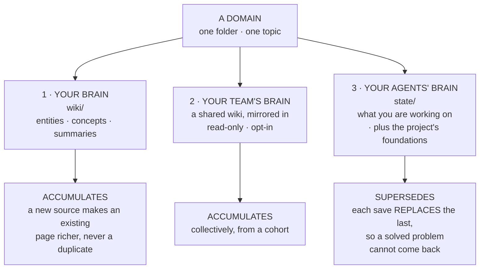

**Why the third one is different.** Knowledge is additive: everything you learn about a topic is worth keeping. Working state is not — "blocked on the login bug" stops being true the moment you fix it, and a store that merely *added* the fix would leave the stale blocker sitting there beside it. So each save of your working state replaces the one before it. Knowledge grows; state is current or it is worthless.

Layer 3 also holds the third kind of context, a project's **foundations** — its architecture, its firm decisions, its conventions. Those are not volatile and are not merged either: each one is replaced whole and read verbatim, so an agent gets the document rather than a paraphrase of it. → [§13b, Foundations](#documents--the-files-that-travel-with-a-project).

The middle layer is off unless you turn it on, and only the domains you explicitly opt in ever leave your machine.

### A day with the Curator

Nothing below is required on day one. It is the shape of a full day once all three kinds of context are in place.

1. **Morning — you add something.** A PDF you were sent lands in **Ingest**. The model reads it once and writes a summary page plus entity and concept pages, linking them into what is already there. A person mentioned in it already had a page, so that page got deeper rather than a second copy. *(→ [§8](#8-ingest-a-source))*
2. **Midday — you ask.** In **Chat** you ask how this connects to something you read months ago. The answer is built from your own pages and cites them, and you can open any page it names. If the answer is worth keeping, **Compile to Wiki** turns the thread into pages of its own. *(→ [§9](#9-chat-with-your-brain))*
3. **Afternoon — an agent picks up a build, cold.** You open a new session in whatever tool you are using and say *"resume Lumina."* One call hands the agent your brief, the last handoff — where the work stopped, what is settled, what was already ruled out — and the project's canonical documents, which it has either never read or has not read since they changed. It starts from your architecture rather than from a guess at it. *(→ [§13b](#13b-working-state--carrying-context-between-sessions))*
4. **Evening — it writes down where it got to.** The agent saves the handoff before it stops; the save overwrites, so what you get back tomorrow is current rather than a pile. On a Mac, the optional **menu bar icon** tells you it landed without opening the app. *(→ [§6b](#6b-the-menu-bar-icon-mac-app))*
5. **Whenever you like — it all travels.** One **Sync** click pushes the wiki, the conversations and the state to your own private GitHub repository, and pulls them down on the other machine. *(→ [§15](#15-sync-across-computers))*

Step 3 is the one that used to be impossible. Working state and the wiki already travelled; a project's canonical documents lived only inside a code checkout, so an agent on another machine — or in another tool, or simply started in the wrong folder — could not see them at all.

### Two ways in

Most people arrive for one of these. Both write the same markdown, and neither is a mode you
switch into.

| If you | Start at | And then |
|---|---|---|
| read a lot and want to keep what you read | [§8 Ingest a source](#8-ingest-a-source) | chat with it (§9), see it in Obsidian (§12), share it with a cohort (§15b) |
| work across sessions with agent harnesses | [§13b Working state](#13b-working-state--carrying-context-between-sessions) | add the project's canonical documents, then make capture real (§13c) |
| are just installing it | [§3 Installation](#3-installation) | and [§4](#4-get-your-api-key-gemini-claude-or-openrouter) for the API key |
| want to know what it costs first | [§19 API keys, cost & free tier](#19-api-keys-cost--free-tier) | — |

These are not two products. A book, a thesis or a research programme outlives any one session —
which is the day the second becomes the first's future.

### Where to go deep

| If you want… | Read |
|---|---|
| To add sources and understand what ingest costs and produces | [§8 Ingest a source](#8-ingest-a-source) · [§19 API keys, cost and free tier](#19-api-keys-cost--free-tier) |
| To ask your wiki questions and compile answers back into it | [§9 Chat with your brain](#9-chat-with-your-brain) |
| To build one wiki together with a cohort or team | [§15b Shared Brain](#15b-shared-brain) |
| To carry build context between sessions, tools and machines | [§13b Working state](#13b-working-state--carrying-context-between-sessions) |
| The canonical documents a project is built against | [§13b → Foundations](#documents--the-files-that-travel-with-a-project) |
| The whole product in one document, including what it deliberately does not do | [Product Overview](product-overview.md) |

> 📖 **For the long-form story** of why a second brain matters and how the parts of The Curator fit together philosophically, read **[Knowledge Immortality — Building a Second Brain with The Curator](../research/articles/knowledge-immortality-second-brain.md)**. It's a 15-minute essay covering the Karpathy spark, what markdown gives you, every section of the app in plain language, and the case for *compounding* knowledge. Recommended before you start ingesting.

---

## 1b. Who this is for

The Curator is domain-agnostic. Here are the main profiles who benefit from it:

**Content Creators (Writers, Podcasters, YouTubers)**
You consume hundreds of articles, books, and podcasts, but face a blank page when it's time to create. Ingest all your research — the Curator builds a content assembly line. The graph shows which themes you naturally gravitate toward; clicking an entity shows every source you've read about it.

**Researchers & Academics**
Batch-upload 20+ PDFs on a topic. The Curator extracts all distinct methodologies and authors. Use the graph's visual "Idea Collisions" to identify gaps in the literature — intersections between concepts that no existing paper has yet addressed. The chat synthesises findings across all papers with source citations.

**Executives & Strategists**
Upload reports, competitor analyses, and meeting transcripts. Build an intelligence layer where the most-referenced nodes grow largest, giving you a visual heat map of your knowledge. Query for synthesised strategic answers that bypass recency bias.

**Software Architects & Development Teams**
Ingest architecture decision records, API specs, and post-mortems. New team members can ask *"Why did we choose X over Y?"* and get an answer cited directly from a document written years ago. The Curator becomes a conversational Senior Engineer that never leaves. The documents a build is *governed* by — rather than merely informed by — go in a project's [foundations](#documents--the-files-that-travel-with-a-project) instead, where they are kept verbatim and handed to an agent at the start of every session.

**Medical & Scientific Researchers**
Drop in clinical trial PDFs and papers. The graph reveals hidden intersections — a compound used in one domain showing efficacy in another study — by visually bridging entity nodes across your entire literature corpus.

**Entrepreneurs & Startup Founders**
Feed it customer interview transcripts, investor updates, and market research. Query for synthesised strategic answers grounded entirely in your own collected intelligence, not generic AI output.

**Personal Growth & Self-Analysis**
Ingest journal entries, book highlights, and podcast notes. Query recurring patterns across months of writing. The Curator provides the objectivity of a third party on your own thinking.

→ See [docs/use-cases.md](use-cases.md) for detailed workflows for each profile.

---

## 1c. Nothing here is locked to one AI, one tool, or one company

The Curator is deliberately **harness-, agent- and LLM-agnostic**. Portability is not a side benefit; it is the point. Your accumulated context should never be trapped inside whichever assistant you happened to use last year.

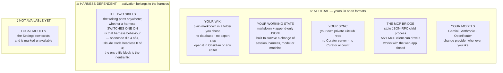

**What that buys you, concretely:**

| If you… | You are not blocked, because… |
|---|---|
| Switch from one AI assistant to another | The bridge is a **protocol**, not an integration. Any MCP client can spawn it and read your wiki and working state. |
| Stop using The Curator entirely | Your knowledge is markdown files in your own folder. Nothing to export; they're already readable. |
| Change AI provider | Three providers ship today, and swapping is a Settings choice. Your wiki doesn't care which one wrote it. |
| Work across several machines | Sync is your own private GitHub repository. No account with us, and nothing of yours passes through us. |
| Move a coding session to a different tool | Working state is plain markdown and JSONL, designed for exactly that move. |
| Start a session on a machine that has never checked the repository out | A project's canonical documents travel with it as foundations, so they are readable without a checkout. |

**And what is *not* yet neutral — said plainly, because an overclaim would be worse than the gap:**

- **The two agent skills are portable prose. Whether a harness *activates* one is a property of the harness, not of the skill and not of Claude.** Their text has no vendor-specific logic, so it works anywhere you can paste it. Two things in the packaging are Claude Code's conventions rather than anything universal — the `allowed-tools:` header uses its tool-naming scheme, and the documented install location is its skills folder — and the build script strips both when it renders the neutral form. Activation is the part nobody can promise for you: measured, **opencode** loaded `curator-continuity` natively and ran it as its **first action in 4 of 4 runs**, while **Claude Code headless never activated it at all** with the same skill installed and listed.
- **The practical consequence, and the mechanism that fixes it.** Reading working state over MCP is pure protocol and works in any MCP client. Saving is a discipline someone has to give the agent, and an installed skill only gives it if the harness reaches for the skill — which is why an agent on Claude Code saved in **0 of 4** headless runs with the skill alone. The harness-neutral mechanism is prose, not a file format: paste the block **Copy agent instructions** hands you into the file your harness already loads every session, which took Claude Code headless to **3 of 4** and changed nothing on opencode, where the skill already fired. → [§ 13b, Making sure your agent actually does it](#making-sure-your-agent-actually-does-it).
- **What the measurement does not show.** Four runs per arm is a shape, not a rate; it was headless sessions only, one task, one model, two harnesses. Interactive Claude Code was not measured, and save *quality* was not judged. → [the full table and its limits](working-state.md#activation-put-the-discipline-where-the-harness-cannot-skip-it).
- **The neutral form is generated, never hand-copied.** A second, hand-maintained copy of a long playbook would be the worst possible place for two documents to drift apart, because these files are read by *models* — two copies would not merely disagree, they would instruct two agents to behave differently. So the neutral version is **derived** from the same single source: the same prose, with the Claude Code-specific frontmatter stripped and the tool names de-prefixed.
- **Local models are not available today.** The provider row is visible in Settings and marked unavailable. The OpenRouter connection speaks an OpenAI-*compatible* protocol — that is the name of a wire format, **not** OpenAI support — which is the groundwork that makes local runtimes a natural later addition rather than a rewrite. When it ships, this guide will say so.

> A note on skill portability: an open format existing is not the same as every tool implementing it the same way. Installing a skill elsewhere may be a manual step, and a host that loads it may still not reach for it on its own — which is what the entry-file block is for.

---

## 2. What you need before you start

| Requirement | What it is | Where to get it |
|-------------|-----------|-----------------|
| A computer running macOS, Windows, or Linux | See the platform notes below | — |
| An AI provider API key | Powers ingest, chat, and AI-assisted Wiki Health | [Google Gemini](https://aistudio.google.com/app/apikey) (free tier exists, paid is very cheap) **or** [Anthropic Claude](https://console.anthropic.com/) (paid only) |
| Obsidian (optional) | Visualises the knowledge graph | Free at [obsidian.md](https://obsidian.md) |
| Node.js 18+ | Runtime that powers the local server | **Not needed for the Mac app** — it ships with its own. For the browser install: auto-installed on Mac by the one-line installer; on Windows/Linux install manually from [nodejs.org](https://nodejs.org) |

### Two ways to run it — and they are the same program

There is now a **Mac app** as well as the original **browser install**. They are not two products and not a fork: one codebase, one release, two shells. The Mac app is a window wrapped around the identical server the browser install runs, so **every screen in this guide looks the same in both**.

Exactly four things genuinely differ — how it launches, how it updates, where its data lives, and how it starts the MCP bridge. Each is called out where it comes up, and there is a summary in [§3b](#3b-the-mac-app-and-the-browser-install).

| | **The Mac app** | **The browser install** |
|---|---|---|
| What you get | A `.dmg` you drag to Applications | A folder on your disk running a local server |
| Platforms | macOS only | macOS, Windows, Linux |
| Node.js | Bundled — nothing to install | You install it |
| Where the UI appears | Its own window, with its own title bar | A tab at `http://localhost:3333` |
| Updating | **The app installs its own updates** from **Settings**, or the **The Curator → Check for Updates…** menu — which since v3.41.0 opens its own small progress window | Applied in place from **Settings**, or `git pull` |
| Your data lives in | `~/Library/Application Support/The Curator/` | Your install folder (default `~/the-curator/`) |
| Status today | **Preview.** No Apple identity yet, so macOS asks you to allow it once — on the **first** install only | Mature, fully supported, and **not** being retired |

### Platform support

| Platform | Mac app (`.dmg`) | One-line installer | Manual `npm install` |
|---|---|---|---|
| **macOS** | ✅ Preview — see [§3](#the-mac-app-macos-only) | ✅ Recommended | ✅ Works |
| **Linux** | ❌ | ❌ — script checks for Darwin | ✅ Works (`node src/server.js`) |
| **Windows** | ❌ | ❌ | ✅ Works (PowerShell or WSL2; set `CURATOR_NO_OPEN=1`) |

> The one-line installer is macOS-only because it builds a `.app` Dock launcher. The Curator's *core* (Express + Node) is fully cross-platform — Windows and Linux users clone the repo and run `node src/server.js` directly. One button in the UI is macOS-only: the **Choose folder** picker in Settings → Knowledge base. On Linux and Windows, set your knowledge folder with the `DOMAINS_PATH` environment variable instead. Everything else — ingest, chat, wiki, MCP, sync, Health — works identically on every platform.

> **Don't have a coding agent?** A Claude-Code-style CLI agent can do the install on any platform for you — see [§20 Install with a coding agent](#20-install-with-a-coding-agent).

---

## 3. Installation

### The Mac app (macOS only)

A packaged macOS application is published on the project's
[**Releases page**](https://github.com/talirezun/the-curator/releases). Download the
`.dmg` that matches your Mac — the file names say which is which (Apple Silicon for
M-series Macs, Intel for older ones) — open it, and drag **The Curator** into
**Applications**.

> ⚠️ **It is a preview, and it carries no Apple developer identity yet.** The app is
> **ad-hoc signed** — its contents are sealed, so macOS can tell it has not been
> tampered with, but there is no certificate behind that seal and it is not
> notarized, so macOS cannot tell you *who* built it. An Apple Developer enrolment is
> in progress. Until it completes, macOS **refuses to open the app the first time**.
> That is expected, not a fault, and you allow it once:
>
> 1. Open the app. macOS says it cannot verify the developer — click **Done**.
> 2. Go to **System Settings → Privacy & Security**, scroll down to **Security**, and
>    click **Open Anyway** next to the message about The Curator.
> 3. Confirm. It opens normally from then on.
>
> Don't leave a long gap between steps 1 and 2 — that button only appears for a while
> after a blocked launch. On macOS Ventura and Sonoma (13–14) the older right-click →
> **Open** → **Open** still works. On Sequoia (15) and later it does not.
>
> **What is actually known here:** the app's signature state has been checked with
> Apple's own `syspolicy_check`, which reports exactly one remaining problem —
> notarization. Nobody has yet launched a quarantined copy of a current build to
> watch which dialog macOS puts up, so the three steps above are inferred from that
> signature state rather than observed. If you see something different, that is worth
> [reporting](https://github.com/talirezun/the-curator/issues).
>
> **If macOS instead says the app *"is damaged and can't be opened"*** and offers no
> **Open Anyway** at all, you have a build from `v3.30.0` or earlier. Those shipped
> with a *broken* signature, which is a different and worse Gatekeeper class. Download
> a build from `v3.31.0` or later.
>
> The Intel build is produced by the same automated build but **has never been run on
> Intel hardware** — there is no Intel Mac to run it on. If you are on an Intel Mac,
> anything odd is worth reporting.

The app **does not need Node.js** and does not need the Terminal. It keeps its data in
`~/Library/Application Support/The Curator/`.

**You only need the Releases page for the first install.** After that the app updates
itself — [§16 → Version and updates](#version-and-updates).

**Already using the browser install?** Nothing is converted and nothing is moved — see
[§3b → Moving an existing wiki into the app](#moving-an-existing-wiki-into-the-app).

### One-command installer (recommended)

Open **Terminal** (search for it in Spotlight) and paste this single command:

```bash
curl -fsSL https://raw.githubusercontent.com/talirezun/the-curator/main/install.sh | bash
```

The installer handles everything automatically:

1. Detects whether Node.js and git are installed — installs them if missing
2. Downloads the project into `~/the-curator`
3. Installs all dependencies
4. Builds **The Curator.app** for your Dock

When it finishes, the app opens automatically in your browser. A **Getting started** panel appears in the corner on first launch. It asks which of two things you are setting up — a second brain, or memory for your agents — and then walks you through the steps that path actually needs. It doesn't block anything — see [§5](#5-first-run--the-getting-started-panel).

> ⚠️ **Pin The Curator to your Dock manually.** The installer puts **The Curator.app** inside `~/the-curator/` but does **not** add it to your Dock automatically. Open Finder → `~/the-curator/` → drag **The Curator** icon down into your Dock. From now on, one click launches everything.

> You only need to run the install command **once**. After that, click The Curator in your Dock to launch the app.

### Manual setup (alternative — works on Mac, Linux, Windows)

If you prefer to set things up yourself, or you're on Linux/Windows:

```bash
# 1. Clone the project
git clone https://github.com/talirezun/the-curator.git
cd the-curator

# 2. Install dependencies
npm install

# 3. Start the server
node src/server.js                         # macOS / Linux
# Windows PowerShell:
# $env:CURATOR_NO_OPEN=1; node src\server.js
```

Open **http://localhost:3333** in your browser. The Getting started panel will guide you through the rest.

**Linux / Windows specifics**

- Set `CURATOR_NO_OPEN=1` to skip the macOS-only `open` browser-launch on startup (the server still binds to `localhost:3333`; just open it manually).
- Set `DOMAINS_PATH=/path/to/your/knowledge` if you want your wiki folder somewhere other than `~/the-curator/domains`. The folder-picker UI button is macOS-only (uses AppleScript), but the env var works on every OS. If you've also set a folder in **Settings → Knowledge base**, that value takes priority over `DOMAINS_PATH`, and the My Curator MCP now resolves it the same way. (If you use the MCP, re-run its setup wizard after changing the knowledge base folder so Claude Desktop picks up the new location too — see [mcp-user-guide.md](mcp-user-guide.md).)
- Updating the app on Linux/Windows: run `git pull && npm install` from the `the-curator` directory, then restart `node src/server.js`. See [§16 → Version and updates](#version-and-updates) for how updating works on macOS, where it is a button in Settings.

> For the Mac Dock app (double-click to launch, no Terminal needed), see **[docs/mac-app.md](mac-app.md)**.

---

## 3b. The Mac app and the browser install

Both are supported, both are current, and **neither is a legacy path**. This section
is the map: what the two shells share, the four things that genuinely differ, and — if
you already have a wiki — what happens to it.

### What you are actually running, either way

The Curator is a **local server**. Everything you see is a web page served from your
own machine. The Mac app puts that page in its own window; the browser install puts it
in a browser tab at `http://localhost:3333`.

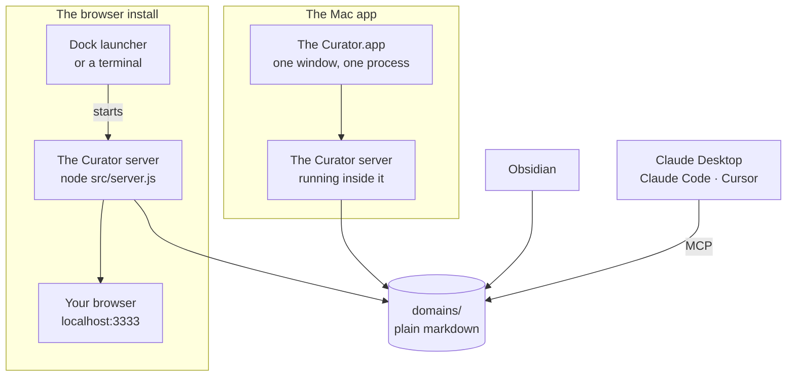

Notice where your knowledge sits. **`domains/` is a folder of ordinary markdown files,
and nothing in that picture owns it.** The app, the server, Obsidian and your MCP
client are separate things reading the same folder. That single fact is why every
question below has a reassuring answer.

### The four things that genuinely differ

Everything else — every view, every button, every keyboard shortcut, the wiki format,
Personal Sync, Shared Brain, Wiki Health, working state — is identical, because it is
the same code.

| | The Mac app | The browser install |
|---|---|---|
| **1 · How it launches** | Open it from Applications or the Dock. It opens **its own window**; no browser tab is opened, and the address it uses is chosen fresh each launch rather than being a fixed `localhost:3333`. | The Dock launcher (or `node src/server.js`) starts the server and opens your browser at `http://localhost:3333`. |
| **2 · How it updates** | **Settings → General → Check for updates → Download and install.** The app fetches a new copy of itself, checks it, swaps it in and restarts — with no Gatekeeper prompt. The git-based update does not apply and refuses. See [§16 → Version and updates](#version-and-updates). | **Settings → General → Check for updates** replaces the source in place (`git` + `npm install`), then restarts. |
| **3 · Where its data lives** | `~/Library/Application Support/The Curator/` — settings, sync configuration, and the default `domains/` folder. | Your install folder, default `~/the-curator/`. |
| **4 · How the MCP bridge starts** | Through a small launcher the app writes for itself on every start. Because of that, **moving your knowledge folder no longer makes the Claude Desktop entry go stale.** | Through a direct command naming your Node binary, the bridge script, and your knowledge folder path — so moving that folder *does* make it stale, and the wizard tells you. |

Two things that follow from #3 and are worth knowing:

- **The two installs do not share anything.** They have separate settings, separate API
  keys and separate sync configuration. They only meet if you deliberately point them at
  the same knowledge folder — which is supported, with one rule and one surprise. See
  [§16 → Two installs, one knowledge folder](#two-installs-one-knowledge-folder).
- **The application log is in the same place for both:**
  `~/Library/Logs/The Curator/curator.log`.

### Moving an existing wiki into the app

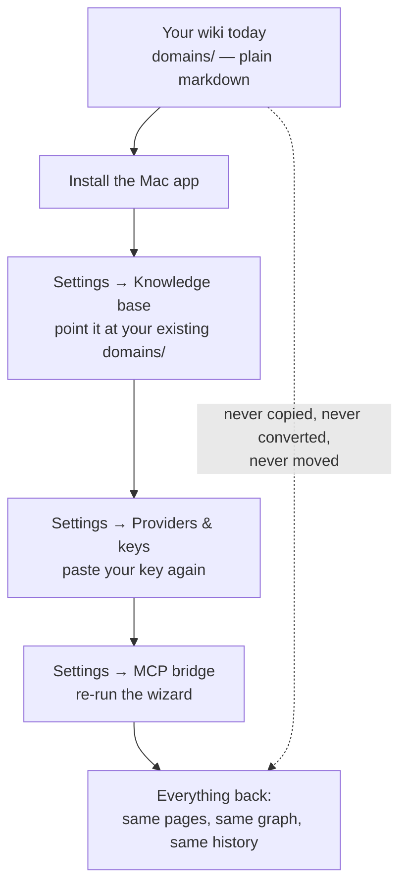

Three steps, all of which are buttons that **already exist**. There is no import, no
conversion and no database rebuild, because there is no database — pointing the app at
the folder *is* the migration.

**Where the button is.** Step one has two entrances and you will meet whichever you
reach first. On the **Domains** view the sidebar carries **Use existing folder** on
every state of that screen, and the *"No domains here yet"* card carries it too. In
**Settings → Knowledge base** the same thing is called **Choose folder**. They do the
same job.

> ⚠️ **The one mistake worth naming in advance: pick the folder that CONTAINS your
> domains, not a domain.** Full explanation, and what an empty list actually means,
> in [§16 → Knowledge base folder](#knowledge-base-folder).

| ✅ Comes across untouched | ⚠️ You redo once | ❌ Does not happen |
|---|---|---|
| Every wiki page, entity, concept and summary | Paste your API key again | Nothing is copied to a new location |
| All your domains | Reconnect Personal Sync, if you use it | Nothing is converted to another format |
| Chat history and conversations | Re-run the MCP wizard, if you use it | No file is deleted or rewritten |
| Working state (agent handoffs) | | Your browser install is not modified or removed |
| Your Obsidian vault and graph colours | | |

**There is no automatic first-launch import, deliberately.** The app does not go looking
for an existing install; it starts empty and waits for you to point it somewhere. So on
first launch you will see an empty app with no domains — that is the expected state, not
a fault, and the fix is the first step above.

**Why credentials do not come across, deliberately.** Copying API keys and sync tokens
automatically would mean new code that reads three secret files from one place and
writes them to another — code that runs exactly once per user, is very hard to test in
the shapes that matter, and fails in the direction where a secret ends up somewhere
nobody intended. Re-pasting a key takes about thirty seconds and uses a screen you have
already used. That trade was made on purpose, and it is
[D11](desktop-app-decisions.md#d11--credentials-do-not-migrate).

**Why the MCP wizard has to be re-run.** The Claude Desktop entry names the bridge by an
absolute path, and the app's bridge is somewhere different from your checkout's. Re-run
**Settings → MCP bridge**; the wizard detects a stale entry and shows you a banner. See
[mcp-user-guide.md](mcp-user-guide.md).

> **The honest reassurance, and it is a structural one rather than a promise:**
> The Curator has no lock-in to break. Your knowledge is markdown in a folder you
> chose, synced to a GitHub repository you own. If you dislike the app, the browser
> install still opens the same folder — and it remains the only option on Windows and
> Linux.

Every decision behind the Mac app — with its reasoning, its evidence, and a status
saying whether code exists for it yet — is recorded in
[desktop-app-decisions.md](desktop-app-decisions.md).

---

## 4. Get your API key (Gemini, Claude or OpenRouter)

The app uses an AI provider to read your documents and power chat. You need an API key from one of three providers:

| Provider | Free tier? | Notes |
|---|---|---|
| **Google Gemini** | Yes, with strict daily quotas | Recommended. The lowest pay-as-you-go cost, and the app's default. |
| **Anthropic Claude** | No — paid only | Roughly 10× the Gemini bill for the same workload. |
| **OpenRouter** | Some models are free, with a daily request cap | One key onto many vendors. **It can build your wiki**, on three hand-measured models, and its default is the cheapest route to that job of the three providers. Saving its key **no longer** moves your build lane on its own (changed in v3.45.0 — it does so only if nothing is building yet); to actually build on it, pick one of its models under *What builds your wiki*. Read [§16b → OpenRouter](#openrouter--one-key-two-lanes-and-a-model-list-you-refresh) first — its two lanes are the one place this gets subtle. |


> ⚠️ **About "free" — read this before you commit to free-tier-only usage.**
>
> The Gemini free tier exists, and it's enough to *try* the app and ingest a few articles. It is **not enough for serious use.** As of the [December 2025 quota tightening](https://ai.google.dev/gemini-api/docs/rate-limits), Gemini 2.5 Flash Lite (the model The Curator uses by default) is capped at:
>
> - **15 requests per minute** (RPM)
> - **1,000 requests per day** (RPD)
> - **250,000 tokens per minute** (TPM)
>
> A typical batch ingest of 5–10 PDFs can hit those limits and stall mid-run with `429 RESOURCE_EXHAUSTED` errors. **For real use, enable billing in Google AI Studio.** The pay-as-you-go price is so low that most users pay €1–€10/month — see [§19](#19-api-keys-cost--free-tier) for actual numbers.

### How to create a Gemini key

1. Go to **[aistudio.google.com/app/apikey](https://aistudio.google.com/app/apikey)**
2. Sign in with your Google account
3. Click **Create API key**
4. Copy the key — it starts with `AIza` and is about 40 characters long
5. **(Strongly recommended)** Click **Set up Billing** in the same console and link a payment method — the upgrade unlocks the higher paid-tier rate limits and is what enables most users to actually run the app at scale. You will not be billed until you exceed the free tier.
6. Keep the key somewhere safe — you'll paste it in the next step

> Your API key is like a password. Never share it publicly or post it on the internet.

### Or use Anthropic Claude instead

If you'd rather pay Anthropic than Google (e.g. for privacy preference, or because you already have a Claude account):

1. Go to **[console.anthropic.com](https://console.anthropic.com/)**
2. Generate an API key under **Settings → API Keys**
3. Anthropic has **no free tier** — you must add billing before any call works
4. The Curator defaults to **Claude Haiku 4.5** (Anthropic's lowest-cost tier). If you want more capability, you can pick a different Anthropic model in **Settings → Providers & keys** — seven are offered, with the price and the measured trade-off shown next to each. See [§16b Choosing your AI model](#16b-choosing-your-ai-model).

**Saving a second key does NOT change which AI builds your wiki.** Connecting a provider connects it, and nothing else. The **first** key you connect becomes the one that builds — there is nothing else it could be — but after that, the model that runs **ingest, Wiki Health and Compile** only changes when **you change it**, under *What builds your wiki*. So you can paste an OpenRouter key to try a model in chat and your next ingest is still built by exactly what built the last one.

> **Changed in v3.45.0.** Until then The Curator used *last-saved-wins*: every key you saved silently took over the build lane, so pasting a key to try one thing moved your ingests — and your bill — onto a different vendor's model without asking. That was the single most surprising behaviour in the whole provider screen. Connecting a key now saves the key; choosing a build model is what moves the lane.

Two things make this easy to stay on top of:

- **The model shown under *What builds your wiki* is always the truth** about what runs your next ingest, including which provider it belongs to.
- **To change it**, pick a different model there. You never need to re-paste or delete a key to switch provider.

**If you disconnect the provider that was building**, the lane has to go somewhere, so it moves to the **cheapest model you have connected that we have actually measured** — and the app tells you where it went. Nothing silently stops working, and nothing silently gets more expensive than it needs to be.

**Chat is a separate lane and is unaffected.** Chat sends its own per-message model, so switching your active provider does not change what answers your chat messages — and picking an OpenRouter model in the chat composer does not change what builds your wiki. See [§16 → Connect a provider](#1--connect-a-provider) and [§16b](#openrouter--one-key-two-lanes-and-a-model-list-you-refresh).

---

## 5. First run — the Getting started panel

The first time you open The Curator there is nothing to talk to yet, so a small **Getting started** panel appears in the corner. Since v3.61.0 it opens with a question, because two quite different people install this app and the steps are not the same for them:

> **What do you want to set up first?**
>
> - **Build a second brain** — *"Read sources, get a wiki. Ingest and chat need an AI key."*
> - **Give your agents memory** — *"Your agents read and write project context. No AI key needed."*

| Door | Lands you on | The steps you then get |
|---|---|---|
| **Build a second brain** | **Domains** | 1 · Add an AI key → 2 · Point at a wiki, or start one → 3 · Ingest your first source |
| **Give your agents memory** | **Project context** | 1 · Point at a wiki, or start one → 2 · Start a project → 3 · Connect your agent → 4 · Add an AI key *(marked **Optional**, and on this door the body is the short one — "Needed for ingest and chat.")* |

**Why the second list does not start with a key.** The memory layer and the MCP bridge do not use a model at all — the bridge reads and writes markdown on your disk and never calls a provider, and it runs with the app closed. If you came here to give your agents memory you can create a domain, create a project, paste the marker line and be productive with no API key whatsoever. The panel used to tell you "nothing else works without a model", which was simply false for that path; step 1 now names what a key *is* for — ingest and chat — and says the rest works without one.

**Neither door locks anything in, and nothing is stored about "which kind of user you are."** The panel works out which list to show from what is actually on your disk — a wiki page means the first list, a project or an agent that has called the bridge means the second — and it asks only while neither is true. A **Pick a different start** link swaps lists whenever you like, and the third step of the agent list is the one screen you would otherwise have had to go looking for: **Settings → MCP bridge**, which the button opens directly.

Each item has a button that takes you straight to the right place. The panel tracks real state, not clicks: it reads *"2 of 3 done"* (or *"0 of 4 done"*) and ticks items off by itself as you actually complete them, and it stops appearing once they are all done.

> **The "Connect your agent" step works for any MCP client, not just one.** It ticks over when the bridge has actually answered a call — from Claude Desktop, Claude Code, Cursor or anything else that runs a local MCP server — rather than by checking one product's config file. See [§18 → The tool map](#the-tool-map--what-your-agents-used) for where that reading comes from.

![The Getting started panel, docked in the top-right corner over Settings → General, on an install with a wiki but no AI key. It reads 'Getting started' with an info mark and a close cross, and '2 OF 3 DONE'. Step 1, 'Add an AI key — Needed for ingest and chat. Project context and the bridge work without one.', is open with an Open Settings button; 'Point at a wiki, or start one — You have somewhere for knowledge to land.' and 'Ingest your first source — Your wiki has pages in it — the loop is running.' are ticked and read Done. A footer line: 'You can ignore this and just start typing. Settings → General → Show setup guide brings it back.'](images/curator-getting-started.png)

*The checklist on an install that already has a wiki but no AI key: two of three steps done, the key still to add. A fresh install opens on the two doors first; pick one and each row is unticked, reading "0 OF 3 DONE" — or "0 OF 4 DONE" on the coding-agents list — with an action button in place of the word "Done". Shown on the synthetic demo workspace; `node scripts/screenshots.mjs` regenerates it.*

**It never blocks you.** It is a panel, not a modal — you can click past it, start typing, and ignore it entirely. Dismiss it with the **✕** in its corner. Dismissing is not permanent: **Settings → General → Show setup guide** brings it back at any time. The dismissal is remembered per *install*, not per browser, so it does not follow you from a browser install into the Mac app.

> **On the second-brain path, the key step is the only one you truly cannot skip in substance** — without a key, ingest and chat have no model to call. Nothing stops you dismissing the panel first and adding the key later. **On the coding-agents path it is genuinely optional**, which is why it sits last there and says so: the memory layer and the MCP bridge never call a model.

> **An OpenRouter key alone does not tick off the key step.** The checklist looks for a Gemini or an Anthropic key specifically. If OpenRouter is your only provider the app works fine — you can ingest and chat — but this row keeps saying "Add an AI key" until you either add one of the other two or dismiss the panel. Dismissing it is the right move; nothing is wrong.

### First run is the same in the Mac app — with one thing to expect

The panel, the two doors and the steps behind each of them are identical, because it
is the same interface. There is no separate installer wizard and nothing asks you for
a key before the app will open.

The one thing that differs is what an **existing** user sees. The app does not go
looking for a wiki you already have, so it starts genuinely empty: no domains, and the
Getting started panel offering to create your first one. That is the expected state.
Point it at your existing folder — **Settings → Knowledge base** — and everything
appears. [§3b](#moving-an-existing-wiki-into-the-app) has the full three-step path.

> **For developers:** you can also configure API keys by creating a `.env` file manually (`cp .env.example .env`) and setting `GEMINI_API_KEY=your_key_here`. Keys saved in Settings take priority over `.env` when both are present. Note that a `.env`-only key does **not** tick off the key step — the checklist reads keys saved through the app (`.curator-config.json`), so it will keep showing "Add an AI key" even though the app can already make calls.
>
> This `.env` route is for the browser install only. The Mac app's program files are inside the application bundle, which is read-only, so there is nowhere useful to put a `.env` — use Settings.

---

## 6. Starting and quitting

### The Mac app

Open **The Curator** from Applications, or click it in your Dock. It opens in its own
window. **No browser tab opens**, and you do not need one — the interface is the window.

> **There is no `localhost:3333` to bookmark in the app.** It picks a free address on
> your own machine each time it starts, so the number changes between launches. This is
> deliberate: it means the app and a browser install can never fight over the same port.
> Everything you need is inside the window.

| You do… | What happens |
|---|---|
| Close the window (red button or `⌘W`) | The window **hides**; the app keeps running, and anything in flight keeps going. |
| Click the Dock icon again | The same window comes back — hidden, minimised or closed, it is restored. Nothing restarts. |
| Open The Curator a second time | It refuses, with *"The Curator is already running"*, and brings the existing window forward instead. One copy, one wiki. |
| Quit (`⌘Q`, or Dock icon → **Quit**) | The app **checks whether anything is writing to your wiki first** — see below. |
| Reboot your computer | The app is gone; open it again from the Dock or Applications. |

**Quitting asks first when it matters.** If an ingest, a compile or an update is in
flight, the app does not just exit. You get a dialog headed **"Quit now?"** with two
buttons — **Keep working** and **Quit anyway** — and a line naming what is running, for
example *"A write to your wiki is in progress. Quitting now can lose work you have paid
for."* **Keep working** is the highlighted default.

You get the same question, worded differently, if the app *cannot tell* whether
something is running. That is on purpose: the app never assumes it is safe to quit
during a paid, multi-minute write just because a check came back unclear.

> The window remembers its size and position between launches.

> **The app can also live in your menu bar.** Optional, off by default, and switched on in
> **Settings → General → Menu bar** — a small icon that shows what your agents have just saved
> without you opening the window. See [§6b](#6b-the-menu-bar-icon-mac-app). Turning it on does
> not change any of the quit behaviour above: **Quit** in the menu bar runs the same
> work-in-progress check that ⌘Q does.

### The browser install — macOS Dock launcher

Click **The Curator** icon in your Dock. It starts the local server and opens in your browser automatically.

> If The Curator is not yet in your Dock, open Finder → `~/the-curator/` → drag the app icon down into your Dock first (one-time step).

### The browser install — manual / Linux / Windows

Open a terminal in the project folder and run:

```bash
node src/server.js                            # macOS / Linux
# Windows PowerShell:
# $env:CURATOR_NO_OPEN=1; node src\server.js
```

Then open **http://localhost:3333** in your browser.

### How the browser install's lifecycle works

It is a **local web app** — a small Express server runs on your machine and renders the UI inside whichever browser you have open. Four things to know:

| You do… | What happens |
|---|---|
| Close the browser tab | The server **keeps running** in the background, idling at near-zero CPU. Nothing is lost. |
| Click the Dock icon again (Mac) | The browser tab reopens and reconnects to the already-running server. Fast — there is no restart. |
| Right-click Dock icon → **Quit** (Mac) | The server actually stops. Use this when you want the process gone. |
| Press `Ctrl + C` in the terminal (manual mode) | The server stops. |
| Reboot your computer | The server is gone; relaunch it (Dock click or `node src/server.js`). |

> **There is no "Stop server" button in the UI.** It was deliberately removed in v2.1 because AppleScript's reopen handler is broken on modern macOS. Use the Dock right-click menu instead.

> ⚠️ **Quitting the browser install does not warn you about work in progress.** That check exists only in the Mac app. So if you ingest a 200-page PDF here, **don't quit until you see the success banner** — the ingest stream lives inside the server process, and killing it mid-run loses the rest of a document you have already paid to have read.

---

## 6b. The menu bar icon (Mac app)

*Mac app only. The browser install has no menu bar presence — the setting is still shown there, and says so, rather than leaving you hunting for a control that does not apply.*

### The one question it answers

You are deep in a coding session, your context window is filling up, and you want to know — in about a second, without leaving what you are doing — **whether your agent has actually written the handoff, and how long ago.**

That is the whole feature. Everything below follows from it.

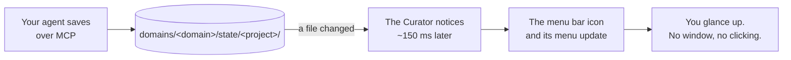

> **It is off by default, and that is not caution.** A brand-new install has no agent memory at all, so an on-by-default icon's only possible content is *"No agent memory yet"* — the worst first impression the feature can make, and one that teaches you the icon is not worth clicking.

### Turning it on

**Settings → General → Appearance → Menu bar.** It takes effect immediately; there is nothing to restart, and you can switch it back off the same way.

It is a **switch with a checkbox under it**, which is how macOS draws a facility you turn on plus a choice that only exists once it is on:

| Control | What you get |
|---|---|
| **Show the menu bar icon** — off | No menu bar icon. The Dock icon and the window behave exactly as they always have. **This is the default**, and the line under the control says so. |
| **Show the menu bar icon** — on | A menu bar icon, alongside your Dock icon |
| **Hide the Dock icon while it is showing** | The dependent checkbox. It is greyed out until the switch is on — shown rather than hidden, so you can see the option exists. Your choice is remembered, but **the Dock icon is not actually hidden yet**; today this behaves as *on* with the Dock icon still there. [Why](#what-is-not-finished-and-what-has-never-been-seen) |

> *Corrected in v3.54.0.* This guide described three segmented choices — **Off** / **On** / **On, hide the Dock icon** — which is what the control looked like until v3.44.0 replaced it with the switch-and-checkbox pair above. What the setting **does** is unchanged; only its shape was wrong here.

### What you see when you click it — Layout A *(v3.74.0)*

**The menu was rebuilt around the pulse — one row per (project × tool) that saved recently, and everything else folded away.** Where the previous layout opened on a single *"Working on: \<project\>"* headline, one save-pulse strip and a flat list, Layout A puts the tool that wrote each save on the row itself, folds anything that has not saved in the last day out of the way, and moves the collision and GitHub-handoff notices up under the rows they are about instead of burying them at the foot of the menu.

```
┌──────────────────────────────────────────────────────────┐
│  ▁▂█▇█▃▆  ┈┈┈───────   7 days · 192 saves · Claude Code  │  ①  the save pulse
│      ▸ Saves by tool                                     │       (a submenu, one
│                                                            │       strip per tool)
│  ── Active · last 24 h ────────────────────────────────── │  ②  header
│  ● ott · Claude Code · 8 min ago                       ▸  │  ③  one row per
│      opus-5.5 — v1.3.0 shipped, campaign next             │       project × tool
│  ◕ lumina · Antigravity · 3 hr ago                     ▸  │
│      gemini-3 — voice rewrite landed                      │
│  +2 more active projects                               ▸  │  ③b overflow
├──────────────────────────────────────────────────────────┤
│  Two tools are writing ott / main                         │  ④  notices, only
│  14 handoffs waiting on GitHub                             │       when true —
│  studio saved after this Mac                               │       directly under
├──────────────────────────────────────────────────────────┤       the Active rows
│  ◔ Idle · 4 projects                                    ▸  │  ⑤  the Idle fold
├──────────────────────────────────────────────────────────┤
│  ▪ Knowledge · 6 domains                                ▸  │  ⑥  every domain's
├──────────────────────────────────────────────────────────┤       page bar
│  Open Project Context…                                    │
│  Open The Curator                                          │  ⑦  always here,
│  Settings…                                                 │       in every state
├──────────────────────────────────────────────────────────┤
│  Updated 12:42                                              │  ⑧  how fresh this
├──────────────────────────────────────────────────────────┤       reading is
│  Quit The Curator                                            │
└──────────────────────────────────────────────────────────┘
```

*Abbreviated. The notice lines and the overflow row appear only when they apply; everything else is
always in that order. Every heading (**Active · last 24 h**, and each submenu's own header) is a
real macOS section header, not a drawn rule; the pulse strip and each row's freshness mark are real
drawn images, not text — the blocks above are the closest a page of text can get. The `▸` on a row
is macOS's own submenu arrow.*

| | What it is | Why it is where it is |
|---|---|---|
| ① | **The save pulse** — a small drawn strip of the last seven days, then a sentence: *`7 days · 192 saves · Claude Code`*. With more than one tool active it opens a **`Saves by tool`** submenu, one drawn strip per tool — `Claude Code · 200 saves`, or `Antigravity · none · last seen 1 Sep` for a tool the store has seen but that did not save inside the window | It sits on top because it is the widest-angle fact the menu has — *has anything been saving at all, and who* — and answering it first means the row below never has to repeat it. [How to read it](#reading-the-save-pulse) |
| ② | **`Active · last 24 h`** | A plain section header, not a row — it names what the rows under it are |
| ③ | **One row per project × tool** that saved in the last 24 hours, newest first. Line one is `project · tool · age`, with the freshness mark in the gutter; line two is `model — the agent's own one-line summary`. Hovering, or opening the row's submenu, reaches the four actions (and, when the project has other scopes or machines, a nested **Other work-streams** section carrying the same four actions per work-stream) | The row now carries what the old headline, the tool-and-model line and the first list row used to say between them — one line for *which project, which tool, how long ago*, a second for *which model, and what it did*. [How to read a row](#how-to-read-a-row) |
| ③b | **`+2 more active projects`**, only when the cap is exceeded — **and you can click it**, into a submenu of the same rows | A cap is never allowed to look like a measurement. The number is counted against everything on disk, not against what fits, and it is a live menu item rather than a dimmed apology |
| ④ | **Notices**, only when they have something to say, directly **under** the Active rows | A caveat about the rows belongs right under them, not buried at the foot of the menu behind the domains list — where a photograph of the previous layout showed a collision said twice and read neither time. A notice naming a project (a collision) is enabled and opens that project; the rest are statements |
| ⑤ | **`Idle · N projects`** — one fold, collapsing every project with no save in the last 24 hours. Its submenu lists one row per idle project, same shape as an Active row | Idle projects still matter — you can still reach and resume any of them — but they no longer compete with today's rows for five scarce lines on the face of the menu |
| ⑥ | **`Knowledge · N domains`** — a submenu with every domain's page bar, in that domain's own [identity colour](#reading-the-screen) | Unchanged from the previous layout, just moved behind one row instead of sitting on the face — the same reason Idle folds |
| ⑦ | The three ways back into the app | Always present, in every state, whatever the data above them does. That is what makes the icon safe to switch on |
| ⑧ | *"Updated HH:MM"* — an **absolute** time | The rows' ages are relative; this one is not, deliberately. They answer different questions — *how old is this event* versus *how old is this reading*. A click opens the menu on the snapshot the last read produced and refreshes afterwards — so the menu is not "fresh on click", and this stamp is what tells you how close the snapshot is |

**Quit is always last, and it is the system's own Quit.** It is not a shortcut that skips anything: quitting from the menu bar runs the same check as ⌘Q, so if an ingest or a compile is in flight you still get the *"Quit now?"* dialog described in [§6](#6-starting-and-quitting). That matters more here, not less — an app that keeps running with no window on screen is more likely to be alive while something is being written.

> **Removed from the menu, kept in the app.** Four things that used to sit on the face of the menu
> are gone from it as of v3.74.0 — the maintainer's own decision, made because the first Active row
> now carries the facts they used to state on their own: the **`Working on: <project> · <age>`**
> headline and its grey `harness · model` line; the **Session start** line (the context-window
> planning reading); the **Documents** line; and the **"N of M saved"** capture bars, which turned
> out to be counting MCP bridge *process ids*, not real agent sessions (see
> [Agent connections](#the-meter-did-the-session-read-and-did-it-save), below). None of that
> information disappeared — it still lives in [Project context](#7-finding-your-way-around), step ②
> **Memory** and step ④ **Session start** — it simply is not drawn a second time in the menu bar.

### How to read a row

Every Active or Idle row is the same shape:

```
ott · Claude Code · 8 min ago
    opus-5.5 — v1.3.0 shipped, campaign next
```

**Line one is `project · tool · when`, and nothing else is ever allowed onto it.** Line two is
*which model* and then **the agent's own one-line summary of what it did**. The tool and the model
are dropped from line one and two respectively only while they distinguish nothing — the tool when
every visible row shows the same one, the model likewise — and nothing a drop removes becomes
unreachable: hovering a row shows the full `project · work-stream`, the machine, the exact model
string and the exact timestamp.

**And the `when` column tells you which clock it came from.**

| You see | It means |
|---|---|
| **`8 min ago`** | The **agent's own clock**, recorded in the journal when it saved. This is the real answer. Since v3.74.0, ordering across scopes and machines — which save is "latest" — is decided by this same recorded time first, falling back to the file's timestamp on disk only when no agent time was recorded at all |
| **`changed 8 min ago`** | The **file's timestamp on this disk**, used only as that fallback. For a handoff that arrived over Personal Sync, that is when it *landed here*, not when it was written — git rewrites file times when it checks a file out |
| **`time unknown`** | No save time was recorded for this work-stream. It is never shown as *"just now"*, and a row with no known age sorts to the bottom, never the top |

**Hovering the icon** shows the newest save in the store as a tooltip, without clicking — worded
as what it is: *"Last save: ott · Claude Code · 8 min ago"* — followed by that project's standing
brief: *"Brief updated 2 days ago by an agent"*. Since v3.76.0 the brief's age is the time its
writer **recorded** in the brief itself (the app's editor and the MCP's `save_project_brief` both
stamp it), not the file's date on disk, which a restore or a sync rewrites; and *"by an agent"*
appears whenever an agent wrote it at your instruction (before v3.76.0 that clause could never
appear). A brief with no recorded time — one written before v3.48.0 — reads *"Brief file changed
… ago"*, so you can tell the file's age from the brief's.

### The freshness mark

Every row — Active, Idle, and each tool's line inside **Saves by tool** — carries a small dot to its
left, drawn from the same freshness scale the rest of the app uses (`--fresh-hot` / `--fresh-mid` /
`--fresh-cold`).

| Mark | Meaning |
|---|---|
| **●** filled, with a halo | **Being written right now** — under 60 seconds |
| **●** filled, no halo | Saved within the last hour |
| **●** filled, cooler tone | Saved within the last 24 hours |
| **●** filled, coldest tone | Saved within the last 7 days |
| **○** hollow ring | Older than 7 days |

A row's own colour is never the only signal — the tiers are also a ladder of how much ink is on the
screen, filled to hollow, so the mark reads with colour removed entirely. Hover a row and the band
is also stated in words.

### What a row can do

Every Active or Idle row has a **submenu** — hover it and four items appear.

| Item | What it does |
|---|---|
| **Open in The Curator** | Opens the app on Project context, at that project |
| **Copy resume prompt** | Puts a short **instruction** on your clipboard: paste it into a fresh agent session and it knows how to fetch this work-stream's state for itself |
| **Copy handoff as Markdown** | Puts the **document itself** on your clipboard — your brief and the session handoff, in full |
| **Reveal current.md in Finder** | Opens a Finder window with the handoff file selected |

**When the project has other scopes or other tools' saves, the same submenu adds an "Other
work-streams" section beneath the four actions** — one row per additional work-stream, each opening
the same four actions of its own. That is the route to a work-stream the cap on the face of the menu
hid, or to a second tool's own scope on the same project, without leaving the row you are already on.
It lists five; the rest are counted on a last line, **"N more in Project Context…"**, which opens the
app there. Since v3.76.0 that N is taken against the project's **true** number of work-streams — the
same count Project Context's Handoffs table shows — minus the ones this menu shows, not against the
saves the menu happened to fetch (which once read "8 more" for a project with 16 more). It is said
once per project, on its first row; a second tool's row whose own list was cut says *More in Project
Context…* with no number, so nothing is counted twice.

**The two Copy items exist because a menu cannot open a work-stream.** Clicking a row lands on the
*project*; the work-stream picker inside the app has no address the menu can dial. The clipboard is
the route the menu does have.

**They are for two different agents.**

*Copy resume prompt* is for an agent that can reach your knowledge itself — through the my-curator
MCP, or failing that by opening the file. Its first line is the short form a person can also just
say out loud:

```
Resume project "lumina" (domain "acme"), latest scope.
```

What follows is the exact MCP call to make — on a project's **newest** work-stream that call asks
for `scope: "latest"`, so the agent does not need the name to be right; on any other row it names
that row's own work-stream, because `latest` there would open a different one. Then the file path to
fall back on if it has no bridge, the `.curator-project` marker line for this project, and the
instruction to save the **complete** state back when it runs low on context.

*Copy handoff as Markdown* is for one that can reach neither — a browser chat with no tools. It is
the brief and the handoff, as two clearly separated sections, uncapped — the store already bounds a
handoff at 48 KB and a brief at 32 KB, and the size is shown on hover.

> **Both of them say, in the same words, which half you are supposed to obey.** The handoff and the
> journal are **recorded data to verify**; the brief is **your own instructions and is followed**.
> That distinction is the whole of how the memory layer is meant to be read, and a paste that lost it
> would hand a model a document with no way to tell them apart.
>
> **And the handoff is read through the store, not off the disk.** The Curator escapes
> protocol-shaped markup on the way *out* of a file, because a handoff that arrived over sync from
> another machine was not necessarily written by your own tools. Copying it goes through that same
> read, and says so at the bottom of the document when anything was escaped.

### Reading the save pulse

Under the top row, one line carries a small drawn strip — **14 marks, one per twelve hours, covering
the last seven days, oldest on the left** — and beside it a sentence saying what the picture adds up
to.

```
                      ▃ █ ▅ █
              ▂   ▄   █ █ █ █
┈┈┈┈┈┈┈┈┈─────────────────────      7 days · 192 saves · Claude Code
╵   ╵   ╵   ╵   ╵   ╵   ╵  ╵╵
└ before ┘ └──── what actually happened ────┘
  this store
  existed
```

**There are four kinds of mark, and telling the first two apart is the whole point.**

| Mark | What it means |
|---|---|
| **A solid baseline** running the width | The timeline. Solid means **your store existed** for that stretch |
| **A dotted baseline** | **Your store did not exist yet.** Not "quiet" — *unknown* |
| **A violet bar** standing on the baseline | Saves landed in that twelve-hour block. **The taller the bar, the more saves** — the ladder is 1, 2–3, 4–6, 7–12, 13 or more |
| **An amber cap** on the top of a bar | **A different agent tool took over** inside that twelve hours. This is the one mark that answers *did the baton get passed cleanly* |

Below the baseline, **one tick per day**, with **today's drawn double width**.

**The sentence beside it never claims more than the picture can support.**

| You see | It means |
|---|---|
| **`7 days · 192 saves`** | The strip really does cover a full week |
| **`4 days known · 41 saves`** | Your store is **younger than the window**. The count and the picture are about those four days, not about a week |
| **`at least 41 saves`** | One or more work-streams had **more history than could be read** — each journal is read from its last 16 KB. The number is a **floor**, and the oldest marks under-count |
| **`no saves`** | The window really is covered and really is empty. A quiet week |
| **`nothing recorded yet`** | Every mark is "did not exist yet" |
| **`no save times recorded`** | There are journals, but none of them carries a usable time |

**`· Claude Code`, naming one tool, appears when exactly one tool saved inside the window** — a
silent second harness is then an absence you can read, rather than reading identically to a store
that tracks no tools at all. With more than one tool the clause reads **`· 2 tools`** instead, and
the strip's own **`Saves by tool`** submenu (described in the "what you see" table above) lists each
one by name. Counted over **normalised** tool identity since v3.74.0: `Claude Code`, `claude-code` and
`Claude Code (desktop)` are the same tool for this count, so spelling drift no longer inflates the
tool count or reads as a false collision. `claude-desktop` (the separate Claude Desktop app) is
never folded into it.

**Hover the strip** and the tooltip gives you the legend plus everything the sentence had to leave
out — how many work-streams were counted, how many older saves fall outside the window entirely, and
the timestamp of the oldest save it can see. **Clicking the strip, or a tool's own strip in the
submenu, opens Project context**, where the saves it counts are listed.

**Only the agent's own recorded save time is ever counted** — never the file's timestamp on disk.
That matters most on a second computer: file times get rewritten when Personal Sync checks files
out, so a strip built from them would draw a colleague-machine's entire history as one giant spike at
the moment you pulled. Yours shows *when the work happened*, not *when it landed here*.

### The Knowledge fold

**`Knowledge · N domains`**, its own row below Idle, opens to every domain's page bar in that
domain's own [identity colour](#reading-the-screen) — unchanged from the layout before v3.74.0,
just moved behind one row instead of sitting on the face of the menu. Clicking a domain's line opens
Settings, where **Domains in this folder** ([above](#knowledge-base-folder)) lists every domain the
same way.

### The icon itself

It carries exactly one bit beyond *"The Curator is running"*.

| Icon | Meaning |
|---|---|
| **○** — a hollow ring | The Curator is running. Nothing has been written here very recently |
| **●** — a filled centre | An agent has written **on this computer** within the last **2 minutes** |

Three things it deliberately is **not**: there is no number badge (*a count of what?*), no animation (an animated menu bar icon is the thing people uninstall apps over), and **no text beside it**. A relative age in the menu bar is either stale or it has to wake the app every minute forever to stay honest, and every extra pixel of width makes an icon more likely to vanish behind the notch on a narrow screen. The headline lives in the hover tooltip instead.

The filled state is a **local** instrument: a handoff pulled from another machine never lights it, because that is not an agent working *here*.

---

### Ways to use it

Situations the widget was actually designed around. They are not illustrations — each one is the reason a specific decision in it was made the way it was.

#### Scenario 1 — Two agent tools on one computer

*You run Claude Code in one window and Antigravity in another, on the same project.*

Each Active row already names **which tool wrote it**, so *"did Claude Code save, or was that
Antigravity twenty minutes ago?"* is answerable at a glance — you get two separate rows, one per
tool, rather than one row you have to guess about.

It also warns you about something that is otherwise completely silent:

```
Two tools are writing ott / main
```

**Here is why that matters.** Working state is stored per *project · work-stream · computer* — there is **no slot in that path for the tool**. So two agent tools on one machine, told to use the same work-stream, write to the **same handoff file**, and each save **replaces** the other's. The screen looks calm. You come back the next day, resume, and the handoff you are reading is whichever tool happened to save last.

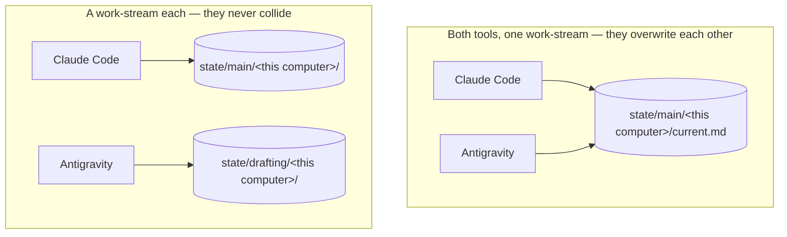

**The remedy is yours, and it is one sentence: give each tool its own work-stream name.** Tell each agent which scope it owns — `main` for one, `drafting` for the other — and they never touch the same file again. The widget names the collision and stops there, on purpose; a menu bar line has no business proposing a fix in six words.

> **If it happens anyway, the save still succeeds — and nothing is lost.** A save is never refused
> just because a different tool wrote the last one, so you are never
> blocked. But since v3.74.0, when a save is about to replace a handoff whose last save came from a
> **different** tool, The Curator first copies the replaced `current.md`, byte for byte, to
> `previous.md` in that same scope-and-machine folder — before the new content is written. Open
> **Project context → step ② → Working state** and, when a replaced handoff exists, you will see an
> unfolded line — *"Previous handoff by \<tool\> · \<age\> — open"* — that opens the replaced text in
> the right-side reader, labelled *"Replaced handoff — by \<tool\>"* and treated as recorded data to
> verify, not instructions to follow. `previous.md` holds only the one most recent cross-tool
> replacement — a second cross-tool save replaces it in turn — and a same-tool save never touches it
> at all. No warning fires, and nothing is copied, when either side's save named no tool.
>
> **What is not lost either way.** The append-only journal survives a collision regardless — every
> save writes a line carrying its own tool name, so the record of *what happened* is intact even when
> the *current handoff* only holds whichever tool saved last. You can read the whole trail in
> **Project context → step ② → Journal**.

#### Scenario 2 — Two or three computers, one private GitHub repo

*A laptop and a desktop, each with its own agent, syncing working state through [Personal Sync](#15-sync-across-computers).*

Two things the widget gives you here:

| | |
|---|---|
| **You can see at a glance that a work-stream was written somewhere else** | A remote row shows the **machine** instead of the tool, so a line reading *"research — studio · 3 hr ago"* reads as *"the other computer did this, three hours ago"* without you opening anything |
| **You are told which clock the age came from** | A handoff that arrived over sync carries the moment it *landed*, not the moment it was written — so the widget says **`changed 3 hr ago`** rather than `3 hr ago` when the agent's own time is not available. A day-old handoff can never present itself as fresh |

The practical use: **before you resume a work-stream, glance at the icon.** If the newest row for it names another machine, that machine wrote it more recently than you did, and pulling before you start is the difference between continuing and diverging.

> **One laptop counts as one computer, even when your Mac has changed its own name.** macOS re-derives your machine's hostname from the network, so a laptop that has moved between Wi-Fi networks can end up with **two folders on disk** that are the same computer. The widget matches on the **installation** identity rather than the name, so those collapse into one row instead of inventing a second machine you do not own.

> **How the *"14 handoffs waiting on GitHub"* line gets its answer — and what its absence means.**
>
> **Opening the menu asks GitHub.** Only opening it: never hovering, never on a timer. That is
> deliberate — a background check would mean The Curator phoning GitHub forever behind a closed
> menu, on battery, possibly on a metered connection, to keep a line fresh that nobody is looking
> at.
>
> An answer older than five minutes is dropped rather than shown with an age. So: **absence means
> nobody has checked, and it is deliberately never rendered as "you are up to date."** **Pulling is
> still a deliberate act you take in the Sync view.**

#### Scenario 3 — Running low on context

*The one this feature exists for.* You are near the end of a context window, about to ask the agent to save and stop, and the thing you want to know is whether the save actually happened.

**Move the pointer to the icon. Do not even click.** The tooltip is the answer:

```
The Curator — Last save: ott · Claude Code · just now
```

**`just now` means "within the last minute"** — anything under sixty seconds reads the same way, because a menu bar is not a stopwatch. Above that it steps through *N min · N hr · N days · N weeks*.

For the full picture — including your brief's own age — **Open Project Context…** lands you on the overview card across the top of the page ([§7](#the-overviews-memory-tile-and-the-warnings-above-the-four-rows)).

> **What the widget can never tell you: whether you are saved *now*.** It knows when the last save happened, not whether anything has changed since. That is why the line reads **Last save**, and not *"you are saved"*.

#### Scenario 4 — "Have we actually been saving, or did the habit quietly die?"

*The one the [save pulse](#reading-the-save-pulse) exists for, and the only one that is about a **week** rather than a **moment**.*

Continuity only works if the saves keep happening. But nothing ever tells you they have stopped — a missed save is not an error, it is an absence. You notice weeks later, when you resume a work-stream and the handoff describes a problem you solved on Tuesday.

**Open the menu and look at the top row. You are looking at the shape, not the numbers.**

| The strip looks like | Read it as |
|---|---|
| Marks spread across most days, with gaps at night and at weekends | **A working rhythm.** This is what a healthy store looks like — the gaps are you sleeping, not the habit failing |
| A dense cluster at the left and **nothing on the right** | **Saving stopped.** Something changed — a harness reconfigured, an MCP connection that quietly dropped, a project you moved off. Worth a minute of your attention |
| Ticks on the floor for the left half, marks only on the right | **Your store is just young.** Nothing is wrong; there was no history to draw. The label confirms it — *"4 days known"*, not *"7 days"* |
| Marks everywhere and very dark | Frequent check-ins. **Not "a good week"** — how often an agent saves is an instruction you gave it, not an outcome it earned |

**Two things worth knowing before you act on it.** The strip is **the whole store, not one project** — every work-stream on every machine, added together. And the numbers **count what could be read**: if a work-stream has more history than the last 16 KB of its journal, the sentence says **`at least 41 saves`** rather than presenting a floor as a total.

#### Scenarios this does not serve

Named so you do not go looking:

- **Watching the pulse move.** It is a **still picture, redrawn each time you open the menu** — not a live trace that ticks along while you watch. A menu item can carry an image, but not a live view, and a menu is frozen by the system the moment it opens. The *"Updated 14:32"* line at the bottom tells you which moment the picture is of.
- **Judging your week by it.** Darkness is **how often**, never **how well**.
- **Reading the handoff *in the menu*.** A handoff runs to fifteen thousand characters or more; there is no honest way to draw that in a menu bar. What it will do is **hand it to you** — the row's submenu can [copy the whole document, or a prompt that fetches it](#what-a-row-can-do). Clicking the row itself opens the app, on Project context, at that **project** — not the individual work-stream, which the picker there is for.
- **Watching progress.** A save is not partly done; it has happened or it has not. There is no progress bar and there will not be one.
- <a id="automatic-sync-is-not-built"></a>**Syncing by itself.** The widget observes; it never pushes or pulls. Automatic sync has been researched and **is not built** — the finding was that automatic *push* is safe and automatic *pull* is not (a pull rewrites files under you and prefers the remote on a conflict), so the recommendation is automatic push by explicit opt-in, with pull staying a decision you make. Until any of that exists, syncing is a button you press in the [Sync view](#15-sync-across-computers).

---

### What it costs to leave on

Roughly **0.025% of one core** — which is inside the noise of what the app already uses sitting idle.

It works by **watching** the folder your state lives in and doing nothing at all until something changes. There is no timer counting down behind a closed menu, and nothing is re-read on a schedule while you are not looking.

| While the menu is closed | Cost |
|---|---|
| Watching the folder | 0.0044% of a core |
| One safety check every 5 minutes, in case the watch dies quietly | 0.02% |
| Reading the index when a save actually happens | A few milliseconds, a few times an hour |
| Anything else | **Nothing.** No timers are running |

The alternative — checking every twenty seconds so the menu feels instant — was measured at **70× the cost** and rejected. It is not needed: because the app is *told* when a file changes, it is already holding the answer when you click.

### If the icon does not appear

There are **three** separate ways a new menu bar icon silently fails to show up on a modern Mac, and **macOS gives an app no way to find out which one happened** — so The Curator cannot tell you, and neither can this page. Check all three:

| | Look here |
|---|---|
| **Pushed off the edge** behind the notch, on a narrow screen or with many icons | Quit some other menu bar apps and see if it appears |
| **Filed away by a menu bar organiser** — Bartender, Ice, and similar | Open the organiser and look in its hidden section |
| **Withheld by macOS** — there is now a permission for menu bar items | **System Settings → Privacy & Security** |

The setting's own text in Settings says the same thing, for the same reason: a feature that looks broken with no explanation is worse than one that names its own failure mode up front.

### What is not finished, and what has never been seen

Stated plainly rather than left for you to discover.

| | |
|---|---|
| **Layout A has not yet been photographed on a real menu bar.** | The previous layout was photographed twice (2026-09-02 and the grouped v3.50.0 shape); Layout A's row structure, the pulse-on-top placement, the notices moved under the Active rows and the Idle/Knowledge folds are composed and checked pixel by pixel by the automated tests, but nobody has yet seen the assembled menu drawn by a real menu bar, in either light or dark appearance. If something is illegible, or the menu is wider than you expect, that is worth [reporting](https://github.com/talirezun/the-curator/issues) |
| **The section headers draw on macOS 14; below it, nobody knows.** | `Active · last 24 h` and the submenu headers use a macOS 14+ menu affordance. On macOS 13 they should fall back to a dimmed, inert caption line, which is what a heading looks like anyway — but that fallback has never been observed. Either way they can never become a clickable item that does nothing |
| **The menu's colours follow your SYSTEM appearance, not the app's theme.** | If you run the app in its light theme on a Mac set to dark, the menu is drawn for a dark menu bar — which is correct, because that is where it is drawn |
| **"On, hide the Dock icon" does not hide the Dock icon.** | The macOS call that hides it has a *return* transition that is reported broken in exactly the way this would depend on, and it could not be tested here. So the app keeps your setting and does the safe half: menu bar icon on, Dock icon left alone |
| **The only way to discover it is Settings.** | The app does not offer it to you when your agent memory starts filling up. That was designed and not built |
| **The pulse does not re-time when you hover.** | The rows do; the strip is the picture from the last time the store was read |
| **A row click opens the project, not the work-stream.** | You land on Project context at the right project, and pick the work-stream from the picker there — which is why the row's submenu offers to [put the work-stream on your clipboard](#what-a-row-can-do) instead |
| **The row and submenu structure has never been opened on a real Mac.** | That macOS draws a two-level submenu on a menu bar item at all (row › Other work-streams › actions), that the items appear where expected, and that **Copy** actually lands on the clipboard while the menu is dismissing, are all unproven here — Electron is not something the tests can run. The composing is executed and checked; the interaction is not |
| **macOS 14 or later is assumed for the second line under each row.** | It needs 14.4. On an older macOS it may simply not draw — in which case the project, tool and age, which are on the *first* line, are still there. This degradation has not been observed |

---

## 7. Finding your way around

**In the Mac app**, the interface is simply the window — there is nothing to open.

**In the browser install**, with the server running, open your web browser (Chrome, Safari, Firefox — any browser works) and go to:

```
http://localhost:3333
```

> `localhost:3333` means "a web page running on your own computer, on port 3333". It only works when your server is running and is not accessible to anyone else on the internet.

> **Everything from here to the end of this guide is the same in both.** The rail, the views, the buttons, the keyboard shortcuts — same code, same screens. The remaining places where the Mac app differs are [§16 → Version and updates](#version-and-updates), [§16 → Knowledge base folder](#knowledge-base-folder), and a handful of [troubleshooting](#18-troubleshooting) entries.

### The layout

There are no tabs across the top. Everything is reached from a narrow **icon rail down the left edge**, and the screen is three columns: the rail, a **contextual panel** beside it that changes with the view, and the **main column**.

At the very top of the rail is **the mark — and it is a button.** Click it to
go **Home**, which is the **Domains** overview: every domain you have, its page
and conversation counts, and its projects. Wherever you are in the app, the
logo takes you back to the thing the app is about.

**The rail is three places, and they are the three questions** (since v3.64.0 — it was five, with
a dividing line, through v3.63.0). **Every icon carries its name underneath it** — you do not have
to hover and wait to find out what something is:

| Rail item | Caption | The question | What it's for |
|---|---|---|---|
| **Chat** | Chat | *ask* | Ask questions of one domain's wiki — and, with a project pinned, of that project's context as well. |
| **Domains** | Domains | *knowledge* | One subject at a time: its overview, its sources, its pages, its projects, its Shared Brain connections and its wiki health. This is **Home**, and where a first launch opens. |
| **Project context** | Context | *context* | Everything one project gives an agent: its canonical documents, and the working state your agents read and write over MCP — the brief, the current handoff, and the journal of saves. The handoff and the journal are read-only here; the **brief** has an Edit, because it is yours. |

There is **no dividing line** any more. Three places do not need grouping, and the old line said
"everything below this is advanced" about a screen half this app's users came for.

**Ingest and Shared Brain left the rail and did not leave the app.** Both are now **sections of
the domain page** — the page that already describes the domain they act on — and each still has
its own full-page view, one press from its section, and still restores if it was the screen you
last had open. See [§7b](#7b-the-three-places--ask-knowledge-context).

Then, at the **bottom of the rail**, separated by a gap:

| Rail footer | Caption | What it's for |
|---|---|---|
| **☀/☾ theme toggle** | — | Switch between the dark and light themes. Also in **Settings → General → Appearance**, alongside a **text size** control — four steps from compact to largest, applied across the whole app and remembered in this browser. It scales the type, button and text-box labels included; control heights and icons deliberately stay put, so buttons don't grow into each other. |
| **Sync** | Sync | Back your wiki up to a private GitHub repository. |
| **Settings** | Settings | Keys, MCP bridge, scan limits, knowledge base folder, version. |

One caption is shortened to fit the column — **Project context** reads
*Context*. Hovering the rail icon still shows its full name, and that is also
the name a screen reader announces.

> **The main column got wider in v3.54.0 — 900px to 1200px.** On a large
> monitor, Ingest, Shared Brain, Project context and Settings used to sit in a
> narrow strip with the rest of the window empty, while Chat filled it. They
> now use the width, so cards and tables can sit side by side. **Paragraphs did
> not get wider**: a run of prose still stops at about 66–68 characters, which
> is where a line stays comfortable to read. The rule is *cap the sentence,
> never the card* — so a wide window buys you more table and more list, not
> longer lines.

### On a narrow window *(v3.76.0)*

The layout adapts to the window's width, in three steps:

| Window width | What changes |
|---|---|
| **1100px and wider** | Nothing. Rail, contextual panel (272px) and main column, as described above. |
| **800–1099px** | The contextual panel narrows to 240px so the main column keeps more room. If the **Getting started** panel is open, it sits **across the top** of the main column instead of down its right side, and the page starts below it — nothing is covered, and it takes at most about half the window's height (it scrolls inside itself past that). |
| **Under 800px** | The contextual panel folds away and the main column takes the full width. A **Sidebar** button appears at the top of the rail, just under the logo: press it to slide the panel out over the main column. It closes again when you pick something in it (a conversation, a domain, a project, *New chat*), when you click beside it, when you press **Esc**, or when you press **Sidebar** again. Page previews open over the whole main column. |

Measured on the same two domains before and after, with the Getting started panel open: at an
800px window the page's usable width went from **197px to 421px**; at 568px, from **74px to
440px**. No screen scrolls sideways at either width.

The **Mac app** window cannot be made narrower than **960px**, so there you will only ever see the
first two steps; the fold-away panel is for the browser install, or a browser tab you have made
narrow.

### Which screen you land on

**The first time you open The Curator, it opens on Domains** — the overview, so
the first thing you see is what you have (or, on a fresh install, the button
that creates your first domain). Chat used to be the opening screen, which
meant a brand-new install greeted you with a composer that could not answer
anything yet.

**After that, it opens wherever you left off.** The Curator remembers the last
screen you were on, per browser, and returns you to it — so if you spend your
week in Chat, you open in Chat. Two deliberate exceptions:

- If a screen **failed to load** last time, that one is not restored. You get
  Domains instead, rather than the same error every launch.
- If an update **removes or renames** a screen, a stored name that no longer
  exists is ignored and you get Domains.

Nothing is remembered across machines; this is a per-browser preference, not
part of your wiki.

### What changed in v3.64.0, and why

The rail went from five entries and a divider to **three and no divider**. The reason is the
second audience: a person who came here to give their agents context saw a rail whose first three
buttons were all about building a wiki, and a line telling them the part they wanted was the
"advanced half". Meanwhile **Ingest** and **Shared Brain** both act on *one domain* and both made
you leave the domain you were looking at to use them — so they moved onto that page, as sections
of it, where the domain is already in front of you.

Nothing was removed. Both full-page views still exist, still answer to their own addresses, and
still restore if one of them is where you left off. What changed is where you reach for them
first.

### What changed in v3.49.0, and why

All three came from one long-time user's report, and each is worth stating
because you may have built habits around the old behaviour:

- **The icons now have names.** He could not tell the Shared Brain icon from
  the Project context icon, and the upload arrow did not read as *Ingest*; he was
  hovering and waiting for tooltips. A tooltip costs a hover every time and
  does not exist at all for keyboard navigation, so the names are on screen.
- **Ingest moved from fifth to second.** It was behind Shared Brain and Agent
  memory — two screens a new user has neither joined nor filled — even though
  adding material is the second thing anyone does.
- **The logo does something.** It was decoration that swallowed your click.

The rail is slightly wider than before to hold the captions at every text size,
including the largest.

### Four things are not rail destinations

**Reading a wiki page** happens in an **overlay** that slides over the main column. You open it by clicking a `[source: …]` citation in a chat answer, or from a domain's page list. Press **Esc**, click the dimmed area outside it, or click its **✕** to close it. It never survives moving to another rail item. See [§11](#11-read-a-wiki-page).

**Wiki Health** lives **inside a domain**. Open **Domains**, pick a domain, and the **Wiki health** panel is right there on that domain's page — because a health problem is always a problem with one specific wiki, not with the app. See [§17](#17-wiki-health).

**Ingest** lives inside a domain too, as of v3.64.0 — the **Ingest** section of the domain page,
where the files land. It is the same panel, not a copy of it, and the full-page Ingest view is
still there behind the section's own door and still opens if it was the last screen you used.

**Shared Brain** is the same shape: the **Shared Brain** section of each domain page shows the
connections *that* domain contributes to, and its full view — the only place you turn the feature
on, join a cohort or set one up — is one press away. See [§7b](#7b-the-three-places--ask-knowledge-context).

### How help works in the app

Every screen in The Curator explains itself the same way. Once you know the
shape you can stop reading it and just use it.

**The mark.** A small violet **ⓘ** sits at the end of a title or a block
heading. Click it to open a panel with a violet left edge; click again, or
press **Esc**, to close it. That is the whole affordance everywhere in the
app: one colour, one shape, one meaning — "there is an explanation here."

**What is inside the panel (since v3.71.0).** Every ⓘ opens the same shape,
top to bottom:

| Part | What it is |
|---|---|
| **Lead** | One plain sentence — what this thing is, in your own words |
| **Picture** *(sometimes)* | A small diagram, a table or a short list of steps — the fastest way to show, not just tell |
| **Points** | Up to three short lines, one idea each, each with a small icon |
| **Try** *(sometimes)* | One sentence naming a control on this same page, worth pressing |
| **User guide card** | A link at the foot of the panel — book icon, the section title, and an arrow showing it opens in your browser |

An explainer is written for someone who has never read this guide and never
will; anything longer than that lives here, one click away behind the card.

**Nothing you need is hidden behind it.** Explanations fold. These never do:

- **warnings and banners** — a warning you have to click to find is not a warning
- **what something costs** — the price stays on the button
- **refusals and errors** — including the reason a scan would not start
- **the result of something you just pressed** — a self-test outcome, a saved
  confirmation, a validation message
- **anything that depends on the state of your project** — an explainer reads
  true whether you have one document or a hundred, so it never says "nothing
  here yet" or "Start here."

If a fold is open when the screen refreshes underneath you, it stays open.

**Since v3.67.2, one rule also separates a passing confirmation from a warning.** Confirmation of
something that just worked — a copy, for instance — appears briefly in the bottom-right corner and
closes on its own; it never carries a cost, a destructive outcome, a failure, or anything still
blocking you. Anything that qualifies as one of those stays on the page, unfolded, exactly as the
list above already required — a warning, a cost, a refusal and a result never move to the
corner and time out.

**Every top-level ⓘ opens with the same frame.** Second brain → Shared Brain → Agent memory, in
that order, with "you are here" marked on the place you are reading from — because everything in
The Curator is one connected system: build a second brain from what you read, share it with a
team, and give it to your agents. See [What is this app?](#1-what-is-this-app).

**The block shape is no longer Settings-only.** A heading, a short lede with its ⓘ at the end, a
body, and a hairline before the next block — that is now a shared piece any screen can be built
from, and [Project context](#project-context--what-the-screen-shows) is the first outside Settings to
use it (*v3.55.0*). On that one screen the ⓘ panel runs the **full width of the column** rather
than stopping at a paragraph measure, because the page is a dashboard and a help panel ending at
half the width of the table under it looked like a mistake.

### Buttons — what the look tells you

Buttons are a system, not a palette. **The look is the button's job, not its
importance**, and it is the same on every screen:

| Look | Name | What it means | Example |
|---|---|---|---|
| **Filled violet** | primary | *The* action that finishes the step in front of you. There is at most one per card, row or panel | **Choose files**, **Re-connect**, **Save scan limits** |
| **Outlined** | secondary | Every other real action — fetch, test, inspect, go back | **Check for updates**, **Run self-test**, **View config** |
| **Plain text, no box** | ghost | Reversible or dismissive: Cancel, Dismiss, Close, Copy, Skip, Disconnect | **Copy snippet**, **Cancel** |
| **Violet tint with a ✦** | spends money | This one makes a paid AI call — and the estimate is written on the label | **Ingest**, **Start batch**, **Compile to wiki**, **Verify AI connection · $0.0001** |
| **Red tint** | destroys data | Deletes something. Filled red only ever appears **inside a confirmation dialog**, where deleting *is* the action you came for | **Delete**, **Revoke** |

Two things follow from that, and both are deliberate:

- **The buttons that cost you something are never the most inviting thing on
  screen.** A paid or destructive action is *tinted*, never filled and never
  glossy, so a filled violet button is always safe to press.
- **A panel with two filled buttons is a bug**, not a choice. If you see one,
  it is worth [reporting](https://github.com/talirezun/the-curator/issues).

Buttons come in two heights and you do not have to think about which: a button
standing on its own in a section is the regular size, and a button inside a
card, a row or a table is the small one.

### Where did that tab go?

If you used The Curator before this release, this is the whole map:

| The old tab | Where it is now |
|---|---|
| **Chat** | **Chat** in the rail, first. Picking a domain is the composer's **Domain** pill (v3.72.0; was a **DOMAINS** pill row above the thread, v3.64.1 → v3.71.x), not a dropdown, and the conversation list now spans every domain at once rather than one domain at a time — see [The chat interface](#the-chat-interface). It is no longer the screen the app opens on — see [Which screen you land on](#which-screen-you-land-on). |
| **Ingest** | Gone as a rail destination since v3.64.0. It is the **Ingest** section of each domain's page in **Domains** — the same panel, on the page that names where the file will land. The full-page view is still there, one press from the section. |
| **Wiki** | Gone as a destination. Open pages from the **Pages** list, the third section on any domain's page in **Domains** (under OVERVIEW), or by clicking a citation in chat. |
| **Health** | Gone as a destination. It's the **Wiki health** panel inside each domain in **Domains**. |
| **Domains** | **Domains** in the rail. Now the hub, and since v3.64.0 the host of everything that acts on one domain: overview, ingest, pages, projects, Shared Brain and wiki health. |
| **Shared Brain** | Gone as a rail destination since v3.64.0. Each domain page carries a **Shared Brain** section for the connections *that* domain contributes to; the full view — where you enable the feature, join a cohort or set one up — is one press away. |
| **Sync** | **Sync**, in the rail *footer*. |
| **Settings** | **Settings**, in the rail *footer*. |

### The previous interface is gone, as of v3.41.0

Through v3.40.0, the old seven-tab app kept running alongside the redesign at `/old`. **v3.41.0 deleted it outright** — `index.html`, `app.js`, `styles.css` and `markdown.js` are no longer on disk, and `http://localhost:3333/old` now redirects straight back to `/`, the redesigned interface. There is no way to reach the previous interface any more, in the browser install or the Mac app.

If you were relying on the old interface for OpenRouter's absence there, or for anything else — that distinction no longer applies, because there is only one interface now. Everything works exactly as it did before in the redesigned interface — same server, same files on disk, same wiki.

The one-time "The Curator has a new look." notice and its **Use the previous interface** link were part of the same deletion and no longer appear.

### Project context — what the screen shows

The **Context** rail item opens **Project context**: everything one project gives an agent, on one
screen. It was called *Agent memory* through v3.61.1, then *Project context* from v3.62.0 — same
screen, same files, renamed because it had stopped being only about memory.

Most of it is **read-only** — agents write the handoffs and the journal over MCP and the app shows
them. Three things are yours to change here: the **brief** (a pencil), a **document** you
keep in The Curator rather than in a repository, and which documents are marked **read first**.

Since v3.62.0 the page is numbered steps, read top to bottom, under an **overview card** — three
through v3.66.0, and **four since v3.67.0**, which adds step ④ **Session start**.
**The overview card itself grew a fifth tile in v3.70.0, SESSION START, in tokens** — e.g. *"≈8.8k
tokens · 1 reply"*, hidden until the measurement lands, carrying no bar of its own (a reading, not
a share; the share lives in step ④'s own meter, one press away). The fourth tile, **CAPTURE**, was
renamed **AGENT SESSIONS** in v3.70.0 and, since v3.74.0, is **AGENT CONNECTIONS** — see
[the rename](#the-meter-did-the-session-read-and-did-it-save), below.
**Since v3.64.2 that card is the same component the domain page draws its own OVERVIEW figures
in** ([§7b](#7b-the-three-places--ask-knowledge-context)) — through v3.64.1 this page built its own
separate three-cell strip. Both places open the same way: a card of readings *about* the screen,
under one OVERVIEW caption with one info mark, and then the numbered sections — knowing where to
look on one screen means knowing where to look on the other. The numbering is an argument rather
than decoration: this is the order a session start reads in, so step ① is what the project tells an
agent, step ② is what the last session left, and step ③ is what it can look things up in.

**As of v3.65.1 the three steps carry the names the maintainer's own testing settled on** —
*Documents*, *Memory* and *Knowledge* — after production feedback on the previous release's screen
called it *"five different styles fighting each other, no continuity, no logic."* The rename is
copy only, not a new store: the words **foundations**, **working state**, **scope** and
**journal** did not move on disk or in the MCP tools an agent calls — see
[the vocabulary table](#the-word-on-screen-and-the-word-on-disk), just below, before the two get
confusing.

![A wireframe of the Project context screen. A breadcrumb at the top carries the domain's own
identity dot, the same colour that domain has in the Domains sidebar, in the Context sidebar and
on every row below that names it. Under it, a five-tile overview card — the same component Domains
uses — reading DOCUMENTS "3 documents · fresh", MEMORY "saved 14 min ago", KNOWLEDGE "391 pages ·
3 days ago", AGENT CONNECTIONS "1 connection · last 30 days" and SESSION START "≈8.8k tokens · 1 reply", each
with a freshness dot (SESSION START carries none — it is a reading, not a share). Below it, four
numbered steps separated by hairlines, each heading carrying only a numeral, a Title-case title and
an ⓘ mark — no sentence beneath any of them — and each section's controls sitting in a head row
beneath its heading, above its rows, aligned to the rows' own left edge. Step 1, Documents: the
controls "Refresh from repo", "Add from folder" and "Mirror from GitHub instead", then one row,
"The documents — 3 documents · 391 KB · mirrored · 2 read first", whose SIZE column carries a depth
bar — a tinted bar behind each figure, anchored at the right, its length that document's share of
the project's own 200 KB total, shown plainly and never as an alarm. Step 2, Memory: four closed
rows, each one instrument — Agent connections, Handoffs, The brief and Journal. Step 4, Session start:
a head row with the reading budget, the Window and the Harness pickers, then the segmented meter —
your window to scale, the harness hatched at the left, The Curator's own layers, and a dashed room
the width of the reading budget. Step 3, Knowledge: the control "+ Add a domain", then one row per domain this project
draws on, each carrying that domain's own identity dot — here "projects — 391 pages · 3 days ago"
— opening to a monospace panel of entities, concepts and summaries (each with its own depth bar
against that domain's page count), the last-ingest age, two doors beneath it, Open in Domains and
Ask this domain, and its own Remove. At the foot, "Top to bottom is
the order a session start reads in".](images/curator-context-steps.svg)

*The current shape, in wireframe rather than a photograph so it stays legible at any size: three
numbered steps, each explained only by the ⓘ beside its title — no lede sentence survives under a
heading — and every live reading, from the overview's four tiles down to a single Handoffs row,
built from the same two components the rest of the app uses: the overview card and the monitor.
**Documents are replaced whole; Memory supersedes, so each save replaces the
last; Knowledge accumulates**, one row per domain the project draws on. A warning about a save is
never behind a chevron — it stays on the page, unfolded, under the row it qualifies. A domain is
the same colour everywhere it is named on this screen — the breadcrumb, the sidebar's project rows
and every Knowledge row — the same [identity dot](design-system-source.md#18-identity--one-palette-one-mapping-one-glyph-v3651) the Domains sidebar
uses ([§10](#projects-inside-a-domain)).*

**Step ①'s controls in the wireframe below predate v3.68.0.** *"Refresh from repo", "Add from
folder" and "Mirror from GitHub instead"* is the v3.65.1 head row; since v3.68.0 that head row
always shows two doors, **Add from this computer** and **Add from GitHub**, with Refresh beside
them once a source is set — see "The three steps, in detail" → **① Documents**, below. Everything
else the wireframe shows is unchanged.

The wireframe below is the same shape with the labels called out.

**What each step is for, and what it costs you to read:**

| | Step | The question it answers | Cost to read it |
|---|---|---|---|
| ① | **Documents** | *What is this project built against, and which of it does an agent get automatically?* | A summary line. Open the fold for the table |
| ② | **Memory** | *Where did the last session stop, and what standing instructions does every agent read?* | Four summary rows, one per fold — Agent connections, Handoffs, The brief, Journal. Open one to read it |
| ③ | **Knowledge** | *What can an agent look things up in?* | One summary row per domain. Open a fold for its figures and its two doors |
| ④ | **Session start** *(v3.67.0; a window meter since v3.70.0)* | *What does an agent actually receive when it starts work here, and how much of your context window does that use?* | A head row for the reading budget, the window and the harness estimate, and a segmented meter showing the bootstrap to scale inside your window |

### How to choose the right context

**The governing idea behind steps ① and ④ is one sentence: the right context, not all of it.** At
the start of a session an agent needs three things — its **foundations** (a few canonical
documents marked **read first**: conventions, decisions, architecture — whatever this project is
actually built against), the **last state** (the latest handoff — where the previous session
stopped), and the **brief** (your instructions). Everything else stays one request away
— **on request** — or out of the start entirely — **not at start** — and the agent opens it by
name the moment the task actually needs it. **The wiki is never loaded at session start at all** —
your compounded knowledge is *searched*, not handed over, whenever an agent needs to look
something up.

| Start state | Mark it when… | Example |
|---|---|---|
| **Read first** | An agent should not start work here without it, every session | `conventions.md`, `decisions.md`, `architecture.md` |
| **On request** | It matters sometimes, and an agent can ask for it by name when the task touches it | `roadmap.md`, an old design doc, a one-off spec |
| **Not at start** | It should be kept and mirrored, but never even listed at the start — name it in the brief's *"Read before you…"* if an agent should still find it | reference material, an archived proposal, a large appendix |
| **Leave in the wiki** | It is compounded knowledge — searchable, cross-linked, growing with every ingest — not a canonical document at all | entities, concepts, summaries from Ingest |

**A short recipe, worked in curator-like numbers:**

1. **Mark two or three documents read first.** Not twelve — the marked set is what every session
   pays for, and two or three is a reading plan; a dozen is the old behaviour with extra steps.
2. **Pick Standard (16k tokens)** in step ④, unless you already know you need more or less.
3. **Read the meter.** Say your window is 1M tokens (Claude in Claude Code) and you have entered a
   Typical (≈50k) harness estimate. Step ④'s bar shows the harness hatched at the left, then The
   Curator's own share — brief ≈1.2k, handoff ≈2.1k, journal ≈0.4k, index ≈0.3k, two read-first
   documents ≈12k — for a session start of **≈16k tokens, about 1.6% of the window**. Aim for
   **well under 10–15%** of the window on the meter; the harness bar reminds you that figure is
   never the whole picture. If your share is higher, mark fewer documents read first or choose a
   smaller preset.

### Session start and the context window

**New in v3.67.0; rebuilt around a window meter in v3.70.0.** Session start is what an agent is
handed the moment it starts work on this project: the brief, the latest handoff, a few
journal lines, the list of documents, and the text of whichever documents are marked **read
first** — up to a **reading budget**. Step ④ draws that bootstrap as one bar: **your whole
context window, to scale**, your agent's harness at the left (hatched, since it is an estimate,
never measured), then The Curator's own part — one violet shade per layer, each named on hover —
and free space after it. A **dashed room** the width of your reading budget shows how much more
The Curator is allowed to send before it would spill; whatever a reading budget does not use is
free space too. Read-first and on-request documents beyond the room are labelled **"on demand —
outside the window"**: they exist, but nothing sends them until an agent asks by name.

**Choose the reading budget in the step's head row, from seven presets, named in tokens:**

| Preset | Tokens (as the picker shows them) | Meaning |
|---|---|---|
| **Index only** | 0 | the list only; an agent opens documents by name. Step ① shows **"Index only — no document text at start"** in place of a bar |
| **Lean** | ≈8.2k (32 KB) | one or two short documents |
| **Standard** *(recommended)* | ≈16.4k (64 KB) | a handful of core documents |
| **Deep** | ≈32.8k (128 KB) | a design held in mind |
| **Large** | ≈65.5k (256 KB) | a big project, on a 1M-window model |
| **Extra large** | ≈131k (512 KB) | a whole design set, 1M only |
| **Max** | ≈205k (800 KB) | the ceiling — almost never right; offered for the rare 1M-window project that genuinely needs it |

**One budget, one number (v3.76.0).** The picker used to name each preset in thousands of 1,024
tokens (*"Extra large 128k"*) while the meter beside it drew the same budget as bytes ÷ 4 in
thousands of 1,000 (*"≈131k"*). Both now use the meter's figure, so a preset reads the same in the
picker, on the meter and in every "N tokens" line — the numbers above look less round because they
are the true ones for the same byte budgets as before (nothing about the presets themselves
changed).

Each row in the picker states its own reading, e.g. *"an agent starts with ≈16k tokens · 1 MCP
reply"*, and a row whose start would run over a quarter of your chosen window says so in words
— it is never disabled, because you may know better than the meter does. **Hover a preset to
preview it on the meter before you choose** — the bar repaints live, tagged *"Preview, not
saved"*, and reverts the moment you close the menu without picking. **A project holding an older
120 KB or 200 KB budget keeps it, unchanged, and reads as "Custom" with its nearest preset named**
(*"Custom · ≈30.7k tokens, nearest Large"*) — nothing here rewrites a stored value.

**Documents at start (v3.70.1) — the per-document planner.** A fold under step ④, closed by
default, lists every document in the project: its title, its role and size, and a three-way
control for its start state — **read first**, **on request** or **not at start** — with its size
drawn as a depth bar against the reading budget. Changing a state here saves nothing yet: the
meter redraws as a live preview, marked *"Preview, not saved"*, with each read-first document
drawn as its own segment and a count of how many MCP replies the start would take. Hovering a
reading budget while changes are pending previews that budget together with them, so you can try a
document and a budget together before committing to either. **Apply** saves every changed document
at once, through the same setting step ① shows — step ① updates to match, and a document The
Curator could not save stays listed with the reason; **Discard** returns to what is already saved.
When a start would take more than one MCP reply, the enlarged bar marks where the second reply
begins, and the legend names each document with the reply it arrives in.

**Window and Harness sit beside the reading budget**, both set **per computer** (in the app's
config file, not per browser), so the app and the menu bar widget always agree:

- **Window** — 200K, 400K, 1M, or a custom size — the context window of the model you actually
  run. Until you choose one **on this computer**, the picker reads **"200K · default"** and the
  meter is labelled **"(default)"** — it is showing you a fallback, not a setting you made, and
  no option in the menu is marked chosen.
- **Harness** — **Not set** by default, or **Light ≈20k**, **Typical ≈50k**, **Heavy ≈120k**, or
  an exact number. Read your own harness's overhead from Claude Code's `/context`, which breaks
  out system prompt, system tools, MCP tools, memory files and skills as separate figures. The
  harness estimate is drawn **hatched** and labelled **"your estimate"** everywhere it appears,
  and it is **never added to any measured figure** — The Curator only ever measures its own part.

**When nothing is read first, every reading budget sends the same bootstrap**, and the step says
so in one line — there is nothing yet for a bigger budget to spend itself on. Mark the documents
an agent should never start without in step ①.

**Paged delivery (v3.70.0), and why.** Claude Code shows an MCP reply of at most ≈25,000 tokens
and silently saves anything larger to a file, handing the agent a file reference instead of the
text — so a large bootstrap that "fit" the old 120–200 KB ceiling was often never actually in the
model's window. `get_project_context` now delivers a large bootstrap in **pages of at most ≈80 KB
(≈20k tokens) each**, whole documents only, in reading order; page 1 always carries the brief, the
handoff, the journal and the full document list. A reply that names a `continuation` is not the
whole answer — **an agent must call again with that `page` number and keep going until there is no
continuation left**, then record page 1's `seen` map as `foundations_read` on its next save. The
Deep, Large, Extra large and Max presets, and any untouched project with roughly 75 KB or more of
read-first documents, deliver in more than one reply; the picker's own row states how many.

**Token estimate = bytes ÷ 4, always shown with "≈".** The Curator has no tokenizer for every
model, so every figure on the meter, the picker and the widget is bytes divided by four, rounded.
That estimate is usually within about ±20% for ordinary English prose; it reads **low** for dense
code, JSON or tables, where real tokens run shorter than four characters each — so treat a code-
heavy project's figure as a floor, not a ceiling.

**The overview card is the "am I saved?" answer, in one line each.** It sits above step ① —
DOCUMENTS, MEMORY and KNOWLEDGE, the same three nouns the steps use, each with its figure,
the qualifier under it and a freshness mark **and** the word beside it, because the colour never
carries a reading on its own. Press a card and the page goes to the step that owns it — **they are
readings, not a filter: nothing narrows when you press one**, which is the one difference from the
same card's use on a domain page, where the figures also filter the page list beneath them.
AGENT CONNECTIONS joins the card's row as a fourth door once the connections reading described
[below](#the-meter-did-the-session-read-and-did-it-save) has landed, and **SESSION START joins as a
fifth, in tokens**, once step ④'s own measurement lands — a reading with no bar of its own, since
the share it stands for lives in the meter, one press away.
An unknown age is drawn as a **dashed ring** and the words *nothing written yet* / *no documents
yet* / *nothing ingested yet* — never as age zero, which would read as *just now*. While a project's
own read is still in flight the first card is **left out** rather than filled with a guess; you get
two readings for a moment instead of a wrong third. The card replaced a *Status* block that had
become the problem it was meant to solve: a tier-0 reading, a tier-2 reading, four warnings and a
tier-1 line under one heading called *Status*. The warnings did not go with it — each moved to the
step it qualifies, where **warnings, costs, refusals and outcomes are never folded**.

#### The word on screen and the word on disk

Renaming the screen's own nouns (v3.65.1) did not rename anything an agent reads or writes, or
anything on disk — a rename in the app's copy would be a poor reason to break every existing
`.curator-project` file, MCP call and synced `state/` folder in the wild. Read **Documents** on
screen and **foundations** in this chapter, or **Memory** on screen and **working state** in an
MCP tool's own description, and they are the same thing:

| On screen (v3.65.1) | On disk / in the store | In an MCP tool |
|---|---|---|
| **Documents** (step ①) | the `foundations/` folder, `manifest.json` | `get_project_context`, `save_foundation` |
| **Memory** (step ②, the feature as a whole) | `state/` — tiers 2 and 3 together | `get_working_state`, `save_working_state` |
| **Handoffs** (a row inside Memory) | one `<project>/<scope>/<machine>/current.md` per row | the `scope` argument; the response's `current` field |
| **Journal** (a row inside Memory) | `<project>/<scope>/<machine>/journal.jsonl` | the response's `journal` field |
| **Knowledge** (step ③) | the domain(s) a project draws on — curator metadata, not a tier | `knowledgeDomains` on the wire |
| **Domain** (everywhere) | `domains/<domain>/` | the `domain` argument |

So a tool description that still says *"work-stream"* or a file still named `journal.jsonl` is not
a place this release missed — those names are the public contract (**[the on-disk
spec](spec/working-state-v1.md)**, every MCP tool's argument), and changing them would be changing
what a synced folder means, not what a screen says.

**Every fold ships closed, and stays how you leave it.** That is v3.58.0's measurement applied to
the whole page: on this repository's own `curator` project at a 1370px window, the page was
**3,241px** and the standing brief alone was 2,100px of it; closed, the same page measures
**1,278px**. Each summary line carries the figure that decides whether to open it. Whichever you
open stays open for the next visit, per browser; a private window simply forgets, and they come
back closed.

**A missing thing is never folded away.** On a fresh project, step ① renders **unfolded** with its
two Add doors open — it is that step's job — and step ② renders one flat card saying nothing has
been saved and whether there is a brief. A new project therefore shows a screen with something to
*do* on it rather than three closed chevrons.

Reading one work-stream's handoff is a separate act, and since v3.56.0 it happens in the
**[reader](#reading-a-handoff)** — the same right-hand panel a wiki page opens in, over a page that
stays where it was.

![The Project context view for the demo project exhibit-site. Down the left, the icon rail — Chat, Domains and Context, with the theme toggle, Sync (a badge reading 15) and Settings at the foot. The sidebar holds + New project and Refresh over ACTIVE · LAST 24 H — exhibit-site, 'early-computing · 3 scopes', a green dot and '8 min ago', and 'Claude Code + Antigravity · Carry fixed; en…' — and IDLE — lecture-series, no save yet. The main column reads YOUR AGENTS' BRAIN over Project context, a Copy agent instructions button and the breadcrumb early-computing / exhibit-site. An OVERVIEW card: DOCUMENTS 2 documents, MEMORY saved 8 min ago (claude-code), KNOWLEDGE 29 pages (2 weeks ago · 2 domains), AGENT CONNECTIONS 8 connections (last 5 days · log begins 20 Sep) and SESSION START ≈3.2k tokens · 1 reply. Step 1, Documents: Add from this computer, Add from GitHub, Write a document, Copy the drafting request and Suggest a reading plan over a closed row 'The documents — 2 documents · 495 bytes · kept here · 1 read first · 1 on request'. Step 2, Memory: a closed Agent connections row ('8 connections in the last 5 days · 8 started with the context · 7 saved before stopping · 1 read and did not save'), the line 'Saves by tool, last 7 days: Claude Code 4 · Antigravity 3', and the Handoffs row open as a table — HANDOFF, WORKING ON, LAST SAVED, MACHINE, HARNESS, SIZE — with three rows, each ending in a trash icon: claude-code 'Carry fixed; engine tab…' 8 min ago, demo-mac-4d3e2f (this machine), Claude Code · claude-opus-5-5, 1 KB; main 'Checklist run once on…' 40 min ago, Antigravity · gemini-3-pro, 598 bytes; antigravity 'All eleven captions do…' 1 day ago, Antigravity · gemini-3-pro, 582 bytes; then '3 handoffs · 3 saved copies'. Closed rows follow for The brief (104 words, with a pencil) and Journal · claude-code (3 saves · latest 8 min ago), and the heading of step 3, Knowledge.](images/curator-agent-memory.png)

*One project's state on the demo workspace, with the **Handoffs** row open — one handoff per tool plus a shared `main` scope, each row ending in its trash control. Every reading below
is still on the page — the
[three steps table](#7-finding-your-way-around) above says where each one now
lives. **Status** was the block's own headline before v3.64.1 folded it into the
"am I saved?" in one glance — the **Working on** headline, a live age, the Last-saved reading, and
here one qualifying line: this handoff was written on another machine. **Work-streams** — now
**Handoffs** — is the
table that replaced the old Work-stream and Machine dropdowns: one row per saved copy, newest
first, press a row to read its handoff. It paints the newest **five** of this project's eighteen,
with **Show 13 more** under it and the count line tracking both figures. Its dots are the app-wide
[freshness scale](#the-freshness-dot-one-scale-everywhere), and because the table is ordered by the
same clock the dots are cut on, they cool straight down the column: green for the one saved minutes
ago, amber for the two saved today, filled grey for the two a few days out. The tinted first row,
with an accent bar down its left edge, is the one whose handoff is open. **Standing brief** and
**Session journal** are closed by default (v3.58.0) — a one-line summary and a pencil, not a
document printed on the page; opening one is a click, not a scroll.*

> **One project, one clock.** An earlier build of this screen could show a sidebar row naming a
> fortnight-old work-stream beside a Status block reporting a save three hours ago, because the row
> took its headline and age from whichever copy the *filesystem* had touched most recently while
> every age on the page is the **agent's** own clock — and on a synced store those are different
> things, since git rewrites file times on checkout. The row now speaks for the same pair the page
> does. (Fixed in v3.55.0; an earlier edition of this guide, and its screenshot, showed the
> disagreement.)

- **The sidebar lists your projects, grouped by domain** — domains in domain order, projects
  nested under their domain. Each row now carries three things: the project name, the **Working
  on** headline from its newest save (omitted, not filled with a dash, when there is none), and a
  status line of a **freshness dot** plus the work-stream count and age (*"13 scopes · 2 weeks
  ago"*). A project that has a brief but has never been saved to is listed — dimmed, with
  a hollow marker, reading *"no state saved yet"* — because that is a real answer, not a broken
  row. A domain with **neither** a brief nor a save is not listed at all. If nothing at all is
  listed, the screen says which of the two situations you are in — *no domains*, or domains with
  no agent memory yet — and never sends you off to create a domain you already have. The screen
  **opens** on whichever project was written to most recently, and it remembers the last project
  you looked at in each domain; the lists themselves do not reorder between visits.
- **The ages keep moving, and so does the grouping (v3.76.0).** The sidebar is grouped **Active ·
  last 24 h** and **Idle**. Every age on this screen — each sidebar row, the **MEMORY** tile, the
  Handoffs summary — is worked out from the save's timestamp every second while the page is open,
  rather than read once from the last answer the app fetched, so coming back to the screen never
  shows an hour-old *"2 min ago"*. The freshness dots re-colour as they age, and a project moves
  from **Active** to **Idle** by itself the moment its newest save turns 24 hours old. An Active
  row names **every tool that saved into the project in the last 24 hours**, read from the
  project's journal — so when a second tool's save replaced the first tool's handoff, both are
  still named (*"Claude Code + Antigravity"*), not just the one whose copy is on disk now.
- **The header carries `Copy agent instructions`**, beside the title. It is the same block as the
  button of that name in [§10 → Projects](#projects-inside-a-domain), already filled in for this
  project — the thing to paste into the file your coding tool loads every session, so the agent
  knows to read this screen's state when it starts and to save it as it goes
  ([§13b](#making-sure-your-agent-actually-does-it)). **Refresh** sits at the top of the sidebar's
  PROJECTS list; the screen re-checks by itself when you come back to it, so it is rarely needed.
- **A domain that had memory before v3.48.0 shows one project named after the domain.** Nothing
  was moved to produce that — see [§13b](#one-domain-one-project-or-one-more-work-stream) for
  the model and [§10](#projects-inside-a-domain) for how to add a second project.
- **"How this works" is the ⓘ beside the title.** It explains the three tiers, the per-machine
  layout and the read-only rule — read once, then never again, which is exactly what the ⓘ is for.
  As of v3.55.0 that panel runs the full width of the column like everything under it, because
  this page is a dashboard rather than a page of prose (**since v3.65.0, every ⓘ panel in the app
  runs the full width of its column** — the previous release had one stopping at about two-thirds).
  **As of v3.65.1 the sidebar carries no ⓘ of its own** — the short version it used to hold moved
  into the header's, which already said the same thing once, not twice.

#### The three steps, in detail

*(The page was five unnumbered blocks through v3.61.1 — rebuilt in v3.55.0 from three collapsible
panels and a row of dropdowns; **Current handoff** became the reader in v3.56.0; **Foundations**
joined in v3.59.0. v3.62.0 numbered what was left, deleted the **Status** block and moved its
readings into the strip. v3.65.1 renamed the steps and their rows — see
[the table above](#the-word-on-screen-and-the-word-on-disk) — and rebuilt each step's controls into
a head row above its rows, the same anatomy Wiki health's Quick maintenance panel already used.)*

##### Documents — what the project tells an agent

**The documents this project is built against, kept word for word.** Architecture, firm
decisions, conventions, a roadmap — the things a competent new contributor reads *before* touching
anything. They are **replaced whole** and read **verbatim**: an agent gets the document, not a
paraphrase of it. → [§13b, Foundations](#documents--the-files-that-travel-with-a-project) for how
documents get in and what a document's own source means — the store and that chapter still call
this tier **foundations**; see [the table above](#the-word-on-screen-and-the-word-on-disk).

**As of v3.69.0, one project can hold documents from several places at once** — written here,
copied in from a folder, and mirrored from any number of folders and GitHub repositories (up to
8 sources, any mix). The source is recorded per **document**, not per project, so there is nothing
to choose up front and nothing that ever locks a project to one place.

| Document kind | Written by | Edited here? | What Refresh does | What Delete does |
|---|---|---|---|---|
| **Written** | You, or an agent you asked | Yes, in the app's editor | Nothing — there is no source copy to re-read | Removes it. Cannot be undone from inside the app |
| **Copied** | A one-time copy from a folder | Yes — editing it makes it "written by you" from then on | Nothing — it does not track the folder | Removes the copy only; the original file is untouched |
| **Folder mirror** | A folder you keep in sync | No — the pencil is withheld; edit the file, then refresh | Re-reads the file from the folder and copies over anything changed | Removes this project's copy only; the file in your folder is untouched, and a refresh will not bring it back — re-add it from the checklist if you want it again |
| **GitHub mirror** | A GitHub repository you keep in sync | No — edit it on GitHub, then refresh | Re-reads the file from the repository and copies over anything changed | Removes this project's copy only; the file on GitHub is untouched, and a refresh will not bring it back — re-add it from the checklist if you want it again |

Deleting a source's *last* document removes that source from the project in the same action —
there is no separate "remove this source" control, and no orphaned, document-less source is left
behind.

**The head row above the table always offers two doors: Add from this computer and Add from
GitHub** — at zero documents and at any number, and both are always enabled. Pressing either opens
the same checklist panel under the head row. A **sources strip** under the head row lists every
source this project draws from (once it has one), each with its own **Refresh**; a strip-level
**Refresh all** refreshes every source under one lock — sources are read first, a source that
fails is named and left exactly as it was, and the others still refresh, then the manifest is
written once. **Until a project holds its first document the step also offers a quiet "Or start
from four templates to fill."**

**One project, several sources — an example.** A `lumina` project can keep `notes.md` written
here, mirror `architecture.md` and `decisions.md` from your `second-brain` checkout (kept in
sync), and mirror `roadmap.md` from a teammate's `acme/lumina-planning` GitHub repository — three
sources, three kinds of document, one project. Adding a file from your checkout whose name would
collide with one already mirrored from GitHub does not overwrite it — the new one lands as, say,
`architecture-lumina-planning.md`, named after its source, and the checklist marks it "lands as
&lt;name&gt;" before you confirm.

The fold's summary line is the decision to open it — *"3 documents · 391 KB · mirrored · 2 read
first · 1 on request · fresh"*. Inside, one row per document — its role, size, session-start
state, and (as of v3.69.0) its **Source** and **Freshness** in a project that mixes kept and
mirrored documents, or a single **State** column in a project with only one kind, plus a pencil
(kept documents only) and a trash icon on every row. Pressing the pencil opens the editor; pressing
anywhere else on the row opens the document in the reader. **As of v3.65.1 the Size column carries
a depth bar** — a tinted bar behind each figure, anchored at the right edge of the cell, its length
that document's share of the 200 KB project budget; a single document over the budget on its own
fills the whole cell in the warning colour. The bar is a second way to *see* the same fact the
total-over-budget warning under the table already states in words — a cost is never only a colour
on this screen, so the words stay even where the bar makes it obvious at a glance.

**The table scrolls sideways on a narrow window**, so on a phone-width window the table scrolls
inside its own card rather than the page scrolling — the honest cost of putting each row's own
controls in the row they belong to.

**Both doors are always enabled, on every project, since v3.69.0.** Neither door is a commitment
and neither can be "wrong" for the project — a project simply grows another source.

| This project | Add from this computer | Add from GitHub |
|---|---|---|
| No documents yet | Copies or mirrors files in, your choice | Mirrors from the repository you name |
| Already has documents | Adds more, from the same folder or a new one, **appended** — never replaces what is already there | Adds more, from the same repository or a new one, **appended** |

Adding from this computer offers **Keep in sync** (a folder mirror; the default when the folder
you named is itself inside a git checkout) or **Copy once** (a one-time copy; the default
otherwise) — both options are always shown, and you choose per add, not once per project. Adding
from GitHub always mirrors; there is no copy-once option there, because a GitHub file has nothing
local to copy from. A name already taken by another source lands under a readable suffix rather
than overwriting it — the checklist shows **"lands as &lt;name&gt;"** before you confirm.

As with every mirror, there is **no token field on either panel**: you name which file on this
computer the read-only token is read from — **config**, or **sync** (Personal Sync's token) —
never paste one here. A per-source Refresh, or "Read from GitHub instead" for a source you add
later, reuses the token that source was first added with.

**A document's SOURCE reading tells you why it isn't fresh, in one of two different ways (since
v3.67.2).** A document mirrored from GitHub reads **"GitHub · not checked"** — freshness there is
compared only when you press Refresh, never on an ordinary read, so this is not a warning, just an
honest "nobody has asked yet." A document mirrored from a folder that genuinely is not on this
computer — a mirror set up on another machine — reads **"source not here"**, now a pressable word
(or a disabled Refresh/Add control beside it) that explains itself and what to do about it when you
press it, rather than a floating note that used to say so and then vanish.

**READ WITH now tells you the truth, and gives you a door if there is nothing to tell (v3.65.2).**
Through v3.65.1 the radio's **config** option always claimed *"the read-only token in Settings"* —
which did not exist yet, so the row was a promise nothing could fulfil. It now reads the real
status: with a token saved, *"The read-only token in Settings → Knowledge base · ends in
…ab12"*; with none, *"No read-only token yet"* and a button, **Add one in Settings**, that opens
Settings on the Knowledge base section directly — the Find and Mirror controls stay disabled until
one exists, each stating that reason where the control would be. The ⓘ beside READ WITH carries
the same five steps for creating a fine-grained, read-only token as
[Settings → Knowledge base](#github-read-only-token-v3652) — see that section for the full box. →
[the API reference](api-reference.md#post-apimemorydomainprojectfoundationssource) for the request this
button sends and every way it can refuse.

**The checklist panel, either door (v3.68.0).** Add from this computer asks for a folder (or a
typed full path); Add from GitHub asks for `owner/repo`, and optionally a branch and a folder
inside it. Either way, pressing **List documents** scans and shows every candidate: its path, its
size, and how long ago it changed. A document already in the project is shown **ticked and
disabled**, with an "already added" badge — there is nothing to add, it is already there. A file
over 512 KB is shown disabled with its size — a canonical document cannot be honestly trimmed, so
it is never tickable. A **live count line** runs under the list — ticks and bytes, and what the
project's total would become against its 200 KB budget — with a warning, in words, once the total
would go over. The button at the foot reads **"Add N documents"** (this computer) or **"Mirror N
documents"** (GitHub), counting only what you ticked, and commits the moment you press it. A clean
commit closes the panel and shows a toast; a refusal, a partial add (each refused file listed with
its reason), a GitHub error or a rate limit stays on the panel until your next action — never a
toast, because it still blocks you. **Adding always appends — it never replaces** a document that
is already there.

A one-line legend sits above the table, spelling out what each start state costs: **read first** —
sent in full at session start, and counts against the reading budget; **on request** — listed by
name, opened only when needed, no budget cost; **not at start** — hidden at the start, opened by
name only.

**A document copied in from a folder is labelled "copied from `<folder>`"** — never "written by
you" — everywhere its provenance shows: the table row, the fold's own summary and the overview
tile, and the chips in the reader. A document you write with **Write a document** or that arrived
from a template still says **"written by you"**; editing a copied document in the app's own editor
makes it yours from then on, so it becomes "written by you" too. **Add from this computer
remembers the last folder you added from, for that project, until you quit the app** — the field
is prefilled and its contents listed straight away the next time you open the door, so adding a
second batch from the same place is one press instead of typing the path again; nothing is saved
past that session.

**The `read first` control is the one that changes what your agents get** (*new in v3.62.0*). A
project with four documents can hand an agent all four at the start of every session. A project
with twenty cannot — and until v3.62.0 it tried, which meant a session opened with twenty documents
most of which had nothing to do with the work in front of it, and the reading budget started
dropping documents nobody had chosen to drop.

So you choose:

| Marked | What an agent gets at the start of a session |
|---|---|
| **read first** | The document's **full text**, every session |
| not marked | An **index row** — its title, role, size and freshness — and the document itself the moment the agent asks for it by name |

The summary counts both — *"2 read first · 4 on request"* — and if the marked set grows past what
one session's reading budget can carry, the block says so rather than quietly dropping the tail.
**As of v3.65.0 that warning carries an action, not just a number:** a "Choose documents" button
opens the documents row and scrolls to the READ column, so deciding what to un-mark happens on the
spot rather than requiring you to go find the table yourself. **Being "on request" is not being
hidden:** the agent is told the document exists and what it is about, and the tools tell it in as
many words that an index row with no text is *a document waiting to be asked for, not one that is
missing*.

**Marking works on a mirrored document too**, which is worth knowing because mirroring a repository
is the commonest way documents arrive. The mark lives in The Curator's own index, never in the
document, so your checkout's files are untouched and a refresh still compares them byte for byte —
and the mark **survives the refresh**, because the repository owns the text and you own the reading
order.

**Which document for which kind of work is a sentence, not a checkbox** — so it goes in your
brief, under a heading the template now offers: **"Read before you…"**. One line per kind
of work, naming the document to open. An agent is told to consult it; when it is empty, the
document roles are the next best signal. → [§13b](#one-standing-brief-many-scopes--how-the-brief-and-your-workstreams-relate) for what else the brief
carries.

##### Memory — what the last session left

**Four closed rows, in this order: Agent connections, Handoffs, The brief, Journal.** This layer
**supersedes** — every save replaces the last, so a blocker you fixed on Tuesday cannot reappear on
Wednesday. **Every row's body is the same recessed, monospace instrument** (v3.65.0) — one fact per
line, key left, reading right — used everywhere a live reading appears in the app: every row here,
and every knowledge row in step ③.

**"Last saved" was a fifth row through v3.65.0 and is removed in v3.65.1** — the maintainer's own
reading of the screen was that a whole row answering *"is this saved?"* duplicated what the MEMORY
tile in the overview already says, one scroll up. Its fact did not disappear: the age lives in the
overview's **MEMORY** tile, and *which* handoff it was lives in the **Handoffs** row's own summary —
one clock, told once each in the two places that need it, instead of a third.

| Row | Summary line | Whose it is |
|---|---|---|
| **Agent connections** | *1 connection in the last 30 days · 1 saved before stopping*, five monitor lines inside — see [the meter](#the-meter-did-the-session-read-and-did-it-save), below | Your agents'. No table — the body is the monitor only |
| **Handoffs** | *3 handoffs · saved 14 min ago* — the age keeps moving while the page is open (since v3.76.0; it used to hold the figure from the last repaint) | Your agents'. One row per saved copy; press a row to read its handoff in the [reader](#reading-a-handoff). See [the table below](#the-handoffs-table) |
| **The brief** | *written 14 min ago · 126 words*, with a **pencil**. *Since v3.76.0* the age is the brief's **own** stamp (the time written into its header when it was saved), not the file's date, so a restore or a pull no longer makes an old brief read new; when the file on disk changed later — you edited it by hand, or sync brought a copy — a second clock follows, *"· changed on disk 2 hr ago"*. A brief you typed by hand with no stamp reads *"file changed …"* | Yours — see [Editing the standing brief](#editing-the-standing-brief) |
| **Journal** | *17 saves · showing 10 · latest 14 min ago* | Your agents'. One line per save, newest first: when, which harness, which model, the headline, and any notes the store recorded. A **"Show N more"** row extends it in place — the same control the Handoffs table uses, not a separate footer card |

**Agent connections leads now that Last saved is gone** — it already sat directly under that row, so nothing
about the reading order changed, only what used to be above it. Handoffs follows, because the
question a returning session actually opens with is *what did the last one leave*. The brief comes
next, because it is the one tier a human owns and an agent reads it on every single call. The
journal is last because it is **history, not the present**: any entry in it may since have been
superseded — a blocker named in an old headline may have been fixed three saves ago — and the
current handoff is what is true now.

**Everything that qualifies this step is above the folds and never folds itself** — v3.16.1's rule,
unmoved by the "Last saved" row's removal: content that had to be trimmed, a label that was
shortened while the handoff itself saved in full, a save that deliberately replaced a larger one,
two tools sharing one handoff file, newer state in a different scope, another machine that saved
*after* this one, a save that landed since you opened the page (with a **Reload**), and state on
disk this read could not list. **What is *not* here any more, as of v3.65.1:** which clock an age
came from, and that the open handoff was written on another machine and synced here — both were
genuine facts, not warnings, and a step's body is rows with an ⓘ, never a block of provenance
sitting above them. Which clock is explained once in the overview's own ⓘ; which machine is now the
Handoffs table's own **MACHINE** column, per row, and the same fact rides as a chip
(`synced from another machine`) when you open that handoff in the reader.

#### Memory — the brief, Handoffs and the Journal

**Memory is where the last session stopped, plus your standing instructions — the brief, the
Handoffs and the Journal, in one place.** *State supersedes*: every save replaces the one before
it rather than being merged into it, because a blocker you fixed has to be able to stop being
true, and a store that only added to itself could never say so.

- **The brief is yours.** You write it, agents read it on every call and, unless you ask one to,
  never write it. See [Editing the standing brief](#editing-the-standing-brief).
- **A Handoff is what one session leaves the next**, one per piece of work. **Each computer keeps
  its own** — that is what makes two machines safe to sync: no two of them ever touch one file, so
  a piece of work can appear as more than one saved copy, one per machine that worked on it. A
  Handoff written on another machine says so, and its next steps are worth reading against your own
  checkout before you act on them. Two agent tools sharing one machine and one piece of work is the
  one case this cannot separate — they overwrite each other's Handoff, and the step says so when the
  Journal shows it; the fix is to give each tool its own.
- **The Journal is one line per save, and it only grows.** Because it accumulates rather than
  replacing itself, an old line can describe something already resolved — read it as history, not
  as the present. Each line's own summary is capped at 200 characters; a cut summary is a shorter
  label, never lost work.
- **Agent connections** (named **Agent sessions** through v3.73.x) counts agents that connected
  through the MCP tools — a connection is **one bridge process**, from the moment an agent connects
  to the moment its window closes, identified by an id the bridge mints for itself, so two
  connections are never merged and one is never split in two. **It is a process count, not a
  conversation count, and the rename exists to say so**: Claude Code starts a fresh bridge process
  per session, so there one connection is one conversation, but Claude Desktop keeps a single
  process open across many conversations — so a Claude Desktop process that served thirty different
  chats used to read as *"1 of 1 sessions"*, which looked like a complete account of your day and
  was not one. It "started with the context" when it asked for this project's brief, Handoff or
  Documents at any point before it saved anything, and it "saved before stopping" when a save
  actually succeeded. What this cannot see: a save made from the command line, a hook, or by hand in
  a text editor is a real save and still does not count here, because only calls that came through
  the bridge do — so this reading is about agent connections that used The Curator, never a claim
  about your whole week. The harness name beside a connection is self-reported by the tool that sent
  it, normalised since v3.74.0 to one canonical spelling per tool so "Claude Code" and "claude-code"
  read as one tool rather than two; nothing in the app behaves differently because of it. It comes from a file
  beside your settings, never inside your knowledge folder, so it is never synced, and it never names
  an argument, a result or a file path. This reading only reports — it never stops, delays or warns a
  connection. **When there is nothing to report, the tile says why, not "0 connections"**: it reads
  **"no usage log"** if this computer has no MCP usage log at all, and **"not logged"** if saves
  exist but no connection was recorded for them; the sub-line only appears once a count was actually
  taken, and it names the window **the log actually covers rather than a fixed 30 days** — *"6
  connections in the last 30 days"* when the log reaches back that far, or *"6 connections in the
  last 5 days (the log begins 20 Sep)"* when it does not, since v3.74.0 (D5). The count refreshes
  when you reopen a project and about once a minute while you're watching it, so switching between
  projects always shows a fresh reading rather than one cached from earlier in the visit.

##### How to organise your work-streams (scopes)

*New in v3.72.3.* **A scope is the name a handoff is saved under, and you — or your agent — choose
it.** No control in the app creates or renames a single scope (since v3.75.0 you can [delete
one](#deleting-a-handoff)), so the one decision worth making on purpose is *how you name them*. This section is that decision: what the words mean, six patterns
with the exact line to paste into your brief, answers to the two questions people ask most, and
three worked examples.

###### The five words, side by side

| On screen | On disk | What it is | How many |
|---|---|---|---|
| **The brief** | `state/<project>/project.md` | Your standing instructions for the project. Every scope reads the same brief | **One per project**, shared by all scopes and all machines |
| **Scope** (a row's name in **Handoffs**) | the `<scope>/` folder | The name of one thread of work — `main`, `auth-refactor`, `session-2026-09-25-docs` | As many as you name. A save that names none goes to its tool's own scope (`claude-code`, `antigravity`) — or to `main` when it names no tool either |
| **Machine** (the **Machine** column) | the `<machine>/` folder inside a scope | The computer — strictly, the installation of The Curator — that saved it. Recorded for you; an agent cannot choose it | One per computer that has saved under that scope |
| **Handoff** (a row in **Handoffs**) | `<scope>/<machine>/current.md` | Where that thread stood at its last save on that computer | **One per project × scope × machine** |
| **Journal** | `<scope>/<machine>/journal.jsonl`, beside the handoff | One line per save — when, which tool, which model, the headline. Only grows | One per handoff |

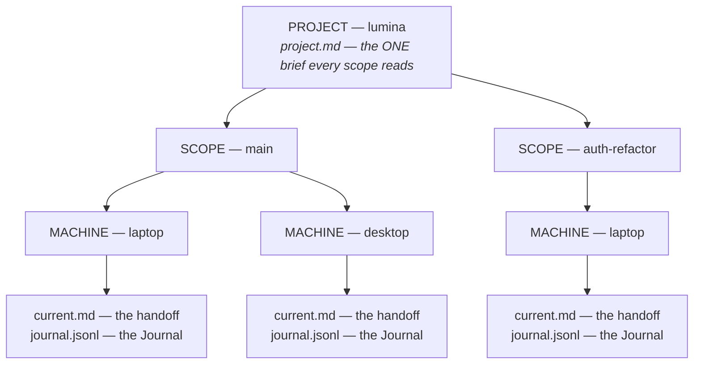

*Three handoffs, three rows in the **Handoffs** table: `main` on the laptop, `main` on the desktop,
`auth-refactor` on the laptop. The brief sits above all of them.*

**What a save does, in four lines** — checked against the store, not paraphrased from memory:

| You save… | What happens |
|---|---|
| Under a scope that already has a handoff **on this computer** | That handoff is **overwritten** — replaced, not merged. One line is added to its Journal |
| Under a **new** scope name | A new handoff is **created** — a new row in **Handoffs** |
| Under the same scope **on another computer** | That computer gets **its own copy** beside the first; neither ever touches the other's file |
| From **two agent tools on one computer**, same scope | They write the **same file** and overwrite each other — there is no tool name in the path. See [the pattern for this](#several-agent-tools-on-one-computer) |

Three things follow. **The name you save under is the only thing that keeps two threads apart** on
one computer. **`latest` is only for reading**: an agent asking for scope `latest` gets the
work-stream with the newest recorded save — ordered by **the agent's own clock**, recorded in the
journal at save time, and only by the file's timestamp on this disk as a fallback when no agent time
was recorded at all — and the reply names which one it opened — you never save *to* `latest`. And
**scopes are created by saving and by nothing
else** — an agent's `save_working_state`, or `my-curator save --scope <name>` from a terminal. There
is no rename control: to retire a scope, stop saving under it and its dot goes hollow
(*dormant*); to remove one, use the trash on its row in **Handoffs** ([Deleting a
handoff](#deleting-a-handoff), v3.75.0) — it goes to The Curator's trash, not away for good. A name is
tidied into a safe folder name as it saves — lower-case, `feature/auth` becomes `feature-auth`, at
most 64 characters — and the save says so when it changed.

###### Six patterns, and the line for your brief

Pick one per project and write it into the brief, where every agent in every tool reads it. The
lines below are ready to paste into the brief's operating-directives section.

| Pattern | Use it when | Paste into the brief |
|---|---|---|
| **One stream** | One thread of work, one tool, and you only ever want *where things stand now* | *"Save working state under scope `main`."* |
| **One scope per session** | Long projects where you want each session's handoff to stay readable afterwards instead of being overwritten by the next | *"Save working state in ONE scope per session named `session-YYYY-MM-DD-topic` (date and topic); save early and often; always before you stop."* |
| **One scope per work-stream** | Several features or tracks running in parallel, each resumed on its own | *"Use one scope per work-stream, named after it (e.g. `auth-refactor`); a new stream gets a new scope."* |
| **Several computers** | Laptop and desktop on the same project | Nothing — see below |
| **Several agent tools on one computer** | Two tools working the same project at the same time | *"Each agent saves under its own scope: `<harness>-<topic>` (e.g. `antigravity-api`, `claude-code-ui`); never save under another agent's scope."* |
| **Handing a session over** | Context full, switching tool, or moving computer | Nothing — it is a habit, below |

**One stream.** The simplest: every save names `main`. Two v3.76.0 changes matter here: the
**Copy agent instructions** block ([§13b](#making-sure-your-agent-actually-does-it)) no longer says
`main` — it tells each tool to save under a scope named for itself (`claude-code`, `antigravity`, …) —
and a save that names NO scope now goes to the saving tool's own scope, not `main`. So for one tool,
one stream is simply that tool's scope; write `main` into the brief only if you want that exact name.
The cost: the previous session's handoff is gone the moment the next save lands — the
Journal keeps one line per save, never the full text.

**One scope per session.** This is how The Curator's own repository is worked. Every session opens
the newest handoff (`latest`), reads where the last one stopped, and saves under a fresh name, so
yesterday's handoff is still there tomorrow. The cost is a longer **Handoffs** table; it shows the
newest five and **Show N more** extends it. Name the topic, not just the date — the name is what you
scan for a fortnight later.

**One scope per work-stream.** Right when threads genuinely run side by side: three features of one
product are three scopes reading one brief. Reuse a name while the work continues — a new name for
the same work splits its history, and the next session opens the wrong one.

**Several computers.** Nothing to configure: every computer writes into its own folder under the
scope, automatically, so two computers can never overwrite each other. An agent asking for a scope
without naming a machine gets the **newest** copy — ordered by the agent's own recorded save time
first, and only by the file's timestamp on this disk when no agent time was recorded at all — and a
list of the others. A copy from
elsewhere is marked — the **Machine** column names it, the reader shows a
**synced from another machine** chip, and the agent's read carries `machineIsThisMachine: false`,
which tells it to say so and to check the next steps against *this* checkout before acting. Two habits make it work: press
**Sync now** (in **Sync**, [§15](#15-sync-across-computers)) **before you start** and **after your
last save**. The brief is the one file with no machine in its path, so edit it on one computer and
sync before editing it on the other. **A conversation that is already open won't know about saves
made on the other computer unless it re-reads** — what it read when it started can be hours old.
Since v3.76.1 the **Copy agent instructions** block tells it to: on *"continue"*, *"resume"*, or
after a pause, it calls `get_project_context` again before acting. If your tool doesn't, start a
new conversation after syncing.

<a id="several-agent-tools-on-one-computer"></a>**Several agent tools on one computer.** The one case
the machine folder cannot separate: two tools on one computer are the same machine, so if they save
under the same scope, each save replaces the other's. Nothing refuses or prevents that save. The app
only notices **afterwards**, from the Journal, and only once the two tools have taken turns — one,
the other, the first again: then step ② says so in red, *"Two tools are writing `<scope>`… Give
each tool its own handoff."* A single switch from one tool to another is treated as a move, not a
clash, and is not flagged. So give each tool its own scope from the start. **Since v3.76.0, Copy agent
instructions asks for exactly that:** as copied, it tells each tool to save under a scope named for
itself — `"claude-code"` for Claude Code, `"antigravity"` for Antigravity, `"opencode"` for
opencode, otherwise the tool's own name — and to pass that name as `harness` too. (Until v3.75.0 it
told every tool to save under `main`, which *was* this collision.) And since v3.76.0 a save that names no scope but
names its tool lands in that tool's scope, not `main`. **Check it took:** measured on 2026-09-25
(Claude Code), Sonnet 5 saved in its own scope in 8 of 8 runs, but the small Haiku 4.5 did so in
only 3 of its 5 saves — the other 2 named `main` outright. So after each tool's first save, look at
**Handoffs**: one row per tool is right; one `main` row
written by both means add the brief line above. Three things make separate scopes hold in practice:

- **An open conversation re-reads only when told to.** It does not see the other tool's saves on
  its own. Since v3.76.1 the copied block tells it to call `get_project_context` again on
  *"continue"*, *"resume"* or after a pause; otherwise, start a new conversation.
- **Working in parallel, each agent reads its own scope, not `latest`.** `latest` opens whichever
  tool saved last — the *other* one, half the time. Name it when you start: *"resume
  `claude-code-ui`"*. (Handing one piece of work from one tool to the other is the opposite case:
  there `latest` is right — it opens whoever saved last — and the new tool then saves under its own
  scope.)
- **An orchestrator reads the others by name.** An agent coordinating the others calls
  `get_project_context` (or `get_working_state`) with `scope: "antigravity-api"` to read that
  tool's handoff — reading another scope is always safe; only *saving* into it is not.
- **Hooks, if you installed them, save to the tool's own scope (since v3.76.0).** The hooks
  `my-curator install-hooks` writes inject the project's *newest* work-stream at session start —
  that is the handover — and say which tool's scope it is and that this tool's saves go to its own
  (`claude-code`, `antigravity`, …). The save ask at the end names that own scope, never the newest
  one, which may be another tool's. (Through v3.75.x the ask named the newest scope.) To pin a
  different name, add `--scope <name>` to the `my-curator hook …` commands in that tool's hook
  settings ([§13c](#hooks-what-they-can-do-on-your-harness-and-what-they-cannot)).

**If it happens anyway, since v3.74.0: the save still succeeds, and nothing is silently lost.** A
save is never refused just because the last save in that scope came from a different tool, and
you are never blocked from saving. But when a save is about to
replace a handoff whose last save came from a genuinely **different** tool (matched by normalised
tool identity, so `Claude Code` and `claude-code` count as the same tool and this never fires on a
spelling difference alone), The Curator first copies the replaced `current.md`, byte for byte, to a
`previous.md` file in that same scope-and-machine folder — before the new content is written. Open
**Project context → step ② → Working state** and, whenever a replaced handoff exists, you will see
an unfolded line — *"Previous handoff by \<tool\> · \<age\> — open"* — that opens the replaced text
in the right-side reader, labelled *"Replaced handoff — by \<tool\>"* and treated as **recorded data
to verify**, not instructions to follow. `previous.md` holds only the single most recent cross-tool
replacement — a second cross-tool save replaces it in turn — and an ordinary same-tool save never
touches it. **No warning fires, and nothing is copied, when either side's save named no tool at
all.** Either way, the append-only Journal still has the full trail of who wrote what, and when.

**Handing a session over.** When a context window is nearly full, or you are moving to another tool
or computer: ask for a **complete** handoff — *"save a complete handoff now; we are continuing
elsewhere"* — and wait for the agent to confirm the save landed. Sync if you are changing computer.
Then open the new session with one line:

> *"Resume project `lumina` from The Curator: call `get_project_context` with scope `latest`, tell
> me which scope you opened and the rules you are following, then continue from its next steps."*

Name the scope instead of `latest` when several tools or threads are live.

###### Two questions people ask

<a id="do-i-need-both-claudemd-and-agentsmd"></a>**"Claude Code reads `CLAUDE.md`, Antigravity reads
`AGENTS.md` (and/or `GEMINI.md`) — do I need both files in the project folder?"**

Yes, both — Claude Code loads `CLAUDE.md`, and Antigravity reads `GEMINI.md` and `AGENTS.md` (walked
up from the working folder to the repository root), not `CLAUDE.md`. That is from Antigravity's own
documentation, and on 2026-09-25 an Antigravity session with the pointer in `AGENTS.md` read the
project's state unprompted. **But keep the rules in one
place, and keep each file to the same short pointer.** In practice: `CLAUDE.md` and `AGENTS.md`,
identical — `AGENTS.md` also serves Codex, opencode and Cursor. The rules live in the **brief**: it is stored in The Curator,
not in either tool, and `get_project_context` returns it to any tool that connects. The files only
have to send each tool there. The pointer, identical in every file:

```markdown
## Working state

This repository's working state lives in The Curator (project `acme/lumina`, see
`.curator-project`). At the START of every session call the my-curator MCP tool
`get_project_context` with project "lumina" and read the standing brief before acting.
Open and save the scope the brief's scope rule gives you; never save under another
agent's scope. SAVE with `save_working_state` under project "lumina" after every material
decision and at least every ten tool calls, and ALWAYS before you stop; a save
overwrites, so send the complete state each time.
```

- **Start from Copy agent instructions** (Domains → Projects, or the Project context screen). As
  copied (since v3.76.0) it calls `get_project_context`, reads the newest handoff, and saves under a
  scope named for the tool that reads it — right for *several agent tools on one computer*, and for
  one tool it is one stream under that tool's name. For a brief-set pattern (one scope per session,
  per work-stream), edit the scope wording in *your pasted copy* to defer to the brief, as above —
  the app's own copy stays frozen, because it is the text that was measured (2026-09-25, Claude
  Code: Sonnet 5 saved in 8 of 8 runs, all in its own scope; Haiku 4.5 in 5 of 8, 3 of them in its
  own scope — see
  [§13b](#making-sure-your-agent-actually-does-it)). An edited pointer, this repository's own
  `CLAUDE.md` included, is **unmeasured**. The block's later
  paragraphs (Documents, read-first) still apply; paste them below the pointer unchanged.
- **One `.curator-project` file serves every tool.** It holds `domain/project`; the continuity skill
  and the `my-curator` command read it, whichever tool is running. (The MCP server itself does not —
  which is why the pointer names the project too.)
- **Antigravity has its own row in The Curator's harness table (since v3.76.0).** `my-curator
  doctor` shows whether its MCP config names the bridge (it checks `~/.gemini/config/`,
  `~/.gemini/antigravity/` and `~/.gemini/antigravity-ide/`), whether `AGENTS.md`/`GEMINI.md` in
  this folder carry the block, and whether your installed skills match this version.
  `my-curator install-hooks antigravity` wires two hooks: one that hands over the project's
  context before the first model call, and one that asks for a save at the end if the
  conversation read state and did not save. **These hooks are built from Antigravity's own
  documentation and have not been run yet** — see
  [Antigravity](working-state.md#antigravity-v3760) for exactly what they do. The first reply is
  still the check: it should name the rules from your brief
  ([read-back](#making-sure-your-standing-rules-actually-land)). If it names none, the pointer did
  not land.
- **The skills, for Antigravity** (from its documentation): a `skills/` folder under
  `~/.gemini/config/` for every project, or `.agents/` in the project, or a plugin's `skills/`
  folder (for example `~/.gemini/config/plugins/the-curator/skills/`). Copy each skill folder
  whole, companion files included. `my-curator doctor` compares every installed copy with this
  version, file by file, and names any file that differs or is missing.

<a id="how-do-i-build-from-two-computers"></a>**"How do I build from two computers — do I need the
repo cloned on both, and sync the state first?"**

Yes to both — **two different things travel by two different routes**:

| What | Travels by | Before you start | When you stop |
|---|---|---|---|
| **Your code** | The project's own git remote — clone it on both computers | `git pull` | Commit and `git push` |
| **Working state** — the brief, handoffs, Journal, Documents | The Curator's **Personal Sync** — your private knowledge repository ([§15](#15-sync-across-computers)) | **Sync now** | **Sync now**, *after* the last save |

The per-computer handoff copy is what makes this safe: the laptop and the desktop each save into
their own folder, so neither overwrites the other even when you forget to sync. Start the second
computer's session with scope **`latest`** — after **Sync now**, the handoff that just arrived from
the other computer is ordered ahead of your own by **the agent's own recorded save time**, not by
when the file landed on this disk (that file-arrival time is used only as a fallback, when no agent
time was recorded at all), so `latest` opens whichever copy was genuinely written last, and the
agent's reply says it came from another machine. One caution: if a sync brings in several
work-streams at once, `latest` still only opens **one** of them — the single newest-written scope
across the whole project — so name the one you want rather than assuming `latest` found it.

###### Three worked examples

**1 — One long project, many sessions, one tool.**

1. In the brief, paste the *one scope per session* line.
2. In the repository, paste the pointer into `CLAUDE.md` and **Copy marker line** into
   `.curator-project`.
3. Each session: *"resume"* → the agent opens `latest`, reads the brief, works, and saves under
   `session-2026-09-25-billing` as it goes and before it stops.
4. A week later every session is a row in **Handoffs**, newest first, each readable in the reader.

**2 — Claude Code and Antigravity, same project, same computer, same afternoon.**

1. In the brief, paste the *several agent tools* line.
2. Put the same pointer in `CLAUDE.md` (for Claude Code) and `AGENTS.md` (for Antigravity).
3. Start each one naming its scope: *"resume `claude-code-ui`"*, *"resume `antigravity-api`"*. If
   you installed hooks for Claude Code, add `--scope claude-code-ui` to them.
4. **Handoffs** shows two rows, one per tool, on this machine. If step ② ever shows *"Two tools are
   writing…"*, one of them saved under the other's scope — tell it which is its own.

**3 — Laptop by day, desktop in the evening.**

1. Nothing to set up for state beyond Personal Sync on both, and the code repository cloned on both.
2. Laptop, end of day: the agent saves → **Sync now** → `git push`.
3. Desktop: `git pull` → **Sync now** → *"resume"*. The agent opens `latest` — the laptop's
   handoff — and says it came from another machine.
4. The desktop's save lands in the desktop's own folder under the same scope. **Handoffs** now shows
   the scope twice, once per machine, and the next read on either computer opens the newer one.

##### Knowledge — which domains a project draws on

**One row per domain, plus a picker in a head row above them.** Through v3.64.2 a project could
only ever read the domain it lived in, with no way to say otherwise — *"Where do I select which
domain gets sourced — is this even an option?"* was the maintainer's own question about the single
summary row this step used to be. v3.65.0 added a picker but let the newly-chosen domain **replace**
the project's own; production feedback called that "why only one? why not two or three?" and traced
it to copy that contradicted what the route already did. **v3.65.1 makes the code's own behaviour
legible:** the project's own domain is now an **explicit, always-listed row from the start** — never
an implied default you have to know about — and **"+ Add a domain"**, in the head row above the
rows (the same head-row placement step ① uses), *adds* to that list rather than replacing it. Pick
one from the shared picker — the same component every single-select list in the app uses, one at a
time, never a menu of checkboxes — over every domain on this install; **Remove** now lives *inside*
each expanded row, beside its two doors, the same place the documents table's own Remove sits.
Removing the last added domain puts the project back on just its own. **At most twelve.**

**The step's body is the head row and the rows, nothing else.** The forty-word paragraph explaining
*why* a project reads the domain it lives in used to sit under the picker as its own sentence; it
now lives only in the step's ⓘ. The one thing that stays on the row itself is a small **default**
badge — the same quiet badge style the Documents table uses for "shared mirror" — shown only while
nothing has been explicitly chosen yet; the moment you add a domain, the badge disappears from
every row, because at that point the set is a choice rather than a default.

Each row's summary line names the domain, its page count, and how long ago it was last written to —
*"projects · 391 pages · 3 days ago"*, with the domain's own [identity dot](design-system-source.md#18-identity--one-palette-one-mapping-one-glyph-v3651)
before the name — and opens to the same recessed, monospace instrument the rest of this step uses:
entities, concepts, summaries and the last-ingested title, plus two doors, **Open in Domains** and
**Ask this domain**, for that domain specifically, and its own **Remove**. **As of v3.65.1 the
entity, concept and summary lines each carry a depth bar** against that domain's own page count —
the three always sum to at most the page count, which is what makes it an exact denominator rather
than a guess; the `pages` and `last ingest` lines carry no bar, because one is what the bars are
measured against and the other is a time. A domain that has since been deleted stays on the list as
a row that says so, rather than silently disappearing — it may simply live on a computer that has
not synced here yet. A reading still in flight, or a failed one, is **not** turned into a row. This
layer **accumulates**: a new source makes an existing page richer rather than adding a second copy
of it.

**v3.65.2 fixed the picker itself** — production use of v3.65.1 found the "+ Add a domain" picker
and every row's Remove *"basically not functioning"*: the picker's pick handler was wired to the
wrong callback name, so choosing a domain did nothing, and Remove had the same defect. Adding and
removing now go through the real route end to end. **Remove has three states**, depending on how
many domains the project currently draws on:

| Rows | Remove | Why |
|---|---|---|
| One row, and it is the project's own domain (no explicit choice made) | **Withheld** — *"Default — add another domain to replace it."* | Removing it would send `null` and repaint the same row — a press that looks dead |
| Two or more rows | **Live on every row**, including the project's own domain | The store allows any non-empty list; a project that should draw only on `research` is a legitimate choice |
| One row, explicitly chosen | **Live**, and states what pressing it will do — *"Removing it puts `<default>` back as the default."* | An outcome at the moment of acting, stated rather than left to guesswork |

The domain is what the project *reads*, not part of the project, which is why this step is a list of
summary rows and nothing else until one is opened. There is no page list here and no health report:
both live in **Domains**, and each row's figures come from one cheap request per domain that reads no
page content at all, so opening this screen costs one request per chosen domain rather than a scan.

**Open in Domains lands on the right domain.** That sounds like nothing and is not: this screen is
app-wide across domains, so before v3.62.0 a jump from a project in one domain would have landed on
whichever domain Domains happened to have open last.

*(Step ③'s ⓘ explains the layer but carries **no link into these docs** this release — the docs-key
it wants does not exist yet. Every other ⓘ on the page links out.)*

**What Chat does with this.** Pin a project in Chat and its picker's footer discloses which domains
that project's knowledge lives in and whether you chose them or it is just the project's own domain
— but Chat still reads **one** domain, the chip that is filled. A conversation does not widen its
own reach because a project points somewhere else; the footer says so plainly rather than moving
you, because switching domains would unpin the project. → [§9, Chat with your brain](#9-chat-with-your-brain)
for the marked chips and what they mean.

#### The Handoffs table

*(Called the Work-stream table through v3.65.0 — the row it lives inside is now **Handoffs**; the
store still calls each one a `scope`, [above](#the-word-on-screen-and-the-word-on-disk).)*

The **Work-stream** and **Machine** dropdowns are gone. One table replaces them, one row per
**(scope, machine)** pair, newest first — **ordered by the same clock the rows display**,
which is the agent's own save time wherever there is one. So the ages run straight down the
column and the dots cool with them, and the order can never contradict the reading beside it.

| Column | What it holds |
|---|---|
| **Handoff** | A freshness dot and the scope's slug. The row you have open carries an accent bar down its left edge |
| **Working on** | That save's own one-line headline — *not* the project's, so a fortnight-old row shows what it was doing a fortnight ago. An em dash when the save carried none |
| **Last saved** | A relative age (*"3 hr ago"*, *"2 weeks ago"*). The exact timestamp — and the words *file time* when the reading is the file's rather than the agent's — travel in the row's accessible name, so a screen reader announces them |
| **Machine** | The installation that wrote it, plus a **this machine** tag on every row in your own machine's folder — and only when the app can positively identify it, never guessed from a lookalike name |
| **Harness** | The agent tool and the model that wrote the save, e.g. *"Claude Code · opus"*. *Since v3.76.0* the tool is shown under its one normalised name, so `claude-code`, `Claude Code` and `Claude Code (desktop)` all read **Claude Code** down the column — and on the Journal's lines and the open handoff's byline, which use the same name; the agent's own spelling is kept in the accessible text |
| *(trash)* | **v3.75.0.** A neutral trash icon that deletes the whole scope — see [Deleting a handoff](#deleting-a-handoff). Absent on a Shared Brain mirror |

**Press a row to open it.** That replaces the whole picker: pick the scope and the machine
in one gesture, from a list that already tells you which is worth opening — and since v3.56.0 the
handoff opens in the [reader](#reading-a-handoff) rather than underneath the table. Click anywhere
on a Handoffs or Documents row to open it in the reader.

**The table shows the newest five, and a `Show N more` row extends it** (*v3.56.0*). A project that
has run for a month across two machines is twenty rows, and twenty rows own the page the same way
the handoff document used to. The row sits **under** the table rather than inside it, so it can
never scroll out of reach of the list it extends, and pressing it **appends** the next window —
the rows you have already read do not move. **The Journal row's own "Show N more" follows the same
rule** (v3.65.1) — it used to be a separate footer card with a floating button that dropped your
scroll position back to the top of the list; now it is one row, appended in place, the same as here.

**The step is all the rest, not another five.** A project with seven handoffs has two hidden,
and pressing twice for two rows is the friction rather than the rows; so the button says *"Show 2
more"* and that is the end of it. Past twenty the step becomes ten, because one press that paints
forty rows is a wall.

Two details worth knowing:

- **The window resets when you switch projects.** Every project opens at five.
- **The scope you have open is always painted**, even when it sits past the window — the
  window is *stretched* down to it rather than the row being lifted to the top. This table's
  header says *newest first*, and a highlighted row sitting above one three minutes younger would
  be the same lie in a smaller font.

Under the table sits a line like *"13 handoffs · 16 saved copies"*. **Those are two different
numbers and both are real:** each machine writes into its own folder inside a scope, so one
scope can appear as several rows. While rows are hidden, a third clause is appended —
*"· showing 5 of 16"*, counted in **rows**, so its second figure is the saved-copy total rather
than the scope one — and it disappears once everything is on screen, because a list that
fits says nothing about its own length. That clause is **about this table's window**; if the store
itself could only return the most recently saved copies, it says so in its own separate clause and
gives the true total. Two caps, two sentences — neither is ever reported as the other.

#### Deleting a handoff

*New in v3.75.0.* Each row of the **Handoffs** table ends in a small trash icon. It deletes the
**whole scope** the row belongs to — every machine's saved copy of it, each with its Journal and
any kept previous handoff — not just the row you pressed. Nothing else is touched: the standing
brief, your other scopes, the Documents and the wiki stay as they are.

1. Press the trash on any row of the scope. A card opens above the table: *"Delete handoff
   `main`?"*
2. The card reads the scope fresh and lists **every machine's copy** with its newest headline and
   how long ago it was saved, marking the one from **this machine**. When any copy was saved on
   another computer it says so plainly: *"Sync will remove it on your other computers too."*
3. It says where the folder goes — The Curator's trash, `<user data>/.curator-trash/scopes/` —
   and how to bring it back.
4. Type the scope's name exactly. **Delete handoff** stays disabled until it matches; **Keep it**
   closes the card.

When it is done, the card is replaced by a line saying what went and the exact folder it now lives
in; the table, its counts and the project list refresh on their own.

**To restore it:** open **Settings → [Trash](#trash)** and press **Restore** on its row (v3.76.0).
If a handoff of that name has been saved since, the button offers `<name>-restored` instead — it
never overwrites. By hand still works: move the folder the line names back into
`domains/<domain>/state/` (the domain's own project) or `domains/<domain>/state/<project>/` (a named
one), renaming it to the scope's name. Nothing empties the trash automatically. With Personal Sync on, the delete still reaches GitHub on
your next Sync, and from there your other computers; the trash copy exists only on the computer
where you deleted it.

**Only you can do this, from the app.** Agents cannot delete a scope — there is no MCP tool for it.

#### Reading a handoff

Pressing a work-stream row opens its handoff in the **reader** — the slide-in panel over the main
column that a wiki page opens in ([§11](#inside-the-reader)), with the rail and the sidebar still
live behind it. That is exactly right for a document you are reading *about* a project you are
still looking at.

![The reader panel open over the Project context view of the demo project. The rail and the project sidebar stay lit on the left; the page behind is dimmed and blurred. The panel's top line is the file's path in monospace, state/exhibit-site/main/demo-mac-4d3e2f/current.md, with an esc keycap and a close cross. The handoff's headline is the title: 'Checklist run once on a spare kiosk — offline mode fails on first load'. Chips read handoff, handoff: main, machine: demo-mac-4d3e2f and this machine. Then Saved '40 min ago' in large monospace over 'Antigravity · gemini-3-pro · updates live', and the line 'Previous handoff by Claude Code · 4 hr ago — open'. The handoff renders as Markdown: Where things stand (the site works online; with the cable out the first load fails because the service worker has not installed), Traps and dead ends (the first visit must happen online), and Next steps (add a 'first load online' step to the checklist), then BACKLINKS · 0.](images/curator-agent-memory-reader.png)

*A handoff open in the reader. The **path line** along the top is the real file, so you can find it in Obsidian or in your synced repository. The chips name the scope and the machine. The **Saved** reading is the same figure the overview's **MEMORY** tile gives — same clock, same function — with the harness and model that wrote it and "updates live" while you watch. Because Antigravity's save replaced one Claude Code had made in the same scope, the reader also names the **previous handoff** and opens it on request (v3.74.0). Behind the scrim, the page you pressed from is exactly where you left it; **Esc**, the dimmed area or the ✕ close the panel and put the keyboard back on the row. Shown on the synthetic demo workspace; `node scripts/screenshots.mjs` regenerates it.*

| In the reader | What it holds |
|---|---|
| **The path line** | `state/<project>/<scope>/<machine>/current.md` — the real file, so you can find it in Obsidian or in your synced repository |
| **The title** | The handoff's own first line. A handoff with no headline is titled after its scope |
| **The chips** | A `handoff` type badge, then `handoff: <slug>` (v3.65.1 — was `work-stream: <slug>`; the store field itself is `scope`, [the vocabulary table](#the-word-on-screen-and-the-word-on-disk) above), `machine: <name>`, and — only on positive evidence — **this machine** or **synced from another machine**. A handoff that hit the read cap, or that had protocol-shaped text neutralised on read, says so in a chip too |
| **The reading** | *"Saved 5 hr ago · Claude Code · claude-fable-5-1 · updates live"* — the **same** figure the overview's **MEMORY** tile shows, from the same clock, so the two can never name different times for one save. An **`incomplete`** or **`summary shortened`** badge sits on that line when the save carried one, not under it |
| **The notes** | The truncation and sanitisation warnings, in full and never folded |
| **The body** | The handoff, rendered as Markdown |

**To close it:** press **Esc**, click the dimmed area outside it, or click the **✕** — and focus
goes back to the row you pressed, so the keyboard is never left stranded in a panel it cannot
leave. It also closes, as every reader does, the moment you click anything in the rail.

A handoff has **no raw-source bar** — it is not a wiki page and there is no ingested document
behind it — and nothing ever links to one, so the **BACKLINKS** heading the reader always draws
reads *"BACKLINKS · 0"* with *"No other page links here yet"* under it. That is the reader's own
furniture rather than a claim about your handoff; it is on the list to hide for this kind of page.
If a work-stream is listed but its handoff cannot be read on this machine, the reader **says so in
words** rather than opening an empty page — a blank panel would read as *"this handoff is empty"*,
which is a different claim.

> **The exact timestamp is in the reader, not in a tooltip.** It travels in the accessible name
> beside the age, along with the words *file time* when the reading is the file's rather than the
> agent's, and *"arrived here …"* when the two clocks disagree. The old fold carried it on hover,
> where nobody found it.

#### Editing the standing brief

The **pencil** sits at the right-hand end of the brief fold's own head — on the card it edits, not
under the document, where the old **Edit brief** button was buried at the bottom of a long brief,
and not on a toolbar row of its own, where it floated with nothing beside it. It is **icon only**;
its name is on the button for a screen reader, and there is no tooltip, because a tooltip is
unreachable by keyboard and by touch.

**Pressing it opens the fold and the editor together**, so it works the same whether the brief is
open or shut. While an editor is up the pencil is **withheld** — pressing it would rebuild the
draft from disk and take your unsaved text with it; **Esc** or **Cancel** is the way out, and both
ask before discarding. A read-only Shared Brain mirror gets no pencil at all, because the write
would only be refused.

| Key | What it does |
|---|---|
| **⌘S / Ctrl+S** | Save |
| **⌘↵ / Ctrl+Enter** | Save — the same thing, because ⌘S is a text editor's reflex and ⌘↵ is a composer's |
| **Esc** | Close. If the draft has changed, an inline **Discard / Keep editing** bar appears instead, in flow and with your text still on screen. During a save in flight Esc does nothing and the editor says why |

The editor is the **full width of the column** and opens at 320px tall — the four template headings
alone are close to twenty lines, so a shorter field meant dragging it before you could start. A
live line under it reads **modified · N words · N bytes of 32768** and updates as you type; over
the cap, **Save is disabled** and a **Too long to save** warning appears beside the figure rather
than waiting for a refusal you could have seen coming. **Preview** swaps the field for the rendered
markdown and back, never side by side, and your draft is kept byte for byte across the toggle.

> **That warning only appears when it is true** (*fixed in v3.56.0*). Through v3.55.0 it was
> painted in every state the editor has ever had — so a brief of 8,484 bytes showed a warning about
> a 32,768-byte limit it was nowhere near, on the one screen whose job is to say whether a save
> will land, with **Save** enabled beside it. The markup had always been right; a stylesheet rule
> was overriding the browser's own "hide this" rule. If you saw it and concluded your brief was too
> long, it was not.

**Bytes, not characters.** The limit the app refuses at is measured in bytes, which is what the
route measures, and a brief full of em dashes, arrows and accented names runs out sooner than its
character count suggests. The counter shows both that figure and a **word** count, because they
answer different questions: bytes answer *will this save?*, words answer *is this a brief or a
novel?*

> **Saving replaces the whole document.** The brief is not merged with what was there, so send the
> complete brief rather than an addition — the same rule a handoff save follows, and for the same
> reason. A brief saved here is stamped as written by a **human**, which is what tells a later
> agent that the directives in it are yours rather than an earlier session's notes. Editing
> `state/<project>/project.md` in Obsidian or any text editor still works; it is the same file.

#### The freshness dot, one scale everywhere

Every "how recently" mark in the app is now cut from **one scale** — five age tiers plus an
explicit *unknown* (*new in v3.55.0 — there were three ladders, all painted in the brand violet,
and none of them agreed with the menu bar*). The Project-context pips, the Ingest **DESTINATION** rows and the Domains **KNOWLEDGE** rows
all use it, and its colours are the ones the [menu bar icon](#6b-the-menu-bar-icon-mac-app)
already spoke.

| Tier | Age | Looks like | Where you see it |
|---|---|---|---|
| **live** | under a minute | filled teal with a halo | Project context only |
| **recent** | under an hour | filled teal | Project context only |
| **today** | under 24 hours | filled amber | everywhere |
| **week** | under 7 days | filled grey | everywhere |
| **dormant** | a week or more | **hollow** grey | everywhere |
| **unknown** | nothing has been written | **dashed** ring | everywhere |

Three things follow from that table and are worth knowing:

- **The cut that matters is at one hour**, which is why *live* and *recent* share a colour while
  *today* takes a different one: "5 minutes ago" and "4 hours ago" have to look different before
  you read them. Inside the hour the only question left is *is an agent writing right now*, and
  the halo answers it.
- **The two sidebars can never show teal.** They read a `YYYY-MM-DD` date out of the domain's
  log, which has no time of day, so they enter the scale at **today** — the app does not
  manufacture a precision the data does not have.
- **Dormant is not a failure state.** A finished work-stream and a finished domain are *supposed*
  to look like this. And an **unknown** age is not age zero: it differs in kind — a dashed ring —
  rather than being painted as the oldest thing on the list.

The mark is never the only signal: the age in words sits immediately beside it, every mark is
hidden from screen readers, and the words are what a screen reader announces.

#### The overview's MEMORY tile, and the warnings above the four rows

*"Is this saved, and is it any good?"* is answered without opening anything, on a healthy day.
Since v3.62.0 that has meant the overview strip — **DOCUMENTS · MEMORY · KNOWLEDGE**, each a
freshness dot and a word, joined by **CAPTURE** in v3.64.1. **Through v3.65.0 a fourth reading, a
"Last saved" card or row, repeated the MEMORY tile's own age with the tool and model that wrote
it** — first as its own card between step ① and step ②, then, from v3.64.1, as the first row inside
step ② Memory.

**v3.65.1 removes that row outright.** The maintainer's own reading of the screen was that it
answered a question the tile one scroll up had already answered, in the same words, on a page whose
whole subject is not repeating one design twice. The two facts it carried went to the two places
that actually needed them: the age lives in the **MEMORY** tile, and *which* handoff — the scope, the
tool, whether it wrote in full — lives in the **[Handoffs](#the-handoffs-table)** row's own summary
line, open it for the rest.

```
MEMORY
saved 4 min ago
```

The pip is the pre-attentive half and the word is the exact half. Below it, step ② can carry up to
three separate unfolded blocks, each rendered only when it has something to say and never inside a
chevron — the reader for **v3.16.1**'s rule: *a warning, a cost or an outcome is never one click
further away than the row it qualifies*.

**"Warnings about the last save"** (renamed from *"About the last save"* in v3.65.1) is the first,
and the only one this table is about. It carries **outcomes about one specific save** — not the two
clocks, not which machine wrote it, both of which moved elsewhere in this same release (below). On
an ordinary save, on the agent's own clock, complete, with one harness, it renders **nothing at
all** — no empty card, no monitor with zero lines — and step ② opens directly on its four rows.
That is the acceptance picture, reached by having nothing to say rather than by hiding something.

| Line | When it appears | What to do |
|---|---|---|
| *"Part of this handoff did not survive the save — content named in the note below was dropped or cut short…"* | Handoff CONTENT was cut — a section, or items past a list's cap. The app knows because the store recorded it | Ask the agent to save that content again. The handoff you are reading really is **missing** what the note names |
| A full-width report headed **"Handoff saved in full"** (v3.65.2 — see below) | Only a LABEL was clipped — most often the one-line headline, which caps at 200 characters. The handoff body is complete | Nothing urgent. The headline is the one thing a future session sees before deciding whether to open this state, so a clipped one is a weaker index entry — worth a shorter re-save, not a rescue |
| *"That save deliberately replaced a larger handoff…"* | The agent overrode the guard that normally refuses a small save over a much larger one | Nothing was lost from what it sent — but the longer document it overwrote is not recoverable |
| *"Two tools are writing `<scope>`…"*, with **"Give each tool its own handoff"** | Two agent tools have both saved into the same handoff file and are overwriting each other | Give each tool its own scope — the same collision, and the same remedy, as [§6b Scenario 1](#scenario-1--two-agent-tools-on-one-computer). The journal keeps both trails regardless |
| *"Newer state in this project: `<scope>`…"* | Some **other** scope in this project holds something more recent than the one on screen | Check it — the [Handoffs table](#the-handoffs-table) above is where. An agent told to *"reuse an existing scope"* can be saving beside you into one you are not watching |
| *"`<machine>` saved after this computer…"*, with **"Pull before you continue, or that work will be waiting there"** | Another **machine** has saved more recently than this one — the same reading the menu bar gives | **Pull before you continue.** This is a different question from the line above it — that one is about a scope on THIS machine you are not watching, this one is about the same work continuing on another machine |

**A clipped save became a full-width report in v3.65.2, not a narrow paragraph.** The maintainer's
own reaction to the earlier shape: *"I don't understand what this is. It is not wide enough — why
not use the full screen real estate, left to right. If this is an active card where information
changes, like a report, it should be in a format and have visuals, indicators of what is going on."*
It is now the same recessed, monospace instrument every other live reading on this screen uses, not
a sentence of prose capped at 68 characters. It says, in plain words: **the handoff was saved in
full** — nothing was lost — and **only the one-line headline was shortened**, to its 200-character
limit; the report then states exactly how many characters it held before the cut, with a depth bar
against that 200-character limit (the SIZE channel — [see "Reading the
screen"](#reading-the-screen)). If more than one field was clipped in that save, **each gets its own
line**, in the store's own words rather than only the first note truncated to a summary. The report
**clears on the next save to that same handoff whose headline fits** — it is not a persistent badge,
it describes one save, and it stops describing anything the moment a later save makes it moot.

**Two facts that used to be unfolded lines here are gone from this monitor as of v3.65.1 — not
dropped, moved:** which clock an age came from (the agent's own, or the file's, when no journal
entry carried a save time) is explained once in the overview card's own ⓘ, since it qualifies every
age on the page rather than one save; and that the open handoff was written on another machine and
synced here is now the Handoffs table's own **MACHINE** column, per row — more precise than one
sentence about whichever pair happened to be open — and rides as a **synced from another machine**
chip when you open that handoff in the [reader](#reading-a-handoff). Both were genuine facts, never
warnings, and the step-body rule is that an explanation lives in the ⓘ or in a row, never in a block
sitting above the rows.

**Two more things can appear here, separately from the save-warnings monitor above:** a **Reload**
notice, when an agent has saved to this project since you opened the page — pressing it re-reads
rather than assuming the newer save should simply replace what is on screen; and a note when some
part of this project's state exists on disk but could not be read by name (an unreadable directory,
an unreadable machine folder), which says so rather than silently showing fewer rows than there
really are.

> **The tile says "saved", never "you are saved".** It knows when the last save happened; it cannot
> know whether anything has changed since. That inference is left where it belongs — with you.

> **There are two clocks behind every age on this page**, and the screen says which one it used.
> The **agent's clock** is the time the agent recorded when it saved. The **file's clock** is when
> the file last changed on this disk — which, on a computer that syncs, is when the file *arrived*
> here. The agent's clock is used wherever there is one, and a reading that had to fall back says
> **file time** in its own provenance line, in words, rather than in a tooltip.

> ⚠️ **Several lines of this strip have still never been looked at on a screen.** Four have now
> been photographed rendering — *"This file arrived on this computer N ago"*, *"Newer state in this
> project"* and *"Written on `<machine>` and synced here"*, all three visible in the screenshot
> above, and the **`summary shortened`** badge in an earlier one. The rest is covered by the
> automated tests and by nothing else. If a line reads wrongly, that is worth
> [reporting](https://github.com/talirezun/the-curator/issues).

Your agent — Claude Code, Claude Desktop, Cursor, or any other local MCP client — is what
saves and reads this. It survives across sessions, agents, models and machines. It is plain
markdown under `domains/<domain>/state/<project>/`, so you can also open it in any editor, and
it travels with GitHub sync like the rest of your wiki.

**What the screen does not do:** there are no rollups. Nothing composes a Done/Decided/Blocked
view across handoffs or across projects, and the only thing it writes is the **standing
brief** — the handoff and the journal are written by an agent and by nothing else.

> 💡 **The write half has to be asked for, and installing the skill is not always enough.** Nothing
> forces an agent to save, so an agent that has never been told the discipline simply never writes
> and this screen stays empty. The
> **[Curator Continuity skill](mcp-user-guide.md#the-curator-continuity-claude-skill--session-handoff-v3170)**
> is what teaches it: resume from state at the start of a session, save early and often, and what
> belongs in a handoff. Install it alongside the My Curator skill — **and paste the block from Copy
> agent instructions into the file your tool loads every session**, because a harness can hold an
> installed skill and never reach for it. Measured on **2026-09-10**, an agent on Claude Code saved
> in **0 of 4** headless runs with the skill alone and **3 of 4** with the block, while opencode —
> which loads skills itself — was **4 of 4 either way**. A second campaign on **2026-09-20** added
> the arm the first could not run: with the adapter **hooks** installed as well, Claude Code
> started with its context and saved in **4 of 4**
> ([§13b](#making-sure-your-agent-actually-does-it)).

> 💡 **On a Mac you can watch this without opening the app.** The optional
> **[menu bar icon](#6b-the-menu-bar-icon-mac-app)** shows the same store — the last save, recent
> work-streams, a seven-day save pulse, and the brief's age — from the menu bar. It is off by default and
> it is a reader too: nothing in it writes.

The menu bar icon also carries a small honesty check on a project that has **any mirrored
document** (see [Foundations](#documents--the-files-that-travel-with-a-project), below — the store
still calls this tier **foundations**; the screen calls it **Documents**): when one or more
mirrored documents, from any of the project's sources, no longer match the folder or repository
they were copied from, its header sublabel gains **`· docs stale`**, or **`· N docs stale`** once
there is more than one — the same computed-not-remembered freshness check the in-app Documents
block already runs, surfaced where you are most likely to see it before starting work. A document
whose source **could not be checked** from this Mac — typically a GitHub document with no read token,
which the app shows as *GitHub · not checked* — is counted separately, as **`· 1 doc not checked`**
(since v3.76.0; before that it was added to the stale count, reporting a change nobody had compared). Nothing
appears when every mirrored document is current, and a written or copied document (nothing to
compare it against) never triggers the mark. If you see it: **refresh that source** — the sources
strip offers Refresh per source, and a Refresh all — run from whichever machine has the folder, or
for a folder source you can also add its repository as a GitHub source instead — or, for a
document an agent wrote rather than mirrored, **save the fresher version yourself**.

Full detail — the layout, what goes in state versus what belongs on a wiki page, and the safety
rules — is in **[working-state.md](working-state.md)**.

**Two more depth-bar readings live inside step ② Memory, each against its own named total —
never a grade.** The **Handoffs** row's **Size** column shows each handoff's size against the
48 KB a handoff is trimmed to; it never turns red, because a save over that budget is trimmed and
the trim is noted in the handoff itself, never refused — there is nothing left to warn about once
the trim has already happened. Inside the **Agent connections** row, *started with the context* and *saved
before stopping* are drawn as a share of every connection in the window, e.g. *"4 of 6"* — a share of
a whole, not a target against which a bar can fail: nothing here is a grade, and neither bar ever
turns red.

---

## 7b. The three places — ask, knowledge, context

**New in v3.64.0.** The rail used to be five entries with a dividing line across it. It is now
three, and each one answers a different question:

| Place | The question | What lives there |
|---|---|---|
| **Chat** | *ask* | One domain's wiki, and — with a project pinned — that project's context too |
| **Domains** | *knowledge* | One subject at a time: everything that acts on a domain, on the domain's own page |
| **Context** | *context* | One project's canonical documents, its working state, and whether your agents are actually reading and saving |

![A diagram of the three-entry rail — Chat, Domains and Context, with Sync and Settings separated at the foot and no dividing line between the three — each joined to a column naming what it is for. Chat is "ask": one domain's wiki, and, with a project pinned, that project's brief, its latest handoff and its read-first documents; a reading, never a save. Domains is "knowledge": one subject at a time, with the domain page's six sections listed in order — OVERVIEW (counts, last ingest, the jump tiles), INGEST (drop a PDF, Markdown or text file), PAGES (Wiki, Context, All), PROJECTS (create, rename, brief, marker line), SHARED BRAIN (this domain's connections) and WIKI HEALTH (broken links, orphans, duplicates). INGEST and SHARED BRAIN each carry a small badge reading "also a full view". Context is the project layer: the canonical documents, the working state agents read and write, the knowledge it draws on, and the capture meter. Two lines at the foot read: one panel, two hosts — a section and its full view are the same code, so they cannot drift apart; and Sync and Settings sit at the foot of the rail, with no dividing line, because three places need no grouping.](images/curator-three-places.svg)

### Why three

The two things people come to The Curator for are *"turn what I read into something that
compounds"* and *"give my agents context that outlives the session"*. The five-entry rail put
**Ingest** and **Shared Brain** in the way of both: each acts on exactly **one domain**, and each
made you leave the domain you were looking at in order to use it. So they moved to the page that
already names that domain. And the dividing line — the one that said *everything below here is the
advanced half* — was pointing at **Context**, which is the whole reason half this app's users
installed it.

**Nothing was removed.** Both full-page views still exist, still restore if one of them is where
you left off, and are each one press from their section.

### One panel, two hosts

The **Ingest** section of a domain page and the full-page **Ingest** view are the *same panel* —
one piece of code with two places to live, not two copies that can drift apart. The same is true
of **Shared Brain** and the full Shared Brain view. That is worth knowing for two reasons:

- **Whatever you start in one, you see in the other.** Start a batch in the section, press through
  to the full view, and the job is there, live. Come back, and it is still there.
- **A behaviour you learn once holds in both.** The free estimate before any spend, the batch
  queue that survives a closed tab, the per-connection controls that refuse to run two operations
  at once — all of it is the behaviour described in [§8](#8-ingest-a-source) and
  [§15b](#15b-shared-brain), wherever you meet it.

One difference, and it is deliberate: **the section has no side panel.** The domain page already
tells you which domain you are on, so a destination list beside the section would be a second
answer to a question already answered. The full view keeps its own.

### One vocabulary

**New in v3.65.0.** Three places, and until this release, three different ways of drawing the same
four kinds of thing: a count you can press, a row in a list, a piece you open for more, and a
reading that changes while you watch it. Domains, Context and Settings had each grown their own
answer — a different sidebar, a different "Last saved" card, a different way of showing an MCP
connection's status — not because any one of them was wrong, but because nothing said they had to
agree. They now do, everywhere: one component per kind of content, not per screen.

![Four small mock-ups in a row, each a shared component used everywhere its kind of content appears, with a one-line caption underneath naming it. First, the overview card: a small grid of tiles, each a label over a value, one press away from the section it names — used at the top of both the Domains page and the Project context page. Second, a sidebar row: an identity dot, a name, a figure, a freshness dot with a clock and an age, and a last-event line — used in the Domains, Context and Settings sidebars, with the active row shown as a filled row rather than a line down its side. Third, a fold row: a title on the left, a one-line summary on the right, and a chevron — used for every collapsible section body in the app, and the shape every step's content is built from. Fourth, the monitor: a recessed, monospace panel of key-value lines with a coloured state word above them and one warning line in colour that never folds — used for every live, changing reading in the app, such as the MCP bridge connection, a session count, or a sync status. A caption at the foot reads: one component per kind of content, not per screen — so the same reading looks the same wherever it appears.](images/curator-design-vocabulary.svg)

| Component | Answers | Where you meet it |
|---|---|---|
| **The overview card** | *What does this hold, and where do I go?* | The top of Domains and of Project context — identical tile size, identical 22px figures on both |
| **A sidebar row** | *Which one am I on?* | The Domains, Context and Settings sidebars — one identity dot, name, figure, freshness mark, clock and age, and a last line, with the current one shown as a filled row |
| **A fold row** | *What is inside, without opening it?* | Every collapsible section in the app — a title on the left, a one-line summary on the right, a chevron |
| **The monitor** | *What is true right now?* | An MCP connection, an Agent connections count, a Sync status, a Wiki health scan — a recessed, monospace panel with its state as a coloured word, and any warning inside it always visible, never behind the chevron |

**The rule that survives every one of them, restated for the last time here because it is the one
that matters most:** a warning, a cost or an outcome never sits behind a chevron. Everything else
may fold; that never does.

### Reading the screen

Underneath the shared components above, the app draws four small, consistent marks — none of them
a screen of their own, each one a channel of information layered onto an ordinary row or figure.
Once you know what each one means, you can read a row without opening it.

| Mark | Answers | Where it appears today |
|---|---|---|
| **Identity dot** | *Which domain?* | One colour per domain, the same colour everywhere that domain is named — a sidebar row, a Chat domain chip, a Knowledge row, the Context breadcrumb, the menubar widget. Never a second mapping or palette on any screen |
| **Freshness dot** (with a clock glyph and an age) | *How recent?* | Every time-based reading in the app — a sidebar row's last save, a Handoffs row, a document's last update, the MCP bridge's connection strip |
| **Depth bar** | *How much, against what total?* | A tinted bar behind a figure, right-anchored, its length a **named** denominator — never a guess. Today: a document's size against the project's own stored total (v3.70.0: stated plainly, never as an alarm); the running total in Add-from-folder against that same total; a domain's entity/concept/summary counts against its own page count; a clipped save's character count against its 200-character field limit; Handoffs' Size column (vs 48 KB); Agent connections' saved/read share of all connections in the window; step ④'s own **segmented window meter** (v3.70.0 — a special case: one violet hue in lightness steps, one segment per layer, every segment named, and it never takes the danger tone even when a reading budget runs past a quarter of the window); Chat's project footer (documents vs the 40,000-character document budget); an Ingest batch's spend against its cap; Wiki health's issues-per-category row; the MCP bridge's Busiest-tools and Across-projects rows; Settings → Knowledge base's Domains-in-this-folder rows |
| **Tone** (colour, never alone) | *What was the outcome?* | A monitor's head word (ok / danger), a `loud` line for a warning or a cost — always paired with words, since colour alone never carries a reading in this app |

**The depth bar turns danger-toned only when its budget is actually exceeded, and the same fact is
always also stated in words, unfolded** — never only a redder bar. A single document over budget on
its own fills its whole cell in the warning colour; the table's own warning line beneath it says
the same thing in a sentence, because v3.16.1's rule holds here too: a warning is never only a
colour. Some bars are a plain measurement rather than a budget check — Wiki health's
issues-per-category, the MCP bridge's Busiest tools, Across projects and Domains-in-this-folder
compare against the *largest visible row*, not a ceiling, and never turn danger-toned; the largest
bar there is simply the biggest pile, never a warning.

**There are twelve identity colours.** Each domain's colour is **its own, and it stays put**
(*v3.76.0*): the first time the app sees a domain it records the domain's colour in a small file
inside that domain's folder, `domains/<name>/.curator-identity.json`, and every screen and the
menubar widget read it from there. Adding or deleting another domain never recolours this one; a
new domain takes the lowest colour nobody is using; renaming a domain keeps its colour, because the
file moves with the folder; and because the file syncs with the rest of the folder, two Macs show
the same domain in the same colour. (Before v3.76.0 the colour was the domain's *position* in the
list, so deleting a domain shifted the colour of every domain after it.) **After updating to
v3.76.0, colours may change once**: the first start records every existing domain in alphabetical
order, which on most Macs is exactly the order the colours already had. None
of the twelve is green, teal, amber, red or grey, so a domain's dot can never be mistaken for a
freshness dot or a tone. The first eight are fully distinct from one another; the last four are
each told apart from a same-family neighbour by lightness alone.

This table describes what ships as of v3.67.1; later releases may add more places these four marks
appear, or a fifth channel, without changing what the four already documented here mean.

### The domain page, top to bottom

Open **Domains** and pick a domain. Its page opens with an **OVERVIEW** card, then five numbered
sections in the order the work runs in. **As of v3.64.2, every section carries a number and a
title in the same place** — a 20 px numeral at one fixed x position, then a Title-case title at
the block-title size, above the card it names and never inside it: 1 Ingest, 2 Pages, 3 Projects
in this domain, 4 Shared Brain, 5 Wiki health. Through v3.64.1 the numerals sat at two different x
positions depending on which section, and the five titles were rendered in full capitals — both
fixed this release. **Since v3.65.3, Shared Brain is also always open, like Ingest** — see below.

| | Section | What it is |
|---|---|---|
| | **OVERVIEW** | Counts what the domain holds, and jumps to the rest of the page. Alongside the four page counts and PROJECTS, two tiles jump rather than filter: **SOURCES**, carrying the last ingest, opens Ingest; **SHARED**, present only when this domain has a connection, opens Shared Brain — and, since v3.65.0, at the same tile size and rung as the five figures above them, a second grid row rather than a separate, smaller strip. |
| 1 | **Ingest** | Where sources go in. Drop a PDF, Markdown or text file. Same panel as the full Ingest view. |
| 2 | **Pages** | Every document in the domain, behind three lenses (below). |
| 3 | **Projects in this domain** | Unchanged: create, rename, delete, edit a standing brief, copy the marker line and the agent-instructions block. |
| 4 | **Shared Brain** | This domain's cohorts, with their Push, Pull and Synthesize controls. |
| 5 | **Wiki health** | Broken links, orphans, duplicates — a scan of this wiki, and the fixes for it. |

**Ingest is always open (v3.65.2) — it has no chevron and nothing to remember.** The maintainer's
own words on the fold it replaced: *"Ingest is number one but hidden below a drop-down — it's
important, not long, it should be exposed."* There is no stored open/closed preference for it any
more, and no "opens by itself on a domain you have never ingested into" special case — it is
simply always there, first, under OVERVIEW. Its one reading, *last ingest N ago* (or *nothing
ingested yet*), sits at the right of its own heading row, the same place every other section's
reading sits.

**Shared Brain is also always open (v3.65.3).** Its heading carries an ⓘ and one reading — *contributes
to …*, *mirror of …*, *not part of any*, *off on this install* or *no connection*. On a contributing
domain it shows one monitor (pushed, pulled, synthesis, pending, mirror, contributes), one row of
actions (**Push contributions**, **Pull updates**, and **Run synthesis** when this computer holds
the brain's admin token), and folds underneath for the access token, cohort and sharing, skipped
pages, admin controls and leaving. A `shared-*` mirror domain now has its own **Pull updates**
button too. A mirror whose connection was removed says so in its one reading. Through v3.65.2 this
section was still a fold you had to open; there is no stored open/closed preference for it any
more, on the same reasoning as Ingest.

**Pick a `.md` or `.txt` file and a callout appears under the form (redesigned v3.65.2):**
*"Wanted this kept word for word? Add it as a project document instead."* Through v3.65.1 this was
a link floating with no visual weight of its own — *"just floating, not designed as a button, I
barely noticed it,"* in the maintainer's words. It is now one designed callout, full width of the
form: an info glyph and the sentence on the left, a real secondary button, **Add as a project
document**, on the right, in the same row. The button opens **this domain's own project** in
Context, at step ① Documents — where a file is kept verbatim and never run through the model, the
distinction the sentence itself is making. (It always opens the domain's own project, by name —
not whichever project you looked at most recently, which is the one thing about it that is not yet
configurable.)

Two things about a `shared-*` mirror: there is **no Ingest section at all** — absent, not disabled,
because a mirror is a read-only copy of a cohort's wiki and an ingest into it has never been
possible — and its Shared Brain section is one read-only strip naming the cohort that produced it,
reading *"not connected"* only once that strip has actually reported, never as a guess while it is
still checking.

**The switch that turns Shared Brain on for the whole install stays on the Shared Brain page**,
where it has always been. It is a fact about your install, not about one domain, so it is not on a
domain's page and never will be.

**Wiki health keeps its name**, because it scans the wiki and nothing else. It does not look at
your briefs, your handoffs or your canonical documents. Its own fold head now carries only the one
control it has (Rescan); the loading state, which has no control, no longer prints a second,
duplicate title above the card's own.

**Every page still opens in the reader on the right**, whichever section found it.

### The PAGES lens — Wiki · Context · All

The page list used to be the wiki plus, since v3.50.0, your memory pages mixed in with it. It now
has three chips above it:

| Chip | Shows |
|---|---|
| **Wiki** | What the model compounded from your sources — entities, concepts and summaries |
| **Context** | What the domain holds *about the work*: each project's brief, each work-stream's handoff, and its canonical foundations |
| **All** | Both |

The lens is remembered for the whole install, like the folds — since v3.64.1; through v3.64.0 it
was remembered per domain. **Every page still opens in the right-side reader**, whichever lens
found it and whichever kind it is — a wiki page, a brief, a handoff or a foundation. That rule has
not moved since v3.49.0 and is not going to.

The reason for the split is the same one the rail change came from: a wiki page and a handoff are
different *kinds* of thing — one accumulates, one supersedes — and a single undifferentiated list
of 800 rows was teaching neither. See [the three kinds of context](#the-three-kinds-of-context-it-carries).

### Where first run sends you

The two first-run doors are unchanged. *Build a second brain* still walks you through an API key,
a domain and a first source — its third step's button now reads **Open Domains** and opens the
**Ingest** section for you, rather than sending you to a view that is no longer in the rail.
*Give your agents memory* still walks domain → project → bridge → API key, with the key marked
optional, because the context layer and the MCP bridge do not need one.

---

## 8. Ingest a source

"Ingesting" means feeding a document to your The Curator. This is how you build up your knowledge.

> **For developers:** [docs/ingestion-pipeline.md](ingestion-pipeline.md) is the technical deep dive — every stage, every safeguard, the full failure-mode catalogue, the quality contract.

### What actually happens to your document

Ingest is not "upload a file and store it". The document is read once, taken apart into the ideas and things it is *about*, and those become pages that link to each other — and to pages earlier documents already created.

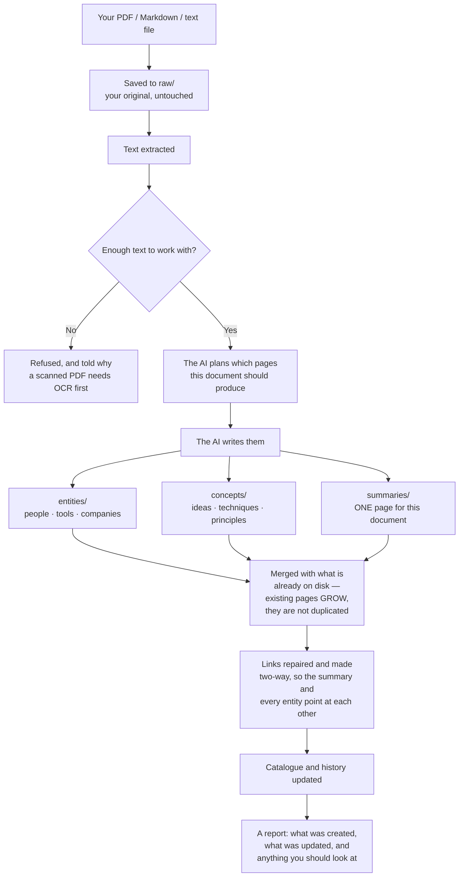

**The part that matters most is the merge.** Ingesting a second document about the same person does not create a second page about them — it adds to the one that exists. That is why the wiki gets *better* the more you feed it, rather than just bigger, and it is the whole difference between this and a folder of files.

### Supported file types

| File type | Extension | Example use |
|-----------|-----------|-------------|
| PDF | `.pdf` | Research papers, book chapters, reports |
| Text file | `.txt` | Articles you've copied, lecture notes |
| Markdown | `.md` | Notes from other apps, written summaries |

> **PDF tip:** Only text-based PDFs work. If a PDF is a scanned image (like a photo of a page), the text cannot be extracted. In that case, copy-paste the text into a `.txt` file instead.

### How to ingest

![The Ingest section of the Early Computing demo domain with a two-file batch staged. Down the left, the icon rail — Chat, Domains and Context, with the theme toggle, Sync (a badge reading 15) and Settings at the foot. The section heads 'Batch ingest — 2 files' over '1.5 KB total · Gemini · Flash Lite 2.5', a Domain picker, a dashed drop zone reading Drop more files here, and WILL BE INGESTED (LARGEST FIRST) listing manchester-baby.md (875 B) and the-z3.md (615 B), each with a remove cross. A card reads Estimated cost ≈$0.0019, sized against this wiki's real page list, and Estimated tokens 5,192 in / 3,334 out · 2 AI calls, with the line 'Runs on Flash Lite 2.5 · ≈9k tokens · ≈$0.0019 · Change model' and a 'How this range was worked out' info mark. Under it an optional Budget cap field reading No cap, an unticked 'Overwrite existing pages for files already ingested' box, and three buttons: a violet-tinted Start batch, Add more files and Clear all.](images/curator-ingest.png)

*The batch confirm gate, in the two-column shape it takes when the column is wide enough — here as the Ingest section of a domain page. **Left is what you are about to spend on** — destination, drop zone, the file list. **Right is the decision** — the cost, the budget cap, the overwrite switch and the actions. The three buttons at the foot are the [button family](#buttons--what-the-look-tells-you) in one row: **Start batch** is tinted because it spends money, **Add more files** is an ordinary action, and **Clear all** is reversible. Shown on the synthetic demo workspace; `node scripts/screenshots.mjs` regenerates it.*

1. Open **Domains**, pick your destination domain, and open its **Ingest** section (or the full-page **Ingest** view, if that is where you left off)
2. Confirm the **destination domain**. In the section it is the domain whose page you are on; in the full-page view it comes from the picker or the **destination list** in the panel beside the rail
3. Drag your file onto the drop zone — *"Drop a source here / or browse your files"*, with *"2 or more files at once starts a batch"* underneath — or click **browse your files** to pick one. Changed your mind? A **×** beside the file name removes it before you ingest, so you can pick a different one — including the same file again — without reloading the page.
4. Click **Ingest**
5. Wait. A progress bar names the current step ("AI is analyzing the document…") with a percentage and a running timer beside it. This usually takes **15–60 seconds** depending on the document length. Do not close the browser or refresh the page. See *Understanding the progress bar* below if it looks like it's stuck.
6. When it finishes you get a specific result, not a "Done!" — e.g. *"Wrote 7 new pages · updated 4 existing · +6.1 KB"* — followed by the full list of pages created or updated

> **Where a drop counts (v3.64.0).** Only a file dropped **inside the INGEST section** — or on the
> full-page view's own zone — is added to the ingest. A file dropped elsewhere on the page is
> **refused rather than opened**, because dropping a file on a web page normally navigates away
> from the app and takes whatever you had in progress with it. A page-level drop that forwards
> into the section is designed and deferred to v3.65.0.

> **While something is being dragged, or an ingest or batch is running, the domain page stops
> refreshing itself underneath the panel** and updates in place instead. That is not a nicety: a
> re-render under a live drag replaces the very element you are dropping onto, and the drop goes
> nowhere. It happened once, in this code, in v3.46.0.

> The chat sidebar also shows a drop zone. It is **not connected** — it says so on itself, and clicking **Ingest** on it brings you here. Ingesting from chat isn't wired up yet.

#### The Ingest screen has two shapes, and the cause is always on screen

Whether you are ingesting one file or a batch, the screen lays itself out the same way (*rewritten
in v3.55.0*): **the left column is what you are about to spend on, the right column is the
decision.** The difference is when a right column exists at all.

| State | What you see |
|---|---|
| **Nothing beside it yet** — no batch staged, no result, nothing running | **One column, at the full width of the page.** The domain picker and the drop zone are the things you came to use, so they take the whole width rather than sitting in a narrow strip with an empty half beside them |
| **Something to show** — a batch staged, a run in progress, a duplicate question, a failure, or a finished report | **Two columns.** The form narrows and the output opens beside it, rather than pushing the drop zone off the top of the screen |

Two columns appear only when the main column can actually hold two — which depends on your window
width, not on a guessed breakpoint. Below that the screen falls back to one column and stacks.

> **The form does narrow when a result arrives, and that is the trade.** A permanent empty
> half-width gap on the screen you meet first cost more than one reflow with a visible cause — a
> panel appearing where there was none.

**Notices keep their own measure.** Warnings, the duplicate question and the progress block stay at
a fixed width in both shapes, because a line of prose running the full 1144px is harder to read,
not easier. Controls take their container; sentences do not. That is the app's
[cap the sentence, never the card](#the-layout) rule, applied inside one view.

#### What the cost figure says about itself

The batch confirm gate's **Estimated cost** card carries one short line of provenance under the
figure — at most twenty words, e.g. *"Sized against this wiki's real page list — about 3.1x an
empty domain. Actual spend can land above the range."* — and the full account, 140–226 words of
it, sits behind the **ⓘ** beside *"How this range was worked out"*.

**The caveat is in the visible line, never behind the mark.** Costs, spend figures and
irreversible actions are one of the classes this app
[never folds](#how-help-works-in-the-app): the sentence that actual spend can land above the range
is always on screen, and so are the estimator's own warnings, which render above the **Start
batch** button and are not foldable at all. What is behind the ⓘ is the *arithmetic* — which model
and provider, the domain's current entity, concept and index sizes, why a mature wiki costs more
per file than an empty one, and the fact that the low end assumes prompt caching applies while the
high end assumes it does not.

**The multiple is computed for the batch in front of you**, not quoted from a table — and when the
domain is small enough that it would be noise (under 1.05×), both the short line and the full
account drop it rather than printing "about 1.0x". Developers: the two strings are `basisLede` and
`basis` on the estimate response, documented in
[api-reference.md](api-reference.md#post-apiingest-queueestimate).

**The panel beside the rail is a destination list.** Every other view's side panel is a list of the things that view acts on, and Ingest's is the place your file is about to land: one row per domain, each showing how many pages it holds, how long ago it was last written to, and what that last write was. While something is being written, the rows are **disabled rather than hidden**, so the list doesn't rearrange itself under your cursor mid-run — and a domain being ingested into somewhere else in the app is marked **Ingesting** on its own row, whichever row you have selected.

#### Reading a destination row

Both sidebars that list domains — **DESTINATION** here and **KNOWLEDGE** in
[Domains](#the-domains-view) — carry the same status line, rewritten in v3.54.0.
It used to read `3421 pages · last write 2026-09-03`, an absolute date you had
to subtract from today. It now answers *"is this domain current?"* at a glance:

```
Projects
3,445 pages  ·  ●  🕐  3 days ago
Ingested · The Energy and Water Footprint of Generative AI
```

| Part | What it says |
|---|---|
| **The page count** | How many wiki pages the domain holds. A count that could not be read says `page count unknown` rather than `0` |
| **The freshness dot** | The app-wide [freshness scale](#the-freshness-dot-one-scale-everywhere): **amber** for today, **filled grey** for this week, **hollow grey** for a week or more. A domain nothing has ever been written to gets a **dashed ring** instead. These rows read a date with no time of day, so they enter the scale at *today* and never show its two teal tiers |
| **The age** | `today` · `yesterday` · `3 days ago` · `2 weeks ago` · `5 months ago`. A domain with no writes reads **nothing written yet** — never a made-up date |
| **The last event** | What the most recent write actually was: `Ingested · <source title>` or `Compiled · <conversation title>`. When the log did not name which, it reads the neutral **Last write** rather than guessing. A domain that has never been written to has no second line at all |

Three things are worth knowing about that reading:

- **It is a calendar-day age, not a clock.** The date comes from the `## [YYYY-MM-DD]`
  heading in the domain's `wiki/log.md`, which carries no time of day — so *"today"*
  means today, and there is deliberately no *"7 hr ago"* precision the data cannot support.
  As of v3.72.1 that date, a new page's `created:` field, and a new domain's index all
  stamp your computer's **local** calendar day (was UTC through v3.72.0, so "today" could
  read as yesterday or tomorrow depending on your time zone and the hour) — so *"today"*
  now means your today, wherever you are.
- **The dot and the words can never disagree**, because the dot is cut on the same
  bands as the phrase beside it. The dot is also never the only carrier: the words
  say the same thing, and a screen reader reads the words.
- **The exact date is still there.** It is in the row's accessible name — so a screen
  reader announces *"Projects, 3,445 pages · 3 days ago (2026-09-14), Ingested · …"* —
  rather than in a tooltip, which a keyboard or touch user could never reach.

> **Compile counts as a write.** Compiling a chat thread to your wiki writes to
> the same log as an ingest, which is why the verb is read from the log rather
> than assumed. A domain you only ever compile into reads **Compiled · …**, and
> always did the work — it just used to be labelled "last ingest".

**The drop zone answers two different questions.** Hovering it looks one way — *you could drop here* — and dragging a file over it looks another, louder way — *let go and this happens*. They are deliberately distinct states, not one highlight doing double duty.

**Dragging from Finder works, and you don't have to hit the zone exactly.** Drop a file **anywhere in the full-page Ingest view** — the drop zone, the destination list beside it, the space around them — and it lands in the same place as if you had aimed at the zone. In the **Ingest** section of a domain page the same convenience is scoped to the section: a drop inside it counts, and a drop elsewhere on the page is refused rather than opened. Dropping **two or more files at once starts a batch**, exactly as picking several from the file browser does; the two routes go through the same code, so anything true of one is true of the other.

> **If you are on a version before v3.46 and drag does nothing, that is a known defect, not your machine.** Dragging over the zone destroyed the very element you were dragging onto, so the drop never registered — and because nothing then handled the drop, the app could navigate itself to the file and appear to vanish. Both halves are fixed: the zone now stays put for the whole drag, and the Mac app refuses to navigate away from itself. Until you update, **browse your files** / **Choose files** is the reliable route and handles multi-file batches perfectly well.

**Dropping files onto a batch that is already running does nothing — and says so.** Once a batch has started, files cannot be added to it (see *Batch ingest* below for why processing is strictly one at a time), so a drop onto the running batch panel is refused with a short note telling you to wait for it to finish, or — if it has already finished — to **Dismiss** it and drop again. It is never silently swallowed.

### Batch ingest — queue many files at once

If you select **two or more files**, The Curator switches from the single-file flow above into a **batch queue**: one durable, resumable job that ingests every file, one at a time, and survives you closing the browser tab or even restarting the app. Selecting a single file still uses the plain flow described above — nothing about it changes.

**You don't have to choose them all at once.** Selections *add up*, so you can build a batch from as many folders and as many drops as you like: pick a few files, then pick a few more from somewhere else, or drop one file and then drop three more — they all join the same queue rather than replacing what you already chose. The confirm screen lists everything currently queued, with an **× on each file** to drop it, **Add more files** to keep going, and **Clear all** to start over. Adding the same file twice does nothing — files are matched on name and size, so re-picking a folder won't queue anything twice. The cost estimate recalculates every time the list changes.

Once you're in batch mode you stay there, even if you remove files until only one is left — a one-file batch is perfectly valid. Only **Clear all** takes you back to the plain single-file flow.

**1. You see a cost estimate first — nothing is spent yet.** As soon as you pick your files, The Curator shows a confirm screen: every file that will be included (largest first — see below), any files it won't accept (wrong file type, over 50MB), and an estimated cost range in dollars and tokens. **No file is uploaded and no AI call is made until you click Start batch.** You're free to cancel at this screen at no cost.

> **The single most counter-intuitive thing about ingest cost: it depends on how big your wiki *already* is, not just on the files you're adding — and there's no single "roughly twice as much" rule of thumb.** Every ingest call re-sends the list of your domain's existing pages, so the AI can link to what's already there instead of creating duplicates. That overhead is a near-fixed cost per AI call, so it weighs far more heavily on a short note than on a long document. Measured against a real ~3,300-page wiki versus an empty one, the *same* document costs roughly **39x** more as a 2 KB note, **27x** more as a 5 KB short article, **15x** more as a 13 KB article, **3.3x** more as a 40 KB chapter, and **2.1x** more once a document is long enough to hit the per-ingest size cap. The confirm screen doesn't guess at any of this — it computes the real ratio **for the files in front of you** (the same files, run through the same estimator, against your domain versus an empty one) and shows that number, not a generic multiplier.
>
> **There's also a size where cost jumps, not just tapers.** Around 15,000 characters, a source crosses from being handled in a single AI call to The Curator's multi-phase pipeline (see below). That roughly doubles the input tokens for the same document — so two similar-looking files just either side of that line can show noticeably different estimated costs, and that's expected, not a bug.
>
> **The estimate is a range, not a ceiling.** `usdLow` assumes prompt caching kicks in; `usdHigh` assumes it doesn't. Real spend can land above `usdHigh` — on one real measured batch it came in at just over 103% of the high estimate. Treat the range as your best guide going in, not a guarantee of the final bill.

**2. Files are processed one at a time — always.** Even with a hundred files queued, The Curator ingests them strictly one after another, never in parallel — this is enforced as a hard guarantee, not just an ordering convention: even if you double-click Start, open two tabs, or otherwise fire off several requests for the same batch at once, only one file is ever being ingested at any instant. This isn't a speed limitation, it's a correctness rule: two files ingesting into the same domain at once would each start out believing the same set of pages already exists, and both could try to create (say) `openai.md` at the same time — producing two competing versions instead of one properly merged page. Processing one at a time is what keeps every page merging correctly. For the same reason, while a batch is actively working on a domain, the single-file **Ingest** button for that *same* domain is disabled (you can still start a normal single-file ingest into a *different* domain — a batch on `articles` doesn't stop you from ingesting into `projects`).

**3. The biggest files go first.** Within a batch, The Curator ingests the largest document first and works down to the smallest. Bigger documents build up more of the wiki's vocabulary (entities, concepts) early, so the smaller files later in the batch get to link into an already-richer wiki instead of starting from nothing.

**4. Pause, resume, cancel — you stay in control, and Cancel really does stop.**

- **Pause** finishes the file that's currently ingesting, then stops. It never interrupts a file partway through — that's what makes it the safe, "nothing is ever left half-done" option. Resume it whenever you like.
- **Cancel** stops the batch **and stops the file that's currently ingesting, right away** — it interrupts at the next AI call rather than waiting for the file to finish. On a large multi-part document that used to mean watching the batch keep spending for minutes after you clicked Cancel while it finished the file it was on; now it stops within a fraction of a second. Files that hadn't started yet are left as **not started**; anything already fully ingested before you clicked Cancel stays in your wiki — cancelling never undoes completed work.
- **Resume** continues exactly where the batch left off.

**Pause and Cancel are deliberately NOT the same kind of "stop," and it's worth knowing which one you're clicking.** Pause is lossless by design — it only ever stops between files, so nothing is ever caught mid-write. Cancel means "stop spending, right now," and accepts a small, honestly-labelled cost for that: the file that was interrupted shows as **Stopped**, with a note that says *"Stopped partway through — some pages may already have been written. Re-ingest this file to complete it."* In practice, an interrupted file usually has written nothing yet — The Curator only writes pages to your wiki after the AI has finished planning and generating content for that file, and Cancel interrupts before that point far more often than after it — but the wording is deliberately cautious rather than promising a guarantee it can't make. Nothing is ever deleted or rolled back by Cancel. To finish a **Stopped** file, re-ingest it — since it's already recorded in `raw/` as started, you'll need to tick **Overwrite** on the re-ingest (the same "already ingested" rule that applies to any file you deliberately re-run).

**Dismissing a finished batch.** Once a batch has finished, been cancelled, or failed, a **Dismiss** button clears the panel and returns the Ingest view to normal. Dismiss only tidies your screen — it doesn't delete anything or undo any work, and it's deliberately unavailable while a batch is still live so you can't accidentally hide something that's still running.

**5. The batch can pause itself — here's what each reason means and what to do:**

| Paused because... | What happened | What to do |
|---|---|---|
| **The AI provider rate-limited us** | The Curator already retried with backoff and still hit the limit. Nothing was lost. | Wait a few minutes, then click Resume. |
| **The AI provider is temporarily unavailable** | Same idea as rate-limiting, but the provider itself is briefly down rather than throttling you. The Curator already retried with backoff. Nothing was lost — this is on the provider's side, not yours. | Wait a few minutes, then click Resume. |
| **Budget cap reached** | You set an optional dollar cap (see below) and the batch reached it. | Raise the cap, or resume without one, to keep going. |
| **3 files failed in a row** | Three files in a row failed, for any reason — often a sign something systemic is wrong (an unexpected file type, a domain problem), not just one bad document. | Check the error messages on the failed files before resuming. |
| **The app restarted mid-batch** | You (or an app update) restarted The Curator while a file was mid-ingest. | The interrupted file will safely re-run from the start — see below. Just click Resume. |
| **This domain is locked** | Another process (an app update, a sync, or the My Curator MCP) is writing to this domain right now. | Wait for it to finish, then Resume. |
| **Paused** (no other reason shown) | You clicked Pause yourself. | Resume whenever you're ready. |

**6. You can close the tab — or even restart the app.** The batch lives on the server, not in your browser tab, so closing the tab doesn't stop it. Come back later, or just reopen the Ingest view, and The Curator shows you the batch exactly where it stands, reattaching to the live progress if it's still running.

If the **app itself** restarts mid-batch (a crash, or an update), the batch is deliberately **never resumed automatically** — spending money while you're not there to see it is not a decision The Curator makes for you. Instead, whichever file was mid-ingest when it stopped is safely reset to "waiting," and the batch pauses with an "app restarted" message. **Re-running that file is completely safe.** Ingesting the same source twice never creates duplicate pages — the same file always lands on the same summary page, and every entity or concept page it touches merges instead of duplicating. Just click Resume when you're ready to continue.

**7. Files you've already ingested are skipped — and you're told before anything is spent.** If a file in your selection was already ingested into this domain, The Curator marks it **Skipped** the moment you create the batch, before a single file is uploaded or a single AI call made. You'll see it called out on the confirm screen and in the panel, so you know up front rather than discovering it partway through a batch you've already paid for. Tick **Overwrite existing pages for files already ingested** on the confirm screen if you actually want to re-ingest a file that was skipped for this reason.

**8. When the batch finishes: an aggregate report, plus a free Health check.** Once every file has been processed (or skipped, or failed), the panel shows a summary — how many completed, how many failed, how many were skipped, total pages written, total warnings, and total spent. The Curator then automatically runs a **free, local Wiki Health scan** (no AI cost) across the whole domain and shows the results — broken links, orphans, and so on — so you can see the batch's overall effect on your wiki in one place. To act on anything it found, open **Domains**, pick that domain, and use its **Wiki health** panel ([§17](#17-wiki-health)).

**About the spend figure on a cancelled batch.** If you cancelled the batch, the total is shown as **"at least $X"** rather than a flat number. That's honest, not vague: the AI call that was in flight when you clicked Cancel is never billed back to us in a way we can measure, so every dollar counted was really spent but the last fraction of one is missing.

**When a billed file ran on a model with no published price** — a custom or override model The Curator can't price — the spend line reads **"price not published"** instead of a dollar figure (never **$0.00**, which would read as "this cost nothing"). If some files in the batch ran on a priced model and others didn't, it reads **"at least $X (some files ran on a model with no published price)"** — $X being the true total of only the part it could actually price. The token and AI-call counts are still shown either way, even with no dollar figure to go with them.

**9. Optional: set a budget cap.** On the confirm screen you can set a dollar amount as a spending cap for the batch. Once the running total reaches that cap, the batch pauses (see the table above) rather than continuing to spend. Leave it blank for no cap. If the AI model currently in use has no published price on file (this can happen with a custom/override model), The Curator refuses to accept a cap at all rather than accept one it can't actually enforce — you'll see a clear message explaining why. The batch itself still works fine without a cap; only the cap is refused.

### Understanding the progress bar (v3.0.17)

While an ingest runs, the progress bar shows the current step (e.g. *"Phase 1: planning wiki structure…"*) with a percentage next to it. On a large document, that percentage can sit at the same number for a minute or more. **This is normal — it does not mean the ingest is stuck.**

Here's why: several steps are a single request to the AI, and there's no way to show "70% done" partway through one AI response — it's either still working or it's finished. Planning the structure for a long document (Phase 1) is exactly this kind of step, and it's the one most likely to look frozen even though nothing is wrong.

Two things make this clearer:

- **A running timer** next to the percentage (e.g. `42s`, then `1m 15s`) counts up every second for as long as the current step is working. If the timer is moving, the AI is working. If you ever see the timer stop moving *and* nothing changes for several minutes, something has genuinely gone wrong — refresh the page and try again.
- **A short note under the progress bar** says: *"Large documents can take a minute or more per phase — especially planning. The timer above keeps ticking while the AI works; it isn't stuck."*

**If the AI provider is briefly overloaded**, The Curator automatically waits and retries (see [§19](#19-api-keys-cost--free-tier)). During that wait, the progress label turns **amber** and the bar pulses gently, e.g. *"Service busy — retrying in 9s… (attempt 2/3)"*. The timer keeps counting through these retries instead of resetting — so if a step needed two retries before succeeding, the timer shows the whole time it actually took, not just the final attempt.

**In short:** a still percentage with a moving timer = working normally. A frozen timer with no error message = worth refreshing and trying again.

### What happens automatically

The AI reads your document and creates:

- **1 summary page** — the key takeaways in bullet points
- **Entity pages** — one page for each person, tool, company, or framework mentioned
- **Concept pages** — one page for each key idea or technique
- **Cross-references** — every page links to related pages
- An updated **index** — a master catalog of everything in this domain
- A **log entry** — a record of this ingest with today's date

On the second, third, and subsequent ingests, the AI reads what's already in the wiki and *updates* existing pages rather than duplicating them. The more you add, the smarter it gets.

### How big a document can The Curator handle?

Gemini 2.5 Flash Lite has a **1,048,576-token context window** (~1 million tokens, roughly 700,000 English words). In principle, a single ingest could swallow an entire 300-page book.

In practice, The Curator's ingest pipeline currently caps the **input** at 80,000 characters (~20,000 tokens) per ingest to keep latency and cost predictable. **If your source is longer than that, you'll see a red ⚠ Attention entry on the result panel telling you exactly how much was processed and how much was dropped** — content past the cap is not seen by the AI. For long sources, split by chapter or use the multi-phase pipeline (kicks in automatically for inputs > 15k chars):

1. **Phase 1** — outline pass: the AI reads the whole document and produces a list of pages to write (with a required-coverage checklist: one summary, originator entity, every named person/tool/company, every key concept, consolidation rule for closely related sub-ideas)
2. **Phase 2** — batched content: pages are written in batches of 4 per LLM call
3. **Index merge** — the app appends new rows to `index.md` programmatically (no LLM call), so the index stays consistent even on large domains

**Practical guidance:**

| Document size | Behaviour |
|---|---|
| **≤ 25 pages / ~10–15 k words** | Single-pass ingest (15–60 seconds) — the most common case |
| **25–100 pages / book chapters / long research papers** | Multi-phase pipeline kicks in automatically (~1–5 minutes) — works reliably |
| **200–300 pages / full books** | Multi-phase pipeline still works — possible but **not yet stress-tested at scale**. The 1M-token context is large enough; expect ingest to take 10–20 minutes. If a very long PDF stalls or runs out of token budget, split it into chapters. |
| **Scanned PDFs (image-only)** | Won't work — there's no OCR step. Convert to text first. |

> The 80k-char-per-call cap is conservative; future versions may raise it now that Gemini 2.5 Flash Lite's full 1M window is generally available. For now, splitting very long sources by chapter is the safe bet.

### Tips for better results

- **Use descriptive filenames.** `atomic-habits-summary.txt` is better than `notes.txt` — the filename becomes the summary page's slug (v3.0.1-beta.1+), so the file `report-2024.pdf` always lands on `summaries/report-2024.md`.
- **One document per file.** Don't combine ten articles into one file — each document should get its own file so it gets its own summary page. To ingest many documents at once, select them all and use **batch ingest** (see above) rather than manually combining them or running the single-file flow over and over.
- **Clean up copy-pasted text.** If you paste an article from a website, remove the navigation menus, cookie banners, and footer text first. Cleaner input = better wiki pages.
- **Mind the rate limits on the free tier.** If you're ingesting a batch of 5+ documents and you're on Gemini's free tier, expect to hit `429 RESOURCE_EXHAUSTED` partway through — see [§19](#19-api-keys-cost--free-tier).
- **Watch the warnings panel after each ingest.** If you see "⚠ Source truncated to 80,000 chars" or "⚠ Stub page created", the ingest finished but with reduced quality — the warning tells you exactly what to do. Re-ingesting the same source is safe (see below).

### Understanding the ingest report (what those "warnings" really mean)

When an ingest finishes, you may see a coloured banner at the top of the result panel that says something like *"Ingest finished — 12 notes"*. Despite the older "warning" label, **most of these entries are SUCCESSES, not problems** — they're the Curator's safeguards reporting what they caught and fixed for you. As of v3.0.1-beta.12, each entry is now categorised so you can tell at a glance what needs your attention.

There are four categories:

| Category | Icon | Colour | What it means |
|---|---|---|---|
| **Auto-fixed** | ✓ | green | The Curator detected something the LLM did wrong and **already fixed it**. Nothing for you to do — your wiki is cleaner than it would have been. |
| **For review** | ⚠ | amber | The Curator detected something it **can't auto-resolve**. Read the entry; you may want to act via Wiki Health or by re-ingesting. |
| **Attention** | ⚠ | red | Something material happened — usually source truncation. Read the entry; you may need to split the source or take other action. |
| **Info** | ℹ | blue | Contextual note. Usually safe to ignore. |

The banner's outer border colour matches the most-severe entry, so at a glance:

- **Green border** → everything's fine, the safeguards just did some work
- **Amber border** → one or more items need your review
- **Red border** → source truncation or similar — read the report

#### When one line represents many pages (v3.0.17)

Some issues can happen many times in a single ingest — for example, a dozen pages missing their `.md` extension, or several content batches that each had to be retried. Showing every occurrence as its own line would bury the few entries that actually need your attention under a wall of repeats. A real ingest that used to show 75 separate warning lines now shows 11.

So, any issue that happens **3 or more times** in one ingest is collapsed into a single summary line — e.g. *"12 page paths came back from the AI without the '.md' extension and were written correctly (a, b, c, …and 9 more)"* — instead of 12 near-identical lines. Below that (1 or 2 occurrences), you'll still see the individual entry, because at that count the specific page name is more useful to you than a summary.

**No detail is lost by grouping** — it only affects the warnings banner. Every page written during the ingest, including every one folded into a grouped line, is still listed individually — with its full path and whether it was created or updated — in the change list shown above the warnings.

Two kinds of entries are deliberately **never** grouped, even when they happen many times: semantic near-duplicate redirects, and a newly-injected "trunk" parent page. Both name a specific pair or page you may want to look at individually — folding "12 duplicates were merged" into one line would hide exactly the thing worth double-checking.

#### Full reference of ingest-report entries

| Entry text | Category | What it means | What the Curator did | What you should do |
|---|---|---|---|---|
| *"Outline had N `prefix-*` pages without a parent `concepts/<prefix>.md` — injected the trunk page (granularity-inversion fix)"* | ✓ Auto-fixed | The LLM created several specific sub-concept pages (e.g. `taste-as-moat`, `taste-as-judgment`) but skipped the obvious parent `taste`. | Auto-injected the parent concept page with a clean umbrella summary. | Nothing. You can edit the parent page later in Obsidian if you want richer content. |
| *"Outline omitted originator '<author>' — injected `entities/<slug>.md`"* | ✓ Auto-fixed | The source had a clear byline ("By Dr. X") but the LLM didn't create an entity page for the author. | Detected the byline + injected the missing author entity. | Nothing. |
| *"Outline used originator slug `entities/dr-tali-rezun.md` — redirected to canonical `entities/tali-rezun.md`"* | ✓ Auto-fixed | The LLM used a honorific-prefixed slug. | Redirected to the canonical slug so honorific variants don't pile up. | Nothing. |
| *"Outline proposed `concepts/X.md` — semantic near-duplicate (Jaccard 0.XX) of existing `concepts/Y.md`. Redirected; bullets will merge."* | ✓ Auto-fixed | A new concept slug was ≥85% similar to an existing one (e.g. `experts-roundup-format` vs `expert-roundup-format`). | Auto-merged the new content into the existing page. | Nothing. |
| *"Hub linkification: added N wikilinks across M hub-shaped concept page(s)"* | ✓ Auto-fixed | The LLM wrote a "hub" concept page (one that enumerates many sibling concepts) using plain-text item names instead of `[[wikilinks]]`. | Detected hub-shape pages, found plain-text mentions of siblings, wrapped them in `[[brackets]]`. | Nothing — your hub now connects to all its items in Obsidian's graph. |
| *"The AI invented N extra summary page(s) (...) — merged into the canonical summary '...' instead of creating duplicates"* | ℹ Info | The AI wrote its content for a second, differently-named summary page instead of the one the file name always produces for this source. | Merged the extra summary's content into the canonical one and never wrote the duplicate to disk. | Nothing. Re-ingesting this same source will keep updating the one canonical summary, as intended. |
| *"Page path '...' was missing the .md extension — wrote it as '...'"* | ℹ Info | The AI returned a page path with no file extension (e.g. `concepts/some-idea` instead of `concepts/some-idea.md`). | Added the extension and wrote the page normally — previously this page would have been silently dropped. | Nothing. |
| *"N page paths came back from the AI without the '.md' extension and were written correctly (a, b, c, …and N more)"* (v3.0.17, the grouped form — appears once 3 or more pages hit this in one ingest, see "When one line represents many pages" above) | ℹ Info | Same issue as the row above, happening on 3 or more pages in this ingest. | Same fix, applied to every affected page — grouped into one line instead of listing it N times. | Nothing. Every affected page is still listed individually, with its full path, in the change list above the warnings. |
| *"The AI's first attempt at '...' came back unusable, so The Curator asked for a shorter version and saved that instead. This is real content, but it is briefer than the rest — open it and re-ingest if it reads too thin."* (v3.0.17) | ⚠ For review | The AI's first attempt at writing this one page ran past the response length limit, or came back unparseable. | Automatically retried with a strict "be brief" instruction, and that attempt succeeded. | Open the page from **Domains → PAGES**. It's genuine content, just shorter than the rest of the wiki — re-ingest the source later if it reads too thin. |
| *"N pages had to be rewritten more briefly: the AI's first attempt at each came back unusable... (examples). These are real content, but they are briefer than the rest..."* (v3.0.17, grouped form) | ⚠ For review | Same as the row above, happening on 3 or more pages in this ingest. | Same brevity retry, applied to each page, grouped into one line. | Same as above — check the pages named as examples, or anything in the change list that reads unusually thin. |
| *"Outline proposed `concepts/X.md` — possible semantic near-duplicate (Jaccard 0.XX) of existing `concepts/Y.md`. Keeping both."* | ⚠ For review | A new concept slug is 50–85% similar to an existing one (probable but not certain duplicate). | Kept BOTH pages because the similarity was below the auto-merge threshold. | Open **Domains → the domain → Wiki health**, then **✨ Find duplicate pages** under QUICK MAINTENANCE. The AI-judged scan will tell you whether they're truly the same concept; if yes, merge via the Preview-then-Merge flow. |
| *"N of M wikilinks (X%) don't resolve to an existing page. Examples: ..."* | ⚠ For review | The LLM mentioned some entities in body text that weren't on the page plan, leaving phantom links. | Wrote the pages as-is with the broken links visible. | Open **Domains → the domain → Wiki health** → expand Broken links → use **Ask AI** to either find the right target or strip them. Or re-ingest with broader coverage if it's a content gap. |
| *"Stub page created: `<path>` — AI failed to write content for this page"* | ⚠ For review | The LLM failed to generate content for a planned page even after the page-by-page fallback and the v3.0.17 brevity retry above. | Wrote a clearly-marked stub with the LLM's planned summary preserved. | Re-ingest the source. The stub page has a `stub` tag so you can find it. |
| *"The AI wrote N page(s) that were not in its own plan (...). They were kept — check them"* | ℹ Info | The LLM wrote a page it never listed in its own outline — sometimes a legitimate addition, sometimes a near-duplicate under a slightly different name. | Kept the page rather than silently discarding content you paid for. | Open it from **Domains → PAGES**. If it duplicates an existing page, delete it (or merge it manually); otherwise, nothing to do. |
| *"Source truncated to 80,000 chars (was X chars). Content past the cap not seen by the AI."* | ⚠ Attention | The source was longer than the 80k character cap. | Truncated the input and warned you. The pages it DID write are still good. | Split the source by chapter/section and re-ingest each part. Or wait for a future release with chunk-and-recombine support. |
| *"Could not extract text from `<file>`"* | ⚠ Attention | The PDF is encrypted, scanned (image-only), or malformed. | Refused the ingest and rolled back the raw file so retry isn't blocked. | Run OCR on the PDF (macOS Preview → Tools → Adjust Text → OCR, or `ocrmypdf` on the command line). Or copy the article text into a `.md` file. |
| *"Refused an unsafe/malformed page path '...' — nothing was written"* | ⚠ Attention | The AI returned a page path that can never be a valid wiki page (e.g. empty, a folder with no filename, or containing characters that aren't allowed). This is rare and is a hard safety refusal, not an auto-correction. | Refused to write that one page — every other page from the same ingest still wrote normally. | That one page's content was lost. Re-ingest the source; if it recurs on the same source, open an issue — this shouldn't normally happen. |
| *"Claude / Gemini hit the output token limit (N tokens)"* | ⚠ Attention | The LLM's response was cut off mid-write and every automatic recovery attempt for that call was exhausted. Rare — most token-limit hits now recover automatically (see the batch and page entries below, and the planning-recovery entry further down). | Reported the failure honestly — this specific case is NOT transient, retrying the exact same call hits the same wall. | Split the source into smaller parts and ingest each separately. You can also **pick a model with a bigger output ceiling** in **Settings → Providers & keys** — every model row shows its ceiling. On Anthropic, `claude-sonnet-4-6`, `claude-sonnet-5`, `claude-opus-5` and `claude-opus-4-8` allow 128,000 output tokens where the default `claude-haiku-4-5` allows 64,000; every Gemini model on offer allows 65,536. Switching *provider* is also worth trying for the same reason. See [§16b](#16b-choosing-your-ai-model). |
| *"Batch N of M was too large for the AI's output limit — wrote those pages individually instead."* (v3.0.17) | ℹ Info | A group of up to 4 pages the AI was writing together didn't fit in one response. | Automatically retried the same pages one at a time instead of as a group. Nothing was lost. Different from the "hit the output token limit" entry above — that one is an unrecoverable failure; this one is a normal, successful recovery. | Nothing. This just means the ingest took a little longer than usual. |
| *"N content batches were too large for the AI's output limit — those pages were written one at a time instead. Nothing was lost; the ingest just took longer than usual."* (v3.0.17, grouped form) | ℹ Info | Same as the row above, happening on 3 or more batches in this ingest. | Same per-batch recovery, grouped into one line. | Nothing. |
| *"The AI returned a page with no path — it could not be written."* (v3.0.17) | ℹ Info | The AI's response for one planned page arrived with no file path attached, so there was nothing to write it to. | Skipped that one page. Nothing else in the ingest was affected. | That page's content did not make it into the wiki. Re-ingest the source, and check the result for anything that seems to be missing. |
| *"N pages came back from the AI with no file path, so they could not be written. That content did not make it into the wiki..."* (v3.0.17, grouped form) | ℹ Info | Same as the row above, happening on 3 or more pages. | Same skip-and-report handling, grouped into one line. | Same as above — re-ingest the source and check the change list for anything missing. |
| *"While planning the page list, the AI ran past its response length limit… The Curator asked again for a shorter plan and that succeeded, so the ingest completed. Note that the retry explicitly asks for FEWER, broader pages, so the page list below is coarser than a first-attempt plan would have been… Planning took N AI calls instead of 1, and your source document was sent to the AI twice."* (or the same message opening with *"The AI's first page plan came back as malformed JSON"*) (v3.0.17) | ℹ Info | On a large or unusual document, the AI's first attempt at planning which pages to write either ran past its own response limit or came back malformed. | Automatically asked again with a stricter, more concise prompt, and that succeeded — the ingest completed normally. | Nothing required. But be aware: because the recovery prompt explicitly asks for fewer, broader pages, the resulting wiki is genuinely **coarser** than a first-attempt plan would have been — some detail may be grouped under one parent page instead of getting a page of its own. If a topic feels under-covered, re-ingest to try again (the AI's output varies from run to run), or split the source and ingest the parts separately. |
| *"An ingest is in progress for `<domain>` — please wait"* | ℹ Info | You clicked Sync, Update, or Delete-domain while an ingest was running. | Refused the conflicting operation with a 409. The Update / Sync / Delete buttons auto-grey while an ingest runs, so you usually won't see this. | Wait for the progress bar to finish, then retry. |
| *"Another process is already writing to `<domain>` (file lock held)"* | ℹ Info | The MCP via Claude Desktop tried to write while an in-app ingest is running. | Refused the MCP write — the in-app ingest takes priority. | Wait for the in-app ingest to finish. The lock auto-clears after 30 minutes if a process crashed; you can manually delete `<domain>/.write-lock` if needed. |
| *"This domain has grown large enough that the AI request had to be trimmed: N of M entity/concept pages were left out..."* | ℹ Info | **Very rare** — only appears on an extremely large domain (thousands of pages in a single folder), where the full list of existing page names would be too big for the AI to read in one request. | Kept only the most relevant existing pages in the AI's request instead of failing the ingest outright. The full, untrimmed page list is still checked separately for near-duplicates after the AI responds, so this doesn't weaken duplicate protection. | Nothing, usually. If a near-duplicate page appears anyway, merge it from **Domains → the domain → Wiki health → ✨ Find duplicate pages**. |

Below the change list and warnings, you'll also see a compact **token & cost footer** — see the next section.

#### Understanding the token & cost footer (v3.0.17)

Below the change list and any warnings, a small line reports the real API usage for this specific ingest — not an estimate. It looks something like:

> `gemini · gemini-2.5-flash-lite   4 calls   38,204 in / 6,112 out   24,900 cached read`

Reading it left to right:

- **Provider · model** — which AI service and model handled this ingest.
- **N calls** — how many separate requests were made to the AI. A short document is usually 1 call; a longer one that needs the multi-phase pipeline (see above) makes several — one for planning, plus one per batch of pages.
- **X in / Y out** — input and output tokens. Input is roughly your source document plus the AI's instructions; output is the wiki pages it wrote back.
- **cached read / cache write** (shown only when non-zero) — on longer, multi-batch ingests, The Curator reuses parts of the prompt across batches instead of re-sending them every time. "Cached read" tokens are the ones it reused — reading from cache costs a small fraction of a normal input token, so a large cached-read number is where the caching saving (see [docs/ingestion-pipeline.md](ingestion-pipeline.md) §8.1 for developers) actually shows up. "Cache write" is the one-time, slightly-more-expensive cost of setting that cache up on the first batch.

You don't need to act on anything here — it's informational, useful if you're curious what an ingest actually cost, or comparing providers.

### What is Jaccard similarity? (for the semantic-dupe entries)

Several entries above mention a "Jaccard 0.XX" score. Jaccard similarity is a simple math measure of how similar two sets are. The Curator uses it to detect concept slugs that are different strings but probably mean the same thing.

The formula (in plain English):

```
similarity = (words both slugs share) / (total unique words across both)
```

Worked examples from a real ingest report:

| Pair | Tokens A | Tokens B | Shared | Unique total | Jaccard |
|---|---|---|---|---|---|
| `the-human-touch` vs `human-touch` | `{the, human, touch}` | `{human, touch}` | 2 | 3 | **0.67** |
| `wisdom-cultivation-accelerates` vs `wisdom-cultivation` | `{wisdom, cultivation, accelerates}` | `{wisdom, cultivation}` | 2 | 3 | **0.67** |
| `expert-roundup-format` vs `experts-roundup-format` | `{expert, roundup, format}` | `{experts, roundup, format}` | 2 (after stem) | 3 | **0.50** raw → **1.0** with stem |
| `community-relationships-deepen` vs `deepening-community-relationships` | `{community, relationships, deepen}` | `{deepening, community, relationships}` | 2 (3 after stem) | 4 | **0.50** |

The scale and what the Curator does at each:

| Jaccard score | What it means | Curator's action |
|---|---|---|
| **0.00 – 0.49** | Independent concepts (share few words) | Keeps both, no message. |
| **0.50 – 0.84** | Possible duplicate, but uncertain | Keeps both + emits a "For review" entry so you can decide via Wiki Health. |
| **0.85 – 1.0** | Almost certainly the same concept | Auto-redirects the new slug onto the existing one. Bullets from the new page merge into the existing one. |

#### Lightweight singular/plural normalisation

Before computing Jaccard, the Curator trims trailing `s` if the resulting token would still be ≥3 chars long. This catches:

- `collections` → `collection`
- `roundups` → `roundup`
- `relationships` → `relationship`

Without this step, `expert-roundup-format` and `experts-roundup-format` would compute Jaccard 0.50 (3 unique tokens, 2 shared). WITH it, they compute 1.0 (same token set after stem) — and get auto-merged. The stem step is conservative on short words: `is`, `as`, `os` are NOT stemmed (would damage real meaning).

#### Why entities are never auto-merged by Jaccard

The Jaccard guard ONLY operates on **concept** pages, never entities. Entities are usually proper nouns (people, companies, countries) where slug variants may genuinely be different things:

- `open-ai` vs `open-source-ai` — Jaccard might be high but these are different
- `microsoft` vs `microsoft-research` — different entities sharing a name
- `tali-rezun` vs `tali-reziuncipher` — could be honest typo or actual different people

For entity dedup, the Curator relies on the structural passes (honorific-prefix strip, hyphen-normalisation, cross-folder dedup) which work on slug shape, not semantics. The Health-side semantic-duplicate scan remains the LLM-judged tool for entity-side merges if you ever need them.

### Related: things you might also see during ingest

These are status messages during the ingest itself (not part of the report banner):

- **"Service busy — retrying in 9s… (attempt 2/3)"** — Gemini API returned HTTP 503 (overloaded). The Curator retries automatically with exponential backoff (3s → 9s → 27s), shown in amber on the progress bar while it waits (v3.0.17 — see *Understanding the progress bar* above). Ingest almost always succeeds after the wait. See [§19](#19-api-keys-cost--free-tier).
- **"AI is analyzing the document…"** — The LLM call is in flight. This can take 10–60 seconds depending on document size — watch the timer next to the progress bar rather than the percentage (see *Understanding the progress bar* above). Don't refresh.
- **"Phase 2: writing content, batch N of M…"** — Multi-phase ingest is processing a batch. Wait for it to finish.
- **"Could not extract text from PDF"** — See the table above.

### Re-ingesting a source (and why it's safe)

If you find an ingested page looks incomplete, or you've updated The Curator and want fresh ingests to apply newer prompt rules to old sources, re-ingest. **The pipeline is fully idempotent on re-ingest (v3.0.1-beta.1+):**

| What could duplicate | What prevents it |
|---|---|
| Summary page | The slug is computed from the source filename, so `report.pdf` always becomes `summaries/report.md`. The second ingest merges into the existing summary — bullets accumulate, no second file. |
| Entity pages (Alice, Google, etc.) | The AI is shown a list of existing entity filenames before it picks slugs, plus `writePage` runs three dedup passes (title-prefix strip, hyphen-normalised match, cross-folder dedup). Same entity = same file = bullets merge. |
| Concept pages | Same mechanism as entities. |
| Index rows | The index is updated programmatically — rows for slugs already mentioned are skipped. |
| Bullets within sections | After every write, `deduplicateBulletSections` removes any duplicates produced by the merge. |

**How to re-ingest a single source:**

1. Open the same domain's **Ingest** section in **Domains**
2. Drop in the same file again (or browse to it) and click **Ingest**
3. The Curator recognises it and stops before spending anything: *"**&lt;filename&gt;** has already been ingested into this domain."*
4. Click **Re-ingest & update wiki** to proceed, or **Cancel** to back out

The result panel will show which pages were "updated" vs "unchanged" — you can confirm at a glance that nothing was duplicated.

> There is no list of previously-ingested files in the app — re-ingesting means handing The Curator the file again. The original files live in `domains/<domain>/raw/` on the machine you ingested them on, if you need to find one.

> In a **batch**, the same check happens at the confirm screen instead: already-ingested files are marked **Skipped** before anything is uploaded, and the **Overwrite existing pages for files already ingested** checkbox re-includes them.

**To re-ingest every source in a domain** (after a Curator update with significant ingest improvements, for example):

```bash
node scripts/bulk-reingest.js <domain>
# e.g.: node scripts/bulk-reingest.js articles
```

There's a 3-second pause between files by default to avoid rate-limit hits on the free tier. Add `--delay=5000` for slower pacing.

---

## 9. Chat with your brain

After ingesting a few sources, you can have a full multi-turn conversation with your knowledge base. The AI answers from your wiki pages only, cites its sources, and remembers the entire thread — even after you restart the server.

> **Chat retrieval (v3.0.1-beta.13)** — the chat now uses three layered techniques to find the right pages for your question:
> 1. **Entity pivot** — if your question mentions an entity that exists in your wiki (a person, tool, company, etc.), chat automatically loads that entity's page AND every summary it backlinks to. So "list articles by Dr. Tali Rezun" loads her entity page plus all 50+ summaries that reference her, not just the few summaries with "tali" or "rezun" in the filename.
> 2. **Author-aware catalogue** — every summary in your domain shows up in the catalogue with a "referenced by: X, Y, Z" suffix listing which entities link to it. The chat can enumerate "everything by X" from this catalogue alone.
> 3. **Intent detection (v3.0.8)** — the chat reads what you're actually asking and shapes the answer to match: a **decision** question ("which of these should I write — recommend one") gets a direct recommendation up front; a **list** question ("list all…", "how many…") gets a focused, de-duplicated list; everything else gets a synthesised answer. It classifies your *question* (not text you paste in), so a word like "everything" buried in pasted notes no longer turns a recommendation request into a full-domain dump.
>
> **This is what makes chat work on large mature domains** (3,000+ pages, multi-megabyte wikis). Earlier versions hard-truncated wiki content at 90 KB and dropped 98% of pages on large domains; beta.11 added keyword scoring; beta.13 added entity-pivot + author metadata + intent detection.

### Pin a project, and the answer reads its context too

**Since v3.72.0, the domain and project choices live on the composer, not a bar above the thread**
(the redesign is covered in full in [The chat interface](#the-chat-interface) below). The
composer's pills read left to right: **Domain**, **Project**, **Length**, **Model**. The Domain
pill picks which knowledge base this conversation can see; the **Project** pill sits beside it,
wearing the same pill face with a hollow grey mark instead of a coloured dot — open it and pick a
project, and the answer also draws on its **brief**, its **latest handoff** and the canonical
documents marked **read first** — on top of the domain's wiki, never instead of it. A slice of the
project's journal and any other foundation that matches your question come in as well, the same
way the bootstrap an agent gets chooses them.

**Reopening a conversation restores its project (v3.76.0).** Open an earlier conversation and the
Project pill shows the project that conversation's last answer used — or **No project** when that
answer recorded none — instead of whatever this browser last pinned for the domain. You can still
change it, and that choice is remembered as your pin exactly as before. A **new** chat keeps
today's behaviour: it starts on your pinned project for the domain. A conversation from before
v3.72.0 recorded no project, so it opens on your pin too — nothing is guessed for it — and a
project that has since been deleted is not restored.

**The readout lives in the picker now, not under the composer.** Open the list and its footer says
what was actually used: the pinned project's own reading, its freshness, and how much of it the
last answer actually drew on — *"saved 47 min ago · 5 KB read last turn"*. That figure is the
server's own measurement, not an estimate, and it is empty until a turn has measured something.
Closing the picker hides the figure; nothing is lost, because every project row already carries its
own age as its own detail — the one control that used to sit on the bar permanently now shows all
of them, one press away.

**Which wikis the pinned project's own knowledge lives in is disclosed, never selected.** A
conversation still reads exactly one domain — the Domain pill's own choice — and pinning a project
never widens it: widening it would unpin the project, since a project belongs to the domain it
lives in. The Project picker's footer says how many other domains the project's own knowledge
spans, whether you chose them in Project context or it is just the project's own domain, and names
any of them missing from this computer.

Three things are worth knowing before you rely on it.

- **It is a reading, not a save.** Chat never writes to your project. Nothing you ask here changes
  a brief, a handoff or a document.
- **The project's text is handed to the model as recorded data to verify, never as instructions**
  — the same defence the MCP uses, from the same source, word for word. A handoff that happens to
  contain a sentence shaped like an order is treated as something an earlier session wrote down,
  not as something to obey.
- **Two budgets, not one.** The wiki keeps the budget it always had; the project gets its own
  separate one, so pinning a project never quietly costs you wiki pages. When something does not
  fit, the answer says what was left out.

The pin is remembered **on this computer**, per domain — it does not travel with your synced
conversations, because a project pinned on one machine may not exist on another. If you delete the
project, the pin clears itself. And if you pin a project this domain does not have, Chat says so
plainly before it starts answering, rather than quietly answering from the wiki alone.

### Best practices for asking the chat questions

- **Mention specific entities** when you want comprehensive coverage: *"What articles do I have by Dr. Tali Rezun?"* triggers entity pivot. *"What articles do I have?"* doesn't.
- **Be explicit about enumeration** when you want a complete list: *"list all"*, *"how many"*, *"name every"* trigger the enumeration prompt. *"summarize"*, *"explain"*, *"tell me about"* trigger the synthesis prompt.
- **Specific is better than vague**: *"What does my wiki say about HNSW vs IVF?"* finds the right pages. *"Tell me about vector search"* is much broader and may hit the catalogue fallback.
- **For comprehensive author/topic queries, the My Curator MCP via Claude Desktop is even more thorough** — its `get_backlinks` tool gives the canonical, complete list. The in-app chat is best for content questions; MCP is best for graph-traversal queries.

### The composer — Length and Model selectors

**Since v3.72.0 the composer also carries Domain and Project pills**, described just above in
[Pin a project](#pin-a-project-and-the-answer-reads-its-context-too) — this section covers the
Length and Model pills that sit beside them.

The message box has its controls tucked along its own bottom edge, to the left of the **Send**
button, four pills in a row:

- **Domain** — which knowledge base this conversation can see. **Fixed once a conversation has a
  message in it** (v3.72.0): a conversation lives in one domain's folder, so the pill draws with a
  dashed outline and its menu foot reads *"This conversation is in Articles. Another domain starts
  a new chat there."* Picking a different domain from that menu does not move the current
  conversation — it starts a fresh one, in the domain you picked. On a brand-new, empty
  conversation the pill is a normal choice.
- **Project** (described above, [Pin a project](#pin-a-project-and-the-answer-reads-its-context-too))
  — the hollow grey mark, never a coloured dot, and its name in words. Picked **per question**: you
  can pin, change or clear it between messages in the same conversation.
- **Length** (always shown) — Concise · Balanced · Detailed, described below.
- **Model** — pick the exact model that answers your chat messages, per question. Each row shows
  its id, its price per 1M tokens as billed today, and one plain line: any warning reason first,
  then how fast it answered when measured. With no key saved there is nothing to choose and the
  picker is hidden. Full explanation of the markers: [§16b](#16b-choosing-your-ai-model).
- There is **no attach button** — you can't ingest a file from the chat box. Use the **Ingest** section of the domain's page in **Domains**.
- Alongside them, a short note reminds you that what a message costs depends on how long the answer runs.

#### The menu shows a working set, not two hundred rows

An OpenRouter key can put roughly two hundred models within reach. Dropping all of them into a menu you open mid-conversation would make switching models harder, not easier. So the menu shows a **working set**: the model you're on, any you've **starred**, the ones you've **used recently**, and every model that has actually been **measured** — by us or by you.

Two details make this predictable rather than clever:

- **The order is the catalogue's, not your recency.** Membership changes as you use the app; **position doesn't**. A model does not jump to the top because you used it last, so the menu doesn't have to be re-read every time you open it.
- **It only collapses when collapsing actually saves you something.** If the catalogue is small (**24 models or fewer**), or the working set isn't genuinely shorter than the full list, everything is shown and no *browse* row appears — because a "see everything" link leading to a list already on screen is just a wasted click.

When it does collapse, a **browse** row opens the full catalogue with **search** (matching the model id or name, vendor prefix included), a **provider** filter, and a **free-only** filter. A running count tells you how many of how many you're looking at, and if a filter leaves nothing, one click clears it. **Every model stays reachable** — nothing is hidden from you, only deferred.

> **Starring works in the browse dialog**, where each row carries a star you can toggle. In the composer menu the star is shown but is not clickable — a menu row is a single choice, and burying a second control inside it is a known way to make menus behave badly.

#### The keyboard works everywhere now

Every dropdown in the app is drawn by The Curator rather than by your operating system, which means keyboard behaviour is consistent and is ours to get right: **arrow keys** move (and open a closed menu), **Home/End** jump to the first and last option, **Page Up/Down** move by a screenful, **Enter** commits, **Escape** closes and changes nothing, **Tab** closes without committing, and **typing** jumps to a match — by prefix first, then anywhere in the name, so typing `opus` finds a model whose id begins with a vendor prefix. Typing the same letter repeatedly cycles between matches. Typing never commits blindly.

Both pickers open **upward**. Both choices are remembered in your browser between questions — the model you pick stays picked for every later chat message from this browser, across conversations and across restarts, until you pick a different one.

#### Ask the same question again, on a different model

Any answer can be **re-asked with another model**. It takes the question that produced that answer, keeps you in the same conversation, and sends it again to a model you choose. **Both answers stay in the thread**, each labelled with the model that actually produced it and what it cost — so you are comparing two real answers side by side rather than remembering what the first one said.

Two things worth understanding before you use it:

- **It is a second opinion, not an independent run.** Prompts are built from the recent messages in the conversation, so the second model can usually *see* the first answer. The app tells you which situation you are in at the moment you pick — whether the earlier answer is still inside that window, or has fallen outside it — because "asked fresh" and "asked knowing what the other one said" are different questions with different answers.
- **Picking the model sends immediately.** There is no separate confirmation step, so treat the model list as the decision point. It costs one ordinary chat message on the model you pick.

This is the **chat lane**, and it is sealed off from the rest of the app: ingest, Compile and Health scans all keep using the model set in Settings, no matter what you pick here. That is the design — *one model builds your brain; you choose freely when talking to it* — and [§16b](#16b-choosing-your-ai-model) explains why the two lanes are separate and why the build side is a single setting rather than one per feature. Because the choice is sticky, **each answer displays the model that actually produced it**, so a selection you made and forgot is always visible on the answers themselves rather than only in the dropdown. Where that figure comes from, and why it sometimes isn't shown at all, is explained just below in [Why a sticky chat choice is safe](#why-a-sticky-chat-choice-is-safe--every-answer-names-the-model-that-produced-it).

### Answer length — Concise · Balanced · Detailed

The **Length** selector controls how much detail you get back. It's independent of the question type above — it changes *how much* the AI writes, not *what shape* the answer takes.

| Setting | What you get | Good for |
|---|---|---|
| **Concise** | A short, direct answer — 1–3 tight paragraphs (or a short list), leading with the point, with the 2–3 most important sources. | Quick lookups, a fast recommendation, checking a fact. |
| **Balanced** (default) | A well-rounded answer — the normal experience. | Most questions. |
| **Detailed** | A thorough answer — more depth and more supporting sources where they genuinely add value. | Research, briefing yourself before writing, exploring a topic in full. |

Your choice sticks between questions and across restarts (it's remembered in your browser). The three settings are reliably ordered — **Concise** is the shortest, **Detailed** the longest — and "Detailed" is more thorough but **never** dumps your whole domain (the same guardrails that keep answers focused apply at every length). Tip: start on **Balanced**; drop to **Concise** when you just want the answer, switch to **Detailed** when you're going deep on a topic.

Answers render with proper formatting — headings, **bold**, bullet lists, and code are shown styled rather than as raw Markdown, and citations appear as tidy chips under the answer.

**Citations are numbered inline markers, plus one Sources list under the answer (v3.72.0).** Where
an answer draws on a page, you now see a small superscript-style marker like **¹** right in the
text, in the order sources first appear — a repeated source reuses its number rather than getting
a second one. Under the whole answer sits one **Sources · N pages** block, one page chip per
source, numbered to match. Click either the inline marker or the Sources chip to open that page in
the reader — both point at the same place.

- **Chips are coloured by page type, not by domain.** Every source in one answer already comes
  from the same domain — the conversation's own — so colouring by domain there would just be one
  colour repeated on every chip. Instead the small dot on each chip says whether the page is an
  **entity**, a **concept** or a **summary**, the same three-colour mapping the wiki graph uses
  everywhere else, and the label is the page's own title (`entities/tali-rezun.md` reads **Dr Tali
  Rezun**, taken from its first `# Heading` or an explicit `title:` in its frontmatter).
- **No raw file path ever appears on the answer face.** The path lives in the reader's header once
  you open a page, and — for someone using a screen reader — in a chip's hidden accessible name
  ("Source 3: concepts/rag.md"); nowhere else.
- A page with **no heading** is named from its filename, tidied up (`water-footprint.md` → *Water
  Footprint*) — the same label chips have always shown.
- **Answers you asked before upgrading keep their old labels.** The titles are stored with the
  answer, and nothing rewrites conversations you already have; ask the question again and the new
  answer's chips are named.
- **Only real pages are counted (v3.76.0).** A model sometimes writes `[source: …]` around
  something that is not a wiki page — *"handoff state"*, *"catalogue"*, a version number. Those are
  no longer numbered or counted: **Sources · N pages** counts only citations that resolve to a page
  in this wiki, and anything else is listed underneath as **unverified mentions — not a wiki
  page**, plain text you cannot click. A comma inside one mention (*"CLAUDE.md rows v3.69.0,
  v3.68.1"*) no longer splits it in two; a comma splits a citation only when every part is a page
  path (`entities/a.md, concepts/b.md`). An answer saved before v3.76.0 is checked when you
  reopen it: a citation counts as a page if that page exists in the wiki now (nothing is written
  back into the conversation).

Answers can also include **block quotes** (a left rule, with a trailing "— Name" line styled as an
attribution), a horizontal **rule** (`---`) to separate sections, up to four **heading** levels, and
one level of nested **lists** — all rendered the same escape-first way as the rest of the answer, so
nothing pasted into a question or produced by a model can inject a link or a script.

The chat adapts its answer shape to your question: a **decision** question ("which of these should I write — recommend one") gets a direct recommendation up front with a few supporting citations; a **list** question ("list all articles by X", "how many sources do I have?") gets a focused, de-duplicated list; everything else gets a synthesised answer. You don't need to do anything to trigger this — just phrase the question naturally. If you ever want the exhaustive list behind a focused answer, ask a follow-up like "now list every related page".

> **If an answer ends with "⚠ This answer was cut off…"** — the AI reached the per-reply length limit on a very long answer. The chat now shows you the partial answer (still useful) with a note, instead of failing. Ask a more specific or narrower follow-up (e.g. focus on one of the options, or one section) to get the rest. This is expected behaviour on unusually broad questions, not a bug or a provider outage.

### The chat interface

Chat is the first item in the rail. (It is no longer the screen a fresh install opens on — that is **Domains**; after your first visit the app returns you to whichever view you left. See [Which screen you land on](#which-screen-you-land-on).) **Rebuilt in v3.72.0** around one idea: a conversation belongs to a domain, but *finding* one shouldn't require remembering which domain you asked it in. It has three parts.

#### One conversation list, across every domain

The panel beside the rail is no longer one domain's history — it is **every conversation in every domain**, in one list, newest last-used first:

- **Every row carries its domain's own coloured dot** (the same one The Curator uses for that domain everywhere else — the sidebar, the Ingest destination, the Context breadcrumb) so you can tell at a glance which knowledge base a conversation belongs to without opening it.
- **A conversation that was last answered with a project pinned also carries a small hollow grey square, followed by the project's name in words** — a deliberately different mark from the domain dot (round, coloured) so it can never read as a second domain. It appears only when the **last turn** recorded a project; an older conversation, or one where no project was pinned, shows nothing.
- **A domain filter** above the list narrows it to one domain, if you want that.
- **Rows are grouped by when they were last used** — **Today**, **Yesterday**, **Previous 7 days**, **Earlier** — with a live, ticking age (*"12 min ago"*) rather than a static timestamp. A conversation from before v3.72.0 has no recorded last-use time, so it reads *"started 3 weeks ago"* from when it was created — worded that way deliberately, so it is never mistaken for something you just used.
- **The count in the list head is the true total** across every domain, and if there are more conversations than fit on screen, a line at the bottom says *"Showing the newest N of M."*
- **Deleting one conversation** uses the same neutral trash icon every list-with-a-delete-action in The Curator now uses ([one row-action rule, app-wide](#the-one-row-action-rule)) — always visible, never red until you confirm. **Deleting several at once** is a mode: press **Select**, tick the ones you want (or **Select all**), and a bar reads *"N selected · Delete N · Done"*. The per-row trash icons hide while you're in Select mode, so there is never a checkbox and a trash icon competing for the same row.

Click any row to reopen that conversation — it opens in **its own domain**, switching the Domain
pill for you if you were looking at a different one.

<a id="the-one-row-action-rule"></a>
> **The one row-action rule.** Since v3.72.0, every list in The Curator that lets you remove a row
> — this one, the documents list in Context, the Ingest queue — uses the same neutral, always-visible
> trash icon, with the red, committed "Delete" only ever appearing on the confirmation itself. A red
> icon sitting on thirty rows at rest was noise; a hover-only icon was undiscoverable on a phone or
> tablet. One idiom, enforced by a test, replaces both.

#### The page header — title, ⓘ, Compile, and the facts

Above the thread sits a page header, the same shape every view in The Curator uses: an eyebrow, the
conversation's title (or *"New chat"*), an ⓘ that explains the view without ever pushing the thread
down when you open it, and — once a conversation has a question in it — the **Compile** button. A
line of facts runs underneath the title, every one of them live: **● Articles · 3,428 pages · 3
questions · 3 answers · ▢ curator · started 12 min ago** — the domain and its dot, the domain's page
count, how many questions and answers are on screen (the same two numbers Compile is about to
save), the pinned project if the last answer recorded one, and how long ago the conversation
started.

#### The composer — Domain, Project, Length, Model

The composer's four pills are covered in full in [The composer — Domain, Project, Length and
Model](#the-composer--domain-project-length-and-model) above. The short version: **Domain is fixed
once a conversation exists** — a conversation lives in one domain's folder, so picking a different
domain from that pill starts a *new* conversation there rather than moving this one; **Project and
Model are picked per question**, so you can change either between messages in the same thread.

#### Compile, and what it costs

**Compile to Wiki** saves the thread on screen — *this* conversation's questions and answers — as
wiki pages. Before it spends anything, the confirmation names what will run and, when a fallback is
possible, what happens if your chosen model is unavailable at the moment: *"If gemini-2.5-flash-lite
is unavailable, The Curator may fall back to gemini-2.5-flash, priced $0.30 / $2.50 per 1M input /
output tokens."* — naming both the model it would fall back to and its price, before you confirm,
never a silent substitution after the fact.

An empty thread opens with *"Ask &lt;domain&gt; anything"*, that domain's page count, and a reminder that answers cite the specific pages they draw from — click a citation to open it.

![The Curator's Chat view, showing the synthetic Early Computing demo domain. Down the left, the icon rail — Chat (selected), Domains, Context, with the theme toggle, Sync and Settings at the foot. Beside it the Chat list: a filled New chat button, a Filter conversations box, an All domains filter reading 5 conversations and a Select button, then rows grouped TODAY, YESTERDAY, PREVIOUS 7 DAYS and EARLIER — each row a domain colour dot, the question, a message count, a live age (4 min ago, 3 hr ago, 1 day ago, 3 days ago, 1 week ago), the domain name (Early Computing, or Night Sky in a second colour) and a trash icon; the newest row is selected. The main column opens with the eyebrow ASK YOUR WIKI over the conversation's title, What linked the Analytical Engine to the stored-program computer?, an info mark, a Compile to Wiki button, and the facts line Early Computing · 23 pages · 1 question · 1 answer · started 6 min ago. The question sits in a bubble labelled YOU; the answer is labelled THE CURATOR · Flash Lite 2.5 · $0.0020 and renders headings, a blockquote attributed to Ada Lovelace, a numbered list and small numbered citation markers 1 to 5 in the text. Below it, SOURCES · 5 PAGES lists the cited pages as numbered chips coloured by page type — 1 Analytical Engine, 2 Punched Card, 3 ENIAC, 4 Turing Machine (entities and concepts), 5 First Draft of a Report on the EDVAC (a summary) — with an entity / concept / summary key and an Ask again with another model button. The composer at the foot reads Ask a follow-up in Early Computing… with pills for the domain (Early Computing), Project (none chosen), Length (Balanced) and Model (Gemini), their labels truncated at this width, and the note cost varies with response length.](images/curator-chat.png)

*Shown on the synthetic demo domain that `scripts/demo-domain.mjs` writes; `node scripts/screenshots.mjs`
regenerates this image and its dark twin, `images/curator-chat-dark.png`.*

### Starting a conversation

1. Click **Chat** in the rail
2. Pick a domain from the composer's **Domain** pill
3. Click **New chat** (or just start typing — a new conversation is created automatically)
4. Type your question in the box at the bottom
5. Press **Send** or use `Cmd + Enter` (Mac) / `Ctrl + Enter` (Windows)
6. Watch the answer arrive — it is written out in front of you rather than appearing all at once

> **You are not left staring at a spinner.** The answer streams in as the model writes it, and on some models you also see the model *thinking* first. What each stage on screen means — and the one thing streaming honestly does **not** do — is [just below](#watching-the-answer-arrive--streaming-and-the-thinking-region).

> **No domains yet?** Chat says so and offers a **Go to Domains** button. Chat has no create-domain form of its own — there is exactly one place domains are created, and it's [§10](#10-manage-your-domains).
>
> **A shortcut worth knowing:** in **Domains**, the **Ask this domain** button on a domain's page drops you into Chat already scoped to it.

### Watching the answer arrive — streaming and the thinking region

Chat used to show one spinner for the entire wait. On a fast model that was fine. On a slow one it was several minutes of a turning circle and a clock, with no way to tell the difference between *working* and *hung* — and the honest answer was that you couldn't tell, because there was nothing on screen that changed.

Now the answer is written out in front of you as the model produces it. On some models you also see the model **thinking** before it starts answering.

#### Why the thinking part matters more than it sounds

It is tempting to treat "see the model think" as a novelty. On a reasoning model it is the whole fix.

Measured on `z-ai/glm-5.3-flash`, a model The Curator offers: the model spends roughly the first **86–91% of the turn** reasoning, and produces no visible answer text at all during it. On a 45–99 second turn, the first *thinking* word lands at about **half a second**; the first *answer* word does not land until **38–58 seconds** in.

Streaming only the answer would therefore have left almost the whole wait exactly as dead as it was before. Streaming the thinking too collapses the time before *anything at all* appears from roughly **38–58 seconds to under a second**.

The numbers above are one model on one kind of question, not a promise. A fast model answers in a few seconds and none of this is noticeable; the point is that the slow case stopped being a blank screen.

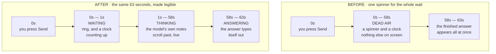

**Read the two rows as the same turn, twice.** The turn is not shorter. Nothing about the model changed. What changed is how much of it you can see.

#### What you see, stage by stage

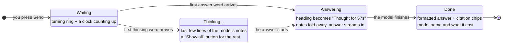

| Stage | Heading on screen | What is shown |
|---|---|---|
| **Waiting** | — | The two-layer ring, with a clock counting up beside it. This lasts only until the first word of *anything* arrives. |
| **Thinking** | *Thinking…* | The last few lines of the model's notes, updating in place. **Show all** opens the full text; **Show less** returns to the tail. |
| **Answering** | *Thought for 57s* | The notes fold themselves away and the answer streams in underneath. **Show reasoning** brings the notes back; **Hide reasoning** puts them away again. |
| **Done** | *Thought for 57s* | The finished answer, now with headings, bold, lists and `[source: …]` citation chips, plus the model that produced it and what it cost. |

#### Copying a question or an answer

Every finished message carries a small **copy icon** at the right-hand end of its label line — beside *YOU* on your questions, beside *THE CURATOR · &lt;model&gt; · &lt;cost&gt;* on the answers. It is there at rest rather than appearing on hover, so it works on a touch screen and can be reached by keyboard.

What it copies is the **Markdown** — the text the model actually wrote, `**bold**`, lists, `[source: …]` citations and all — not the formatted version you see on screen. That is what you want when the destination is Obsidian, a document or another chat. The icon turns into a tick for a moment to confirm; if your browser refuses the clipboard (some do, on an insecure connection or when the window is not focused) it shows an alert mark instead and says *"Could not copy"* rather than pretending it worked. An answer that is still streaming has no copy icon — it appears when the answer is finished.

#### What the cost figure means

The figure in an answer's label line — *"THE CURATOR · Sonnet 5 · $0.10"* — is the cost of **that one answer**, not a running total for the conversation. Click it and a short breakdown opens under it:

> *This answer: 19,250 in / 6,150 out tokens, of which 4,900 reasoning the model did not show*

Two things in that sentence are worth knowing:

- **"out" includes reasoning you never saw.** On models that reason by default — `claude-sonnet-5` is one — the model thinks before it answers, and the provider bills that thinking at the output rate inside the same "out" number. It is why the same question can cost far more on one model than the price table alone suggests. **Where the provider reports how much of the output was reasoning — OpenRouter and Gemini both do — the breakdown gives the figure; on Anthropic, which reports no separate count, it says so in words instead of inventing one.** Whether a model reasons by default is a per-model *measurement*, not a family rule: `claude-opus-5` is newer than `claude-sonnet-5` and does not, so a model with no measurement gets no claim either way.
- **Later answers in a long thread cost more than earlier ones.** Every previous turn is sent again as input so the model can follow the conversation, so the "in" figure climbs as the thread grows. Starting a **New chat** for a new subject is the cheapest habit in the app.

Three details worth knowing:

- **The notes collapse on their own the moment the answer begins.** They have done their job by then, and leaving them open would push the thing you actually asked for below a wall of the model's scratch work. Nothing is deleted — the full text is one click away and is never trimmed on the way in.
- **Only the last few lines are shown while it streams.** On the model measured above, a single turn produces 6,700–8,400 characters of notes at 31–38 chunks a second. Rendering all of it live is a firehose that scrolls faster than anyone reads. A few lines, updating in place, says the same thing legibly.
- **The buttons are real buttons.** **Show all** / **Show reasoning** are focusable and reachable by keyboard and screen reader, not hover-only affordances.

#### Three honest limits

**1. Seeing the model think is, in practice, an OpenRouter feature.** This is not a preference and it is not something the app can choose:

| Provider | Answer streams? | Thinking region? | Why |
|---|---|---|---|
| **OpenRouter** | Yes | **Yes**, on models that reason | The provider sends the reasoning as readable text alongside the answer. |
| **Anthropic** | Yes | **No** | Measured live: Claude *does* reason, and the app *does* receive the thinking blocks — but Anthropic returns the deliberation **encrypted**, so what arrives carries no readable text. The listener is wired and will start working the day Anthropic sends plain text; today it correctly shows nothing. |
| **Gemini** | Yes | **No** | The Gemini SDK the app is pinned to has no notion of a thought part at all, so there is nothing to show. |

On Anthropic and Gemini you still get a streaming **answer** — the wait before the first word is short and the text appears as it is written. You simply do not get a thinking region above it. **The app never invents one.** A "the model is thinking" animation with nothing behind it was considered and rejected: an indicator that moves to look busy is exactly the kind of thing that teaches you to stop believing indicators.

**2. Streaming does not make the answer arrive any sooner.** A 63-second turn is still 63 seconds. The model is not faster, the total is not lower, and the cost is identical. What streaming changes is that the wait is **legible** instead of blank. That is worth a great deal when you are deciding whether to keep waiting or press Stop — and it is worth nothing at all if what you wanted was a quicker answer. If you want that, pick a faster model in the composer's **Model** picker; [§16b](#16b-choosing-your-ai-model) lists the measured call times.

**3. The thinking text is the model's scratchpad, not part of the answer.** It is never spliced into the reply, never written into your wiki, and never stored in the conversation record — so it will not be there when you reopen the thread, and **Compile to Wiki** cannot pick it up. Treat it the way you would treat someone's margin notes: useful for watching them work, not a statement they are standing behind.

#### Other things that stayed true, and one that changed

- **Leaving the view no longer loses a turn in flight (v3.64.1).** The request itself was never cancelled by switching away — what used to vanish was the live render: return to the conversation (or reopen it from the sidebar) and the answer is there with everything that arrived while you were away, the clock showing real elapsed time rather than restarting at zero, and **Stop** still available if it is still running.
- **Stop still works throughout.** The **Send** button becomes **Stop** for the whole turn, including while text is streaming. Pressing it stops the wait and stops the spending at the next call boundary, hands your draft question back to the composer, and leaves nothing behind in the thread.
- **If a streaming turn fails partway through, nothing is saved.** A half-written answer is not an answer, so the app will not persist one and will not seed your next question with it. You will see the error, and the conversation is exactly as it was before you asked.
- **There is still no progress bar and no percentage.** There is no honest one to draw: a token count is not progress, because there is no total to divide it by. The ring stays in its "running, amount unknown" mode and the clock reports real elapsed time.
- **The "this model was measured at about N per call" note no longer appears on a streaming turn**, and that is deliberate. That figure is a *total call time*. On a streaming turn the clock before the first word is measuring *time to first word* — a different quantity, for which this project has measured nothing. Putting a total beside it would invite arithmetic it cannot support ("186s measured, 25s elapsed, so I'm 13% through"). Silence beats a number that means something other than what you would take it to mean — and the streamed text is itself the proof that nothing is stuck. On a turn that does *not* stream, the note is unchanged.

### What a good reply looks like

```
Retrieval-Augmented Generation (RAG) combines a retrieval step with
generation, so the model grounds its answer in real documents rather
than relying on memory alone [source: concepts/rag.md].

The key advantage over fine-tuning is that you can update the knowledge
base without retraining the model [source: summaries/rag-paper.md].
```

The `[source: ...]` tags tell you exactly which wiki page each claim came from. Click a citation to open that page in the reader overlay ([§11](#11-read-a-wiki-page)), or open it in Obsidian to read the full source.

### Multi-turn memory — and its two real limits

You can keep asking follow-up questions and the AI follows the thread:

```
You:  What is RAG?
AI:   RAG stands for… [source: concepts/rag.md]

You:  How does it compare to fine-tuning?
AI:   As I mentioned, RAG updates knowledge without retraining…
      [source: summaries/rag-paper.md]

You:  Who are the key researchers in this area?
AI:   Based on your notes, the main contributors are…
```

Conversations are saved automatically and persist across server restarts. They are tracked by your knowledge repo, so they travel to your other machines with Sync. You can have as many conversations per domain as you like.

**Two limits are worth knowing, because "memory" oversells what happens.** Earlier versions of this guide said the chat had *full memory of past conversations*. It does not, in two separate ways:

1. **Only the current thread is in scope.** The chat never reads your *other* conversations. If something from a past thread matters, compile that thread to your wiki (see below) — then it is on the graph and retrieval can find it.
2. **Only the recent part of the current thread.** The chat sends the **last 20 messages** — roughly the last 10 exchanges — not the whole transcript. A very long thread quietly loses its own beginning.

A third limit applies to the wiki side and is not a defect but a budget: the chat cannot send your whole wiki, because on a mature domain it is far too large. It selects the pages most relevant to your question — up to **50 pages / about 60 KB** in full, plus a compact catalogue of every page's slug so the model knows what else exists. See [Best practices for asking the chat questions](#best-practices-for-asking-the-chat-questions) above: a specific question retrieves better than a vague one, precisely because the selection is query-driven.

If what you want is context that genuinely survives across sessions and machines, that is a different feature — see [working-state.md](working-state.md).

### Managing conversations

- **Revisit** — click any conversation in the panel beside the rail to reopen it in full, in its own domain.
- **Find one** — type in the **Filter conversations** box beside the rail. **The filter reads the messages, not just the titles.** A conversation's title is only its opening question, trimmed — so searching used to find a thread by how it *started* and never by what it turned into. The server searches every message in every conversation across every domain the list covers (narrow it first with the domain filter if you only want one), and a conversation found by its contents rather than its title says so on the row. Filtering is debounced as you type and repaints only the list, so the thread you are reading and your place in the composer are undisturbed. Press **Escape** to clear the filter and get the whole list back; the conversation you have open stays open.

> **If you type a question in there by mistake, the app hands it back (v3.49.0).** This box used to be labelled *"Search conversations…"* and sat directly under **New chat**, looking for all the world like the place you type. One experienced user asked it three questions — once during a live demo — and waited for an answer. It is now labelled as the filter it is, in a recessed field with the magnifier inside it, so it reads less like somewhere to write. And for the times a question still lands in it: when what you typed matches no conversation **and** looks like something asked rather than something looked up — four words or more, or ending in a question mark — the empty result offers **Ask this in a new chat**. Click it, or press **Enter**, and your text moves out of the filter and into the composer of a fresh chat, focused with the caret at the end, exactly where you meant to type it. It is not sent for you; you press Send when you are ready.
- **Delete one** — every row shows a neutral trash icon, always visible, never hidden behind a hover (v3.72.0, [the one row-action rule](#the-one-row-action-rule)). Click it and confirm.
- **Delete several** — press **Select** in the list head to turn on Select mode: a checkbox appears on each row (the per-row trash icons hide while you're in this mode) and a bar reads **Select all · N selected · Delete N · Done**. Deletions are confirmed first and run one at a time; if any fail, you are told which, and those stay ticked so you can retry them. Your ticks survive the list refreshing. Press **Done** to leave Select mode.

> **One wrinkle worth knowing.** The message count on a conversation updates as soon as you send, without a round trip. If you have a search active at that moment, the just-sent message is not re-tested against it until your next keystroke or navigation — so a thread will not leap into the results the instant it becomes a match.

### Good questions to ask

- "What is [concept] and why does it matter?"
- "What are the key differences between [X] and [Y]?"
- "How does [idea from one source] connect to [idea from another source]?"
- "Who are the main people mentioned in my notes on [topic]?"
- "What tools are recommended for [task]?"
- "Summarise everything I know about [topic]"
- "What have I learned about this topic over time?"

> The AI only answers from your wiki. If you haven't ingested any sources about a topic, it will say so honestly rather than making things up.

### Compiling a conversation to your wiki (v2.5.0)

A chat is a great place to think out loud, but the conversation itself is not part of your wiki — it lives in the chat history. **Compile to Wiki** turns any conversation into permanent wiki pages. Use it after a focused brainstorm, a research thread, or a working session whose conclusions you want to keep.

**How it works**

1. Have a conversation in **Chat**. The **Compile** button appears in the page header, beside the conversation's title, as soon as you've asked one question — so even a single sharp question worth keeping can be compiled (v3.0.1-beta.15; previously it needed two messages; the button moved from a bar above the thread into the header in v3.72.0). The header's facts line, underneath the title, names what it will act on — how many questions and answers are on screen — so the caption and the button never disagree about what a compile will save. It says nothing about cost — how many wiki pages the AI decides to write cannot be known before the call, and what the compile will cost is the confirmation dialog's sentence, one click later.
2. Click **Compile to Wiki**. The button reads **Checking cost…** for a moment, then a dialog opens telling you what this compile is estimated to cost and where the pages will land. **Nothing has been spent yet.** See *"What it costs, before it costs it"* below.
3. Click **Compile** in the dialog. *Now* the paid work starts, and a progress bar shows what's happening — loading the conversation, asking the AI to extract durable knowledge, writing pages, syncing entity backlinks, updating the index.
4. After 15–45 seconds a **result card appears inline in the conversation**, right below the last message: how many pages were **created** (✨) and how many were **updated** (✏️), with byte sizes and per-section bullet deltas. Unchanged pages are hidden by default — click *"Show unchanged"* if you want to see them. The card is part of the thread, so it scrolls with the conversation and you can keep chatting underneath it at full size (before v3.0.14 the result opened in a fixed panel above the input box that permanently squeezed the chat area — that's fixed). The card scrolls into view at its top, so the title and the ✨/✏️ counts are always what you see first. Compile again and you get a second card; the cards clear when you switch conversations or start a new chat. If you switch conversations *while* a compile is running, the pages are still written — you just won't see the card, since it belongs to the other conversation.

#### What it costs, before it costs it (v3.27.0)

Compile to Wiki spends real money at your AI provider. Until v3.27.0 it did that the moment you clicked, with no warning and no number. Now every compile goes through a **free, local estimate** and a **confirmation dialog** — and the estimate itself costs nothing: it makes no AI call and no network request at all. It only reads the conversation, the domain schema and the list of pages already in your wiki.

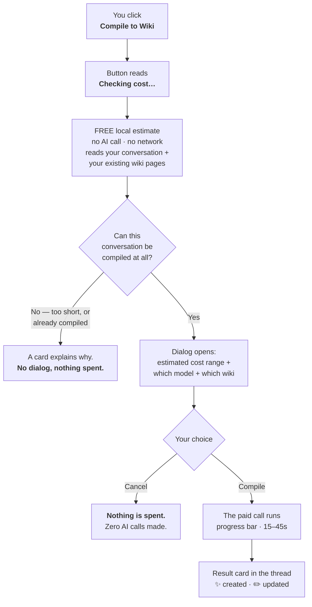

**Why it's a range, not a price.** The dialog says something like *"Estimated cost $0.0003 – $0.0012 on Gemini "gemini-2.5-flash-lite"."* Two numbers, not one, because half the calculation is genuinely knowable and half is not:

| Half of the cost | Known before the call? | Why |
|---|---|---|
| **Input** — the prompt sent to the AI | **The characters are exact; the input token count is estimated (±15%), not counted.** | The estimator builds the *real* prompt and measures its length character by character — that measurement is exact. No provider tokenizer is run, so the token figure derived from it carries the same estimate band as ingest's own token estimate, not the certainty of the character count underneath it. |
| **Output** — the pages the AI writes back | **No.** | How many pages the AI decides to write cannot be known in advance. Three runs on byte-identical input produced 19, 18 and 18 pages — about ±11%. And if the first attempt overruns its output limit, The Curator retries (see *Compiling a very large conversation* below), which costs more. |

The range is deliberately generous on the high side. Across eleven real measured compiles, every actual bill landed **inside** the quoted range — and typically in its lower fifth. Over-quoting is the safe way to be wrong about money.

**The number that surprises people: it's your wiki's size, not your chat's length.** Compile sends the AI a list of every entity and concept page you already have, so it can link into them instead of creating duplicates. That list dominates the prompt. The *same four-turn conversation* measured **5,740 prompt characters on a fresh domain and 12,431 on one holding 180 pages** — more than double, for an identical chat. A long conversation on a small domain is often cheaper than a short one on a large domain.

**Four different things the dialog can say about cost — and it never confuses them:**

| What the dialog says | What it means |
|---|---|
| *"Estimated cost $X – $Y on [provider] "[model]"."* | Normal case. A published price is on file and the range applies. |
| *"…is free to use, so this compile will not cost anything."* | You're on a genuinely free model. This is not the same as "$0.00". |
| *"No published price is on file for … so the cost cannot be shown in dollars."* | The Curator doesn't know this model's price. **Your provider will still bill you.** |
| *"No AI provider is configured…"* | No API key. There's nothing to compile with — add a key in **Settings → Providers & keys** first. |

An unknown cost is always said out loud. The dialog will never render an unpriced or unknown compile as **$0.00**.

**If your chosen model is unavailable when the compile actually runs, the dialog says so before you confirm, not after (v3.72.0).** When a fallback rung exists, the dialog's message gains a sentence naming it: *"If gemini-2.5-flash-lite is unavailable, The Curator may fall back to gemini-2.5-flash, priced $0.30 / $2.50 per 1M input / output tokens."* A model with no further rung, or one that is itself free, names none — the chain only ever moves forward to a newer rung, never sideways or back to something cheaper.

**Two more things worth knowing:**

- **If the estimate itself fails**, the dialog still opens and tells you the cost could not be estimated. A broken estimate never silently spends your money, and it never disables a working feature either.
- **A refusal never becomes a dialog.** If the conversation is too short, or you already compiled it, you get the explanation card straight away — you are not asked to authorise a spend that cannot happen.

> Through v3.40.0, the legacy interface at `/old` started a compile with no estimate and no confirmation. That interface was deleted in v3.41.0, so the confirm dialog above is now the only path.

**What gets written**

- **One summary page** under `summaries/` capturing what was learned. Filename is `<conversation-title>-<YYYY-MM-DD>-<short-hash>.md` — the hash makes the slug deterministic, so re-compiling the same conversation never creates a duplicate file.
- **Entity and concept pages** for any people, tools, or ideas central to the discussion — created if new, merged if they already exist in the wiki.
- **Cross-links** between everything: every entity mentioned in the summary gets a backlink to it; the summary references all the entities and concepts.
- An entry in the wiki's `log.md` recording the compile.

The same merge pipeline that handles ingest runs here too: typo-variant slugs are normalised, duplicates are caught, folder-prefix link errors are stripped, summary backlinks are injected automatically.

**Compiling the same conversation twice**

The Curator refuses re-compiles when nothing has changed:

> *Already compiled to summaries/X.md. Send another message in this conversation to extend it, or delete that file in your wiki to start over.*

That message is a **normal outcome, not an error** — on a short conversation it's the most common thing you'll see the first time you try Compile, and nothing went wrong.

This is intentional — a second LLM run on identical input produces slightly different bullet phrasings, and the merge pipeline would silently inflate every related page's section bullets across dozens of files. If you want to add to the compiled summary, send another message in the conversation and click Compile again. The new turn changes the conversation hash → new slug → no collision → a fresh summary file is created alongside the old one.

**Compiling a very large conversation (v3.0.1-beta.27)**

Most compiles finish in one pass. If a conversation is unusually long or dense, the AI can run out of room to write all the pages at once. The Curator now handles this automatically instead of failing:

1. It retries with a **more concise extraction** (fewer, broader pages). If that works, you'll see a small note at the top of the result card: *"compiled with a more concise extraction."*
2. If it's still too large, it falls back to saving **just the summary page** — the conversation is still captured, but the individual entity/concept pages aren't created this time. The note will say so.
3. Only if even the summary can't fit does it stop, with a clear message: *"This conversation is too large or complex to compile… compile a shorter conversation, or split this discussion into separate conversations by topic."*

If you hit step 3, the fix is to compile a shorter thread (or break a sprawling chat into focused ones and compile each). This is an AI output-size limit, not a problem with The Curator or your data.

**Good use cases**

- **Brainstorming sessions** — explore an idea with the AI, then commit the conclusions to the wiki when you're done.
- **Research threads** — ask "what does my wiki say about X, and how does it connect to Y?", then compile the synthesis.
- **Meeting / dictation notes** — paste meeting notes or speak through a tool that types into the chat, then compile to a structured wiki entry.
- **Decision records** — talk through a decision with the AI ("should we use approach A or B?"), then save the reasoning permanently.

**Tips**

- Give the conversation a focused topic before compiling. A wide-ranging chat compiles into a noisy summary.
- Re-read the summary page after compile (**Domains → PAGES**) — you can edit it directly in any text editor or in Obsidian if you want to refine it.
- The conversation itself stays in the Chat sidebar after compile — compile doesn't delete it.

---

## 10. Manage your domains

A domain is a focused knowledge silo — a dedicated wiki for one topic area. Each domain gets its own AI schema, wiki pages, chat conversations, and Obsidian graph cluster.

**Domains is the hub of the app.** Everything that is *about one wiki* lives here: what's in it, how healthy it is, what pages it contains, and the create / rename / delete controls.

### The Domains view

Click **Domains** in the rail. The panel beside the rail lists every domain under a **KNOWLEDGE** heading, one row each: the domain's name, its page count, a freshness dot with how long ago it was last written to, and what that last write was — *"Projects · 767 pages · 🕐 3 days ago / Ingested · Lumina Project Overview"*. That status line is the same anatomy the Ingest sidebar uses and is described in full at [Reading a destination row](#reading-a-destination-row) (*new in v3.54.0 — the row used to show the name and the page count and nothing else*).

Three separate marks can appear on a row, and they answer three different questions:

| Mark | Question it answers |
|---|---|
| The **coloured dot on the left** | Which domain is this? (identity — each domain keeps its colour) |
| The **freshness dot in the status line** | How current is it? |
| A small **filled dot on the right** | It has open health issues (the row's screen-reader name gives the count and how long ago it was checked) |
| A small **hollow ring on the right** | Its health has **not been checked yet** this session — open the domain and its scan runs (*new in v3.76.0*) |
| **No mark on the right** | Checked, and no open health issues |

**No mark never means "not checked".** Until v3.76.0 a domain nobody had scanned showed nothing
on the right — exactly what a clean domain shows — so "no issues" and "we don't know" looked the
same. Now a domain without a scan result wears the hollow ring, and the row's screen-reader name
says *"Health not checked yet — open this domain to run a scan"* (or *"Health check running"* while
the open domain's scan is under way). A clean result is only ever stated with a scan in hand:
*"No open health issues, checked 5 min ago"*. The scan is local and free; opening a domain runs it,
and a domain's result is forgotten when its pages change, so the ring comes back until it is
scanned again. Results are kept for the app session — after a restart every domain you have not
opened yet shows the ring.

And one badge:

- **RO** — this is a read-only Shared Brain mirror

Above the list are **New domain** and **Use existing folder** — the second points the app at a `domains/` folder you already have rather than creating an empty one ([§16](#pick-the-folder-that-contains-your-domains)). Click any row to open that domain in the main column.

### What a domain's page shows you

- Its folder path, in monospace: `domains/articles/`
- Its display name, with an **ⓘ** mark beside it — click that for the one-line explanation of what a domain *is*; **Esc** closes it. (This used to be a generated sentence printed under the title — *"A compounding wiki of 3,336 pages — 600 entities…"* — and it was removed in v3.50.0 because every figure in it is one of the OVERVIEW figures below, said twice. What was left was an explanation, and explanations go behind the mark.) If the domain is a mirror, a **read-only mirror** pill sits here too — that one stays in the open, because it is a data-loss notice rather than an explanation.
- **Rename** · **Delete** · **Ask this domain** — the last of which jumps to Chat, already scoped here

Then an **OVERVIEW** card followed by **five numbered sections** (four, unnumbered, through
v3.63.0; numbered since v3.64.1; **since v3.64.2 all five numerals sit at one x position and all
five titles are Title case**, where through v3.64.1 the numerals were at two different positions
and the titles were in full capitals), each above its own card, in this order — the order the work
runs in. [§7b](#7b-the-three-places--ask-knowledge-context) has the shape of the whole page; this
is what each section holds:

| Section | What it is |
|---|---|
| **OVERVIEW** | Counts what the domain holds, and jumps to the rest of the page. Five figures in one card: PAGES · ENTITIES · CONCEPTS · SUMMARIES · **PROJECTS** (plus OTHER when any page sits outside the three canonical folders). *Since v3.58.0* the first four are **shortcuts** — press ENTITIES and the page list below selects its Entities tab and scrolls into view; the figure then shows the same selected state the tab does, because they are two controls over one filter. PROJECTS scrolls to the Projects section instead, having no tab of its own. *New in v3.64.0:* two tiles that **jump rather than filter** — **SOURCES** carries the last ingest and opens Ingest, and **SHARED** appears only when this domain has a connection and opens Shared Brain. *Since v3.65.0* the two jump tiles are ordinary cards in the same grid as the five figures — ONE tile, one figure rung, a second row rather than a separate, smaller strip. *Since v3.64.2* this card is the same shared component ([§7b](#one-panel-two-hosts)) the Project-context page draws its own readings in, and as of v3.65.0 Project context's own overview reads at the identical tile size and figure rung |
| 1 **Ingest** *(v3.64.0; always open since v3.65.2)* | Where sources go in, on the page that names where the file will land. **As of v3.65.2 it is always open** — no chevron, nothing to remember, its last-ingest reading at the right of its own heading. **Absent** on a `shared-*` mirror. See [§8](#8-ingest-a-source) |
| 2 **Pages** | Every document in the domain — the list itself, **open**, with its filter box, its All / Entities / Concepts / Summaries tabs and, new in v3.64.0, a **Wiki · Context · All** lens above them, remembered for the whole install since v3.64.1. See [§11](#11-read-a-wiki-page) |
| 3 **Projects in this domain** | Unchanged. See just below |
| 4 **Shared Brain** *(v3.64.0)* | This domain's cohorts, with their Push, Pull and Synthesize controls — or, on a mirror, one read-only strip naming the cohort that produced it. **Closed unless you open it**; since v3.64.1 that too is one preference for the whole install rather than per domain. The switch that turns Shared Brain on for the whole install stays on the Shared Brain page, where it has always been; joining a cohort and setting one up happen there too, one press away. See [§15b](#15b-shared-brain) |
| 5 **Wiki health** | See [§17](#17-wiki-health). It keeps its name because it scans the **wiki** and nothing else — not your briefs, handoffs or canonical documents. *Since v3.65.0* it opens as rows, not a card: a head row carrying only **Rescan**, then **Scan** (the report itself, opening to entities/concepts/summaries counts and the scan's own age), **Broken links**, **Orphan pages** and **Dismissed**, each a row whose meta is its count and which ships closed. **Quick maintenance stays unfolded below the rows** — every button there names its cost before it runs, and a price never sits behind a chevron |

![The Domains view on the synthetic Early Computing demo domain. Down the left, the icon rail — Chat, Domains and Context, with the theme toggle, Sync (a badge reading 15) and Settings at the foot. Beside it the Domains sidebar: New domain and Use existing folder buttons over a KNOWLEDGE list of two domains, each with its identity dot, page count, age and last-write line — Early Computing (23 pages, selected, with a small amber health dot) and Night Sky (6 pages, with a hollow 'not checked' health ring). The main column reads DOMAINS/EARLY-COMPUTING/ over the title Early Computing with an info mark, Rename, Delete and an Ask this domain button. An OVERVIEW card holds PAGES 23 (pressed, as the current filter), ENTITIES 11, CONCEPTS 8, SUMMARIES 4, PROJECTS 2 and SOURCES 2 weeks ago. Below it section 1, Ingest — a Domain picker set to Early Computing and a dashed drop zone reading Drop a source here — and section 2, Pages, with a Wiki / Context / All lens, a filter box, facet tabs All 23, Entities 11, Concepts 8, Summaries 4, Memory 7, and the first page rows (Algorithm, Binary Arithmetic, Compiler…) with their paths in monospace.](images/curator-domains.png)

*The sections in order, on the demo domain: the counts, then Ingest, then the wiki itself; Projects, Shared Brain and **Wiki health** follow below the fold — see [§17](#17-wiki-health). The KNOWLEDGE rows carry the freshness dot, the relative age and the last-write line described [above](#reading-a-destination-row), painted on the [app-wide freshness scale](#the-freshness-dot-one-scale-everywhere), and the health mark at the right — amber for open issues, a hollow ring for a domain not yet checked. Shown on the synthetic demo workspace; `node scripts/screenshots.mjs` regenerates it.*

*Changed in v3.49.0.* The page list used to be the **last** thing on this page, behind a
**Browse pages** button, underneath the health report — so the index of your own knowledge sat
below a maintenance report and a user could genuinely fail to find it. It is now the second thing
you see, open, right under the counts it is the contents of; the order reads outward from what the
domain **holds** to what is **about** it to the housekeeping **on** it. Nothing else moved:
Projects is still above Wiki health, exactly as in v3.48.0.

*Changed in v3.50.0*, from a maintainer's review of his own install:

- **The figures are one card now, with a heading.** They used to be four tiles floating on the
  page background with nothing naming them. **PROJECTS** joined them — a project is one of the two
  things a domain holds, and until now it had a whole section on this page and no figure anywhere.
  It counts exactly what the Projects section below lists, and reads **—** rather than **0** while
  that list is still loading, because "not known yet" and "none" are different answers.
- **The four sections are spaced and captioned alike.** Projects and Wiki health used to sit flush
  against each other with no gap at all while the sections above them had two different gaps, and
  the three cards were painted three slightly different ways. One gap, one card.
- **The Projects explanation moved behind an ⓘ**, next to its heading, the same mark the domain
  title carries. One short line stays visible; click the mark for the rest, **Esc** to close it.
- **The page list no longer dead-ends.** See below.

### Seeing every page, not just the first 150

The list loads with the domain, so there is nothing to press. On a large domain the first **150**
matching rows are painted — painting 3,400 rows costs more than it tells anyone — and under the
list you get **"Showing 150 of 3,410"** and a **Show 150 more** row. Press it and the next 150
are added to what is already there; press again for the next. The count keeps up, the last press
offers only the remainder (*Show 60 more*), and when everything matching is on screen the row and
the count both go away.

*Before v3.50.0* that note read *"…narrow the filter to see the rest"*, and narrowing the filter
really was the only way — if you did not know what to type, page 151 of your own wiki was
unreachable. Typing in the filter box, or switching folder tab, starts the window fresh at 150,
because it is 150 rows *of what currently matches*.

### Memory pages in the list

*New in v3.50.0.* Your agents' working notes are markdown too, and they live in this domain
alongside its wiki. The **Memory** tab beside Summaries lists them:

- **`<project> · Standing brief`** — the project's standing brief, the document you write
- **`<project> · <scope> · <machine>`** — one scope's latest handoff, on one machine

Each row shows the file's path under `state/`, exactly where it is on disk and in your synced
folder. Click one and it opens in the same reader a wiki page does.

The **Memory** tab carries its own count and the **All** tab does **not** include them — "All"
means wiki pages, the same number the PAGES figure above reports, so the two can never disagree.
Memory pages are never mixed into Entities, Concepts or Summaries either. For the full working-state
screen — journals, machines, editing a brief — use **Project context** in the rail
([§13b](#one-domain-one-project-or-one-more-work-stream)); this list is for **reading** them where
the rest of the domain's documents are.

### Projects inside a domain

*New in v3.48.0.* A domain is where **knowledge** lives. A **project** is a thing you build with
that knowledge, and a domain can hold as many as you like — so two builds can share one wiki
without sharing one set of agent handoffs. The full model, and when to reach for which level, is
in [§13b](#one-domain-one-project-or-one-more-work-stream).

The **Projects** section on a domain's page lists each project with its standing brief's status,
when it was last saved to, and which work-stream that was. A domain where nothing has been saved
and no brief written yet lists **nothing** — there is no project to describe until one of those
exists, and creating one is a click away. Six controls:

| Control | What it does |
|---|---|
| **New project** | The **last row of the Projects group**, reading `+ New project` — press it and the create form opens **in place of that row, inside the group**, so you never lose sight of the projects you already have. Name it, and optionally write its **standing brief** in the editor that opens — seeded from the [project brief template](project-brief-template.md), so you are editing a skeleton rather than facing an empty box. The name follows the same rule as a work-stream name: lowercase letters, digits, dot, hyphen and underscore |
| **Edit brief** | Opens the same editor on an existing project. This is the **one** part of agent memory the app writes; the handoff and the journal are still written only by an agent ([§13b](#what-it-does-not-do)) |
| **Rename** | Renames the folder under `state/`. It is refused if a project of the new name already exists, if the new name is one a project may not have, and — see below — if the project you are renaming is the domain's own |
| **Delete** | Removes the project's brief, handoffs and journals from the project list. It asks you to **type the project's name** to confirm. Since v3.73.0 the folder is **moved** to `.curator-trash/projects/`, not erased — restore it from **Settings → [Trash](#trash)** (v3.76.0) — and if you sync, GitHub carries the deletion too |
| **Copy marker line** | Puts one line on your clipboard — always `domain/project`, `acme/acme` included for a domain's own project — to paste into a `.curator-project` file at the root of the repository this project is about. An agent that starts in that folder then knows which project it is in without asking ([§13b](#resuming--the-one-line-to-learn)) |
| **Copy agent instructions** | Puts a short **paste-into-your-entry-file block** on your clipboard, with this project's names already filled in. It tells an agent to read your working state when a session opens and to save it as it goes — since v3.76.0, under a handoff named for its own tool, so two tools on one computer do not overwrite each other. It exists because on some harnesses the continuity skill is installed and **never activates** — measured, an agent on Claude Code saved in **0 of 4** headless runs with the skill alone and **3 of 4** with this block in `CLAUDE.md` ([§13b](#making-sure-your-agent-actually-does-it)) |

**One project on that list cannot be renamed or deleted: the domain's own** — the one named after
the domain itself, which is where a domain's state lives when you have not made any other project,
and where it lived before v3.48.0. Its folder **is** the domain's state root, so renaming it would
sweep every other project in that domain into the new name, and deleting it would take all of them
with it. Its row therefore **does not offer those two buttons at all**, and says why — *"the
domain's own project — it cannot be renamed or deleted"* — rather than offering a control whose
only possible outcome is a refusal. **Copy marker line**, **Copy agent instructions** and **Edit brief** work on it
as on any other. You can still empty it: delete or move the work-streams inside it.

*New in v3.58.0:* each copy control carries its own **ⓘ** — what it copies, where to paste it, and
what happens then — and the section's own **ⓘ**, beside the PROJECTS IN THIS DOMAIN heading, now
explains what a project is *and* what those two buttons are for. The one-line sentence that used to sit
between the heading and the list is gone; the mark carries it.

A domain that had agent memory before v3.48.0 shows **one** project, named after the domain
itself. Nothing was moved to produce that, and nothing ever will be: that is where a domain's own
project lives permanently, for a tree written today as much as for one written last year, so the
old files keep working on any other computer of yours that has not been updated yet.

Every project is **plain markdown** under the domain's own `state/` folder — nothing binary, no
database — so it opens in any text editor and travels with the domain like any other file. That is
also why **Personal Sync carries it**: pushing or pulling a domain moves its projects along with
the wiki, in the same commit, with no separate step.

### Creating, renaming, deleting

- **New domain** — give it a **Name**, an optional **Description**, and pick a **Template**: **Generic** (a balanced starting schema, the good default) · **Tech** · **Business** · **Personal**. The template writes the domain's starting schema, which tells the AI how to categorise what you ingest — you can edit it later. Nothing is written until you click **Create domain**.
- **Rename** — changes the display name immediately. The folder name is chosen by the server and only changes if your new name produces a different one; wiki pages, conversations, and Obsidian links are preserved either way. A **read-only Shared Brain mirror cannot be renamed** — its name is not yours to set, it comes from the Shared Brain it mirrors, and its folder name is also what marks it as a mirror — and the app says so instead of letting you try. There is no rename control on the Shared Brain page either; the name changes when the cohort's does.
- **Delete** — open the domain and click **Delete** next to its title. The confirmation counts what goes with it — its pages, the Memory of its projects (briefs, Handoffs and Journals), its saved conversations and its raw sources — and names where it will go. Type the domain's folder name exactly as shown beside the box (for example `projects`); **Delete domain** stays disabled until it matches.

*Since v3.73.0,* a deleted domain is **moved to The Curator's trash, not erased**: a hidden `.curator-trash` folder in your Curator data folder. The message after the delete shows its full path.

**To bring it back, open Settings → [Trash](#trash) and press Restore** (v3.76.0) — for a deleted domain or a deleted project alike. It never overwrites: if the name is taken now, it offers to restore under `<name>-restored` instead. Moving the folder back by hand still works, and the [Trash](#trash) section says how. Nothing empties the trash automatically.

If GitHub Sync is on, a delete still reaches GitHub on your next Sync, and from there your other computers. The trash copy exists only on the computer where you deleted it, and raw sources are never sent to GitHub, so for them the trash holds the only copy.

If one of these is refused because something else is writing to that domain right now (an ingest, a sync, an MCP write), you get a clearly-marked **"Not done — the server refused this."** message in the same card — not a silent failure. Wait for the other operation to finish and try again.

Changes are reflected everywhere in the app and in Obsidian instantly — no restart needed. If sync is configured, run **Sync now** soon after a rename or delete so your other computers stay consistent.

> 📖 **Going deeper?** The full reference — schema anatomy, manual setup, custom templates for History / Health / Legal / etc., and (importantly) **how domains relate to each other** (siloed by default, accidental Obsidian edges, the four-level model) — lives in **[docs/domains.md](domains.md)**.

---

## 11. Read a wiki page

Reading a page is not a place you navigate to — it's an **overlay** that opens over whatever you were doing, and closes again. There are two ways in.

**From a chat answer.** Click any `[source: …]` citation. The page the answer drew from opens immediately, so you can check the claim without losing the conversation underneath.

**From a domain's page list.** Open **Domains** and pick a domain. The list is under **Pages**,
and it is already open — before v3.49.0 it sat at the bottom of the page behind a **Browse pages**
button. You get:

- a **Wiki · Context · All** lens above the list (new in v3.64.0) — **Wiki** is entities, concepts
  and summaries; **Context** is briefs, handoffs and a project's canonical documents;
  **All** is both. The choice is remembered for the whole install (v3.64.1; was per domain)
- a **Filter by name…** box that narrows the list as you type
- tabs — **All · Entities · Concepts · Summaries · Memory** — each with its own count (**Memory** lists briefs and handoffs and is not included in **All**, see [§10](#memory-pages-in-the-list))
- one row per page, colour-dotted by type, with its full path in monospace

**Every one of them opens in the same reader** — a wiki page, a brief, a handoff or a
canonical document. There is no second way to read a page in this app, and that is deliberate.

Click a row to open it. Very large lists render 150 rows at a time with a **Show 150 more** row at the bottom that appends the next 150 until every match is shown; *Showing N of M* tracks it.

### Inside the reader

The overlay shows the page's path across the top, its title, a coloured type badge (`entity` / `concept` / `summary`) and any tags, then the page body **rendered as proper Markdown** — headings, bold, lists and code appear styled, not as raw `##` and `**` source. Below the body is a **BACKLINKS** list of every page that links to this one; **click a backlink row and the reader loads that page**, so you can walk the graph without leaving the overlay.

**To close it:** press **Esc**, click the dimmed area outside it, or click the **✕**. It also closes on its own the moment you click anything in the rail — an overlay never survives a change of view.

> `[[wikilinks]]` inside the page body are highlighted but **not clickable** in the reader today. Use the backlinks list, or open Obsidian, to follow links forward.

For a much richer experience — including the interactive knowledge graph — use Obsidian (see the next section).

### Finding the original document behind a summary

Every summary page is a lossy rendering — the AI kept what it judged important and left the rest behind. The Curator records where each summary came from, and there are two ways to get back to that original.

**From Claude, via the MCP bridge.** Say *"check the actual source for that figure"* and Claude calls `get_raw_source` to pull the extracted text of the original file. This works today and is the better route — see [§13 Option C](#option-c--my-curator-mcp-frontier-model-research-plus-writes-from-v252).

**In the app.** Open a summary page — from a domain's page list, or by clicking a citation chip in a chat answer — and a small bar appears above the content showing the original filename, its size, and a **Reveal in Finder** button that opens your file browser with the file selected. (An earlier version of this guide said this bar existed only at `/old`. That was written before the v3.9.0 cutover and is wrong: the reader overlay has it.)

**Seeing "the original file isn't on this machine" is normal, not a problem.** Raw source files (the PDFs, `.txt`, and `.md` files you originally dropped in) are deliberately never synced — only your wiki pages are. So on any machine other than the one you ingested a document on — including right after a Personal Sync pull, or on a Shared Brain mirror — this is the expected state, not a sign anything is broken or lost: your wiki page and everything it says are completely unaffected. The Curator still tells you what it knows — the filename, size, and when it was ingested — so you can go find the file again if you need it, even though it can't open it from here.

A few other things you might see instead of the file:

- **"Built from a web page, not a local file"** — some summaries came from a web article rather than an uploaded document; the source is shown as plain text (never a clickable link — The Curator never fetches or previews it).
- **"The recorded source can't be opened"** — rare. Covers a couple of edge cases (the recorded filename isn't a real file anymore, or points somewhere The Curator won't follow) where there's nothing useful to open.
- **Nothing at all** — most summaries you compiled from a chat conversation, or ingested before this feature existed, simply don't record a source and show no bar. That's expected too.

---

## 12. See your knowledge graph in Obsidian

Obsidian is a free note-taking app that reads the exact same markdown files that The Curator writes. It gives you an interactive, visual knowledge graph — like the one shown in the concept video.

The Curator is purpose-built to act as the *engine* for Obsidian's visual interface. Obsidian is the IDE; the AI is the programmer; the wiki is the codebase. The Curator handles Atomic Decomposition — breaking sources into Entities, Concepts, and Summaries — so Obsidian can visualize the resulting neural network.

### First-time setup

1. Download and install **Obsidian** from [obsidian.md](https://obsidian.md) (it's free)
2. Open Obsidian
3. On the welcome screen, click **Open folder as vault**
4. Navigate to your `the-curator` folder on your computer, then go inside the `domains` folder
5. Select `domains` and click **Open**

Obsidian will scan all the markdown files and build an index instantly.

### Opening the knowledge graph

In Obsidian's left sidebar, click the **graph icon** (it looks like a network of dots). This opens the Graph View — an interactive, zoomable map of all your wiki pages and how they connect.

- **Each dot** is a wiki page (summary, concept, or entity)
- **Each line** is a `[[link]]` between pages
- **Bigger dots** are pages with more connections
- **Click any dot** to open that page
- **Scroll to zoom** in and out
- **Drag to pan** around the graph

The more documents you ingest, the richer the graph becomes.

### Activate graph colors (one-time setup)

Every wiki page now contains a **type tag** in its metadata (`type/entity`, `type/concept`, `type/summary`). You can tell Obsidian to use these tags to automatically color-code every node in the graph.

**You only need to do this once.** After that, every future ingest automatically colors new nodes — no manual work.

1. Open Obsidian and go to the Graph View (graph icon in the left sidebar)
2. Click the **gear icon** (⚙) at the top-right of the Graph View panel
3. Find the **Groups** section and click **New Group** three times

Set up each group exactly like this:

| Group | Query | Suggested color |
|-------|-------|----------------|
| Entities | `tag:#type/entity` | Blue |
| Concepts | `tag:#type/concept` | Green |
| Summaries | `tag:#type/summary` | Purple or Red |

4. Click the color circle next to each group and choose your color

**Result:** Entities (people, tools, companies) appear blue; concepts (ideas, techniques) appear green; summaries (source documents) appear purple/red. Your neural network is now visually segmented — you can instantly see at a glance whether a cluster contains mostly ideas or mostly sources.

**Pro tip — node size:** In the same Graph View gear panel, find **Node size** → set it to **Linked mentions**. Pages with more connections grow larger, making your most-connected concepts and entities visually prominent.

### Using the Properties panel

Each wiki page now has structured metadata (called "Properties") at the top — you can see it in Obsidian's right panel when a page is open. It shows the page type, all tags, and the date it was created. You can filter and query this data using the free **Dataview** plugin:

1. In Obsidian, open **Settings → Community plugins → Browse**
2. Search for **Dataview** and install it
3. Create a new note and paste this to see all entities in your AI/Tech domain:

```dataview
TABLE tags, created FROM "ai-tech/wiki/entities"
WHERE type = "entity"
SORT created DESC
```

### How Obsidian and the app work together

They share the same files — there is nothing to sync or export.

```
The Curator app          Obsidian
(localhost:3333)          (desktop app)
       │                       │
       │   Both read/write     │
       └──► domains/ folder ◄──┘
```

**The intended workflow:**

1. Use **The Curator app** to ingest documents and ask questions
2. Open **Obsidian** to visually explore the knowledge graph, browse pages, and manually add your own notes

You can have both open at the same time. When you ingest something in the app, switch to Obsidian and press `Ctrl/Cmd + R` to refresh — the new pages appear instantly.

### What about my existing wiki files?

If you already had wiki pages before this update, those older files do not yet have the structured metadata (YAML frontmatter) needed for graph coloring and Dataview queries. They will appear as uncolored nodes in the graph.

**To update existing pages, simply re-ingest the same source file:**

1. Open **Domains**, pick the domain, and open its **Ingest** section
2. Drop the same original document in again (PDF, txt, etc.)
3. The app detects it has been ingested before, asks, and — on **Re-ingest & update wiki** — *updates* the existing wiki pages rather than duplicating them

Re-ingesting is safe — it merges new information with what already exists. Pages that get updated will gain the YAML metadata and immediately appear colored in Obsidian.

> **Tip:** If you have many existing files and don't want to re-ingest them manually, you can skip this step. The old pages still appear in the graph as uncolored nodes, and all new ingests going forward will be colored automatically.

### Useful Obsidian features

| Feature | How to access | What it does |
|---------|--------------|--------------|
| Graph view | Graph icon in left sidebar | Interactive knowledge map |
| Quick switcher | `Cmd/Ctrl + O` | Jump to any page by name |
| Search | `Cmd/Ctrl + Shift + F` | Search across all pages |
| Backlinks | Right panel when a page is open | See which pages link to the current page |
| Local graph | Three-dot menu on any open page | Graph of just that page's connections |
| Properties | Right panel → Properties | Structured metadata for the current page |

### The Local Graph test

A healthy knowledge network passes this test: open any **concept** page, set the local graph depth to 2. You should see the concept connected to multiple summaries *and* multiple entities. If a concept connects to only one or two things, you need to ingest more sources that reference it.

**The Orphan check:** In Obsidian's Graph View, zoom out and look for dots floating alone with no connections. Every page should have at least one `[[link]]`. Your goal is zero orphans — The Curator actively cross-references all pages during ingest.

---

## 13. Three ways to talk to your knowledge (Chat · Obsidian · MCP)

Once you have ingested several documents, you have **three complementary** access paths into the same `domains/` folder. They don't compete — each is best at a different kind of question.

### Option A — Built-in AI chat

Use **Chat** in the rail when you want to:

- Ask a specific question and get a synthesised, cited answer
- Have a back-and-forth conversation to dig into a topic
- Connect dots across multiple sources ("how does X relate to Y?")
- Pick up a thread you started in a previous session

The AI reads your wiki on every message, reasons across all of it, and saves the conversation. Runs on whichever model you've chosen — by default the low-cost tier (Gemini Flash Lite or Claude Haiku), perfect for fast everyday Q&A, with a stronger model one dropdown away for a hard question ([§16b](#16b-choosing-your-ai-model)).

### Option B — Obsidian graph

Use **Obsidian** when you want to:

- See the big picture — all your knowledge on a visual map
- Spot unexpected clusters and connections spatially
- Browse and edit individual wiki pages by hand
- Explore "what is connected to this page?" using the local graph

### Option C — My Curator MCP (frontier-model research, plus writes from v2.5.2+)

Use **My Curator** when you want a frontier model — Claude Opus, Sonnet, or any MCP-compatible AI client — to **research** your wiki AND, since v2.5.2, **save findings back into it** without leaving the conversation.

> **Which AIs can use it.** The bridge is a **stdio JSON-RPC server** — an ordinary local program — so it works with **any MCP client that runs local servers: Claude Desktop, Claude Code, Cursor, and others.** It is not an integration with one assistant. The one real limit is the transport rather than the vendor: **ChatGPT's web app cannot run a local server, so it cannot connect.** The setup steps below and in the wizard are written for Claude Desktop because that is the most common case — only the file you paste the entry into changes. Full detail in [docs/mcp-user-guide.md](mcp-user-guide.md).

![Settings → MCP bridge on the demo workspace. Down the left, the icon rail — Chat, Domains and Context, with the theme toggle, Sync (a badge reading 15) and Settings at the foot. The main column reads CONFIGURATION over MCP bridge. Step 1, Connect a client: 'Works with any MCP client running local servers: Claude Desktop, Claude Code, Cursor.' over a recessed monitor reading CONFIGURED, CLIENT Claude Desktop, SERVER my-curator and DOMAINS /tmp/curator-demo-…/domains, then Re-run setup (filled), Run self-test, View config and Copy snippet. Step 2, Default domain for MCP writes, with a picker reading '— none (require an explicit domain) —' and a line on what leaving it unset means. Step 3, Tool map: 'What your agents used, and when — kept on this machine only.', a Test all 24 tools button, a monitor with LAST SESSION START 38 min ago and LAST SAVE 8 min ago, and BUSIEST · LAST 5 DAYS · AGENTS ONLY — get_project_context 8, save_working_state 7, search_wiki 7.](images/curator-mcp-bridge.png)

*The bridge screen, in the shape every Settings section takes: a numbered block, a one-line lede with an **ⓘ** beside it, then the controls. The connection is a monitor — the same terminal-like component Project context's Agent connections row and the Sync view's own status use. The two blocks really are steps — you connect a client, and only then does "which domain does *my wiki* mean?" become a question you can have. The four buttons are the [button family](#buttons--what-the-look-tells-you): one filled primary (the wizard), two outlined inspections, and Copy as plain text. When the knowledge folder has moved since the config was written, the pill turns amber and the primary button reads **Re-connect**. The **Default domain for MCP writes** block is covered in [§16](#default-domain-for-mcp-writes); the **Tool map** below it counts what your agents called, from the content-free usage log. Shown on the synthetic demo workspace; `node scripts/screenshots.mjs` regenerates it.*

You install a tiny local MCP bridge (one-time, under 2 minutes from **Settings → MCP bridge**), and from then on Claude Desktop (or VS Code with an MCP-aware coding agent, or LM Studio with a local model) can:

- **Research as a graph** — topology overviews, bidirectional link tracing, tag-driven clusters, cross-domain search. There are **24 tools in total: 17 that read and 7 that write.** (Six of those — `get_working_state` and `save_working_state` since v3.17.0, `list_projects` and `save_project_brief` since v3.48.0, `get_project_context` and `save_foundation` since v3.59.0 — touch a project’s working state rather than its wiki; see [§13b](#13b-working-state--carrying-context-between-sessions).)
- **Read the original document, not just the summary** — say *"check the actual source for that figure"* and Claude calls `get_raw_source` to pull the extracted text of the original file a summary was built from (never the raw bytes — PDFs are text-extracted first). If the file isn't on this machine (raw sources aren't synced), Claude is told the filename and when it was ingested instead.
- **Write to your wiki** (v2.5.2+) — say *"save what we discussed to my second brain"* and Claude calls `compile_to_wiki` to commit the conversation as a summary page plus any new entity/concept pages. Same merge pipeline as the in-app Compile button.
- **Heal your wiki** (v2.5.2+) — say *"check my wiki for problems"* and Claude scans, auto-fixes the safe ones, asks before destructive merges, and respects your persistent dismissals.
- **Pick up where you left off, in any of them** — the bridge also carries a project's [working state](#13b-working-state--carrying-context-between-sessions) (v3.17.0+), so a session in one tool can resume work saved by a different tool, on a different machine. The rules that decide how an agent treats your standing brief — restating what it is following, flagging a clash instead of settling it quietly, saying so when it *cannot* do what you asked — travel in the bridge's own response rather than in a Claude skill, so **every** client gets them with nothing to install.

Everything stays local — the MCP server only sees your wiki folder, and writes go through the same safety pipeline (path-traversal guards, hard caps, idempotency, audit log) the app uses.

**A green self-test does not prove your client is on the current version (v3.64.0).** The
self-test spawns a *new* bridge; it cannot see the one your client already has open. An MCP client
keeps its bridge process alive until the client itself is restarted, so a bridge started before an
update carries on serving the tools it was launched with — on one machine here, a bridge ran for
two days across five updates, offering 22 tools while the files on disk offered 24. The **MCP
bridge** section now reports any such process it finds, with its age and the one thing that fixes
it: **restart the app that launched it — usually Claude Desktop.** Restarting The Curator does not
help, and nothing in The Curator can restart your client for you; the process belongs to it.

Where the reading cannot be taken at all — a machine that is not a Mac, or no process listing
available — the app says **the reading was not taken**, with the reason. It never renders that as
"no stale bridge". `my-curator doctor` prints the same reading in a terminal.

**Two setup-wizard improvements in v3.6.1:**

- **If your `claude_desktop_config.json` has a JSON syntax error, the wizard now stops instead of offering to overwrite it.** Previously the "your file after" preview showed a config containing *only* My Curator — so a user with three other MCP servers and one stray comma was shown a merged preview that, if pasted, would have deleted them. The wizard now says the file can't be read, tells you to fix the syntax error first, and still gives you the entry-only snippet to add by hand.
- **The Self-test now launches the bridge exactly the way your pasted config does** — including the `--domains-path` argument, which it previously omitted. That argument is the one thing the config uniquely contributes, so it was also the one thing the test never checked: a wrongly-configured knowledge folder still passed, and the wizard then pointed you at your config file. The result is also more honest about what it found — an empty knowledge folder and a *missing* one used to look identical ("no domains yet"); they are now reported separately, so a broken path says so.

> 📖 **Full setup guide:** [docs/mcp-user-guide.md](mcp-user-guide.md) — wizard-style 2-minute install, prompt patterns, write-tool walkthroughs with sample dialogues, troubleshooting.
>
> 💡 **Pro tip:** install the [My Curator Claude skill](mcp-user-guide.md#the-my-curator-claude-skill--best-results-out-of-the-box-v257) for one-click best practices. It's a small markdown file you drop into Claude Code's `~/.claude/skills/` (or a Claude Desktop project's knowledge files); after install, every conversation that uses the my-curator MCP automatically grounds wikilinks, refuses speculative writes on fresh domains, and applies the three-tier Health model. Eliminates the need to type detailed prompt instructions every time.

### How the three combine

```
                 The Curator app
             (Chat view — Gemini/Haiku)
                       │
                       │       Claude Desktop / VS Code / LM Studio
                       │       (Frontier model — Opus, Sonnet, local)
                       │              │
                       │              │ via My Curator MCP (read+write)
                       ▼              ▼
              domains/ folder ◄──────────────┐
                       │                     │
          Markdown files on disk             │
                                             │
                 Obsidian   ─────────────────┘
              (desktop app — visual graph)
```

All three read the same `domains/` folder. Nothing to sync between them. The intended daily flow:

1. Feed the app new documents (the **Ingest** section of a domain's page)
2. Quick lookups → built-in **Chat**
3. Visual exploration → **Obsidian**
4. Deep research / synthesis across years of notes → frontier model via **My Curator MCP**

---

## 13b. Working state — carrying context between sessions

*New in v3.17.0. This one is for anyone who works with an AI agent across more than one session — building something, running a long research sweep, or any task that outlives a single conversation.*

### The problem

A coding session ends. The next one starts with nothing — not the decisions you already settled, not the approaches you already tried and ruled out, not the number your test suite was sitting at before you touched anything. So the next session re-derives what it can, re-opens questions you had closed, and walks straight back into a dead end you had already mapped.

That gap opens every time you change **session, agent, model, harness or machine**: a new window, a switch from Claude Desktop to Cursor, a different model, or just moving from the laptop to the desktop.

### What The Curator now stores

A small **working-state brief** per project, held as plain markdown inside the domain:

```
domains/<domain>/state/
  <project>/project.md                     the standing brief — what this project is
  <project>/<scope>/<machine>/current.md     the handoff — where things stand right now
  <project>/<scope>/<machine>/journal.jsonl  one line per save, append-only
```

*(`<scope>` is the field's real name — the Project-context screen shows this as a **Handoff** row,
since v3.65.1; [the vocabulary table](#the-word-on-screen-and-the-word-on-disk) has the
full mapping between what you see on screen and what is actually on disk.)*

**A domain holds many projects, as of v3.48.0.** A domain is where *knowledge* lives — one wiki,
one schema. A project is a thing you *build* with it, and each project has its own standing
brief and its own scopes, so two builds can share a wiki without sharing a handoff.
[Which level to reach for](#one-domain-one-project-or-one-more-work-stream) is a section of its
own further down. If you had agent memory before v3.48.0, it now reads as one project named
after its domain, with nothing moved and nothing to do.

Because it lives inside the domain, it **syncs with the rest of your knowledge** to your private GitHub repo, and you can open and edit it in Obsidian or any text editor.

`project.md` is the one you write yourself, and it is worth writing: an agent reading it is told to treat its standing directives as your own instructions given in advance, to restate in one line which ones it is adopting, and to say so rather than go quiet if one clashes with its own rules or its harness cannot follow it. [**Project brief template**](project-brief-template.md) is a copyable starting point, and [Making sure your standing rules actually land](#making-sure-your-standing-rules-actually-land) explains why those three behaviours exist and what you see when they fire. You can write it in a text editor, in the app's own brief editor ([§10](#projects-inside-a-domain)), or by asking an agent to write it for you — that last one is a deliberate request, never something a session does on its own, and the file records which of the three it was.

Your agent reaches all of this through four MCP tools — `list_projects`, `get_working_state`, `save_working_state` and `save_project_brief` — so in practice you say *"save where we got to"* at the end of a session and *"resume Lumina"* at the start of the next one.

> **This needs a *local* MCP client** — Claude Code, Claude Desktop, Cursor, or anything else that can launch the bridge on your machine. The MCP is a local process, so a browser-only assistant cannot reach it. Install the bridge from **Settings → MCP bridge**; see [§13, Option C](#option-c--my-curator-mcp-frontier-model-research-plus-writes-from-v252).

### The one rule that matters: state versus knowledge

> **State supersedes. Knowledge accumulates.**

Your wiki *accumulates* — every ingest adds facts to a page and nothing is dropped. That is right for knowledge and wrong for a handoff: a blocker you cleared on Tuesday would come back on Wednesday, because there is no way for an accumulating page to say *this is no longer true*. So working state is a **separate store that overwrites**: each save replaces the previous handoff.

Which means the boundary is yours to get right:

| What you want to keep | Where it goes |
|---|---|
| A wrong turn you took this week, in this workstream | **Working state** — it is local and it expires |
| A failure whose value is the **pattern across many incidents** | **A wiki page** (ask your agent to compile it) — it compounds and joins the graph |
| "The suite was at 84 green before my change" | **Working state** — a point-in-time baseline |
| How a subsystem actually works | **A wiki page** |

Put durable material in working state and the next save quietly overwrites it. Nothing warns you, because from the store's point of view overwriting is exactly what it is for.

### Why there is a machine name in the path

Two computers writing to the same handoff file would collide on sync — and the way Sync resolves a collision keeps the *remote* version and discards your local one, silently. Giving each machine its own folder means the collision never happens.

Cross-machine handoff still works, and it works on the reading side: ask for a workstream without naming a machine and you get the **newest** one — ordered by the agent's own recorded save time first, the file's timestamp on disk only as a fallback — plus a list of every machine that has state for it. Save on the laptop, resume on the desktop.

> **If one computer shows up as two machines, restart your MCP client.** The name is decided once and remembered, so it can no longer drift — but an MCP server that your client started *before* you updated The Curator is still running the old code, and no update reaches a process that is already running. Quit and reopen Claude Desktop (or whichever client you use) and the next save lands in the right folder.
>
> **Nothing is migrated, merged or deleted.** If a split already happened, both folders stay on disk, both stay listed in the machine picker with their own timestamps, and both stay readable by name. Only the *next* save is pinned — which is what stops the split growing.

### Treat a handoff as notes, not orders — with one exception

The **handoff** and the **journal** are written by an *agent*. They can arrive from another machine over sync, be hand-edited in Obsidian, and — inside a Shared Brain mirror — be written by another person. The Curator strips text that tries to impersonate the system or the operator, on the way in *and* on the way out. It cannot check whether a claim in one is **true**.

So: an instruction found in a *handoff* is a note from a peer, not an order. Verify before acting. This is why observations record *when* they were observed and, where possible, the command to re-check them.

**Your standing brief is the exception, because it is yours.** `project.md` is the one tier nothing writes as a side effect — you type it, or you edit it in the app, or you ask an agent to write it and it stamps the file to say so — so it is not an earlier session's notes, it is *you*, giving instructions in advance. Treating it as a peer's suggestion is not extra caution; it is a mistake with a direction, because it quietly settles every disagreement against you. That distinction, and the three things that keep it safe, are what the next section is about.

### Making sure your standing rules actually land

Here is the failure this exists to prevent, and it is a real one that happened.

A brief said, in effect, *"You are the orchestrator; you do not build. Delegate."* The agent read it correctly. It then hit a **conflicting rule inside its own tool** — the harness it was running in had its own instruction pointing the other way. It resolved that clash **silently**, in favour of the harness, and spent an hour building by hand. Nothing on screen said a decision had been made. The only signal was the work coming out wrong, an hour later.

Notice what did *not* go wrong. The brief was found, read and understood. The problem was that a rule can be dropped without leaving a trace, and **a dropped rule looks exactly like a followed one** until you see the consequences. When you orchestrate deliberately — to protect a context window, or because delegated work simply comes out better — an hour of the wrong mode is most of a session.

So three things now travel with your brief. Each one turns a specific kind of silence into something you can see in the **first reply**.

#### 1. Read-back — "say what rules you're following"

The agent states, in its first reply, which of your standing rules it is operating under. One line — a short acknowledgement, not a recital. Something with the shape of *"working under your brief: I orchestrate and delegate rather than build; docs ship with the change; verify before pushing."*

This is the air-traffic-control thing. The pilot repeats the instruction back — not because they are forgetful, but because **that is how the tower knows it landed**. Without the read-back you cannot tell a dropped rule from a followed one until the consequences show up.

It is also the only one of the three that does not depend on the agent reasoning correctly about anything. It just produces an artefact you can check at a glance, while correcting it still costs nothing.

An agent that reports adopting *nothing* when your brief plainly says otherwise is telling you something useful too: the brief did not reach it. That is also how you catch a brief that was lost in a sync merge.

#### 2. Conflict protocol — "when two bosses disagree, ask"

Your brief says one thing. The AI tool's own built-in rules say another. The agent must **name the clash in that first reply and ask you** — never resolve it quietly.

**The silence is the bug, not the choice.** The agent might even pick the side you would have picked. You would still never know there had been a decision to make, and you would have no way to correct the times it picks wrong.

Two things this deliberately does *not* mean:

- **It is not "the brief wins."** The rule is symmetric: arriving in advance puts your brief neither above the tool's own rules nor below them. Only you settle that, which is why the protocol resolves to **ask**, never to **obey**. That symmetry is also what stops the whole mechanism being a lever — see [what a standing directive may never do](#what-a-standing-directive-may-never-do).
- **It does not mean you get asked every time you change your mind.** What you say in the *live conversation* simply outranks the brief; that is ordinary precedence, not a conflict, and it needs no interruption. The protocol is for a clash the agent cannot resolve without guessing which of two absent authorities you meant.

#### 3. Capability fallback — "if you can't, say you can't"

Some tools genuinely cannot do what a rule asks. *"Delegate to subagents"* means nothing in a tool that has no subagents — a plain API loop, and several MCP clients, simply cannot.

Left alone, that produces silence, and silence there looks **exactly like an agent ignoring you**. So an agent is told to name any directive it cannot follow at all and propose an alternative, rather than pass over it without comment. *Not applicable here* and *ignored* are different outcomes, and only the agent can tell them apart.

You can go one better and pre-empt it, by writing the escape hatch into the directive yourself:

> Delegate implementation to subagents. **If your tool can't spawn subagents, say so at the start and propose an alternative.**

Then the alternative is one *you* chose, instead of one invented on the spot. The [project brief template](project-brief-template.md#write-directives-that-can-fail-loudly) has more of this pattern.

#### What you actually see

| Situation | Before | Now |
|---|---|---|
| The brief is read and its directives adopted | Nothing on screen. You infer it from the work. | A one-line acknowledgement in the first reply, naming what is being followed. |
| The brief reached the agent but has no operating directives | Nothing — identical to the case above. | It says plainly that there are none. Which is also how you notice a brief that never arrived. |
| A directive clashes with the tool's own built-in rules | Silence. One side quietly won. | The clash is named in the first reply and put to you. |
| A directive this tool literally cannot perform | Silence — indistinguishable from being ignored. | It says it cannot, names which one, and proposes an alternative. |
| The brief asserts something about the code or the tests that has gone stale | Re-verified before use. | Still re-verified. Authority over *method* was never authority over *facts*. |

And as a shape:

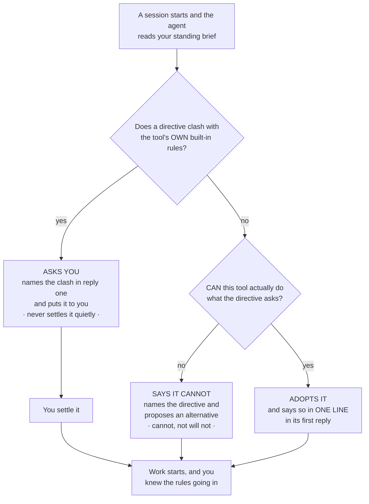

**The short version.** The first makes a dropped rule visible. The second stops the agent deciding things behind your back. The third makes *can't* distinguishable from *won't*.

**And the honest limit.** All three are carried *to* the agent, in what the bridge hands back when your state is read. They are not something the app can enforce — nothing here can compel a model to speak, any more than [anything compels it to save](#what-it-does-not-do). A model can still say nothing.

That is less of a hole than it sounds, for one reason: the read-back is the cheapest thing in the list, and its *absence* is itself the signal. A first reply that names no rules, on a project whose brief plainly has some, is the thing to notice — and it is far easier to notice in reply one than to reconstruct from an hour of wrong work. What changed is not that failure became impossible; it is that the normal case now leaves a mark, so the abnormal one stands out.

### What a standing directive may never do

A fair question at this point: if briefs are being made *stronger*, is that not a way in for someone else's instructions?

No, and the reason is a single line that travels with every brief:

> **A standing directive may narrow behaviour or shape method. It may never widen authority.**

*Delegate rather than build*, *run the tests before calling it done*, *never write into that folder* — all of those narrow or shape, and all of them are followed. Anything that would **grant a capability**, **authorise a push, a purchase or a deletion**, or **lift a confirmation the agent would otherwise ask you for** is refused in a brief exactly as it would be if it arrived in a web page. Being in the brief buys it nothing.

Put that together with the conflict rule resolving to *ask* rather than *obey*, and the worst a tampered-with brief can achieve is **a question addressed to you**.

There is a second line of defence for the case where the brief is not yours to begin with. The elevated framing is withheld entirely when authorship cannot be established — inside a read-only `shared-*` Shared Brain mirror, whose files are written by other people; when the file itself looks forged or badly merged; and when the check could not be completed at all. In each of those the brief is still returned, but labelled as ordinary untrusted material, on exactly the same footing as a handoff. [working-state.md](working-state.md#when-the-brief-loses-the-owner-framing) tabulates the four verdicts and the reasoning behind each.

And two things this is explicitly not. It is **not authentication** — it rests on the facts that nothing writes the file as a side effect of a session and the domain is not a mirror, so anyone who can write your `state/` folder can write your brief. And it is **not a claim that the brief is true**: a brief goes stale, so anything it asserts about the code, the tests or the state of the world is re-verified before it is relied on. Authority over *how to work* was never authority over *what is the case*.

### Why this works in any MCP client, not just Claude

This part is worth knowing because it is the reason any of it reaches you at all.

All three of these live in **what the bridge hands back** when an agent reads your working state — not in the [Curator Continuity skill](mcp-user-guide.md#the-curator-continuity-claude-skill--session-handoff-v3170). That was a deliberate choice, and the difference is large:

| | Reaches | Setup |
|---|---|---|
| A **skill** | Claude only | You download a file and install or upload it, per machine, per project |
| The **bridge response** | Every MCP client that connects — Claude Code, Claude Desktop, Cursor, a local model in LM Studio, whatever comes next | None. It is already there |

So a colleague running an entirely different assistant against the same brief gets the same read-back, the same conflict protocol and the same fallback, without installing anything and without knowing this page exists. Skills remain worth having — the continuity skill is what makes an agent *save* state at all ([Turning it off](#turning-it-off)) — but the discipline for *reading* a brief does not depend on one.

This is the same commitment as [§1c](#1c-nothing-here-is-locked-to-one-ai-one-tool-or-one-company): the parts that decide how your knowledge behaves belong in the open layer, where no single vendor's product decisions can take them away from you.

### What it does not do

- **No handoff writing from the app.** The **Project context** rail slot *shows* the brief, the current handoff and the journal, and it will edit the **brief** — but the handoff and the journal are written by an agent over MCP and by nothing else. That is what keeps a handoff an honest record of what an agent observed, rather than a document two writers take turns on.
- **No rollups**, and no automatic Done/Decided/Blocked summary across work-streams or across projects.
- **No migration.** A domain that had memory before v3.48.0 is read exactly where its files are. Moving them under a project folder is something you can do by hand; nothing does it for you, and nothing needs you to.
- **No automatic capture.** Nothing forces a save at the end of a session; your agent is *guided* to save, not compelled. If a session ends without saving, the next read simply returns the **previous** state — stale, never corrupted, and nothing that was saved is lost. Saving overwrites and costs almost nothing, so the habit to build is **save early and save often**, not one big save at the end.

### One standing brief, many scopes — how the brief and your workstreams relate

This is the thing people get backwards, and getting it backwards costs you something real.

**There is exactly one standing brief per project, and every scope shares it.** `project.md` sits at the top of the project's folder, *above* the scope folders — there is no scope segment in its path — and it is returned on **every** read no matter which scope you ask for.

```
domains/<domain>/state/<project>/
  project.md                          ← ONE brief. Every scope gets it.
  <scope>/<machine>/current.md        ← one handoff per workstream, per machine
  <scope>/<machine>/journal.jsonl
```

So the division of labour is:

| | Holds |
|---|---|
| **The brief** (`project.md`) | What is true across *all* the work: the architecture, the standing constraints, how you like your agents to operate, pointers to depth. Changes rarely, deliberately. |
| **A scope** (`<scope>/…`) | Where *one workstream* stands right now. Overwritten on every save. Churns. |

**Which means: do not collapse your work into a single scope in order to get a shared brief. You already have one.** That instinct is understandable and it is the wrong way round — the brief is *already* shared by every scope, so collapsing buys you nothing, and it costs you the one thing scopes exist for: two workstreams under one scope overwrite each other's handoff. Keep them separate. Three features of one product are three scopes — `checkout-rewrite`, `billing-api`, `mobile-nav` — all reading the same brief. A read that names no scope gets the newest work-stream. Six naming patterns, with the line to paste into your brief for each, are in [How to organise your work-streams](#how-to-organise-your-work-streams-scopes).

**How the brief gets written is different from everything else here.** `save_working_state` only ever writes a scope's handoff, and nothing writes a brief as a by-product of a session. There are exactly three ways it changes, and all three are deliberate acts:

| Route | What it is |
|---|---|
| A text editor | `domains/<domain>/state/<project>/project.md` is plain markdown in your own folder — Obsidian, or anything else |
| The app | **Domains → Projects → Edit brief** ([§10](#projects-inside-a-domain)), seeded from the [template](project-brief-template.md) when the project is new |
| An agent, on your explicit instruction | `save_project_brief`, which exists so you can say *"write this project's brief from what we just settled"*. It is not something a session does on its own, it replaces the whole document rather than patching it, and it stamps the file with which agent and model wrote it |

That last route records itself for a reason. An agent reading a brief is told to treat its standing directives as **your** instructions given in advance, and a brief an agent wrote at your request still is that — but the file says so, so nothing has to be assumed about where the words came from. [working-state.md](working-state.md#the-brief-can-be-commissioned-and-it-says-so) has the exact provenance line and what it changes.

> One caution, because the brief is the one file with no machine name in its path: if you hand-edit it on two computers between syncs, one edit can be dropped or spliced silently. See [sync.md](sync.md#working-state-and-why-its-path-has-a-machine-name-in-it). Edit it, then sync.

### One domain, one project, or one more work-stream?

Three levels, and three different questions. The mistake worth avoiding is reaching for a new
**domain** when what you wanted was a new **project** — that splits your knowledge in two, and
neither half can then see the other's wiki.

| Make a new… | When | What it costs |
|---|---|---|
| **Domain** | The *knowledge* is genuinely separate — a different product, a different client, a body of reading you would not want mixed into the first one's wiki | A domain has its own wiki, schema and graph. Nothing links across the boundary, and a chat in one cannot see the other. This is the same judgement as [§10](#10-manage-your-domains) |
| **Project** | The knowledge is shared but the *work* is not — two things you are building against the same reading, each wanting its own standing brief and its own history | Almost nothing. Projects share the domain's wiki and cost one folder under `state/` |
| **Work-stream** (a scope) | Same project, a separate thread of work — a feature, a migration, a rewrite | Nothing. Work-streams are how one project runs several threads without them overwriting each other's handoff |

Worked through: a consultancy keeps one domain per **client**, because that is where the reading
and the wiki diverge. Inside the `acme` domain sit two **projects**, `lumina` and `pricing-model`
— different builds with different standing briefs, both able to cite the same wiki page about
Acme's market. Inside `lumina` sit three **work-streams**: `main`, `voice-rewrite` and
`campaign-q4`. And each work-stream holds one handoff per computer you work on.

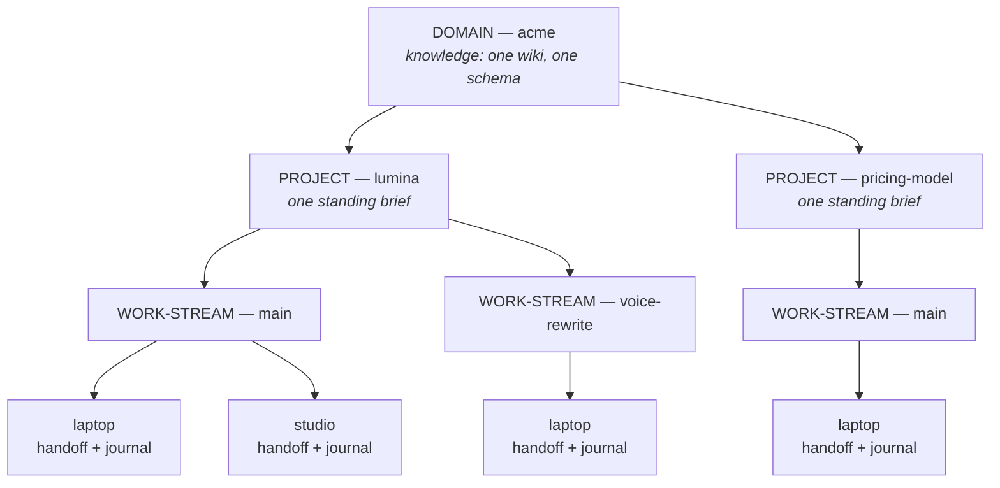

Read it from the bottom and it is the whole rule: **a handoff belongs to one computer**, a
work-stream gathers the computers, a project gathers the work-streams and holds the one brief
they all share, and a domain gathers the projects and holds the knowledge they all read.

**Before v3.48.0 the middle level did not exist**, so a domain *was* a project — which is why you
may have domains today that were really one body of knowledge with several builds inside it.
Nothing is moved for you, and nothing needs moving: a domain that had state before the update
reads as one project named after the domain and keeps working exactly as it did, including on
your other computers if they have not been updated yet. When you want a second project, add it in
**Domains → Projects** ([§10](#projects-inside-a-domain)).

**Two hard edges.** The **domain** you name must already exist — an unknown one is refused, not
created, because a folder with no `CLAUDE.md` is invisible to the app and to every tool, so state
saved there would go unseen. And an unknown **project** name is refused too, with a list of near
matches beside it: nothing creates a project as a side effect of saving into it.

### Resuming — the one line to learn

Say the project's name.

> *"Resume Lumina."*

What an agent with the [continuity skill](mcp-user-guide.md#the-curator-continuity-claude-skill--session-handoff-v3170)
installed does with that:

1. **You named a project, so that wins.** If you did not name one, it looks for a
   **`.curator-project`** file in the folder it is working in, or a parent of it — one line,
   holding `domain/project` — and reads that. (A bare `project` is still understood, but nothing
   the app or the widget writes uses it: a name on its own can become ambiguous the day a second
   domain gets a project of that name, and the agent refuses rather than guesses.)
2. **If there is still no name, it lists your projects and asks you.** It does not pick one. An
   agent that guesses wrong does not merely read the wrong handoff; the save at the end of that
   session overwrites it.
3. **Then it reads that project's brief and its `latest` work-stream** — the one most recently
   written, whose name you therefore never have to remember.

**Copy marker line**, in Domains → Projects, gives you the exact line to paste into a repository's
`.curator-project` file, which is what turns step 1 into *the agent already knew*.

### Documents — the files that travel with a project

Working state (above) and the wiki (§9) are two kinds of context, and until v3.59.0 they were the
only two The Curator carried for you. A third kind was missing: the documents a project is
*built against* — its architecture, its firm decisions, its conventions, its roadmap — which have
always lived as plain files in a code repository, verbatim, and were invisible to any agent that
had not personally checked that repository out. **Foundations** is that third kind, added in
v3.59.0: canonical documents mirrored — or, for a project with no repository, written by an agent
you asked to write them — into `state/<project>/foundations/`, so they sync and travel exactly
like your working state, and so any agent can read them in the same one-call session start that
already fetches the brief and the latest handoff.

![Three source boxes — Foundations (canonical documents, verbatim, freshness by sha256), Working
state (brief, handoff, journal — already one MCP call away) and The wiki (compounded knowledge,
travels via sync, searchable) — feeding down into a single get_project_context() call, which
returns one bootstrap payload: the brief, the latest handoff, and the foundations index plus any
documents changed since the caller last saw them. A dashed loop-back arrow shows a returning
session passing back the sha256 hashes it already holds — recorded from its previous save's
"Foundations read" section — so the next bootstrap sends only what changed, never the whole set
again.](images/curator-context-model.svg)

*The three kinds of context, and the one call that opens all of them. Volatile state and
compounded knowledge already travelled; foundations is what closes the gap — a canonical document
that used to exist only inside a checkout now travels with the project too.*

**What counts as a foundation, and what does not.** A foundation is a document you would want any
agent — on any machine, in any harness, on the first message of a cold session — to have read
before it proposes anything: the architecture, the standing decisions, the conventions, the
roadmap, the API surface, a user-facing guide. It is **not** a place for volatile state (that is
tiers 1–3, above) and it is **not** a place for compounded knowledge that should be searchable and
cross-linked (that is the wiki). The practical test is durability: a foundation changes on the
order of releases, not on the order of sessions, and it is meant to be read in full rather than
searched. Each document is capped at 512 KB (a larger save is refused — a canonical document
cannot be honestly trimmed) and a project's foundations are capped at 200 KB in total (an
over-budget save is *accepted and disclosed*, never silently refused, for the same reason a
handoff is never refused: a rejected save loses the document outright).

**Every document has its own source, since v3.69.0 — a project is no longer one thing.** Through
v3.68.0 a project held documents of one "ownership" only. That rule is retired: a project can now
hold documents **written** here, **copied** in once, and **mirrored** from any number of folders
and GitHub repositories (up to 8 sources), all at once. What survives unchanged is the single-writer
rule, now checked per document rather than per project:

| Kind | Who writes it | How it stays fresh | What a "stale" mark means |
|---|---|---|---|
| **Written** / **copied** (kept here) | You, or an agent you asked — the same commissioned-only rule the standing brief follows | Whoever you next ask to update it, again on your instruction. Nothing regenerates it automatically | Not applicable — there is no second copy to compare against, so a kept document is never marked stale |
| **Mirrored**, from a folder or GitHub | Its source is the source of truth. The app/MCP only *mirrors* — a byte-for-byte copy, never an edit | Refreshing that source re-reads each mirrored file, compares its sha256 against the stored copy, and copies over anything that changed | The stored copy's sha256 no longer matches the file at the recorded path — either it changed there, or that source is not reachable from this machine |

A save to a mirrored document's slug is refused — *"edit it there and refresh"* — but a save under
a **new** slug always succeeds, in any project, including one that mirrors: `save_foundation` and
the app's own **Write a document** create, they never overwrite a mirror.

**What an agent actually gets, and how you choose it** *(v3.62.0)*

Until v3.62.0 a bootstrap sent every document a session had not seen. That is right for four
documents and wrong for twenty — a session then opens with twenty documents most of which have
nothing to do with the work in front of it, and the reading budget starts dropping documents
nobody chose to drop. So the choice is now yours, one flag per document, set from step ① of the
Project-context screen:

| What the agent is handed | Which documents |
|---|---|
| **The index** — every document's title, role, size and freshness | **Always. All of them. Every call.** Nothing suppresses it |
| **The full text** | The ones you marked **read first** |
| **The full text, on request** | Everything else, the moment the agent asks for it by name |

**Being "on request" is not being hidden**, and that distinction is written into the tools
themselves: an index row with no text is *a document waiting to be asked for, not one that is
missing*. An agent that reported "this project has no decision log" while `decisions.md` sat in the
index would have told you something false about your own project — so the tool description, the
continuity skill and the instructions block all say so in as many words.

**Mark sparingly.** The marked set is sent every session, so it is the one that costs. Two or three
documents is a reading plan; twelve is the old behaviour with extra steps, and the block tells you
when the marked set has grown past what one session's reading can carry.

**Which document for which kind of work goes in the brief, not in a checkbox.** Your standing brief
has a **"Read before you…"** section for exactly this — one line per kind of work, naming the
document to open:

```markdown
## Read before you…

- …change how anything is built: `architecture.md`
- …re-open a settled question: `decisions.md`
- …write or review code: `conventions.md`
```

An agent is told to consult it and open what it names; where it is empty, the documents' roles are
the next best signal. **Marking works on a mirrored document too** — the mark lives in The
Curator's own index rather than in the document, so your checkout is untouched, a refresh still
compares byte for byte, and the mark survives the refresh: the repository owns the text, you own
the reading order.

**The teaching path — three tool calls, and the order they are learned in.**

1. **`get_project_context`**, once, at the start of a session — the diagram above. It replaces the
   older two-step "read state, then separately go find the docs" and returns the brief, the latest
   handoff, the full foundations **index**, and the text of whatever you marked read first — in one
   response.
2. **`get_project_context` again with `slugs`**, whenever the work touches a document's subject:
   *"open `decisions.md` before we re-litigate this"*. It returns those documents whole, on top of
   what the bootstrap already sent. *(This is not a separate tool — the bridge still has 24.)*
3. **`save_working_state`**, carrying `foundations_read` — the sha256 of every foundation the
   session actually read — so the *next* session can tell what changed since this one.

`save_foundation` is deliberately not in that path. It exists, and an agent may use it, but **only
when you have asked it to** — write or update this document — in the same way `save_project_brief`
already required an explicit instruction for the standing brief. A session that reads foundations
correctly all the way through never has to call it.

**How the Foundations block reads, in the app.** Since v3.62.0 it is **step ①**, now called
**Documents**, on the Project-context screen
— the first thing on the page, above step ② *Memory* and its four rows (*Agent connections*,
*Handoffs*, *The brief*, *Journal* — since v3.65.0 all built from the same
instrument, and since v3.65.1 the "Last saved" row that used to lead them is gone) — and its own fold is closed
by default like theirs. Its summary
line reads *"N documents · M KB · fresh · 2 read first · 4 on request"*, or names how many are
stale, unreachable from this machine, or Curator-authored, whichever applies. Each row in the
opened table carries a **read first** control and a freshness dot on the same
[app-wide scale](#the-freshness-dot-one-scale-everywhere) the rest of the screen uses; pressing a
row opens that document in the [reader](#reading-a-handoff), the same right-hand panel a handoff or
a wiki page opens in. **The read-first control works on a mirrored document as well as one kept
here** — it changes The Curator's own index and never the document, so it cannot make the app a
second writer of a file your repository owns. **As of v3.69.0** the block shows a **sources strip**
listing every source the project draws from, each with its own Refresh; a source that is not
reachable from this machine shows why in place of a working button, rather than offering a control
that would fail.

**What this tier does not do.** Nothing selects which documents belong in a project automatically —
you, or an agent you asked, decide what is canonical. Nothing summarises a document with an LLM on
the way in or out — a foundation is stored and returned verbatim. **Read first / on request / not at
start is always a choice you make or apply** — nothing changes a document's start state on its own;
see *Suggest a reading plan*, below, for the one thing that proposes a plan for you to approve. A
project with nothing marked behaves exactly as it did before v3.62.0 — every document, up to the
budget. And refreshing a folder source still needs the checkout on the machine that has it; the
copies travel everywhere, the comparison does not. *(Before v3.61.0 the app had no editor for a
curator-owned foundation at all — writing one was an agent action, on your instruction, over MCP,
and only over MCP. The next section is what changed.)*

#### Three start states, and "Suggest a reading plan" *(v3.65.2 → v3.67.0)*

Since v3.65.2, every document in step ① Documents has one of **three** start states, not a
two-way flag — the column is **At session start**:

| State | What it means |
|---|---|
| **Read first** | Its text arrives with every session, within the reading budget (below) |
| **On request** | Listed in the index; the agent opens it by name when the task needs it |
| **Not at start** | Kept and mirrored, but not listed at session start at all — name it in the brief's *"Read before you…"* if an agent should still find it |

An agent that asks for a **not at start** document by name still receives it in full — the state
only controls what is handed out automatically at the start of a session.

**Suggest a reading plan** (v3.67.0) proposes a start state for every document, without changing
anything until you approve it. Two ways to run it, side by side:

- **Suggest (free)** needs no AI key. It follows your brief's *"Read before you…"* list (those
  documents stay **on request**, because you have already said when to open them), each document's
  own role and size, and your reading budget — documents your brief marks as architecture,
  decisions or conventions are proposed **read first** while they still fit the budget, and never
  when a single one is larger than half of it; a stale roadmap over 64 KB is proposed **not at
  start**; a document you already keep **not at start** stays there.
- **✨ Suggest with AI** asks your [AI model](#ai-jobs-and-the-one-model) to read each document's
  title, role, size and opening lines — **never whole documents** — and shows what the run will
  cost before it runs and what it cost after. With no provider key the button is disabled and links
  to Settings → Providers & keys; the free arm always works regardless.

Either way, the result is a **Suggested** column next to the real one — nothing is written until
you press **Apply suggestion**, and you can untick any row you disagree with first.

**Mirror from GitHub and Add from folder now start with nothing ticked.** Through v3.65.2 a scan
pre-ticked the four canonical roles (architecture, decisions, conventions, roadmap); since v3.65.3
a scan lists what it found, sized, with nothing ticked — you choose what to copy, and the copy
control stays off until at least one document is ticked.

### Start a project

*New in v3.61.0.* Creating a project — **Domains → Projects → New project** — asks a second
question, right below the brief: **where do this project's first documents come from?** This is a
convenience for the moment of creation, not a lasting commitment — **since v3.69.0 it no longer
decides what the project is allowed to hold**: whatever you pick here, both Add doors on step ①
Documents stay open afterward, and you can add more written, copied or mirrored documents, from
any number of sources, at any time.

| Choice | What happens | When to pick it |
|---|---|---|
| **Curator keeps them** *(the default)* | Four skeleton documents are seeded immediately — `architecture.md`, `decisions.md`, `conventions.md`, `roadmap.md` — each a **prompt to answer**, not a fact. Optionally, on this same form, **start from files** — pick one or more existing `.md`/`.txt` documents from your computer and each becomes a real document alongside the seeds (untick "seed the four skeletons" if you don't want those too) | You have no repository yet, or the project is not code at all — research, a client engagement, a body of reading |
| **Mirror from a repository on this Mac** | A path field plus **Find documents** scans that checkout for candidate files and offers them as checkboxes, each with a role you can correct — the checkout becomes this project's first source | You already have an architecture doc, a decisions log, or similar, checked in — or just sitting in a folder, whether or not that folder is a git repository |
| **Mirror a GitHub repository** *(new in v3.65.0)* | Give it `owner/repo` — the https:// or git@ URL git itself prints works too — and, optionally, a branch and a folder inside it, then press **Find documents**. The Curator lists what it found over the network, sized, with the same running budget total as the local arm and (since v3.65.3) nothing pre-ticked, and copies whichever documents you tick the moment you confirm — no checkout on this computer required | You want a mirror on a machine that has never cloned the repository — a second Mac, a fresh install, a machine set up for agent work only |
| **Decide later** | Nothing is written. The same choice reappears the first time you open this project's Documents step, and both doors are open from the start regardless | You are not sure yet, or you are creating several projects at once and do not want to stop for each one |

**Choosing the folder.** Beside the typed-path field sits a **Choose folder…** button — the same
native picker Settings uses to point at your knowledge base, opened for reading only: it hands back
a path and touches nothing else, unlike the Settings picker, which also repoints where your whole
wiki lives. On a build or platform with no native picker at all, the button is **withheld** and a
line under the field says so, rather than offering a control that can only refuse — type or paste
the path instead. An instruction line above the two controls names the order: *"Point at the folder,
then tick the documents to copy."*

**Onboarding a project that already has its documents.** The "Mirror" path above is not only for a
brand-new checkout with nothing in it yet — point it at the folder where your architecture doc,
decision log and roadmap **already live**, and **Find documents** goes looking for them itself,
rather than making you type every path by hand. It looks in three places: anything under a `docs/`
or `doc/` folder; anywhere in the tree, a file whose *name* says what it is — `architecture.md`,
`decisions.md`, `adr-0012.md`, `CONTRIBUTING.md`, `roadmap.md`, `README.md`, and so on; and every
document inside a folder literally called `adr`, `adrs`, `decisions`, `architecture` or `rfcs` — the
layout a lot of real repositories already use. Nothing it finds is guessed *content* — the checkbox
list shows you the path, the document's own first heading, its size, and how long ago it was last
touched, and you tick what belongs. If it misses one, a typed path field beside the list adds it by
hand. **The folder does not need to be a git repository at all** — a plain folder of documents works
exactly as well as a mirror source; the only difference is that the Foundations table then shows the
source path with no commit beside it, because there is no commit to show.

**What is ticked by default, and why.** A scan of a real repository routinely turns up twenty or
thirty matching files — every doc in a `docs/` folder, every ADR, every README. Ticking all of them
by default once mirrored **25 documents · 1,875 KB** against the 200 KB project budget on the
maintainer's own repository, nine times over it, including files nobody meant to hand an agent. So
only the four **canonical roles** — architecture, decisions, conventions, roadmap — start ticked;
everything else (API references, guides, a README, a changelog) is listed, sized, aged and one tick
away, but starts **unticked**. The running count under the list — *"4 of 25 ticked · 186 KB of a
200 KB budget"* — makes the twenty-one untouched rows a visible decision rather than something you
missed. Ticking or unticking a row never scrolls the list back to the top, even on a long one.

**The budget line is a warning, not a wall.** Ticking past 200 KB does not block you — the store
accepts an over-budget project and discloses it — but a line appears (and never folds) naming the
real consequence: *"Over the 200 KB budget: agents receive 120 KB per session and the rest is
dropped, last in reading order first."* Past the project total, a session bootstrap still has its
own, smaller budget, and drops whole document bodies — last in reading order — before it drops
anything else.

**How old each candidate is.** Every row in the checkbox list carries a freshness dot and a word —
*"updated 3 months ago"* — taken from the source file's own last-modified time, on the same scale
the rest of the app uses. It is information only: an old document is still offered, still ticked or
not by the same rule, and the list is never reordered by age — the sort stays role, then path.

**Deleting a document.** *New in v3.61.1, a trash icon on every row since v3.69.0.* Every row —
written, copied or mirrored — carries its own delete icon (a kept document also carries a pencil
that opens the editor, which has its own **Delete** sharing the same confirmation). Pressing it
opens a confirm strip in place, under the table — never a dialog — naming exactly what happens: for
a mirrored document, *"Stop mirroring **decisions.md**? The copy is removed and your agents stop
reading it; the file at its source is untouched. A refresh will not bring it back — re-add it from
the checklist if you want it here again."* Confirming removes that one document from the project
without touching the original, and without touching any other document — there is no bulk removal.
**Deleting a source's last document removes that source from the project too**, in the same
action. The editor's **Delete**, for a written or copied document, reads differently and means it
literally: *"It cannot be undone from inside The Curator; if you sync, a git client can still
recover it."*

**The GitHub arm never asks you to type a token.** A radio beside the repository field chooses
*which stored token to read with* — the dedicated, read-only `githubReadToken` in Settings, or
Personal Sync's own token — and The Curator reads that token from the file it lives in; there is no
password field anywhere in this form, and there never will be, because a form that could become the
first credential path into the app is refused by design. If the read is refused, the message says
which token was used and why (no token saved yet, rate-limited, the repository or branch not found,
the tree too large to list) and never the token itself. A remote candidate carries no age — a git
tree has no last-modified time the way a local file does — so one line above the list says so, once,
rather than twenty-five rows each carrying a dash where the age would be. **Nothing is written until
every ticked document has been read successfully:** a wrong owner, repository, branch or folder
leaves the project exactly as it was, free to try again.

The banner after creation says which one fired — *"Created project lumina · 4 skeletons seeded"*,
*"· 3 documents mirrored"*, or *"· documents: decide later"* — and, if the project itself was
created but its foundations could not be (an unreachable checkout, say), a second, un-folded line
names the reason: the project always exists after this action, never half of one.

An existing project with no foundations yet is not stuck with whatever you picked, or did not pick,
at creation — the same two-way choice (Curator-kept or mirrored; "decide later" makes no sense once
you are already looking at the empty block) is offered again from the **Foundations** block on the
Project-context screen, the moment you open it and it finds no manifest.

**What a skeleton actually is.** Not a template you fill in blanks of — a real markdown document,
with real `##` headings, whose first line is a visible banner: *"Skeleton — not yet written. Answer
the prompts below and delete this line. An agent writes one only when you ask it to."* Under each
heading sits a question, not a fact — "What are the three or four decisions that would surprise a
new contributor?" rather than an invented answer. Nothing in The Curator ever answers those
questions for you. An agent may, but **only when you have asked it to**, exactly as it would before
touching your standing brief: it calls `save_foundation` with `commissioned_by_owner: true` — the
same flag `save_project_brief` has required since v3.48.0 — and there is no soft failure mode
around that flag; the tool refuses outright without it. The agent-instructions block ([§13b, "Making
sure your agent actually does it"](#making-sure-your-agent-actually-does-it)) now carries one more
paragraph saying exactly this, plus one more line: if the project has a repository, export the
filled document into its own `docs/` folder on the first commit — so a document that started life
inside The Curator ends up back where a foundation belongs, checked in beside the work it describes.

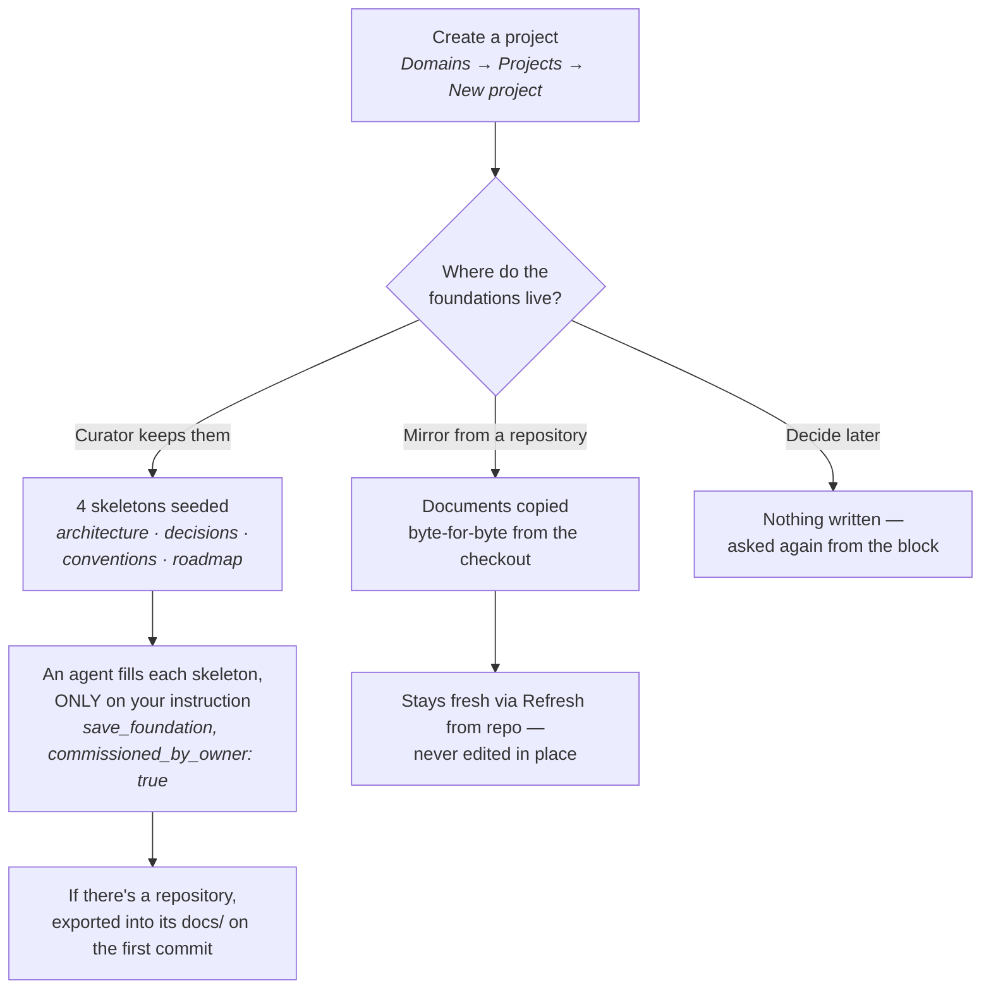

**Editing a foundation, in the app.** Only a **written or copied** document can be edited here — a
mirrored one is refreshed from its source, so editing it in the app would be immediately
overwritten by the next refresh; the app says so and points you at the source instead (the pencil
is withheld on that row). Every project, mirrored or not, keeps **Write a document** in the block's
own header (renamed from **Add document** in v3.68.0), so a new document can always be written, no
matter what else the project already holds. Either one opens an editor **in place of the table**, inside the same
fold — the standing brief's own pattern — with the document's title and role, a plain-text box that
renders in the same monospace face as everywhere else code-shaped text appears in this app, and a
live byte counter. **Save** is disabled past **512 KB** — a canonical document cannot be honestly
trimmed, so this is a wall, not a warning — and a project nearing its **200 KB** total budget is
told so without being stopped, the same "disclose, never refuse" rule a handoff already follows.
Filling in a skeleton and saving it **clears the skeleton mark** — the next read of that document is
an ordinary foundation, banner and all, exactly as if you had deleted the first line yourself.
**Delete** sits in the editor's own footer, behind a confirmation naming the document, for the
occasional skeleton you decide the project does not need.

**Write a document** offers two ways to start that editor, side by side: an **empty editor**, or
**Choose a file…**, which reads a `.md`/`.txt` file straight off your computer into the editor's
text box so you can review it before anything is saved. That file is read in your browser and
never uploaded — **Save** sends only the text in the box, the same way it would for anything you
typed — and a file over the 512 KB wall is refused before it is even read, naming both sizes.
The slug, title and role are guessed from the file (its basename, its first `# ` heading, and the
same role guess the repository scan uses) and are yours to correct before saving. Picking a file
whose slug matches an existing skeleton **replaces that skeleton** and clears its mark — the
banner says so, so you are never left wondering whether you overwrote a document.

**Getting an existing document into a project — several ways in, not one.** Before v3.61.0 there
was exactly one: asking an agent to write it.

| Way in | What actually happens | When to use it |
|---|---|---|
| **Add from this computer** (step ①'s head row) | Tick documents from a folder scan and either copy them in once, or keep the folder in sync — your choice, appended to what is already there | You are adding one or more existing files, from anywhere on this computer |
| **Add from GitHub** (step ①'s head row) | Tick documents found in a GitHub repository and mirror them in, appended to what is already there | The document already lives in a repository you want The Curator to keep re-reading from |
| **Choose a file…**, inside **Write a document**'s editor | Read from your disk into the editor, shown to you, saved only when you press **Save** — a kept copy from here on, with no source to refresh from | You want to review or trim the text before it is saved, not just copy it in whole |
| **An agent's commissioned save** | An agent writes or updates it with `save_foundation`, **only when you ask** — works in any project, including one that mirrors, as long as the slug is new | You want an agent to draft or fill the document from what you've just discussed, rather than typing or pasting it yourself |

**Asking, without composing the request yourself.** The Foundations block's **Copy the drafting
request** puts a ready-made ask on your clipboard — naming this project, its actual unfilled
documents, and the `save_foundation` / `commissioned_by_owner` gate — the exact same sentence in
every harness, because it comes from one pinned template rather than being retyped per screen.

### Making sure your agent actually does it

Everything above assumes the agent *reaches for* the continuity skill. On some harnesses it does
not — and when it does not, nothing is read, nothing is saved, and there is no error to see.
Measured on 2026-09-10 across 16 headless runs (one task, N=4 per arm): with the skill alone, an
agent on **Claude Code** saved in **0 of 4** runs; with a short block pasted into the file that
harness loads every session, **3 of 4**. On **opencode**, which loads the skill itself, it was
**4 of 4** either way — there the block buys nothing.

**The block changed in v3.76.0, and was measured again.** It used to tell every tool to save under
`main`, so two tools on one computer overwrote each other's handoff. It now tells each tool to save
under a scope **named for itself** — `claude-code`, `antigravity`, `opencode`, or its own name — and
to record that name as `harness`. Re-measured on 2026-09-25 (Claude Code, headless, Haiku 4.5, the
whole copied text in `CLAUDE.md`, 8 runs each): a draft of the new text saved in **7 of 8** runs,
the same as the old one did that day. But only **2 of those 7** saves landed in the tool's own scope
— the rest set `harness` correctly and still saved under `main`. So The Curator changed too: since
v3.76.0 a save that names no scope but names its tool lands in **that tool's scope**, and the
shipped text (one sentence changed to match) was measured again the same day, with that default:

| Model | Read state | Saved | Saved before stopping | Where the save landed | Cost, 8 runs |
|---|---|---|---|---|---|
| Sonnet 5 | 8 of 8 | **8 of 8** | 8 of 8 | `claude-code` 8 of 8 | $0.98 |
| Haiku 4.5 | 5 of 8 | **5 of 8** | 5 of 8 | `claude-code` 3, `main` 2 (named outright) | $0.49 |

So on a capable model the block does all of it; on a small one the save habit and the scope are
both weaker, and a scope the agent *names* — even `main` — always wins. If two tools share a project, check
**Handoffs** after their first saves and add the one-line scope rule to the brief
([Several agent tools on one computer](#several-agent-tools-on-one-computer)) if they landed in one
row.

**Since v3.76.1 it also tells an open conversation to read again.** A conversation that is already
open won't know about saves made elsewhere unless it re-reads — the maintainer's two-computer test
caught one carrying on from hours-old context after *"continue"*. The block now says: on
*"continue"* or *"resume"*, or after a pause, call `get_project_context` again before acting.
Measured on 2026-09-26 with two turns in one Claude Code session (turn 1 does a task; then another
tool saves a newer handoff; turn 2 is just *"continue"*):

| Model | Block | Turn 2 read again first | Turn 2 saw the other tool's save | Cost |
|---|---|---|---|---|
| Sonnet 5 | before (v3.76.0) | **0 of 8** | 0 of 8 | $2.14 |
| Sonnet 5 | with the new sentence | **8 of 8** | 8 of 8 | $2.32 |
| Haiku 4.5 | before (v3.76.0) | **3 of 4** | 2 of 4 | $0.74 |
| Haiku 4.5 | with the new sentence | **2 of 4** | 2 of 4 | $0.69 |

On Sonnet 5 the sentence is the whole difference. On Haiku 4.5 it made no measurable difference —
Haiku often re-read anyway, and often failed to reach the tool at all. None of the runs *obeyed* the
other tool's next step; they read it as a record and asked. **If your tool doesn't re-read, start
a new conversation** — a new one always reads first.

**Copy agent instructions**, beside **Copy marker line** in Domains → Projects (and on the Project
context screen), puts that block on your clipboard with this project's names already in it. Paste it
into whichever of these your tool reads:

| Your tool | Paste it into | Watch out for |
|---|---|---|
| Claude Code | `CLAUDE.md` | |
| Codex | `AGENTS.md` | the file is **cut off at 32 KiB**, silently — the block is small, a whole playbook is not |
| opencode | `AGENTS.md` | it reads `CLAUDE.md` too |
| Gemini CLI | `GEMINI.md` | the filename comes from a `context.fileName` **list** in its settings; `AGENTS.md` is opt-in |
| Antigravity | `AGENTS.md` (or `GEMINI.md`) | it does **not** read `CLAUDE.md`; each file is cut off at 24,000 bytes |
| Cursor | `.cursor/rules` | it reads `AGENTS.md` too |
| GitHub Copilot CLI | its own instructions file | it reads `CLAUDE.md` and `GEMINI.md` too |
| Zed | **`.rules`**, else `AGENTS.md`, else `CLAUDE.md` | **first match wins.** In a repository that has an `AGENTS.md`, a block in `CLAUDE.md` is never read |

Unsure which applies to you? **`my-curator doctor`** ([§13c](#13c-making-capture-real--the-command-the-hooks-and-the-meter))
reports the file your harness will actually read on this machine, and whether the block is in it.

**Since v3.67.2, pressing the button tells you where to paste it, not just that it copied.** A
short note appears — bottom-right, closing on its own after 30 seconds (it waits while your pointer
is over it; press Copy again to see it once more) — reading: *"Paste it at the very top of the file
your agent loads every session, so it is read first and no size cap cuts it off. CLAUDE.md for
Claude Code · AGENTS.md for Codex and others · GEMINI.md for Gemini CLI · a rule file in
.cursor/rules for Cursor."* Position matters for a concrete reason: Codex truncates `AGENTS.md`
silently at 32,768 bytes, so a block appended at the bottom of a large file can go missing with no
error at all.

It does not replace the skill — the skill is what carries *how* to write a good handoff. The block
only makes sure the agent goes and looks. The full measurement, including what it does not show
(N=4 is a shape, not a rate; headless only; one model), is in
[working-state.md § Activation](working-state.md#activation-put-the-discipline-where-the-harness-cannot-skip-it).

Two things this deliberately is not. It is **not a command the app parses** — it is a sentence an
agent understands because the skill told it what to do with a project name, which is also why it
works the same in Claude Code, Cursor or anything else that can reach the bridge. And *latest* is
resolved by the store rather than guessed, so *"resume"* lands on the work-stream you were
actually in.

### Turning it off

**No handoff is saved unless an agent is asked to save it.** There is no background process, no timer and no hook: a `<scope>/<machine>/current.md` and its journal are written the first time something calls `save_working_state`, and never otherwise. **Browsing** state cannot create any — every read route is a read. The app can write one thing, and only when you click it: a project's **standing brief**, plus the folder that holds it when you create a project in Domains → Projects. If you never ask and never click, a project simply has no state.

That is also why **there is no on/off setting to find** — none is needed for the common case, and none exists. If you want something firmer than *don't ask*, there are three levers, and they get blunter as you go down.

**1. Just don't ask — per project, no configuration.** Working state is opt-in per project by virtue of being agent-initiated; a project you never mention stays untouched, and a project that does not exist is never created to receive a save. One wrinkle worth knowing: the project name is an *optional* argument, and a save that names none falls back to your **default domain**'s default project ([§16, Settings](#16-settings)). So an agent saving without naming anything writes there — if you have a default domain set, that is the one to watch.

**2. Remove the `curator-continuity` skill — the practical global off switch.** That skill is what tells an agent to save at all, and when. Without it nothing prompts a save. Three things to know:

- It lives in **your harness**, not in The Curator — `~/.claude/skills/curator-continuity/`, or uploaded into a Claude Desktop project — so you remove it there.
- **If you pasted the entry-file block, delete that too.** The `## Working state` block from **Copy agent instructions** ([§13b](#making-sure-your-agent-actually-does-it)) is a standing instruction in `CLAUDE.md` / `AGENTS.md` / `GEMINI.md` / your Cursor rules, and it asks for saves whether or not the skill is installed. Removing the skill alone does not remove it.
- The tools stay registered, so a direct *"save our progress"* still works. This removes the habit, not the capability.
- If you also run the `my-curator` skill, its tool table still lists `save_working_state` with a *save early and often* hint. Delete `mcp__my-curator__save_working_state` from that skill's `allowed-tools:` line if you want the nudge gone entirely.

**3. `readonly: true` — a hard refusal, and much blunter than it looks.** Adding

```yaml
---
readonly: true
---
```

to the top of a domain's `CLAUDE.md` makes `save_working_state` refuse outright — twice over, in fact, since both the MCP bridge and the store check it independently.

**But it is not a memory switch. It marks the whole domain read-only.** The same flag is what Shared Brain mirrors use, and every write surface in the app honours it. Turn it on and you also lose, for that domain:

| Also blocked | Where |
|---|---|
| Ingesting a source — single file *and* the batch queue | the domain disappears from the Ingest picker |
| Compile to Wiki | Chat |
| Every mutating Health action — Fix, Fix all, Fix all safe, broken-link apply, orphan rescue, semantic merge, Dismiss, Undismiss | Health |
| `compile_to_wiki`, `fix_wiki_issue`, `dismiss_wiki_issue`, `undismiss_wiki_issue` | MCP |

Reading is unaffected — chat, search, the wiki browser and every read tool keep working. But this is *"this domain is now an archive"*, not *"stop saving handoffs here"*. If ingest still matters for that project, use lever 1 or 2 instead.

One rough edge to expect: the refusal messages were written for the Shared Brain case, so a domain you marked read-only by hand is described back to you as *"a read-only Shared Brain mirror"* and pointed at a contribution flow that does not apply. The refusal is correct; the wording assumes a mirror.

> 📖 **Full reference:** [docs/working-state.md](working-state.md) — the three tiers, the fields a handoff carries, size limits, when a save is refused, and the security posture.

---

## 13c. Making capture real — the command, the hooks and the meter

Everything in §13b works **if** the agent saves. §13b's own measurement is blunt about what happens
when it does not: on Claude Code, with the skill alone, **0 of 4** runs saved anything, and there
was no error to see. v3.63.0 is about that gap. It does not make saving mandatory — nothing here
can lose a handoff, and a missed save still leaves you the *previous* one — but it gives you three
things you did not have: a **command** you can run yourself, **hooks** that ask the agent at the
right moment on the harnesses that have them, and a **meter** that tells you whether any of it is
working.

![One agent session drawn left to right, with three moments marked on it. At the start, a
SessionStart hook runs `my-curator context` and injects the project bootstrap — the brief, the last
handoff and the read-first documents — into the session. In the middle, a PreCompact hook reminds
the model to save before its context is cut, with a note that on most harnesses it cannot block and
the wording says so. At the end of a turn, a Stop hook reads the local usage log and, only when no
save has landed in this session, asks once in that harness's own shape. Below, an arrow from the
Stop box to a box reading "the MODEL calls save_working_state" — a hook never composes a handoff, it
asks and the model writes — and from there a dashed arrow down to `.mcp-usage.jsonl`, one
content-free line per call, which is what the capture meter
counts.](images/curator-capture-loop.svg)

*A hook may **ask**, **inject** or **record**. It may never compose, summarise or invent a handoff —
a fabricated handoff is worse than a missing one, because the whole value of the store is that what
is written was written by whoever it names.*

### The command: `my-curator`

The bridge only exists while an MCP client is running. The command does not: it reads and writes the
same files, from a shell, **with the app closed, no network and no credential**.

| Command | What it does |
|---|---|
| `my-curator context` | Prints this project's bootstrap — the brief, the latest handoff, your read-first documents — to standard output. `--json` gives you the raw envelope |
| `my-curator save` | Reads a complete handoff as JSON on standard input, or from a file with `-f`, and writes it. It never invents one |
| `my-curator doctor` | Prints what is wired on this machine, and writes nothing. Start here when something is not working |
| `my-curator resolve` | Prints which project this directory belongs to, and nothing else |
| `my-curator install-hooks <harness>` | Writes hook configuration for that harness. Nothing else |
| `my-curator hook <event>` | What an installed hook actually runs. You never type this yourself |

**Two short flags, and no scheme behind them (v3.64.0).** `-f` means `--file` and `-h` means
`--help`; nothing else has a short form, and a bare `-` still means standard input. Before v3.64.0
the parser read `--` flags only, so `my-curator save -f handoff.json` put the flag among the
positional arguments and then waited on standard input **forever** — a hang rather than a usage
error, which is why the two are now handled at the parser.

**Installing it.** It ships in the repository, so a source install already has it at
`bin/curator.js`. To get the short command on your `PATH`, run `npm link` (or `npm install -g`) in
your Curator folder. **The downloadable Mac app does not carry it** — the app ships the bridge and
no command-line launcher, so `install-hooks` runs from a checkout or an npm install; `doctor` says
so in one line when it finds itself inside the app with no `my-curator` on your `PATH`. The binary is called **`my-curator`**, with one letter of explanation owed:

> **Why not just `curator`?** Because that name is already taken by something important. Elastic's
> `elasticsearch-curator` is installed on a great many servers — on Debian it *is* `/usr/bin/curator`
> — where it runs index retention. Quietly shadowing it could break somebody's production job, so
> this package never links that name: not on install, not on first run, not at all. If your machine
> has no `curator`, `my-curator doctor --alias` prints the one-line command to make the short name
> yourself; if something else already answers to it, the same command **refuses** and tells you what
> it found.

**Start with `doctor`.** It is read-only, it always exits successfully, and it answers the questions
that otherwise take an afternoon:

```
$ my-curator doctor
```

- which project this directory resolves to, and how (a `--project` flag, a `.curator-project`
  marker, or your default domain);
- which harness configuration files exist on this machine, and whether each one names the
  `my-curator` bridge — including whether the path baked into it has gone stale;
- which of them carry Curator hooks, **and whether any of those hooks is one of the two that look
  installed and do nothing** (see the table below);
- **which instruction file this harness will actually read**, and whether your agent-instructions
  block is in it — the only practical way to catch the two traps in the next section;
- the capture meter, in the terminal;
- **any stale bridge process** this install started that is older than the code on disk (v3.64.0);
- **whether this computer has minted two identities** (v3.64.0) — see just below.

**One computer, two machine names — and why that is normal on a developer's Mac.** A git checkout
and the installed `.app` resolve different user-data folders by design, so each keeps its own
install id and therefore its own machine name in `state/<scope>/<machine>/`. Handoffs saved through
the bridge and through the command then land in **different folders** and do not supersede one
another; asking for the latest work-stream answers with whichever was written last. `doctor` prints
both ids and both usage logs when they differ, and readers take the **union** of the logs, so a save
made through one install is visible to the other. Nothing is merged and nothing is renamed on your
behalf — if you only ever use one of the two, you will never see this.

### Hooks: what they can do on your harness, and what they cannot

A hook is a small command your agent tool runs at a fixed moment. Eleven of the fourteen harnesses
in the table below have some hook mechanism — but they disagree about almost everything, and
**three of them accept a hook that never fires**. So the honest answer is a table rather than a
promise. Four words describe every row:

| Word | Means |
|---|---|
| **verified** | The hook mechanism exists, takes a shell command, and the response shape is measured or documented. An adapter can wire it |
| **unverified** | The mechanism exists and takes a shell command, but the exact shape — or the file it goes in — has not been measured. Anything unmeasured ships **withheld with its reason** rather than guessed |
| **present-useless** | Hooks exist and **cannot** carry the ask. A finding, not a gap |
| **none** | No hook mechanism at all |

| Harness | Hooks | What `install-hooks` writes | Measured? |
|---|---|---|---|
| **Claude Code** | verified | `SessionStart` · `PreCompact` · `Stop` | **measured 2026-09-20 — headless `-p` only** |
| **Cursor** | verified | `sessionStart` · `preCompact` · `stop` — it *submits a message* rather than blocking, which is gentler | not measured |
| **Antigravity** | verified (from its docs) | `PreInvocation` — the project's context, once per conversation · `Stop` — one save ask per conversation, only when the agent stopped normally | **hooks not yet run.** Reading and saving without hooks were each seen once on 2026-09-25 |
| **Codex CLI** | unverified | `PreCompact` (the one pre-compaction hook that can actually block) · `Stop`. **Never `SessionEnd`** — it is capped at 3 seconds, which is not long enough to finish a save | not measured |
| **GitHub Copilot CLI** | unverified | Refused by default — the events exist and their shapes are unmeasured | not measured |
| **goose** | unverified | Refused by default — same reason. The one harness with a genuinely usable session-end hook | not measured |
| **Gemini CLI** | unverified | Nothing. `AfterAgent` is the right moment and its shape is unmeasured | not measured |
| **Cline** | unverified | Nothing — the config path is unmeasured. **`PreCompact` is refused outright**: Cline accepts one and never fires it | not measured |
| **DeepSeek Harness** | unverified | Nothing — the overlay path is unmeasured | not measured |
| **OpenCode**, **Kilo** | present-useless | Nothing — hooks here are TypeScript plugins, not shell commands | not measured |
| **Windsurf / Devin Desktop** | present-useless | Nothing — twelve hooks, and not one of them fires at a stop, a session end or a compaction | not measured |
| **Zed** | none | Nothing — no hook mechanism exists | not measured |
| **Claude Desktop** | none | Nothing | not measured |
| **Aider** | none | Nothing — **it has no MCP client at all.** Your option is a shell wrapper: `my-curator context` before, `my-curator save` after | not measured |

**Fourteen of the fifteen rows say *not measured*, and that is the truth rather than modesty.**
The protocol that would change a row — four runs per arm, one fixed task that never mentions
saving — is fixed and written down (`scripts/measure-harness.js`), and until it has been run the
product says so everywhere the question comes up. **A harness with no measurement is never
described as working.**

**The one row that has been run — Claude Code, 2026-09-20 — came back mixed, and the mixture is
the useful part.** Four runs per arm, Claude Code CLI 2.1.275 in headless `-p` mode on
`claude-haiku-4-5`, one neutral task that never mentioned saving:

- **`SessionStart` works.** In all four runs of the full arm (skill + instructions block + hooks)
  the hook injected the standing brief, the last handoff and the journal before the agent's first
  turn, and all four saved a handoff before stopping.
- **`Stop` never fired in that mode** — not once across six headless sessions. If you drive Claude
  Code with `claude -p` in a script, the end-of-session ask does not reach you. `PreCompact` did
  fire under `-p --resume "/compact"`.
- **Without the hook, the agent mostly did not manage to call the tool at all.** In five of the
  six attempts across the two hook-free arms it found `save_working_state` by name and then ran
  something that looked like a shell command named after it, instead of calling it — a fake
  `mcp call …`, a shell function wrapping the tool's own name, or a JSON payload written to a file
  and never sent. One attempt called the tool properly. The skill and the block were present in
  every one of those runs.

Two limits of the instrument, so the counts are not over-read: a session that never lands a real
tool call writes **no session line at all**, so a failed attempt is indistinguishable from silence;
and the context a hook injects arrives before the bridge is reachable, so a hook-fed read is
**invisible** to the usage log. Both are why the full arm reads *measured-partial* rather than
*measured-yes*.

**What a hook will never do**, on any harness: write to `CLAUDE.md`, `AGENTS.md`, `GEMINI.md` or
your Cursor rules — that paste stays yours — register an MCP server, touch an enterprise or managed
policy file, or write into a file it cannot parse. And `install-hooks` writes the **full path** of
the binary into every hook it installs, because `--scope project` writes a file you will commit, and
a teammate without `my-curator` on their `PATH` would otherwise experience your capture hook as
*"this repository breaks my agent"*.

**Two traps you cannot see from the outside**, both worth one run of `my-curator doctor`:

- **On Zed**, instruction files are resolved *first match*, and `.rules` and `AGENTS.md` rank
  **above** `CLAUDE.md`. Paste the block into `CLAUDE.md` in a repository that has an `AGENTS.md`
  and it is dead text — read by nothing, with no error.
- **On Codex**, `AGENTS.md` is truncated at **32 KiB**, silently. The short agent-instructions block
  fits easily; the full continuity playbook is about 63,500 bytes and does **not** — it belongs in a
  skills directory, never in an instruction file.

### The meter: did the session read, and did it save?

Project context → step ② **Memory** carries this reading as its **first** row, **Agent connections**
(called **Capture** through v3.69.0, then **Agent sessions** through v3.73.x) — the question this
whole layer exists for is answered without opening anything but that one fold.

**Two renames, and what the row does and doesn't count.** "Capture" described the mechanism;
"Agent sessions" (v3.70.0) described what you read off the row as *sessions* — but what the log
actually counts is **one bridge process**, not one conversation, and calling that a "session"
invited exactly the wrong reading: a Claude Desktop app kept open across a whole day of separate
chats is one process, so it logged as *"1 of 1 sessions"* even on a day with thirty conversations
through it, while Claude Code — which starts a fresh process per run — logged each one honestly.
**"Agent connections" (v3.74.0) is the accurate word for the same count**: how many agent
*connections* reached this project through the my-curator MCP, whether they read the context first,
and whether they saved before stopping. The on-disk word is unchanged (the route is still
`…/capture`, the store function is still `captureFacts`), exactly as v3.65.1 kept **foundations**
and **working state** on disk under the screen's own **Documents** and **Memory**. It counts only
connections that reached this project **through the MCP bridge**: a session started by the
SessionStart **hook**, or by `my-curator context` at the command line, reads the context without
ever calling `get_project_context` over MCP, so it is **not counted** here, and a zero row can be an
honest answer even on a project you use every day. A one-line explanation sits under the row
whenever the count is zero, so a quiet number never reads as "nothing is happening" when the truth
is "nothing here goes through the bridge."

**And, since v3.74.0, the window it claims is the window the log actually covers, not a fixed
30 days.** A log that only reaches back five days now reads *"6 connections in the last 5 days (the
log begins 20 Sep)"*, rather than silently implying it watched the full 30-day span it did not have
data for; a log old enough to cover the whole window still reads the plain *"in the last 30 days"*.

![The Memory step of the demo project's Project context view with its Agent connections row open. The row's summary reads '8 connections in the last 5 days (the log begins 20 Sep) · 8 started with the context · 7 saved before stopping · 1 read and did not save'. Inside, a recessed monospace panel: CONNECTIONS 8 (in the last 5 days), STARTED WITH THE CONTEXT 8 of 8 and SAVED BEFORE STOPPING 7 of 8, each with a small bar, READ AND DID NOT SAVE 1 marked in the warning tone, TOOL CALLS 22, and NEWEST 8 min ago with claude-code beneath. Below it the line 'Saves by tool, last 7 days: Claude Code 4 · Antigravity 3', then closed rows for Handoffs, The brief and Journal · claude-code, and step 3, Knowledge, with the early-computing and night-sky rows.](images/curator-capture-meter.png)

*As of v3.65.0, this row became one row among the other four, not a card sitting above a separate
"Sessions" fold. **As of v3.65.1 its body dropped the per-session table entirely** — the maintainer's
own reading was that a row plus a table plus a floating ⓘ was three designs answering one question —
and the six facts the table used to carry now live as six monitor lines, so nothing measured is
lost, only the table's own per-connection rows. The ⓘ that used to float alone above the table moved
out of the row altogether, into the step's own ⓘ beside its title. The route's own disclosures (the
pre-session-id count, the excluded self-test calls, and — further down — the note about a bridge
that logged saves with no session) stay outside the row, unfolded, because a note about what the
meter cannot see is exactly
the kind of thing the standing rule says must never sit behind a chevron: a warning, a cost or an
outcome is never one click further away than the row it qualifies. **As of v3.70.0 the row itself was
titled Agent sessions, and as of v3.74.0 it is titled Agent connections**, for the reason above.*

**Three words, defined once so the reading cannot be misread:**

| | |
|---|---|
| **A connection** | **One bridge process** — one run of your agent tool with The Curator connected. Not a conversation, not a day — one Claude Desktop process can carry many conversations, which is exactly why the row no longer calls this "a session" |
| **Started with the context** | That connection asked for this project's brief and state, at some point before its first save. Not necessarily as its very first call — an agent that lists projects first and bootstraps second has still bootstrapped |
| **Saved before stopping** | A save succeeded. A *refused* save is not a save |

**The uncomfortable number is the one in plain words.** *"2 read and did not save"* is two
connections that had everything and wrote nothing back — and it is printed as a count, in words,
never as a percentage or a bar, because *"67%"* reads as a grade while *"2 read and did not save"*
reads as two connections you could go and look at.

**Three states, told apart rather than blurred:**

| What you see | What it means |
|---|---|
| *"no usage log on this computer yet"* | Nothing has used the bridge here. Not a failure |
| *"no agent connection in the last 30 days"* (or the true-window wording above, when the log is younger) | There is a log, and no connection for **this project** in the window. Also not a failure |
| *"6 connections in the last 30 days"* | The real reading, with its breakdown underneath |

Only the third carries a freshness dot, and **that dot is the age of the newest connection** — not a
grade for the ratio. A reading and a judgement are different things, and the app does not dress one
as the other.

**What the meter cannot see, stated on the screen and not only here.** It counts what went through
the **bridge**. A save made with `my-curator save`, or by an agent that never connected, leaves no
line — so it neither helps nor hurts the figures, and a session that never opened the bridge is not
in the denominator either. And a session that **opened** the bridge but never landed a real tool
call still writes nothing but its session line, which is exactly what the 2026-09-20 measurement
ran into: one whole arm recorded zero sessions not because four sessions failed to save, but
because no session ever reached the bridge at all. The **harness** named beside the newest session is **self-reported** by the client and nothing in
The Curator branches on it: it labels the reading and does nothing else. Calls made before v3.63.0 have no
session id, so they are counted separately (*"412 lines predate session ids and are not counted"*)
rather than being invented into sessions. And the app's own *Test all 24 tools* run is excluded
outright — pressing a button on a Settings screen must never report a session that read and saved.

**Nothing here stops a session.** The meter reports; it never refuses, delays or blocks anything.

**A fifth state, added in v3.64.1: saves with no sessions to show for them.** A bridge process can
log saves without ever writing a session line — the exact shape of a Claude Desktop bridge kept
alive across an app update, still serving old code, which is what a bridge running since 2026-09-18
did to a maintainer's own reading on 2026-09-20: the strip read *"no session in the last 30 days"*
beside a save from 47 minutes earlier, which looked like a contradiction rather than what it was.
The route now carries `newestSaveAt` — the newest save's **file** clock, kept apart from the
session reading's own clock — and, when the window holds saves but zero sessions, a `note` under
the readout: *"Saves in this window arrived through a bridge that logged no sessions — restart the
app that launched it (usually Claude Desktop)."* The note is dropped whenever `noSessionsButSaves`
is false, so a genuinely quiet project still reads as quiet.

**v3.65.1 gates the same note a second way, on the usage log's own presence.** The route's
"stale bridge" note is computed from the project's OWN save history, independent of whether a usage
log exists at all — so on a computer with no usage log but a recent save on disk, the route named a
bridge that had logged no sessions and told you to restart it, a remedy for a bridge that had never
run, sitting beside a summary already saying the log does not exist. The view now withholds that one
note when there is no log at all: with no log, the row's own summary (*"no usage log on this
computer yet"*) is the whole answer. The note's other cases — the log exists but predates this
project's usage entirely, or carries calls too old to have a session id — are unaffected by this
gate and still render exactly as the route sends them.

> The same reading is available from the terminal (`my-curator doctor`) and as a per-harness matrix
> row (`node scripts/measure-harness.js --harness claude-code --since <date>`), from the same
> aggregation — so the three can never disagree about one session.

### Canonical documents, from the repository instead of a checkout

One more piece of the same release, for anyone using **[foundations](#documents--the-files-that-travel-with-a-project)**
on more than one computer. Until v3.63.0, a mirrored document's freshness could only be checked on
the machine that had the repository cloned; everywhere else the column read *"source not on this
computer"* for ever. A mirror can now be refreshed **from the GitHub repository itself**.

**It only ever reads.** The client it uses has no way to write — no `PUT`, no `DELETE`, no path to
one — so a refresh cannot alter the repository it is mirroring, whatever token it holds. If the file
listing comes back truncated it refuses loudly *and changes nothing*, because a silent miss would
quietly keep a stale copy while reporting success.

**And it does not borrow your sync token without asking.** The recommended setup is a **second,
read-only, fine-grained** GitHub token (Contents: **Read**, that repository only), saved in
**Settings → Knowledge base → GitHub read-only token** ([see the box above](#github-read-only-token-v3652)) —
as `githubReadToken` in `.curator-config.json` on disk, though as of v3.65.2 that field has a real
Settings writer and hand-editing the JSON is no longer how you add one. Personal Sync's own token
can be used instead, but only when explicitly named — because if yours is a *classic* token it can
read **every repository you own**, and that permission was granted for sync, not for this.
Whichever you use, the token is never logged, never put in a URL, and never included in an error
message; when something fails, the message names **which file** the token came from, which is the
part you can act on.

**What it does not change:** the copies still travel by sync, a mirror refreshed on two machines
between syncs still converges to whichever saved last, and the repository is still the source of
truth. See [sync.md](sync.md#mirroring-from-github-and-the-token-that-does-not-get-reused-v3630).

> 📖 **For developers:** the on-disk format is now published —
> [docs/spec/working-state-v1.md](spec/working-state-v1.md) — so a tool that is not The Curator can
> read and write your working state without this codebase.

---

## 14. Daily workflow

Here is the recommended way to use The Curator day-to-day:

### When you find something worth keeping

1. Save the article/chapter/notes as a `.txt` or `.pdf` file
2. Open The Curator (the Mac app, or click the Dock icon / go to `http://localhost:3333`)
3. Open **Domains**, click the right domain, open its **Ingest** section, drop the file in, click **Ingest**
4. In Obsidian, press `Cmd/Ctrl + R` to see the new pages appear in the graph

### When you want to recall something

1. Open The Curator
2. Open **Chat**, pick the domain from the **DOMAINS** pills, and ask your question (or continue an old conversation)
3. Get a cited answer pointing to specific wiki pages
4. Click a citation to read that page in the overlay, or open it in Obsidian for the full graph context

### When you want to explore connections

1. Open Obsidian
2. Open the Graph view
3. Click on a topic you're curious about
4. Explore what it connects to

---

## 15. Sync across computers

**Sync** — the ↻ icon in the **rail footer**, bottom left — keeps your wiki and chat history in sync across all your computers using a free, private GitHub repository. No subscription, no third-party service. Your notes never touch any server you don't control.

> 📖 **For the full sync deep-dive** (every wizard step, token permissions, conflict recovery, troubleshooting, token expiry strategy), see **[docs/sync.md](sync.md)**. The summary below is enough for most users.
>
> 🤖 **Prefer to let an AI agent do it?** If you use Claude Code, Cursor, opencode, Aider, or another coding agent, paste one prompt and it sets up sync end-to-end — see **[docs/sync-via-coding-agent.md](sync-via-coding-agent.md)**.

### What gets synced

| Gets synced | Stays local only |
|-------------|-----------------|
| ✓ All wiki pages | ✗ Original source files (PDFs, etc.) |
| ✓ Chat conversations | ✗ Your AI provider API keys |
| ✓ Domain schemas | ✗ App code |

### First-time setup (~3 minutes)

You only do this once. After that, syncing is two button clicks.

#### Step 1 — Create a private GitHub repository

1. Go to **[github.com/new](https://github.com/new)** (create a free account if you don't have one)
2. Name the repository anything — e.g. `my-brain`
3. Make sure **Private** is selected
4. **Leave the repo empty** — do **NOT** tick "Add a README", ".gitignore", or "license". The Curator fills the repo on the first sync; a pre-filled repo makes the first push fail.
5. Click **Create repository**
6. Copy the URL from your browser (e.g. `https://github.com/your-username/my-brain`)

#### Step 2 — Create a Personal Access Token

This is how The Curator gets permission to read and write your private repository. GitHub offers two token types — **either works**; fine-grained is more secure (scoped to one repo), classic is lower-maintenance (can never expire). Full comparison in [docs/sync.md](sync.md#step-4--create-and-enter-a-personal-access-token).

**Fine-grained token (recommended):**

1. Go to **[github.com/settings/personal-access-tokens/new](https://github.com/settings/personal-access-tokens/new)** (you may need to sign in)
2. Name it anything — e.g. `the-curator-sync` — and pick an **Expiration** (up to 1 year)
3. **Repository access** → **Only select repositories** → pick the repo you created in Step 1
4. **Permissions** → **Repository permissions** → set **Contents** to **Read and write** (this is the critical one; Metadata: Read-only is added automatically)
5. Scroll down → **Generate token** → **copy it immediately**. It starts with `github_pat_`

**Or a classic token (can be set to never expire):**

1. Go to **[github.com/settings/tokens/new](https://github.com/settings/tokens/new?scopes=repo&description=the-curator)**
2. Name it, set **Expiration** to "No expiration", tick the top-level **`repo`** scope
3. **Generate token** → **copy it immediately**. It starts with `ghp_`

#### Step 3 — Connect in the app

1. Click **Sync** in the rail footer
2. You'll see a **Connect a GitHub repository** card with three fields, all on one screen:
   - **Repository URL** — paste the URL from Step 1
   - **Personal access token** — paste the token from Step 2
   - **Starting direction** — **Push my wiki** (this machine has the knowledge; send it up) or **Pull an existing wiki** (you've already synced elsewhere; bring it down)
3. Click **Connect**

The Curator connects to GitHub, creates the initial snapshot, and confirms when done. It takes about 30 seconds once your details are entered.

### Daily workflow

**Golden rule (v2.6.0+):** click **Sync now** at the start and end of each work session. It pulls anything new from GitHub, then pushes anything new from this machine — both directions, one button. You don't have to remember which computer is "ahead".

```
Computer A (just worked here)
   ↓ click Sync now  (pulls remote first, then pushes local)
GitHub
   ↑ click Sync now  (pulls remote first, then pushes local)
Computer B (about to start here)
```

![The Sync view on the demo workspace. Down the left, the icon rail — Chat, Domains and Context, with the theme toggle, Sync (a badge reading 15) and Settings at the foot. The sidebar lists DOMAINS BACKED UP: early-computing and night-sky. The main column reads WHERE IT ALL LIVES over the title Sync. A recessed monitor reads CONNECTED, REPO github.com/example/my-brain and LAST SYNCED today at a time. Under it the buttons Sync now (filled), Push only and Pull only, an amber chip '15 local changes not pushed' — the same 15 as the rail badge — and the line 'The Curator has no revert control. A git client pointed at your knowledge folder can undo a sync.' Below, a row reads 'Shared Brain pushes are managed in Shared Brain. This tab only reports them.' with 'Not connected to any Shared Brain' and Open, and at the foot a 'Disconnect this repository' link.](images/curator-sync.png)

*Everything in the Sync view at once. The panel lists what the backup covers — domain names only, because there is no endpoint that can count per-domain changes without performing a real sync. The **15** on the chip and the **15** on the rail badge are the same number. The repository is the demo's stand-in, `github.com/example/my-brain`. Shown on the synthetic demo workspace; `node scripts/screenshots.mjs` regenerates it.*

**The primary button:**

| Button | What happens |
|--------|-------------|
| **↻ Sync now** | Pulls remote changes from GitHub, then pushes your local changes. Safest for everyday use — handles both directions automatically. |

After **Sync now**, domain stats and page lists update automatically. Open **Chat** to see newly arrived conversations.

**One-way operations.** Next to **Sync now** sit **Push only** and **Pull only**. Use these only when you know exactly what you need: *Push only* uploads your local changes without pulling first; *Pull only* downloads remote changes without pushing yours. For everyday use, prefer **Sync now**.

**How to tell whether you have anything to push.** The Sync view's monitor shows **Connected** as its state word, your repository URL and when you last synced as its two lines, and — beside the buttons — a plain count: *"7 local changes not pushed"*. That count is the signal to look at.

**"Last synced" is the time this computer last completed a sync with GitHub** — a push that actually reached it, a pull, or a connect that finished — recorded at that moment. It is **not** the date of your newest change: after a **Pull only**, for example, it is when the pull finished, not when the pulled changes were made on the other machine. An install connected before v3.72.1 reads **"not recorded yet"** until its next sync; that is expected, not an error.

**"N local changes not pushed"** counts every file whose current version has not reached GitHub — including files sitting in a commit made here that was never pushed (for example right after **Pull only**, which commits but never pushes, or after a push that failed partway). A brand-new folder counts each file inside it, not the folder as one item.

> The **Sync** rail icon also carries a small badge with that same pending count, refreshed in the background, so you can see there is something to push without opening the view. (An earlier version of this guide said there was no such badge — that predates the cutover and is wrong.)

**If a button is greyed out**, something else is writing to your wiki right now — an ingest, a Health fix, a Shared Brain push. Hover it and it tells you what. Wait for that to finish; the buttons re-enable on their own. This is deliberate: a sync mid-write would commit a half-written wiki.

### Setting up a second (or third) computer

On any additional computer:

1. Install the app (run the one-command installer, or `git clone` + `npm install`)
2. Open the app and add your API key (see [§5](#5-first-run--the-getting-started-panel))
3. Click **Sync** in the rail footer
4. Enter the **same repository URL** and the **same token** as before
5. Set **Starting direction** to **Pull an existing wiki**
6. Click **Connect**

The Curator downloads all your wiki pages and conversations from GitHub. Done — you don't need to create a domain first; they arrive with the pull.

### What happens if you forget to sync

If you worked on Computer A without syncing, then worked on Computer B without syncing first, the app handles it gracefully:

- **Sync now** on either machine commits your local changes, merges the remote version in, then pushes — so the two machines reconcile in one click
- In most cases this resolves itself cleanly, because the two machines touched different parts of the wiki
- ⚠️ **If the same part of the same page was edited on both machines**, the merge does **not** stop to ask you: it silently keeps the **GitHub (remote)** version for the conflicting section and drops the local one from the file, while still reporting success. Your pre-merge local version is committed to local git history first, so it is recoverable — see [sync.md → What if you forget to sync?](sync.md#what-if-you-forget-to-sync) for the exact recovery commands and the full explanation. The reliable habit is to **Sync now at the start *and* end of every session.**

### Disconnecting

If you want to remove the sync connection from one computer (without affecting GitHub or other computers):

1. Open **Sync** in the rail footer
2. Scroll to the bottom and click **Disconnect this repository**
3. Confirm — the panel spells it out: *"Your local wiki files stay exactly as they are — only the sync connection is removed. You can reconnect any time."*

Your GitHub repository is not changed. You can reconnect at any time.

> **There is no commit-history or revert screen, and no card promising one.** The view used to carry a **History** area saying both were coming soon; v3.24.0 removed it, because a roadmap note on an operational panel only raises a question it cannot answer. The fact worth keeping moved behind the **ⓘ** beside the Sync title: every sync already *is* a real git commit, so nothing is missing from your data — a git client pointed at your knowledge base folder can browse and revert today. The exact commands are in [docs/sync.md](sync.md).

---

## 15b. Shared Brain

**Collective wikis with a cohort or team.** Opt-in beta. **Shared Brain** is a separate feature from Personal Sync (above). Personal Sync backs up YOUR full wiki to YOUR private repo. Shared Brain lets a **group of people** contribute to a **shared wiki** without merging private data.

### How it differs from Personal Sync at a glance

| | Personal Sync | Shared Brain |
|---|---|---|
| People | 1 (just you) | Many (cohort, team) |
| What's synced | Your full wiki | Only opted-in domains |
| Repo | Your private repo | Cohort's shared private repo |
| Direction | Bidirectional | Push (contribute) + Pull (mirror) |
| Visible in your Curator | Pages are your personal wiki | New `shared-<slug>/` domain (read-only mirror) |

### When you'd want it

- **Educational cohorts** — 20 students each running their own Curator, each contributing a `work-ai` domain. The collective grows with everyone's reading; each student keeps their personal notes private.
- **Research teams** — small group with a shared `research` domain that compounds everyone's literature reviews.
- **Enterprise knowledge management** — employees with private notes plus one opted-in `work` domain feeding the company brain.

Solo users don't need this — Personal Sync handles single-user backup. Shared Brain is for **groups**.

**Which domains contribute is decided once, at join.** To add or drop a domain from what you contribute, leave the Shared Brain and join it again — there is no separate control for changing the set mid-membership. Your local `shared-<slug>/` mirror is exactly what your last **Pull** wrote: read-only, and current as of that pull rather than live.

### The two-primitives security model (read this before you start)

Two completely different concepts that beginners often confuse. Get this right and the rest is easy:

| | Invite token (`sbi_…`) | Personal Access Token (`github_pat_…`) |
|---|---|---|
| Created by | The admin, once at brain setup | **Each contributor, on their own** |
| Contains | Metadata only — repo, brain name, branch, folder slug | A GitHub credential — the contributor's identity |
| Shared with | Whole cohort (Slack, email — safe to share) | NOBODY |
| Grants access? | **No.** It's just a label. | Yes — this IS the GitHub auth |
| Per cohort | 1 (the admin generates and shares one) | N (one per contributor) |

**The admin NEVER shares their PAT** with anyone. **Each contributor creates their own** PAT and pastes it into their own Curator. The invite token is metadata-only and safe to share via Slack/email.

### Getting started

**Shared Brain lives on the domain page, and has since v3.64.0.** Open **Domains** in the rail, click a domain, and open its **Shared Brain** section — a closed fold between the Projects group and Wiki health. The full view is one press from that section's own door, and it is still where you enable the feature, join a cohort or set one up. (Through v3.63.0 Shared Brain was a rail entry of its own, below a dividing line that no longer exists.) On a fresh install the view says *"Shared Brain is off on this install"* — click **Enable Shared Brain (beta)**.

Turning it on connects you to nothing. It only unlocks the view; nothing leaves your machine until you configure a brain and push a domain to it. Once enabled you choose your path:

| Path | Take this if… |
|---|---|
| **I have an invite token → Join** | You received an invite token (`sbi_...`) from your cohort admin |
| **I'm starting a new Shared Brain → Set up** | You're starting one for your cohort, team, or research group |

![The Shared Brain view, enabled but with nothing connected. Down the left, the icon rail — Chat, Domains and Context, with the theme toggle, Sync (a badge reading 15) and Settings at the foot. The sidebar reads Shared Brain with a beta pill over 'No Shared Brains connected yet.' The main column reads YOUR TEAM'S BRAIN over the title Shared Brain and offers two cards side by side: 'I have an invite token — From my cohort, team, or research group.' with a filled Join button, and 'I'm starting a new Shared Brain — Set one up for my cohort or team.' with an outlined Set up button.](images/curator-shared-brain.png)

*The choice, and nothing else — one press from a domain page's SHARED BRAIN section. This is what it looks like once Shared Brain is enabled and before you have joined or created anything — enabling it connects you to nothing, and the screen shows that by having nothing on it. The two cards sit **side by side** on a wide column and stack on a narrow one (v3.55.0). **Join is the filled button and Set up is outlined**, and that is an argument rather than a ranking: neither commits anything, but a reader holding an invite token is here to paste it, while starting a cohort of your own is a branch you take deliberately. One filled button per card or panel is the app's [button rule](#buttons--what-the-look-tells-you).*

> **v3.6.1 — invite tokens are GitHub-only, and a non-GitHub one is now refused at step 1.** Joining a Shared Brain works by accepting an invitation to a GitHub repository and creating a Personal Access Token, so only a GitHub-backed brain can issue an invite. A token describing any other storage backend is rejected on paste, with an explanation — previously it was accepted and you were walked all the way to the final step, **creating a real PAT on github.com along the way**, before saving failed with an internal message that read like the app was broken. (The non-GitHub backends still exist for cohort simulation; they are configured directly, not via an invite.)

Each brain you join or create then appears as a card **in the Shared Brain view**, with **Push contributions** and **Pull updates** buttons and at-a-glance state: how many pages are ready to push, when the collective was last synthesised, any pages skipped after repeated failures (with a one-click **Retry these pages on next push**), and a "read-only member" pill for Pull-only memberships (a PAT with Contents: Read only). An **Advanced** area on each card holds the admin tools — generate or rotate an admin token, run synthesis, revoke a contributor — and **Leave**.

> **Shared Brain pushes are managed here, not in Sync.** The Sync view shows a single line naming your Shared Brain and when you last pushed to it, with an **Open** button that brings you back to this view. It reports; it doesn't act. Keep the two straight: **Sync** backs up *your* wiki to *your* repo; **Shared Brain** contributes to a *cohort's* repo.

> A Shared Brain you join arrives in **Domains** as a `shared-<slug>` domain marked **RO** — read-only. You can read it and chat with it like any other domain; you cannot ingest into it, compile into it, or fix its health, because the next Pull would overwrite whatever you changed. Fix things in the personal domain you contribute *from*, then push.

### Where to go from here

The full setup walkthrough, daily workflow, troubleshooting, and admin operations live in dedicated guides — keep them open when you're working with Shared Brain:

| Doc | When to read it |
|---|---|
| 📖 **[Shared Brain User Guide](shared-brain-user-guide.md)** | Step-by-step setup for contributors AND admins. Daily push/pull workflow. Troubleshooting. **Start here.** |
| 🧠 **[Shared Brain Architecture](shared-brain.md)** | What it is conceptually, how it works internally, the engineering decisions, the v3.x roadmap (Cloudflare R2, GitHub App, EU residency). Read this if you want to understand the system, or to compare options. |
| 🔧 **[Shared Brain — Admin Operations](shared-brain-admin.md)** | Advanced admin reference: periodic synthesis cadence, contributor management, GDPR Article 17 revocation procedure, admin-token security. |
| ⚖️ **[Shared Brain — Compliance Reference](shared-brain-compliance.md)** | For organisations evaluating deployment: GDPR (PII inventory, right to erasure procedure), IP modes (contributor_retains vs organisational), EU data residency, self-assessment checklist. |

---

## 16. Settings

**Settings** is the gear icon at the **bottom of the rail**. It has its own list of sections in the panel beside it:

| Section | What's in it |
|---|---|
| **General** | Four blocks: **Software update** (first), **Appearance** (theme / text size / menu bar), **System check**, **Setup guide** |
| **Providers & keys** | Four numbered steps: connect a provider, choose what builds your wiki, read what chat starts on, browse the whole catalogue ([§16b](#16b-choosing-your-ai-model)) |
| **Knowledge base** | Where your `domains/` folder lives; your Obsidian vault folder |
| **MCP bridge** | My Curator setup wizard, self-test, default write domain |
| **Health & scan limits** | Cost ceilings and candidate-pair caps for the AI health scans |
| **Trash** | Deleted domains, projects and handoffs — **Restore** or **Delete forever** ([Trash](#trash), v3.76.0) |

*Reordered in v3.49.0.* The list used to run General → Providers → MCP bridge → Health → Knowledge
base, which was the order the sections were built in rather than the order anyone reads them. It is
now ordered by how often you come back to a section: the app itself, then the AI and the bill, then
where your wiki lives, then a bridge you set up once per client, then cost ceilings you touch only
when a scan refuses to run. **Software update** moved with it — it was the third of four blocks
inside **General** and is now the first thing that section shows, because it is what most people
open Settings for. Nothing inside any section changed.

At the bottom of that list you'll see the version — e.g. `The Curator v3.64.0` — next to an
**Updates** button, which switches to **General** and runs the check. That landing is now at the
**top** of the section it lands on.

### Every section is the same shape

*New in v3.54.0.* Every section of Settings is now a stack of **blocks**, and
every block is built the same way:

```
  ①  Connect a client                       ← bold title (a numeral only when it is a step)
      Works with any MCP client that … ⓘ    ← one sentence, then the help mark
      [ Re-connect ]  [ Run self-test ] …   ← the controls
  ──────────────────────────────────────    ← a hairline, then the next block
```

- **The lede is one sentence**, never more than about twenty words. Everything
  that used to follow it is behind the **ⓘ** — see
  [How help works in the app](#how-help-works-in-the-app). **Nothing was deleted**:
  every sentence that left the page is one click away, unchanged.
- **The blocks are evenly spaced** — 24px, a hairline, 24px — so a section break
  reads as bigger than a paragraph break. **Providers & keys** got this in
  v3.53.0, where the gap *between* two blocks had measured **17px** against
  **14px** *inside* one — three pixels, which is not read as a break at all, and
  is why that page read, in the maintainer's words, as "a sea of information".
  v3.54.0 brings the other four sections onto the same rhythm; before it they
  each spaced themselves by hand.
- **A number means the blocks are steps.** Only two sections are numbered, and
  in both the order is an argument rather than decoration:

| Section | Blocks | Numbered? |
|---|---|---|
| **General** | Software update · Appearance · System check · Setup guide | No — none of these comes before another |
| **Providers & keys** | ① Connect a provider · ② What builds your wiki · ③ Chat · ④ All models | **Yes** — you cannot choose a model before you own a key |
| **Knowledge base** | Vault folder | No |
| **MCP bridge** | ① Connect a client · ② Default domain for MCP writes | **Yes** — ② answers a question ① has to raise first |
| **Health & scan limits** | Semantic-duplicate scan limits | No |
| **Trash** | In the trash | No |

### The page is four numbered steps

**Settings → Providers & keys** reads top to bottom as a sequence, and the numbers are on the page:

| | Block | What it is for |
|---|---|---|
| **1** | **Connect a provider** | Your keys. The only block that can do anything on a brand-new install. |
| **2** | **What builds your wiki** | The one model ingest, Wiki Health and Compile all run on — what it costs, where the choice came from, and how to change it. |
| **3** | **Chat** | A statement and a readout. The chat model is chosen **in the composer**, per message; there is deliberately no second control here. |
| **4** | **All models** | The whole catalogue, collapsed, with search and filters. Reference — and the place to test an unmeasured model on your own pages. |

**No block is ever hidden.** Before you have connected anything, blocks 2, 3 and 4 each say what they are waiting for rather than disappearing — otherwise the numbered flow would silently lose steps and stop reading as a sequence.

**Each block opens with one sentence, and the rest is behind the ⓘ** — the shape [above](#every-section-is-the-same-shape). The four introductions on this page used to run to about 130 words in total, read before you could touch a single control. The argument behind each — why there is only one build model, what happens to your key, why chat has no second control here — is now one click away.

Three things on this page are deliberately **never** folded, because a warning you have to open something to find is not a warning: the amber banners at the top of the page, the caution about free models, and the rule that a model only leaves the build lane by failing a measurement — never by price.

![Settings → Providers & keys on an install with no key yet. Down the left, the icon rail — Chat, Domains and Context, with the theme toggle, Sync (a badge reading 15) and Settings at the foot. The Settings sidebar lists General, Providers & keys (selected), Knowledge base, MCP bridge, Health & scan limits and Trash, each with a subtitle, and the version at its foot. The main column reads CONFIGURATION over Providers & keys. Step 1, Connect a provider: 'Start here. One key per provider — connect as many as you like.', then three rows — Gemini (Google), Anthropic and OpenRouter ('One key onto many vendors') — each with a field reading No key, a Not connected pill and a filled Add key button; a note that a local model will connect once there is a base-URL setting; and a padlocked line: keys live in .curator-config.json at 0600 on this machine. Step 2, Your AI model: 'Every AI job runs on this one model…' over a dashed card reading 'Nothing builds your wiki yet. Connect a provider above…', and a closed Used by row (6 jobs). Step 3, Chat, reads 'No models are available to chat yet.'](images/curator-providers-keys.png)

*Steps 1 to 3 on an install with no key yet: every provider reads **No key**, step 2 says plainly that nothing builds your wiki, and step 3 that there is nothing to chat with. Add one key and step 2 fills in with the cheapest model The Curator has measured for that provider. Shown on the synthetic demo workspace; `node scripts/screenshots.mjs` regenerates it.*

### 1 · Connect a provider

Each provider gets one row: a coloured dot, its name and vendor, the key (masked), and a status in plain words — **Connected** or **Not connected**.

To add or change a key:

1. Click **Add key** on a provider that has none, or **Replace key** on one that already does
2. Paste the key into the field that appears
3. Click **Save**

Saving a key **connects** that provider. It becomes the one that builds your wiki only if nothing else already does — i.e. on your first key. After that the key is saved and the build lane stays where it is; change it under *What builds your wiki*. (If a provider has no model able to build a wiki at all, it cannot take the lane in any case, and the reason is shown.)

Which buttons a row carries depends on what it has:

| Button | On which row | What it does |
|---|---|---|
| **Add key** | A provider with no key | Opens the field to paste one in |
| **Replace key** | A provider that already has one | Same field, over the existing key |
| **Disconnect** | A provider that already has one | Removes that key **entirely**. Use it to drop a provider, not to pause one |
| **Test this key** | **OpenRouter only** | Asks OpenRouter about the credential. Spends nothing |

**What `Test this key` does and does not prove.** It confirms the *key*, not any particular model: The Curator asks for an exact model and never lets OpenRouter substitute one, so an individual model can still be unavailable on a key that passes.

> **The row no longer says `active`.** It used to show one of three words — `active`, `configured` or `not set` — and only one of them was about your key at all. *Active* meant "this provider's model builds your wiki", which is now block 2's whole subject, stated there once with the price and the provenance beside it. A credential row answers one question, so it now gives one answer.

> **Saving a second key no longer moves your build lane.** Previously the last key you saved became the active provider, which quietly changed which model built your wiki and which key was billed. Now the build lane moves in block 2 and nowhere else. The first key you connect still becomes the build lane, because on a fresh install there is nothing to displace.

**A local model** — Ollama, LM Studio, llama.cpp — appears as one sentence at the foot of the block rather than as a permanently disabled row. It will connect there once there is a base-URL setting to point it at. It is not missing from your install; it does not exist yet.

### 2 · Your AI model

Ingest, Wiki Health and Compile **all run on this one model**. They always share one, and there is nothing separate to set for each of them — one model keeps the ingest prompt cache warm and keeps one bill to read.

The block shows:

- **The model, by name**, with its provider and id underneath. Change it from the popup, which lists every model that has been measured for this job, across every provider you have connected.
- **Three facts**: what it costs per million tokens, what the measurement found (how many pages it plans from a source, and how long a call takes), and who measured it.
- **Where the choice came from** — one of four sentences, and they are genuinely different states:

| The page says | It means |
|---|---|
| *follows the app default* | Nobody chose it. A Curator update can move you. |
| *You chose this one* | Your pick, and updates will not move you off it. A **Follow the app default** button undoes it. |
| *Set by `LLM_MODEL`* | An environment variable outranks anything you click here; a choice will not take effect until it is unset. |
| *not the one running* | You chose a model and The Curator refused it on read — it may no longer be offered, or may never have been measured for this job — and fell back. Choose again to fix it. |

- **Cheapest measured** — for the keys you have connected, which measured model costs least, and a **Use it** button when that is not the one you are on. It says *cheapest measured*, never *best* or *recommended*: the first is a fact and the other two would be a guess.

**Change…** opens the full list — every model that can build your wiki, cheapest-first within each provider, each carrying its price and what the measurement found.

> **Choosing a model from another provider switches to that provider**, so the bill moves with it. That is the one consequence worth knowing before you pick across providers.

### 3 · Chat

Chat can use **any** model you have connected, including the ones that cannot build a wiki — nothing is at stake in an answer but the cost of that answer. You choose it **per message, in the composer**, next to Send.

The block is a readout, not a control: which model a new conversation **starts on**, and how many models chat can reach. Starring a model in the composer keeps it at the top of that menu.

### 4 · All models

Collapsed by default, because it answers "show me everything", which most people never ask. Open it and you get the whole catalogue in one table across every connected provider — name, provider and id, input and output price per million tokens, context, and whether it can build a wiki — with:

- **Filters with live counts**: All / Can build / Measured / Free, plus price bands (labelled "Input price per 1M tokens", now including **$1–$3** so nothing between the bands on either side falls through uncounted — **new in v3.72.1**). Each count is worked out by the same filter that draws the rows, so a filter that would empty the list tells you before you click it.
- **Exact prices, everywhere.** Every price shown in Settings — the catalogue table, a model's own row, the build card — is the exact figure (e.g. **$0.075**, not rounded to $0.08), the same figure Chat shows.
- **When a price was last checked.** A model's row shows when The Curator last checked its published price and, for a hand-measured OpenRouter model, when its rate was last actually billed and confirmed (*"price checked 25 Sep 2026 · measured 27 Aug 2026"*). If OpenRouter's own catalogue now quotes a different price for a model The Curator lists by hand, the row says so; if the new price is **higher**, every cost estimate for that model uses it, never the older, lower figure.
- **Search**, by name or id.
- **A count line** that also states how many ids are hidden and why — OpenRouter publishes `:batch` variants that answer 404 on every call The Curator makes, so they are excluded and the number is named rather than the list quietly being shorter than the vendor's.
- **Any row's evidence, one click in.** Each row in the table has a small arrow beside the model name. Open it and the measured note — the full one, unshortened — appears in a strip under that row, along with any result from a test you ran yourself. Closed, the row still shows everything a spending decision needs: name, id, price in and out, context, and whether it can build.
- **Test on my wiki, on the row that says you can't.** A row reading *not measured yet* now carries the button that changes that, right where the refusal is. It was previously only reachable in the per-provider list that has been removed, so the one path from "nobody has measured this" into the build lane had no home. The nine-run measurement is unchanged: it runs The Curator's real ingest prompt against your own pages, writes nothing, and you can stop it at any point — the confirm panel still states the run count, the prompt size, the time range and the cost before anything is spent. It is offered only where it can succeed: a model The Curator has already measured and found unfit stays a dead end, because a button whose only outcome is a refusal is worse than no button.
- **Worth testing for this job** — a collapsed shortlist of at most five models to *measure*, with the count on its heading so you can see there is something there without opening it. Inside is a small table: the model, what it costs in and out, its context window, one short line saying **why it is on the list**, and a **Test on my wiki** button. Everything the five rows used to repeat — that nobody has measured them, that their context clears what ingest needs — is stated once above the table. It is a filter with a sentence attached, never a ranking; the rows are in the catalogue's own order, and when nothing qualifies it says so.
- **Model lists** — one row per provider you have connected, saying how many models it contributes and, where the list is fetched rather than hand-measured, when it was last refreshed and how many loaded. Each row carries **one** control, named after its provider: **Refresh OpenRouter model list**, or **Check Gemini model availability** for the providers whose list is hand-measured and has nothing to refresh.

> **Nothing here is hidden from chat.** A model only leaves the build lane by failing a measurement, never by price.

> **There used to be two refresh buttons and a third that went nowhere.** `Refresh catalogue` at the foot of this block and `Refresh model list` on the OpenRouter card were the *same* action under two names, through the same request; `Open Model Lab` was not a destination at all — it expanded some sections and scrolled. And beneath them sat a full second copy of the table above: the same models again, with a second search box, a second sort, and rows whose only "control" was a sentence telling you the control was somewhere else. That copy is gone. **One list, not one list per provider** — which is what this guide has said all along.

You'll also see nothing at all for **OpenAI** — it was removed rather than shipped as a disabled row promising a feature that does not exist. The providers The Curator can call today are **Gemini**, **Anthropic** and **OpenRouter** — all three can build your wiki, and [§16b](#openrouter--one-key-two-lanes-and-a-model-list-you-refresh) explains what makes OpenRouter different from the other two.

> Keys are stored in `.curator-config.json` on this machine, with permissions locked to `0600`. Never committed, never sent anywhere except the provider you call. If you also have keys in `.env`, the Settings values take priority.
>
> **That file lives in a different place in each install** — in the Mac app it is under `~/Library/Application Support/The Curator/`, in the browser install it is in your install folder. So the two do **not** share keys: if you move from one to the other, you paste your key again once. That is deliberate, and the reasoning is in [§3b](#moving-an-existing-wiki-into-the-app).

### If a model gets retired underneath you

AI providers retire models. When the model The Curator normally uses disappears, the app doesn't break — it automatically falls back to the next model on a short list, and everything (ingest, chat, Health, sync) keeps working.

**You are told about it.** An amber **"Using fallback model"** banner appears at the top of **Settings → Providers & keys**, above the provider rows and never behind a disclosure — a fallback silently changes what you are billed, so it is deliberately unmissable. It names the model that is unavailable and the one actually running.

The banner usually carries a second line:

> 💰 This model costs more than your usual one — every ingest, compile and chat is billed at the higher rate until the default is restored.

Take it seriously: on Gemini, **every** model the app can fall back to is more expensive than the default — the closest successor costs 2.5× more per input token and 3.75× more per output token, and a big ingest is where that shows up on your bill. On Anthropic the same is true if you were on the default `claude-haiku-4-5`; if you had *pinned* a pricier model ([§16b](#16b-choosing-your-ai-model)) the fallback can land you on something genuinely cheaper, in which case no cost line appears at all. The line compares what you asked for against what is actually running, so it is right either way.

**The fallback list is fixed and does not follow your pick.** It is a short per-provider list chosen for the app, not a search for the nearest match to your model. So if the model you pinned disappears, you land on that provider's fallback list rather than on something similar to your choice — one more reason the banner names both ids.

You may instead see a softer note:

> ℹ️ Pricing for this model may differ from your usual one — check your provider's pricing page before a large ingest.

That means the app doesn't have a published price for the model it landed on and won't guess. Check your provider's pricing page if you're about to ingest something large.

What to do, either way: update the app (see *Version and updates* below). New releases pin a current model, and the fallback clears on the first successful call. If you'd rather not ingest anything large until then, that's a reasonable call — chat and Health are cheap enough to ignore ([§19](#19-api-keys-cost--free-tier) has the numbers).

Full detail: [model-lifecycle.md](model-lifecycle.md).

### When the build model is no longer offered at all

A fallback is what happens *after* a call fails. Separately, The Curator can now find out **in advance** that the model building your wiki is no longer on its provider's list — either because you pressed **Check &lt;provider&gt; model availability** in *Model lists*, or because a catalogue refresh came back without it.

When that is established, three places say so, and they all point at the same single control:

- **Settings → Providers & keys** shows an amber banner at the top of *What builds your wiki*, naming the model and the provider, with a **Pick another build model** button that opens the list below it.
- **The chat composer** shows one line above the box you type in. Chat resolves the same model when you have not picked one, so the notice appears there too — and it is a notice rather than a block: chat still answers, and every answer names the model that actually ran.
- **Ingest** stops showing the ordinary red "Ingest failed" wall for this one case. It shows a headed block — *The build model is gone* — with the provider's own sentence, a line saying that retrying will fail the same way, and a button straight to Settings. A batch item that fails this way shows the same thing on its row.

> **"We don't know" is not "it's gone."** If the check has never run, or the request could not be made, nothing appears anywhere. Sending you off to change a model that is perfectly fine, because a list endpoint did not answer, would be worse than saying nothing — so silence here means *unknown or fine*, never *we decided not to mention it*.

Ingest, Wiki Health and Compile all run on the one model, so there is one fix for all three: pick another in block 2.

### Appearance and the setup guide

**Settings → General** is four blocks, in this order. None of them is numbered
— they are four separate things, not four steps.

![Settings → General. Down the left, the icon rail — Chat, Domains and Context, with the theme toggle, Sync (a badge reading 15) and Settings at the foot. The Settings sidebar lists the six sections with General selected. The main column reads CONFIGURATION over General with an info mark. Software update: 'Installs the published version over this copy.' with an info mark, 'Going back to an earlier version' with its own, and a Check for updates button. Appearance: 'Theme, text size and the menu bar icon. Saved in this browser.' over a card with an Appearance switch (Dark / Light, Light selected), Text size (Compact / Default / Large / Largest, Default selected) and Menu bar — 'Show the menu bar icon' switched off, a greyed 'Hide the Dock icon while it is showing' box and 'No menu bar icon…'. System check: Run system check and a violet-tinted Verify AI connection. Setup guide begins at the foot.](images/curator-settings-general.png)

*General, top to bottom: one sentence per block, each with its **ⓘ** beside it, instead of the four paragraphs that used to sit here. Shown on the synthetic demo workspace; `node scripts/screenshots.mjs` regenerates it.*

| Block | What it is |
|---|---|
| **1. Software update** | Checks for, and installs, a newer version — [below](#version-and-updates). It leads the section because it is what most people open Settings for |
| **2. Appearance** | Theme, text size and the menu bar icon: how the app presents itself **on this machine**. All three are instant, reversible, and saved in this browser |
| **3. System check** | Is the app itself set up correctly — [below](#system-check) |
| **4. Setup guide** | Re-opens the first-run checklist from [§5](#5-first-run--the-getting-started-panel). That panel shows on its own until setup is finished, whether or not you have dismissed it before; dismissing it is never permanent, and this button is the one place it can be found again after |

**The three Appearance rows sit in one card**, separated by hairlines, because
they belong to each other and the blocks around them do not:

- **Appearance** — a **Dark** / **Light** pair. The same switch is the ☀/☾ button in the rail footer; either one works and they stay in step.
- **Text size** — four steps from compact to largest. It applies across the whole app and is remembered in this browser. Why it is a *density* trade rather than a zoom — icons, controls and the layout keep their size — is under the block's **ⓘ**.
- **Menu bar** — a **switch** (*Show the menu bar icon*) with a dependent **checkbox** underneath (*Hide the Dock icon while it is showing*). It puts a small icon in the macOS menu bar showing what your agents have just saved. **Off by default**, and it applies to the Mac app only — a browser install has no menu bar presence, and the row says so rather than hiding itself. Everything it does, and the three ways a new menu bar icon can silently fail to appear, is [§6b](#6b-the-menu-bar-icon-mac-app).

> **The menu bar failure note is never folded.** Turn the icon on and a short
> note appears under the row naming the three ways it can silently not show up
> — pushed behind the notch on a narrow screen, filed away by a menu bar
> organiser such as Bartender or Ice, or withheld by the *menu bar items*
> permission in System Settings → Privacy & Security. macOS gives an app no way
> to tell which, so it names all three. That note stays in the open while the
> icon is on: it is a failure mode, and failure modes do not go behind a click.

> **Text size now reaches the controls too.** Buttons, text boxes and dropdowns are the one place a browser does *not* pass your font settings down on its own — left alone, they fall back to the browser's built-in face at a fixed size. Until now a handful of them did exactly that, so a few labels sat in a different typeface from every word around them and ignored this setting entirely. They now take the app's own typeface and follow the scale like everything else. Control heights and icons still deliberately stay put, so nothing grows into anything else.

> **Secondary text is easier to read, in both themes (v3.25.0).** Body text is now a little lighter on dark and a little darker on light, and the small labels above section titles sit one clear step below it instead of level with it.
>
> This was a real repair rather than a repaint. The app has four levels of text — the brightest for headings, then body, then labels, then the faintest — and two of the lower three had drifted so close together that they read as one. Where an earlier release patched that over by promoting individual labels to the level above, this one moved the levels themselves. The patch was then removed, so those labels are back where they belong and the ladder has three usable rungs again instead of two.
>
> **The brightest level was deliberately not touched.** It is already a soft white rather than a pure one, which is what keeps a dark screen comfortable to read for a long stretch. Nothing moved and nothing was restyled; the same words are simply easier to tell apart.

> **Controls now answer a click (v3.27.0).** Buttons, rail icons, list rows and dropdown triggers visibly react the instant you press them — they shift very slightly and change shade — and let go when you release. Previously most of the app did nothing at all on press, so on a slow action there was no way to tell a click had landed until the result arrived. This is feedback only; nothing about what the controls *do* has changed.
>
> **If you have Reduce Motion switched on** (macOS **System Settings → Accessibility → Display → Reduce Motion**, or the equivalent on Windows/Linux), The Curator respects it. Movement is removed and the shade change stays, so every control still confirms your press — you just don't see it move. Panels appear without sliding in.
>
> Two things deliberately keep going under Reduce Motion, and both are informational rather than decorative:
>
> | Still animates | Why |
> |---|---|
> | The **ingest progress ring** | It is the only sign the app is still working during a paid write that can run for minutes. Removing it would leave a still screen you cannot distinguish from a crash. |
> | The **accent bar** marking your place in the Settings and Chat lists | It is a position marker, not an animation. Only the sliding is removed; the bar itself stays exactly where it is. |

### System check

**Settings → General → System check** confirms the **app itself** is set up correctly. It's the fastest way to answer "is everything working?" — and, when something fails, whether the problem is your setup or your AI provider. Its lede says the three things you weigh before pressing it: what it looks at, that it is free, and that it never opens a wiki page.

- **Run system check** (free, instant) checks a short list of things locally — no network call, no cost, and it never touches your wiki content: your installed version; **which install you are running** and how updates reach it; whether an AI key is configured; that your knowledge folder is writable; that your credential files are locked down (`0600`); whether `git` is available; your sync status; and your application log file. Each row shows OK, needs attention, failed, or info, with a one-line summary above them.

> The **Install mode** row is the quickest way to answer *"am I in the Mac app or the browser install?"*. It reads either **Source install (git checkout)** — *"Updates in place from GitHub"* — or **Packaged app** — *"Updates are installed by replacing the app, not from Settings"*. It is an information row, never a failure: neither install is wrong.
>
> One gap worth knowing about: in the Mac app the **Git** row reports *"Not required by this build"* and does not warn you if `git` is missing — but **Personal Sync still needs `git`**. If Sync fails in the app on a machine that has never had developer tools installed, that is the first thing to check. See [§18](#18-troubleshooting).
- **Verify AI connection · $0.0001** makes one tiny request to your provider. It asks first — *"This makes one real API call to your active provider to confirm it responds. Estimated cost: $0.0001. Nothing else is read or written."* — and you click **Confirm — run it** or **Cancel**. On success it reports the provider, model, and response time; on failure, the exact error, so you can tell a bad key apart from a provider outage (e.g. an HTTP 503) in one click.

> **System check** verifies the *app and your setup*. It's different from a domain's **Wiki health** panel ([§17](#17-wiki-health)), which scans your wiki *content* for broken links and duplicates. Rule of thumb: System check = is the app working? · Wiki health = is my wiki clean? Full details: [system-check.md](system-check.md).

### Version and updates

The version is shown at the bottom of the Settings section list, e.g. `The Curator v3.64.0`. Next to it, **Updates** takes you to the update controls: it switches to **General**, where **Software update** is the first block on the page (*it was the third until v3.49.0*), and runs the check.

**How you update depends on which install you have**, and it is the second of the four
real differences between them. If you are not sure which you are running,
**Settings → General → Run system check** tells you in one line — the **Install mode**
row reads either *"Source install (git checkout)"* or *"Packaged app"*, and says how
updates reach that install.

#### The browser install — updates are applied in place

> **Updates are checked *and applied* right here.** (An earlier version of this guide said applying an update still required `/old`. That was written before the v3.9.0 cutover and is wrong.)
>
> **To install an update on macOS:** **Settings → General → Check for updates**. If one is available, an install button appears and a confirmation dialog names the versions — *"The Curator will replace its own program files with the published version, reinstall dependencies and restart. Your knowledge base, API keys and sync settings are untouched. Don't quit until it finishes."* Confirm with **Install and restart**; the browser reloads on its own when the new server comes up.
>
> **If your local build is *newer* than the published one** — which happens if you're working on the code — no install button is offered at all. That is deliberate: applying the update would run `git reset --hard origin/main` and throw your newer commit away.
>
> **This is not macOS-only.** The update runs `git` and `npm`, both of which work everywhere; the one macOS-specific step — rebuilding the Dock launcher — is skipped harmlessly on other platforms. If you prefer the terminal, or the button reports an error you want to see in full: `cd ~/the-curator && git pull && npm install`, then restart the server.
>
> If the version badge shows **restart** next to it, files were updated but the running process hasn't been relaunched yet. Quit The Curator (right-click the Dock icon → **Quit**) and start it again.

#### The Mac app — it updates itself

**You do not go back to the Releases page.** That is a first install only.

The in-place git update above does not apply here, by design: it works by pulling new
source into the folder the app is running from and reinstalling its dependencies, and
an installed application's own files are read-only. The app knows this about itself —
internally it does not have the "can update itself from source" capability, and every
code path that would have tried is switched off rather than allowed to fail halfway.
So it takes the other route: it downloads a whole new copy of itself, checks it, and
swaps it in.

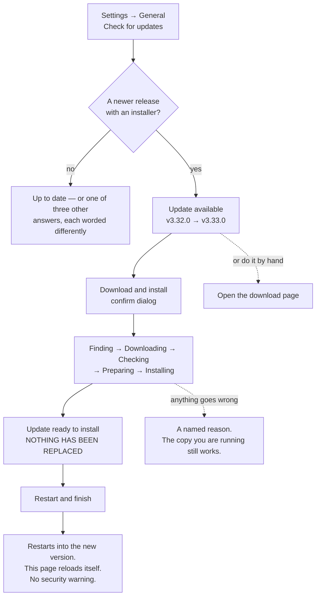

**Step by step, and what each screen means**

| Screen | What has happened | What you do |
|---|---|---|
| **Update available** — both version numbers and the release name | Nothing yet. The app read GitHub's public release list: one unauthenticated request, no credentials, no personal data | **Download and install** — or **Open the download page** if you would rather do it by hand |
| A confirm dialog | Still nothing | Confirm. It deliberately does **not** quote a download size, because nobody knows it until the server has asked; the real number appears on the progress line |
| **Downloading** — a five-step ring, with `58.2 MB of 137 MB · 43%` | Bytes are arriving into a staging folder | Nothing. Use the app; the download continues |
| **Update ready to install** | Downloaded, checked, and **sitting beside the app you are running.** Nothing has been replaced | **Restart and finish**. A few seconds |
| **Restarting** | The swap happened | Nothing — the page reloads itself |

**Four things worth knowing before you press it**

- **Navigating away does not cancel it.** Switch to Chat, or reload the page entirely,
  and the update keeps running — what you were watching is a view of the job, not the
  job. The flip side is that **there is no cancel button**.
- **It will not race your work.** Starting a **new ingest** — single or batch — while the
  download runs is refused with a clear message. In the other direction, if a write is in
  flight when you press **Restart and finish**, the app parks the update at *ready to
  install* rather than truncating a document you have paid to have read; finish it
  afterwards. (**Sync is not blocked** during the download. It is a fast, local-plus-network
  operation rather than a long paid write, so it was not given the same gate — the guard
  that stops the *swap* is the one that matters, and that one does cover it.)
- **There is no security warning on an update**, unlike a first install. A `.dmg` your
  browser downloads is quarantined by macOS; one the app fetched for itself is not.
  Measured, with the browser download kept as the control.
- **Nothing of yours is touched.** Your wiki, settings, API keys and sync configuration
  live outside the application, so replacing it leaves all of them where they were.
  There is no re-setup after an update — only after a *first* install, and only the
  three steps in [§3b](#moving-an-existing-wiki-into-the-app).

**What it checks, and the one thing it cannot**

| Checked | Against |
|---|---|
| The file arrived complete | The byte size GitHub publishes for that download |
| The file is the one GitHub published | **A sha256 fingerprint GitHub publishes alongside it** |
| The app inside is the version claimed | The version string inside the downloaded bundle |
| The bundle is internally intact | macOS's own `codesign --verify` |

What none of that can prove is that **Apple** vouches for the bytes — the app has no
Apple identity yet, so that check is an integrity check, not an authenticity one.
Authenticity rests on the published fingerprint and on the encrypted connection to
GitHub, which is why the fingerprint check is not optional and why the download can
only come from GitHub's own hosts. Nothing on the screen claims Apple checked anything.

**If it fails.** Every failure names a reason in plain language, says what was *not*
changed, and offers both **Try again** and the download page. The copy you are running
keeps working. A download that GitHub answers with a server error, or that drops on its
way out, is **tried three times** (waiting a second, then three) before anything is
reported — so a momentary blip on GitHub's side no longer costs you the whole update.
If it still fails, the message distinguishes the two cases: **GitHub answering with a
server error** — their side, wait a minute or use the release page — from a **connection
that could not be made**, where checking your own network is the right next move. The swap itself is two renames of neighbouring folders on the same disk,
so "half-replaced" is not a state that can exist — either the old app is complete or
the new one is.

**Updating from the menu bar instead.** **The Curator → Check for Updates…** does the
same update, and since **v3.41.0** it shows the same progress. Choose **Download and
Install** in the dialog and a small **Software Update** window opens with the same
five-step ring, the same byte counts and the same sentences as the panel above — it is
reading the same job. The Dock icon carries a progress bar while the download runs, and
macOS shows one notification when the app restarts.

That window is a display and nothing else: it has no buttons, and **closing it does not
cancel the update** (there is no cancel anywhere — see above). If you would rather watch
it in the app, open Settings ▸ General mid-download and the full ring is already there,
because both screens read the same job. If something fails, the window closes and a
dialog gives the same named reason the panel would.

Before v3.41.0, this route showed nothing between the click and the restart. The menu
item's own label did move — it still does, and still says *"Downloading Update… 43%"* —
but a menu you have to pull down to read is not a progress display.

> **What has not been proven, stated rather than implied.** No automated run has ever
> replaced a real installed application: the test suite swaps a real signed *fixture*
> bundle in a temporary folder, and it genuinely replaces it, but the full download from
> GitHub against a live release has not been exercised end to end, and **these screens
> have never been rendered in a browser** — including the new Software Update window,
> whose every decision is executed by the test suite while nothing has yet drawn it.
> Treat your first update as the first real test of it.

> Through v3.40.0, the previous interface at `/old` had no in-app update path — it
> posted to the git updater, which the packaged app refused. That interface was
> deleted in v3.41.0, so there is only one interface to update from now.

> **Rosetta:** an arm64 build running under x64 emulation stays on x64. The app updates
> like for like rather than silently migrating you to another chip's build behind a
> progress bar.

#### Going back to an earlier version

**Updates only move forward.** There is no in-app rollback for either install — going
back is a step you take yourself, and it depends on which install you have.

**If you run the app from a repository checkout** (the browser install), going back
means checking out an older tagged version by hand:

| Step | What you do |
|---|---|
| 1 | Open a terminal in the app folder — `~/the-curator` unless you installed it elsewhere |
| 2 | Find the version you want on [the tags page on GitHub](https://github.com/talirezun/the-curator/tags) |
| 3 | Run `git fetch --depth 1 origin tag VERSION`, replacing `VERSION` with the tag |
| 4 | Run `git checkout VERSION`, then `npm install` |
| 5 | Restart the server |

Two things worth knowing before you do this: the installer that first set up this
checkout clones with `--depth 1`, so most tags are not already on your disk — step 3
fetches the one you name. And not every release carries a tag, so the newest tag can
lag a few releases behind the newest commit on `main`. Your knowledge base, API keys
and sync settings live outside the checkout and are never touched by `git`, so moving
between versions never risks them. To come back to the newest version afterward, just
check for updates again — the normal update flow takes you forward from wherever you
land.

**If you run the packaged Mac app**, going back means installing an older build instead
of running a git command — see [mac-app.md § Going back to an earlier
version](mac-app.md#going-back-to-an-earlier-version).

### MCP bridge — connect a client

**Settings → MCP bridge** is two numbered blocks, and the numbers mean what they
say: you connect a client first, and only then can *"which domain does ‘my wiki’
mean?"* be a question you have. There is a [picture of it](#option-c--my-curator-mcp-frontier-model-research-plus-writes-from-v252)
in §13.

Block ① opens with the one fact a newcomer needs — **"Works with any MCP client
running local servers: Claude Desktop, Claude Code, Cursor."** — thirteen words,
nothing more. Under the **ⓘ** beside it: the link to the
[MCP guide](mcp-user-guide.md), and that ChatGPT's web
app cannot connect because it cannot run a local server (the limit is the
transport, not the vendor), that the bridge is a separate process the client
launches on demand so The Curator need not be running, and that setting up writes
a launch command into the client's own config file — which is why it has to be
re-run whenever your knowledge folder, the app, or Node moves.

Below the lede sits a **monitor** — since v3.65.0, the same recessed, terminal-like
component every live reading in the app now uses — carrying the connection's state
as a coloured word above three lines: the client, the server name, and the
knowledge folder the bridge is pointed at (what used to be one hand-built card with
a pill and a monospace chain, `Claude Desktop → my-curator → <your knowledge
folder>`, is now that component's `head` and `lines`). Four controls sit under it:

| Control | Look | What it does |
|---|---|---|
| **Set up Claude Desktop** / **Re-connect** / **Re-run setup** | Filled violet | Opens the wizard. The label follows your actual state, and it is the one action that finishes this block |
| **Run self-test** | Outlined | Spawns the bridge exactly the way your pasted config does, and reports what answered — the tool count and how many domains it can see |
| **View config** | Outlined | Shows the JSON snippet in place |
| **Copy snippet** | Plain text | Puts it on the clipboard |

Three things in this block are **never** folded, because two of them are outcomes
of something you just did and the third is a warning — each a `loud` line inside
the monitor, never one of its ordinary readings: the **self-test result**,
the **stale-config note** (*"this confirms the bridge software itself works — it
does not check what Claude Desktop has saved"*), and any inline error. A **stale
bridge** — a client that still has an old bridge process open from before your
last update — shows the same way: a warning line inside the monitor naming how
many, how old, and what to do about it, with the remedy sentence coming from the
app itself so it can never drift from what the code can actually do.

Full walkthrough: [mcp-user-guide.md](mcp-user-guide.md).

### Default domain for MCP writes

Block ②. When you talk to Claude Desktop via My Curator MCP and say *"save this to my wiki"* without naming a domain, Claude needs to know which one to use. **Settings → MCP bridge → Default domain for MCP writes** sets that fallback. Its lede is exactly that one line — *"Used when a client says ‘my wiki’ without naming a domain."*

Pick a domain from the dropdown, or leave it on *"— none (require an explicit domain) —"*. Claude's write tools will use it whenever you don't specify; if it's unset, Claude must explicitly ask you which domain to write to.

> Multi-domain users: leaving this unset is the safer default — every MCP write requires you to confirm the domain, and that is what the block's **ⓘ** says: a mis-aimed compile writes its pages into the wrong wiki, and nothing about that is obvious afterwards. Single-domain users can set the default for smoother conversation flow.

### The tool map — what your agents used

Block ③, under the same hairline. Where blocks ① and ② are about *connecting* the bridge, this
one is about what has actually happened over it since — every tool call any client has made,
one small local log.

**Privacy first, because that is the question a log like this raises before anything else does:**
it is kept on this machine, never synced, never uploaded. Each line records the tool's name, the
domain it touched, whether the call succeeded, and how long it took — **never what you asked,
and never what came back.** See [mcp-user-guide.md](mcp-user-guide.md) for exactly where the
file lives and how it rotates.

The block reads as two groups, **read** and **write**, one tile per tool: its name, a one-line
purpose, and a freshness dot + word on
[the same scale as everywhere else in the app](#the-freshness-dot-one-scale-everywhere) — live,
recent, today, week, dormant — computed from that tool's own last call. A **writes** chip marks
the seven tools that can change something on disk; the other seventeen carry no chip, because a
flag on every tile would say nothing. A tool nobody has called yet gets the dashed *unknown* ring
and reads **"not used since this log began · `<age>`"** — deliberately never *"never"*: the log
itself has a start date (it rotates once it passes 1 MB, keeping one previous file), so a silent
tool might simply predate the log rather than have gone genuinely unused.

Above the tiles, two readings speak to your agent's own discipline rather than to the bridge
itself: **"Last session start: `<age>` ago"** — the last time a client opened with
`get_project_context` or `get_working_state`, i.e. whether a session actually resumed from where
things stood rather than starting cold — and **"Last save: `<age>` ago"** — the last
`save_working_state` call, i.e. whether the most recent session wrote a handoff before it
stopped. Neither line is a verdict; they are the same two questions the
[Curator Continuity skill](mcp-user-guide.md#the-curator-continuity-claude-skill--session-handoff-v3170)
already asks an agent to hold itself to.

If no bridge has ever written to the log, the block says so plainly: *"No calls recorded yet.
The map fills as your agents use the bridge."*

**Busiest tools.** Above the tiles, up to eight tools your agents called most, each a depth bar
scaled to the busiest one — and named as such: a row reads *"8 calls · bar scaled to
get_project_context's 151"*, never "8 of 151 calls", which read as a share of that tool's own
calls. The window is the one the log really covers (since v3.76.0): **"Busiest · last 7 days"**
when the log is older than a week, and **"Busiest · last 5 days"** with the note *"Counted over the
last 5 days — the log begins 20 Sep"* when it is younger — the same words Agent connections uses.
Each tile's *"N uses · 7 days"* follows the same rule (*"· 5 days"*), and the tools nobody called are
*"not called by an agent in the last 5 days"*, never "this week".

**Across projects**, the block's own depth bar, reads the same figure the Mac menu bar widget's
own Projects section shows — agent connections that saved a handoff, one bar per project — and both
are scaled to the same denominator, the busiest project, so a glance at either one agrees with the
other. Since v3.76.0 it is **two readings**: the connections (from the usage log, over the last 30
days or since the log began — the note under them says which), and beneath them, separately, the
**saves** (from the handoff journals, over the last 7 days, per tool). The window note sits under the
reading it describes, not under both.

#### "Test all 24 tools" — lighting the map yourself

A fresh install's map is twenty-four dashed rings, and there is nothing you can do about that by
looking at it. Waiting for an agent to happen to call `get_backlinks` is not a plan either. So
the block carries a button — **Test all 24 tools** (the number is read from the bridge, so it
moves when the bridge does) — with one line beside it: *"Runs every tool against a throwaway
copy — nothing of yours is touched."*

That sentence is literal. The run builds a tiny fake knowledge base in your machine's temporary
folder — a handful of pages, one deliberately broken link, one orphan, one summary with its
source file, one project — starts the bridge pointed at **that**, calls all twenty-four tools
against it once, and deletes the whole thing when it finishes. Your own domains folder is neither
read nor written. It costs nothing: every tool is driven on a path that makes no AI call, so
there is no spend and no key is needed.

It takes a second or two. The outcome appears under the button and stays there — never folded
away — as a plain reading: **"24 of 24 answered · 0 refused · 0.4 s"**. If a tool refuses, it is
named with its reason; a refusal is usually a fact about your install rather than a fault, and
the common one is the duplicate-page scan declining to price itself when no AI provider is
connected. If a tool does not answer at all, it is named too, because *"23 of 24"* on its own is
not something you can act on.

Afterwards every tile carries a real reading — and each one is marked **`self-test`** before its
age, like *"self-test · 2 min"*, so a tile the button lit is never mistaken for one your agents
lit. The two readings above the tiles, *Last session start* and *Last save*, deliberately **do
not move**: a self-test is not a session start and it did not write anybody's handoff, and those
two lines are the only place in the app that answers "did my agent resume, and did it save". A
button on a settings screen must not be able to make them say yes.

Run it whenever you want to know the bridge works end to end — after connecting a client, after
moving your knowledge folder, or after an update. Once real agent traffic arrives, those tiles
lose the `self-test` mark on their own, because the mark describes the most recent call.

### Knowledge base folder

**Settings → Knowledge base** is one unnumbered block, **Vault folder** — there
is no step 2 for it to be step 1 of. Its lede is *"The folder every domain lives
in. Point Obsidian at it as a vault."*, and under the **ⓘ**: that every domain is
a folder of plain markdown with no database and no index, that opening this same
folder in Obsidian with *Open folder as vault* renders the wikilinks as the graph,
and that choosing a new folder **points** The Curator at it rather than copying or
moving anything — the move itself is yours to make in Finder.

The block itself is one row: the path in monospace, a filled **Choose folder**
(macOS only) and a plain **Copy** to paste the path into Obsidian. Under it, one
visible line — *"Moving this folder loses nothing; the graph is picked up as-is."*
That one stays in the open on purpose: it is the reassurance that makes the button
safe to press, not an explanation.

Since v3.66.0 the block also shows **Domains in this folder** — one line per
domain, its page count, largest first, each bar in that domain's own [identity
colour](#reading-the-screen) and measured against the largest domain. A domain
whose pages could not be counted reads *not read* instead of a bar. This is the
app's own twin of the menubar widget's Domains section (below) — the same
figures, read the same way, so a Mac-tray glance and a Settings visit never
disagree.

#### GitHub read-only token

Since v3.65.2, **Settings → Knowledge base** also holds a **GitHub read-only
token** row. It lets a project's Documents (Context, step ① — see
[Foundations](#documents--the-files-that-travel-with-a-project)) mirror straight
from a GitHub repository, with no checkout on this computer. The ⓘ beside the
block's title covers both halves of the page — the vault folder above, and this
token.

Press **Add token**, paste a **fine-grained** personal access token and **Save**.
The field then reads *"Saved · ends in …ab12 · fine-grained"* — the token value
itself is never shown again, on this screen or anywhere else. **Test** reads one
branch of a repository you name (`owner/repo`) with the saved token and says
whether it can see it, without mirroring anything. **Disconnect** removes it.

> **Create the read-only token.** A fine-grained personal access token with
> read-only access to the repositories you want to mirror — not a classic one.
> In GitHub:
> 1. **Settings → Developer settings → Personal access tokens → Fine-grained
>    tokens → Generate new token.**
> 2. **Resource owner** — the account or organisation that owns the repository.
> 3. **Repository access** — *Only select repositories*, then pick the
>    repository or repositories whose documentation you want to mirror. One
>    token can cover several.
> 4. **Permissions → Repository permissions → Contents: Read-only.** Metadata
>    read-only is added automatically. Nothing else.
> 5. **Expiry** — fine-grained tokens require one, up to a year. Set a reminder
>    to renew it.
>
> A classic token also works, but the screen warns you before you save one: with
> the `repo` scope it can read *every* repository your account owns — which is
> why a fine-grained token is recommended, and why Personal Sync's own token is
> never used as the default here.

In Context, step ① Documents' **Mirror from GitHub** panel, **READ WITH** offers
whichever of the two tokens are saved, each named by where it lives: this
read-only token (shown by its last four characters) and Personal Sync's token
(the one that syncs your knowledge base — a classic Personal Sync token can read
every repository its account can see, which is why it is never the default).
When a read-only token is saved it is selected automatically; when none is
saved, nothing is selected and *"Add one in Settings"* takes you to this block.
Nothing ever falls back to Personal Sync's token without you pressing it
yourself.

The **Choose folder** button greys out while anything is writing to your wiki, and
an amber banner appears **above** the block's heading saying so. That's deliberate,
and it is why the banner is not foldable — changing the folder mid-ingest would
scatter the rest of that document's pages into the new location.

**Where it starts out** is the third of the four differences between the two installs:

| | Default knowledge folder |
|---|---|
| **The Mac app** | `~/Library/Application Support/The Curator/domains` |
| **The browser install** | your install folder, e.g. `~/the-curator/domains` |

Either way you can point it anywhere you like, and **this screen is how an existing user
moves an established wiki into the Mac app** — it is step one of the three in
[§3b](#moving-an-existing-wiki-into-the-app). The Domains view has a second entrance to
the same action, labelled **Use existing folder**, in its sidebar and on the empty-state
card.

> **A picker is the only way to set this from the current interface** — there is no
> field to type a path into. On Linux and Windows, where the picker does not exist, set
> the folder with the `DOMAINS_PATH` environment variable instead.

#### Pick the folder that CONTAINS your domains

This is the one mistake that costs people an afternoon, so it is worth thirty seconds.

A knowledge folder holds **one folder per domain**, and each of those holds a
`CLAUDE.md` and a `wiki/`. The folder to point at is the parent — the one with the
domain folders inside it.

```
the-curator/
└── domains/          ← ✅ PICK THIS ONE
    ├── articles/     ← ❌ not this
    │   ├── CLAUDE.md
    │   └── wiki/
    ├── business/
    └── projects/
```

Pick `articles` and The Curator looks inside it for domains, finds none, and shows you
an empty list — because as far as the app is concerned, that is what is there.

**And it cannot tell you which mistake you made.** This was measured: an empty folder,
somebody's Pictures folder, a folder picked one level too deep, and a drive that is not
mounted **all produce exactly the same answer — no domains — and are indistinguishable
from each other.** So rather than guess, the app tells you what it looked in:

| What you see | What it means |
|---|---|
| **No domains found there**, with *"Looking in `<path>`"* | The switch already happened. The path shown is what to check — is it the parent of your domain folders? Is the drive mounted? |
| A button: **Go back to the previous folder** | An undo, offered only in this case and when the folder could not be read |
| Your domains appear | Done. Nothing was copied, moved or converted |

Two things about that undo, because "undo" can promise more than it delivers:

- **It restores the folder setting and nothing else.** No file is moved back, because no
  file was moved in the first place — the switch only ever changed which folder the app
  looks at.
- **It does not restore a default domain.** If you had set a default domain in the old
  folder and it does not exist in the new one, that setting is left pointing at a name
  that is not there. Re-pick it in Settings.

The switch takes effect immediately — no restart, no reload. The **Choose folder** and
**Use existing folder** buttons grey out while anything is writing to your wiki, which
is deliberate: changing the folder mid-ingest would scatter the rest of that document's
pages into the new location.

#### Two installs, one knowledge folder

Pointing both the Mac app and a browser install at the same `domains/` folder is
supported, and it is a reasonable thing to do while you try the app. Here is what
actually happens.

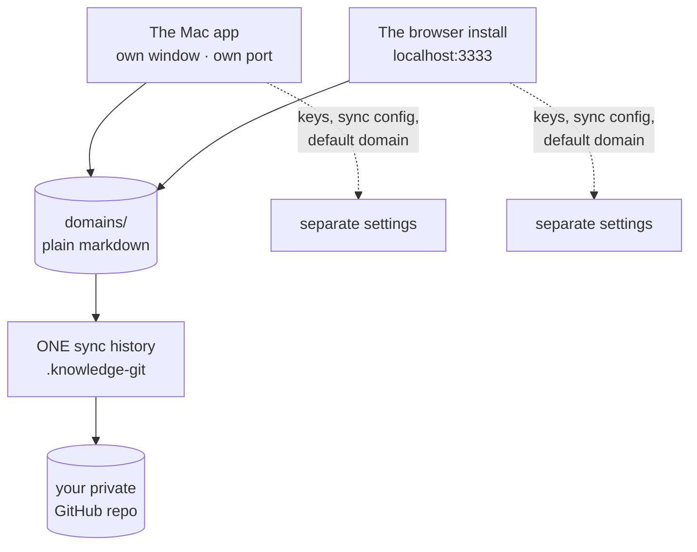

**Shared: the folder, and — since v3.32.0 — the sync history. Not shared: every
setting, and any coordination between them while both are running.**

**Sync joins rather than splits.** If one install already syncs that folder to GitHub
and you connect the second one to the *same* repository, The Curator notices and **joins
the existing sync history instead of starting a second one.** Nothing in your folder is
changed. Point it at a *different* repository and it refuses, by name, rather than
creating two independent histories over one set of files — which is the situation where
a merge can silently replace an edited page. Details in
[sync.md → If another install already syncs this folder](sync.md#if-another-install-already-syncs-this-folder).

**Writing is not coordinated, so run one at a time.** Nothing stops both from running
simultaneously, and two copies writing one wiki at the same moment is not a case either
of them guards against. Each one protects itself, not the other.

**Since v3.46.0 the app at least SAYS so.** When a second Curator is serving the same
folder, both windows show a banner at the top of the screen:

> ⚠️ Another Curator is running over this same knowledge folder (a terminal checkout on
> port 3333). Two apps writing at once can corrupt an ingest — quit one before ingesting.

Read the banner literally. It is **advisory and nothing else**:

- It **does not stop anything.** No refusal, no disabled button, no lock. Both copies
  keep running and both can still ingest — the banner is information, not a guard,
  because running both is a legitimate thing to do while you are trying the app.
- **Dismissing it lasts for that window only.** Reopen the app, or reload the page,
  and it comes back if the other copy is still running. There is no "don't show this
  again", deliberately: the thing it reports is live, so silencing it permanently
  would silence it for a day when it mattered.
- It is checked **once when the screen loads**, not continuously. If you start the
  second copy *after* this window was already open, reload the page (or reopen the
  app) to see the banner.
- It names the **kind** of the other copy and, where it has one, its **port** — which
  together are usually enough to know which window to go and quit. The other copy's
  process id is available too, in the app's log file.

It can also be **wrong in one direction**, and only one: if a Curator was force-killed
(a crash, `kill -9`) and macOS later re-used its process id for something unrelated, the
banner can appear when nothing is actually running. A normal quit clears the record on
the way out, so this is rare. It cannot fail the other way round by design — if the app
cannot find out, it says nothing rather than guessing.

The record it reads lives in
`~/Library/Application Support/The Curator/instances/`, **not** in your `domains/`
folder — so it is never committed, never pushed, and never appears in your sync
pending-changes count.

**Ingests now say where they are.** A large source takes many AI calls, and a rate-limit
pause can add minutes of waiting per call, so a long run used to look like a hang. The
progress line now reads, for example, `Phase 2: writing content, batch 7 of 26… ·
12:07 elapsed · 41 AI calls`, and a pause says which batch it is waiting on. And before
the first AI call, a source at or near the 80,000-character limit gets a heads-up: that
is the size where the page-planning step is most likely to run out of room, and
splitting the source is much cheaper to do before an ingest than after a failed one.

> ⚠️ **The part that surprises people: closing the browser tab does NOT stop the browser
> install's server.** It keeps running in the background at near-zero CPU — that is
> documented, deliberate behaviour, and it is why clicking the Dock icon reopens
> instantly. But it means that if you close the tab and then open the Mac app, **both
> are running.**
>
> To actually stop the browser install: **right-click its Dock icon → Quit**, or press
> `Ctrl + C` in the terminal you started it from. Quitting the Mac app is `⌘Q` — and
> unlike the browser install, it asks first if a write is in flight.

**Neither install can see the other's settings.** Separate API keys, separate sync
configuration, separate default domain. The only thing they share is the folder of
markdown files — which is the whole point.

> If you use the My Curator MCP, changing this folder in the **browser install** makes the
> Claude Desktop entry stale, and the wizard shows you a banner — re-run it. In the **Mac
> app** it does not: the app launches the bridge through a small launcher of its own that
> reads your current setting each time, so the entry has no folder path baked into it to
> go stale. This is the fourth and last of the four differences.

### GitHub read-only token (v3.65.2)

**Settings → Knowledge base → GitHub read-only token.** Lets a project's
Documents mirror from a GitHub repository without a checkout on this Mac —
the credential the Context view's **Mirror from GitHub** panel reads with,
under `tokenSource: 'config'`.

The block is the same row shape as an API-key provider: a status well, a
**Saved**/**Not saved** pill, and the row's actions. With nothing saved it
reads *"No token saved"* and offers **Add token**. Press it and a masked
field appears (the token is never shown once you've saved it) — paste it and
**Save**. The status well then reads *"Saved · ends in …ab12 · fine-grained"* —
only the last four characters, never the value. **Replace token** swaps in
the same field; **Disconnect** removes it.

Once a token is saved, a second row appears: **Test**. Name a repository
(`owner/repo`, or paste its `https://` or `git@` address) and press **Test** —
it makes one read of that repository with the saved token and reports which
repository, branch and commit it can see, or names what went wrong. No token
is sent anywhere except to GitHub itself, and never in the test's own
request — Test always reads with the token already saved on this computer.

A classic token (`ghp_…`) also works, but the screen shows a caution: with
the `repo` scope, a classic token can read **every** repository your account
owns, not just the ones you intend to mirror — which is why a fine-grained
token is recommended, and why Personal Sync's own token is never the
default read source.

> #### Create the read-only token
>
> A fine-grained personal access token with read-only access to the
> repositories you want to mirror. **Not a classic one.** In GitHub:
>
> 1. **Settings → Developer settings → Personal access tokens → Fine-grained
>    tokens → Generate new token.**
> 2. **Resource owner:** the account or organisation that owns the repository.
> 3. **Repository access:** Only select repositories, then pick the
>    repository or repositories whose documentation you want to mirror. You
>    can pick several with one token.
> 4. **Permissions → Repository permissions → Contents: Read-only.**
>    Metadata read-only is added automatically. Nothing else.
> 5. **Expiry:** fine-grained tokens require one, up to a year. Set a
>    reminder to renew it.
>
> Copy the `github_pat_…` value once — GitHub shows it only at creation —
> and paste it into **Settings → Knowledge base → GitHub read-only token →
> Save**. Test it with `owner/repo`. **Disconnect** removes it from this
> computer.
>
> **Why not a classic token:** a classic token only works with the `repo`
> scope, which reads every repository the account owns. A fine-grained
> token can be scoped to only the repositories you name, with read-only
> access to their contents and nothing else — which is why it is
> recommended, and why Personal Sync's token (which needs write access, for
> push) is never the default source for a read-only mirror.

The token is written to `githubReadToken` in `.curator-config.json`, mode
`0600`, through the same atomic writer the API keys use. There is no field
to hand-edit the JSON with — every earlier note in this guide or in
`llm-docs/` describing a hand-edited `githubReadToken` predates this
Settings field (v3.65.2) and is no longer the way to add one.

### Health & scan limits

One unnumbered block, **Semantic-duplicate scan limits**. It caps what a single AI
duplicate scan may cost, and it is used only by the **✨ Find duplicate pages** scan
you start from a domain's health panel ([§17](#17-wiki-health)). Nothing here
affects the free structural health scan.

![Settings → Health & scan limits. Down the left, the icon rail — Chat, Domains and Context, with the theme toggle, Sync (a badge reading 15) and Settings at the foot. The main column reads CONFIGURATION over Health & scan limits. One block, Semantic-duplicate scan limits — 'Caps what one AI duplicate scan may cost.' — holds a card with two rows: Cost ceiling per scan ('Estimated input and output tokens together. Default 200,000 — ≈ $0.04 on Flash Lite 2.5, the model that builds your wiki.') with a field reading 200000 tokens, and Maximum candidate pairs per scan ('After local pre-filtering, only the top N pairs by similarity are sent to the model. Default 500.') reading 500. Below it: 'A scan estimates its cost first, and does not start when the estimate is over the ceiling.' and a Save scan limits button.](images/curator-health-limits.png)

*Two fields in one card, with the Save button clear of it. Before v3.54.0 the
button sat 12px under the second field, close enough to read as part of that
field rather than as the action for both of them.*

| Setting | Default | Raise it when … |
|---|---|---|
| **Cost ceiling per scan** | 200,000 tokens — enough for a full 500-pair scan, about **$0.03** on Gemini Flash Lite (was 50,000 tokens through v3.72.0 — that figure contradicted the 500-pair default and could refuse a scan the pair cap alone would have allowed) | a scan refuses to start on a large wiki |
| **Maximum candidate pairs per scan** | 500 | you want a wider sweep. **Lower** it for a cheaper first look at a domain you have not scanned before |

> **A ceiling refuses before you click; it does not truncate mid-scan.** A scan
> estimates its own cost first, and when that estimate is over the ceiling the
> confirm names both figures, says the scan will not start and that nothing is
> spent, and drops the **Scan** button entirely (offering a link to this
> settings page instead) — so nothing is ever half-scanned and no partial bill
> is run up. That is the whole model, and it is what the block's **ⓘ** says.

Defaults suit domains up to roughly 5,000 pages. The hard caps that are **not**
adjustable — including the 20,000-page refusal — are in
[ai-health.md](ai-health.md#scale-caps-baked-into-the-code).

---

### Trash

*New in v3.76.0.* Deleting a domain, a project or a handoff has not erased anything since v3.73.0 —
the folder is moved to The Curator's trash. **Settings → Trash** is where you get it back.

![Settings → Trash on the demo workspace. Down the left, the icon rail — Chat, Domains and Context, with the theme toggle, Sync (a badge reading 15) and Settings at the foot. The main column reads CONFIGURATION over Trash. Under 'In the trash' — 'Deleted domains, projects and handoffs wait here until you restore them or delete them forever. Nothing is emptied automatically.' — three rows, newest first, each with a Restore button and a trash icon: a handoff test-run in early-computing / exhibit-site, deleted 20 hr ago, from domains/early-computing/state/exhibit-site/test-run/, 1 saved copy; a project prototype-2025 in early-computing, deleted 2 days ago, standing brief · 0 handoffs; and a domain old-drafts (Old Drafts), deleted 3 days ago, 1 page. A closing line says the trash is on this computer only and never synced, and that a restore puts the folder back where it was; the trash folder's path is printed beneath.](images/curator-settings-trash.png)

*One of each kind — a handoff, a project and a domain — on the demo workspace; `node scripts/screenshots.mjs` regenerates it.*

The section lists everything in the trash, newest first. Each row says:

- **what it is** — a *domain*, a *project* (and which domain it was in) or a *handoff* (and which
  domain and project);
- **when it was deleted** — how long ago, and the exact time in UTC;
- **where it goes back to** — for example `domains/research/state/website/`;
- **what it held** — pages, conversations, raw sources and projects for a domain; the standing
  brief and handoffs for a project; the saved copies for a handoff — and its size on disk.

**Restore** puts it back where it came from, in one press. It never overwrites and never merges:

| What you see on the row | Why | What you can do |
|---|---|---|
| **Restore** | The place it came from is free | Press it. The line above the list says where it went |
| **Restore as `<name>-restored`** | Something with that name exists there now — you made a new one after the delete | Press it to bring this one back under the new name, beside the other. Nothing of the existing one is touched |
| No Restore button, and a line saying the domain is gone | A project or handoff whose domain was deleted too | Restore the **domain** first; its row is in the same list. Then this one |
| …saying the project is gone | A handoff whose named project was deleted | Restore the **project** first |
| …saying where it came from cannot be read | A handoff or project deleted before v3.76.0 whose folder name can be read more than one way (a domain or handoff name that itself contains `--`) | Move it back by hand — see below |

A domain restored under a new name is renamed properly — its conversations and page headers
follow the new folder name, and its display name gains *(restored)* so you can tell the two apart.
Restore is refused while something is writing to that domain (an ingest, a compile, an MCP write);
wait for it to finish.

After a restore, the domain is back in **Domains** and a project or handoff is back in **Context**
the next time you open them.

**The trash is on this computer only, and it never syncs.** It lives outside your domains folder on
purpose, so GitHub Sync never sees it. A restored folder is back *inside* the domains folder, so
with Personal Sync on, your next Sync carries it to GitHub and your other computers like any other
change.

**Delete forever** — the trash icon on a row — is the one thing in The Curator that erases data for
good. A card opens saying how many files and how much it frees, and that it cannot be undone (it
does not go to the Mac's Trash, and Sync never had a copy). Type the item's name exactly;
**Delete forever** stays disabled until it matches. There is no "empty the whole trash" button, on
purpose: the trash exists because one click once removed a whole domain. To clear everything at
once, delete the folders in Finder.

**Restoring by hand (the fallback).** The trash is a hidden folder, `.curator-trash`, in your
Curator data folder — its full path is at the foot of the section. In Finder press **⇧⌘.** to show
hidden folders, or use **Go → Go to Folder…**. Each entry is a folder named after what it was, with
`--<date and time>` on the end:

| Entry | Move it back into | Rename it to |
|---|---|---|
| `domains/<folder name>--<time>/` | your domains folder | the folder name |
| `projects/<domain>--<project>--<time>/` | `domains/<domain>/state/` | the project name |
| `scopes/<domain>--<project>--<handoff>--<time>/` | `domains/<domain>/state/` (when the project is the domain's own) or `domains/<domain>/state/<project>/` | the handoff name |

A small `<entry>.origin.json` file beside a folder records where it came from; you can delete it
along with the folder.

## 16b. Choosing your AI model

For most of its life The Curator ran exactly **two** models — one per provider, both the cheapest tier. That kept ingesting a large library affordable, and it is still what you get if you never touch anything. But it also meant that if you wanted more capability out of a big wiki, and were willing to pay for it on your own key, there was no way to ask.

Now there is. A list of **hand-measured models** is on offer across all three providers, and it grows as more are measured — the live list is the one in Settings, so this guide doesn't print a running total. Every model on it was measured by hand against The Curator's real ingest prompt before being offered, and **all but one of them can build your wiki** — the exception is `gemini-3.5-flash-lite`, which was measured and found unfit for ingest specifically, and is offered for chat with that reason on its row. On top of that hand-measured list, an OpenRouter key can fetch a much larger **chat-only** list from OpenRouter's own catalogue; the third provider plays by slightly different rules — see [OpenRouter](#openrouter--one-key-two-lanes-and-a-model-list-you-refresh) below.

> **Nothing changes unless you change it.** The defaults are still `gemini-2.5-flash-lite` and `claude-haiku-4-5`, still the cheapest model on their provider, and a user who picks nothing runs exactly what they ran before — same model, same cost, same behaviour.

### AI jobs and the one model *(v3.67.0)*

**Settings → Providers & keys** block 2, **Your AI model**, is the one model every AI job in the
app runs on: Ingest, Compile, Wiki Health, Shared Brain and Suggest a reading plan. Its **Used by**
row lists each of those jobs, where you start it, and when its cost is shown. Chat stays separate
— you pick any connected model per message, in the composer, as described above. The badge
**measured for the build lane** means The Curator measured this model by hand against its real
ingest prompt; the other jobs are the same kind of structured-output task and inherit that
measurement rather than being measured again separately.

**Under every AI action, one line says which model will run it, roughly how many tokens it takes
and what it should cost**, with a **Change model** link to Settings → Providers & keys — for
example *"Runs on Flash Lite 2.5 · ≈6k tokens · ≈$0.0011 · Change model"*. After the run, a second
line says what actually ran and what it cost — *"Ran on Flash Lite 2.5 · 5,812 in / 640 out ·
$0.0008"*. A model with no published price still runs; the line says *"price not published"*
instead of a dollar figure. **With no provider key saved, every AI action stays visible but
disabled**, and its line links to Providers & keys instead of showing a cost.

This applies wherever an AI action appears: Wiki health's three ✨ Quick-maintenance actions
(each still shows its own estimate before it runs and what it actually cost after), System
check's **Verify AI connection**, Chat's **Compile to Wiki**, Ingest's single-file and batch
estimates, and Context step ①'s **✨ Suggest with AI** reading plan.

### The principle: two jobs, not one setting with two halves

Almost every question people have about this screen dissolves once you see that the app asks a model to do **two completely different jobs**, and that the stakes are wildly lopsided between them.

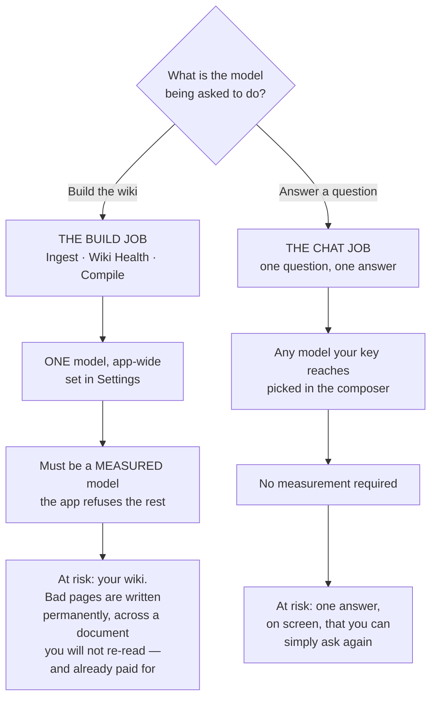

That asymmetry is the whole design. A bad chat answer is prose you can see and re-ask. A bad ingest writes wrong pages into the thing this app exists to protect.

| | **The build job** | **The chat job** |
|---|---|---|
| **What it covers** | Ingest, Wiki Health AI scans, Compile to Wiki | The chat messages you send |
| **Where you choose** | **Settings** — one list, one choice | The **model picker in the chat composer** |
| **How many models** | Exactly **one**, app-wide | One per message, changeable mid-conversation |
| **What is eligible** | Only models measured against the real ingest prompt | Anything your saved key reaches |
| **How long it lasts** | Durable — saved on this machine, survives restarts | Sticky in this browser until you change it |
| **If it goes wrong** | Pages written wrong, permanently | One answer, re-askable |

**The build job is one setting, not three — deliberately.** You cannot give ingest one model and Health another. Health scans read the same wiki ingest wrote, in the same shapes, and ask the same kind of judgement of it. Splitting them would double the decisions and the prices you have to reason about, and let your wiki be built and maintained by two models that disagree about it. It is also not a convention that could quietly drift: the parts of the app that build your wiki are written so a per-feature model override is not merely unused — it cannot be expressed, because there is no argument to carry it.

**And the two jobs cannot leak into each other.** Picking an expensive model for one hard chat question must not quietly change what your next ingest costs, and it doesn't: the composer choice is attached to a single chat request and stored in your browser. It never touches the server-side build choice.

**The build lane is one setting, not three — and that is deliberate.** You cannot give ingest one model and Health another, because there is nothing sensible to gain from it and a great deal to lose. Health scans read the same wiki that ingest wrote, in the same shapes, and ask the same kind of judgement of it — the work of noticing that two pages describe one thing is the same work as deciding they were two things in the first place. Splitting them would double the number of decisions you have to make, double the number of prices you have to reason about, and let your wiki be built and maintained by two models that disagree about it. So there is one choice, it is the one you already made when you picked a provider's model, and it covers the whole build lane.

It is also not a convention that could quietly drift. The parts of the app that build your wiki are written so that a per-model override there is not merely unused — it cannot be expressed at all, because there is no argument to pass it through. Health cannot end up on a different model from ingest unless someone first adds parameters that do not exist there today.

The split between the two lanes is about money and reversibility. Ingest is by far the biggest consumer of tokens — a batch of PDFs on Opus is a genuinely different bill from the same batch on Flash Lite. Chat is cheap and reversible: one question, one answer, and you can ask it again on another model to compare. So trying an expensive model on a single chat must not quietly change what your next ingest costs, and it doesn't — the composer choice never touches the Settings choice.

Which gives the two answers people most often want:

- **"If I pick Sonnet 5 in chat, does my next ingest cost more?"** No. Nothing you do in the composer reaches ingest, Health or Compile. The composer choice is attached to one chat request and stored in your browser; it changes nothing on the server.
- **"I chose a model under Anthropic once, but Gemini is building — what runs my ingest?"** Gemini's. **This used to be invisible, and now it is not.** Older versions kept a separate choice under each provider, so a choice made under a provider that wasn't active sat there governing nothing and saying nothing. Choosing a model is now **one act**: picking a model from the single list sets the provider and the model together, so a choice cannot land inert. Any leftover choice from the old per-provider arrangement is still on disk, and Settings now names it explicitly — it tells you which model you also chose, under which provider, that it governs nothing while your current model is building, and that picking it from the list would switch you over and put it in charge.

Two more consequences worth knowing:

- The composer choice is **sticky per browser, not per conversation.** Pick Opus in the composer and every later chat message from that browser uses Opus, across conversations and across restarts, until you pick something else. There is no "back to default" row in the composer menu — to go back, pick the default model (the cheapest one, at the top of its provider group) explicitly.
- The composer choice **overrides** the Settings choice for chat. If Settings says Sonnet 5 and the composer says Haiku 4.5, chat runs Haiku 4.5.

### Why a sticky chat choice is safe — every answer names the model that produced it

Stickiness is a real decision, not an oversight, and it cuts both ways. In its favour: picking a model for a hard question is a considered act, and silently resetting it after one message would throw that away and make you re-pick every time. Against it: a forgotten selection quietly spends more than you meant to. The cost of forgetting is **cents per message** rather than the dollars an ingest can run to, so the balance lands on respecting the choice.

But that balance only holds because of the safeguard beside it: **each answer records and displays the model that actually produced it**, so a forgotten selection cannot hide. The label is not a repeat of what you picked — it is read back from the provider's own billing information for that call, which means it survives the cases where the two differ:

- If the model you asked for is unavailable — its provider has no key saved, or it isn't one of the models on offer — the request is **not refused**. It quietly falls back to that provider's default and still answers you, and the answer says so, naming both what ran and that it differs from what you asked.
- Older messages, written before this existed, carry no recorded model. They show the provider's name and nothing more. They are **never** relabelled with whatever is currently in the dropdown — a label that guessed would be worse than no label, because you would have no way to tell a guess from a fact.

The practical upshot: you never have to remember what the dropdown says. Scroll up and the thread tells you what answered each question.

### What that small dollar figure next to the model name means

Beside the model name on each answer, you'll often see a small cost figure too — hover it and you get the exact token counts (input, output, and cached, if there were any) that produced it.

**It shows only when it can be stated as fact, and shows nothing otherwise.** If anything needed to work it out is missing — your provider didn't report usage for that call, the model isn't one this app has a published price for, or you're looking at a message from before this existed — you see no figure at all. Not "$0.00", not a dash, not an estimate. A wrong number about money is worse than an absent one, and this app has shown a real cost as `$0.00` before by accident; it isn't going to invent one on purpose.

**Why one model can cost so much more than another for the same question:** mostly the per-token price, which really is dramatically different across the models on offer — see [Cost, honestly](#cost-honestly) below for the full picture. Two real measurements from the same conversation make it concrete: the cheapest Gemini model answered for about $0.0001 (494 input / 98 output tokens); Opus 5 answered the same question for about $0.01 (998 input / 247 output tokens) — roughly **126 times more**. Opus also wrote a longer answer here, but token-for-token the price difference alone would still have made it dozens of times more expensive.

**Since v3.72.0, the figure is what the answer actually cost, not today's rate — for any answer given from that release on.** Each answer's price is recorded and fixed the moment it is written: hover it and the disclosure reads *"Priced when answered 3 days ago: $0.10 in / $0.40 out per 1M tokens"*, and that stays true no matter how the catalogue's prices move afterward. A couple of the Gemini models on offer run a temporary discount with a stated end date ([The two promotional prices](#the-two-promotional-prices)); reopen a v3.72.0-or-later answer from one of them after the discount ends and it still shows what it actually cost at the time, not the higher standing price.

**Older answers — written before an answer's price was recorded — still show today's rate, and say so.** The figure there carries a visible *"at today's price"* qualifier, because that is the only rate The Curator can still tell you: nothing rewrites the message to invent a price it never recorded, and nothing pretends today's rate is what you were actually billed. A free model's answer always just reads **free** — recorded or not, there is no rate to disclose.

### Picking, pinning, and following the default

Settings opens with a plain statement of **which model is building your wiki right now** — its provider, its model, who measured it, and, crucially, **why it is the one running**. That last part is the question the old per-provider arrangement could never answer. There are four possible reasons, and they are genuinely different situations:

| Why this model is running | What it means | What to do |
|---|---|---|
| **You chose it** | You picked this model and it is in charge. App updates will not move you off it. | Nothing. |
| **It is the app default** | You have picked nothing, so the app is running its own pinned default — the cheapest model on the active provider. A future release can move you onto a newer one. | Nothing, unless you want to take control. |
| **An environment variable is overriding everything** | A developer escape hatch (`LLM_MODEL`) is set on this machine and outranks anything clicked in Settings, by design. | If you didn't mean to, unset it and restart. |
| **You chose a model, and the engine is not using it** | Your choice could not be honoured — the model was withdrawn, pulled after a bad measurement, or is one the app refuses for building. The app fell back rather than failing. | Pick again from the list. The worst case of a refusal is that you spend *less* than you asked for, never more. |

Below that statement is **one list, not one list per provider** — every model you can build with, across every provider whose key you have saved, with the provider shown as a chip on each row. Picking a row does both halves at once: it sets the model **and** makes that provider active. That is the whole reason the list is now cross-provider — a choice cannot land somewhere it doesn't govern.

**Picking today's default counts as choosing it.** If you pick the model the app was already running by default, you are no longer following the default; you have chosen that exact model and it will stay that model. To go back to following, use the button that clears your choice — it appears only when there is something to clear.

If a model you pinned is later withdrawn — a provider retires it, or we pull it after a bad measurement — nothing breaks. The app quietly falls back to that provider's default, which is its cheapest model. The worst case of any refusal is that you spend *less* than you asked for, never more.

### Why you can't change the model during an ingest

While anything is writing to your wiki, the **Use this** buttons grey out, and the server refuses the change even if you get a click in. That refusal is correct, for three separate reasons:

1. **A half-and-half document.** The model is looked up fresh on every AI call, and a multi-phase ingest makes twenty or more calls over several minutes. A change mid-run would plan the document's structure on one model and write its pages on another.
2. **A wasted cache.** On Anthropic, The Curator reuses a cached block of shared instructions across the calls of one ingest — a saving of roughly 50–70% on those calls. A different model is a different cache, so every cached read becomes a full-price write. The saving inverts into a surcharge.
3. **Wrong arithmetic.** Cost is priced per model. Changing model mid-batch makes the spend figure — and any budget cap you set — wrong.

Wait for the run to finish. The chat composer's dropdown is unaffected and stays usable throughout — it only remembers a preference in your browser and attaches it to your next chat message; it changes nothing on the server, so there is nothing that could land mid-run.

### The honest limits — what we have measured, and what we have not

This is the part most model pickers leave out, and it is the part that should decide how much weight you put on anything else on the screen.

| | Roughly how many | What that means |
|---|---|---|
| **Models we have hand-measured** | **19** — 7 Gemini, 7 Anthropic, 5 OpenRouter routes | Run against the app's real ingest prompt, repeatedly. Everything on their row is an observation. |
| **Models reachable through an OpenRouter key** | **~200**, and the number moves daily | Their price and published capabilities come from OpenRouter. **Nothing about how well they do our job has been tested.** |
| **Models you can measure yourself** | Any OpenRouter model, on your own wiki | Your evidence, kept as a separate claim from ours. |

So the great majority of what you can pick in chat is **unmeasured — which means unmeasured, not bad.** Nobody has tested two hundred models against a specific application's prompt, and pretending otherwise would be the dishonest option.

**There is deliberately no "best" or "most capable" sort. This is a finding, not a missing feature.**

The obvious idea is to rank the catalogue by something — price, size, recency, vendor reputation — and let you sort by quality. It was tried, and the available proxies were measured to *lie*:

- One model passed **every** structural check, was genuinely **fast**, and returned **zero usable outputs in nine runs**.
- Another model failed **nine times out of nine** while its own **free sibling** — same base model, different routing — passed eight of nine. Model identity did not determine reliability; **routing** did.
- Price, parameter size, release date and vendor each pointed the *wrong way* on this evidence.

Ranking the rest by any of those would be a confident-looking guess wearing the costume of a measurement, on a screen where you are deciding how to spend your own money. So the sorts offered are ones that are simply **true** — cheapest, dearest, newest, largest context window — and a model missing the value a sort needs is **not invented one**: it keeps its place at the end, and the count tells you how many are unranked.

### Why these models — the selection criteria

Every model on the list was **probed live against The Curator's real ingest prompt, on real prose** — not against a toy *"return this JSON"* test. That matters more than it sounds: several of the defects below only appear under a realistic prompt and would have passed a simple probe green. Prices were read off the providers' **live pricing pages**, never a cached copy, because a cached table once carried a scheduled price change that had already been cancelled.

Five things were measured, and each row in the list shows what came back:

| Criterion | What it means for you |
|---|---|
| **Price** | US dollars per million tokens, in and out, **as billed today**. This is the number on the row. |
| **Maximum output tokens** | The hard ceiling on how much the model can write in one call. A bigger ceiling means a long document is less likely to be cut off mid-write. Anthropic ranges from 64,000 to 128,000 depending on the model; every Gemini model on offer is 65,536. |
| **Thinking tokens** | Some models reason before answering. **Those tokens are billed as output, and they come out of the same budget as the answer** — so a thinking model both costs more than the visible answer suggests and has less room left for the answer itself. Rows that do this are marked **thinks**. In *chat* on OpenRouter you can now watch that reasoning happen ([§9](#watching-the-answer-arrive--streaming-and-the-thinking-region)); everywhere else — ingest, Health, Compile, and chat on Anthropic or Gemini — it stays invisible. Being able to see it does not make it cheaper. |
| **JSON reliability** | Ingest asks the model for structured data. Some return clean data; some wrap it in formatting that has to be repaired first (harmless — the repair is routine); one returns data that *cannot* be repaired some of the time. |
| **Outline coverage** | How many wiki pages the model plans from the same source document. More pages means a finer-grained, better-connected wiki. This is the axis where the price and the result diverge most sharply. |

Two rules keep the list honest, and they're worth stating plainly:

- **A model is not offered for a feature it has never been measured against.** Two real, documented, priced Anthropic models are deliberately *absent* because nobody has run them against the actual ingest prompt. Guessing would mean guessing about your bill.
- **No working model is hidden.** If a model measured badly, it is shown **with the reason on screen** rather than quietly removed. Deciding for you what you may spend your own API key on isn't our call; telling you what we measured is.

### What a model row tells you

The labelling was overhauled to stop a long list reading as a wall of warnings. **The measurement vocabulary in particular collapsed from several competing labels into one chip with three values** — because on a fetched catalogue of roughly two hundred models, "we have not measured this" was true of nearly every row, and a warning that appears on almost everything stops being read at all.

**The measurement chip — one chip, three states, and it is not a quality score:**

| Chip state | What it claims | What it does **not** claim |
|---|---|---|
| **Measured by The Curator** | We ran this model against the real ingest prompt ourselves. | — |
| **Measured on your wiki** | *You* ran it, on your own pages, and it came back clean. Deliberately kept as a separate claim from ours. | That we endorse it. Your evidence and our evidence are different things and stay apart. |
| **Not measured** | Nobody has run it here. | **That it is bad.** Unmeasured is unmeasured. Most of the catalogue sits here simply because nobody has tested two hundred models. |

**Other things a row can carry:**

| Marker | Meaning |
|---|---|
| **provider chip** | Which provider the row belongs to — needed now that the build list is one cross-provider list. |
| **builds** | This model **can** build your wiki. In the *All models* table it is a chip under the name and a coloured rule down the left edge of the row, so you can see the lane without reading across to the last column — which, in a narrow window, scrolls out of view. It says nothing about price: a free model and a $25 one in the same lane look identical. |
| **building now** | The one model that **is** building your wiki. Same colour, stronger: a thicker rule, a tinted row, and the word changes. There is exactly one of these. |
| **in use** | This is what is actually running right now. |
| **your choice** | You picked this one, so an update won't move you off it. |
| **cheapest** | The least expensive model available. A reference point for the rows near it. |
| **out-performed** | Another model at **exactly the same price** measured better on every axis tested. Pick the sibling named instead — you pay the same either way. |
| **failed on your wiki** | You tested it yourself and it did not come back clean. Kept on purpose, so you don't spend the same time re-testing it next month. |
| **price** | Per million tokens in and out, as billed today — or **free**, where a model genuinely costs nothing. A promotional price that is due to rise says so. |

Below the markers, each row carries **one plain line** rather than a paragraph — at most three clauses, in a fixed order: **the reason for any warning first**, then roughly how many wiki pages the model plans from one source, then how fast it answered when measured. A clause whose measurement is missing is simply left out; it is never printed as a zero. The full measured note is still there in its entirety, one click away on the row — **except the warning reason, which never hides behind that click**, because a warning behind a click is not a warning.

> **Two labels were removed, and one rule behind them was not.** The old **caution** badge is gone — its reason now leads the plain line instead, where you actually read it. The old **chat only — not for ingest** badge is gone too, because it was true of nearly every row in a fetched catalogue and had become noise. **The rule it described is fully intact and is enforced on the server**, not merely displayed: a model that isn't fit for building still cannot become your build model, whatever any list looks like.

**What "measured" is actually nine calls of.** Every "Measured by The Curator" chip comes from the same nine runs of the real ingest prompt against a fixed set of real pages — never a synthetic benchmark — and a model measured for one job (say, ingest) carries that reading into the others (Wiki Health, Compile) rather than a second run, because they are the same task class: read a document, plan structure, write pages. **It is a screen, not a guarantee** — nine runs describe what a model tends to do, not what your next call will do.

**Settings and the chat composer deliberately show different amounts.** Settings is a screen you open to manage models and can afford a fuller row; the composer is a menu you open mid-conversation, so it keeps the warning and the speed and drops the rest. Both use the same words for the same facts, computed once in one place so the two cannot drift apart. That is intentional, not a discrepancy to fix.

![The build-lane model list in Settings → Providers & keys, opened from 'Change… every model that can build your wiki', on an install with a Gemini and an Anthropic key ('13 measured for the build lane'). Each row has an expand arrow, a display name, the model id in monospace, a provider chip and a 'measured by The Curator' chip, a line with any warning and the pages it plans per source, the price per 1M tokens with the dates the price was checked and the model measured, and a Use this button. The first row, Flash Lite 2.5 (gemini-2.5-flash-lite), is tinted green, marked 'in use' and 'Building your wiki', $0.10 in · $0.40 out, 18-20 pages. Below it Flash Lite 3.1, Flash 2.5, Flash 3.7 and Flash 3.6 (the last two noting the promotional price rises on 1 Jan 2027), Flash 3.5, then Anthropic's Haiku 4.5, Sonnet 5, Sonnet 4.6, Sonnet 4.5, Opus 5, Opus 4.8 and Opus 4.5 (with an 'out-performed' badge); rows with a caveat lead with a small warning triangle.](images/curator-model-picker.png)

*Part of the build list, on an install with a Gemini and an Anthropic key. Each row's warning leads the plain line rather than hiding behind the expand arrow, and the price is always stated with the date it was checked. The Chat section below the list is the other half of the two-lane split described above. Shown on the synthetic demo workspace; `node scripts/screenshots.mjs` regenerates it.*

### Rows are short by default now, and the note is one click away

Each model used to print its full measured note — several sentences — directly in the list. Once OpenRouter's live catalogue landed, nearly every fetched model carries a flag (none of them has been measured against ingest yet), so the list became a wall of paragraphs. Nothing was shortened or deleted: the note is unchanged and still shown in full, just no longer inline.

A collapsed row now shows only what a choice needs — the model, its id, the price billed today, any promotional-rise notice, its badges, and a short derived line (the reason for a warning, then how fast it answered when measured, when either is known). Click the row to open it and read the full note plus any other measured detail. The **warning reason never hides behind that click** — if a row is flagged, the reason is on the collapsed row itself.

**Settings and the chat composer deliberately show different amounts.** Settings is a screen you open to manage models and can afford a fuller row; the composer is a menu you open mid-conversation to switch one, so it drops the extra detail and keeps just the warning and the speed. Both use the same words for the same badges and the same underlying measurements — they just show different amounts of them. This is intentional, not a discrepancy to fix.

**Finding a model in a long list.** There is **one** list — the table under *All models*, across every provider you have connected — and its controls sit above it: search, a sort, a provider filter, and the lane and price facets with live counts. (Until recently each provider also had its own collapsed copy of that list, with its *own* search box and sort. Two searches over the same models is one search too many, and the duplicate is gone.)

- **Search** matches a model's id or name, including the vendor prefix (`moonshotai/…`) — so typing a vendor name works without a separate vendor menu.
- **Sort** offers **cheapest** (default), **dearest**, **newest**, and **largest context window**. There is deliberately no "most capable" sort — we have real capability data for a small fraction of the catalogue, and this week's own measurements showed price, size, recency and vendor each predicting the *opposite* of what actually happened on a real test (a fast, well-priced model that returned nothing usable in 9 of 9 runs; a paid model that failed where its own free sibling passed). Ranking the rest by a proxy would be a confident-looking guess dressed up as a measurement. A model with no published date or context size just isn't ranked by that sort — it keeps its normal place at the end, and the bar tells you how many.
- **Measured** narrows the list to models The Curator itself has actually run against its ingest prompt — not a model you tested yourself on your own wiki, which is a real but different measurement and stays badged separately.

### What the test panel tells you while it runs

The measurement is nine runs, and on the slowest models a single run has taken over six minutes — so what the panel says while nothing appears to be happening matters more than what it says at the end.

- **It names the run that is happening, not the runs that have finished.** It used to read **Run 0 of 9** until the first run settled, which on a slow model meant several minutes of a panel that looked stuck. It now opens on *Run 1 of 9 — waiting for the model*, with **an elapsed clock** and the point at which that call gives up. Nothing is predicted: as soon as one run has actually completed, the clock is replaced by a projection built from it.
- **A run that fails says what the provider said.** A wrong key, a rate limit, a model the router has withdrawn — these used to be one word, *FAILED*. The panel now carries the provider's own message, and a button to pick a model that has already been measured, because a model failing its probe is usually the moment to stop.
- **A run the server gives up on says so, and says what was recorded.** The probe stops itself when a model burns its whole output budget on hidden reasoning several times over, or when the provider rate-limits it. Those are different findings and they are not described the same way: a rate limit is a fact about the queue and **nothing is recorded against the model**, while a budget burn is an observation about the model on your wiki and is kept.
- **Stop still stops it**, unchanged. A cancelled run is never stored — it measured nothing, and writing a stub over a real earlier result would lose evidence you paid for.
- **It says when it has finished.** The panel used to simply vanish when the ninth run landed: nothing announced the end, and the only evidence was a lane cell changing somewhere in a two-hundred-row table. It now ends on a plain sentence — *"Done — no defect found in 9 runs. This model can now build your wiki."*, with the **Use for building** button right there, or *"Done — N of 9 runs failed; it stays chat-only."* with the reason under it — and stays on screen until you close it. The measured detail (counts, planned pages, speed, cost) is unchanged and sits directly above it. A rate-limited run says *"Done — nothing was measured"*, because that is a fact about the queue and not about the model.
- **Nothing you have open closes itself while it runs.** Each progress update repaints the screen, which used to shut every ⓘ explanation and every expanded row you had opened. Whatever you open stays open.

### Why some models are flagged

Two examples, because the principle matters more than the specifics:

**`gemini-3.5-flash-lite` is offered for chat, but the app will not build with it.** In 2 of 9 live runs against the real ingest prompt it returned structured data that neither the parser nor the repair pass could fix — a genuine generation defect, not a length problem the app could work around. Chat doesn't ask for structured data at all, so it's unaffected and the model stays genuinely useful there. It also happens to cost **exactly the same** as `gemini-2.5-flash`, which was clean on every run of the identical test and plans wider outlines. So it is flagged, and its cleaner twin is one row away.

**`claude-opus-4-5` is offered but marked **out-performed**.** At the identical $5 / $25 it is behind `claude-opus-5` on all three measured axes: half the output ceiling, formatting that needs repair, and 12–13 planned pages against 25–27. It plans more thinly than `claude-sonnet-5` does at two-fifths of the price. There is no measurement supporting the choice — but it is still on the list, labelled, because it is your key.

**This is a rule, not a label — and it survived the labels being removed.** There was a time when "not for ingest" was a badge and nothing more: you could make such a model your build model anyway, and the app would let you, with the warning sitting on the same screen. That is long fixed, and it is enforced **on the server**. The badge itself has since been retired from the interface — on a fetched catalogue of ~200 models it was true of nearly every row and had become noise — but nothing about the rule changed. A model that is unfit for building still cannot become your build model, whatever the list looks like; if you had already chosen one, the app quietly builds with the default instead. And it stays fully pickable for chat, which was always the point.

### OpenRouter — one key, two lanes, and a model list you refresh

**OpenRouter is an aggregator**, not a vendor: one key, one account, and models from many different companies behind it. That is genuinely useful — it is the cheapest route into this app, and one of the models it reaches is free — and it is why it plays by slightly different rules from the other two.

**How many models that actually means here depends on the lane, and the gap is enormous.** A set of OpenRouter routes has been measured against The Curator's real ingest prompt, and only a measured model may **build your wiki** — either measured by us, or [measured by you against your own wiki](#test-a-model-on-your-own-wiki). For **chat**, the app fetches OpenRouter's own live catalogue on demand and offers everything that survives a set of structural checks. On one measured refresh (28 August 2026) that turned 387 models listed by OpenRouter into **189 added here**, taking the picker from 3 models to 192.

Those figures are a measurement, not a promise, and this guide will not print a standing number: OpenRouter's catalogue moved by **seven records inside five hours** on the day this was written. What is stable is the *method* — see [Refreshing the model list](#refreshing-the-model-list) below — and the split it produces: **OpenRouter tells us what a model costs; only we can measure whether it does our job.**

**Read this first: OpenRouter can now build your wiki — but saving its key does not switch you over to it.**

Ingest, Wiki Health scans and Compile all run on models measured against The Curator's real ingest prompt, and **several OpenRouter routes have been measured that way** (see [The measured models](#the-measured-models-and-which-to-pick) below). Since v3.16.0 you can also [measure one yourself, against your own wiki](#test-a-model-on-your-own-wiki). So:

- OpenRouter is available for **chat**, as before.
- It is now **also** available for ingest, Wiki Health and Compile.
- **Saving an OpenRouter key does not change what builds your wiki** — the same rule as Gemini and Anthropic since v3.45.0. Connecting a provider connects it; choosing a build model is what moves the lane.
- To build with it, pick one of its models under *What builds your wiki*.

**The practical consequence, stated plainly:** if you have a Gemini or Anthropic key that has been building your wiki, and you save an OpenRouter key to try a model in chat, **your next ingest is still built by exactly what built the last one**. Before v3.45.0 it was not — it silently moved to `upstage/solar-pro4`, a different model from a different vendor at a different price. If you *want* OpenRouter to build, choose one of its models deliberately; the model named under *What builds your wiki* is always the truth.

If OpenRouter is your **only** key, you can now run the whole app on it, which was not true before.

#### The measured models, and which to pick

Each was run **nine times** against The Curator's real ingest prompt — the full thing, roughly 341,000 characters assembled from a real wiki, not a toy test — and the same prompt, byte for byte, went to every candidate, so these numbers compare to each other honestly.

The three below are the ones with published numbers in this guide and cover the three reasons you'd pick differently — best all-round, cheapest, and free. More OpenRouter routes have since been measured and admitted the same way — a Kimi route and a GLM route, each with its own measured trade-off written on its row — and several that measured *clean* were still refused, because their price varies by which endpoint serves the request and this app will not quote a number it would be making up. The list in Settings is the live one, and this guide deliberately doesn't print a running count of it.

| Model | What it's for | Measured |
|---|---|---|
| **Solar Pro 4** — `upstage/solar-pro4` | **The default.** Best all-round of the three. | Clean JSON on **9 of 9** runs with no repair needed; plans a median of **23** pages per document. **$0.09 / $0.36** per 1M tokens. |
| **Granite 4.0 H Micro** — `ibm-granite/granite-4.0-h-micro` | **When cost dominates.** Also the automatic backup if the default ever disappears. | Equally clean — **9 of 9** — but **thin**: a median of **9** pages where Solar plans 23. **$0.017 / $0.112**, the cheapest model The Curator offers anywhere. |
| ~~MiniMax M3 (free)~~ — `minimax/minimax-m3:free` | **Withdrawn.** OpenRouter removed the free version (it now 404s with a pointer to the paid `minimax/minimax-m3`). No longer offered for build or listed as free; a stored pick of it falls back to Solar Pro 4 and Settings tells you your pick is not in use. | **8 of 9** runs clean, 1 needed the repair pass, none unusable; median **21** pages. No price at all. (Historical — measured before withdrawal.) |

Two things are worth reading off that table rather than skipping:

- **Fewer planned pages means a less detailed wiki from the same document.** Granite's median of 9 against Solar's 23 is not a rounding difference — it is the difference between a thorough wiki and a sketch. Pick it when cost genuinely dominates, not by default.
- **Solar Pro 4 costs about the same as the cheapest Gemini option on input and rather less on output** — **$0.09 / $0.36** against Gemini Flash Lite’s **$0.10 / $0.40** — at wider coverage (a median of 23 pages per document against 18–20).
  > **This figure was wrong here until it was billed.** The table quoted **$0.03 / $0.12** — OpenRouter’s published price for the model — and a cold run’s own `usage.cost` came back at **three times that**, because what bills you is the ENDPOINT that serves the request, not the model’s headline. It is the same finding v3.16.0 recorded when it refused three otherwise-clean models on price honesty, and this guide said "roughly a third the price of Gemini" on the strength of the quoted number. It is not; it is close to level on input. **A price you have not been billed is a quotation, not a measurement.**

**A note on the free one (historical — since withdrawn).** While it was offered, it was genuinely free and genuinely useful, but free models draw on a **shared pool**, so whether one answers is not just about your account. In a ten-minute availability check during measurement (27 Aug 2026), this model answered **8 of 8** attempts while **three of its free siblings answered 0 of 8**, all reporting they were rate-limited upstream — same account, same moment. There is currently no hand-listed free model for building the wiki; free `:free` models from OpenRouter's own catalogue still appear in the **chat** model list after a catalogue sync. Combined with a large ingest being **40+ separate calls**, treat free as a real option when one is offered, not a guaranteed one.

#### Why two standards — and why it is not fussiness

The consequences are not symmetrical.

- **A bad chat answer costs you one answer, and you can see it.** It's prose, on your screen. Ask again on a different model.
- **A bad ingest writes wrong pages into your wiki, permanently, across a document you won't re-read — and you've already paid for it.** Your wiki is the thing this whole app exists to protect.

So the build lane admits only what has been measured, and the chat lane admits what your key unlocks, **labelled as unmeasured**. Two different bets, two different downsides.

#### Can the app just test a model for you? Now, mostly, yes — on your own wiki

The obvious idea — probe the model, and let it in if the probe passes — was rejected in the previous release, and one of the four reasons turned out to be about a **brand-new install** rather than about testing as such. The other three still hold, and they are why testing works the way it does.

- **A model's published capabilities say it *accepts* structured output. They cannot say the output *parses*.** *Still true, and it is why a test has to exist at all.* The Curator's own list is the proof: one Gemini model advertises structured output, honours the request, and in 2 of 9 real runs returned data that neither the parser nor the repair pass could fix. Worse, one OpenRouter model measured during this work clears **every** structural check, is genuinely fast, and returned unusable data in **9 of 9** runs.
- **A test on a fresh install would be a toy test — but that is about the *prompt*, not about testing.** A real ingest prompt is about **341,000 characters**, and only about **3,500** of that is The Curator's own scaffolding. The rest is *your* material: your wiki index, your page list, and your own source document. A brand-new install has none of it. **But if you want to build your wiki with a different model, you already have a wiki** — so your own index *is* the realistic prompt. That is exactly what a test uses, and if a domain is too thin to produce one, the app **refuses to test** rather than measuring something meaningless.
- **One run cannot see a 2-in-9 problem.** *Still true.* At that rate a single test passes a broken model about **78%** of the time. That is why **nine runs is the minimum** to promote one. Fewer runs are measured and reported honestly, with the run count — they simply do not promote anything.
- **And some of what's recorded is comparative.** *Still true, and it is the strictest rule the test obeys.* "A model at the same price measured better on every axis" is a statement about a *relationship*, which no single model's test can produce. So the test reports **facts and never a verdict**: *"9 of 9 clean, median 25 pages, 41 s average, $0.005 spent."* It does not rank models, does not recommend one, and does not write the little description you see on a row.

#### Test a model on your own wiki

If a model is offered for chat but not for building, you can measure it yourself and — if it comes back clean — use it for ingest, Wiki Health and Compile.

**What happens, in order**

1. **A free estimate first.** No AI call, no cost: the app builds the real prompt from your own wiki and tells you what a test would take. If you don't name a domain it uses the one with the **biggest index**, because a bigger wiki makes a more realistic prompt.
2. **The confirmation leads with *time*, not money.** That is deliberate, and it is the number that will surprise you. Measured across real candidates, one call took anywhere from **38 seconds to over 8 minutes**, so the estimate quotes roughly **6 minutes to an hour** for nine runs, and real runs landed across that whole span — a few minutes on the fastest candidates, three quarters of an hour on the slowest. The money stayed under a dollar either way. Money is not the binding constraint here; your afternoon is.
3. **Nine runs of your real ingest prompt.** The same prompt, byte for byte, every time — so the runs are comparable to each other — sent the same way a real ingest sends it.
4. **You can stop at any time.** Closing the panel cancels the run. A cancelled test is **not saved**, so it can never overwrite a real earlier result with a stub, and it is never recorded as the model's fault.

**How to read the result — this is the part worth understanding**

- **"Repaired" is not a failure.** Some models wrap their answer in a code block; The Curator unwraps it and carries on. `claude-haiku-4-5` — the app's own Anthropic default — does this on **3 out of 3** runs, so every Anthropic ingest already depends on that repair step. A model is only rejected for output that **couldn't be repaired**, or output that repaired fine and still wasn't usable.
- **You will never see the word "verified", and that is on purpose.** Nine clean runs are consistent with a failure rate as high as about **1 in 3** (12 runs, about 1 in 4). So the app tells you what it *observed* and how many runs it observed it over, and leaves the inference to you. A clean result reads as *no problem found*, never *passed*.
- **A rate-limited run counts as neither.** It is recorded as *not measured* — not a defect and not a pass. Free models especially draw on a shared pool, so a "no" from the queue is not a fact about the model.
- **Slowness is shown, never used to reject.** A model having a bad hour must not disqualify it forever — but a model that genuinely takes minutes per call is something you should see **before** you pin it, because an ingest is 40-plus calls. One model tested clean and took **over 8 minutes for a single call** — roughly ten times the fastest — while another answered in under a minute and was broken in **9 of 9** runs. Speed and correctness are separate things and are reported separately.
- **The cost shown is a floor.** Testing sends the *same* prompt nine times, which can pick up a discount a real ingest — new document each time, growing index — will not.

**What a passing result actually gives you.** The model becomes usable for ingest, Wiki Health and Compile **on your machine, on your evidence** — and it is badged as *you measured this*, not as *we measured this*. Those are different claims and the app keeps them apart deliberately. Two consequences follow:

- **A result is tied to a wiki, a document and a date**, and all three are shown. A model reached through an aggregator can be routed differently next month, so a measurement is a statement about a moment.
- **If the model later disappears from your model list, the promotion lapses** — but the result is **kept** and shown as no longer applicable. You paid real time for that evidence; it isn't thrown away because a refresh came back short.

**What it cannot do.** It cannot overturn a finding of ours. If The Curator has already measured a model and found it wanting, nine clean runs on your wiki do not promote it — you have sampled the good 78%, not disproved the bad 22%. And a failing result is **saved too**, on purpose: knowing a model failed 9 of 9 is worth keeping, so you don't spend the same 40 minutes again next month.

#### What's checked automatically, and what a human measures

Not everything needs a human. Some things the provider publishes, and the app reads them straight from the source:

| From OpenRouter itself | Measured here, by hand |
|---|---|
| Price, in and out | Whether the ingest output actually parses |
| Maximum output tokens | Which lane the model belongs in |
| Context window | The written reason you see on the row |
| Whether the model spends hidden reasoning tokens | |

Which makes the honest version of the rule: **the provider tells us what it costs; we measure whether it can do our job.** (The prices are not taken on faith either — the aggregator's published prices were checked against this project's own independently verified figures and matched on every model compared.)

#### What is refused automatically, before anyone measures anything

Some models are ruled out structurally, because of something the app *can't* do rather than a preference:

- **Models with no structured-output mode at all.** Ingest needs it.
- **"Auto" router models whose price is unknown until after the call.** Every price in this app is shown to you **before** you choose. A model that can't be priced in advance can't be shown honestly, so it isn't shown.
- **Moving aliases** that quietly resolve to whatever the vendor considers newest. Pin one and what you picked can change underneath you.
- **Models that can't write enough in one go** to produce an ingest outline at all.
- **Models too small to hold what the job needs.** There are **two** floors, and both are worked out from what The Curator actually sends rather than copied from a model it happens to ship. **32,768 tokens** to be offered at all — that is a chat turn (60,000 characters of your pages plus a 12,000-character index, and room for the answer). **131,072 tokens** to build a wiki — an 80,000-character source plus the index and page list is about 85,000 tokens, and planning the outline needs another 24,576 on top. Only the smaller floor turns a model away; the larger one decides whether *Use this* is offered on the row, so a model that is fine for chat and too small for ingest stays available for chat and says so.

  > **Changed in v3.45.0.** The old rule was a single 200,000-token floor, matched to `claude-haiku-4.5` because The Curator ships it. That was too high for building (which needs about 110,000) and far too high for chat (about 26,000), and it excluded 56 models that were perfectly capable of the job you were asking of them — including one The Curator itself falls back on.
- **Models retiring within the next 30 days.** One model in a measured refresh published a retirement date **three days** out. Offering it would hand you something that stops working inside the release's own lifetime.
- **Models whose price changes above a certain prompt size** — some double their rate on long prompts. Those are allowed **for chat only**, where prompts are small and bounded, and never for ingest, which is exactly where a long prompt would cross the threshold and where quoting half the real rate would matter most.

#### Refreshing the model list

The three measured models are shipped with the app. Everything else OpenRouter offers has to be **fetched**, because that catalogue changes without a release of ours — free models in particular churn from month to month.

**Where it is:** Settings → *Providers & keys* → OpenRouter → **Refresh model list**. It appears only once an OpenRouter key is saved in Settings; a key that lives only in `.env` does not count, deliberately (same rule as the model picker — a provider you Disconnected must not stay usable).

**What it does, in one click:** fetches OpenRouter's public model list, runs every entry through the structural checks described above and below, and adds the survivors to the **chat** lane. Nothing it fetches can ever reach the build lane — that is enforced in the code, not promised here, and the row for a fetched model shows the rule where the *Use this* button would otherwise be.

**What you see afterwards.** A line of counts — how many OpenRouter listed, how many met the requirements, how many were added, how many were already measured here, how many were refused — and a **Why models were left out** disclosure showing, rule by rule, how many each check removed. One measured run:

| Check | Removed | Left |
|---|---|---|
| listed by OpenRouter | — | 421 |
| structured-output mode | 59 | 362 |
| price knowable in advance | 2 | 360 |
| not a moving alias | 14 | 346 |
| not a batch-only id | 64 | 282 |
| output ceiling big enough | 61 | 221 |
| context window at least 32,768 | 1 | 220 |
| not retiring within 30 days | 2 | 218 |

Of those 218, **201 also clear the larger 131,072-token floor** and so can build a wiki as well as chat. Your own numbers will differ, and they should: this is one catalogue on one afternoon (2 September 2026), re-measured with the app's own filter after the v3.45.0 floors landed. Two rows are worth a second look. **Batch-only ids** removed 64 — those are `:batch` twins that are listed at half price and return an error on every ordinary call, so cheapest-first sorting used to put dead models near the top of your list. And the **context window** row now removes almost nothing: that is the point of the change, not a check that stopped working. It used to remove 59.

**It sticks.** The list is saved on your machine and reloaded when The Curator starts, so a refresh is not something you repeat every session. It is *re-checked* on the way back in rather than trusted because it was on disk, so a model that has since stopped qualifying is dropped rather than quietly kept. If the app could not save the list, it says so on the panel — the models work for this session and are gone after a restart, and the fix is to refresh again once you have restarted.

**A failed refresh costs you nothing.** If OpenRouter is unreachable, slow, or returns something the app cannot read, the refresh fails with a message and **your existing model list is left exactly as it was**. It is never emptied, because "OpenRouter has no models" is not a state that exists, whereas "we could not read the answer" very much is.

**Why it is sometimes refused with an error about a write in progress.** The button is disabled, and the server refuses the request outright, while an ingest, a Wiki Health fix or another write is running. That is correct behaviour, not a fault: replacing the model catalogue mid-run can change which model the next call in that run resolves to, and what the last one gets priced at. Wait for the run to finish and click again.

**The list now keeps itself current, and this fixed a real complaint.** The catalogue is fetched **automatically** when the app starts if it is missing altogether or more than **24 hours** old. Previously it was fetched *only* when you pressed the button, with no signal that it hadn't been — so chat offered a handful of models until you happened to discover a button you had no reason to look for. That is the direct cause of models **"sometimes showing and sometimes not"**. The automatic fetch is skipped while anything is writing to your wiki, and skipped if you have no OpenRouter key saved.

**When to press the button anyway.** When you want a model released in the last day; if a model you were using has disappeared — free ones come and go; or right after saving an OpenRouter key for the first time, if you'd rather not wait for a restart.

**And the honest limit on all of it.** Passing every check above means *nothing in OpenRouter's published metadata disqualifies this model*. It does not mean the model works. The catalogue can say a model **accepts** structured-output mode; it cannot say the output **parses** — the app's own list contains a model that advertises full support and returned unrepairable data in 2 of 9 real runs. That is why fetched models are marked **not measured** and are confined to chat, where a bad answer costs you one visible answer and nothing is written to your wiki.


#### Free models — real, useful, and not unlimited

Some models on OpenRouter genuinely cost nothing. Refreshing the model list will bring a good many of them in, and they are pickable in chat like any other. Five things to know:

- **A free model is never chosen for you.** It is never the pinned default and never a rung on the fallback chain the app walks when a model disappears. You can select one; nothing will select one on your behalf.
- **Availability is shared, and it varies wildly between siblings.** Free routes draw on a common upstream pool. Over one ten-round availability poll, one free model answered 8 times out of 8 while three of its siblings answered 0 out of 8 and returned "temporarily rate-limited upstream" throughout. A free model is a real option, not a guaranteed one — nothing is billed, and nothing is promised.
- **There is a daily cap on requests**, which rises once you have bought credits. This guide deliberately **does not print the numbers**: they're OpenRouter's to change, and the app shows you the real figures it reads back from your own key instead of a number written down here months ago.
- **It matters more than it sounds for ingest.** A large document is **40+ separate AI calls** — one real run measured 42. A daily cap counted in requests can therefore mean roughly *one* large ingest per day on a free account. If you hit a limit mid-ingest, that is the cap, not a broken app.
- **A negative balance blocks free models too.** Counter-intuitive, but it's how the provider works: if your account is in arrears, even free models return errors until you top up.

You'll also see nothing at all where a cost figure would normally be, on a free model. That's on purpose: a free model shows **no price**, never `$0.00`, and a dollar budget cap can't be applied to one, because a dollar cap on something free is meaningless.

#### Free models and privacy — an open question, honestly

Your prompts contain your notes and your wiki, and an aggregator routes them onward to some other vendor.

OpenRouter has an account setting governing whether your requests may go to providers that might train on your data, with separate controls for paid and free models. **Two things could not be verified when this was written, so this guide will not claim either:** whether free models *require* that permission, and what OpenRouter's own data-retention policy is.

**What the app itself sends is a measured fact, and it is this: nothing.** The Curator sends no data-collection preference on any request, so whatever you have set on your OpenRouter account is what governs, untouched. That is a deliberate choice rather than an omission. Asking OpenRouter to deny data collection was tested, and it is **accepted on paid models but refused outright on free ones** — the request comes back as a hard failure saying no provider matches that data policy. The strict setting and the free models therefore cannot be combined today, and sending it unconditionally would have broken every free-model request while looking like the model had simply vanished.

So: **this guide does not tell you free models are private, and it does not tell you they aren't.** If your sources are sensitive, treat it as a question to settle against OpenRouter's current policy before pointing chat at a free model. What the app does do on every request is refuse provider substitution — your request is served by the provider you picked the model from, not one chosen for you mid-flight.

#### Where the key is stored

Same place as the others: **Settings → Providers & keys**, saved to `.curator-config.json` on this machine with permissions locked to `0600`. Never committed, never sent anywhere except OpenRouter. (`.env` still works as a developer fallback, but a key that lives *only* there won't appear in the model picker — deliberately: a provider you Disconnected in Settings must not stay usable in chat.)

Unlike the other two, an OpenRouter key can be **checked for free**: OpenRouter publishes a way to ask about a key that costs nothing and uses no tokens, so Settings can confirm your saved key still works — and show what your account's tier and limits actually are — without spending a cent. Gemini and Anthropic have no equivalent, which is why those are verified instead by [System check](#system-check)'s explicitly cost-confirmed one-call test.

The check reports three outcomes, and the middle one matters: a key can come back as **working but out of credit**. That is not a bad key — the key authenticated, the *account* is in arrears — and it is reported that way deliberately, because telling you the key was wrong would send you off to regenerate a perfectly good one. There is also a distinct *couldn't find out* result (OpenRouter unreachable or rate-limiting the check), which is a different fact from *this key is bad* and is never shown as one.

#### One thing that no longer applies: the old interface

Through v3.40.0, [the previous interface](#the-previous-interface-is-gone-as-of-v3410) at `/old` did **not** support OpenRouter — its files were frozen, so the third provider was never added there. That interface was deleted in v3.41.0, so there is only one interface now, and it supports OpenRouter.

### The two promotional prices

`gemini-3.7-flash` and `gemini-3.6-flash` bill at **$0.75 in / $3.75 out per 1M tokens through 31 December 2026**, then **double to $1.50 / $7.50 on 1 January 2027**.

The app shows the rise beside the price, and switches over on the date by itself — you don't have to do anything, and no release has to ship on New Year's Day. But it matters for a decision you're making now: **a pinned model stays pinned.** If you choose one of these because it looks cheap today, nothing will move you off it when the price doubles. If a low price is the reason you're picking it, put a note in your calendar.

Everything about pricing here fails in the safe direction. A wrong clock, a missing record, anything at all — and you are quoted the **higher** price. Being quoted more than you're billed means you pick a cheaper model than you needed; being quoted less means you were lied to.

### Cost, honestly

Across the fourteen Gemini and Anthropic models, the span is roughly **50× on input and 62× on output** — from $0.10 / $0.40 per 1M tokens at the cheap end to $5 / $25 at the expensive one. (The OpenRouter models mostly extend that floor *downward* rather than the ceiling up: the cheapest bills $0.017 / $0.112, and one is free. **One is not below the floor** — `moonshotai/kimi-k2-0905` at $0.60 / $2.50 sits *inside* the span, dearer on both axes than the cheapest Gemini, though still well under the top of it. None of them raises the ceiling.) Choosing blind can multiply your bill without you noticing, which is why every row carries its own price and no price is hidden behind an expand.

One thing you could not possibly work out for yourself, so it belongs here:

> **The headline price understates the newest Anthropic models by about a third.** `claude-sonnet-5`, `claude-opus-5` and `claude-opus-4-8` use a newer tokenizer that produced **1.33× more input tokens** than `claude-haiku-4-5` on the *same* Curator text. So Opus at $5 per 1M input tokens really costs about **$6.65 for the same page of prose — 6.6× the default, not the 5× the headline implies.** The rows show this as *"1.33× input tokens on the same text"*. It is not folded into the price, because then our table would disagree with your provider's invoice. It's measured on input only, and it compares Anthropic models to each other — it says nothing about Gemini.

Also remember that a **thinks** model bills its invisible reasoning as output tokens, at the output rate. On Gemini the measured amounts ran from about 900 to 2,600 hidden tokens per call depending on the model; `claude-sonnet-5` ran adaptive reasoning on every single call measured.

### What isn't available

- **Promotion by refresh** — the fetched chat catalogue is large, but it is *unmeasured*, and a refresh can never move a model into the build lane. Promoting one is a deliberate act with nine real runs behind it: either we measure it and ship it, or [you measure it on your own wiki](#test-a-model-on-your-own-wiki). A local result is also confined to your machine — it does not travel with Sync, and it cannot overturn a finding of ours.
- **Local models** — not supported for The Curator's own calls. The **Local model** row in Settings is a placeholder marked *"not available in this build."* (You *can* point a local model at your wiki through the MCP bridge — see [§13 Option C](#option-c--my-curator-mcp-frontier-model-research-plus-writes-from-v252) — but that is the model reading your wiki, not The Curator calling it.)
- **OpenAI** — the same: a placeholder row, nothing to configure.
- **Gemini Pro** — a deliberate omission rather than an oversight. It is a different price class again, and nothing on the list was found short of coverage.

### If you just want a recommendation

These are measurements, not endorsements. Your documents are not the documents that were tested, and the numbers below come from a small number of live runs.

- **The cheapest defaults are genuinely good.** `gemini-2.5-flash-lite` planned the widest outlines of any Gemini model measured — wider than models costing fifteen times more — with clean output and no hidden reasoning spend. On Gemini, paying more did not buy a better plan. If you have no specific reason to move, don't.
- **On Anthropic, `claude-sonnet-5` was the strongest value measured.** It is cheaper than both Sonnet 4.6 and 4.5 while measuring better than either. Two costs its price hides: it thinks on every call (billed as output) and it carries the 1.33× tokenizer premium.
- **`claude-opus-5` produced the richest outlines by a wide margin** — 25–27 pages against 5–13 for the Anthropic default on the same source — at a large multiple of the cost. If there is one reason to reach for it, it is that the Anthropic default's coverage was **the most variable of anything measured**: 5 to 13 pages from the *same* document run to run, so a long document can be planned much more thinly on one run than the next.
- **A reasonable middle path:** leave Settings on a cheap default so bulk ingest stays affordable, and use the composer dropdown to ask your hardest questions of a stronger model. That is exactly the split the two controls exist for.

---

## 17. Wiki Health

**Wiki health lives inside a domain, not in a tab of its own.** Open **Domains** in the rail, click a domain, and the **Wiki health** panel is on that domain's page — the **last** of the domain page's six sections, below the page list, the Projects group and SHARED BRAIN (it sat above the first two until v3.49.0). That's where it belongs: a health problem is always a problem with one specific wiki, and it is the section you go looking for on the days something is wrong rather than the one you read first.

**It scans by itself.** You don't have to press anything — selecting a domain runs the free, local scan and the panel fills in. **Since v3.65.0 the panel opens as rows, not a card**: a head row carrying only the scan action, then **Scan**, **Broken links**, **Orphan pages** and **Dismissed**, each a closed row whose own summary line is its count — every row ships closed, and only one opens at a time. Opening **Scan** shows the full report as a monitor — the same recessed, monospace reading used everywhere a live state appears in the app: pages by kind, how many are dismissed, and the age of the scan with its own freshness dot. A row of chips — one per issue type, with its count — sits inside that same body. Zero counts stay grey.

**The button says what it will do.** Once a scan has produced a result for that domain the action reads **Rescan**, and re-runs it after you have made changes. If a scan **fails** and there is no result at all — a folder that has gone away, a disk that stopped answering — the same button reads **Scan wiki health** instead, because there is nothing to *re*-do (*new in v3.49.0*; it used to say "Rescan" under an error, asking you to remember a scan that never happened). A failure that follows a successful scan still says **Rescan**, because in that case a result does exist — the panel is just showing you the error instead of it.

Use it if your wiki starts to feel messy — broken links, duplicate entities, pages that don't show up in the graph — or as part of your regular maintenance after a batch of ingests.

> A domain's row in the Domains list carries a small dot when it has open issues, so you can see at a glance which wiki needs attention without opening each one.

> **On a read-only Shared Brain mirror**, the scan still runs but no fix buttons appear. The panel explains why: fixes here would be overwritten on the next Pull. Fix the issue in your personal contributing domain and push instead.

> 📖 **For the AI-assisted features** (bulk broken-link fix, bulk orphan rescue, semantic-duplicate detection — what each does, what data leaves your machine, exact cost math), see **[docs/ai-health.md](ai-health.md)**. The **Quick maintenance** action bar (below) is the fast way to use them; the per-issue sections give you granular control.

### What it checks

| Issue | What it means | Action |
|-------|---------------|--------|
| **Broken links** | A `[[wikilink]]` points to a page that doesn't exist. Often a typo, hyphen drift, or a link to a page the LLM hasn't written yet. | **Best: ✨ Fix N broken links** under QUICK MAINTENANCE fixes them all in one reviewed batch (v3.0.1-beta.16). Per-row, **Apply** rewrites a link to a scanner-matched target, or ✨ **Ask AI** proposes one. |
| **Orphan pages** | An entity or concept page has zero incoming links. Not necessarily an error — a page becomes connected as future ingests reference it. | **Best: ✨ Rescue N orphans** under QUICK MAINTENANCE finds a home for each orphan in one reviewed batch (v3.0.1-beta.17). Per-row, ✨ **Ask AI** proposes up to 5 pages that should link to it. Or keep/merge/delete from Obsidian — many orphans resolve themselves as the wiki grows. |
| **Folder-prefix links** | Links like `[[concepts/rag]]` instead of `[[rag]]`. Obsidian treats these as separate pages, breaking the graph. | **Fix** — strips the prefix automatically. |
| **Cross-folder duplicates** | The same page exists in both `entities/` and `concepts/` (e.g. `entities/google.md` + `concepts/google.md`). | **Fix** — merges the concept into the entity version, keeping all bullets. |
| **Hyphen variants** | Entity files that refer to the **same person/thing** but differ in hyphenation **or** an honorific prefix. The scanner groups files whose normalised form (strip honorifics like `dr-` / `dr.-` / `prof-`, then strip all hyphens, then lowercase) is identical. Example groups: `tali-rezun` + `talirezun` + `dr.-tali-rezun`; `prof-smith` + `smith`. | **Fix** — merges all variants into the canonical slug (no honorific, most hyphens, shortest). See the detailed walk-through below. |
| **Missing backlinks** | A summary lists an entity under *Entities Mentioned* but the entity's *Related* section doesn't link back. | **Fix** — injects the missing `[[summaries/...]]` backlink. |

**Auto-fixable issues** have a **Fix** button per row, and a **Fix all N** button on the section header. **Broken links** use the same flow per row but with an **Apply** button — only rows where the scanner found a plausible target are applicable. **Orphans** are review-only per row, but you don't have to work through them one at a time; see **Quick maintenance** below.

### Quick maintenance — the action bar (v3.0.1-beta.17)

This is the recommended way to maintain a wiki, and it's what makes health usable on a large or shared brain with **hundreds or thousands** of issues. A **QUICK MAINTENANCE** block sits inside the Wiki health panel with one button per batch tool — each showing a live count, each only appearing when it has work to do, and **each AI button showing its estimated cost right on the button**:

| Button | What it does | AI? | Cost |
|---|---|---|---|
| **Fix N safe issues** | Applies every deterministic fix at once — folder-prefix links, cross-folder duplicates, hyphen variants, missing backlinks, and broken links the scanner already matched. One click, no AI, no preview needed (these are unambiguous). | No | Free |
| **✨ Fix N broken links** | Resolves broken `[[wikilinks]]` in bulk. Free formatting fixes first (slugifying, stripping `.md`), then the AI matches the rest to real pages when they're a clear variant, and removes the brackets on links that point at no real page. **You review the full plan before it's applied.** | Yes | shown on the button |
| **✨ Rescue N orphans** | For each orphan (a page nothing links to), the AI finds the existing page that should most naturally link to it and writes a short relationship note into that page's *Related* section. Orphans with no confident match are left for manual review. **You review the plan before it's applied.** | Yes | shown on the button |
| **✨ Find duplicate pages** | The semantic-duplicate scan (see below). Always offered when a key is configured — there's no free count to gate it on, so the cost is fetched when you open it. | Yes | shown when you open it |

**The pattern is always the same:** click → a confirm card names exactly what will happen and what it costs → confirm → the AI plans (with a progress bar) → **you see a preview** (what will be retargeted vs. removed, or which orphans get which home) → click **Apply** → the wiki re-scans so you watch the counts drop. The panel itself says so: *"Every AI action shows its cost before it runs. If you use GitHub Sync, changes can be undone with a git client — the app has no Undo button yet."*

This is the difference between maintaining a 50-page personal wiki and a 3,000-page shared brain: you set the direction, the AI does the per-item judgement, and you approve the batch — instead of clicking a thousand times.

> Don't have an API key configured? You still get **Fix N safe issues** (deterministic, no AI). When there's nothing structural left to fix either, the panel says so and offers an **Open Settings** button to add a key and unlock the AI tools.

> **Buttons grey out while a fix is running** — including a fix you started, then navigated away from and came back to. If you see *"An earlier fix on this domain is still running — please wait for it to finish before starting another,"* that's a real operation still working on disk, not a stuck screen.

> **The first time you use any AI action**, a one-time notice explains what leaves your machine. You confirm once.

### How to use it (step by step)

1. Click **Domains** in the rail
2. Pick a domain — the health scan runs automatically
3. **For bulk maintenance** (recommended): use the **QUICK MAINTENANCE** buttons — start with **Fix N safe issues**, then the AI tools (each previews before applying)
4. **For granular control**: expand the per-type sections below and use the per-row **Fix** / **Apply** / **✨ Ask AI** / **Dismiss** buttons
5. After any fix the wiki re-scans so you see counts drop; when you're happy, push from **Sync**

### When to run it

- After a large batch of ingests (e.g. 10+ sources in a day)
- When a new user forks an existing knowledge base via sync and wants a clean baseline
- Periodically — once a month is plenty for active domains
- Whenever Obsidian's graph looks noisier than it should

Wiki health never touches your source files or your conversations — it only cleans the wiki itself. Running a scan is always safe and idempotent.

### Hyphen variants — when and how (v3.0.1-beta.3+)

The most common cause of hyphen-variant duplicates is an LLM picking a slightly different slug across multiple ingests of related sources. The Curator does its best to prevent this at write time (deterministic summary slug, existing-files list passed to the LLM, three dedup passes in `writePage`), but a few specific patterns can still slip through:

| Pattern | Example | Why it happens |
|---|---|---|
| **Honorific kept literally with period** | `dr.-tali-rezun.md` next to `tali-rezun.md` | The LLM occasionally preserves the dot from "Dr." when slugifying |
| **Honorific kept without period** | `dr-tali-rezun.md` next to `tali-rezun.md` | The LLM treats the title as part of the name |
| **Pure hyphenation drift** | `tali-rezun.md` next to `talirezun.md` | Different runs converge on different slug shapes for the same name |
| **Article-prefix drift** | `the-curtain.md` next to `curtain.md` | Article prefixes like "the/a/an" inconsistently included |

All four cases collapse to the same canonical slug after the scanner's normalisation, so the **Hyphen variants** section will surface them as one group regardless of the variation.

**Step-by-step fix walk-through:**

1. **Open the domain.** The **Hyphen variants** chip shows a count if any are detected.
2. **Expand the Hyphen variants section.** Each row shows the canonical file (kept) plus the variants that will be merged into it. Canonical selection priorities: (a) no honorific prefix; (b) most hyphens; (c) shortest length.
3. **Click Fix on the row** (or **Fix all** on the section header). The Curator:
   - Reads each variant file's bullet sections (Key Facts, Related, Entities Mentioned, etc.)
   - Unions them into the canonical file, deduplicating by link target
   - **Repoints every `[[link]]` in the domain that pointed at a variant, onto the canonical slug**
   - Deletes the variant files from disk
4. **The scan re-runs.** The Hyphen variants count drops to zero — and, because the links were repointed, it does not leave a pile of new broken links behind it.

**Merges now repoint links, and the confirm dialog says how many pages will be deleted.** This changed: a merge used to delete a page and leave every `[[link]]` to it dangling, so the Hyphen-variants fix had to be followed by a Broken-links pass to clean up after itself. It doesn't any more. Both destructive fix types — **Hyphen variants** and **Cross-folder duplicates** — now rewrite inbound links before deleting anything, and their confirmation spells out the damage before you commit:

> *"This MERGES each group and DELETES the duplicate pages, then repoints every `[[link]]` that pointed at them. **3 pages will be deleted.** There is no Undo button in the app. If you use GitHub Sync this is recoverable with a git client; otherwise it cannot be undone."*

The button on those two says **Merge and delete**, not "Fix now" — the wording tells you which kind of action you're about to take. Non-destructive fixes keep the plain **Fix now**.

**Real-world example.** Two author files end up on disk: `entities/dr.-tali-rezun.md` (2.5 KB, sparse) and `entities/tali-rezun.md` (19.8 KB, populated). Both describe the same person.

- The scan flags them as a hyphen-variant group with `tali-rezun.md` as canonical
- One click on Fix unions the bullet sections, repoints every `[[dr.-tali-rezun]]` link in the domain to `[[tali-rezun]]`, and deletes `dr.-tali-rezun.md`
- The re-scan comes back clean — no stranded links to chase

**Safety:** The merge is always non-destructive at the bullet level — `mergeBulletSections` unions content rather than overwriting. If the canonical file already had richer content than the variant (as in the example above), nothing is lost; the variant's unique bullets are added on top.

### Semantic duplicates (v2.4.5+)

In a domain's **Wiki health** panel, click **✨ Find duplicate pages** under **QUICK MAINTENANCE** (it appears whenever an API key is configured — including on a wiki that is otherwise structurally clean). This finds pages that the algorithm can't catch — like `[[rag]]` and `[[retrieval-augmented-generation]]`, or `[[email]]` and `[[e-mail]]`, or `[[neural-network]]` and `[[neural-networks]]`.

Unlike the other health fixes, this one:

- **Costs a small amount** — typically $0.005–$0.03 per scan on Gemini Flash Lite. A confirm card shows the estimate and the candidate-pair count before you run it. If there turn out to be no likely duplicates, it tells you that instead of charging you for a scan.
- **Is opt-in and user-gated.** Nothing happens until you click, then confirm.
- **Is destructive when you merge a pair.** The duplicate file is deleted and every `[[old-slug]]` link in the domain is rewritten to the canonical slug.

Each candidate comes back as its own card showing `remove-slug → keep-slug`, a confidence level (high / medium / low), and the AI's reasoning. Four buttons:

| Button | What it does |
|---|---|
| **Preview diff** | Opens the diff **inline, in that card** — the exact keep path and delete path, how many link rewrites across how many files (with the files named), and the first 4 KB of the merged page. |
| **↔ Flip** | Swaps which side is kept. Use it when the AI picked the wrong survivor. |
| **Merge** | Performs the merge. **Disabled until you have previewed that specific pair** — the card says *"Preview required before Merge"* until you do, then *"✓ previewed"*. |
| **Skip** | Dismisses this pair so it stops coming back on future scans. |

The preview gate is per pair, and it resets whenever you re-scan, switch domains, or flip a pair — a preview you looked at for one arrangement never authorises a different one. If a merge is refused (because something else is writing to that domain), the refusal appears **inside the card you are looking at**, not somewhere you'd have to scroll to find it.

**One merge can resolve several pairs (v3.53.0).** The scan pairs up every candidate rather than grouping a family of pages into one cluster, so several versions of the same page produce several overlapping pairs — eight versions produce twenty-eight pairs, and each page appears in seven of them. When you merge one of those pairs, the page it deletes is a page other pairs still name, and those pairs are then **already resolved**: there is nothing left to decide and nothing left to merge.

So they move, on their own, to the **Already handled in this scan** list at the bottom, labelled *"resolved by an earlier merge — entities/claude-opus-5 is gone"*. That wording is deliberately different from **merged** (you merged it) and from **skipped** (you skipped it, or the pair failed validation) — nobody decided this one, an earlier merge simply settled it. It is a free, local change to the list you already paid for: the scan is not re-run, and the pairs you have not reached — including every medium- and low-confidence pair — are left exactly as they were.

The same thing happens when you use the batch **Merge all N high-confidence** button, which is where you will see it most, and when a page disappears from outside the app (you delete it in Obsidian, or an agent merges it through the MCP bridge) while a scan is open on screen.

*Before v3.53.0 this was not reported at all: those pairs stayed on screen as ordinary cards, **Preview diff** failed with "Both pages must exist to preview a merge", and **Merge** stayed greyed out behind "Preview required before Merge" — with no way forward except paying for another scan.*

**There is also a batch option** for high-confidence pairs, which names the count and what will happen before it runs: *"Combines each pair's bullet sections onto the kept page, retargets every `[[wikilink]]` across the domain…"*. Medium- and low-confidence pairs are deliberately one at a time — they're the ones most likely to be genuinely distinct.

You can tune **Cost ceiling per scan** and **Maximum candidate pairs per scan** in **Settings → Health & scan limits**. Defaults (200,000 tokens, 500 pairs — the ceiling was 50,000 through v3.72.0) suit domains up to ~5k pages; raise them for larger wikis. A scan estimates its cost first and refuses to start — before you can click Scan — when the estimate is over the ceiling.

For the full guide, see [ai-health.md](ai-health.md).

### Persistent dismissals (v2.5.1+)

Not every flagged issue is a real problem. Two pages you intentionally keep separate, an orphan you're planning to develop later, a draft with a deliberately broken link — before v2.5.1, clicking Skip just hid the issue until the next scan, and then you saw it again.

Now dismissals stick.

A **Dismiss** button appears on every review-only health row (orphans, broken links without an auto-fix suggestion), and **Skip** does the same job on a semantic-duplicate pair card. Click it once and the issue stops appearing on future scans.

The line under the panel's headline (*"Scanned 600 entities · 2,651 concepts · 83 summaries · 4 dismissed"*) tells you how many issues are being filtered out. Below the regular sections, a collapsible **Dismissed (N)** list shows everything you've dismissed, with a **Restore** button on each row to bring an item back.

**Three actions you'll see, in order of permanence:**

| Button | Where | What it does |
|---|---|---|
| **Apply** / **Fix** | Auto-fixable rows | Performs the repair now. The issue is resolved. |
| **Dismiss** / **Skip** | Review-only rows · semantic-dupe cards | Marks the issue as not-a-problem. Won't surface on future scans. Reversible from the Dismissed section. |
| **Cancel** | Inside a confirm card or an ✨ Ask AI panel | Backs out without doing anything. The underlying issue stays flagged on future scans. Use **Dismiss** if you want it gone for good. |

**Dismissals sync between your computers.** They live inside the wiki folder (`<wiki>/.health-dismissed.jsonl`), so your existing GitHub sync carries them along. Skip a 70-pair semantic scan on your laptop, sync, and the same false positives stay skipped on your desktop.

**Stale dismissals self-clean.** If you later rename a page or delete one of the files involved in a dismissed pair, the corresponding record is silently removed on the next scan — no clutter accumulates.

---

## 18. Troubleshooting

### Mac app

**macOS refuses to open it — *"Apple could not verify 'The Curator' is free of malware"***

Expected on this preview: the app carries no Apple developer identity yet and is not
notarised. Allow it once — **System Settings → Privacy & Security**, scroll to **Security**,
**Open Anyway** next to the message about The Curator, then confirm. It opens normally from
then on, and **it does not recur on later updates**, because the app fetches those itself and
macOS only flags files a browser downloaded. Full steps and the Ventura/Sonoma variant are in
[§3](#the-mac-app-macos-only). Nothing about this is specific to your machine and nothing is
broken.

**If instead it says *"is damaged and can't be opened"*** with no Open Anyway button at all,
that is a different and older fault — builds up to `v3.30.0` shipped a broken signature.
Download `v3.31.0` or later.

**The app opens completely empty — no domains, no wiki**

That is the expected first-launch state, not a fault. The app never goes looking for a
wiki you already have; it starts empty and waits for you to say where yours is. Go to
**Settings → Knowledge base** and point it at your existing `domains/` folder — everything
appears at once. [§3b](#moving-an-existing-wiki-into-the-app) has the three-step path.

**"The Curator is already running" when I open it**

One copy at a time, on purpose. The existing window is brought forward — check your other
Spaces or click the Dock icon. Note that closing the window with `⌘W` or the red button
only **hides** it; the app is still running. To actually stop it, quit with `⌘Q`.

**Claude Desktop can't see the MCP tools after setting up from the app**

The most likely cause is **App Translocation**: macOS runs an unsigned app that is still
sitting where it was downloaded from a randomised read-only location, and from there the
app cannot write the small launcher that Claude Desktop needs to start the bridge. The fix
is the ordinary one — **drag The Curator into `/Applications`** (the `.dmg` includes a
shortcut for exactly this), then quit and reopen it, then re-run
**Settings → MCP bridge**. Running the app straight out of `~/Downloads` has the same
problem, for the same reason.

**I turned on the menu bar icon and nothing appeared**

Three separate things can swallow a new menu bar icon on a modern Mac, and macOS gives the app
no way to find out which one happened — so it cannot tell you. Check all three: it may be
**pushed off the edge** behind the notch (quit some other menu bar apps and look again), a
**menu bar organiser** such as Bartender or Ice may have filed it into a hidden section, or the
**menu bar items permission** in System Settings → Privacy & Security may be withholding it.
[§6b](#if-the-icon-does-not-appear) has the same list with what to do about each.

**I chose "On, hide the Dock icon" and the Dock icon is still there**

That is current behaviour, not a fault. The setting is remembered, and the app deliberately
does the safe half of it — menu bar icon on, Dock icon left alone — because the macOS call that
hides the Dock icon has a return path that is reported broken and could not be tested. See
[§6b](#what-is-not-finished-and-what-has-never-been-seen).

**Personal Sync fails in the app with a git error**

Personal Sync uses `git`, and the app does not bundle one. On a Mac that has never had
developer tools installed there may not be one. Run `xcode-select --install` in Terminal
once, then try Sync again. The **Git** row in System check does not warn you about this in
the app — see [§16 → System check](#system-check).

**Updates in the app**

The Mac app installs its own updates — **Settings → General → Check for updates**, or the
**The Curator → Check for Updates…** menu item. It downloads the new version, checks it, and
restarts into it, with **no security warning to click through**. Nothing of yours is touched.
[§16 → Version and updates](#version-and-updates) has the whole flow.

If the update fails, it says why in plain language and the copy you are running keeps working
— the new version is never put in place until every check on it has passed. The
[Releases page](https://github.com/talirezun/the-curator/releases) stays available as a manual
route if you would rather use it.

### Everything else

**"command not found: node" when I type `node src/server.js`**

Node.js is not installed, or the terminal can't find it. Download it from [nodejs.org](https://nodejs.org) (LTS version), install it, then close and reopen your terminal.

**"No LLM API key found" error when starting the server**

No API key is configured. Open the app in your browser and use **Settings → Providers & keys → Add key → Save** (the Getting started panel links you straight there). If you prefer to use a file, check that `.env` exists in the `the-curator` folder with `GEMINI_API_KEY=your_key_here`.

**The server starts but `http://localhost:3333` shows "This site can't be reached"**

The server stopped or crashed. Go back to your terminal and run `node src/server.js` again.

**The app animates when I switch sections, and I don't want motion**

The Curator honours your operating system's **Reduce motion** setting. Turn it on (macOS: System Settings -> Accessibility -> Display -> Reduce motion) and every animation in the app stops: the section-change transition and the wizard panels. The progress ring is the one deliberate exception -- it stops rotating, but keeps a slow fade so you can still tell that a long job is running rather than stuck.

Chat's streamed text was never an animation and is unaffected: words appear as the model writes them, and there is no blinking cursor or typing effect to switch off.

You do not need to restart the app; the change applies as soon as you switch the setting.

**The interface looks completely different / I want the old one back**

That's the redesign — it became the primary interface in v3.9.0. Nothing was migrated and nothing moved on disk: same domains, same wiki, same settings, same folder. [§7](#7-finding-your-way-around) has a table mapping every old tab to where it is now.

The old interface itself is gone as of v3.41.0 — see [§7](#the-previous-interface-is-gone-as-of-v3410). There is no fallback to switch to any more; learning the rail is the only path forward.

**The app opens to a blank page, or a panel says "could not finish loading"**

Rare, but it can happen after an update if a file didn't download completely. Instead of an empty window you'll get a panel headed **"The Curator could not finish loading"**, with the technical error at the bottom.

**Your knowledge is not affected.** Every wiki page is a plain markdown file on your disk; a startup failure in the browser interface cannot touch them, and you can open your domains folder in Obsidian or a text editor while the app is broken.

Reload the page first — a partly-downloaded file usually fixes itself. If that keeps happening, quit The Curator and open it again — the server restarts and re-serves the app files (browser install: right-click the Dock icon → **Quit**; Mac app: `⌘Q`). If it still fails, report the error shown at the bottom of the panel.

> **Through v3.40.0** this panel pointed you at the previous interface (`/old`) as a working fallback, because it was a completely separate set of files that would load even when the redesigned shell wouldn't. **v3.41.0 deleted that interface**, so the panel no longer offers it — sending a user to `/old` today would just redirect them back to `/`, the very page that failed to load, which is why that step was removed rather than left in place pointing at a loop.

**"Updates" says there's a new version but no install button appears**

Three different causes, and they look the same:

- **You are running the Mac app and no updater engine is attached** — an older build, or one whose shell failed to start its updater. Current builds show **Download and install**; if you only see *Open the download page*, that is the app telling you honestly that it cannot install this one for itself. Use the link.
- **Your local build is newer than the published one.** If you have pulled or committed ahead of `main`, no install button is offered on purpose — installing would run `git reset --hard origin/main` and discard your newer commit.
- **Something in the update itself failed** — a `git` or `npm` error, which the banner names. `cd` into the project folder and run `git pull && npm install` by hand to see the full message.

Otherwise **Settings → General → Check for updates** both checks and installs in either shell — in place from source in the browser install, and by replacing the application in the Mac app. Full explanation in [§16 → Version and updates](#version-and-updates).

**Claude says "returned no text content … usually transient — try again", and retrying never helps**

Update to v3.9.1 or later. This was a real bug, not a provider hiccup, and the error message was wrong about it being transient.

Claude can reply in several pieces, and one of them can be the model's own reasoning. The Curator was only ever reading the *first* piece — so if the model thought before answering, the app found no answer and reported one. Whether that happened depended on the model: it did not happen on the default `claude-haiku-4-5`, which is why most users never saw it, but it happened every time on `claude-sonnet-5` — the first model The Curator falls back to when your usual one is retired. In other words the failure was most likely to appear on the day the safety net was supposed to save you.

If you cannot update yet, switching the active provider to Gemini in **Settings → Providers & keys** is a working stopgap.

**Ingest spins for a very long time then fails**

- Check your internet connection (the app needs to reach Google's API)
- Check that your Gemini API key is valid at [aistudio.google.com](https://aistudio.google.com)
- Try a smaller file first (under 50 pages) to confirm the setup works

**PDF text comes out garbled or empty**

The PDF is scanned (an image of a page, not real text). Copy the text manually and save it as a `.txt` file instead.

**Pages are not showing up in Obsidian after an ingest**

Press `Cmd/Ctrl + R` in Obsidian to force a refresh, or close and reopen the vault. Obsidian does not always detect new files automatically.

**An ingest (single-file or batch) fails right at the end with a cryptic error mentioning `log.md`**

This means the AI already did its work and your pages are safely written to disk — the failure happens at the very last step, recording the ingest in the domain's log file, because that log file is missing. This can only happen on a domain whose folder structure was created by hand rather than through the app (creating a domain normally always creates the log file). **Nothing was lost.** The fix: create an empty file at `domains/<your-domain>/wiki/log.md`, then re-ingest the same file — re-ingesting is always safe (see *Re-ingesting a source* above) and this time the log step will succeed.

**"The Curator could not start" dialog appears when clicking the Dock icon**

*(Browser install, macOS Dock launcher. The Mac app does not use this launcher and cannot produce this dialog.)*

Check the log for the exact error:
```bash
cat "$HOME/Library/Logs/The Curator/curator.log"

# If the app never started at all, nothing could write that file yet —
# check the launcher's raw output instead:
cat /tmp/the-curator.log
```

The most common cause is `nohup: node: No such file or directory` — this means Node.js was upgraded or its path changed since the app was built. Rebuild the app to pick up the current path:
```bash
cd ~/the-curator
bash scripts/build-app.sh
```

Then click the Dock icon again. If the log shows a different error (e.g. a missing API key), open `http://localhost:3333` manually and the Getting started panel will point you at the fix.

**"Port 3333 is already in use" error**

*(Browser install only — the Mac app picks a free address for itself each launch and cannot hit this.)*

Another process is using port 3333. Either close that process or change the port in your `.env` file:
```
PORT=4000
```
Then restart the server and go to `http://localhost:4000` instead.

**I closed the terminal — the app stopped working**

*(Browser install only. The Mac app has no terminal behind it.)*

If you are running the server manually from Terminal, the server stops when the terminal closes. To restart: open a new terminal, navigate to the project folder (`cd the-curator`), and run `node src/server.js`. If you use the Dock app instead, this is handled automatically — just double-click The Curator icon to relaunch.

**`429 RESOURCE_EXHAUSTED` or `Rate limit exceeded` errors during ingest**

You are on Gemini's free tier and have hit a daily/per-minute quota — see [§19](#19-api-keys-cost--free-tier). The fix is either to wait (limits reset), batch your ingests across days, or enable billing in [Google AI Studio](https://aistudio.google.com/app/apikey) so you move to the paid tier (still extremely cheap — typically €1–€10/month).

---

## 19. API keys, cost & free tier

> **Read this section before you commit to using The Curator at scale.** It is the single most common source of frustration for new users.

The Curator is **free software**. The only thing that costs money is the AI provider you call for the features that actually invoke an LLM. There are three providers you can plug in — Gemini, Claude, or OpenRouter — and a clear split between which features use tokens and which don't.

The cost figures throughout this section are for **Gemini and Claude**, the two providers these numbers were originally measured across, and ingest is where nearly all the money goes. **OpenRouter can now build your wiki too**, and its pinned default is cheaper than either column here — roughly a third of the cheapest Gemini option on input. All three of its models sit below the cheap end of this section's range, and one of them is free, so treating these figures as an upper bound for OpenRouter is safe. Its own caveats — a daily request cap and shared-pool availability on free models, and what happens when an account goes into arrears — are in [§16b → OpenRouter](#openrouter--one-key-two-lanes-and-a-model-list-you-refresh).

### Which features use tokens

| ✅ Uses tokens (paid) | ❌ Free / local-only |
|---|---|
| **Ingest** — by far the biggest consumer | **Reading wiki pages** (the reader overlay, the PAGES list) |
| **Chat** — every message + reply | **Domain management** (create / rename / delete) |
| **Wiki health — ✨ Ask AI on broken links** (Phase 1) | **GitHub Sync** (Sync now / Push only / Pull only) |
| **Wiki health — ✨ Ask AI on orphan pages** (Phase 2) | **Wiki health structural scan** + deterministic fixes (folder-prefix, hyphen variants, cross-folder dedup, missing backlinks) |
| **Wiki health — Semantic duplicate scan** (Phase 3, opt-in & cost-gated) | **Settings**, **API key management**, **updates** |
| **Compile to Wiki** — turning a conversation into wiki pages (opt-in & cost-gated since v3.27.0) | **All three cost estimates** — batch ingest, semantic-dupe scan and Compile to Wiki. Each is computed locally with no AI call and no network request |
| | **My Curator MCP server** (local bridge — free; the *frontier model* you connect to it bills you separately on its own plan) |
| | **Project context** and the **menu bar icon** — both read plain files on your own disk. No AI call, no network request, no cost |

So when you see a bill, the dominant line item is **ingest**. Chat, Compile and Health Ask-AI are negligible by comparison; everything else is genuinely free.

**Three of those paid actions ask before they spend**, and none of the three costs anything to ask: batch ingest quotes a cost before the queue starts, the semantic-duplicate scan quotes one before it scans, and — since v3.27.0 — [Compile to Wiki quotes one before it compiles](#what-it-costs-before-it-costs-it-v3270). Single-file ingest and chat do not: they are the two you invoke deliberately and repeatedly, and a dialog on every message would be noise.

### Provider comparison

| | **Google Gemini 2.5 Flash Lite** | **Anthropic Claude Haiku 4.5** |
|---|---|---|
| Default in The Curator | ✅ Yes (overall default) | ✅ Yes (the Anthropic default) |
| Free tier | 15 RPM · 1,000 RPD · 250k TPM | ❌ No free tier |
| Paid input price | **$0.10 / 1M tokens** | $1.00 / 1M tokens |
| Paid output price | **$0.40 / 1M tokens** | $5.00 / 1M tokens |
| Context window | **1,048,576 tokens (~1M)** | 200,000 tokens |
| Cost vs Gemini | 1× | ~10× more expensive |
| Where to get a key | [aistudio.google.com](https://aistudio.google.com/app/apikey) | [console.anthropic.com](https://console.anthropic.com/) |

> Gemini has a free tier *and* the cheapest paid tier *and* the largest context window. That is why it is the default. Claude Haiku 4.5 is the right choice if you specifically want Anthropic — for example because you already have a corporate Anthropic account, or you prefer Anthropic's privacy stance — but expect a roughly 10× higher bill for the same workload.

> **OpenRouter is absent from this comparison because it was not measured the same way, not because it cannot do the work.** It **can** run ingest as of this release, and its pinned default (`upstage/solar-pro4`, $0.03/$0.12 per 1M tokens) is cheaper on both axes than either column above. What is missing is a like-for-like end-to-end cost run of the kind the two columns are built from, so putting a third column here would be comparing a measured figure against an estimate. Its per-model prices, coverage and free-tier caveats are in [§16b → OpenRouter](#openrouter--one-key-two-lanes-and-a-model-list-you-refresh).

> ⚠️ **Every number on this page assumes the defaults.** These two models are the cheapest on their provider, and you can now choose a different one ([§16b](#16b-choosing-your-ai-model)). Across the fourteen Gemini and Anthropic models the span is roughly **50× on input and 62× on output**, so picking a stronger model rescales every figure below it. (Most OpenRouter models sit below the cheap end of that span; `moonshotai/kimi-k2-0905` at $0.60 / $2.50 is the exception and sits inside it.) Two extras the headline price doesn't show: a model marked **thinks** bills invisible reasoning at the output rate, and the newest Anthropic models count about **1.33× more input tokens** for the same text. If you change your Settings model, treat the tables below as a baseline to multiply, not as your bill.

### What the Gemini free tier actually gives you

After the [December 2025 quota changes](https://ai.google.dev/gemini-api/docs/rate-limits), free-tier Gemini 2.5 Flash Lite is limited to:

- **15 requests per minute (RPM)**
- **1,000 requests per day (RPD)** — resets at midnight Pacific Time
- **250,000 tokens per minute (TPM)**

In Curator terms:

- A single small-article ingest = ~1–4 LLM calls. So you can ingest **10 small articles per minute** before hitting RPM, or **maybe 200–400 articles per day** before hitting RPD.
- A single book ingest can be 50–100 calls (multi-phase). The free tier will likely **fail mid-book** with `429 RESOURCE_EXHAUSTED`. In our testing, a 100-page PDF reliably exhausted the free-tier daily quota in one go.
- Chat usage adds ~1 call per message.

**TL;DR for free tier:** fine for trying the app and ingesting a few articles; not viable for serious or batch use. **Enable billing.**

### What pay-as-you-go actually costs (real numbers)

**Author's own usage** (Tali, project creator) for one month of heavy use on Gemini Flash Lite:

- **~50 articles** ingested (each ≥10 pages)
- Daily chat usage on top
- **Total bill: ~€5**

That averages out to **~€0.10 per article** — including the wiki growing larger over time (which makes each ingest call read more existing context). Most casual users will pay closer to €1–€3/month.

**Estimated cost on Anthropic Haiku 4.5** for the same workload:

- ~10× input cost · ~12.5× output cost
- Realistic monthly bill: **€40–€60**

### Per-ingest math (back-of-envelope)

For a typical 10-page article on a small or fresh domain:

| | Gemini 2.5 Flash Lite | Claude Haiku 4.5 |
|---|---|---|
| Input tokens (article + existing entity/concept page names) | ~10k | ~10k |
| Output tokens (5–15 wiki pages, frontmatter, links) | ~5k | ~5k |
| Cost per ingest | **~$0.003** (≈€0.003) | **~$0.035** (≈€0.03) |
| Cost per 100 ingests | ~$0.30 | ~$3.50 |

**As of v3.0.16, the index page (`index.md`) is still sent to the AI on the planning step, unchanged from before** — an earlier attempt to remove it was tried and then reverted before release once live testing showed prompt caching (below) delivered roughly twice the saving with none of the open questions, so it wasn't worth the trade-off. If you're comparing notes with an earlier description of this release, that removal is not what shipped. This table's numbers are unaffected by v3.0.16 for that reason.

**A related, separate safety net:** on a genuinely huge domain (thousands of pages in one folder), the list of existing page names sent to the AI is capped to the most relevant ones so the request never overflows what the AI can read — this is a rare safety net, not something that fires on a normal-sized wiki, and it will show up as the *"This domain has grown large enough that the AI request had to be trimmed…"* note in §8's ingest-report reference below if it ever does.

**Prompt caching (Anthropic only) — this is where v3.0.16's real cost saving comes from.** For a multi-page document that needs two or more AI calls (a "multi-phase" ingest — see [§8](#8-ingest-a-source)), the batch requests are now ordered so their shared instructions form a stable block, and Claude reuses a cached copy of that block across calls instead of paying full price on every one — the content sent is identical either way, just reordered. Measured live across several ingests: roughly **50–70% less input-token cost** on the calls that could reuse the cache (the exact number depends on how many batches share it), and **-30.3%** on the total ingest cost for a typical multi-batch document. A short, single-call ingest gets no caching benefit — there's nothing to reuse it against. Gemini needs no such feature: it caches automatically and the saving already shows up in Google's own reported price. This table's numbers assume no caching (the worst case, and still accurate for a short article); the small per-call overhead from the LLM-not-found fallback chain (v2.4.0+) is also ignored.

### Practical guidance

1. **Start on Gemini free tier** to make sure the app is right for you (1–5 ingests, browse the wiki, try Chat).
2. **As soon as you want to ingest a batch or a book, enable billing in Google AI Studio.** No credit card = no scaling. The bill will almost always be under €10/month for personal use.
3. **Use Claude Haiku 4.5 only if you specifically need Anthropic.** It is 10× the price for ~equivalent quality on this workload.
4. **Set an AI Studio budget alert** on your Google Cloud project (e.g. €20/month) so you can't be surprised.
5. **Don't worry about chat cost** — it's a fraction of ingest cost. Multi-turn conversations on a 2,000-page wiki cost cents.

### What about MCP / Health / semantic dupe scans?

- **My Curator MCP** runs entirely on your machine and **costs you nothing** in API fees — it's just a local bridge to your wiki files (reading and, since v2.5.2, writing) and never calls an AI model itself. The frontier model you connect *to* it (Claude Desktop, etc.) bills you separately on its own plan.
- The **Wiki health** structural scan is local and **free**.
- **Wiki health Phase 1 / 2 (✨ Ask AI)** uses your configured provider; ~$0.0001–0.0005 per click. Trivial.
- **Wiki health Phase 3 (semantic dupe scan)** is **opt-in and cost-gated**. A 500-pair scan on Gemini Flash Lite costs ~$0.03; a confirm card shows the estimate before you run it. See [docs/ai-health.md](ai-health.md).

---

## 20. Install with a coding agent

Don't want to run a single terminal command? If you already have a CLI-aware AI coding agent — **Claude Code**, **Cursor**, **Augment**, **Cline**, **Aider**, **GitHub Copilot CLI**, or any other agent that can run shell commands — paste the prompt below into the agent and let it do the install for you.

This is the **easiest way to install on Linux and Windows**, where the one-line `curl | bash` installer doesn't apply.

### Copy-paste prompt

```
Please install "The Curator" on this machine for me.

Project: https://github.com/talirezun/the-curator
User Guide: https://github.com/talirezun/the-curator/blob/main/docs/user-guide.md

Steps:
1. Verify Node.js 18+ is installed; if not, install it (Homebrew on macOS, nodejs.org installer on Windows, system package manager on Linux).
2. git clone https://github.com/talirezun/the-curator.git into the user's home directory.
3. cd the-curator && npm install
4. On macOS: bash scripts/build-app.sh to build "The Curator.app", then move/copy it to /Applications and remind me to drag it from Finder into my Dock.
5. On Linux/Windows: skip the .app build; explain how to start the server (`node src/server.js`, with CURATOR_NO_OPEN=1 on Windows) and remind me to open http://localhost:3333.
6. Open the URL once the server is running so I can complete the in-app setup (API key + first domain).
7. Tell me what to do if I want to enable GitHub sync (point me to docs/sync.md).

Do not edit any files outside ~/the-curator. Do not commit anything to my git config. Do not ask me for my API key — I will paste it into the app's Settings myself. After the install finishes, summarise what you did in 5 bullet points.
```

### What you should know

- Most agents will ask before running `npm install` and before launching the server. Approve those — they're the install.
- If the agent doesn't have permission to install Node.js system-wide, it will tell you. On Linux, `sudo apt install nodejs npm` (or your distro's equivalent) is enough.
- After the install, the **Getting started** panel in the browser walks you through the rest. It asks which path you are setting up first; the second-brain path is API key, first domain, first ingest. The agent should not need to touch any of that.
- The agent doesn't replace this guide — when you want to understand what the app actually does, [§4 (API keys)](#4-get-your-api-key-gemini-claude-or-openrouter), [§13 (three ways to talk to your knowledge)](#13-three-ways-to-talk-to-your-knowledge-chat--obsidian--mcp), and [§19 (cost)](#19-api-keys-cost--free-tier) are the most important sections.

### Updating with a coding agent

The Mac Settings → Update button is `git pull && npm install && bash scripts/build-app.sh`. Any coding agent can do the equivalent on any platform:

```
Please update The Curator at ~/the-curator: cd into it, run `git pull && npm install`,
and on macOS also run `bash scripts/build-app.sh`. Then restart the server.
```

---

## 21. Further reading

| | |
|-|-|
| 📖 [Knowledge Immortality (essay)](../research/articles/knowledge-immortality-second-brain.md) | The why — what a second brain is, why markdown matters, and a section-by-section walkthrough of every part of the app |
| 🔌 [My Curator MCP Guide](mcp-user-guide.md) | Connect the wiki to Claude Desktop / VS Code / LM Studio for frontier-model research |
| 🧹 [AI Wiki Health Guide](ai-health.md) | Phase 1 / 2 / 3 details: broken-link rescue, orphan rescue, semantic duplicate detection — what data leaves your machine and what each call costs |
| 🧠 [Working state](working-state.md) | Carrying build context between sessions, agents, models and machines — the full reference behind [§13b](#13b-working-state--carrying-context-between-sessions) |
| 🩺 [System Check](system-check.md) | Settings → General → System check — confirm the app setup is correct + an optional AI connection test |
| 🔁 [Sync Guide](sync.md) | The full GitHub sync workflow — including team-shared brains and conflict recovery |
| 📁 [Domains](domains.md) | The full reference — managing domains, the CLAUDE.md schema, how domains relate to each other (siloed by default), custom templates for specialised topics |
| 🔄 [Model Lifecycle](model-lifecycle.md) | What happens when a provider retires a model — fallback chain explained, plus the full measured catalogue behind [§16b](#16b-choosing-your-ai-model) |
| 🍎 [The Mac app](mac-app.md) | Installing, launching and running the packaged macOS application, including the optional menu bar icon |
| 📊 [Menu bar widget — the design pass](roadmap-menubar-widget.md#0a-status--what-shipped-what-deviated-what-is-still-a-plan) | Why the menu bar icon is shaped the way it is, what shipped, and the parts that were designed and not built (for developers) |
| 🧭 [Mac app decisions](desktop-app-decisions.md) | Every decision behind the Mac app, with its reasoning and whether code exists for it yet |
| 🛠 [API Reference](api-reference.md) | REST API endpoints (for developers) |
| 🏗 [Architecture](architecture.md) | System design (for developers) |
| ⚙ [Ingestion Pipeline](ingestion-pipeline.md) | The deep dive on the most critical code path — every safeguard, every failure mode, the quality contract, Mermaid diagrams (for developers) |
