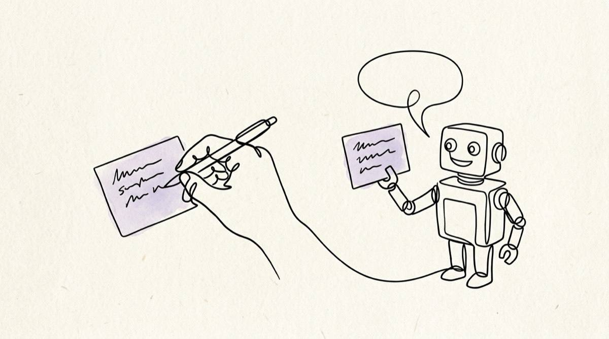
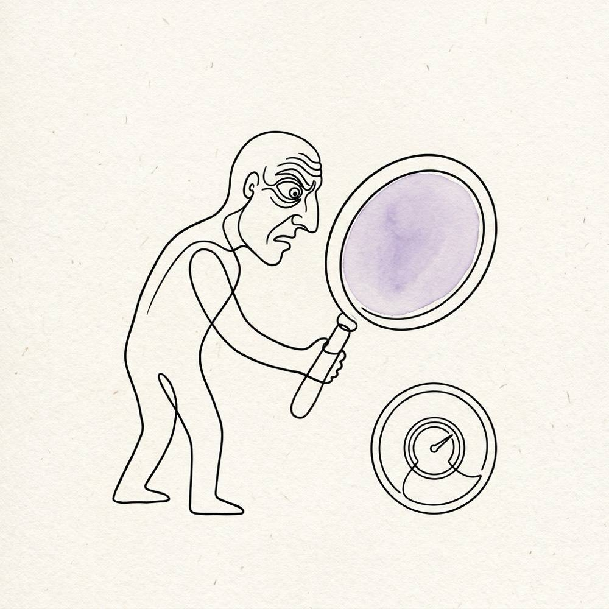

# The Context Engine

## Three kinds of context, three write rules, and a project that outlives the session, the harness, the model and the machine

**By Dr. Tali Režun**
Vice Dean of Frontier Technologies, [COTRUGLI Business School](https://cotrugli.eu/)
Serial Entrepreneur · AI Researcher · Builder of Second Brains

> The Curator now has a category line: the context engine. Your brain, your team's brain, your agents' brain — a local app that turns what you read into a compounding wiki, shares it with a cohort, and holds your projects' context so any agent, in any harness, resumes where the last one stopped. This article is about the third of those, the one I ran by hand for two years, and about what it took to measure whether it works.
>
> *From Lab to Life Series · The Curator: Article 10*

> **About the versions in this article.** It was written on 20 September 2026 against The Curator **v3.64.2**. This repository copy was prepared on 26 September 2026 against **v3.76.1**. In those six days I ran the first live tests of two agent tools and two computers working one project, and they found real failures. Where a fact has changed, the text says so and gives the date; the notes marked **Update, 26 September 2026** carry what the tests added. Nothing below claims more reach than was measured.


---

## Table of Contents

1. [Where we left off](#where-we-left-off)
2. [What The Curator is, in one minute](#what-the-curator-is-in-one-minute)
3. [The word we need first: agent harness](#the-word-we-need-first-agent-harness)
4. [Everything is code now, which is why this is not a coding article](#everything-is-code-now-which-is-why-this-is-not-a-coding-article)
5. [The ceiling nobody escapes](#the-ceiling-nobody-escapes)
6. [Three phases, and what each one needs to remember](#three-phases-and-what-each-one-needs-to-remember)
7. [Three kinds of context, three write rules](#three-kinds-of-context-three-write-rules)
8. [The loop, once per session](#the-loop-once-per-session)
9. [What a standing brief actually looks like](#what-a-standing-brief-actually-looks-like)
10. [What a handoff actually looks like](#what-a-handoff-actually-looks-like)
11. [What it looks like on disk](#what-it-looks-like-on-disk)
12. [One bridge, two front doors](#one-bridge-two-front-doors)
13. [The hard problem is capture, not storage](#the-hard-problem-is-capture-not-storage)
14. [A number on the screen you can be embarrassed by](#a-number-on-the-screen-you-can-be-embarrassed-by)
15. [Two audiences under one roof](#two-audiences-under-one-roof)
16. [An aggregator of intelligence, pointed at your own material](#an-aggregator-of-intelligence-pointed-at-your-own-material)
17. [Why not just use your vendor's memory?](#why-not-just-use-your-vendors-memory)
18. [Two tools, two Macs: what the live tests found](#two-tools-two-macs-what-the-live-tests-found)
19. [Setting it up, honestly](#setting-it-up-honestly)
20. [What is not finished](#what-is-not-finished)
21. [Where this goes](#where-this-goes)
22. [Clarification: key terms](#clarification-key-terms)
23. [Sources and further reading](#sources-and-further-reading)
24. [About the Author](#about-the-author)
25. [Disclaimer](#disclaimer)

---

## Where we left off

The last article in this series was not about The Curator at all. It was about the website I built for it, and about a claim I still believe: a website is still the home of a digital product, and in the age of agents it is entering a renaissance rather than a decline. Before that, [*Where Your Context Lives*](./where-your-context-lives.md) described The Curator becoming a Mac application, with three layers of context sitting in one folder you own. Before that, [*The Handoff Writes Itself*](./the-handoff-writes-itself.md) introduced the layer this article is really about, back when it was a few weeks old and mostly still a design.

I am writing this one because in the past weeks the thing all of those articles were circling has become the product rather than a feature inside it. The Curator now has a category line, and it is not a slogan I chose because I liked the sound of it. It is the shortest honest description of what the app does:

> **The Curator — the context engine.** Your brain. Your team's brain. Your agents' brain. A local app that turns what you read into a compounding wiki, shares it with a cohort, and holds your projects' context — foundations, working state and knowledge — so any agent, in any harness, resumes where the last one stopped. Plain markdown, in your own repo.

The version running on my machine when I wrote this was v3.64.2; this copy is checked against v3.76.1. The repository sat at 94 stars and 15 forks on 20 September 2026. Those are small numbers, and I keep saying so, because the people behind them have shaped this product more than any roadmap I wrote.

---

## What The Curator is, in one minute

If this is the first article of the series you have opened, here is the whole thing compressed.


The Curator is a local application you run yourself. You drop in the things you read — PDFs, Markdown and text files: articles, papers, notes, transcripts — and it [writes a connected wiki out of them](../../docs/ingestion-pipeline.md). A page for every person, tool and idea worth one, all linked to each other. The critical property is that a new source updates the pages that already exist instead of adding another copy beside them. Feed it twenty articles about the same field and you do not get twenty summaries; you get a graph that got deeper twenty times.

Everything it writes is plain markdown in a folder you chose. [Obsidian](https://obsidian.md) opens it and draws the graph. [Your own private GitHub repository](../../docs/sync.md) syncs it. There is no account, no database, no server of mine anywhere in the picture, and you bring your own model API key. The idea did not start with me: it started with [a short thought experiment by Andrej Karpathy](https://gist.github.com/karpathy/442a6bf555914893e9891c11519de94f) about using a language model to continuously build and maintain a wiki rather than to search documents on demand. I took that idea and [built it in public](https://github.com/talirezun/the-curator), and it has been running in public since April.

That was the whole app for the first six months. Researchers, writers, scientists and content creators were the audience I had in mind, and they still are. What changed this summer is that the same machinery turned out to solve a second problem, one I had been solving by hand for two years, and it is the problem almost everyone building seriously with AI runs into within a week.

---

## The word we need first: agent harness

A language model, on its own, is a chat engine. It answers and then it is finished. What turns it into something that can build an application, refactor a repository, run a research programme or draft a book is everything wrapped around it: tool access, file access, permissions, a terminal, a loop, an interface, and some notion of memory. That wrapper is the **agent harness**.

Claude Code, Codex, Cursor, Cline, opencode, Antigravity, Gemini CLI, the DeepSeek agent — these are harnesses. New ones appear every month, and I expect every capable model to eventually arrive with one, because the harness is where the value now accumulates. The same model behaves differently in two different harnesses, and a harness can usually run more than one model. I have a dedicated article on this, so I will not repeat it here; what matters for this piece is one sentence.

> **The harness gives the model its tools and its memory — which means that when you leave the harness, you leave its memory behind.**

---

## Everything is code now, which is why this is not a coding article

There is an assumption I want to dismantle before going further, because it is the reason many readers skip anything that mentions coding agents.

In 2026, code is the substrate of digital work rather than a specialist discipline inside it. Design is code — a design system is tokens, and a mockup compiles to a component. Websites are code. Documents, decks, data pipelines, research notebooks, financial models, simulations, teaching material, a whole product website with an assistant grounded in its own documentation: all of it is produced, today, by giving an agent context and letting it write files.

So when I describe a problem that shows up in coding agents, I am not describing a problem for programmers. Building software is the loudest case, not the definition. The definition is this: **any task big enough to take more than one sitting, done with an agent harness, is a multi-session task — and multi-session is where context goes to die.**

Write a book with an agent. Run a literature review across two hundred papers. Design a brand and then generate a website, a deck, a one-pager and a set of social visuals from it. Build an investment memo across three months of diligence. Every one of those outlives a single LLM session, and every one of them fails in exactly the same way when the session ends.

---

## The ceiling nobody escapes

For two years I have run the same discipline by hand, and I have written about it repeatedly, so I will state it compactly.

A model holds a context window. Everything the session knows lives in it. The advertised number has grown spectacularly — a million tokens is now ordinary where two hundred thousand was generous eighteen months ago — and this has made people believe the problem is solved. It is not, for two reasons.

The first is that **usable context is smaller than advertised context**. Output quality degrades well before the ceiling: the model starts contradicting a decision it made two hours earlier, quietly regenerating work it already did, or re-asking a question that was answered. I call this context rot, and it is the reason my own rule has nothing to do with the limit. I do not run to the ceiling. Around 80% of the window I stop and hand off.

The second reason is more structural, and no context window size fixes it. **A session ends.** When you open the next one, the window is empty. It does not matter whether the window holds 200,000 tokens or ten million; the second session starts at zero. And if the next session happens in a different harness, on a different model, or on a different machine, it starts at zero in a place that has never heard of the first one.

> **The context window is not the constraint. The session boundary is the constraint, and every tool on the market draws that boundary inside its own product.**

For two years my answer was manual and it worked. At around 80% of the window I would ask the agent to write an in-depth handoff file: a short recap of what we had been doing, a clear statement of where things stand, what was decided, what was ruled out, and what the next steps are. Markdown, dated, in the repository. The next session began by reading that file, and then everything else followed — the architecture document when the work needed it, the roadmap when the agent risked drifting.

It worked, and it cost me something every single day. The Curator is the automation of that process — as much of it as can honestly be automated, which turns out to be less than I would like, and I will be precise about that later.

---

## Three phases, and what each one needs to remember

Everything below rests on a working method I have described at length in *Context Is the Code* and in [Chapter 01 of my Field Notes](https://fieldnotes.talirezun.com/context-engineering). Every project I build, of any kind, runs in three phases:

- **Phase 1 — Research, Design and Foundations.** I use AI to produce the foundational documentation: architecture, blueprint, features, UI and UX, security, deployment, scaling. Markdown files, fine-tuned before any building starts.
- **Phase 2 — The Build.** Orchestrated agents, working against those documents, with a handoff written before every context ceiling.
- **Phase 3 — Debug, Audit and Deploy.** Ideally with a different model than the one that built it, because a model auditing its own work is the weakest audit available.

Each phase needs a different kind of memory, and this is the observation the whole product turns on. Phase 1 produces documents that must be carried word for word and evolve deliberately. Phase 2 produces state that must be replaced, never accumulated, because a blocker resolved on Tuesday must not be resurrected on Wednesday. And running underneath all three is the knowledge you have built up over months and years, which must accumulate, because that is what knowledge does.

Three kinds of context. Three completely different rules about what happens when you write to them. Get that distinction wrong and the store quietly destroys its own value.

---

## Three kinds of context, three write rules


This is the most useful table in the product, and [the one thing to learn](../../docs/user-guide.md#the-three-kinds-of-context-it-carries) before using any of it.

| Kind | What it holds | Write rule | How it arrives |
|---|---|---|---|
| **[Foundations](../../docs/working-state.md#the-foundations-tier--canonical-documents-that-travel)** | A project's canonical documents: architecture, decisions, conventions, roadmap, API surface | **Replaced whole** — held verbatim, never merged, never paraphrased, never summarised by a model | **Added**: mirrored byte for byte from a folder or a GitHub repository, imported from a file, seeded as skeletons, or written by you in the app |
| **[Working state](../../docs/working-state.md)** | The standing brief, the latest handoff, the journal — where the work stands right now | **Supersedes** — each save replaces the last, so a resolved blocker cannot come back | **Saved** by an agent over the bridge, or from a shell |
| **Knowledge** | The wiki: entities, concepts and summaries, cross-linked into a graph | **Accumulates** — a new source deepens the pages that exist instead of duplicating them | **Ingested**: you drop in a PDF, a markdown file or a text file |

The verbs matter more than the layers, and two of them are opposites. *Ingest* sends a file through a model and writes wiki pages out of it — the original is never the product. *Add* keeps a document exactly as it is — the original is the product. For a year the app had one front door for both, which was wrong, and correcting it is what the foundations tier is. (On screen, since the redesigns that followed v3.64.2, step ① reads **Documents** and step ② reads **Memory**; the rules are unchanged.)

The rule I ask people to memorise is shorter: **[state supersedes, knowledge accumulates](../../docs/user-guide.md#the-one-rule-that-matters-state-versus-knowledge)**. A wiki page unions its bullets — every ingest adds and nothing is dropped, which is exactly right for knowledge and exactly wrong for a handoff, because a union merge has no way of saying *this is no longer true*. So the handoff overwrites. Put something durable into working state and the next save takes it, with no warning, because from the store's point of view overwriting is precisely what it is for.

And the newest of the three, foundations, has a rule of its own that is not a technicality: **no model ever rewrites a canonical document.** Nothing lands in that layer without the owner's approval. An agent may draft one when you commission it, and you approve it in the app's own editor. The layer is added to, never ingested into.

---

## The loop, once per session

Three kinds of context are only useful if there is a ritual simple enough that an agent performs it without being nagged. There is, and it has two moves.

### One call at the start

A cold session — any harness, any model, any machine — makes a single call, `get_project_context`, and receives three things at once: the standing brief, the latest handoff, and the canonical documents it either has never read or has not read since they changed. Not a search. Not a retrieval step the model has to think of. One call, one response, and the agent is now as informed as the session that stopped yesterday.

Since v3.62.0 you also choose which foundations arrive automatically. Mark a document **read first** and its text reaches every session; everything else arrives as an index the agent opens by name when the work calls for it ([the reading plan](../../docs/working-state.md#the-reading-plan-read-first-documents-and-fetch-by-name)). A project's brief can carry a *"Read before you…"* section saying which document suits which kind of work, and since v3.67.0 the app can suggest a reading plan for you to review. This matters more than it sounds: handing an agent every document you own is a way of spending its context window before it has done anything.

> **Update, 26 September 2026.** "At the start" turned out to be too narrow. In the two-Mac test, a conversation that was already open was told *"continue"* after the other Mac had saved a newer handoff — and it did not read again, because to that conversation the session had started hours earlier. Since v3.76.1 the agent instructions say to call `get_project_context` again on *continue*, *resume*, or after a pause. Measured the same day, headless, with a newer handoff written between two turns: Sonnet 5 re-read first in **0 of 8** runs before the change and **8 of 8** after, and none of the eight acted on the other tool's next step without asking. On Haiku 4.5 (N = 4) the change moved nothing measurable. The protocol and the table are in [the working-state reference](../../docs/working-state.md#activation-put-the-discipline-where-the-harness-cannot-skip-it).

### A complete save before the stop

Before the session ends — at a context ceiling, at a compaction, at the end of a task — the agent saves the handoff. The save is complete rather than a delta, and it replaces the previous one rather than being appended to it. It is idempotent, which is why the instruction everywhere in my briefs is **save early and save often**: a save that turns out to be unnecessary costs nothing.

There is a deliberate asymmetry in the failure mode here and it is the reason no enforcement exists. A missed save yields the previous state — stale, never corrupted, and nothing already written is lost. A forced or fabricated save could give you a handoff that is confidently wrong, which is worse than no handoff at all. So capture is advisory by design, and the fail-safe direction points at staleness rather than at corruption.

---

## What a standing brief actually looks like

The standing brief is the layer people underestimate, so I am going to show you mine. It is one file per project, it sits at the root of the state folder with no scope segment, and it is returned on every read no matter which work-stream the agent asks about. [It is the owner's document](../../docs/working-state.md#tier-1-is-not-tier-2-the-brief-is-the-owners): you write it by hand, or you commission an agent to write it through `save_project_brief`, and the file records which of the two happened. Either way it carries your authority, because the rules of engagement are the owner's to set.

It has four parts: the standing brief itself, how I want the agent to work, firm decisions that must not be re-litigated, and pointers to where the depth lives. Here is a lightly trimmed extract from the real one for The Curator:

```markdown
## How I want you to work — standing instructions

- Rule one: the app is in production. Test end to end, in depth,
  BEFORE pushing to main or bumping the version. Depth of verification
  outranks speed of shipping, every time.
- A claim about a model's behaviour must be MEASURED, not reasoned about.
- You are the orchestrator; you do not build. Delegate. Give each agent
  strictly disjoint file ownership and name in every brief which files
  other agents hold. If your harness cannot spawn subagents, say so in
  your first reply — do not quietly build it yourself.
- Give each parallel agent its own git worktree. Agents sharing one
  working tree can destroy each other's uncommitted work.
- Context budget: a session starts near 10% and must hand off by ~80%.
  Save state early and often; a save overwrites, so it is idempotent.
- Read these directives back. In your FIRST reply, restate in one line
  the standing directives you are adopting, and name any you cannot
  follow here. A dropped directive is dropped silently.
- Never resolve a conflict silently. If an instruction here conflicts
  with your own harness or system rules, say so and ask.

## Firm decisions — do not re-litigate

- State SUPERSEDES; knowledge ACCUMULATES. Two separate stores.
- The app is READ-ONLY over working state; agents write it over MCP.
- Capture is skill-instructed and ADVISORY. A missed save yields the
  PREVIOUS state, never a corrupted one.
- Foundations are added, never ingested.
- Claims of harness reach are measured, never asserted; unmeasured is
  labelled unmeasured.
```

Three things in that extract do more work than the rest, and they generalise to any project, in any field.

- **Read these directives back.** A dropped instruction is dropped silently. One line in the first reply makes it visible while correcting it still costs nothing. ([Why this works](../../docs/user-guide.md#1-read-back--say-what-rules-youre-following).)
- **Never resolve a conflict silently.** Where my instruction clashes with the harness's own rules, I want to be told rather than have it decided quietly in either direction. The silence is the defect, not the choice.
- **Instruct agents to check the reasoning they are given rather than agree with it.** Across this project's sessions, agents have corrected me dozens of times and every correction improved the result — including catching a proposed colour token that failed accessibility in all ten of its cases, and refusing outright to document a field that did not exist.

One firm decision in that list has since grown a recorded exception: the app still never writes a handoff, but since v3.75.0 it can move one you choose into The Curator's trash, typed and previewed first ([deleting a handoff](../../docs/user-guide.md#deleting-a-handoff)).

---

## What a handoff actually looks like



The handoff is the volatile half. Here is a trimmed extract of a real one, with the machine identifier generalised. Note what it contains and, more importantly, what kind of sentences they are: not a summary of the conversation, but a set of claims a cold agent can act on.

```markdown
# Working state — session-2026-08-29-ux-polish

> v3.19.0 released, main GREEN. Design branch pushed with 3 commits at
> 107/107, NOT merged. First task next session: a guard that cannot
> fail, proven by my own mutation.

_Machine: <hostname>-<install-id> · Scope: session-2026-08-29-ux-polish
 · Harness: claude-code · Model: opus_

## Traps and dead ends

- A GUARD COMMISSIONED TO ENFORCE ADOPTION DID NOT BITE — reverting a
  call site to a raw div left its suite GREEN. Always mutation-prove a
  guard you commissioned; a report saying it exists is not evidence.
- RESTORE A MUTATION BY COPY, NEVER `git checkout --`. It reverts to
  HEAD and destroys other uncommitted work. Bit TWICE today, the second
  time inside the fix for the first.
- THE MACHINE SLEEPING KILLS LONG-RUNNING AGENTS MID-TASK — two of
  three died today. The dangerous moment is mid-mutation.
- MEASURING YOUR OWN POST-CHANGE STYLESHEET IS NOT MEASURING THE
  DEFECT. Reproduce the original state before claiming a fix.

## Next steps

- FIRST TASK, proven necessary rather than suspected: close the
  adoption guard that cannot fail. Assert CALL SITES, not the import
  line — an import is satisfied by a file that never invokes it.
- SECOND: finish or revert commit 1795065. Five files are unverified.
- BEFORE ANY MERGE: dispatch the live CI job on the branch.
```

That traps section is the part I would not give up. It is the accumulated cost of a day, written down in the one place the next session will definitely look. Without it, the next agent — very possibly a different model in a different tool — rediscovers each trap at full price. With it, the cost was paid once.

There is a discipline in writing those sentences, and it is worth stating: **a handoff is not a diary.** Every line is either a decision, an observation with a way to recheck it, a trap with the evidence that proved it, or a next step with the reason it is next. Prose about how the session felt is noise that costs context window on the other side. The full grammar is in [the sections a handoff carries](../../docs/working-state.md#the-sections-a-handoff-carries).

---

## What it looks like on disk

Nothing above is a database. This is the entire storage design, and I show it because the moment people see it the product stops being mysterious:

```
domains/<domain>/
  wiki/                                the knowledge — entities,
                                       concepts, summaries
  state/<project>/
    project.md                         the standing brief — one per
                                       project, the owner's
    foundations/                       canonical documents, verbatim
    <scope>/<machine>/current.md       the handoff — overwritten on
                                       every save
    <scope>/<machine>/journal.jsonl    one line per save, append-only
    <scope>/<machine>/previous.md      since v3.74.0: one kept copy of
                                       a handoff another tool replaced
```

[A scope](../../docs/working-state.md#scopes) is one work-stream inside a project; three features of one product are three scopes, and they all share one brief. The `<machine>` segment is load-bearing rather than cosmetic: it is a hostname slug plus an install id, and it is [what makes two computers syncing the same repository safe to merge](../../docs/working-state.md#why-machine-is-in-the-path). Two machines writing the same file is a conflict; two machines writing their own file is a fact.

> **Update, 26 September 2026.** The machine segment protects two computers from each other. It does not protect two agent tools on *one* computer, because there is no tool name in the path — and the live test on 25 September found exactly that gap (the story is [below](#two-tools-two-macs-what-the-live-tests-found)). Two changes followed. Since v3.74.0, a save that replaces a handoff last written by a different tool still succeeds, but says whose handoff it replaced and keeps the replaced text once as `previous.md`. Since v3.76.0, a save that names no scope goes to a scope named after the tool that saved it — `claude-code`, `antigravity` — rather than to a shared `main`. [How to organise your scopes](../../docs/user-guide.md#how-to-organise-your-work-streams-scopes) has six naming patterns, each with the line to paste into your brief.

![The Project context view on the synthetic demo workspace. The sidebar lists an active project, exhibit-site, written by Claude Code and Antigravity, and an idle one. The overview card reads 2 documents, memory saved 8 minutes ago by claude-code, 29 knowledge pages, 8 agent connections over the last 5 days, and a session start of about 3.2k tokens. Step 2, Memory, shows an Agent connections row, the line Saves by tool, last 7 days: Claude Code 4, Antigravity 3, and a Handoffs table with three scopes — claude-code, main and antigravity — each with its machine, harness and model, age and size.](../../docs/images/curator-agent-memory.png)

*Project context in v3.76, on the synthetic demo workspace the documentation screenshots are built from: step ① Documents, step ② Memory, step ③ Knowledge. Note the Handoffs table: one scope per tool, and a `main` scope written by Antigravity.*

That is it. Plain files, in a folder you chose, synced through your own private GitHub repository. Any editor opens them. If the app disappeared tomorrow, you would still have everything, and that is not a marketing point — it is the entire architectural argument. Claude Projects, ChatGPT Projects and Cursor rules each hold your accumulated context inside one vendor's product, and you leave it behind on the day you switch. There is nothing here to leave behind, because the files are the product and the app is a convenience over them.

---

## One bridge, two front doors

The app is one way in. It is not the important one.

The important one is **[My Curator MCP](../../docs/mcp-user-guide.md)**: a standalone local bridge, a small child process your agent tool launches itself. It needs no running app, no network and no credential, and it is how any harness that speaks the Model Context Protocol — Claude Code, Claude Desktop, Cursor, Codex, Antigravity, opencode and the rest — reads and writes the same files. It exposes [24 tools](../../docs/mcp-user-guide.md#what-it-does): seventeen that read and seven that write. (That count was the same at v3.64.2 and at v3.76.1; on 25 September Antigravity listed all 24.)

The read side is what matters most, and I want to be blunt about why. Writing knowledge through an agent is a convenience. Reading context through one is the product. Seventeen read tools mean an agent can fetch a project's bootstrap, walk the graph outward from a page, pull backlinks, search across every domain at once, or retrieve the original source a summary was built from — without a single byte leaving your machine.

And since v3.63.0 there is a second local client that is not an MCP client at all: a command, **[`my-curator`](../../docs/user-guide.md#the-command-my-curator)**. `my-curator context` prints a project's bootstrap to standard output; `my-curator save` writes a complete handoff from standard input; `my-curator doctor` tells you what is actually wired on this machine and writes nothing. It exists because a harness that cannot speak MCP can still run a shell command, and because the store should not require my app to be running in order to be useful. (It ships with a source install; the downloadable Mac app carries the bridge but not the command.)

Both doors write the same path, with the same provenance shape, under the same single-writer rule. The app itself stays deliberately read-only over working state and foundations: a browser write path would make the app a second writer, and the whole sync-safety argument rests on there being exactly one writer per file. (The app's legitimate writes — the brief, curator-owned documents, the reading flags — and the one recorded exception, deleting a handoff into the trash, are [listed in the reference](../../docs/working-state.md#6-what-the-app-writes-and-what-it-does-not).)

The format is public, too. [The on-disk contract](../../docs/spec/working-state-v1.md) — the layout, the machine-name rule and the merge hazard it prevents, the section grammar, the budgets, the manifest schema — is published as a specification in the repository, and a test suite parses that document against the live constants on every run so it cannot quietly drift from the code. A tool that is not The Curator can read and write your working state without this codebase. That is the opposite of a moat, and it is intentional. What has not happened yet is the acceptance run: a writer built by somebody else, from the specification alone.

---

## The hard problem is capture, not storage



Here is where I have to be more honest than a product article usually is.

Storing context was never the difficult part. Reading it back is not difficult either. The hard problem is that state exists only if agents actually save it — and an agent that has an instruction to save is not the same thing as an agent that saves.

So I [measured it](../../docs/working-state.md#activation-put-the-discipline-where-the-harness-cannot-skip-it) rather than assuming it. On 10 September 2026, across sixteen headless runs, an agent on one popular harness saved a handoff in 0 of 4 runs from the installed skill alone — with no error, no refusal, nothing on screen to tell you it had not happened. With a short instruction block pasted into the harness's own entry file, the same harness saved in 3 of 4. Another harness, which loads skills itself, was 4 of 4 either way. On 20 September 2026 a second campaign added the arm the first could not run — with lifecycle hooks installed as well:

| Arm (Claude Code, headless, N = 4) | Started with the context | Saved before stopping |
|---|---|---|
| Installed skill alone (10 September) | — | 0 of 4 |
| Skill + instruction block in the entry file (10 September) | — | 3 of 4 |
| Skill + block + lifecycle hooks installed (20 September) | 4 of 4 | 4 of 4 |

In the same mode, the stop hook never fired at all — not once across six headless sessions — and without the hook, five of six save attempts ran a shell command named after the tool instead of calling the tool. That is the sort of finding you only get by running the thing.

> **Update, 26 September 2026.** Two more campaigns have run since, both on Claude Code, headless. On 25 September the instruction block was changed to tell each tool to save under a scope named for itself, and re-measured before it shipped: **Sonnet 5 read and saved in 8 of 8 runs, every save in its own tool's scope; Haiku 4.5 read and saved in 5 of 8**, and two of those five named the shared `main` scope explicitly. On 26 September the re-read-on-continue sentence was measured (above). These are small, dated readings: N = 8 or fewer, one task, headless only.

Four words describe what a hook can do on any given harness, and the honest answer is a table rather than a promise. [The adapter table](../../docs/working-state.md#which-harnesses-get-hooks-written) now has fifteen rows, and they disagree about almost everything: one harness caps its session-end hook at three seconds, which is not long enough to finish a save; on others a hook is accepted and never fires, or the only hooks are plugins rather than shell commands. At v3.64.2 exactly one of those rows carried a real measurement — Claude Code, on 20 September. That is still true of the table at v3.76.1.

> **Update, 26 September 2026.** Antigravity got its own row in v3.76.0, built from the vendor's own documentation and marked *not yet run*. On 26 September I saw its session-start hook work, from a project-level `.agents/hooks.json`: the context arrived at the start of the conversation. That is a single observation on my own machine, not the four-runs-per-arm protocol, and the end-of-session ask has **not** been observed yet. The row still reads unmeasured, and so should you.

A hook may **ask**, **inject** or **record**. It may never compose a handoff — because a fabricated handoff is worse than a missing one. The whole contract of the store is that what was written was written by whoever it names.

I am aware that publishing a 0-of-4 measurement about my own feature is an unusual marketing decision. It is the only decision available to me. The Agent Skills standard existing does not mean a given host implements it, and a claim of reach that has not been measured is a claim I would eventually have to withdraw in front of someone who trusted it.

---

## A number on the screen you can be embarrassed by

Measuring it once in a lab is not enough, because the question is not whether capture works in general. It is whether capture is working on *your* project, this month.

So the app now carries a reading. When I wrote this, the Working state step of Project context opened with one line, computed from a local, content-free log of which tools were called:

```
CAPTURE
6 sessions in the last 30 days
4 started with the context · 4 saved before stopping ·
2 read and did not save

25 self-test calls excluded
```

Three deliberate choices sit inside that small block.

- **It is in words, never a percentage.** "67%" reads as a grade. "2 read and did not save" reads as two sessions you can go and look at. A reading and a judgement are different things, and the app must not dress one as the other.
- **It reports and never blocks.** A meter that could refuse a session would be the enforcement the fail-safe rule forbids.
- **It tells apart three states rather than blurring them:** no usage log on this computer yet; a log exists and there was no session for this project in the window; and the real reading. Only the third gets a freshness mark, and that mark is the age of the newest session — never a grade derived from the ratio.

It also states what it cannot see, on the screen rather than only in the documentation. It counts what went through the bridge, so a save made from the shell leaves no line and a session that never opened the bridge is not in the denominator either. The harness name is self-reported by the client and nothing in the app branches on it. Calls made before the release that introduced session ids are reported as legacy lines and never invented into sessions. And pressing **Test all 24 tools** on the settings screen is excluded outright, because a button press must never report a session that read and saved. ([The meter's definitions](../../docs/working-state.md#the-honesty-meter--did-this-session-read-and-did-it-save).)

> **Update, 26 September 2026.** The row applied its own rule to itself. What it counts is one bridge process — one *connection* — and a connection is not always one conversation, so since v3.74.0 the row reads **Agent connections**, and its window names where the log actually begins ("last 5 days · log begins 20 Sep") instead of claiming thirty days over five days of log. The step it sits in is now called **Memory** (see the screenshot above).

I use this reading on my own projects daily, and it has twice told me something I did not want to know. That is the point of instruments.

---

## Two audiences under one roof

The app now opens onto two doors, and neither is a mode you switch into. They are [two ways into the same files](../../docs/user-guide.md#two-ways-in).

| If you… | You want | Your unit of work |
|---|---|---|
| **read a lot** | Turn what you read into something that compounds. Drop in PDFs, markdown and text; get a linked wiki you can chat with, see in Obsidian, sync to your own repository and share with a cohort | [A domain](../../docs/domains.md#1-what-is-a-domain) |
| **work across sessions** | Give a project context that outlives the session. Add the documents the project is built against; let agents read them and save a handoff. The next session — any harness, any model, any machine — starts where the last one stopped | A project inside a domain |

These are not two products and I resisted every suggestion to split them. A book, a thesis or a research programme outlives any one session, which is the day the second audience becomes the first audience's future. They share one folder, one sync, one backup, one editor and one bridge. Splitting them would mean two of everything and a boundary the user has to manage by hand.

In v3.64.0 the navigation rail became [three entries](../../docs/user-guide.md#7b-the-three-places--ask-knowledge-context), each answering a different question: **Chat** is *ask*, **Domains** is *knowledge*, **Context** is *context*. Ingest and Shared Brain did not disappear; they moved onto the page of the domain they already describe, which is where they always belonged.


*The knowledge half: one domain's page, on the demo workspace. Ingest is the first numbered section, and the Pages list can be filtered to the memory pages a project keeps in the same domain.*

---

## An aggregator of intelligence, pointed at your own material

One feature deserves more attention than it usually gets in these articles, because it changes what the wiki is for.

The Curator talks to three providers: Gemini, Anthropic, and OpenRouter — and OpenRouter is an aggregator rather than a vendor, which means one key reaches models from many companies at once. On [one measured refresh in late August 2026](../../docs/user-guide.md#openrouter--one-key-two-lanes-and-a-model-list-you-refresh), the chat model picker went from 3 models to 192 after structural filtering of OpenRouter's live catalogue. I will not print a standing number, because that catalogue moved by seven records inside five hours on the day it was measured. What is stable is the method, not the count.

The consequence is what matters. Your compounding wiki, your foundational documents, your handoffs and your projects are all reachable, in one chat, by whichever intelligence you want to point at them today. And as new models appear on those providers, they become available to your existing body of work without you moving anything. Your material stays put; the intelligence reading it improves underneath you.

There is a discipline behind which model is offered for what, and it is worth one paragraph because it is unusual. **A model may not be offered for a job it has never been measured doing.** Chat and wiki-building are two lanes with two admission standards: the build lane — ingest, health scans, compile — admits only models hand-measured against the real ingest prompt, because a bad chat answer costs one visible answer while a bad ingest writes pages into your wiki permanently and you already paid for it. Price is displayed as a fact and never used as a quality gate, and a model measured to be poor stays pickable with its reason on the screen rather than being hidden. ([Model lifecycle](../../docs/model-lifecycle.md) has the whole policy.)

---

## Why not just use your vendor's memory?

It is a fair question, and it is getting fairer every month, because the labs are building exactly this into their own products. In August 2026 Anthropic unified Claude's memory across chat and Cowork, and exposed what it retains in settings so you can read, edit or delete it by topic. That is genuinely good work, and it will solve the problem for a large number of people. If everything you do happens inside one product, use it.

Here is what it cannot do, and it is not a criticism — it is a structural fact about who builds it and why. A vendor's memory lives inside the vendor's product. It will not carry your project into a different harness, to a different lab's model, or onto a machine running something else. It cannot, because the commercial reason for building it is to make the product stickier. Nothing wrong with that; it is simply a different objective from mine.

And the objective matters, because of a fact about models that everyone building seriously has now noticed: they are not interchangeable and they are not equally good at everything. Some are better at building, some at auditing, some at long-context reasoning, some at speed. More importantly, the same model can barely audit its own work objectively. I used to do all my auditing with GPT for precisely this reason; today I get excellent audit results from frontier open-weight models — GLM, Qwen, DeepSeek — as well. The best results come from using several, deliberately.

> **Mixing harnesses used to be prohibitively expensive, and the cost was never the subscription. The cost was context — re-explaining the project every time you crossed a boundary.**

That is the cost this layer is meant to remove. When I wrote this, I was building two of my own projects with three harnesses at once — Claude Code, Antigravity and Codex — all reading and writing context through The Curator, and I said that the handover between them was a property of the design that I had not yet put through a deliberate test. Six days later, two of those three had been through one. The next section is what it found.

---

## Two tools, two Macs: what the live tests found

*This section is new in the repository copy. Every result in it is from my own live tests on 25 and 26 September 2026, on my own projects, and each fix it names shipped the same or the following day. The release rows in [CHANGELOG-ARCHIVE.md](../../CHANGELOG-ARCHIVE.md) (v3.74.0) and [CLAUDE.md](../../CLAUDE.md) (v3.76.0, v3.76.1) carry the evidence in full.*

**One Mac, two tools (25 September).** Claude Code and Antigravity handed one project back and forth: Claude Code → Antigravity → Claude Code. With the agent-instructions block in `AGENTS.md`, Antigravity called `get_project_context` on a bare *"Continue."* and saved under its own scope, `antigravity`, without being told to. Each tool kept its own scope; neither overwrote the other.

**What broke on one Mac.** On a project with *no* `AGENTS.md`, Antigravity still read and saved unprompted — but to the shared scope `main`, silently replacing Claude Code's handoff there (3.8 KB became 2.4 KB; the replaced text was gone). The reply said only that it had overwritten the previous save, which every save says. Antigravity's own documentation says it reads `AGENTS.md` and `GEMINI.md`, not `CLAUDE.md`, so a block pasted only into `CLAUDE.md` does not reach it. The menu bar widget of the day counted two tools as four or five, because each spelled its own name differently.

**Across two Macs (26 September).** Claude Code on one Mac saved and synced through Personal Sync; on the other Mac a *new* Antigravity conversation read first and opened the newest handoff — newest by the agents' own recorded save times, not by file dates that a sync rewrites — and each Mac's copy stayed in its own machine folder. Then the same the other way round. The one gap was the already-open conversation that did not re-read on *continue*, described [above](#one-call-at-the-start).

| What the test exposed | What changed | Status on 26 September 2026 |
|---|---|---|
| Without `AGENTS.md`, Antigravity saved to `main` and replaced Claude Code's handoff | **v3.74.0**: a save that replaces another tool's handoff says whose, when and its headline, and keeps the replaced text once as [`previous.md`](../../docs/spec/working-state-v1.md#6b-previousmd--one-kept-copy-of-another-tools-handoff-v3740). **v3.76.0**: a save with no scope goes to a scope named for the tool that saved it | Warned and recoverable; an explicit shared scope can still reach the collision, by design |
| After a sync, an older handoff could open as "latest" (file dates) | **v3.74.0**: "latest" is ordered by the agent's recorded save time | Held across two Macs on 26 September |
| One tool, several spellings, counted as several tools | **v3.74.0**: one normaliser for tool names, used by the app and the widget | — |
| An open conversation did not re-read on "continue" | **v3.76.1**: the instructions say to re-read on continue, resume, or after a pause | Sonnet 5: 0 of 8 → 8 of 8. Haiku 4.5: no measurable change |
| Antigravity had no hook adapter | **v3.76.0**: an Antigravity row, `install-hooks antigravity`, a `doctor` check | Session-start hook seen working once (26 September); the end-of-session ask not yet observed |

What this does **not** show. It shows one person, two tools and two computers. It does not show two people working one project, and it does not show Codex, Cursor or opencode in a live handover — opencode has only been measured headless, where it switched the continuity skill on by itself in 4 of 4 runs. It does not show that an agent notices a save made elsewhere without calling the tool: there is no push notification, and an agent sees another tool's save only when it reads. The practical setup that made the two-tool, two-Mac case work — the block in both `CLAUDE.md` and `AGENTS.md`, a committed `.curator-project` marker, one scope per tool — is in [several agent tools on one computer](../../docs/user-guide.md#several-agent-tools-on-one-computer) and [building from two computers](../../docs/user-guide.md#how-do-i-build-from-two-computers); a step-by-step setup checklist joins [the user guide](../../docs/user-guide.md) as §13d in v3.77.0.

---

## Setting it up, honestly

The setup is short but it is not zero, and pretending otherwise helps nobody.

1. **Install.** On a Mac, [download the app](../../docs/mac-app.md#getting-the-packaged-app) and you are running in a couple of minutes. It is not yet notarised, so macOS will ask you to allow it — that is on my list. On Windows and Linux it runs as [a local server you open in your browser](../../README.md#option-c--manual-setup-windows--linux--mac): same code, same release, same features, no widget. If you are on either, [your own coding agent will install it for you](../../docs/user-guide.md#20-install-with-a-coding-agent) in about a minute.
2. **Point it at a folder** for your domains, and [connect your private GitHub repository for sync](../../docs/sync.md#first-time-setup-about-3-minutes). A few minutes. On a second computer, [set it up the same way](../../docs/sync.md#setting-up-on-a-second-computer).
3. **Add an API key.** The app runs on models and has to source them from somewhere. Gemini has a rate-limited free tier, and free routes exist for chat through OpenRouter — enough to try, not to work at volume. ([What it costs.](../../README.md#what-it-costs))
4. **Wire the bridge.** There is a wizard, but you will paste a block into your harness's JSON configuration — Claude, Antigravity, Codex, opencode or whichever you use ([setup, under two minutes](../../docs/mcp-user-guide.md#setup-under-2-minutes)). Your coding agent can do this for you, and `my-curator doctor` will tell you whether it actually took.
5. **Set up the context layer.** [Start a project](../../docs/user-guide.md#start-a-project), choose the folder or GitHub repository your foundational documents are mirrored from, and write the standing brief. Your agent can draft the brief; you approve it.
6. **Paste the agent instructions.** *(Added 26 September 2026.)* Press **Copy agent instructions** on the project and paste the block at the top of every instruction file your tools load — `CLAUDE.md` for Claude Code, `AGENTS.md` for Antigravity, Codex and opencode ([why both](../../docs/user-guide.md#do-i-need-both-claudemd-and-agentsmd); [what the block does](../../docs/user-guide.md#making-sure-your-agent-actually-does-it)). This is the step the live tests showed you cannot skip. Optionally, [install the hooks](../../docs/user-guide.md#hooks-what-they-can-do-on-your-harness-and-what-they-cannot) for your harness.

On a Mac there is one more thing I would not now work without: [the menu bar widget](../../docs/user-guide.md#6b-the-menu-bar-icon-mac-app). Since v3.74.0 it opens on a seven-day save pulse (with one strip per tool when more than one is saving), then one row per project and tool that saved in the last 24 hours — which tool, which model, how long ago, and the agent's own one-line headline — and a notice when two tools are writing the same work-stream. Everything idle is folded away. The app is low-resource and can be quit entirely — the bridge and the widget are enough for a working day. There is also a documentation site and a product website, [mycurator.xyz](https://mycurator.xyz), with an assistant that will walk you through setup, which was the subject of the previous article.

---

## What is not finished

A list, because every article in this series has one and it is the section I would read first. Updated to 26 September 2026.

- **Hook reach is measured on one harness.** Claude Code's row carries the only measurement in [the hooks table](../../docs/working-state.md#which-harnesses-get-hooks-written); the others read unmeasured and say so in the product. Antigravity's session-start hook has been seen working once; its end-of-session ask has not been seen.
- **Live handover is tested on two tools, not on the field.** Claude Code and Antigravity, on one Mac and across two, on 25–26 September. Codex, Cursor, opencode and local open-weight setups have not been through a live handover.
- **A small model follows the instructions less well.** On Haiku 4.5 the block saved in 5 of 8 headless runs, and the re-read sentence showed no measurable effect. On Sonnet 5 both were 8 of 8.
- **Multi-person work on one project is untested.** The design permits it. Nobody has run it.
- **The Mac app is not notarised yet.** You have to allow it to run.
- **Local open-weight models cannot yet run the app.** The model behind ingest needs roughly a 200k context window, and running that locally is resource-heavy enough that I have not moved there. I want to, and I am not going to ship it before it is genuinely good.
- **Foundations refresh from GitHub or a local checkout, and only when someone presses something.** *(Changed since writing: the original line here said a remote mirror needed a local checkout to start. Since v3.68.0 a project can [add documents straight from GitHub](../../docs/user-guide.md#canonical-documents-from-the-repository-instead-of-a-checkout).)* No other host, and no automatic refresh.
- **The published format has no independent writer yet.** The specification exists and is pinned to the code; nobody outside this repository has built a writer from it.
- **Capture is advisory and will stay advisory.** That is not a gap waiting to be closed; it is the fail-safe direction, chosen deliberately.

And the discipline that produced that list is worth naming, since it applies to anything you build with agents: **a false claim in a document is a first-class defect.** In this project several documents are read by models rather than by people, which means a wrong sentence in the documentation does not merely misinform a reader — it changes what an agent does. Documentation ships in the same release as the behaviour change, or the release is not finished. Preparing this copy found two sentences of my own that had become false in six days; they are corrected above, and the correction is marked.

---

## Where this goes

When I wrote this, the next release was meant to close loops rather than open them: a home dashboard, a cross-scope digest so a project with eighteen work-streams can be read at a glance, and the ability to promote a decision out of a handoff into the foundations layer where it will be carried verbatim from then on. As of v3.76.1 the digest and promote-to-foundation are [still planned](../../docs/roadmap-context-engine.md), not built. What shipped first instead was what the live tests demanded: per-tool scopes, the replaced-handoff warning, a truthful "latest", and the re-read on continue. After that, the measurement matrix — running the protocol on the harnesses that currently read not measured, one row at a time.

But the thing I built, I built because I needed it. For two years I ran this process by hand: foundational documents, a standing brief, hundreds of dated handoff files, and the discipline to write one before every ceiling. It worked, and it cost me something every day. The Curator is that process, automated as far as it can honestly be automated.

If there is one sentence to carry out of this article, it is not about my app. It is this: **without proper context you cannot get good results from AI.** That is not an opinion, it is the single most reliable observation I have from three years of building this way. Everything good downstream depends on context, and nearly everything bad downstream traces back to its absence.

Three layers, one format, one owner. You.

---

## Clarification: key terms

- **Context window** — the total text a model holds in working memory during one session. Usable context is smaller than the advertised number; quality degrades well before the ceiling.
- **Context rot** — the gradual decline in output quality as a session fills. The model starts contradicting earlier decisions and quietly regenerating work it already did.
- **Agent harness** — everything wrapped around a model that lets it operate: tool integrations, memory, permissions, interface. Claude Code, Codex, Cursor, Antigravity and opencode are harnesses; they can run different models, and the same model behaves differently in each.
- **[MCP (Model Context Protocol)](../../docs/mcp-user-guide.md)** — an open standard that lets an AI client launch a small local program and call its tools. My Curator MCP is one such program, running entirely on your machine.
- **[State supersedes; knowledge accumulates](../../docs/user-guide.md#the-one-rule-that-matters-state-versus-knowledge)** — the rule separating the wiki from working state. A wiki page grows with every ingest and drops nothing. A handoff is replaced on every save, because a union merge cannot express *this is no longer true*.
- **[Foundations](../../docs/working-state.md#the-foundations-tier--canonical-documents-that-travel)** — a project's canonical documents, held verbatim and replaced whole. Added, never ingested; no model rewrites them. Shown on screen as *Documents*.
- **[Scope](../../docs/user-guide.md#how-to-organise-your-work-streams-scopes)** — one work-stream inside a project, and the thing that holds a handoff. Several scopes share one standing brief. Since v3.76.0 a save that names none goes to a scope named after the tool that saved it.
- **Handoff** — the complete statement of where the work stands, written before a session ends and read by the next one. Overwritten on every save; since v3.74.0, a copy is kept once when a different tool's save replaces it.

---

## Sources and further reading

**The Curator** — open source, MIT licensed: [github.com/talirezun/the-curator](https://github.com/talirezun/the-curator) · product website and setup assistant: [mycurator.xyz](https://mycurator.xyz)

- [README](../../README.md) — what it is, [the quick start](../../README.md#quick-start) and [what it costs](../../README.md#what-it-costs)
- [The user guide](../../docs/user-guide.md) — in particular [§13b, working state](../../docs/user-guide.md#13b-working-state--carrying-context-between-sessions), [making sure your agent actually does it](../../docs/user-guide.md#making-sure-your-agent-actually-does-it) (the Copy agent instructions block), [how to organise your scopes](../../docs/user-guide.md#how-to-organise-your-work-streams-scopes), [§13c, the command, the hooks and the meter](../../docs/user-guide.md#13c-making-capture-real--the-command-the-hooks-and-the-meter), and [§15, sync across computers](../../docs/user-guide.md#15-sync-across-computers). A setup checklist for several tools and several computers arrives as §13d in v3.77.0
- [Working state — the technical reference](../../docs/working-state.md) — [the three tiers](../../docs/working-state.md#the-three-tiers), [the foundations tier](../../docs/working-state.md#the-foundations-tier--canonical-documents-that-travel), [when a save replaces another tool's handoff](../../docs/working-state.md#when-a-save-replaces-another-tools-handoff--warned-and-kept-once-v3740), [the activation measurements](../../docs/working-state.md#activation-put-the-discipline-where-the-harness-cannot-skip-it), [the hooks table](../../docs/working-state.md#which-harnesses-get-hooks-written), [Antigravity](../../docs/working-state.md#antigravity-v3760) and [the honesty meter](../../docs/working-state.md#the-honesty-meter--did-this-session-read-and-did-it-save)
- [`working-state/1` — the public on-disk format](../../docs/spec/working-state-v1.md)
- [My Curator MCP guide](../../docs/mcp-user-guide.md) — the 24 tools and [setup](../../docs/mcp-user-guide.md#setup-under-2-minutes)
- [Personal Sync](../../docs/sync.md) — and [why a state path carries a machine name](../../docs/sync.md#working-state-and-why-its-path-has-a-machine-name-in-it)
- [The Mac app](../../docs/mac-app.md) and [model lifecycle](../../docs/model-lifecycle.md)
- [Roadmap — the context engine](../../docs/roadmap-context-engine.md) — what is built, what is planned
- [The two agent skills](../../skills/README.md) — `my-curator` and `curator-continuity`
- [Research articles](../README.md) — the long-form essays that accompany the project

**Earlier articles in this series — From Lab to Life**

- *The Second Brain That Grows Smarter and Lives on Your Computer* — where the compounding wiki started · [GitHub version](./the-second-brain-that-grows-smarter.md)
- *Building Knowledge Immortality Through the Second Brain Architecture* — why structured knowledge is what survives · [GitHub version](./knowledge-immortality-second-brain.md)
- *From Graph to Intelligence: The My Curator MCP* — the bridge, and why a graph reads differently from a folder · [GitHub version](./from-graph-to-intelligence-my-curator-mcp.md)
- *The Agent Memory Problem — And Why Your Second Brain Might Be the Answer* — the landscape of attempts at agent memory · [GitHub version](./the-agent-memory-problem.md)
- *The Shared Brain: When Second Brains Start Thinking Together* — with Dražen Kapusta; the collective layer · [GitHub version](./the-shared-brain-thinking-together.md)
- *Second Brain to Shared Brain: Building a Neural Network of Your Own Knowledge* — seven weeks later, and what held up · [GitHub version](./neural-network-of-your-own-knowledge.md)
- *The Handoff Writes Itself* — the agent memory layer, when it shipped · [GitHub version](./the-handoff-writes-itself.md)
- *Where Your Context Lives* — three layers of context in one folder you own · [GitHub version](./where-your-context-lives.md)
- *Every Product Needs a Home* — building a modern product website with agents · [Substack](https://talirezun.substack.com)
- [Context Is the Code: The Complete Three-Phase Process for Building with AI Agents](https://talirezun.substack.com/p/context-is-the-code-the-complete) — the method this article assumes
- [The Mixed Fleet](https://talirezun.substack.com/p/the-mixed-fleet) — model specialisation, subscription lock-in, and the orchestrating harness that does not exist yet

**Field Notes** — [fieldnotes.talirezun.com](https://fieldnotes.talirezun.com)

- [Chapter 01 · Context Engineering](https://fieldnotes.talirezun.com/context-engineering)
- [Chapter 02 · Agent Memory and Second Brains](https://fieldnotes.talirezun.com/agent-memory)
- [Chapter 03 · Coding Agents and Harnesses](https://fieldnotes.talirezun.com/coding-agents)

**Other**

- Andrej Karpathy, [the LLM-wiki gist](https://gist.github.com/karpathy/442a6bf555914893e9891c11519de94f) — the original spark for the compounding wiki.
- Anthropic, *"Claude's memory works everywhere, and you decide what's in it"*, 25 August 2026 — the unification of memory across Claude chat and Cowork, referenced in [Why not just use your vendor's memory?](#why-not-just-use-your-vendors-memory) above.
- *Context & Memory Continuity for Coding Agents: A Chasing Jarvis Field Manual* — Vanguard MBA teaching material, COTRUGLI Business School. The manual version of the manual process this feature automates.

---

## About the Author

**Dr. Tali Režun** is a Serial Entrepreneur, Business Developer, and Academic at the forefront of frontier technologies. As Vice Dean of Frontier Technologies at [COTRUGLI Business School](https://cotrugli.eu/), he leads AI innovation initiatives and shapes MBA curricula for the next generation of technology leaders. With over 30 years of entrepreneurial experience — founding and scaling ventures including The Curator, Lumina AI, Moj AI, Block Labs, 4thTech, Immu3, PollinationX, and Online Guerrilla — he bridges cutting-edge research in AI and Web3 with practical business transformation.

**Tali's Links:**

- [talirezun.com](https://talirezun.com/)
- [X (formerly Twitter)](https://x.com/talirezun)
- [LinkedIn](https://www.linkedin.com/in/talirezun)
- [Substack](https://talirezun.substack.com/)
- [Field Notes](https://fieldnotes.talirezun.com/)
- [COTRUGLI Profile](https://cotrugli.org/talirezun/)
- [GitHub](https://github.com/talirezun/the-curator)

---

## Disclaimer

### Research and Educational Purpose

This article is published for research and educational purposes only. The content represents my own experiences, observations and analysis based on hands-on development and daily use of The Curator.

### No Commercial Relationships

I have not been compensated, sponsored, or otherwise financially supported by any of the companies, platforms, or tools mentioned in this article. All opinions, assessments, and recommendations are my own.

### Measurements

Every measurement reported here is dated and was taken against a named release; where something has not been measured, I have said so rather than implied a result. Figures described as measurements are small readings — N = 4 or N = 8 per condition, headless, one task — and are not benchmarks. The live tests of 25 and 26 September 2026 are single observations by one person on his own projects, not a protocol. The methods are set out in [the technical reference](../../docs/working-state.md#activation-put-the-discipline-where-the-harness-cannot-skip-it).

### Evolving Landscape

Figures that move between releases — star counts, model catalogues, prices, tool counts — are readings taken at a moment rather than constants. Version numbers and feature status reflect the project on 26 September 2026; check [github.com/talirezun/the-curator](https://github.com/talirezun/the-curator) for the current state.

---

**Dr. Tali Režun**
Vice Dean of Frontier Technologies, [COTRUGLI Business School](https://cotrugli.eu/)

*Published: September 2026 · repository copy updated 26 September 2026*
*Part of: [The Curator Research Series](https://github.com/talirezun/the-curator/tree/main/research)*
*Previous in series: [The Second Brain That Grows Smarter](./the-second-brain-that-grows-smarter.md) · [Building Knowledge Immortality](./knowledge-immortality-second-brain.md) · [From Graph to Intelligence](./from-graph-to-intelligence-my-curator-mcp.md) · [The Agent Memory Problem](./the-agent-memory-problem.md) · [The Shared Brain: When Second Brains Start Thinking Together](./the-shared-brain-thinking-together.md) · [Second Brain to Shared Brain](./neural-network-of-your-own-knowledge.md) · [The Handoff Writes Itself](./the-handoff-writes-itself.md) · [Where Your Context Lives](./where-your-context-lives.md)*
*Open source | Local-first | Privacy-first*
